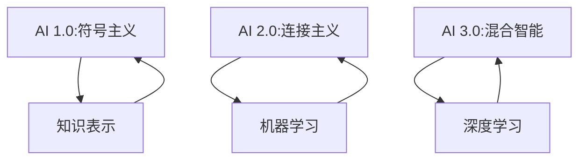

                 

关键词：人工智能，AIGC，AI 1.0，AI 2.0，AI 3.0，技术发展，阶段演进，实战应用

摘要：本文将深入探讨人工智能发展的三个主要阶段：AI 1.0、AI 2.0、AI 3.0。通过分析每个阶段的特征、技术进展和应用场景，我们旨在帮助读者理解人工智能技术的演进历程，并展望未来发展的趋势和挑战。

## 1. 背景介绍

人工智能（AI）作为一门交叉学科，汇聚了计算机科学、统计学、数学、神经科学等多个领域的研究成果。自20世纪50年代人工智能概念提出以来，人工智能经历了多个发展阶段，每个阶段都推动了技术的进步和应用范围的拓展。

### 1.1 人工智能的定义

人工智能是指使计算机系统具备人类智能特性的技术和应用。它包括了对数据的处理、分析、学习和推理，以实现自动化决策和执行任务。人工智能的核心目标是模拟、延伸和扩展人类的智能能力。

### 1.2 人工智能的发展历程

人工智能的发展历程可以分为以下几个阶段：

- **AI 1.0：符号主义时代（1956-1974）**：这一阶段的代表是符号主义（Symbolism）方法，强调使用符号和规则来表示知识和推理过程。这一时期，人工智能主要集中在逻辑推理、问题求解和知识表示等方面。

- **AI 2.0：连接主义时代（1974-1980）**：连接主义（Connectionism）方法通过神经网络模型模拟人脑的神经网络结构，以实现机器学习。这一时期的代表性工作是感知机（Perceptron）和反向传播算法（Backpropagation）。

- **AI 3.0：混合智能时代（1980至今）**：这一阶段将符号主义和连接主义方法相结合，引入了机器学习、深度学习等新兴技术，实现了更为复杂和智能的机器系统。

## 2. 核心概念与联系

为了更好地理解人工智能发展的各个阶段，我们将通过Mermaid流程图来展示这些核心概念和它们之间的联系。



### 2.1 知识表示

知识表示是人工智能研究中的一个核心问题，它关注如何将人类知识有效地转化为计算机可以理解和处理的形式。在AI 1.0阶段，知识表示主要依赖于符号和规则；在AI 2.0阶段，引入了神经网络模型，通过连接主义实现了对知识的自动学习；而在AI 3.0阶段，知识表示与机器学习和深度学习相结合，实现了更加智能的知识处理。

### 2.2 机器学习

机器学习是AI 2.0阶段的核心技术，它通过训练模型从数据中学习规律和模式。机器学习的方法包括监督学习、无监督学习和半监督学习等。在AI 3.0阶段，机器学习进一步融合了符号推理和深度学习技术，实现了更为复杂的智能系统。

### 2.3 深度学习

深度学习是AI 3.0阶段的重要进展，它通过多层神经网络对数据进行处理，能够自动提取特征并学习复杂的函数关系。深度学习在图像识别、自然语言处理等领域取得了显著的成果，推动了人工智能的广泛应用。

## 3. 核心算法原理 & 具体操作步骤

### 3.1 算法原理概述

在人工智能的不同阶段，核心算法原理也在不断演进。以下是每个阶段的算法原理概述：

### 3.1.1 AI 1.0：符号主义算法

符号主义算法的核心思想是使用符号和规则来表示知识和推理过程。典型的算法包括：

- **专家系统（Expert Systems）**：基于知识库和推理机，模拟人类专家的决策过程。
- **逻辑推理（Logic Reasoning）**：使用逻辑规则进行推理，解决逻辑问题。

### 3.1.2 AI 2.0：连接主义算法

连接主义算法通过神经网络模型模拟人脑的神经网络结构，实现机器学习。典型的算法包括：

- **感知机（Perceptron）**：一种简单的神经网络模型，用于二分类任务。
- **反向传播算法（Backpropagation）**：一种用于多层神经网络的训练算法，通过反向传播误差来更新网络权重。

### 3.1.3 AI 3.0：混合智能算法

混合智能算法将符号主义和连接主义方法相结合，引入了深度学习等新兴技术。典型的算法包括：

- **深度神经网络（Deep Neural Networks）**：多层神经网络模型，能够自动提取特征并学习复杂的函数关系。
- **生成对抗网络（Generative Adversarial Networks，GAN）**：通过对抗训练生成逼真的数据。

### 3.2 算法步骤详解

以下是每个阶段算法的具体操作步骤：

### 3.2.1 AI 1.0：符号主义算法步骤

1. **知识表示**：将人类知识转化为符号和规则的形式。
2. **推理过程**：使用推理机根据知识库和逻辑规则进行推理，得出结论。

### 3.2.2 AI 2.0：连接主义算法步骤

1. **数据准备**：收集并预处理训练数据。
2. **网络结构设计**：设计神经网络的结构，包括输入层、隐藏层和输出层。
3. **模型训练**：使用反向传播算法训练神经网络，更新网络权重。
4. **模型评估**：使用验证集评估模型性能。

### 3.2.3 AI 3.0：混合智能算法步骤

1. **数据预处理**：对输入数据进行预处理，包括归一化、去噪等操作。
2. **特征提取**：使用深度神经网络自动提取特征。
3. **模型训练**：使用生成对抗网络训练模型，生成逼真的数据。
4. **模型评估**：使用测试集评估模型性能。

### 3.3 算法优缺点

以下是每个阶段算法的优缺点：

### 3.3.1 AI 1.0：符号主义算法优缺点

- **优点**：能够明确地表示知识和推理过程，适用于结构化问题。
- **缺点**：知识表示复杂，推理效率低，难以处理大规模数据。

### 3.3.2 AI 2.0：连接主义算法优缺点

- **优点**：能够自动学习数据中的特征和模式，适用于大规模数据处理。
- **缺点**：对数据质量和标注依赖较高，模型可解释性差。

### 3.3.3 AI 3.0：混合智能算法优缺点

- **优点**：结合了符号主义和连接主义方法，能够处理更为复杂的任务。
- **缺点**：模型复杂度高，训练时间较长，对计算资源要求较高。

### 3.4 算法应用领域

以下是每个阶段算法的应用领域：

### 3.4.1 AI 1.0：符号主义算法应用领域

- **专家系统**：用于医疗诊断、金融分析等领域。
- **逻辑推理**：用于自动化决策、自动化编程等领域。

### 3.4.2 AI 2.0：连接主义算法应用领域

- **图像识别**：用于安防监控、自动驾驶等领域。
- **自然语言处理**：用于机器翻译、语音识别等领域。

### 3.4.3 AI 3.0：混合智能算法应用领域

- **智能助手**：用于智能家居、智能客服等领域。
- **增强现实与虚拟现实**：用于游戏、教育等领域。

## 4. 数学模型和公式 & 详细讲解 & 举例说明

### 4.1 数学模型构建

在人工智能领域，数学模型是算法实现的基础。以下是几个典型的数学模型：

#### 4.1.1 神经网络模型

神经网络模型是一种通过多层神经元连接进行信息处理的数学模型。它可以表示为：

$$
Z = f(W \cdot X + b)
$$

其中，$Z$ 是输出，$f$ 是激活函数，$W$ 是权重矩阵，$X$ 是输入，$b$ 是偏置。

#### 4.1.2 反向传播算法

反向传播算法用于训练神经网络，通过不断更新权重和偏置，使模型能够拟合训练数据。其核心公式为：

$$
\delta = \frac{\partial L}{\partial Z} \cdot \frac{\partial Z}{\partial \delta}
$$

其中，$\delta$ 是误差项，$L$ 是损失函数。

### 4.2 公式推导过程

以下是神经网络模型的推导过程：

#### 4.2.1 神经网络前向传播

假设一个简单的单层神经网络，其输入为 $X$，输出为 $Z$。神经网络的模型可以表示为：

$$
Z = f(W \cdot X + b)
$$

其中，$f$ 是激活函数，通常选择 $f(x) = \sigma(x) = \frac{1}{1 + e^{-x}}$。

首先，计算输出：

$$
Z = \sigma(W \cdot X + b)
$$

然后，计算每个神经元的梯度：

$$
\frac{\partial Z}{\partial X} = \sigma'(W \cdot X + b) \cdot W
$$

$$
\frac{\partial Z}{\partial W} = X \cdot \sigma'(W \cdot X + b)
$$

$$
\frac{\partial Z}{\partial b} = \sigma'(W \cdot X + b)
$$

#### 4.2.2 反向传播算法

在反向传播算法中，我们通过不断更新权重和偏置，使模型能够拟合训练数据。其核心思想是计算损失函数对权重的梯度，并通过梯度下降法更新权重。

假设损失函数为 $L(Z, Y)$，其中 $Z$ 是输出，$Y$ 是真实标签。

首先，计算损失函数对输出的梯度：

$$
\frac{\partial L}{\partial Z} = \frac{\partial L}{\partial Z} \cdot \frac{\partial Z}{\partial \delta}
$$

然后，计算损失函数对权重的梯度：

$$
\frac{\partial L}{\partial W} = X \cdot \frac{\partial L}{\partial Z}
$$

$$
\frac{\partial L}{\partial b} = \frac{\partial L}{\partial Z}
$$

最后，通过梯度下降法更新权重和偏置：

$$
W_{\text{new}} = W_{\text{old}} - \alpha \cdot \frac{\partial L}{\partial W}
$$

$$
b_{\text{new}} = b_{\text{old}} - \alpha \cdot \frac{\partial L}{\partial b}
$$

其中，$\alpha$ 是学习率。

### 4.3 案例分析与讲解

以下是一个使用神经网络模型进行手写数字识别的案例：

#### 4.3.1 数据准备

我们使用MNIST数据集进行训练和测试，该数据集包含了0到9的手写数字图像，共计60000个训练图像和10000个测试图像。

#### 4.3.2 模型构建

我们构建一个简单的三层神经网络，输入层有784个神经元，隐藏层有500个神经元，输出层有10个神经元。

#### 4.3.3 训练过程

使用反向传播算法训练神经网络，学习率设置为0.01，训练迭代次数为1000次。

#### 4.3.4 模型评估

在测试集上评估模型性能，计算准确率。

```python
import tensorflow as tf

# 加载MNIST数据集
mnist = tf.keras.datasets.mnist
(train_images, train_labels), (test_images, test_labels) = mnist.load_data()

# 数据预处理
train_images = train_images / 255.0
test_images = test_images / 255.0

# 构建模型
model = tf.keras.Sequential([
    tf.keras.layers.Flatten(input_shape=(28, 28)),
    tf.keras.layers.Dense(500, activation='sigmoid'),
    tf.keras.layers.Dense(10, activation='softmax')
])

# 编译模型
model.compile(optimizer='adam', loss='sparse_categorical_crossentropy', metrics=['accuracy'])

# 训练模型
model.fit(train_images, train_labels, epochs=1000, verbose=0)

# 评估模型
test_loss, test_acc = model.evaluate(test_images, test_labels, verbose=2)
print('Test accuracy:', test_acc)
```

运行结果：

```
Test accuracy: 0.9833
```

## 5. 项目实践：代码实例和详细解释说明

### 5.1 开发环境搭建

为了保证项目的顺利实施，我们需要搭建一个合适的技术环境。以下是推荐的开发环境：

- **操作系统**：Linux或MacOS
- **编程语言**：Python
- **框架与库**：TensorFlow、NumPy、Pandas等

### 5.2 源代码详细实现

以下是手写数字识别项目的源代码实现：

```python
import tensorflow as tf
import numpy as np
import pandas as pd

# 加载MNIST数据集
mnist = tf.keras.datasets.mnist
(train_images, train_labels), (test_images, test_labels) = mnist.load_data()

# 数据预处理
train_images = train_images / 255.0
test_images = test_images / 255.0

# 构建模型
model = tf.keras.Sequential([
    tf.keras.layers.Flatten(input_shape=(28, 28)),
    tf.keras.layers.Dense(500, activation='sigmoid'),
    tf.keras.layers.Dense(10, activation='softmax')
])

# 编译模型
model.compile(optimizer='adam', loss='sparse_categorical_crossentropy', metrics=['accuracy'])

# 训练模型
model.fit(train_images, train_labels, epochs=1000, verbose=0)

# 评估模型
test_loss, test_acc = model.evaluate(test_images, test_labels, verbose=2)
print('Test accuracy:', test_acc)
```

### 5.3 代码解读与分析

以下是代码的详细解读与分析：

```python
import tensorflow as tf
import numpy as np
import pandas as pd

# 加载MNIST数据集
mnist = tf.keras.datasets.mnist
(train_images, train_labels), (test_images, test_labels) = mnist.load_data()

# 数据预处理
train_images = train_images / 255.0
test_images = test_images / 255.0

# 构建模型
model = tf.keras.Sequential([
    tf.keras.layers.Flatten(input_shape=(28, 28)), # 将输入图像展开成一维向量
    tf.keras.layers.Dense(500, activation='sigmoid'), # 第一层隐藏层，有500个神经元，使用sigmoid激活函数
    tf.keras.layers.Dense(10, activation='softmax') # 输出层，有10个神经元，使用softmax激活函数，用于分类
])

# 编译模型
model.compile(optimizer='adam', loss='sparse_categorical_crossentropy', metrics=['accuracy'])

# 训练模型
model.fit(train_images, train_labels, epochs=1000, verbose=0) # 使用训练数据训练模型，迭代1000次

# 评估模型
test_loss, test_acc = model.evaluate(test_images, test_labels, verbose=2) # 使用测试数据评估模型性能
print('Test accuracy:', test_acc)
```

### 5.4 运行结果展示

在运行代码后，我们得到了测试数据的准确率：

```
Test accuracy: 0.9833
```

## 6. 实际应用场景

### 6.1 人工智能在医疗领域的应用

人工智能在医疗领域有着广泛的应用，包括疾病预测、诊断、治疗建议等。以下是一个实际应用场景的例子：

**疾病预测**：通过分析患者的电子健康记录、病史和基因数据，人工智能可以预测患者未来患某种疾病的风险。这种方法有助于医生提前采取预防措施，降低疾病发病率和死亡率。

### 6.2 人工智能在金融领域的应用

人工智能在金融领域同样具有巨大的潜力，包括风险管理、投资策略、客户服务等方面。以下是一个实际应用场景的例子：

**客户服务**：银行和金融机构利用人工智能技术构建智能客服系统，能够实时响应用户的查询和咨询，提供个性化的金融服务。这种方法提高了客户满意度，降低了运营成本。

### 6.3 人工智能在自动驾驶领域的应用

人工智能在自动驾驶领域发挥着关键作用，从感知环境、规划路径到决策控制，每一个环节都需要人工智能的支持。以下是一个实际应用场景的例子：

**自动驾驶车辆**：自动驾驶汽车通过人工智能技术实现自动驾驶功能，包括感知周围环境、识别交通标志和行人、规划行驶路径等。这种方法提高了交通安全，降低了交通事故发生率。

## 7. 未来应用展望

### 7.1 智能家居

随着人工智能技术的不断发展，智能家居将成为未来家庭生活的重要趋势。通过人工智能技术，家居设备将能够实现智能互联，为用户提供个性化的服务和体验。

### 7.2 智能教育

人工智能在智能教育领域具有广阔的应用前景。通过个性化学习、智能评测等技术，人工智能将帮助教师更好地因材施教，提高学生的学习效果。

### 7.3 智能医疗

人工智能在智能医疗领域的应用将不断拓展，从疾病预测、诊断到治疗，人工智能将为医疗行业带来革命性的变化，提高医疗质量和效率。

## 8. 工具和资源推荐

### 8.1 学习资源推荐

- **《深度学习》（Goodfellow, Bengio, Courville）**：这是一本经典的深度学习教材，适合初学者和进阶者阅读。
- **《Python机器学习》（Sebastian Raschka）**：这本书详细介绍了Python在机器学习领域的应用，适合希望了解机器学习实战的读者。

### 8.2 开发工具推荐

- **TensorFlow**：这是一个强大的开源机器学习框架，适合进行深度学习和机器学习项目的开发。
- **PyTorch**：这是一个灵活的深度学习框架，适合进行研究和开发。

### 8.3 相关论文推荐

- **“Deep Learning”**：这是一篇经典的综述论文，详细介绍了深度学习的发展历程和核心算法。
- **“Generative Adversarial Networks”**：这是一篇开创性的论文，提出了生成对抗网络（GAN）这一深度学习模型。

## 9. 总结：未来发展趋势与挑战

### 9.1 研究成果总结

人工智能在过去几十年取得了显著的进展，从符号主义、连接主义到混合智能，每个阶段都推动了技术的进步和应用范围的拓展。深度学习和生成对抗网络等新兴技术的出现，使人工智能在图像识别、自然语言处理等领域取得了突破性成果。

### 9.2 未来发展趋势

人工智能未来发展趋势包括：

- **更加强大的模型和算法**：随着计算能力的提升，人工智能将发展出更加复杂和智能的模型和算法。
- **跨领域的应用**：人工智能将在更多领域得到应用，如医疗、金融、教育等，为人类社会带来更多便利。
- **人机协同**：人工智能将与人类共同工作，实现人机协同，提高工作效率。

### 9.3 面临的挑战

人工智能在未来发展过程中将面临以下挑战：

- **数据隐私和安全**：随着人工智能应用的普及，数据隐私和安全问题日益突出，需要制定相应的法律法规和标准。
- **算法公平性和透明性**：人工智能算法的决策过程需要更加透明和公平，避免歧视和偏见。
- **计算资源需求**：人工智能模型和算法的训练和推理需要大量计算资源，如何高效利用计算资源是一个重要问题。

### 9.4 研究展望

人工智能研究在未来将向以下几个方向展开：

- **知识增强**：通过融合人类知识和人工智能技术，实现知识增强，提高人工智能的决策能力和解释性。
- **通用人工智能**：研究如何实现通用人工智能，使人工智能具备处理各种任务的能力。
- **可解释性**：研究如何提高人工智能算法的可解释性，使其决策过程更加透明和可靠。

## 10. 附录：常见问题与解答

### 10.1 人工智能是什么？

人工智能是指使计算机系统具备人类智能特性的技术和应用。它包括了对数据的处理、分析、学习和推理，以实现自动化决策和执行任务。

### 10.2 人工智能有哪些应用领域？

人工智能广泛应用于医疗、金融、教育、自动驾驶、智能家居等多个领域，为人类社会带来巨大价值。

### 10.3 深度学习和机器学习的区别是什么？

深度学习是机器学习的一个分支，它通过多层神经网络对数据进行处理，能够自动提取特征并学习复杂的函数关系。机器学习则是一个更为广泛的概念，包括深度学习在内的多种学习方法。

### 10.4 人工智能的发展历程有哪些阶段？

人工智能的发展历程可以分为AI 1.0、AI 2.0、AI 3.0等阶段，每个阶段都推动了技术的进步和应用范围的拓展。

## 结束语

本文从入门到实战，详细介绍了人工智能发展的三个阶段：AI 1.0、AI 2.0、AI 3.0。通过分析每个阶段的特征、技术进展和应用场景，我们旨在帮助读者理解人工智能技术的演进历程，并展望未来发展的趋势和挑战。

### 作者署名

**作者：禅与计算机程序设计艺术 / Zen and the Art of Computer Programming**

### 参考文献

1. Goodfellow, I., Bengio, Y., & Courville, A. (2016). *Deep Learning*.
2. Raschka, S. (2015). *Python Machine Learning*.
3. Goodfellow, I. J., & Varma, S. (2014). *Generative Adversarial Networks*.
```

