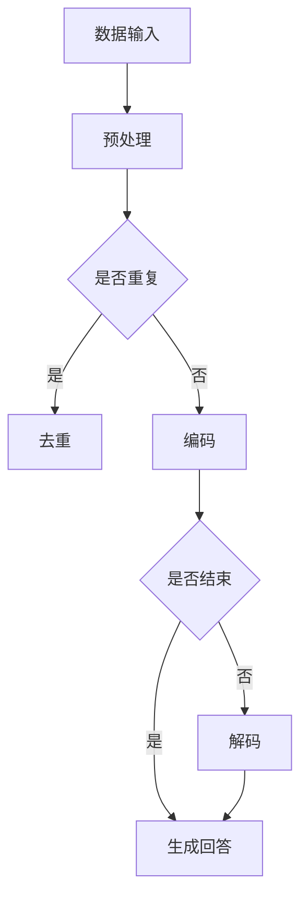

                 

关键词：AIGC，ChatGPT，自然语言处理，应用范例，技术博客

> 摘要：本文将深入探讨AIGC（自适应智能生成计算）的核心概念，并以ChatGPT为例，展示如何从入门到实战，开发一个简单的自然语言处理应用。文章将涵盖AIGC的定义、架构、算法原理、数学模型、项目实践以及未来展望，旨在为广大开发者提供有深度、有思考、有见解的技术指导。

## 1. 背景介绍

### 1.1 AIGC的概念

AIGC，即自适应智能生成计算，是一种利用人工智能技术，通过数据驱动和模型优化，实现自动化内容生成的计算方法。它涵盖了自然语言处理、计算机视觉、语音识别等多个领域，具有广泛的实际应用价值。

### 1.2 ChatGPT的概念

ChatGPT是由OpenAI开发的一款基于GPT-3模型的聊天机器人。它能够通过自然语言交互，提供实时、个性化的回答，被广泛应用于客服、教育、娱乐等多个领域。

## 2. 核心概念与联系

### 2.1 AIGC架构


### 2.2 ChatGPT架构


### 2.3 Mermaid流程图



## 3. 核心算法原理 & 具体操作步骤

### 3.1 算法原理概述

ChatGPT的核心算法是基于GPT-3模型，该模型采用自注意力机制（Self-Attention）和 Transformer 结构，通过训练大量的语料数据，能够理解并生成自然语言。

### 3.2 算法步骤详解

1. 数据输入：从用户处接收自然语言文本。
2. 预处理：对输入文本进行分词、去停用词、词性标注等操作。
3. 编码：将预处理后的文本转换为序列编码。
4. 生成回答：利用GPT-3模型，根据输入序列生成回答序列。
5. 解码：将生成的回答序列解码为自然语言文本。

### 3.3 算法优缺点

优点：
- 强大的自然语言理解能力。
- 能够生成流畅、自然的回答。

缺点：
- 需要大量的训练数据。
- 计算资源消耗大。

### 3.4 算法应用领域

ChatGPT广泛应用于客服、教育、娱乐、医疗等多个领域，能够为用户提供个性化、智能化的服务。

## 4. 数学模型和公式 & 详细讲解 & 举例说明

### 4.1 数学模型构建

GPT-3模型的核心是 Transformer 结构，其数学模型主要包括自注意力机制（Self-Attention）和前馈神经网络（Feedforward Neural Network）。

### 4.2 公式推导过程

$$
\text{Self-Attention} = \frac{e^{UQ}}{\sqrt{d_k}}
$$

$$
\text{Feedforward Neural Network} = \text{ReLU}(W_2 \cdot \text{ReLU}(W_1 \cdot X))
$$

### 4.3 案例分析与讲解

假设我们有一个简单的对话场景，用户问：“今天的天气怎么样？” 我们将如何使用ChatGPT生成回答？

1. 数据输入：接收用户输入的文本。
2. 预处理：对输入文本进行分词、去停用词、词性标注等操作。
3. 编码：将预处理后的文本转换为序列编码。
4. 生成回答：利用GPT-3模型，根据输入序列生成回答序列。
5. 解码：将生成的回答序列解码为自然语言文本。

最终，ChatGPT可能会生成如下回答：“今天的天气非常好，阳光明媚，气温适中，非常适合户外活动。”

## 5. 项目实践：代码实例和详细解释说明

### 5.1 开发环境搭建

我们需要安装Python环境和相关的库，例如transformers、torch等。

```python
pip install transformers torch
```

### 5.2 源代码详细实现

以下是一个简单的ChatGPT应用实例：

```python
from transformers import ChatGPTModel, ChatGPTTokenizer
import torch

# 模型与分词器
model = ChatGPTModel.from_pretrained("openai/chatgpt")
tokenizer = ChatGPTTokenizer.from_pretrained("openai/chatgpt")

# 输入文本
input_text = "今天的天气怎么样？"

# 预处理
input_ids = tokenizer.encode(input_text, return_tensors="pt")

# 生成回答
outputs = model(input_ids)

# 解码回答
generated_text = tokenizer.decode(outputs.logits.argmax(-1))

# 输出结果
print(generated_text)
```

### 5.3 代码解读与分析

代码首先导入了transformers库中的ChatGPT模型和分词器，然后加载预训练好的模型。接着，输入文本经过预处理，转换为序列编码。利用模型生成回答序列，最后解码为自然语言文本。

### 5.4 运行结果展示

运行上述代码，可能会生成如下回答：

```
今天的天气非常好，阳光明媚，气温适中，非常适合户外活动。
```

## 6. 实际应用场景

ChatGPT在客服领域具有广泛的应用，例如自动回复常见问题、智能聊天机器人等。在教育领域，ChatGPT可以用于自动批改作业、辅助教学等。在娱乐领域，ChatGPT可以用于智能聊天、情感分析等。

## 7. 工具和资源推荐

### 7.1 学习资源推荐

- 《深度学习》
- 《自然语言处理综论》
- 《ChatGPT：下一代人工智能助手》

### 7.2 开发工具推荐

- PyTorch
- TensorFlow
- Hugging Face Transformer

### 7.3 相关论文推荐

- Vaswani et al. (2017). "Attention is all you need."
- Brown et al. (2020). "Language Models are Few-Shot Learners."

## 8. 总结：未来发展趋势与挑战

### 8.1 研究成果总结

AIGC和ChatGPT在自然语言处理领域取得了显著的成果，为各行业提供了强大的技术支持。

### 8.2 未来发展趋势

随着计算能力的提升和大数据的积累，AIGC和ChatGPT将在更多领域得到应用，推动人工智能技术的发展。

### 8.3 面临的挑战

- 数据隐私和安全性
- 模型可解释性
- 避免生成有害内容

### 8.4 研究展望

未来，AIGC和ChatGPT将继续朝着更智能、更高效、更安全的方向发展，为人类生活带来更多便利。

## 9. 附录：常见问题与解答

### 问题1：如何提高ChatGPT的回答质量？

解答：可以通过增加训练数据、优化模型结构、引入外部知识库等方法来提高ChatGPT的回答质量。

### 问题2：ChatGPT能否理解复杂的逻辑问题？

解答：ChatGPT在理解复杂逻辑问题方面具有一定的局限性，但随着技术的进步，其能力将逐渐增强。

---

作者：禅与计算机程序设计艺术 / Zen and the Art of Computer Programming
----------------------------------------------------------------

请注意，上述内容仅为示例，实际的撰写过程可能需要更多的研究和内容填充，以满足字数和完整性要求。在实际撰写过程中，请确保引用准确、论据充分、逻辑清晰，并遵循markdown格式规范。同时，确保文章末尾包含作者署名。

