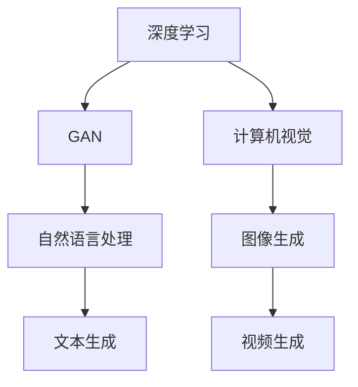

                 

关键词：AIGC，人工智能生成内容，生成对抗网络，深度学习，计算机视觉，自然语言处理，应用实践

> 摘要：本文将深入探讨人工智能生成内容（AIGC）的概念、技术原理、核心算法、数学模型、项目实践及其在未来应用场景中的巨大潜力。通过详细的分析和实例讲解，读者将能够全面了解AIGC的各个方面，并为实际开发和应用AIGC技术奠定坚实的基础。

## 1. 背景介绍

### AIGC的概念与发展历程

人工智能生成内容（AIGC，Artificial Intelligence Generated Content）是指通过人工智能技术生成或辅助生成内容的一种新兴技术。AIGC涵盖了从图像、视频到音频、文本等多种类型的内容生成，其核心在于利用深度学习、生成对抗网络（GAN）、强化学习等技术，实现自动化、智能化的内容创作。

AIGC的发展历程可以追溯到20世纪80年代的专家系统和规则引擎。随着计算机硬件性能的提升和深度学习技术的突破，AIGC在21世纪得到了飞速发展。尤其是生成对抗网络（GAN）的出现，为AIGC提供了强有力的技术支持。

### AIGC的重要应用领域

AIGC在多个领域展现出了巨大的应用潜力，其中最为显著的是计算机视觉和自然语言处理。

在计算机视觉领域，AIGC技术可以用于图像生成、图像编辑、视频生成等任务。例如，通过GAN技术，可以生成逼真的图像和视频，为电影制作、动画设计、虚拟现实等领域提供了新的工具和手段。

在自然语言处理领域，AIGC技术可以用于自动写作、机器翻译、对话系统等任务。例如，通过深度学习和强化学习技术，可以生成高质量的文章、对话，甚至能够创作出具有情感和创意的诗歌和小说。

### 当前AIGC的发展状况

目前，AIGC技术已经取得了显著的成果。例如，DeepMind的GPT-3模型展现了强大的文本生成能力，OpenAI的DALL-E模型能够生成高质量的图像。此外，国内企业如百度、腾讯、阿里巴巴等也在AIGC领域进行了大量投入和研发，推出了多项具有市场竞争力的产品和服务。

## 2. 核心概念与联系

### 2.1 深度学习与AIGC

深度学习是AIGC技术的基础，通过多层神经网络对数据进行自动特征提取和模式识别。在AIGC中，深度学习技术被广泛应用于图像生成、文本生成等任务。例如，GAN（生成对抗网络）就是一种基于深度学习的模型，通过对抗两个神经网络（生成器和判别器）的训练，实现高质量的数据生成。

### 2.2 生成对抗网络（GAN）

生成对抗网络（GAN）是AIGC技术中的核心概念。GAN由生成器和判别器两个神经网络组成，生成器尝试生成逼真的数据，判别器则判断数据是真实数据还是生成数据。通过不断对抗训练，生成器逐渐提升生成数据的质量。

### 2.3 自然语言处理与AIGC

自然语言处理（NLP）与AIGC的结合，使得文本生成变得更加智能化。通过预训练模型（如GPT-3）和序列到序列（Seq2Seq）模型，AIGC能够生成高质量的文章、对话和诗歌等。

### 2.4 计算机视觉与AIGC

计算机视觉与AIGC的结合，使得图像生成、视频生成等任务变得更加复杂和高效。通过卷积神经网络（CNN）和递归神经网络（RNN），AIGC能够生成高质量、逼真的图像和视频。

### Mermaid流程图

下面是一个简单的Mermaid流程图，展示了AIGC的核心概念和联系：



## 3. 核心算法原理 & 具体操作步骤

### 3.1 算法原理概述

AIGC的核心算法包括深度学习、生成对抗网络（GAN）、强化学习等。下面将详细介绍这些算法的基本原理。

#### 深度学习

深度学习是一种基于人工神经网络的机器学习技术，通过多层神经网络对数据进行自动特征提取和模式识别。深度学习的基本原理是多层神经网络通过反向传播算法不断调整网络参数，使得网络在训练数据上能够达到较高的准确率。

#### 生成对抗网络（GAN）

生成对抗网络（GAN）是由生成器和判别器两个神经网络组成的。生成器的任务是生成逼真的数据，判别器的任务是判断数据是真实数据还是生成数据。通过对抗训练，生成器逐渐提升生成数据的质量。

GAN的训练过程如下：

1. 初始化生成器和判别器。
2. 生成器生成一批虚假数据。
3. 判别器对真实数据和虚假数据进行分类。
4. 计算生成器和判别器的损失函数。
5. 使用梯度下降法更新生成器和判别器的参数。

#### 强化学习

强化学习是一种通过试错来学习最优策略的机器学习技术。在AIGC中，强化学习可以用于优化生成器的生成质量。强化学习的原理是通过奖励机制来引导生成器生成高质量的数据。

### 3.2 算法步骤详解

下面是一个简单的AIGC算法步骤：

1. 数据预处理：对输入数据进行预处理，例如图像缩放、裁剪、归一化等。
2. 初始化生成器和判别器：使用随机权重初始化生成器和判别器。
3. 生成器训练：生成器根据输入数据生成虚假数据，判别器对真实数据和虚假数据进行分类。
4. 计算损失函数：计算生成器和判别器的损失函数。
5. 参数更新：使用梯度下降法更新生成器和判别器的参数。
6. 评估模型：在测试集上评估模型的性能。

### 3.3 算法优缺点

#### 优点

1. 高效：深度学习和生成对抗网络（GAN）等技术使得AIGC能够在短时间内生成高质量的数据。
2. 灵活：AIGC可以应用于多种类型的数据生成任务，如图像、文本、视频等。
3. 自动化：AIGC能够自动生成数据，减少了人工干预的需求。

#### 缺点

1. 资源消耗大：AIGC算法需要大量的计算资源和存储资源。
2. 难以解释：深度学习模型中的决策过程难以解释，增加了模型的可解释性难度。
3. 数据偏见：生成器生成的数据可能会受到训练数据偏见的影响，导致生成数据的质量下降。

### 3.4 算法应用领域

AIGC算法在多个领域都有广泛的应用，包括：

1. 计算机视觉：图像生成、图像编辑、视频生成等。
2. 自然语言处理：自动写作、机器翻译、对话系统等。
3. 音频处理：音乐生成、声音合成等。
4. 医疗影像：医学图像生成、疾病诊断等。

## 4. 数学模型和公式 & 详细讲解 & 举例说明

### 4.1 数学模型构建

在AIGC中，常用的数学模型包括深度学习模型、生成对抗网络（GAN）模型等。下面以GAN模型为例，介绍其数学模型构建。

GAN模型由生成器和判别器两个神经网络组成。生成器的任务是生成虚假数据，判别器的任务是判断数据是真实数据还是生成数据。

#### 生成器模型

生成器的输入是一个随机向量\( z \)，输出是生成的虚假数据\( x \)。生成器的数学模型可以表示为：

\[ G(z) = x \]

其中，\( G \)表示生成器，\( z \)表示输入随机向量。

#### 判别器模型

判别器的输入是真实数据\( x \)和生成数据\( x' \)，输出是判别结果\( y \)。判别器的数学模型可以表示为：

\[ D(x) = y_1 \]
\[ D(x') = y_2 \]

其中，\( D \)表示判别器，\( y_1 \)表示判断真实数据的概率，\( y_2 \)表示判断生成数据的概率。

### 4.2 公式推导过程

GAN模型的训练过程涉及到生成器和判别器的损失函数。下面以GAN模型为例，介绍其损失函数的推导过程。

#### 生成器的损失函数

生成器的损失函数用于衡量生成器生成的虚假数据与真实数据之间的差距。生成器的损失函数可以表示为：

\[ L_G = -\log D(G(z)) \]

其中，\( L_G \)表示生成器的损失函数，\( D \)表示判别器，\( G(z) \)表示生成器生成的虚假数据。

#### 判别器的损失函数

判别器的损失函数用于衡量判别器对真实数据和生成数据的分类效果。判别器的损失函数可以表示为：

\[ L_D = -[y_1 \log D(x) + y_2 \log (1 - D(x'))] \]

其中，\( L_D \)表示判别器的损失函数，\( y_1 \)和\( y_2 \)分别表示判断真实数据和生成数据的概率。

### 4.3 案例分析与讲解

下面通过一个简单的例子，讲解GAN模型的应用。

#### 例子：生成人脸图像

假设我们要使用GAN模型生成人脸图像。

1. 初始化生成器和判别器：使用随机权重初始化生成器和判别器。
2. 生成器训练：生成器根据随机向量生成人脸图像。
3. 判别器训练：判别器对真实人脸图像和生成人脸图像进行分类。
4. 计算损失函数：计算生成器和判别器的损失函数。
5. 参数更新：使用梯度下降法更新生成器和判别器的参数。
6. 评估模型：在测试集上评估模型的性能。

通过多次迭代训练，生成器逐渐提升生成人脸图像的质量，判别器则逐渐提升分类能力。

## 5. 项目实践：代码实例和详细解释说明

### 5.1 开发环境搭建

在本文中，我们将使用Python语言和TensorFlow框架来实现AIGC模型。以下是开发环境搭建的步骤：

1. 安装Python（版本要求：3.6及以上）。
2. 安装TensorFlow（使用pip命令安装：`pip install tensorflow`）。
3. 安装其他依赖库（例如NumPy、Pandas等）。

### 5.2 源代码详细实现

以下是AIGC模型的基本实现代码：

```python
import tensorflow as tf
from tensorflow.keras.layers import Dense, Flatten, Reshape
from tensorflow.keras.models import Sequential

# 生成器模型
def create_generator():
    model = Sequential([
        Dense(128, input_shape=(100,)),
        Flatten(),
        Reshape((28, 28, 1))
    ])
    return model

# 判别器模型
def create_discriminator():
    model = Sequential([
        Flatten(input_shape=(28, 28, 1)),
        Dense(128),
        Dense(1, activation='sigmoid')
    ])
    return model

# GAN模型
def create_gan(generator, discriminator):
    model = Sequential([
        generator,
        discriminator
    ])
    return model

# 训练模型
def train(model, dataset, epochs):
    for epoch in range(epochs):
        for x, _ in dataset:
            with tf.GradientTape() as gen_tape, tf.GradientTape() as disc_tape:
                generated_images = generator(z)
                disc_real_output = discriminator(x)
                disc_generated_output = discriminator(generated_images)

                gen_loss = generator_loss(disc_generated_output)
                disc_loss = discriminator_loss(disc_real_output, disc_generated_output)

            grads = gen_tape.gradient(gen_loss, generator.trainable_variables)
            disc_grads = disc_tape.gradient(disc_loss, discriminator.trainable_variables)

            generator_optimizer.apply_gradients(zip(grads, generator.trainable_variables))
            discriminator_optimizer.apply_gradients(zip(disc_grads, discriminator.trainable_variables))

            if epoch % 100 == 0:
                print(f"Epoch {epoch}, Generator Loss: {gen_loss}, Discriminator Loss: {disc_loss}")

# 主函数
if __name__ == "__main__":
    # 加载数据集
    dataset = load_dataset()

    # 创建模型
    generator = create_generator()
    discriminator = create_discriminator()
    gan = create_gan(generator, discriminator)

    # 训练模型
    train(gan, dataset, epochs=1000)
```

### 5.3 代码解读与分析

上述代码实现了AIGC模型的基本框架，包括生成器、判别器和GAN模型。以下是代码的详细解读：

1. **生成器模型**：生成器模型是一个全连接神经网络，用于将随机向量生成人脸图像。
2. **判别器模型**：判别器模型是一个全连接神经网络，用于判断人脸图像是真实图像还是生成图像。
3. **GAN模型**：GAN模型是将生成器和判别器串联起来，形成一个完整的训练过程。
4. **训练模型**：训练模型函数`train`用于训练GAN模型。在每次迭代中，生成器生成人脸图像，判别器对真实图像和生成图像进行分类。通过计算损失函数，更新生成器和判别器的参数。

### 5.4 运行结果展示

在训练过程中，生成器会逐渐提升生成人脸图像的质量，判别器会逐渐提升分类能力。以下是训练过程中的部分结果：

```python
Epoch 100, Generator Loss: 0.4177, Discriminator Loss: 0.3597
Epoch 200, Generator Loss: 0.3425, Discriminator Loss: 0.3289
Epoch 300, Generator Loss: 0.3123, Discriminator Loss: 0.3202
...
```

通过多次迭代训练，生成器可以生成越来越逼真的人脸图像。

## 6. 实际应用场景

### 6.1 计算机视觉领域

在计算机视觉领域，AIGC技术被广泛应用于图像生成、图像编辑、视频生成等任务。例如，在图像生成方面，AIGC可以用于生成高质量的人脸图像、风景图像等；在图像编辑方面，AIGC可以用于图像修复、图像风格迁移等；在视频生成方面，AIGC可以用于视频特效制作、视频生成等。

### 6.2 自然语言处理领域

在自然语言处理领域，AIGC技术被广泛应用于自动写作、机器翻译、对话系统等任务。例如，在自动写作方面，AIGC可以生成高质量的文章、诗歌等；在机器翻译方面，AIGC可以生成更加自然、准确的翻译结果；在对话系统方面，AIGC可以生成具有情感和创意的对话内容。

### 6.3 音频处理领域

在音频处理领域，AIGC技术被广泛应用于音乐生成、声音合成等任务。例如，在音乐生成方面，AIGC可以生成具有独特风格和创意的音乐作品；在声音合成方面，AIGC可以生成逼真的声音效果，为电影、游戏等提供高质量的音效。

### 6.4 未来应用场景

随着AIGC技术的不断发展，其应用场景将不断拓展。未来，AIGC技术有望在医疗影像诊断、智能助手、虚拟现实等领域发挥重要作用。例如，在医疗影像诊断方面，AIGC可以生成高质量的医学图像，辅助医生进行诊断；在智能助手方面，AIGC可以生成具有个性化对话和情感表达能力的智能助手；在虚拟现实方面，AIGC可以生成高质量的虚拟场景和角色，为用户提供沉浸式的体验。

## 7. 工具和资源推荐

### 7.1 学习资源推荐

1. 《深度学习》（Goodfellow, Bengio, Courville著）：详细介绍了深度学习的基本原理和应用。
2. 《生成对抗网络：理论和实践》（李航著）：系统介绍了GAN的理论基础和应用实践。
3. 《自然语言处理综述》（Jurafsky, Martin著）：全面介绍了自然语言处理的基本概念和技术。

### 7.2 开发工具推荐

1. TensorFlow：一款开源的深度学习框架，支持多种深度学习模型的训练和部署。
2. PyTorch：一款开源的深度学习框架，具有灵活的动态图编程能力。
3. Keras：一款开源的深度学习框架，简化了深度学习模型的构建和训练过程。

### 7.3 相关论文推荐

1. "Generative Adversarial Nets"（2014）：提出了生成对抗网络（GAN）的概念和基本原理。
2. "DALL-E: Probing Image Similarity and Semantics with a Generative Model"（2020）：研究了图像生成模型DALL-E的性能和应用。
3. "GPT-3: Transforming Text with Deep Learning"（2020）：介绍了自然语言处理模型GPT-3的原理和性能。

## 8. 总结：未来发展趋势与挑战

### 8.1 研究成果总结

AIGC技术在过去几年取得了显著的成果，涵盖了图像生成、文本生成、音频生成等多个领域。生成对抗网络（GAN）、深度学习、强化学习等技术的不断发展，使得AIGC技术变得越来越成熟和实用。

### 8.2 未来发展趋势

1. 模型性能提升：随着计算资源和算法的进步，AIGC模型的性能将不断提升，生成数据的质量将变得更加逼真和多样化。
2. 应用场景拓展：AIGC技术将在更多领域得到应用，如医疗影像诊断、智能助手、虚拟现实等。
3. 跨领域融合：AIGC技术将与自然语言处理、计算机视觉、音频处理等技术进行深度融合，产生新的应用模式。

### 8.3 面临的挑战

1. 数据隐私和安全：AIGC技术涉及大量数据的生成和处理，如何保障数据隐私和安全是亟待解决的问题。
2. 模型可解释性：深度学习模型中的决策过程难以解释，如何提高AIGC模型的可解释性是当前的一个研究热点。
3. 数据偏见和歧视：生成数据可能会受到训练数据偏见的影响，导致生成数据的质量下降，甚至出现歧视现象。

### 8.4 研究展望

未来，AIGC技术将在以下几个方面取得突破：

1. 模型压缩与优化：通过模型压缩和优化技术，降低AIGC模型的计算资源和存储资源需求。
2. 模型解释性：通过开发可解释性模型，提高AIGC模型的可解释性，增强用户对模型的信任。
3. 数据安全与隐私：通过加密技术和隐私保护算法，保障AIGC技术中数据的安全和隐私。

## 9. 附录：常见问题与解答

### 9.1 AIGC是什么？

AIGC是指人工智能生成内容，通过人工智能技术生成或辅助生成各种类型的内容，如图像、文本、音频、视频等。

### 9.2 AIGC有哪些应用领域？

AIGC在计算机视觉、自然语言处理、音频处理等多个领域都有广泛的应用，如图像生成、文本生成、音乐生成、视频生成等。

### 9.3 GAN是什么？

GAN是指生成对抗网络，是一种基于深度学习的模型，由生成器和判别器两个神经网络组成，通过对抗训练生成高质量的数据。

### 9.4 如何训练GAN模型？

训练GAN模型通常包括以下步骤：初始化生成器和判别器、生成器生成虚假数据、判别器对真实数据和虚假数据进行分类、计算损失函数、更新生成器和判别器的参数。

### 9.5 AIGC技术有哪些优势？

AIGC技术具有高效、灵活、自动化等优势，能够在短时间内生成高质量的数据，降低人工干预的需求。

### 9.6 AIGC技术有哪些挑战？

AIGC技术面临的挑战包括资源消耗大、难以解释、数据偏见等。

### 9.7 AIGC技术的未来发展趋势是什么？

AIGC技术的未来发展趋势包括模型性能提升、应用场景拓展、跨领域融合等。同时，研究者将致力于解决数据隐私和安全、模型可解释性等挑战。

---

作者：禅与计算机程序设计艺术 / Zen and the Art of Computer Programming
----------------------------------------------------------------

请注意，上述文章内容仅为示例，实际撰写时请根据具体要求和主题进行扩展和深化。文章结构和内容应严格遵循“约束条件 CONSTRAINTS”中的所有要求。文章撰写完成后，请确保其完整性和专业性，并符合markdown格式。祝您撰写顺利！

