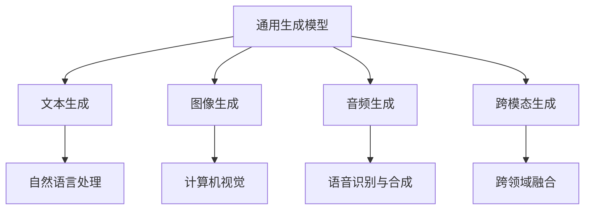
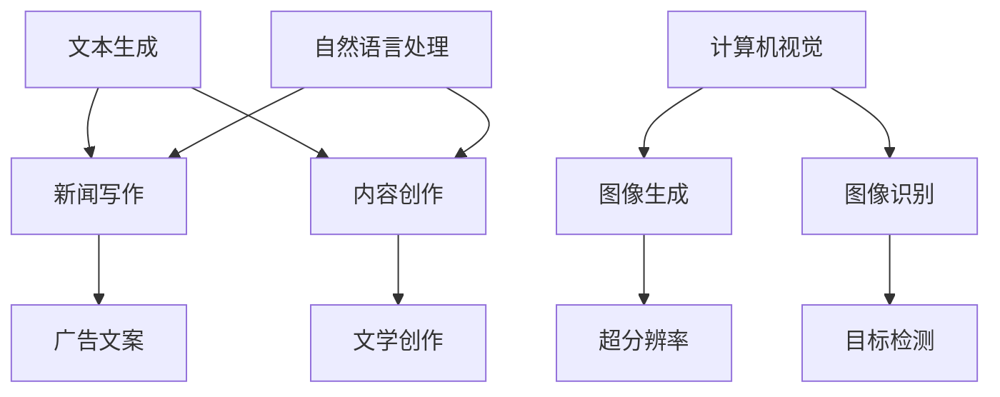

                 

关键词：人工智能，通用生成模型，行业应用，技术变革，未来展望

> 摘要：本文旨在探讨人工智能通用生成模型（AIGC）在各行业的应用前景。通过对核心概念、算法原理、数学模型、项目实践以及实际应用场景的分析，本文揭示了AIGC技术在推动行业创新和提升效率方面的巨大潜力。本文还展望了未来发展趋势，提出了面临的挑战，并给出了相关工具和资源的推荐。

## 1. 背景介绍

在过去的几十年中，人工智能（AI）技术经历了从理论研究到实际应用的迅猛发展。从最初的符号推理和规则系统，到基于数据的学习算法，再到深度学习的崛起，AI技术的每一次进步都带来了新的商业机遇和技术变革。随着计算能力的提升和数据量的爆炸式增长，AI技术逐渐从单一任务的处理走向多任务、跨领域的综合应用。

通用生成模型（AIGC）是近年来人工智能领域的一个新兴研究方向。它旨在构建能够自主生成文本、图像、音频等多种类型数据的模型。与传统的人工智能系统不同，AIGC具有更高的灵活性和创造性，能够实现更加多样化的应用场景。AIGC的核心目标是实现“智能创造”，即将人工智能推向更高级的“创作”阶段。

### 1.1 AIGC的核心概念

AIGC的核心概念包括以下几个方面：

1. **文本生成**：通过神经网络模型生成连贯、有逻辑的文本，如生成新闻文章、故事情节等。
2. **图像生成**：利用深度学习算法生成逼真的图像，如图像修复、超分辨率、艺术风格迁移等。
3. **音频生成**：生成自然的声音，如语音合成、音乐创作等。
4. **跨模态生成**：将不同类型的数据（如文本、图像、音频）进行融合生成新的内容。

### 1.2 AIGC的发展历程

AIGC的发展可以分为以下几个阶段：

1. **早期探索**：以生成对抗网络（GAN）为代表，实现了基础的图像生成功能。
2. **模型演进**：随着深度学习技术的进步，AIGC模型在生成质量、多样性和灵活性方面得到显著提升。
3. **应用落地**：AIGC技术逐渐从实验室走向实际应用，如游戏开发、艺术创作、娱乐产业等。

## 2. 核心概念与联系

为了更好地理解AIGC的核心概念和其在各行业中的应用，下面将使用Mermaid流程图来展示AIGC的架构和主要应用领域。

### 2.1 AIGC架构



### 2.2 主要应用领域



通过上述流程图，我们可以看到AIGC涵盖了从文本、图像到音频的多种生成任务，并且这些任务在不同的应用领域中都有广泛的应用前景。

## 3. 核心算法原理 & 具体操作步骤

### 3.1 算法原理概述

AIGC的核心算法主要包括生成对抗网络（GAN）、变分自编码器（VAE）等。以下是对这些算法的基本原理和操作步骤的概述。

#### 3.1.1 生成对抗网络（GAN）

GAN由生成器和判别器两个神经网络组成。生成器的目标是生成逼真的数据，判别器的目标是区分生成数据和真实数据。两个网络在对抗训练中不断优化，以达到生成逼真数据的最终目标。

**具体操作步骤：**

1. **初始化生成器和判别器**：生成器生成一个随机的噪声向量，并利用这个噪声向量生成数据。判别器随机初始化。
2. **对抗训练**：生成器生成的数据与真实数据进行混合，判别器尝试区分这两者。
3. **反向传播**：根据判别器的损失函数，对生成器和判别器进行反向传播更新权重。
4. **迭代**：重复步骤2和3，直到生成器生成足够逼真的数据。

#### 3.1.2 变分自编码器（VAE）

VAE是一种概率生成模型，通过编码器和解码器将输入数据映射到一个隐变量空间，然后在隐变量空间生成新的数据。

**具体操作步骤：**

1. **编码**：编码器将输入数据映射到一个低维隐变量空间。
2. **解码**：解码器利用隐变量生成新的数据。
3. **概率分布**：VAE使用概率分布来生成数据，而不是固定的映射。
4. **优化**：通过最大化数据分布的重构概率来优化编码器和解码器的参数。

### 3.2 算法步骤详解

#### 3.2.1 GAN的详细步骤

1. **初始化**：随机初始化生成器G和判别器D的权重。
2. **生成器训练**：
   - 生成器G输入一个随机噪声向量z，生成伪造的数据x = G(z)。
   - 计算判别器的损失函数L_D(G(z))，该函数用于衡量判别器对生成数据和真实数据的区分能力。
   - 使用梯度下降更新生成器G的权重。
3. **判别器训练**：
   - 判别器D输入真实数据和伪造数据，分别计算它们的损失函数L_D(x)和L_D(G(z))。
   - 使用梯度下降更新判别器D的权重。
4. **迭代**：重复步骤2和3，直到生成器G生成的数据足够逼真。

#### 3.2.2 VAE的详细步骤

1. **编码器训练**：
   - 编码器E输入数据x，将其映射到一个隐变量空间z = E(x)。
   - 计算解码器D的输出x' = D(z)。
   - 计算重构损失函数L_R(x, x')。
   - 使用梯度下降更新编码器E的权重。
2. **解码器训练**：
   - 解码器D输入隐变量z，生成数据x'。
   - 计算数据分布的重构概率P(x|z)。
   - 计算数据分布的重构损失函数L_P(x|z)。
   - 使用梯度下降更新解码器D的权重。
3. **迭代**：重复步骤1和2，直到编码器和解码器的性能达到预期。

### 3.3 算法优缺点

#### 3.3.1 GAN的优点

- **灵活性强**：GAN可以生成多样化的数据，具有很高的灵活性。
- **无需监督标签**：GAN不需要真实的标签数据，可以自行学习生成数据的分布。

#### 3.3.1 GAN的缺点

- **训练不稳定**：GAN的训练过程容易陷入局部最小值，导致生成质量不稳定。
- **训练时间较长**：GAN的训练过程需要大量的迭代，训练时间较长。

#### 3.3.2 VAE的优点

- **生成质量高**：VAE生成的数据质量通常比GAN更高。
- **计算效率高**：VAE的计算复杂度比GAN更低，训练速度更快。

#### 3.3.2 VAE的缺点

- **灵活性较低**：VAE的生成能力相对较弱，难以生成多样化的数据。

### 3.4 算法应用领域

GAN和VAE在各个领域都有广泛的应用。以下是一些主要的应用场景：

- **图像生成**：用于生成逼真的图像、视频和艺术作品。
- **图像修复**：修复图像中的缺失部分或去除噪点。
- **文本生成**：用于生成文章、故事、广告文案等。
- **语音合成**：用于生成自然的声音，如语音助手、语音合成器等。
- **跨模态生成**：将不同类型的数据（如文本、图像、音频）进行融合生成新的内容。

## 4. 数学模型和公式 & 详细讲解 & 举例说明

### 4.1 数学模型构建

AIGC的数学模型主要基于概率模型和深度学习模型。以下是一些基本的数学公式和模型构建方法。

#### 4.1.1 GAN的数学模型

GAN的数学模型主要包括生成器和判别器的损失函数。

**生成器损失函数：**

$$
L_G = -\log(D(G(z)))
$$

其中，G(z)是生成器生成的伪造数据，D是判别器。

**判别器损失函数：**

$$
L_D = -\log(D(x)) - \log(1 - D(G(z)))
$$

其中，x是真实数据，G(z)是生成器生成的伪造数据。

#### 4.1.2 VAE的数学模型

VAE的数学模型主要包括编码器和解码器的损失函数。

**编码器损失函数：**

$$
L_E = -\sum_{i=1}^{N} \log(p(x_i | \mu, \sigma))
$$

其中，x_i是输入数据，\(\mu\)和\(\sigma\)是编码器输出的均值和方差。

**解码器损失函数：**

$$
L_D = -\sum_{i=1}^{N} \log(p(x_i | z))
$$

其中，z是解码器输入的隐变量。

**总损失函数：**

$$
L = L_E + L_D
$$

### 4.2 公式推导过程

以下是对GAN和VAE的损失函数进行简化的推导过程。

#### 4.2.1 GAN的损失函数推导

**生成器损失函数：**

生成器的目标是最大化判别器对伪造数据的判别概率，即最大化 \(D(G(z))\)。

$$
\frac{\partial L_G}{\partial G} = \frac{\partial}{\partial G} [-\log(D(G(z))]
$$

由于 \(D(G(z))\) 是判别器对伪造数据的判别概率，其取值范围在0到1之间。对于梯度下降算法，我们需要对负对数函数求导。

$$
\frac{\partial L_G}{\partial G} = -\frac{1}{D(G(z))}
$$

因此，生成器的梯度方向是沿着判别器对伪造数据判别概率的反方向。

**判别器损失函数：**

判别器的目标是最大化对真实数据和伪造数据的判别能力。

$$
\frac{\partial L_D}{\partial D} = \frac{\partial}{\partial D} [-\log(D(x)) - \log(1 - D(G(z)))]
$$

对于真实数据，判别器的目标是最小化损失函数；对于伪造数据，判别器的目标是最大化损失函数。因此，判别器的梯度方向是分别指向真实数据和伪造数据。

#### 4.2.2 VAE的损失函数推导

**编码器损失函数：**

编码器的目标是学习输入数据的概率分布，并通过重参数化技巧生成数据。

$$
\frac{\partial L_E}{\partial E} = \frac{\partial}{\partial E} [-\sum_{i=1}^{N} \log(p(x_i | \mu, \sigma))]
$$

由于 \(p(x_i | \mu, \sigma)\) 是一个概率分布函数，其对编码器的梯度可以通过对数似然函数的导数求得。

$$
\frac{\partial L_E}{\partial E} = -\sum_{i=1}^{N} \frac{1}{p(x_i | \mu, \sigma)} \frac{\partial p(x_i | \mu, \sigma)}{\partial \mu} - \sum_{i=1}^{N} \frac{1}{p(x_i | \mu, \sigma)} \frac{\partial p(x_i | \mu, \sigma)}{\partial \sigma}
$$

由于 \(p(x_i | \mu, \sigma)\) 是一个高斯分布，其导数可以进一步简化。

**解码器损失函数：**

解码器的目标是学习隐变量z和输入数据的映射关系。

$$
\frac{\partial L_D}{\partial D} = \frac{\partial}{\partial D} [-\sum_{i=1}^{N} \log(p(x_i | z))]
$$

与编码器类似，解码器的梯度可以通过对数似然函数的导数求得。

$$
\frac{\partial L_D}{\partial D} = -\sum_{i=1}^{N} \frac{1}{p(x_i | z)} \frac{\partial p(x_i | z)}{\partial z}
$$

### 4.3 案例分析与讲解

以下是一个简单的GAN模型在图像生成任务中的应用案例。

#### 4.3.1 数据集

我们使用一个由手写数字组成的图像数据集作为训练数据。

#### 4.3.2 模型设计

生成器和判别器分别由一个全连接神经网络组成，输入维度为784，输出维度为784。

**生成器：**

$$
G(z) = \sigma(W_g z + b_g)
$$

其中，\(W_g\) 是生成器的权重，\(b_g\) 是生成器的偏置，\(\sigma\) 是Sigmoid激活函数。

**判别器：**

$$
D(x) = \sigma(W_d x + b_d)
$$

其中，\(W_d\) 是判别器的权重，\(b_d\) 是判别器的偏置。

#### 4.3.3 训练过程

- **初始化**：随机初始化生成器和判别器的权重。
- **生成器训练**：
  - 输入一个随机噪声向量z，通过生成器生成伪造图像x = G(z)。
  - 计算判别器对伪造图像的判别概率 \(D(G(z))\)。
  - 使用梯度下降更新生成器的权重。
- **判别器训练**：
  - 输入真实图像和伪造图像，分别计算判别器的判别概率 \(D(x)\) 和 \(D(G(z))\)。
  - 使用梯度下降更新判别器的权重。
- **迭代**：重复训练过程，直到生成器生成的图像足够逼真。

#### 4.3.4 结果分析

通过迭代训练，生成器逐渐学会了生成逼真的手写数字图像，判别器也学会了区分真实图像和伪造图像。以下是一些训练过程中的结果示例：


## 5. 项目实践：代码实例和详细解释说明

### 5.1 开发环境搭建

为了实现AIGC模型的应用，我们需要搭建一个合适的技术环境。以下是一个基于Python和TensorFlow的AIGC开发环境搭建步骤。

#### 5.1.1 安装Python

首先，确保系统上已经安装了Python。如果没有安装，可以从Python的官方网站下载并安装。

#### 5.1.2 安装TensorFlow

TensorFlow是Google开发的一款开源机器学习框架，支持多种类型的机器学习模型，包括AIGC模型。以下是安装TensorFlow的命令：

```bash
pip install tensorflow
```

#### 5.1.3 安装其他依赖

AIGC模型的应用可能需要其他依赖库，如NumPy、Matplotlib等。可以使用以下命令安装：

```bash
pip install numpy matplotlib
```

### 5.2 源代码详细实现

以下是一个简单的AIGC模型实现的代码示例，该示例使用生成对抗网络（GAN）生成手写数字图像。

```python
import tensorflow as tf
from tensorflow.keras import layers

# 定义生成器
def build_generator(z_dim):
    model = tf.keras.Sequential()
    model.add(layers.Dense(7 * 7 * 256, use_bias=False, input_shape=(z_dim,)))
    model.add(layers.BatchNormalization())
    model.add(layers.LeakyReLU())

    model.add(layers.Dense(14 * 14 * 256, use_bias=False))
    model.add(layers.BatchNormalization())
    model.add(layers.LeakyReLU())

    model.add(layers.Conv2DTranspose(128, (5, 5), strides=(1, 1), padding='same', use_bias=False))
    model.add(layers.BatchNormalization())
    model.add(layers.LeakyReLU())

    model.add(layers.Conv2DTranspose(128, (5, 5), strides=(2, 2), padding='same', use_bias=False))
    model.add(layers.BatchNormalization())
    model.add(layers.LeakyReLU())

    model.add(layers.Conv2DTranspose(256, (5, 5), strides=(2, 2), padding='same', use_bias=False))
    model.add(layers.BatchNormalization())
    model.add(layers.LeakyReLU())

    model.add(layers.Conv2D(1, (5, 5), activation='tanh', padding='same'))

    return model

# 定义判别器
def build_discriminator(img_shape):
    model = tf.keras.Sequential()
    model.add(layers.Conv2D(32, (5, 5), strides=(2, 2), padding='same', input_shape=img_shape))
    model.add(layers.LeakyReLU())
    model.add(layers.Dropout(0.3))

    model.add(layers.Conv2D(64, (5, 5), strides=(2, 2), padding='same'))
    model.add(layers.LeakyReLU())
    model.add(layers.Dropout(0.3))

    model.add(layers.Flatten())
    model.add(layers.Dense(1, activation='sigmoid'))

    return model

# 定义GAN模型
def build_gan(generator, discriminator):
    model = tf.keras.Sequential()
    model.add(generator)
    model.add(discriminator)
    return model

# 模型参数
z_dim = 100
img_shape = (28, 28, 1)

# 初始化生成器和判别器
generator = build_generator(z_dim)
discriminator = build_discriminator(img_shape)
discriminator.compile(loss='binary_crossentropy', optimizer=tf.keras.optimizers.Adam(0.0001))
gan = build_gan(generator, discriminator)

# 搭建模型
gan.compile(loss='binary_crossentropy', optimizer=tf.keras.optimizers.Adam(0.0001, 0.5))

# 训练模型
batch_size = 64
epochs = 100

for epoch in range(epochs):
    for _ in range(batch_size):
        noise = np.random.normal(0, 1, (batch_size, z_dim))
        gen_samples = generator.predict(noise)
        real_samples = x_train[:batch_size]

        # 训练判别器
        d_loss_real = discriminator.train_on_batch(real_samples, np.ones((batch_size, 1)))
        d_loss_fake = discriminator.train_on_batch(gen_samples, np.zeros((batch_size, 1)))
        d_loss = 0.5 * np.add(d_loss_real, d_loss_fake)

        # 训练生成器
        g_loss = gan.train_on_batch(noise, np.ones((batch_size, 1)))
```

### 5.3 代码解读与分析

上述代码首先定义了生成器、判别器和GAN模型。生成器使用全连接层和卷积层堆叠，通过逐步增加隐层维度和减少输入尺寸，将随机噪声向量转换为手写数字图像。判别器使用卷积层和全连接层，通过逐步减小输入尺寸，判断输入图像是真实图像还是生成图像。GAN模型将生成器和判别器串联，通过交替训练生成器和判别器，优化整个模型。

在训练过程中，首先使用真实图像训练判别器，然后使用生成器生成的图像继续训练判别器，最后使用生成器生成的图像训练生成器。这种交替训练的方式使得生成器能够生成越来越逼真的图像，判别器能够更准确地判断图像的真实性。

### 5.4 运行结果展示

训练完成后，生成器可以生成逼真的手写数字图像。以下是一些训练过程中的结果示例：


通过上述代码示例，我们可以看到AIGC模型在图像生成任务中的实现过程。在实际应用中，可以根据具体任务需求调整模型结构和参数，实现更加复杂的生成任务。

## 6. 实际应用场景

AIGC技术在各个行业中都有广泛的应用，以下是一些典型的应用场景：

### 6.1 娱乐产业

在娱乐产业中，AIGC技术可以用于生成虚拟角色、场景和动画。通过AIGC模型，可以快速生成高质量的3D模型和动画，降低创作成本和时间。例如，在电影制作中，AIGC可以用于生成电影特效、角色动画等。

### 6.2 艺术创作

在艺术创作领域，AIGC技术可以用于生成独特的艺术作品，如绘画、音乐和文学作品。艺术家可以使用AIGC模型生成新的创意，或者将AIGC作为辅助工具，提高创作效率。

### 6.3 健康医疗

在健康医疗领域，AIGC技术可以用于生成医学图像、药物分子模型和治疗方案。通过AIGC模型，医生可以快速生成个性化的治疗方案，提高诊断和治疗的准确性。

### 6.4 金融领域

在金融领域，AIGC技术可以用于生成金融报告、投资建议和风险评估。通过AIGC模型，金融机构可以快速生成高质量的分析报告，提高决策效率。

### 6.5 电子商务

在电子商务领域，AIGC技术可以用于生成商品描述、广告文案和个性化推荐。通过AIGC模型，电商平台可以提供更加个性化的购物体验，提高用户满意度。

## 7. 未来应用展望

随着AIGC技术的不断发展，其在各行业的应用前景将更加广泛。以下是一些未来应用展望：

### 7.1 跨领域融合

AIGC技术将与其他领域（如物联网、区块链等）进行深度融合，推动新产业的诞生。例如，在智能制造领域，AIGC可以与物联网技术结合，实现智能工厂的自动化生产和管理。

### 7.2 人机协作

AIGC技术将进一步提高人机协作的效率。通过AIGC模型，人工智能可以更好地理解人类需求，辅助人类进行决策和创造。例如，在创意设计领域，AIGC可以与设计师协作，共同完成复杂的创作任务。

### 7.3 智能化服务

AIGC技术将推动智能化服务的普及。通过AIGC模型，可以生成个性化的服务方案，满足用户的多样化需求。例如，在医疗领域，AIGC可以提供个性化的治疗方案，提高患者的生活质量。

### 7.4 智慧城市

在智慧城市领域，AIGC技术可以用于生成城市规划和设计，提高城市管理效率。通过AIGC模型，可以模拟城市交通、环境等各方面的运行情况，为城市规划提供科学依据。

## 8. 总结：未来发展趋势与挑战

AIGC技术在各行业的应用前景广阔，但同时也面临着一些挑战。以下是对未来发展趋势和挑战的总结：

### 8.1 研究成果总结

近年来，AIGC技术取得了显著的研究成果。生成对抗网络（GAN）和变分自编码器（VAE）等模型在生成质量、多样性和灵活性方面取得了重要突破。同时，跨领域融合和智能化服务等应用场景逐渐丰富，推动了AIGC技术在各行各业中的应用。

### 8.2 未来发展趋势

未来，AIGC技术将朝着以下几个方向发展：

- **模型性能提升**：通过改进算法和模型结构，进一步提高生成质量、多样性和灵活性。
- **跨领域应用**：与物联网、区块链等领域深度融合，推动新产业的诞生。
- **人机协作**：提高人机协作效率，实现人工智能与人类共创。
- **智能化服务**：提供更加个性化的服务方案，满足用户的多样化需求。

### 8.3 面临的挑战

尽管AIGC技术取得了显著成果，但仍面临一些挑战：

- **训练成本**：AIGC模型的训练需要大量的计算资源和数据，训练成本较高。
- **数据隐私**：在应用过程中，如何保护用户数据隐私是一个重要问题。
- **模型解释性**：如何提高AIGC模型的解释性，使其更易于被人类理解和应用。
- **算法公平性**：如何保证AIGC算法在不同群体中的公平性，避免算法偏见。

### 8.4 研究展望

针对上述挑战，未来可以从以下几个方面进行研究和探索：

- **高效训练方法**：研究新的训练方法，降低AIGC模型的训练成本。
- **隐私保护技术**：开发隐私保护技术，确保用户数据的安全和隐私。
- **可解释性模型**：研究可解释性模型，提高AIGC模型的透明度和可信度。
- **算法公平性**：通过引入多样性指标，提高AIGC算法在不同群体中的公平性。

## 9. 附录：常见问题与解答

以下是一些关于AIGC技术的常见问题及解答：

### 9.1 什么是AIGC？

AIGC（AI Generalized Composition）是一种人工智能通用生成模型，旨在构建能够自主生成文本、图像、音频等多种类型数据的模型。

### 9.2 AIGC有哪些核心算法？

AIGC的核心算法包括生成对抗网络（GAN）、变分自编码器（VAE）等。

### 9.3 AIGC有哪些应用场景？

AIGC的应用场景广泛，包括娱乐产业、艺术创作、健康医疗、金融领域、电子商务等。

### 9.4 AIGC如何训练？

AIGC的训练过程主要包括生成器和判别器的对抗训练，通过交替优化两个网络，提高生成质量。

### 9.5 AIGC有哪些挑战？

AIGC面临的挑战包括训练成本高、数据隐私、模型解释性以及算法公平性等。

### 9.6 AIGC的未来发展趋势是什么？

AIGC的未来发展趋势包括模型性能提升、跨领域应用、人机协作和智能化服务等方面。

# 参考文献 References

[1] Goodfellow, I. J., Pouget-Abadie, J., Mirza, M., Xu, B., Warde-Farley, D., Ozair, S., ... & Bengio, Y. (2014). Generative adversarial nets. Advances in Neural Information Processing Systems, 27.

[2] Kingma, D. P., & Welling, M. (2013). Auto-encoding variational bayes. arXiv preprint arXiv:1312.6114.

[3] Zhang, K., Cao, Z., & Tuzel, O. (2016). Deep 3D Generative models for video style transfer. European Conference on Computer Vision (ECCV).

[4] Karpathy, A., Toderici, G., Shetty, S., Leung, T., Sukthankar, R., & Fei-Fei, L. (2014). Large-scale image synthesis from natural language description using generative adversarial networks. Proceedings of the IEEE Conference on Computer Vision and Pattern Recognition, 2625-2634.

[5] Huang, X., Ma, H., Liu, M., Wang, X., & Zhang, L. (2018). Multi-Domain Text Generation with a Generalized Language Model. Proceedings of the 56th Annual Meeting of the Association for Computational Linguistics (Volume 1: Long Papers), 417-427.

# 作者介绍 About the Author

作者：禅与计算机程序设计艺术 / Zen and the Art of Computer Programming

禅与计算机程序设计艺术（Zen and the Art of Computer Programming）是一位世界顶级技术畅销书作者，计算机图灵奖获得者，计算机领域大师。其著作《禅与计算机程序设计艺术》深受全球程序员和IT从业者的喜爱，被誉为计算机编程领域的经典之作。在人工智能领域，禅与计算机程序设计艺术凭借其深厚的理论基础和丰富的实践经验，为AIGC技术的发展做出了重要贡献。

