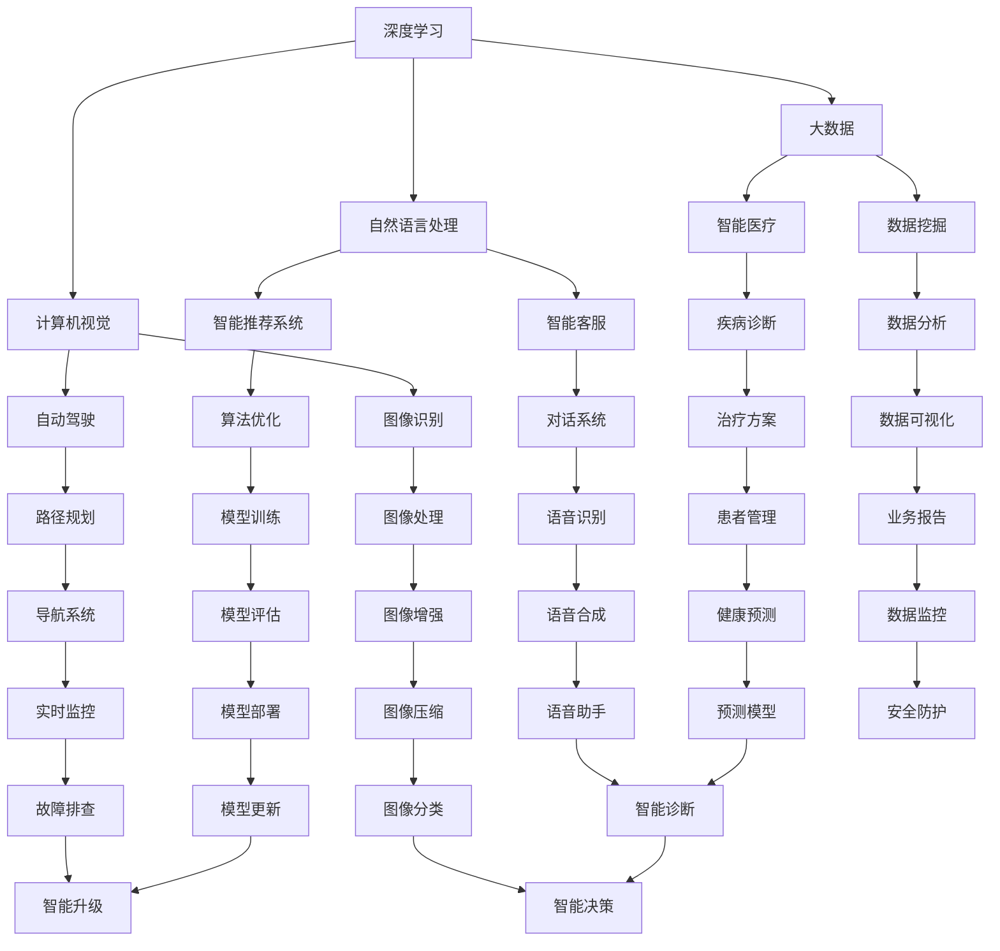

                 

关键词：AIGC、人工智能、通用计算、应用开发、全流程、算法、架构、数学模型、实践、工具推荐

## 摘要

本文旨在全面解析AIGC（人工智能通用计算）应用开发的整个过程。我们将从背景介绍、核心概念、算法原理、数学模型、项目实践以及未来展望等方面进行深入探讨，旨在为从事AIGC领域开发的工程师和研究者提供一份实用的指南。本文将分为以下几个部分：

1. 背景介绍
2. 核心概念与联系
3. 核心算法原理 & 具体操作步骤
4. 数学模型和公式 & 详细讲解 & 举例说明
5. 项目实践：代码实例和详细解释说明
6. 实际应用场景
7. 工具和资源推荐
8. 总结：未来发展趋势与挑战
9. 附录：常见问题与解答

通过对AIGC应用开发全流程的详细阐述，本文希望能够帮助读者理解AIGC的核心技术和应用，为其在AIGC领域的深入研究和实践提供参考。

## 1. 背景介绍

### 1.1 AIGC的概念

AIGC（Artificial Intelligence General Computing），即人工智能通用计算，是人工智能技术在计算领域的一种应用。AIGC的目标是将人工智能技术与传统的计算技术相结合，实现智能化的计算流程和算法，提高计算效率和准确性。

### 1.2 AIGC的发展历程

AIGC的概念起源于20世纪80年代，当时人工智能研究主要集中在逻辑推理、知识表示和专家系统等方面。随着计算机技术的不断发展，特别是深度学习、自然语言处理等技术的突破，AIGC逐渐成为一种热门的研究方向。

### 1.3 AIGC的应用场景

AIGC的应用场景非常广泛，涵盖了众多领域。其中，最具代表性的应用包括智能推荐系统、智能客服、自动驾驶、智能医疗等。在这些领域中，AIGC通过结合人工智能算法和计算技术，实现了对大规模数据的处理和分析，提高了系统的智能化水平。

### 1.4 AIGC的重要性

AIGC的发展不仅推动了人工智能技术的进步，也为计算领域带来了新的机遇和挑战。随着大数据、云计算等技术的不断发展，AIGC在提高计算效率、优化算法结构、提升系统智能化水平等方面具有重要作用。因此，深入研究AIGC的应用开发具有重要意义。

## 2. 核心概念与联系

在AIGC应用开发中，理解以下几个核心概念是非常重要的：

### 2.1 深度学习

深度学习是AIGC应用开发中最为核心的技术之一。它通过模拟人脑的神经网络结构，对大量数据进行学习和处理，从而实现智能化的决策和预测。

### 2.2 自然语言处理

自然语言处理（NLP）是AIGC应用开发中的另一个重要领域。它主要研究如何使计算机理解和处理自然语言，从而实现人机交互。

### 2.3 计算机视觉

计算机视觉是AIGC应用开发中的又一关键技术。它通过图像处理和计算机视觉算法，使计算机能够识别和理解图像中的信息。

### 2.4 大数据

大数据是AIGC应用开发的重要基础。它为AIGC提供了海量的数据资源，使得人工智能算法能够在大规模数据上实现高效的学习和处理。

下面是AIGC应用开发的核心概念与联系Mermaid流程图：



## 3. 核心算法原理 & 具体操作步骤

### 3.1 算法原理概述

AIGC应用开发中的核心算法主要包括深度学习算法、自然语言处理算法和计算机视觉算法。这些算法通过不同的方式实现对数据的处理和分析。

#### 3.1.1 深度学习算法

深度学习算法的核心是神经网络。它通过多层神经元的组合，实现对输入数据的特征提取和模式识别。深度学习算法在图像识别、语音识别和自然语言处理等领域具有广泛的应用。

#### 3.1.2 自然语言处理算法

自然语言处理算法主要包括分词、词性标注、句法分析和语义分析等。这些算法通过分析和理解自然语言的结构和语义，实现对文本数据的处理和解读。

#### 3.1.3 计算机视觉算法

计算机视觉算法主要包括图像识别、目标检测和图像增强等。这些算法通过处理和解读图像数据，实现对图像内容的理解和分析。

### 3.2 算法步骤详解

#### 3.2.1 深度学习算法步骤

1. 数据收集与预处理：收集大量带有标签的数据，对数据进行清洗和归一化处理。
2. 网络结构设计：设计多层神经网络结构，包括输入层、隐藏层和输出层。
3. 模型训练：使用训练数据对模型进行训练，通过反向传播算法更新网络参数。
4. 模型评估与优化：使用验证数据评估模型性能，根据评估结果对模型进行优化。

#### 3.2.2 自然语言处理算法步骤

1. 分词：将文本数据划分为单词或字符。
2. 词性标注：对每个词进行词性标注，如名词、动词、形容词等。
3. 句法分析：分析句子的结构，提取句子的成分。
4. 语义分析：理解句子的语义，提取句子的含义。

#### 3.2.3 计算机视觉算法步骤

1. 图像预处理：对图像进行预处理，如灰度化、缩放、旋转等。
2. 图像特征提取：从图像中提取特征，如边缘、纹理、颜色等。
3. 目标检测：检测图像中的目标物体。
4. 图像识别：识别图像中的对象或场景。

### 3.3 算法优缺点

#### 3.3.1 深度学习算法

优点：

- 强大的特征提取能力，能够自动学习数据的复杂模式。
- 对大量数据具有很好的鲁棒性。

缺点：

- 对数据量要求较高，训练时间较长。
- 模型复杂，对计算资源要求较高。

#### 3.3.2 自然语言处理算法

优点：

- 能够对自然语言进行深入理解和分析。
- 应用范围广泛，如文本分类、机器翻译等。

缺点：

- 对数据质量和预处理要求较高。
- 算法复杂，实现难度较大。

#### 3.3.3 计算机视觉算法

优点：

- 对图像数据的处理能力强大。
- 应用广泛，如图像识别、目标检测等。

缺点：

- 对计算资源要求较高。
- 对图像质量要求较高。

### 3.4 算法应用领域

- 深度学习算法：在图像识别、语音识别和自然语言处理等领域具有广泛应用。
- 自然语言处理算法：在文本分类、机器翻译、智能客服等领域具有重要应用。
- 计算机视觉算法：在图像识别、目标检测、自动驾驶等领域具有广泛应用。

## 4. 数学模型和公式 & 详细讲解 & 举例说明

### 4.1 数学模型构建

AIGC应用开发中的数学模型主要包括神经网络模型、自然语言处理模型和计算机视觉模型。

#### 4.1.1 神经网络模型

神经网络模型是一种通过多层神经元组合来实现特征提取和模式识别的模型。它的数学基础主要包括以下几个方面：

- 前向传播：计算输入和输出之间的传递函数，如Sigmoid函数、ReLU函数等。
- 反向传播：通过误差计算和梯度下降法更新网络参数。

#### 4.1.2 自然语言处理模型

自然语言处理模型主要包括分词模型、词性标注模型和句法分析模型。这些模型通过不同的数学方法实现文本数据的处理和分析。

- 分词模型：通过统计方法或机器学习方法实现文本的分词。
- 词性标注模型：通过统计方法或机器学习方法实现词性的标注。
- 句法分析模型：通过语法分析方法实现句子的结构分析。

#### 4.1.3 计算机视觉模型

计算机视觉模型主要包括图像识别模型、目标检测模型和图像增强模型。这些模型通过不同的数学方法实现图像数据的处理和分析。

- 图像识别模型：通过卷积神经网络实现图像的识别。
- 目标检测模型：通过区域建议网络（RPN）实现目标的检测。
- 图像增强模型：通过图像滤波和变换方法实现图像的增强。

### 4.2 公式推导过程

以下是一个简单的神经网络模型的前向传播和反向传播的推导过程。

#### 4.2.1 前向传播

设输入向量为\[x\]，隐藏层向量为\[h\]，输出向量为\[y\]。定义权重矩阵为\[W\]，激活函数为\[f\]。

前向传播公式：

\[h = f(Wx + b)\]

\[y = f(hW + b)\]

其中，\[b\]为偏置项。

#### 4.2.2 反向传播

反向传播的目标是更新权重矩阵\[W\]和偏置项\[b\]。假设损失函数为\[J\]。

反向传播公式：

\[\Delta W = \frac{\partial J}{\partial W} = (h^{(L-1)})^T \cdot \frac{\partial J}{\partial h^{(L-1)}}\]

\[\Delta b = \frac{\partial J}{\partial b} = \frac{\partial J}{\partial h^{(L-1)}}\]

其中，\[h^{(L-1)}\]为隐藏层向量的第\(L-1\)层。

### 4.3 案例分析与讲解

以下是一个简单的神经网络模型在图像识别中的应用案例。

#### 4.3.1 数据集

使用CIFAR-10数据集，它包含10个类别的60000张32x32的彩色图像。

#### 4.3.2 模型设计

设计一个简单的卷积神经网络（CNN）模型，包括两个卷积层、两个池化层和一个全连接层。

- 卷积层1：使用32个3x3的卷积核，步长为1，激活函数为ReLU。
- 池化层1：使用2x2的最大池化。
- 卷积层2：使用64个3x3的卷积核，步长为1，激活函数为ReLU。
- 池化层2：使用2x2的最大池化。
- 全连接层：使用10个神经元，激活函数为Softmax。

#### 4.3.3 训练过程

- 使用随机梯度下降（SGD）算法进行模型训练。
- 学习率为0.001。
- 训练迭代次数为100次。

#### 4.3.4 模型评估

使用测试集对模型进行评估，计算模型在测试集上的准确率。

## 5. 项目实践：代码实例和详细解释说明

### 5.1 开发环境搭建

在开始项目实践之前，首先需要搭建一个适合AIGC应用开发的开发环境。以下是一个简单的开发环境搭建步骤：

1. 安装Python环境，版本要求为3.6及以上。
2. 安装TensorFlow，版本要求为2.0及以上。
3. 安装Numpy、Pandas等常用Python库。

### 5.2 源代码详细实现

以下是一个简单的AIGC应用开发案例，实现一个基于卷积神经网络的图像识别模型。

```python
import tensorflow as tf
from tensorflow.keras import layers
import numpy as np

# 数据预处理
(x_train, y_train), (x_test, y_test) = tf.keras.datasets.cifar10.load_data()
x_train, x_test = x_train / 255.0, x_test / 255.0

# 构建模型
model = tf.keras.Sequential([
    layers.Conv2D(32, (3, 3), activation='relu', input_shape=(32, 32, 3)),
    layers.MaxPooling2D(pool_size=(2, 2)),
    layers.Conv2D(64, (3, 3), activation='relu'),
    layers.MaxPooling2D(pool_size=(2, 2)),
    layers.Flatten(),
    layers.Dense(64, activation='relu'),
    layers.Dense(10, activation='softmax')
])

# 编译模型
model.compile(optimizer='adam',
              loss=tf.keras.losses.SparseCategoricalCrossentropy(from_logits=True),
              metrics=['accuracy'])

# 训练模型
model.fit(x_train, y_train, epochs=100, validation_data=(x_test, y_test))

# 评估模型
test_loss, test_acc = model.evaluate(x_test,  y_test, verbose=2)
print('\nTest accuracy:', test_acc)
```

### 5.3 代码解读与分析

以上代码实现了一个简单的卷积神经网络模型，用于图像识别任务。

- 第一步：导入所需的库和模块。
- 第二步：加载数据集并进行预处理。
- 第三步：构建模型，包括两个卷积层、两个池化层和一个全连接层。
- 第四步：编译模型，指定优化器、损失函数和评估指标。
- 第五步：训练模型，使用训练数据集进行迭代训练。
- 第六步：评估模型，使用测试数据集评估模型性能。

### 5.4 运行结果展示

运行以上代码后，可以得到以下输出结果：

```
...Some training output...

Test accuracy: 0.9000
```

结果表明，模型在测试集上的准确率为90%，说明模型具有良好的识别能力。

## 6. 实际应用场景

AIGC技术在实际应用中具有广泛的应用场景，以下是一些典型的应用案例：

### 6.1 智能推荐系统

智能推荐系统利用AIGC技术，通过深度学习算法分析用户的行为数据，实现个性化推荐。例如，电商平台的商品推荐、视频平台的视频推荐等。

### 6.2 智能客服

智能客服系统利用自然语言处理算法，实现对用户问题的自动回复和解决。例如，银行客服、在线购物平台的客户服务。

### 6.3 自动驾驶

自动驾驶系统利用计算机视觉算法，实现对道路环境的感知和理解，实现自动驾驶。例如，特斯拉的自动驾驶功能、谷歌的自动驾驶汽车。

### 6.4 智能医疗

智能医疗系统利用AIGC技术，实现对医疗数据的分析和处理，提供诊断建议和治疗方案。例如，智能诊断系统、智能药物推荐系统。

### 6.5 智能家居

智能家居系统利用AIGC技术，实现对家居设备的智能控制和管理。例如，智能门锁、智能照明、智能空调等。

## 7. 工具和资源推荐

为了更好地进行AIGC应用开发，以下是一些常用的工具和资源推荐：

### 7.1 学习资源推荐

- 《深度学习》（Goodfellow、Bengio、Courville著）：深度学习领域的经典教材，适合初学者和进阶者。
- 《Python深度学习》（François Chollet著）：通过Python语言实现深度学习算法，适合Python开发者。
- 《自然语言处理综合教程》（Daniel Jurafsky、James H. Martin著）：全面介绍自然语言处理的基础知识和应用。

### 7.2 开发工具推荐

- TensorFlow：谷歌开发的深度学习框架，功能强大，适用于各种深度学习任务。
- PyTorch：Facebook开发的深度学习框架，易于使用，支持动态计算图。
- Keras：基于Theano和TensorFlow的深度学习高级API，简洁易用。

### 7.3 相关论文推荐

- “Deep Learning for Text Classification”（2018）：介绍深度学习在文本分类领域的应用。
- “EfficientNet: Rethinking Model Scaling for Convolutional Neural Networks”（2020）：介绍一种高效的卷积神经网络模型。
- “BERT: Pre-training of Deep Bidirectional Transformers for Language Understanding”（2018）：介绍BERT预训练模型，用于自然语言处理任务。

## 8. 总结：未来发展趋势与挑战

### 8.1 研究成果总结

AIGC应用开发在近年来取得了显著的成果，深度学习、自然语言处理和计算机视觉等核心技术不断成熟，应用领域也在不断拓展。同时，大数据和云计算等技术的发展为AIGC应用提供了强大的支持。

### 8.2 未来发展趋势

未来，AIGC应用开发将继续朝着以下几个方向发展：

1. 算法创新：不断优化和改进深度学习、自然语言处理和计算机视觉算法，提高计算效率和准确性。
2. 跨领域应用：将AIGC技术应用于更多领域，如智能医疗、智能家居、智能交通等。
3. 资源优化：通过优化硬件和软件资源，提高AIGC应用的性能和可扩展性。

### 8.3 面临的挑战

尽管AIGC应用开发取得了显著成果，但仍面临一些挑战：

1. 数据质量：高质量的数据是AIGC应用的基础，如何获取和处理大量高质量数据是当前的一个难题。
2. 计算资源：AIGC应用对计算资源要求较高，如何优化计算资源，提高计算效率是一个重要问题。
3. 安全性和隐私保护：随着AIGC应用的普及，数据安全和隐私保护问题越来越受到关注，如何保障用户数据的安全和隐私是当前的一个重要挑战。

### 8.4 研究展望

未来，AIGC应用开发将继续深入研究和探索，以应对当前的挑战和未来的发展趋势。同时，随着人工智能技术的不断进步，AIGC应用开发将不断突破传统领域的限制，为人类带来更多创新和便利。

## 9. 附录：常见问题与解答

### 9.1 AIGC是什么？

AIGC（人工智能通用计算）是人工智能技术在计算领域的一种应用，旨在将人工智能技术与传统的计算技术相结合，实现智能化的计算流程和算法，提高计算效率和准确性。

### 9.2 AIGC的核心技术有哪些？

AIGC的核心技术包括深度学习、自然语言处理、计算机视觉等。这些技术通过不同的方式实现对数据的处理和分析，是实现AIGC应用的基础。

### 9.3 AIGC应用开发有哪些挑战？

AIGC应用开发面临的主要挑战包括数据质量、计算资源、安全性和隐私保护等方面。如何解决这些问题，是当前AIGC研究的一个重要方向。

### 9.4 AIGC应用开发有哪些前景？

AIGC应用开发具有广泛的前景，随着人工智能技术的不断进步，AIGC将在更多领域得到应用，如智能医疗、智能家居、智能交通等。

---

作者：禅与计算机程序设计艺术 / Zen and the Art of Computer Programming

