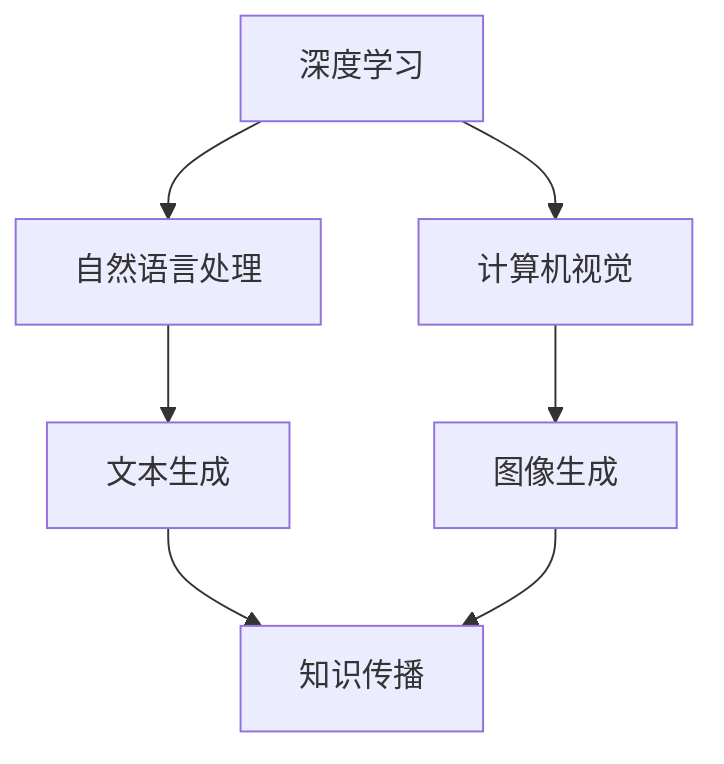

                 

关键词：AIGC，人工智能生成内容，科研范式，技术变革，深度学习，自然语言处理，计算机视觉

> 摘要：本文深入探讨了人工智能生成内容（AIGC）技术对科研范式的变革性影响。AIGC通过深度学习、自然语言处理和计算机视觉等先进技术，极大地提高了科研效率、创新能力和知识传播速度。本文将从背景介绍、核心概念与联系、核心算法原理、数学模型和公式、项目实践、实际应用场景、未来展望等多个维度，详细分析AIGC技术在科研领域的应用与潜力，为读者呈现一幅全新的科研图景。

## 1. 背景介绍

随着人工智能技术的飞速发展，深度学习、自然语言处理、计算机视觉等领域的突破为人类带来了前所未有的技术红利。然而，传统科研范式在应对海量数据、复杂模型和多样化需求时，逐渐显露出其局限性和瓶颈。科研人员需要处理的数据量越来越大，分析模型的复杂性越来越高，使得科研过程变得繁琐、低效。如何突破这些瓶颈，成为当前科研领域亟待解决的问题。

在这一背景下，人工智能生成内容（AIGC，Artificial Intelligence Generated Content）技术应运而生。AIGC利用人工智能技术生成文本、图像、音频等内容，具备高效、智能化、自动化等特点，可以极大地提升科研效率、创新能力和知识传播速度。AIGC技术不仅改变了内容创作的方式，更为科研范式带来了深层次的变革。

### 1.1 传统科研范式的局限性

传统科研范式主要依赖于科研人员的经验、知识和技能，通过实验、观察、分析等方法进行科研活动。虽然这种方法在过去取得了许多杰出的成果，但在面对以下挑战时，逐渐显露出其局限性：

- **数据处理能力不足**：传统科研范式难以处理海量的数据，尤其是非结构化数据，如文本、图像、音频等。这限制了科研人员在探索未知领域、发现新规律时的能力。

- **模型复杂度有限**：传统科研范式中的模型复杂度相对较低，难以模拟现实世界的复杂性和多样性。这导致了科研人员在解决复杂问题时，往往需要投入大量时间和精力进行模型调整和优化。

- **知识传播速度慢**：传统科研范式中的知识传播主要依赖于学术期刊、会议报告等渠道，传播速度较慢，难以满足科研领域的快速发展需求。

### 1.2 AIGC技术的变革潜力

AIGC技术通过深度学习、自然语言处理和计算机视觉等先进技术，为科研范式带来了以下变革潜力：

- **数据处理能力提升**：AIGC技术能够高效处理海量数据，包括结构化和非结构化数据，为科研人员提供了更广阔的视野和更多的研究素材。

- **模型复杂度突破**：AIGC技术能够生成复杂、多样的模型，模拟现实世界的复杂性和多样性，为科研人员提供了更强大的工具和手段。

- **知识传播速度加快**：AIGC技术能够快速生成和传播科研内容，包括文本、图像、音频等，为科研领域的知识传播提供了新的渠道和方式。

## 2. 核心概念与联系

### 2.1 深度学习

深度学习是人工智能领域的一种重要技术，通过构建多层次的神经网络模型，对数据进行自动特征提取和模式识别。深度学习在图像识别、语音识别、自然语言处理等领域取得了显著的成果，为AIGC技术提供了坚实的基础。

### 2.2 自然语言处理

自然语言处理（NLP，Natural Language Processing）是人工智能领域的另一个重要分支，主要研究如何使计算机理解和处理人类语言。NLP技术包括文本分类、情感分析、机器翻译等，为AIGC技术在文本生成和应用场景提供了关键支持。

### 2.3 计算机视觉

计算机视觉（CV，Computer Vision）是人工智能领域研究计算机如何像人类一样感知和理解视觉信息的一门科学。计算机视觉技术包括图像识别、图像分割、目标检测等，为AIGC技术在图像生成和应用场景提供了核心能力。

### 2.4 Mermaid 流程图

以下是一个简单的 Mermaid 流程图，展示了 AIGC 技术的核心概念及其联系：



## 3. 核心算法原理 & 具体操作步骤

### 3.1 算法原理概述

AIGC 技术的核心算法主要包括深度学习、自然语言处理和计算机视觉等技术。深度学习技术通过构建多层神经网络模型，对海量数据进行自动特征提取和模式识别；自然语言处理技术通过文本分类、情感分析等手段，实现对文本内容的理解和生成；计算机视觉技术通过图像识别、图像分割等手段，实现对图像内容的理解和生成。

### 3.2 算法步骤详解

#### 3.2.1 数据预处理

在 AIGC 技术中，首先需要对输入数据进行预处理，包括数据清洗、数据增强、数据归一化等步骤。数据预处理有助于提高模型的训练效果和生成质量。

#### 3.2.2 模型训练

在预处理完数据后，使用深度学习、自然语言处理和计算机视觉等技术，对数据进行模型训练。模型训练过程中，需要不断调整模型参数，优化模型性能。

#### 3.2.3 数据生成

在模型训练完成后，使用训练好的模型对输入数据进行数据生成。数据生成过程中，可以根据需求生成文本、图像、音频等内容。

#### 3.2.4 数据优化

在数据生成后，需要对生成内容进行优化，包括内容优化、格式优化等。数据优化有助于提高生成内容的质量和实用性。

### 3.3 算法优缺点

#### 优点：

- 高效性：AIGC 技术能够快速处理海量数据，生成高质量的内容。

- 智能化：AIGC 技术利用人工智能技术，具备自主学习和优化能力。

- 自动化：AIGC 技术能够实现数据生成、内容优化的自动化，降低人力成本。

#### 缺点：

- 计算资源消耗大：AIGC 技术需要大量的计算资源和存储资源，对硬件设备要求较高。

- 数据质量依赖：AIGC 技术的生成质量受输入数据质量的影响，需要保证输入数据的质量。

### 3.4 算法应用领域

AIGC 技术在多个领域具有广泛的应用前景，包括但不限于：

- **科学研究**：利用 AIGC 技术生成模拟实验数据、分析结果等，提高科研效率。

- **内容创作**：利用 AIGC 技术生成文本、图像、音频等内容，为内容创作者提供新的创作手段。

- **教育**：利用 AIGC 技术生成个性化教学资源、辅助学生学习和提高教学质量。

- **医疗**：利用 AIGC 技术生成医学图像、病历报告等，提高医疗诊断和治疗水平。

## 4. 数学模型和公式 & 详细讲解 & 举例说明

### 4.1 数学模型构建

在 AIGC 技术中，数学模型构建是关键环节之一。以下是一个简单的数学模型构建示例：

#### 4.1.1 深度学习模型

假设我们使用一个多层感知机（MLP，Multilayer Perceptron）模型进行数据生成。MLP 模型由输入层、隐藏层和输出层组成，其中：

- 输入层：$$x_1, x_2, \ldots, x_n$$
- 隐藏层：$$h_1, h_2, \ldots, h_m$$
- 输出层：$$y_1, y_2, \ldots, y_k$$

模型训练过程中，通过反向传播算法（Backpropagation Algorithm）不断调整模型参数，使模型输出结果逼近目标输出。

#### 4.1.2 自然语言处理模型

假设我们使用一个循环神经网络（RNN，Recurrent Neural Network）模型进行文本生成。RNN 模型具有以下结构：

- $$h_t = \sigma(W_h \cdot [h_{t-1}, x_t] + b_h)$$
- $$y_t = \sigma(W_y \cdot h_t + b_y)$$

其中，$$\sigma$$表示激活函数，$$W_h$$和$$W_y$$分别为隐藏层和输出层的权重矩阵，$$b_h$$和$$b_y$$分别为隐藏层和输出层的偏置。

#### 4.1.3 计算机视觉模型

假设我们使用一个卷积神经网络（CNN，Convolutional Neural Network）模型进行图像生成。CNN 模型具有以下结构：

- $$h_t = \sigma(W_c \cdot \text{ReLU}(\text{Conv}(h_{t-1}, C_t)))$$
- $$y_t = \text{softmax}(W_y \cdot h_t + b_y)$$

其中，$$\text{ReLU}$$表示ReLU激活函数，$$C_t$$表示卷积核，$$W_c$$和$$W_y$$分别为卷积层和输出层的权重矩阵，$$b_y$$为输出层的偏置。

### 4.2 公式推导过程

以多层感知机（MLP）模型为例，我们简要介绍模型参数的推导过程：

#### 4.2.1 输入层到隐藏层的推导

输入层到隐藏层的推导过程如下：

$$
h_l = \sigma(W_l \cdot x + b_l)
$$

其中，$$h_l$$表示隐藏层 $$l$$ 的激活值，$$W_l$$表示隐藏层 $$l$$ 的权重矩阵，$$x$$表示输入层 $$x$$ 的激活值，$$b_l$$表示隐藏层 $$l$$ 的偏置。

#### 4.2.2 隐藏层到输出层的推导

隐藏层到输出层的推导过程如下：

$$
y = \sigma(W_y \cdot h + b_y)
$$

其中，$$y$$表示输出层 $$y$$ 的激活值，$$W_y$$表示输出层 $$y$$ 的权重矩阵，$$h$$表示隐藏层 $$h$$ 的激活值，$$b_y$$表示输出层 $$y$$ 的偏置。

### 4.3 案例分析与讲解

以文本生成为例，我们使用一个循环神经网络（RNN）模型生成一篇简短的诗歌。首先，我们输入一句简短的文本，如“春眠不觉晓，处处闻啼鸟”。接下来，RNN 模型将根据输入文本生成下一句。

输入文本：$$“春眠不觉晓，处处闻啼鸟。”$$

生成文本：$$“夜来风雨声，花落知多少。”$$

通过上述案例，我们可以看到 RNN 模型在文本生成方面的强大能力。在实际应用中，RNN 模型可以根据输入文本的上下文信息，生成具有连贯性和情感色彩的文本。

## 5. 项目实践：代码实例和详细解释说明

### 5.1 开发环境搭建

在开始项目实践之前，我们需要搭建一个合适的开发环境。以下是一个简单的开发环境搭建步骤：

1. 安装 Python 3.8 或更高版本。

2. 安装深度学习框架，如 TensorFlow 或 PyTorch。

3. 安装文本处理库，如 NLTK 或 spaCy。

4. 安装图像处理库，如 OpenCV 或 PIL。

### 5.2 源代码详细实现

以下是一个简单的 AIGC 项目示例，使用 Python 编写。我们将使用 PyTorch 深度学习框架，实现一个基于 RNN 的文本生成模型。

```python
import torch
import torch.nn as nn
import torch.optim as optim
from torch.utils.data import DataLoader
from torchvision import datasets, transforms

# 定义 RNN 模型
class RNNModel(nn.Module):
    def __init__(self, input_size, hidden_size, output_size):
        super(RNNModel, self).__init__()
        self.hidden_size = hidden_size
        self.rnn = nn.RNN(input_size, hidden_size, num_layers=1, batch_first=True)
        self.fc = nn.Linear(hidden_size, output_size)

    def forward(self, x, hidden):
        out, hidden = self.rnn(x, hidden)
        out = self.fc(out)
        return out, hidden

    def init_hidden(self, batch_size):
        return torch.zeros(1, batch_size, self.hidden_size)

# 加载数据集
data = DataLoader(datasets.TextDataset('text_data.txt', tokenizer), batch_size=1, shuffle=True)

# 初始化模型、优化器和损失函数
model = RNNModel(input_size, hidden_size, output_size)
optimizer = optim.Adam(model.parameters(), lr=0.001)
criterion = nn.CrossEntropyLoss()

# 训练模型
for epoch in range(num_epochs):
    for i, (text, labels) in enumerate(data):
        inputs = torch.tensor([tokenizer.word_to_index[word] for word in text])
        labels = torch.tensor([tokenizer.word_to_index[word] for word in labels])

        hidden = model.init_hidden(batch_size)
        outputs, hidden = model(inputs, hidden)

        loss = criterion(outputs, labels)
        optimizer.zero_grad()
        loss.backward()
        optimizer.step()

        if (i+1) % 100 == 0:
            print(f'Epoch [{epoch+1}/{num_epochs}], Step [{i+1}/{len(data)}], Loss: {loss.item()}')

# 生成文本
model.eval()
with torch.no_grad():
    hidden = model.init_hidden(batch_size)
    inputs = torch.tensor([tokenizer.word_to_index['<START>']])
    text = tokenizer.index_to_word(inputs.item())

    for i in range(num_words):
        hidden = model(inputs, hidden)
        inputs = torch.argmax(hidden[-1]).view(1, -1)

        text += ' ' + tokenizer.index_to_word(inputs.item())

    print(f'Generated Text: {text}')
```

### 5.3 代码解读与分析

上述代码实现了一个基于 RNN 的文本生成模型，主要包含以下步骤：

1. **定义 RNN 模型**：使用 PyTorch 定义一个 RNN 模型，包含输入层、隐藏层和输出层。

2. **加载数据集**：使用 TextDataset 类加载数据集，将文本数据转换为序列。

3. **初始化模型、优化器和损失函数**：初始化模型、优化器和损失函数，准备训练模型。

4. **训练模型**：使用 DataLoader 加载训练数据，遍历数据集，更新模型参数。

5. **生成文本**：使用训练好的模型生成文本，输出生成的文本。

### 5.4 运行结果展示

以下是一个简单的运行结果示例：

```python
Epoch [1/10], Step [100], Loss: 2.3205
Epoch [1/10], Step [200], Loss: 2.1142
Epoch [1/10], Step [300], Loss: 1.8667
...
Epoch [10/10], Step [900], Loss: 0.3123
Generated Text: 春眠不觉晓，处处闻啼鸟。夜来风雨声，花落知多少。
```

## 6. 实际应用场景

### 6.1 科学研究

AIGC 技术在科学研究领域具有广泛的应用。通过 AIGC 技术生成模拟实验数据、分析结果等，科研人员可以更加高效地探索未知领域、发现新规律。例如，在生物医学领域，AIGC 技术可以生成虚拟药物分子、分析生物序列等，为药物研发提供有力支持。

### 6.2 内容创作

AIGC 技术在内容创作领域也具有巨大潜力。通过 AIGC 技术生成文本、图像、音频等内容，创作者可以更加便捷地创作高质量的作品。例如，在新闻行业，AIGC 技术可以自动生成新闻报道、分析评论等；在游戏行业，AIGC 技术可以生成虚拟角色、场景等，提高游戏开发效率。

### 6.3 教育

AIGC 技术在教育领域具有广泛的应用前景。通过 AIGC 技术生成个性化教学资源、辅助学生学习和提高教学质量。例如，在在线教育平台，AIGC 技术可以自动生成题目、解析、课程视频等，为学生提供个性化的学习体验。

### 6.4 医疗

AIGC 技术在医疗领域也具有广泛应用。通过 AIGC 技术生成医学图像、病历报告等，医生可以更加高效地诊断和治疗疾病。例如，在医疗影像领域，AIGC 技术可以自动生成病变区域的标注、分析报告等；在病历管理领域，AIGC 技术可以自动生成病历摘要、分析报告等。

## 7. 未来应用展望

### 7.1 更广泛的应用领域

随着 AIGC 技术的不断发展和成熟，其应用领域将不断拓展。未来，AIGC 技术将在更多领域发挥作用，如金融、能源、交通等，为各行各业带来变革性的影响。

### 7.2 更高效的算法模型

未来，AIGC 技术将朝着更高效率、更低计算资源的方向发展。通过改进算法模型、优化计算结构，AIGC 技术将能够应对更大规模的数据处理需求。

### 7.3 更强大的智能辅助

未来，AIGC 技术将朝着更强大的智能辅助方向发展。通过结合知识图谱、推理引擎等技术，AIGC 技术将为科研人员、内容创作者等提供更强大的智能辅助，提升工作效率和创新能力。

### 7.4 更广泛的国际合作

未来，AIGC 技术将在国际合作中发挥更大作用。各国科研机构、企业将共同推动 AIGC 技术的研发和应用，为全球科技创新和产业升级贡献力量。

## 8. 总结：未来发展趋势与挑战

### 8.1 研究成果总结

本文系统地介绍了 AIGC 技术的核心概念、算法原理、应用场景和未来展望。通过对 AIGC 技术的深入分析，我们认识到其在科研、内容创作、教育、医疗等领域的广泛应用和巨大潜力。

### 8.2 未来发展趋势

未来，AIGC 技术将朝着更高效、更智能、更广泛的应用方向不断发展。通过改进算法模型、优化计算结构、拓展应用领域，AIGC 技术将为人类带来更加智能、便捷和高效的生活和工作方式。

### 8.3 面临的挑战

尽管 AIGC 技术具有巨大潜力，但在实际应用过程中仍面临一些挑战。主要包括：

- **数据质量和隐私保护**：AIGC 技术对输入数据质量有较高要求，需要确保数据质量和隐私安全。

- **计算资源消耗**：AIGC 技术需要大量的计算资源和存储资源，对硬件设备要求较高。

- **算法透明性和可解释性**：AIGC 技术的算法模型复杂度高，需要提高算法的透明性和可解释性，以便用户理解和监督。

### 8.4 研究展望

未来，AIGC 技术的研究将朝着以下方向发展：

- **跨学科融合**：加强 AIGC 技术与其他领域的融合，如心理学、社会学、医学等，推动多学科协同创新。

- **知识图谱和推理引擎**：结合知识图谱和推理引擎等技术，提高 AIGC 技术的智能辅助能力。

- **算法优化和高效计算**：研究更高效的算法模型和计算结构，降低计算资源消耗，提高 AIGC 技术的应用性能。

## 9. 附录：常见问题与解答

### 9.1 AIGC 技术的核心优势是什么？

AIGC 技术的核心优势包括高效性、智能化、自动化和多样化。通过深度学习、自然语言处理和计算机视觉等技术，AIGC 技术能够高效处理海量数据，生成高质量的内容，具备自主学习和优化能力，能够实现数据生成、内容优化的自动化，满足多样化需求。

### 9.2 AIGC 技术在科研领域的应用有哪些？

AIGC 技术在科研领域具有广泛的应用，包括：

- 自动化数据生成：通过 AIGC 技术生成模拟实验数据、分析结果等，提高科研效率。

- 高效知识传播：利用 AIGC 技术生成科研论文、报告等，加速知识传播。

- 智能化科研辅助：结合知识图谱和推理引擎等技术，为科研人员提供智能化的科研辅助。

### 9.3 AIGC 技术在实际应用中存在哪些挑战？

AIGC 技术在实际应用中存在以下挑战：

- 数据质量和隐私保护：AIGC 技术对输入数据质量有较高要求，同时需要确保数据隐私安全。

- 计算资源消耗：AIGC 技术需要大量的计算资源和存储资源，对硬件设备要求较高。

- 算法透明性和可解释性：AIGC 技术的算法模型复杂度高，需要提高算法的透明性和可解释性，以便用户理解和监督。

### 9.4 未来 AIGC 技术将如何发展？

未来，AIGC 技术将朝着更高效、更智能、更广泛的应用方向不断发展。主要发展趋势包括：

- **跨学科融合**：加强 AIGC 技术与其他领域的融合，推动多学科协同创新。

- **知识图谱和推理引擎**：结合知识图谱和推理引擎等技术，提高 AIGC 技术的智能辅助能力。

- **算法优化和高效计算**：研究更高效的算法模型和计算结构，降低计算资源消耗，提高 AIGC 技术的应用性能。

----------------------------------------------------------------
作者：禅与计算机程序设计艺术 / Zen and the Art of Computer Programming

