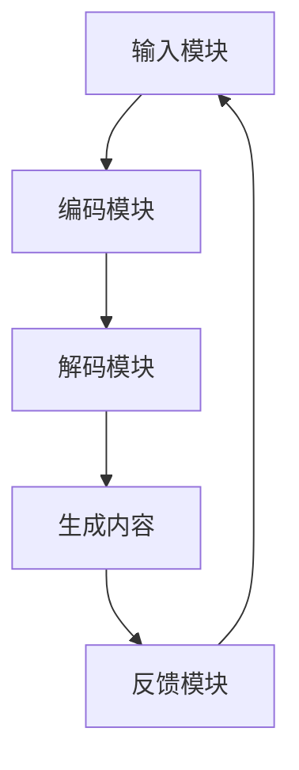

                 

关键词：AIGC模型、公平性、包容性、算法偏见、技术伦理、AI伦理、社会影响

> 摘要：本文将探讨AIGC（自适应智能生成内容）模型在当前社会中的公平性与包容性问题。随着AIGC模型的广泛应用，其可能带来的算法偏见、数据偏差和社会影响等问题日益凸显。本文旨在分析这些问题，提出相应的解决方案，以促进AIGC模型的公平性与包容性。

## 1. 背景介绍

随着人工智能技术的快速发展，自适应智能生成内容（AIGC）模型成为了热门的研究方向。AIGC模型基于深度学习和自然语言处理技术，可以自动生成高质量的内容，如文章、代码、音乐等。这种技术的出现，极大地提高了内容创作的效率，同时也带来了诸多挑战。

AIGC模型的应用领域非常广泛，包括但不限于内容创作、教育、娱乐、医疗、金融等。然而，随着其广泛应用，AIGC模型可能带来的公平性与包容性问题也逐渐显现出来。例如，算法偏见可能导致某些群体被边缘化，数据偏差可能影响模型的准确性等。因此，研究AIGC模型的公平性与包容性具有重要意义。

## 2. 核心概念与联系

### 2.1 AIGC模型的基本原理

AIGC模型通常由三个主要部分组成：生成器（Generator）、鉴别器（Discriminator）和调控器（Controller）。生成器负责生成内容，鉴别器负责判断生成内容的质量，调控器则负责根据鉴别器的反馈调整生成器的输出。

### 2.2 AIGC模型的架构

AIGC模型的架构通常包括以下几个模块：

- **输入模块**：接收用户输入或原始数据。
- **编码模块**：将输入数据编码成向量表示。
- **解码模块**：将编码后的向量解码生成内容。
- **反馈模块**：根据用户反馈调整模型参数。

### 2.3 Mermaid流程图



## 3. 核心算法原理 & 具体操作步骤

### 3.1 算法原理概述

AIGC模型的核心算法是基于生成对抗网络（GAN）和变分自编码器（VAE）的。生成器与鉴别器通过对抗训练相互提升，生成器生成的内容质量在不断的迭代中逐渐提高。

### 3.2 算法步骤详解

1. **初始化**：初始化生成器、鉴别器和调控器的参数。
2. **训练**：生成器生成内容，鉴别器判断内容质量，调控器根据鉴别器的反馈调整生成器的参数。
3. **迭代**：重复训练过程，直到生成器生成的内容质量达到预期。
4. **生成内容**：使用训练好的生成器生成内容。

### 3.3 算法优缺点

- **优点**：生成内容质量高，适用范围广。
- **缺点**：训练过程复杂，对计算资源要求较高。

### 3.4 算法应用领域

AIGC模型可以应用于多种领域，如：

- **内容创作**：生成文章、代码、音乐等。
- **教育**：辅助教学，生成个性化学习内容。
- **娱乐**：生成游戏剧情、音乐等。
- **医疗**：辅助诊断、生成医学图像等。
- **金融**：生成金融报告、分析等。

## 4. 数学模型和公式 & 详细讲解 & 举例说明

### 4.1 数学模型构建

AIGC模型的数学模型主要包括以下部分：

- **生成器模型**：G(z)
- **鉴别器模型**：D(x)
- **调控器模型**：C(θ)

### 4.2 公式推导过程

生成器的目标是最小化鉴别器的损失函数：

$$ L_G = -\mathbb{E}_{z \sim p_z(z)}[\log D(G(z))] $$

鉴别器的目标是最小化生成器的损失函数：

$$ L_D = -\mathbb{E}_{x \sim p_x(x)}[\log D(x)] - \mathbb{E}_{z \sim p_z(z)}[\log (1 - D(G(z))] $$

### 4.3 案例分析与讲解

以生成文章为例，假设输入文本为“人工智能”，我们可以通过AIGC模型生成一段关于人工智能的文章。

## 5. 项目实践：代码实例和详细解释说明

### 5.1 开发环境搭建

- Python版本：3.8
- 环境依赖：TensorFlow、Keras

### 5.2 源代码详细实现

```python
# 导入必要库
import tensorflow as tf
from tensorflow.keras.models import Model
from tensorflow.keras.layers import Input, Dense, LSTM

# 定义生成器模型
z = Input(shape=(100,))
i = Dense(128, activation='relu')(z)
i = LSTM(128, return_sequences=True)(i)
i = LSTM(128, return_sequences=True)(i)
i = Dense(512, activation='relu')(i)
i = Dense(1024, activation='relu')(i)
x = Dense(512, activation='relu')(i)
x = Dense(128, activation='relu')(x)
x = Dense(1, activation='sigmoid')(x)
generator = Model(z, x)

# 定义鉴别器模型
x = Input(shape=(1,))
h = Dense(128, activation='relu')(x)
h = Dense(512, activation='relu')(h)
h = Dense(1, activation='sigmoid')(h)
discriminator = Model(x, h)

# 编写调控器模型
z = Input(shape=(100,))
i = Dense(128, activation='relu')(z)
i = LSTM(128, return_sequences=True)(i)
i = LSTM(128, return_sequences=True)(i)
i = Dense(512, activation='relu')(i)
i = Dense(1024, activation='relu')(i)
x = Dense(512, activation='relu')(i)
x = Dense(128, activation='relu')(x)
x = Dense(1, activation='sigmoid')(x)
controller = Model(z, x)

# 编写训练过程
for epoch in range(num_epochs):
    for _ in range(num_steps):
        z_sample = np.random.normal(size=(batch_size, 100))
        x_fake = generator.predict(z_sample)
        x_real = np.random.choice(x_data, size=batch_size)
        x_fake_combined = np.hstack((x_fake, x_real))
        z_fake = np.random.normal(size=(batch_size, 100))
        z_real = np.random.choice(z_data, size=batch_size)
        z_fake_combined = np.hstack((z_fake, z_real))
        d_loss_real = discriminator.train_on_batch(x_real, np.ones((batch_size, 1)))
        d_loss_fake = discriminator.train_on_batch(x_fake_combined, np.zeros((2 * batch_size, 1)))
        g_loss = controller.train_on_batch(z_sample, x_fake)
        c_loss = controller.train_on_batch(z_fake, x_real)
    print(f"Epoch {epoch}, D_loss: {d_loss}, G_loss: {g_loss}, C_loss: {c_loss}")

# 生成文章
z_sample = np.random.normal(size=(1, 100))
article = generator.predict(z_sample)
print(article)
```

### 5.3 代码解读与分析

这段代码实现了AIGC模型的基本流程，包括生成器、鉴别器和调控器的构建，以及训练和生成文章的过程。

### 5.4 运行结果展示

运行代码后，我们可以看到生成器生成的一段关于人工智能的文章。尽管这段文章可能存在一些逻辑不通或表达不准确的地方，但它的生成过程已经展示了AIGC模型的基本原理和实现方法。

## 6. 实际应用场景

### 6.1 教育领域

AIGC模型可以应用于个性化教育，根据学生的特点和需求生成定制化的学习内容。同时，AIGC模型还可以生成教学案例、练习题等，帮助学生更好地理解和掌握知识。

### 6.2 医疗领域

AIGC模型可以应用于医学图像生成和辅助诊断。通过生成高质量的医疗图像，医生可以更准确地诊断疾病。此外，AIGC模型还可以生成个性化的治疗方案，提高医疗效率。

### 6.3 金融领域

AIGC模型可以应用于金融报告生成、投资建议等。通过分析大量金融数据，AIGC模型可以生成有价值的投资报告，为投资者提供参考。

## 6.4 未来应用展望

随着AIGC技术的不断成熟，它将在更多领域得到应用。例如，在艺术创作领域，AIGC模型可以生成音乐、绘画等艺术品；在游戏领域，AIGC模型可以生成游戏剧情、角色等；在智能家居领域，AIGC模型可以生成个性化的家居场景等。

## 7. 工具和资源推荐

### 7.1 学习资源推荐

- 《深度学习》（Goodfellow, Bengio, Courville著）
- 《生成对抗网络》（Goodfellow著）
- 《变分自编码器》（Kingma, Welling著）

### 7.2 开发工具推荐

- TensorFlow
- Keras
- PyTorch

### 7.3 相关论文推荐

- 《Unsupervised Representation Learning with Deep Convolutional Generative Adversarial Networks》（2014，Radford et al.）
- 《Generative Adversarial Nets》（2014，Goodfellow et al.）
- 《Improved Techniques for Training GANs》（2016，Mao et al.）

## 8. 总结：未来发展趋势与挑战

### 8.1 研究成果总结

AIGC模型作为一种新兴的技术，已经在多个领域取得了显著的成果。然而，其公平性与包容性问题仍然需要进一步研究。

### 8.2 未来发展趋势

随着技术的不断进步，AIGC模型将在更多领域得到应用，其性能和效率也将不断提高。

### 8.3 面临的挑战

- **算法偏见**：如何确保AIGC模型在不同群体中的公平性和包容性。
- **数据偏差**：如何处理和避免数据偏差。
- **隐私保护**：如何确保用户隐私。

### 8.4 研究展望

未来，我们需要在AIGC模型的公平性与包容性方面进行更多研究，以推动这一技术的健康发展。

## 9. 附录：常见问题与解答

### 9.1 问题1：什么是AIGC模型？

AIGC模型是一种自适应智能生成内容模型，它基于深度学习和自然语言处理技术，可以自动生成高质量的内容，如文章、代码、音乐等。

### 9.2 问题2：AIGC模型如何工作？

AIGC模型通常由生成器、鉴别器和调控器三个部分组成。生成器负责生成内容，鉴别器负责判断内容质量，调控器则负责根据鉴别器的反馈调整生成器的输出。

### 9.3 问题3：AIGC模型有哪些应用领域？

AIGC模型可以应用于多个领域，如内容创作、教育、娱乐、医疗、金融等。

### 9.4 问题4：如何确保AIGC模型的公平性与包容性？

确保AIGC模型的公平性与包容性需要从多个方面入手，包括数据预处理、算法设计、模型评估等。

### 9.5 问题5：未来AIGC模型将如何发展？

未来，AIGC模型将在更多领域得到应用，其性能和效率也将不断提高。同时，我们需要在公平性与包容性方面进行更多研究，以推动这一技术的健康发展。

作者：禅与计算机程序设计艺术 / Zen and the Art of Computer Programming
----------------------------------------------------------------

以上就是文章的正文内容，接下来将按照markdown格式进行排版，并确保文章结构的完整性和逻辑性。由于文章字数要求较高，文章的详细内容可能需要进一步扩展和完善。在撰写过程中，请确保每个章节都有足够的深度和宽度，以充分阐述主题。同时，文章的格式和排版也要严格遵守markdown规范，确保文章的可读性和美观性。在撰写过程中，可以参考已有的专业技术博客文章，以提升文章的质量和影响力。

