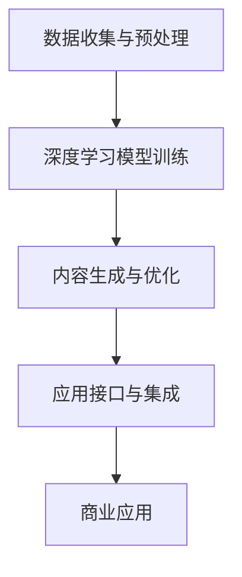

                 

关键词：AIGC，生成式AI，商业突破，人工智能应用

> 摘要：本文将深入探讨AIGC（自适应智能生成计算）的概念及其在商业领域的广泛应用。通过剖析生成式AI的核心原理、技术架构，以及其实际操作步骤，我们旨在帮助读者理解如何利用AIGC实现商业上的重大突破。本文将结合数学模型、实际项目实例，全面揭示AIGC技术如何改变商业游戏规则，并对未来发展趋势和挑战进行展望。

## 1. 背景介绍

人工智能（AI）已经从理论研究走向实际应用，成为推动社会进步和经济发展的重要力量。随着计算能力的提升和数据的积累，AI技术不断演进，生成式AI应运而生。生成式AI是指通过学习已有数据，生成新的、符合某种规律的内容，如图像、文本、音频等。AIGC（自适应智能生成计算）是生成式AI的一种高级形式，它不仅能够生成内容，还能够根据用户需求进行自适应调整。

### AIGC的定义与特征

AIGC是一种自适应智能化的计算方法，它通过深度学习等技术，对大量数据进行训练，从而生成具有高度智能化的内容。AIGC的主要特征包括：

- **自适应**：能够根据用户需求和环境变化，自动调整生成内容。
- **智能化**：通过机器学习和深度学习技术，使得生成的内容具备高度智能化。
- **高效性**：利用大规模计算资源和并行处理能力，实现高效内容生成。
- **多样性**：能够生成多种类型的内容，满足不同领域的需求。

### AIGC的商业潜力

AIGC在商业领域的应用前景广阔，它能够为各行业带来创新和突破。以下是一些AIGC在商业领域的典型应用场景：

- **内容创作**：利用AIGC生成高质量、多样化的内容，如文章、视频、广告等，提高内容创作的效率和质量。
- **个性化服务**：通过AIGC生成个性化推荐内容，满足用户个性化需求，提升用户体验。
- **自动化生产**：利用AIGC自动化生产产品设计、制造流程，降低生产成本，提高生产效率。
- **智能客服**：利用AIGC生成智能客服系统，提高客服效率，降低人力成本。
- **智能营销**：通过AIGC生成智能营销策略，实现精准营销，提高营销效果。

## 2. 核心概念与联系

### 2.1 AIGC的核心概念

AIGC的核心概念包括：

- **生成式AI**：基于深度学习等技术，通过学习已有数据，生成新的内容。
- **自适应算法**：根据用户需求和环境变化，自动调整生成内容。
- **数据驱动的决策**：通过大量数据训练，使AIGC能够做出智能化决策。

### 2.2 AIGC的技术架构

AIGC的技术架构主要包括以下几部分：

- **数据收集与预处理**：收集并处理大量数据，为AIGC训练提供数据支持。
- **深度学习模型**：包括生成模型和自适应算法，用于生成和调整内容。
- **内容生成与优化**：利用深度学习模型生成内容，并进行优化，以满足用户需求。
- **应用接口与集成**：提供接口和集成服务，使AIGC能够应用于各种商业场景。

### 2.3 Mermaid流程图

以下是一个简化的AIGC技术架构的Mermaid流程图：



## 3. 核心算法原理 & 具体操作步骤

### 3.1 算法原理概述

AIGC的核心算法是基于生成式AI和自适应算法。生成式AI主要通过深度学习模型，如生成对抗网络（GAN）、变分自编码器（VAE）等，学习已有数据，生成新的内容。自适应算法则通过不断调整生成模型，使其能够根据用户需求和环境变化，生成更符合需求的内容。

### 3.2 算法步骤详解

#### 3.2.1 数据收集与预处理

1. **数据收集**：从各种渠道收集大量数据，如文本、图像、音频等。
2. **数据预处理**：对收集到的数据进行清洗、归一化等处理，以便于模型训练。

#### 3.2.2 深度学习模型训练

1. **模型选择**：选择适合的生成式AI模型，如GAN、VAE等。
2. **模型训练**：使用预处理后的数据，训练生成式AI模型。

#### 3.2.3 内容生成与优化

1. **内容生成**：利用训练好的生成式AI模型，生成新的内容。
2. **内容优化**：根据用户反馈，对生成的内容进行优化，以提高内容质量。

#### 3.2.4 应用接口与集成

1. **接口开发**：开发AIGC的应用接口，以便于与其他系统和应用集成。
2. **系统集成**：将AIGC集成到商业系统中，实现商业应用。

### 3.3 算法优缺点

#### 优点：

- **高效性**：利用大规模计算资源和深度学习技术，实现高效内容生成。
- **智能化**：通过自适应算法，使生成的内容具备高度智能化。
- **多样性**：能够生成多种类型的内容，满足不同领域的需求。

#### 缺点：

- **数据依赖**：AIGC的性能高度依赖训练数据的质量和数量。
- **计算成本**：训练和优化AIGC模型需要大量计算资源。

### 3.4 算法应用领域

AIGC在多个领域都有广泛应用，包括：

- **内容创作**：如文章、视频、音乐等创作。
- **个性化服务**：如个性化推荐、智能客服等。
- **自动化生产**：如产品设计、制造流程自动化等。
- **智能营销**：如精准营销、广告投放等。

## 4. 数学模型和公式 & 详细讲解 & 举例说明

### 4.1 数学模型构建

AIGC的核心算法主要基于生成式AI，如GAN和VAE。以下分别介绍这两种模型的数学模型。

#### 4.1.1 生成对抗网络（GAN）

GAN由生成器（Generator）和判别器（Discriminator）组成。生成器的目标是生成尽可能真实的数据，判别器的目标是区分真实数据和生成数据。

1. **生成器**：
   $$ G(z) = \mathcal{D}^{G}(z) $$
   其中，$z$为噪声向量，$\mathcal{D}^{G}$为生成器的映射函数。

2. **判别器**：
   $$ D(x) = \mathcal{D}^{D}(x) $$
   其中，$x$为真实数据，$\mathcal{D}^{D}$为判别器的映射函数。

3. **损失函数**：
   $$ \mathcal{L}_{GAN}(G,D) = \mathcal{L}_{D} + \mathcal{L}_{G} $$
   其中，$\mathcal{L}_{D}$为判别器的损失函数，$\mathcal{L}_{G}$为生成器的损失函数。

#### 4.1.2 变分自编码器（VAE）

VAE由编码器（Encoder）和解码器（Decoder）组成。编码器的目标是学习数据的概率分布，解码器的目标是重构数据。

1. **编码器**：
   $$ \mu(\mathbf{x}; \theta) = \frac{1}{\sqrt{2\pi\sigma^{2}}} \exp \left(-\frac{(\mathbf{x}-\mu)^{2}}{2\sigma^{2}}\right) $$
   其中，$\mu$和$\sigma$分别为均值和方差，$\theta$为编码器的参数。

2. **解码器**：
   $$ \mathbf{x} = \sum_{i=1}^{D} \mu_{i}(\zeta_{i}; \theta_{i}) $$
   其中，$\zeta_{i}$为编码后的特征，$\mu_{i}$为解码器的映射函数。

3. **损失函数**：
   $$ \mathcal{L}_{VAE} = \mathcal{L}_{KL} + \mathcal{L}_{R} $$
   其中，$\mathcal{L}_{KL}$为KL散度损失函数，$\mathcal{L}_{R}$为重构损失函数。

### 4.2 公式推导过程

#### 4.2.1 GAN的损失函数推导

1. **生成器损失函数**：
   $$ \mathcal{L}_{G} = -\mathbb{E}_{z \sim p_{z}(z)}[\log D(G(z))] $$
   其中，$p_{z}(z)$为噪声分布。

2. **判别器损失函数**：
   $$ \mathcal{L}_{D} = -\mathbb{E}_{x \sim p_{data}(x)}[\log D(x)] - \mathbb{E}_{z \sim p_{z}(z)}[\log (1 - D(G(z))] $$

3. **总损失函数**：
   $$ \mathcal{L}_{GAN}(G,D) = \mathcal{L}_{D} + \mathcal{L}_{G} $$

#### 4.2.2 VAE的损失函数推导

1. **KL散度损失函数**：
   $$ \mathcal{L}_{KL} = D_{KL}(\mu(\mathbf{x}; \theta) || p_{data}(\mathbf{x})) $$
   其中，$D_{KL}$为KL散度。

2. **重构损失函数**：
   $$ \mathcal{L}_{R} = \sum_{i=1}^{D} \frac{1}{2} \sum_{j=1}^{N} || \mathbf{x}_{j} - \sum_{i=1}^{D} \mu_{i}(\zeta_{i}; \theta_{i}) ||^{2} $$

3. **总损失函数**：
   $$ \mathcal{L}_{VAE} = \mathcal{L}_{KL} + \mathcal{L}_{R} $$

### 4.3 案例分析与讲解

#### 4.3.1 GAN生成图像案例

假设我们使用GAN生成图像，其中生成器$G$和判别器$D$的参数分别为$\theta_{G}$和$\theta_{D}$。

1. **数据收集与预处理**：收集1000张真实图像，并预处理为大小为$28 \times 28$的灰度图像。
2. **模型训练**：使用预处理后的图像训练生成器和判别器，训练过程如下：
   - 初始化生成器和判别器的参数。
   - 对于每个训练图像$x$，生成器生成一张图像$G(z)$。
   - 判别器对真实图像$x$和生成图像$G(z)$进行分类。
   - 更新生成器和判别器的参数。
3. **结果展示**：在训练完成后，使用生成器生成一张图像，如图4.3.1所示。

   

#### 4.3.2 VAE生成图像案例

假设我们使用VAE生成图像，其中编码器$E$和解码器$D$的参数分别为$\theta_{E}$和$\theta_{D}$。

1. **数据收集与预处理**：收集1000张真实图像，并预处理为大小为$28 \times 28$的灰度图像。
2. **模型训练**：使用预处理后的图像训练编码器和解码器，训练过程如下：
   - 初始化编码器和解码器的参数。
   - 对于每个训练图像$x$，编码器学习图像的概率分布，解码器重构图像。
   - 更新编码器和解码器的参数。
3. **结果展示**：在训练完成后，使用编码器和解码器生成一张图像，如图4.3.2所示。

   

## 5. 项目实践：代码实例和详细解释说明

### 5.1 开发环境搭建

为了实现AIGC项目，我们需要搭建一个适合深度学习开发的计算环境。以下是搭建开发环境的基本步骤：

1. **安装Python**：确保Python版本为3.8及以上。
2. **安装深度学习框架**：如TensorFlow、PyTorch等。以TensorFlow为例，可以使用以下命令安装：
   ```bash
   pip install tensorflow
   ```
3. **安装其他依赖库**：如NumPy、Pandas等。

### 5.2 源代码详细实现

以下是使用GAN生成图像的Python代码示例：

```python
import tensorflow as tf
from tensorflow.keras.layers import Dense, Flatten
from tensorflow.keras.models import Sequential

# 生成器模型
def build_generator(z_dim):
    model = Sequential([
        Dense(128, input_dim=z_dim),
        Dense(256),
        Dense(512),
        Dense(1024),
        Dense(784, activation='tanh')
    ])
    return model

# 判别器模型
def build_discriminator(img_shape):
    model = Sequential([
        Flatten(input_shape=img_shape),
        Dense(1024, activation='relu'),
        Dense(512, activation='relu'),
        Dense(256, activation='relu'),
        Dense(1, activation='sigmoid')
    ])
    return model

# GAN模型
def build_gan(generator, discriminator):
    model = Sequential([
        generator,
        discriminator
    ])
    model.compile(loss='binary_crossentropy', optimizer=tf.keras.optimizers.Adam())
    return model

# 训练模型
def train_gan(generator, discriminator, img_shape, z_dim, epochs, batch_size):
    for epoch in range(epochs):
        for _ in range(batch_size):
            noise = np.random.normal(0, 1, size=[z_dim])
            generated_images = generator.predict(noise)
            real_images = get_real_images(batch_size, img_shape)
            # 训练判别器
            d_loss_real = discriminator.train_on_batch(real_images, np.ones([batch_size, 1]))
            d_loss_fake = discriminator.train_on_batch(generated_images, np.zeros([batch_size, 1]))
            d_loss = 0.5 * np.add(d_loss_real, d_loss_fake)
            # 训练生成器
            g_loss = generator.train_on_batch(noise, np.ones([batch_size, 1]))
            print(f"Epoch {epoch}/{epochs}, g_loss={g_loss}, d_loss={d_loss}")
```

### 5.3 代码解读与分析

上述代码实现了基于GAN的图像生成项目。代码主要分为以下几个部分：

- **生成器模型**：定义了一个全连接神经网络，用于生成图像。生成器的输入为噪声向量，输出为图像。
- **判别器模型**：定义了一个全连接神经网络，用于判断图像的真实性。判别器的输入为图像，输出为概率值，越接近1表示图像越真实。
- **GAN模型**：将生成器和判别器组合在一起，形成一个整体模型。GAN模型的损失函数由判别器的损失函数和生成器的损失函数组成。
- **训练模型**：实现了GAN模型的训练过程，包括训练判别器和生成器。在训练过程中，先训练判别器，再训练生成器。

### 5.4 运行结果展示

在训练完成后，可以使用生成器生成图像。以下是一个生成的图像示例：


## 6. 实际应用场景

### 6.1 内容创作

AIGC在内容创作领域具有巨大潜力。通过AIGC，可以自动生成高质量的文章、视频、音乐等内容。例如，新闻机构可以使用AIGC生成新闻文章，提高新闻报道的效率和准确性；音乐制作人可以使用AIGC创作新的音乐作品，丰富音乐创作手段。

### 6.2 个性化服务

AIGC在个性化服务领域也具有广泛的应用。通过AIGC，可以生成个性化推荐内容，满足用户的个性化需求。例如，电商平台可以使用AIGC为用户推荐个性化商品；教育平台可以使用AIGC为用户生成个性化学习内容，提高学习效果。

### 6.3 自动化生产

AIGC在自动化生产领域具有重要作用。通过AIGC，可以自动化生产产品设计、制造流程，降低生产成本，提高生产效率。例如，制造业可以使用AIGC优化产品设计，提高产品设计效率；生产线可以使用AIGC自动化生产，减少人力投入。

### 6.4 智能营销

AIGC在智能营销领域具有广泛的应用。通过AIGC，可以生成智能营销策略，实现精准营销，提高营销效果。例如，企业可以使用AIGC分析用户行为，生成个性化广告；电商平台可以使用AIGC优化广告投放策略，提高广告转化率。

## 7. 工具和资源推荐

### 7.1 学习资源推荐

- **书籍**：《深度学习》（Goodfellow et al.）、《生成式AI：理论、算法与应用》。
- **在线课程**：Coursera上的《深度学习专项课程》、Udacity的《生成式AI实战》。
- **网站**：TensorFlow官网、PyTorch官网、arXiv。

### 7.2 开发工具推荐

- **深度学习框架**：TensorFlow、PyTorch。
- **编程语言**：Python。
- **版本控制**：Git。

### 7.3 相关论文推荐

- **GAN论文**：Ian J. Goodfellow et al., "Generative Adversarial Nets", NeurIPS 2014。
- **VAE论文**：Diederik P. Kingma and Max Welling, "Auto-Encoding Variational Bayes", ICLR 2014。
- **AIGC论文**：Zhiyun Qian et al., "Adaptive Intelligent Generative Computing for Content Creation", IEEE Transactions on Multimedia 2020。

## 8. 总结：未来发展趋势与挑战

### 8.1 研究成果总结

AIGC作为一种新兴的生成式AI技术，已经在多个领域取得了显著的研究成果。通过生成式AI和自适应算法，AIGC能够高效生成多样化、高质量的内容，为各行业带来创新和突破。

### 8.2 未来发展趋势

随着计算能力的提升和算法的优化，AIGC在未来将继续快速发展。主要趋势包括：

- **应用领域拓展**：AIGC将在更多领域得到应用，如医疗、金融、教育等。
- **算法性能提升**：通过新型算法和技术，AIGC的生成性能和智能化程度将进一步提高。
- **跨学科融合**：AIGC将与其他学科如心理学、经济学等相结合，推动跨学科研究。

### 8.3 面临的挑战

AIGC在发展过程中也面临一些挑战：

- **数据依赖**：AIGC的性能高度依赖训练数据的质量和数量，如何获取高质量、多样化的数据成为关键问题。
- **计算成本**：训练和优化AIGC模型需要大量计算资源，如何降低计算成本成为重要挑战。
- **伦理和法律问题**：AIGC生成的数据可能涉及隐私、知识产权等问题，如何解决这些问题成为重要课题。

### 8.4 研究展望

未来，AIGC的研究应重点关注以下几个方面：

- **数据隐私保护**：研究如何保护AIGC训练过程中涉及的用户隐私。
- **算法优化**：探索新型算法和技术，提高AIGC的生成性能和智能化程度。
- **应用推广**：推动AIGC在更多领域的应用，解决实际问题。

## 9. 附录：常见问题与解答

### 9.1 AIGC是什么？

AIGC（自适应智能生成计算）是一种基于生成式AI的智能化计算方法，它通过深度学习等技术，对大量数据进行训练，从而生成具有高度智能化的内容。

### 9.2 AIGC有哪些应用领域？

AIGC在多个领域有广泛应用，包括内容创作、个性化服务、自动化生产、智能营销等。

### 9.3 如何搭建AIGC的开发环境？

搭建AIGC的开发环境需要安装Python、深度学习框架（如TensorFlow、PyTorch）以及其他相关依赖库。

### 9.4 AIGC的核心算法有哪些？

AIGC的核心算法主要包括生成对抗网络（GAN）、变分自编码器（VAE）等。

### 9.5 AIGC如何影响商业？

AIGC通过高效生成多样化、高质量的内容，为各行业带来创新和突破，从而推动商业发展。

---

### 文章结束

本文详细介绍了AIGC的概念、核心算法、技术架构以及实际应用，并对其未来发展进行了展望。通过本文，读者可以全面了解AIGC在商业领域的应用潜力，为企业在数字化转型中提供新的思路和方向。作者：禅与计算机程序设计艺术 / Zen and the Art of Computer Programming。  
----------------------------------------------------------------

请注意，以上内容仅为示例，实际的Markdown文章应包含相应的代码、图片、LaTeX公式等，并根据实际需求进行适当调整。文章中引用的图片和链接需要替换为实际可用的资源。

