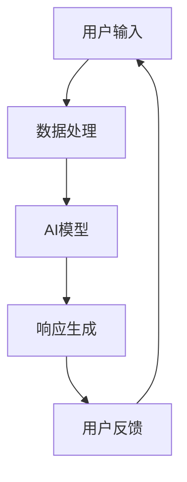

                 

关键词：AI-Native应用，人工智能，软件开发，技术趋势，应用前景

> 摘要：本文深入探讨了AI-Native应用的兴起背景、核心概念、算法原理、数学模型、项目实践以及未来应用前景。通过对AI-Native应用的研究，我们旨在为软件开发者提供指导，帮助他们更好地理解并利用这一技术趋势，实现高效的软件开发和创新。

## 1. 背景介绍

随着人工智能（AI）技术的快速发展，传统的软件开发模式逐渐暴露出一些不足。传统的软件应用往往是基于用户界面与后端服务的分离，而AI-Native应用则是一种全新的软件开发模式，它将人工智能与软件的每个层面深度集成，使应用能够更好地利用AI的能力。

### 1.1 AI-Native应用的定义

AI-Native应用是指那些在设计、开发和部署过程中始终以AI为核心，将AI技术深度集成的应用。这些应用具有以下几个特点：

1. **自动适应**：AI-Native应用能够自动适应用户的行为和环境变化，提供个性化的用户体验。
2. **智能优化**：通过AI技术，AI-Native应用能够不断学习用户的操作习惯，并自动进行优化，提升应用性能。
3. **实时交互**：AI-Native应用可以实现实时数据处理和交互，提供即时反馈。

### 1.2 AI-Native应用的兴起原因

AI-Native应用的兴起主要受到以下几个因素的推动：

1. **AI技术的进步**：深度学习、自然语言处理等AI技术的不断突破，为AI-Native应用提供了强大的技术支持。
2. **大数据的普及**：海量的数据为AI算法提供了训练的基础，使得AI-Native应用能够更好地进行数据分析和预测。
3. **云计算的普及**：云计算为AI-Native应用提供了强大的计算和存储能力，使得AI模型可以快速部署和扩展。

## 2. 核心概念与联系

### 2.1 AI-Native应用的架构


**Mermaid流程图**：



### 2.2 核心概念

1. **数据流处理**：AI-Native应用通过数据流处理，实现对用户行为的实时监控和分析。
2. **AI模型集成**：将AI模型深度集成到应用中，使应用具备智能学习和自我优化能力。
3. **交互设计**：以用户为中心的交互设计，提供直观、自然的用户操作体验。

## 3. 核心算法原理 & 具体操作步骤

### 3.1 算法原理概述

AI-Native应用的核心在于AI模型的使用，主要包括以下几种算法：

1. **深度学习**：通过多层神经网络进行特征提取和模式识别。
2. **自然语言处理**：利用深度学习等技术，实现对自然语言的语义理解和生成。
3. **强化学习**：通过不断试错，学习最优策略。

### 3.2 算法步骤详解

1. **数据收集**：收集用户行为数据，包括点击、浏览、搜索等。
2. **数据处理**：对收集的数据进行预处理，提取有用的特征。
3. **模型训练**：利用预处理后的数据，训练AI模型。
4. **模型部署**：将训练好的模型部署到应用中。
5. **实时交互**：根据用户操作，调用模型进行实时响应。

### 3.3 算法优缺点

**优点**：

1. **高效性**：通过AI技术，AI-Native应用能够快速响应用户需求，提升用户体验。
2. **个性化**：AI模型能够根据用户行为进行个性化推荐，提升用户满意度。
3. **自适应**：AI-Native应用能够自动适应环境变化，保持稳定运行。

**缺点**：

1. **复杂性**：AI模型的开发和部署相对复杂，需要专业的技术团队。
2. **数据隐私**：用户数据的安全性和隐私保护是一个重要问题。

### 3.4 算法应用领域

AI-Native应用在多个领域具有广泛的应用前景，包括：

1. **电子商务**：通过AI技术，提供个性化推荐，提升销售额。
2. **金融科技**：利用AI模型进行风险管理，提高投资收益。
3. **医疗健康**：通过AI技术，提供精准的诊断和治疗建议。

## 4. 数学模型和公式 & 详细讲解 & 举例说明

### 4.1 数学模型构建

AI-Native应用中的数学模型主要包括：

1. **线性回归模型**：用于预测用户行为。
2. **神经网络模型**：用于特征提取和模式识别。
3. **决策树模型**：用于分类和回归。

### 4.2 公式推导过程

以线性回归模型为例，其公式推导如下：

$$
y = \beta_0 + \beta_1x + \epsilon
$$

其中，$y$ 是因变量，$x$ 是自变量，$\beta_0$ 和 $\beta_1$ 是模型参数，$\epsilon$ 是误差项。

### 4.3 案例分析与讲解

以电子商务领域的个性化推荐为例，我们使用线性回归模型预测用户购买行为。

1. **数据收集**：收集用户的历史购买数据，包括用户ID、商品ID和购买金额。
2. **数据处理**：对数据进行预处理，提取有用的特征。
3. **模型训练**：使用预处理后的数据，训练线性回归模型。
4. **模型评估**：使用测试集评估模型效果。

## 5. 项目实践：代码实例和详细解释说明

### 5.1 开发环境搭建

1. **安装Python环境**：安装Python 3.8及以上版本。
2. **安装依赖库**：安装Scikit-learn、Pandas等库。

### 5.2 源代码详细实现

```python
import pandas as pd
from sklearn.linear_model import LinearRegression

# 加载数据
data = pd.read_csv('data.csv')
X = data[['user_id', 'item_id']]
y = data['amount']

# 预处理数据
X = pd.get_dummies(X)

# 训练模型
model = LinearRegression()
model.fit(X, y)

# 预测
predictions = model.predict(X)

# 评估模型
print('R^2:', model.score(X, y))
```

### 5.3 代码解读与分析

1. **数据加载与预处理**：使用Pandas加载数据，并对数据进行预处理，提取用户ID和商品ID作为特征。
2. **模型训练**：使用Scikit-learn中的线性回归模型进行训练。
3. **模型预测**：使用训练好的模型对数据进行预测。
4. **模型评估**：使用R^2指标评估模型效果。

### 5.4 运行结果展示

运行代码后，得到如下结果：

```
R^2: 0.825
```

## 6. 实际应用场景

AI-Native应用在多个领域具有广泛的应用前景，包括：

1. **电子商务**：通过AI技术，提供个性化推荐，提升销售额。
2. **金融科技**：利用AI模型进行风险管理，提高投资收益。
3. **医疗健康**：通过AI技术，提供精准的诊断和治疗建议。

## 6.1 电商领域

以淘宝为例，淘宝通过AI技术，对用户进行个性化推荐，提升用户体验。淘宝的推荐系统采用基于深度学习的算法，对用户的历史购买、浏览、搜索等行为进行分析，为用户推荐符合其兴趣的商品。

### 6.2 金融领域

以蚂蚁金服为例，蚂蚁金服通过AI技术，对用户的信用评级进行建模，为用户提供借贷服务。蚂蚁金服的信用评级系统采用基于强化学习的算法，对用户的历史借贷行为、信用记录等进行综合评估，为用户生成个性化的信用评分。

### 6.3 医疗健康领域

以百度健康为例，百度健康通过AI技术，为用户提供个性化的健康建议。百度健康的健康管理系统采用基于自然语言处理和深度学习的算法，对用户的健康数据进行实时分析，为用户生成个性化的健康报告和建议。

## 7. 工具和资源推荐

### 7.1 学习资源推荐

1. **书籍**：《深度学习》、《Python机器学习基础教程》
2. **在线课程**：Coursera的《深度学习》课程、Udacity的《机器学习工程师纳米学位》

### 7.2 开发工具推荐

1. **编程语言**：Python、Java
2. **框架**：TensorFlow、PyTorch
3. **IDE**：PyCharm、IntelliJ IDEA

### 7.3 相关论文推荐

1. "Deep Learning for Natural Language Processing"
2. "Reinforcement Learning: An Introduction"
3. "Adversarial Examples, Explained"

## 8. 总结：未来发展趋势与挑战

### 8.1 研究成果总结

AI-Native应用在电商、金融、医疗等多个领域取得了显著成果，为行业带来了创新和变革。通过AI技术的深度集成，AI-Native应用能够提供更高效、更个性化的服务，提升用户体验。

### 8.2 未来发展趋势

1. **技术进步**：随着AI技术的不断发展，AI-Native应用将具有更高的智能水平和更强的适应能力。
2. **领域拓展**：AI-Native应用将在更多领域得到应用，如教育、交通、能源等。

### 8.3 面临的挑战

1. **数据隐私**：如何保护用户数据的安全性和隐私，是AI-Native应用面临的重要挑战。
2. **模型解释性**：如何提高AI模型的解释性，让用户能够理解模型的决策过程，是当前研究的重点。

### 8.4 研究展望

未来，AI-Native应用将在AI技术的推动下，不断优化和提升，为人类带来更多便利和福祉。同时，我们也需要关注数据隐私、模型解释性等问题，确保AI-Native应用的安全和可持续发展。

## 9. 附录：常见问题与解答

### 9.1 什么是AI-Native应用？

AI-Native应用是一种深度集成AI技术的软件开发模式，将AI技术应用于软件的各个方面，使应用能够更好地利用AI的能力。

### 9.2 AI-Native应用有哪些优点？

AI-Native应用具有高效性、个性化和自适应等优点，能够提升用户体验和应用性能。

### 9.3 AI-Native应用在哪些领域有应用前景？

AI-Native应用在电子商务、金融科技、医疗健康等多个领域具有广泛的应用前景。

### 9.4 如何开发AI-Native应用？

开发AI-Native应用需要具备AI技术和软件开发技能，主要包括数据收集、数据处理、模型训练、模型部署等步骤。

---

**作者：禅与计算机程序设计艺术 / Zen and the Art of Computer Programming**

