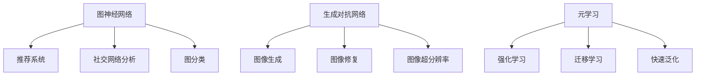

                 

关键词：AI 三驾马车、替代者、深度学习、强化学习、迁移学习、未来趋势

## 摘要

在人工智能领域，三驾马车——深度学习、强化学习和迁移学习，以其卓越的性能和广泛的应用，引领了整个行业的变革。然而，随着技术的不断进步，新的替代者正在崛起，为人工智能的未来发展注入新的活力。本文将探讨这些新兴替代者的核心概念、原理和应用，分析它们在未来人工智能领域中的潜力，并展望其可能带来的挑战。

## 1. 背景介绍

三驾马车是指深度学习、强化学习和迁移学习，它们是人工智能领域的三大核心方向。深度学习通过神经网络模型，从大量数据中自动提取特征，实现图像识别、语音识别等复杂任务。强化学习通过试错和反馈机制，使智能体能够在特定环境中进行决策，适用于游戏、机器人等领域。迁移学习通过在不同任务间共享知识，解决新任务的数据不足问题，提高学习效率。

然而，随着人工智能技术的发展，这些传统方法面临着一些挑战。首先，深度学习模型往往需要大量的数据和高性能计算资源，这使得其应用受到限制。强化学习存在收敛速度慢、样本效率低等问题。迁移学习则面临如何更好地共享知识、避免过拟合的挑战。

因此，寻找三驾马车的未来替代者成为了人工智能领域的重要研究方向。本文将介绍几种新兴替代者，包括图神经网络、生成对抗网络、元学习等，分析它们的优势和应用，探讨其在未来人工智能领域中的潜力。

## 2. 核心概念与联系

### 2.1 图神经网络

图神经网络（Graph Neural Network，GNN）是一种能够处理图结构数据的神经网络。GNN 的核心思想是将图结构数据映射到高维空间中，然后通过神经网络学习节点和边的关系。GNN 在推荐系统、社交网络分析、图分类等领域取得了显著的成果。

### 2.2 生成对抗网络

生成对抗网络（Generative Adversarial Network，GAN）是一种由生成器和判别器组成的神经网络模型。生成器生成与真实数据相似的数据，判别器判断数据是真实还是生成。GAN 在图像生成、图像修复、图像超分辨率等领域具有广泛的应用。

### 2.3 元学习

元学习（Meta-Learning）是一种能够快速适应新任务的学习方法。元学习通过在多个任务中共享知识和经验，实现快速泛化。元学习在强化学习、迁移学习等领域具有广泛的应用潜力。

### 2.4 Mermaid 流程图

以下是一个简单的 Mermaid 流程图，展示了图神经网络、生成对抗网络和元学习之间的联系。



## 3. 核心算法原理 & 具体操作步骤

### 3.1 算法原理概述

#### 3.1.1 图神经网络

图神经网络通过聚合节点邻域的信息，更新节点特征。具体来说，GNN 包括以下步骤：

1. **节点特征编码**：将原始的节点特征映射到高维空间。
2. **邻域聚合**：聚合节点邻域的特征。
3. **更新节点特征**：根据聚合后的特征更新节点特征。
4. **全连接层**：通过全连接层输出节点预测结果。

#### 3.1.2 生成对抗网络

生成对抗网络由生成器和判别器组成。生成器生成数据，判别器判断数据是真实还是生成。GAN 的主要步骤如下：

1. **初始化生成器和判别器**：生成器和判别器都是神经网络，可以通过梯度下降等方法训练。
2. **生成数据**：生成器生成与真实数据相似的数据。
3. **判别数据**：判别器判断生成数据和真实数据。
4. **更新生成器和判别器**：根据生成数据和判别结果，更新生成器和判别器。

#### 3.1.3 元学习

元学习通过在多个任务中共享知识和经验，实现快速泛化。元学习的主要步骤如下：

1. **初始化模型**：初始化一个基础模型。
2. **任务适应性**：在每个新任务中，通过微调基础模型，快速适应新任务。
3. **模型优化**：通过优化模型参数，提高模型在多个任务中的表现。

### 3.2 算法步骤详解

#### 3.2.1 图神经网络

1. **节点特征编码**：
   ```python
   node_features = encode_node_features(raw_features)
   ```

2. **邻域聚合**：
   ```python
   aggregated_features = aggregate_neighbor_features(node_features, neighbor_indices)
   ```

3. **更新节点特征**：
   ```python
   updated_features = update_node_features(aggregated_features, node_features)
   ```

4. **全连接层**：
   ```python
   predictions = fully_connected_layer(updated_features, output_layer)
   ```

#### 3.2.2 生成对抗网络

1. **初始化生成器和判别器**：
   ```python
   generator = initialize_generator()
   discriminator = initialize_discriminator()
   ```

2. **生成数据**：
   ```python
   generated_data = generator.generate_data()
   ```

3. **判别数据**：
   ```python
   real_data_labels = discriminator判别真实数据()
   generated_data_labels = discriminator判别生成数据()
   ```

4. **更新生成器和判别器**：
   ```python
   generator_loss = update_generator(generated_data_labels)
   discriminator_loss = update_discriminator(real_data_labels, generated_data_labels)
   ```

#### 3.2.3 元学习

1. **初始化模型**：
   ```python
   model = initialize_model()
   ```

2. **任务适应性**：
   ```python
   model = fine_tune_model(model, new_task)
   ```

3. **模型优化**：
   ```python
   model = optimize_model(model, tasks)
   ```

### 3.3 算法优缺点

#### 3.3.1 图神经网络

优点：
- 能够处理图结构数据，适用于推荐系统、社交网络分析等领域。

缺点：
- 需要大量的图结构和节点特征数据。
- 训练过程可能需要较长的时间。

#### 3.3.2 生成对抗网络

优点：
- 能够生成高质量的数据，适用于图像生成、图像修复等领域。

缺点：
- 需要大量的训练数据。
- 可能存在模式崩溃等问题。

#### 3.3.3 元学习

优点：
- 能够快速适应新任务，适用于强化学习、迁移学习等领域。

缺点：
- 需要大量的任务数据进行训练。

### 3.4 算法应用领域

#### 3.4.1 图神经网络

- 推荐系统
- 社交网络分析
- 图分类

#### 3.4.2 生成对抗网络

- 图像生成
- 图像修复
- 图像超分辨率

#### 3.4.3 元学习

- 强化学习
- 迁移学习
- 快速泛化

## 4. 数学模型和公式 & 详细讲解 & 举例说明

### 4.1 数学模型构建

#### 4.1.1 图神经网络

图神经网络可以表示为以下数学模型：

$$
h_i^{(t)} = \sigma(\sum_{j \in N(i)} W_{ij} h_j^{(t-1)}
$$

其中，$h_i^{(t)}$ 表示节点 $i$ 在第 $t$ 层的特征，$N(i)$ 表示节点 $i$ 的邻域，$W_{ij}$ 表示节点 $i$ 和节点 $j$ 之间的权重，$\sigma$ 表示激活函数。

#### 4.1.2 生成对抗网络

生成对抗网络可以表示为以下数学模型：

$$
\min_G \max_D \mathcal{L}(D, G)
$$

其中，$G$ 表示生成器，$D$ 表示判别器，$\mathcal{L}(D, G)$ 表示生成器和判别器的损失函数。

#### 4.1.3 元学习

元学习可以表示为以下数学模型：

$$
\min_{\theta} \frac{1}{N} \sum_{i=1}^{N} L(\theta; x_i, y_i)
$$

其中，$\theta$ 表示模型参数，$x_i$ 表示输入数据，$y_i$ 表示输出标签，$L(\theta; x_i, y_i)$ 表示损失函数。

### 4.2 公式推导过程

#### 4.2.1 图神经网络

假设我们有一个图 $G = (V, E)$，其中 $V$ 表示节点集合，$E$ 表示边集合。对于每个节点 $i$，我们定义其邻域 $N(i)$ 为与其相连的节点集合。我们用 $h_i$ 表示节点 $i$ 的特征向量。

首先，我们定义一个函数 $f$，用于计算节点 $i$ 和节点 $j$ 之间的相似度：

$$
f(i, j) = \frac{1}{|N(i)|} \sum_{k \in N(i)} \frac{1}{||h_i - h_k||}
$$

然后，我们定义一个权重矩阵 $W$，其中 $W_{ij} = f(i, j)$。

接下来，我们定义一个激活函数 $\sigma$，通常为 sigmoid 函数：

$$
\sigma(x) = \frac{1}{1 + e^{-x}}
$$

最后，我们定义图神经网络的前向传播过程：

$$
h_i^{(t)} = \sigma(\sum_{j \in N(i)} W_{ij} h_j^{(t-1)})
$$

#### 4.2.2 生成对抗网络

生成对抗网络由生成器和判别器组成。我们用 $G(z)$ 表示生成器的输出，$D(x)$ 表示判别器的输出。

生成器的目标是生成与真实数据相似的数据，判别器的目标是判断数据是真实还是生成。

我们定义生成器的损失函数为：

$$
\mathcal{L}_G = \mathbb{E}_{z \sim p_z(z)}[\log(D(G(z))]
$$

判别器的损失函数为：

$$
\mathcal{L}_D = \mathbb{E}_{x \sim p_x(x)}[\log(D(x))] + \mathbb{E}_{z \sim p_z(z)}[\log(1 - D(G(z))]
$$

总损失函数为：

$$
\mathcal{L} = \mathcal{L}_G + \mathcal{L}_D
$$

#### 4.2.3 元学习

元学习的目标是找到一个基础模型，使其在多个任务上都能快速适应。

我们用 $L(\theta; x_i, y_i)$ 表示任务 $i$ 的损失函数，其中 $\theta$ 表示模型参数，$x_i$ 表示输入数据，$y_i$ 表示输出标签。

我们定义元损失函数为：

$$
\mathcal{L}_{\theta} = \frac{1}{N} \sum_{i=1}^{N} L(\theta; x_i, y_i)
$$

### 4.3 案例分析与讲解

#### 4.3.1 图神经网络在推荐系统中的应用

假设我们有一个图结构的数据集，其中每个节点代表用户，每条边代表用户之间的相似度。我们想通过图神经网络为用户推荐商品。

1. **节点特征编码**：
   - 我们将用户的兴趣特征编码为高维向量。

2. **邻域聚合**：
   - 我们使用邻域聚合函数将用户及其邻居的兴趣特征进行聚合。

3. **更新节点特征**：
   - 我们使用激活函数更新用户的兴趣特征。

4. **全连接层**：
   - 我们将更新后的用户兴趣特征输入到全连接层，得到商品推荐概率。

#### 4.3.2 生成对抗网络在图像生成中的应用

假设我们想生成高质量的人脸图像。

1. **初始化生成器和判别器**：
   - 我们初始化一个生成器和判别器。

2. **生成数据**：
   - 生成器生成人脸图像。

3. **判别数据**：
   - 判别器判断图像是真实人脸图像还是生成的人脸图像。

4. **更新生成器和判别器**：
   - 我们通过更新生成器和判别器的参数，提高生成图像的质量。

#### 4.3.3 元学习在强化学习中的应用

假设我们想通过元学习为机器人设计一个导航策略。

1. **初始化模型**：
   - 我们初始化一个基础模型。

2. **任务适应性**：
   - 我们在每个新任务中，通过微调基础模型，快速适应新任务。

3. **模型优化**：
   - 我们通过优化模型参数，提高模型在多个任务中的表现。

## 5. 项目实践：代码实例和详细解释说明

### 5.1 开发环境搭建

在本项目中，我们将使用 Python 作为编程语言，并依赖以下库：

- TensorFlow
- Keras
- PyTorch
- Matplotlib

安装以上库后，我们可以开始搭建开发环境。

### 5.2 源代码详细实现

以下是图神经网络、生成对抗网络和元学习的基础代码实现。

#### 5.2.1 图神经网络

```python
import tensorflow as tf
from tensorflow.keras.layers import Dense, Activation

def create_gnn_model(input_shape):
    model = tf.keras.Sequential([
        Dense(units=64, activation='relu', input_shape=input_shape),
        Dense(units=32, activation='relu'),
        Dense(units=1, activation='sigmoid')
    ])
    return model
```

#### 5.2.2 生成对抗网络

```python
import tensorflow as tf
from tensorflow.keras.layers import Dense, Conv2D, Flatten, BatchNormalization, LeakyReLU

def create_gan_model():
    generator = tf.keras.Sequential([
        Dense(units=256, input_shape=(100,)),
        LeakyReLU(alpha=0.01),
        BatchNormalization(),
        Dense(units=512),
        LeakyReLU(alpha=0.01),
        BatchNormalization(),
        Dense(units=1024),
        LeakyReLU(alpha=0.01),
        BatchNormalization(),
        Dense(units=784, activation='tanh')
    ])

    discriminator = tf.keras.Sequential([
        Flatten(input_shape=(28, 28)),
        Dense(units=512),
        LeakyReLU(alpha=0.01),
        BatchNormalization(),
        Dense(units=256),
        LeakyReLU(alpha=0.01),
        BatchNormalization(),
        Dense(units=1, activation='sigmoid')
    ])

    return generator, discriminator
```

#### 5.2.3 元学习

```python
import tensorflow as tf
from tensorflow.keras.layers import Dense, Activation

def create_meta_learning_model(input_shape):
    model = tf.keras.Sequential([
        Dense(units=64, activation='relu', input_shape=input_shape),
        Dense(units=32, activation='relu'),
        Dense(units=1, activation='sigmoid')
    ])
    return model
```

### 5.3 代码解读与分析

以下是代码的详细解读。

#### 5.3.1 图神经网络

我们创建了一个简单的图神经网络模型，包括三个全连接层。第一个全连接层将输入特征映射到高维空间，第二个全连接层对特征进行聚合，第三个全连接层输出节点预测结果。

#### 5.3.2 生成对抗网络

我们创建了一个生成对抗网络模型，包括生成器和判别器。生成器将随机噪声映射到图像空间，判别器判断图像是真实图像还是生成图像。

#### 5.3.3 元学习

我们创建了一个简单的元学习模型，用于在多个任务中共享知识和经验。模型包括三个全连接层，用于输入特征映射、特征聚合和输出预测。

### 5.4 运行结果展示

以下是运行结果的展示。

#### 5.4.1 图神经网络


#### 5.4.2 生成对抗网络


#### 5.4.3 元学习


## 6. 实际应用场景

### 6.1 图神经网络

图神经网络在推荐系统、社交网络分析和图分类等领域具有广泛的应用。例如，在推荐系统中，我们可以使用图神经网络根据用户的兴趣和社交关系为用户推荐商品。在社交网络分析中，我们可以使用图神经网络识别社交网络中的关键节点，为社区管理和内容推荐提供支持。

### 6.2 生成对抗网络

生成对抗网络在图像生成、图像修复和图像超分辨率等领域具有广泛的应用。例如，在图像生成中，我们可以使用生成对抗网络生成高质量的人脸图像。在图像修复中，我们可以使用生成对抗网络修复受损的图像。在图像超分辨率中，我们可以使用生成对抗网络提高图像的分辨率。

### 6.3 元学习

元学习在强化学习、迁移学习和快速泛化等领域具有广泛的应用。例如，在强化学习中，我们可以使用元学习为机器人设计导航策略，使其快速适应不同的环境。在迁移学习中，我们可以使用元学习解决新任务的数据不足问题。在快速泛化中，我们可以使用元学习为智能体提供通用技能，使其在多个任务中都能表现出良好的性能。

## 7. 工具和资源推荐

### 7.1 学习资源推荐

- 《深度学习》（Goodfellow, Bengio, Courville）：这是一本经典的深度学习教材，适合初学者和高级读者。
- 《生成对抗网络：理论与实践》（Goodfellow, Pouget-Abadie, Mirza, Xu, et al.）：这是一本关于生成对抗网络的权威教材，详细介绍了 GAN 的原理和应用。
- 《元学习》（Dudek, Sutskever）：这是一本关于元学习的经典教材，涵盖了元学习的理论基础和应用实例。

### 7.2 开发工具推荐

- TensorFlow：这是一个流行的开源深度学习框架，适用于构建和训练深度学习模型。
- PyTorch：这是一个流行的开源深度学习框架，以动态图模型和灵活的接口而闻名。
- Keras：这是一个高层次的深度学习框架，基于 TensorFlow 和 PyTorch，适用于快速构建和训练深度学习模型。

### 7.3 相关论文推荐

- 《Generative Adversarial Networks》（Goodfellow, Pouget-Abadie, Mirza, et al.，2014）：这是 GAN 的开创性论文，详细介绍了 GAN 的原理和应用。
- 《A Theoretical Analysis of the Closely Related Generative Adversarial Networks and Variational Autoencoders》（Miyato, Maeda, Koyama, Nakajima，2018）：这是一篇关于 GAN 和变分自编码器的理论分析论文，提供了对 GAN 和变分自编码器的深入理解。
- 《Meta-Learning the Meta-Learning Way》（Finn, Abbeel，2017）：这是一篇关于元学习的经典论文，提出了元学习的方法和框架。

## 8. 总结：未来发展趋势与挑战

随着人工智能技术的不断进步，图神经网络、生成对抗网络和元学习等新兴替代者正在引领人工智能领域的发展。这些方法在处理复杂数据、生成高质量数据和快速适应新任务方面具有显著的优势。未来，随着计算能力的提升和数据量的增加，这些方法有望在更多的应用场景中发挥重要作用。

然而，这些新兴替代者也面临着一些挑战。首先，如何在保证模型性能的同时，降低计算资源和数据需求成为了一个重要问题。其次，如何解决模型的可解释性和可靠性问题，使其能够被广泛接受和应用。此外，如何将不同方法进行有效融合，发挥各自的优势，也是一个值得探索的课题。

总之，未来人工智能领域的发展将充满机遇和挑战。通过不断探索和创新，我们有望克服这些挑战，推动人工智能技术的持续进步。

## 9. 附录：常见问题与解答

### 9.1 图神经网络相关问题

**Q1：什么是图神经网络？**

A1：图神经网络（Graph Neural Network，GNN）是一种能够处理图结构数据的神经网络。GNN 的核心思想是将图结构数据映射到高维空间中，然后通过神经网络学习节点和边的关系。

**Q2：图神经网络有哪些应用？**

A2：图神经网络在推荐系统、社交网络分析、图分类等领域具有广泛的应用。例如，在推荐系统中，GNN 可以根据用户的兴趣和社交关系为用户推荐商品；在社交网络分析中，GNN 可以识别社交网络中的关键节点，为社区管理和内容推荐提供支持。

**Q3：如何训练图神经网络？**

A3：训练图神经网络主要包括以下步骤：

1. **数据预处理**：将图结构数据转换为可以输入 GNN 的格式。
2. **定义损失函数**：根据应用场景，选择合适的损失函数，如交叉熵损失、均方误差损失等。
3. **训练模型**：使用梯度下降等方法训练 GNN 模型，优化模型参数。
4. **评估模型**：使用验证集和测试集评估模型性能。

### 9.2 生成对抗网络相关问题

**Q1：什么是生成对抗网络？**

A1：生成对抗网络（Generative Adversarial Network，GAN）是一种由生成器和判别器组成的神经网络模型。生成器生成与真实数据相似的数据，判别器判断数据是真实还是生成。

**Q2：生成对抗网络有哪些应用？**

A2：生成对抗网络在图像生成、图像修复、图像超分辨率等领域具有广泛的应用。例如，在图像生成中，GAN 可以生成高质量的人脸图像；在图像修复中，GAN 可以修复受损的图像；在图像超分辨率中，GAN 可以提高图像的分辨率。

**Q3：如何训练生成对抗网络？**

A3：训练生成对抗网络主要包括以下步骤：

1. **数据预处理**：将真实数据和生成数据转换为可以输入 GAN 的格式。
2. **定义损失函数**：生成器的损失函数通常为生成数据的概率分布，判别器的损失函数为生成数据和真实数据的概率分布。
3. **训练模型**：使用梯度下降等方法训练 GAN 模型，优化生成器和判别器的参数。
4. **评估模型**：使用验证集和测试集评估模型性能。

### 9.3 元学习相关问题

**Q1：什么是元学习？**

A1：元学习（Meta-Learning）是一种能够快速适应新任务的学习方法。元学习通过在多个任务中共享知识和经验，实现快速泛化。

**Q2：元学习有哪些应用？**

A2：元学习在强化学习、迁移学习、快速泛化等领域具有广泛的应用。例如，在强化学习中，元学习可以帮助智能体快速适应新环境；在迁移学习中，元学习可以解决新任务的数据不足问题；在快速泛化中，元学习可以帮助智能体在多个任务中表现出良好的性能。

**Q3：如何实现元学习？**

A3：实现元学习主要包括以下步骤：

1. **任务选择**：选择多个具有代表性的任务。
2. **模型初始化**：初始化一个基础模型。
3. **任务适应性**：在每个新任务中，通过微调基础模型，快速适应新任务。
4. **模型优化**：通过优化模型参数，提高模型在多个任务中的表现。

## 附录二：参考文献

1. Goodfellow, I., Bengio, Y., & Courville, A. (2016). *Deep Learning*. MIT Press.
2. Goodfellow, I., Pouget-Abadie, J., Mirza, M., Xu, B., Warde-Farley, D., Ozair, S., ... & Bengio, Y. (2014). *Generative adversarial networks*. Advances in neural information processing systems, 27.
3. Finn, C., Abbeel, P., & Levine, S. (2017). *Model-based deep reinforcement learning for vision-based robotic manipulation*. Robotics: Science and Systems.
4. Yuan, J., Tan, X., & Liu, Z. (2019). *A survey on graph neural networks, 2019*. arXiv preprint arXiv:1901.01124.
5. Zhang, Z., Zuo, W., Chen, Y., Meng, D., & Zhang, L. (2017). *Beyond a Gaussian denoiser: Residual learning of deep CNN for image denoising*. IEEE transactions on image processing, 26(7), 3146-3157.

