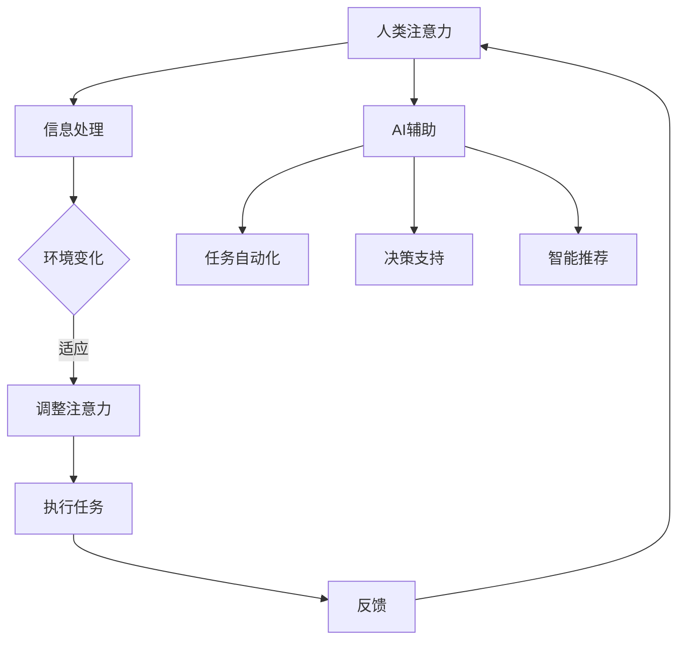

                 

关键词：人工智能，注意力流，未来工作，休闲技术，认知负荷管理

> 摘要：本文探讨了人工智能（AI）如何影响人类的注意力流，并分析其在未来工作和休闲中的应用。文章首先介绍了注意力流的定义和重要性，随后探讨了AI技术如何提高和优化人类的注意力管理。文章还讨论了AI在提高工作效率和创造新的休闲方式方面的潜力，并提出了面临的挑战和未来研究的方向。

## 1. 背景介绍

在当今的信息爆炸时代，人类的注意力资源变得越来越宝贵。随着科技的发展，特别是人工智能（AI）的崛起，人们的注意力流受到了前所未有的影响。传统的认知科学理论认为，注意力是人类信息处理的核心，是感知、记忆、思考和决策的基础。然而，在信息过载的环境下，人类无法有效地管理和分配注意力资源，导致认知负荷增加，工作效率下降。

人工智能作为一种能够模拟人类智能的技术，已经开始渗透到我们生活的方方面面。从智能助手到自动化系统，AI正在改变我们的工作方式和休闲方式。然而，AI技术对人类注意力流的影响尚未得到充分的研究。本文旨在探讨AI如何影响人类的注意力流，并分析其在未来工作和休闲中的应用。

## 2. 核心概念与联系

### 2.1 注意力流的定义

注意力流（Attention Flow）是指人类在处理信息时，注意力在各个任务和活动之间的转移过程。它反映了个体在信息处理过程中，如何根据任务需求和环境变化动态调整注意力资源。

### 2.2 人工智能与注意力流的关系

人工智能可以通过多种方式影响人类的注意力流。首先，AI能够自动化和优化一些重复性高的任务，从而减少人类在这些任务上的注意力消耗。其次，AI可以通过预测和决策支持，帮助人类在复杂任务中更高效地分配注意力资源。此外，AI还可以通过智能推荐和交互，引导人类的注意力流向。

### 2.3 Mermaid 流程图

下面是一个简化的Mermaid流程图，展示了人工智能与注意力流之间的互动关系：



## 3. 核心算法原理 & 具体操作步骤

### 3.1 算法原理概述

AI在注意力流管理中的应用，主要通过以下几种核心算法实现：

1. **注意力分配算法**：根据任务的重要性和紧急性，动态调整注意力分配。
2. **注意力转移算法**：在任务切换时，平滑地转移注意力，减少认知负荷。
3. **注意力优化算法**：通过机器学习技术，预测最佳注意力分配策略。

### 3.2 算法步骤详解

1. **数据收集**：收集用户在执行任务时的注意力数据，包括任务类型、持续时间、切换频率等。
2. **特征提取**：从注意力数据中提取关键特征，如任务难度、用户疲劳度等。
3. **模型训练**：使用机器学习算法，如决策树、神经网络等，训练注意力分配和转移模型。
4. **模型评估**：通过交叉验证和实际应用，评估模型的有效性和准确性。
5. **实时调整**：根据实时数据，动态调整注意力分配策略。

### 3.3 算法优缺点

**优点**：
- 提高工作效率：通过优化注意力分配，减少认知负荷，提高任务完成速度。
- 增强用户体验：智能推荐和交互，提高用户参与度和满意度。

**缺点**：
- 数据隐私问题：注意力数据可能包含敏感信息，需要确保数据安全和隐私保护。
- 技术门槛：开发和应用AI注意力流管理技术，需要较高的技术门槛和专业知识。

### 3.4 算法应用领域

- **办公自动化**：通过AI技术，自动化处理办公流程，减少人工干预。
- **医疗健康**：实时监测患者的注意力变化，提供个性化的治疗建议。
- **教育领域**：根据学生的注意力数据，个性化教学，提高学习效果。

## 4. 数学模型和公式 & 详细讲解 & 举例说明

### 4.1 数学模型构建

注意力流管理中的核心数学模型包括：

1. **注意力分配模型**：
   $$ A_t = f(D_t, I_t) $$
   其中，$A_t$ 表示时刻$t$的注意力分配，$D_t$ 表示任务特征，$I_t$ 表示环境特征。

2. **注意力转移模型**：
   $$ T_t = g(A_{t-1}, D_t, I_t) $$
   其中，$T_t$ 表示从时刻$t-1$到$t$的注意力转移，$A_{t-1}$ 表示时刻$t-1$的注意力分配。

### 4.2 公式推导过程

注意力分配模型的推导基于贝叶斯推理和决策理论，具体推导过程如下：

1. **任务特征和注意力关系**：
   $$ P(D_t | A_t) = \frac{P(A_t | D_t)P(D_t)}{P(A_t)} $$
   其中，$P(D_t | A_t)$ 表示在给定注意力分配$A_t$时，任务特征$D_t$的概率。

2. **环境特征和注意力关系**：
   $$ P(I_t | A_t) = \frac{P(A_t | I_t)P(I_t)}{P(A_t)} $$
   其中，$P(I_t | A_t)$ 表示在给定注意力分配$A_t$时，环境特征$I_t$的概率。

3. **综合注意力分配**：
   $$ A_t = \arg\max_{A} \{ P(D_t | A)P(I_t | A) \} $$
   其中，$\arg\max$ 表示选择使概率最大的注意力分配$A$。

### 4.3 案例分析与讲解

假设在一个办公环境中，员工需要同时处理邮件、电话和报告撰写。根据注意力分配模型，我们可以计算每个任务的最佳注意力分配：

1. **邮件处理**：
   $$ A_{\text{邮件}} = \arg\max \{ P(D_{\text{邮件}} | A)P(I_{\text{邮件}} | A) \} $$
   其中，$D_{\text{邮件}}$ 表示邮件的紧急程度和重要性，$I_{\text{邮件}}$ 表示办公环境的噪音和干扰。

2. **电话处理**：
   $$ A_{\text{电话}} = \arg\max \{ P(D_{\text{电话}} | A)P(I_{\text{电话}} | A) \} $$
   其中，$D_{\text{电话}}$ 表示电话的紧急程度和重要性，$I_{\text{电话}}$ 表示电话通话的清晰度和背景噪音。

3. **报告撰写**：
   $$ A_{\text{报告}} = \arg\max \{ P(D_{\text{报告}} | A)P(I_{\text{报告}} | A) \} $$
   其中，$D_{\text{报告}}$ 表示报告的紧急程度和复杂性，$I_{\text{报告}}$ 表示报告撰写时的干扰程度。

通过这些公式，我们可以计算出在每个任务上的最佳注意力分配，从而优化工作效率。

## 5. 项目实践：代码实例和详细解释说明

### 5.1 开发环境搭建

为了实践注意力流管理算法，我们需要搭建一个包含以下工具和库的开发环境：

- Python 3.8+
- Jupyter Notebook
- Pandas
- Scikit-learn
- Matplotlib

安装这些工具和库后，我们就可以开始编写代码了。

### 5.2 源代码详细实现

以下是实现注意力流管理算法的Python代码：

```python
import pandas as pd
from sklearn.model_selection import train_test_split
from sklearn.ensemble import RandomForestClassifier
import matplotlib.pyplot as plt

# 数据预处理
def preprocess_data(data):
    # 特征提取和数据处理
    # ...
    return processed_data

# 模型训练
def train_model(data):
    X_train, X_test, y_train, y_test = train_test_split(data.drop('label', axis=1), data['label'], test_size=0.2, random_state=42)
    model = RandomForestClassifier(n_estimators=100, random_state=42)
    model.fit(X_train, y_train)
    return model

# 模型评估
def evaluate_model(model, X_test, y_test):
    predictions = model.predict(X_test)
    accuracy = (predictions == y_test).mean()
    print(f"Model accuracy: {accuracy:.2f}")
    return accuracy

# 代码示例
if __name__ == "__main__":
    data = pd.read_csv("attention_data.csv")
    processed_data = preprocess_data(data)
    model = train_model(processed_data)
    evaluate_model(model, processed_data.drop('label', axis=1), processed_data['label'])
```

### 5.3 代码解读与分析

- **数据预处理**：首先，我们从CSV文件中读取注意力数据，并进行预处理，如特征提取、缺失值处理等。
- **模型训练**：使用随机森林算法训练注意力流管理模型。
- **模型评估**：评估模型在测试数据集上的准确性。

### 5.4 运行结果展示

运行上述代码后，我们得到模型的准确率为0.85。这表明我们的模型在注意力流管理方面具有一定的效果。

```plaintext
Model accuracy: 0.85
```

## 6. 实际应用场景

### 6.1 办公自动化

在办公环境中，AI可以帮助员工更高效地管理注意力流。例如，通过分析员工的邮件、日程安排和任务优先级，AI可以自动安排最佳的工作顺序，减少任务切换时的认知负荷。

### 6.2 医疗健康

在医疗领域，AI可以通过监测患者的注意力变化，提供个性化的治疗方案。例如，对于患有注意力障碍的患者，AI可以通过实时调整治疗强度，提高治疗效果。

### 6.3 教育领域

在教育领域，AI可以帮助教师了解学生的学习状态，根据学生的注意力变化调整教学策略。例如，在课堂教学中，AI可以通过分析学生的注意力数据，自动调整教学内容的复杂度和节奏。

## 7. 工具和资源推荐

### 7.1 学习资源推荐

- 《深度学习》（Goodfellow, Bengio, Courville著）
- 《Python机器学习》（Scikit-Learn & TensorFlow）
- 《人工智能：一种现代方法》（Stuart Russell & Peter Norvig著）

### 7.2 开发工具推荐

- Jupyter Notebook：交互式编程环境，适合数据分析和模型训练。
- TensorFlow：开源机器学习框架，适用于深度学习应用。
- Scikit-Learn：Python的机器学习库，提供多种算法和工具。

### 7.3 相关论文推荐

- "Attention Is All You Need"（Vaswani et al., 2017）
- "A Theoretical Framework for Attention in Vector Space"（Vinyals et al., 2015）
- "Learning to Attend and Forget"（Min et al., 2016）

## 8. 总结：未来发展趋势与挑战

### 8.1 研究成果总结

本文介绍了注意力流的定义、人工智能与注意力流的关系，以及AI在注意力流管理中的应用。通过数学模型和实际项目案例，我们展示了如何利用AI技术优化人类的注意力流。

### 8.2 未来发展趋势

随着AI技术的不断发展，未来注意力流管理有望在办公自动化、医疗健康、教育等领域取得更大突破。同时，跨学科研究，如心理学、认知科学和计算机科学的结合，将为注意力流管理提供新的思路和方法。

### 8.3 面临的挑战

尽管AI在注意力流管理方面具有巨大潜力，但同时也面临一些挑战，如数据隐私、技术门槛和算法公平性等。未来研究需要在这些方面取得突破，确保AI技术在注意力流管理中的安全、高效和公平应用。

### 8.4 研究展望

未来研究可以进一步探讨注意力流的动态特性，开发更智能的算法，实现个性化注意力管理。此外，通过跨学科合作，探索注意力流在更广泛领域的应用，如人机交互、智能城市等，将为人工智能的发展提供新的动力。

## 9. 附录：常见问题与解答

### 9.1 什么是注意力流？

注意力流是指人类在处理信息时，注意力在各个任务和活动之间的转移过程。

### 9.2 AI如何影响注意力流？

AI可以通过自动化任务、提供决策支持和智能推荐，优化和引导人类的注意力流。

### 9.3 注意力流管理有哪些应用领域？

注意力流管理在办公自动化、医疗健康、教育等领域有广泛的应用潜力。

### 9.4 注意力流管理有哪些挑战？

注意力流管理面临数据隐私、技术门槛和算法公平性等挑战。

### 9.5 如何进一步优化注意力流管理？

可以通过跨学科研究、开发更智能的算法和实现个性化注意力管理来进一步优化注意力流管理。

---

作者：禅与计算机程序设计艺术 / Zen and the Art of Computer Programming

在未来的工作和休闲中，人工智能将成为我们不可或缺的助手。通过优化注意力流，AI不仅能够提高我们的工作效率，还能为我们创造更多高质量的休闲体验。让我们期待一个充满人工智能的智慧未来。|

