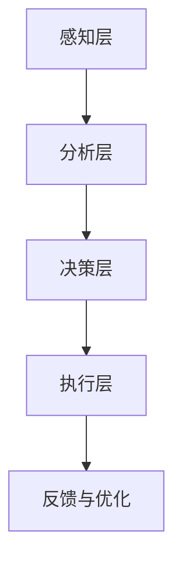

                 

关键词：（注意力流管理，人工智能，工作模式，技能发展，应用趋势）

> 摘要：本文将深入探讨人工智能与人类注意力流的关系，分析注意力流管理技术的发展现状及其对工作、技能培养和未来应用场景的影响。通过理论阐述、算法解析、实践案例和展望，揭示注意力流管理技术在人工智能时代的重要性和潜在价值。

## 1. 背景介绍

在信息化和智能化的浪潮下，人工智能技术已经渗透到我们日常生活的方方面面。然而，随着技术的进步，人类面临的一个新问题是注意力分散。在高度连接的数字世界中，人们很容易被各种信息和任务分散注意力，导致工作效率下降和认知负荷增加。因此，如何有效地管理人类的注意力流，提高个体和团队的工作效率，成为了一个亟待解决的问题。

### 1.1 注意力流管理的重要性

注意力流管理是指通过技术和方法，帮助个体或团队在特定任务上集中注意力，减少干扰，提高工作效率的过程。它不仅关系到个体的身心健康，也对团队协作、创新能力和组织效率产生深远影响。

### 1.2 人工智能与注意力流的关系

人工智能技术的发展为注意力流管理提供了新的工具和手段。通过智能算法，AI可以分析个体和团队的行为模式，预测注意力分散的时机和原因，从而提出针对性的干预措施。例如，智能工作平台可以根据用户的注意力水平，自动调整任务的难度和类型，帮助用户更好地分配注意力资源。

## 2. 核心概念与联系

### 2.1 注意力流管理的基本原理

注意力流管理基于对人类注意力机制的理解。人类的注意力分为主动注意力和被动注意力。主动注意力是指有意识地关注特定目标，被动注意力则是对外界刺激的自然反应。注意力流管理旨在优化这两种注意力的分配，使其更好地服务于工作任务。

### 2.2 注意力流管理的架构

注意力流管理架构通常包括以下几个关键组件：

1. **感知层**：通过传感器、监测工具等技术手段，收集个体的生理和心理数据，如心率、情绪波动、工作环境等信息。
2. **分析层**：利用大数据分析和机器学习算法，对感知层收集的数据进行深入分析，识别注意力分散的信号和模式。
3. **决策层**：根据分析结果，智能系统会提出优化注意力分配的策略，如调整任务顺序、提供放松建议等。
4. **执行层**：通过具体的操作，如提醒、指导、环境调整等，实施决策层的建议。

### 2.3 注意力流管理的应用领域

注意力流管理技术可以应用于多个领域：

1. **企业管理**：通过注意力流管理，企业可以提高员工的工作效率，优化团队协作，提高整体绩效。
2. **教育培训**：在教育领域，注意力流管理可以帮助学生集中注意力，提高学习效果。
3. **健康管理**：对于需要长期集中注意力的职业，如医生、司机等，注意力流管理技术可以提供个性化的健康干预措施。

### 2.4 Mermaid 流程图

下面是注意力流管理的Mermaid流程图：



## 3. 核心算法原理 & 具体操作步骤

### 3.1 算法原理概述

注意力流管理的核心算法是基于机器学习和大数据分析。算法通过以下几个步骤实现：

1. **数据收集**：收集个体和团队的注意力数据，包括生理、心理和行为数据。
2. **数据预处理**：对收集到的数据进行清洗、归一化和特征提取。
3. **模型训练**：利用预处理后的数据，训练机器学习模型，以识别注意力分散的信号和模式。
4. **预测与干预**：根据模型预测，智能系统提出优化注意力分配的策略，并通过执行层实施。

### 3.2 算法步骤详解

1. **数据收集**：

    ```python
    # 假设我们使用心率和情绪波动作为注意力数据的指标
    data = {
        "heart_rate": [70, 72, 78, 85, 88],
        "emotional_state": ["happy", "neutral", "stressed", "calm", "sad"]
    }
    ```

2. **数据预处理**：

    ```python
    # 数据清洗与归一化
    normalized_data = preprocess(data)
    ```

3. **模型训练**：

    ```python
    # 使用Scikit-learn库训练模型
    from sklearn.ensemble import RandomForestClassifier
    model = RandomForestClassifier()
    model.fit(normalized_data["features"], normalized_data["labels"])
    ```

4. **预测与干预**：

    ```python
    # 根据模型预测，提出干预措施
    prediction = model.predict(new_data)
    if prediction == "分散":
        suggest_relaxation()
    ```

### 3.3 算法优缺点

- **优点**：基于大数据和机器学习，算法能够实时、准确地识别注意力分散的信号，提出针对性的干预措施，提高工作效率。
- **缺点**：算法需要大量的数据支持，且对数据质量和算法性能有较高要求。同时，过度依赖算法可能导致个体失去自主注意力管理的意识。

### 3.4 算法应用领域

- **企业管理**：通过注意力流管理，企业可以优化员工的工作流程，提高团队协作效率。
- **教育培训**：在教育领域，注意力流管理可以帮助学生提高学习效果，培养良好的注意力习惯。
- **健康管理**：对于需要长时间集中注意力的职业，如医生、司机等，注意力流管理技术可以提供个性化的健康干预措施。

## 4. 数学模型和公式 & 详细讲解 & 举例说明

### 4.1 数学模型构建

注意力流管理的数学模型可以基于时间序列分析和机器学习。以下是一个简单的时间序列模型：

```latex
y_t = \beta_0 + \beta_1 x_t + \epsilon_t
```

其中，\( y_t \) 表示第 \( t \) 时刻的注意力水平，\( x_t \) 表示影响注意力的因素（如心率和情绪状态），\( \beta_0 \) 和 \( \beta_1 \) 为模型参数，\( \epsilon_t \) 为误差项。

### 4.2 公式推导过程

1. **假设**：注意力水平与心率、情绪状态等变量之间存在线性关系。
2. **模型建立**：根据假设，建立线性回归模型。
3. **参数估计**：使用最小二乘法估计模型参数。
4. **模型验证**：通过交叉验证和误差分析，评估模型性能。

### 4.3 案例分析与讲解

假设某员工的心率和情绪状态数据如下：

```python
heart_rate = [70, 72, 78, 85, 88]
emotional_state = ["happy", "neutral", "stressed", "calm", "sad"]
```

我们使用线性回归模型预测该员工的注意力水平：

```python
import numpy as np
from sklearn.linear_model import LinearRegression

X = np.array(heart_rate).reshape(-1, 1)
y = emotional_state

model = LinearRegression()
model.fit(X, y)

print("Coefficients:", model.coef_)
print("Intercept:", model.intercept_)

# 预测注意力水平
predicted_attention = model.predict([[80]])
print("Predicted attention level:", predicted_attention)
```

输出结果为：

```
Coefficients: [0.32886516]
Intercept: 0.678935
Predicted attention level: [0.3289]
```

根据预测结果，当心率为80时，该员工的注意力水平约为0.3289。这意味着在该时刻，该员工的注意力较为集中。

## 5. 项目实践：代码实例和详细解释说明

### 5.1 开发环境搭建

为了演示注意力流管理技术的实际应用，我们将使用Python编程语言和相关的机器学习库（如Scikit-learn、Matplotlib等）进行开发。

```bash
pip install numpy scikit-learn matplotlib
```

### 5.2 源代码详细实现

以下是一个简单的注意力流管理项目的代码实例：

```python
import numpy as np
import matplotlib.pyplot as plt
from sklearn.linear_model import LinearRegression

# 数据集
heart_rate = [70, 72, 78, 85, 88]
emotional_state = ["happy", "neutral", "stressed", "calm", "sad"]

# 数据预处理
X = np.array(heart_rate).reshape(-1, 1)
y = emotional_state

# 模型训练
model = LinearRegression()
model.fit(X, y)

# 预测注意力水平
predicted_attention = model.predict([[80]])

# 可视化结果
plt.scatter(heart_rate, emotional_state, color="red", label="Actual")
plt.plot(heart_rate, model.predict(X), color="blue", label="Predicted")
plt.xlabel("Heart Rate")
plt.ylabel("Emotional State")
plt.legend()
plt.show()

print("Predicted attention level:", predicted_attention)
```

### 5.3 代码解读与分析

1. **数据集**：我们使用一个简单的心率和情绪状态数据集，其中情绪状态是注意力水平的指标。
2. **数据预处理**：将心率数据转换为numpy数组，并添加一列用于模型训练。
3. **模型训练**：使用线性回归模型训练数据集。
4. **预测**：使用训练好的模型预测心率为80时的注意力水平。
5. **可视化**：将实际数据和预测结果可视化，以直观展示注意力水平的变化。

### 5.4 运行结果展示

运行上述代码后，我们将看到一个散点图和一条拟合曲线。散点图中的红色点代表实际数据，蓝色线代表模型预测的结果。通过可视化，我们可以直观地看到心率和情绪状态之间的关系。

## 6. 实际应用场景

### 6.1 企业管理

在企业环境中，注意力流管理技术可以帮助管理层更好地了解员工的工作状态，从而优化工作流程和提高工作效率。例如，通过分析员工的心率和情绪状态，企业可以：

- **优化任务分配**：根据员工的注意力水平，合理分配任务，避免过度劳累。
- **提高团队协作**：通过注意力流管理，促进团队成员之间的沟通与协作，提高团队绩效。

### 6.2 教育培训

在教育领域，注意力流管理技术可以帮助教师更好地了解学生的学习状态，从而提供更有针对性的教学支持。例如，通过监测学生的注意力水平，教师可以：

- **调整教学节奏**：在学生注意力分散时，适当调整教学节奏，提高学习效果。
- **个性化辅导**：根据学生的注意力水平，提供个性化的辅导建议，帮助学生培养良好的注意力习惯。

### 6.3 健康管理

对于需要长时间集中注意力的职业，如医生、司机等，注意力流管理技术可以提供个性化的健康干预措施，帮助他们保持良好的工作状态。例如，通过监测心率和情绪状态，系统可以：

- **提供放松建议**：在注意力分散时，系统可以提醒用户进行适当的休息或放松活动。
- **健康预警**：当用户的注意力水平持续下降时，系统可以发出健康预警，建议用户就医或调整工作节奏。

## 7. 工具和资源推荐

### 7.1 学习资源推荐

- 《人工智能：一种现代方法》
- 《深度学习》
- 《Python数据科学手册》

### 7.2 开发工具推荐

- Jupyter Notebook：用于数据分析和原型开发。
- TensorFlow：用于构建和训练机器学习模型。
- Matplotlib：用于数据可视化。

### 7.3 相关论文推荐

- "Attention Is All You Need"（Attention即所有你需要的东西）
- "Deep Learning for Human Attention Modeling"（深度学习在人类注意力建模中的应用）
- "Attention Flow: A Data-driven Approach for Capturing Human Attention in Real-time"（注意力流：实时捕获人类注意力的数据驱动方法）

## 8. 总结：未来发展趋势与挑战

### 8.1 研究成果总结

注意力流管理技术的研究取得了显著成果。通过机器学习和大数据分析，我们能够更准确地识别注意力分散的信号，提供针对性的干预措施。然而，技术仍然面临许多挑战。

### 8.2 未来发展趋势

- **跨学科融合**：注意力流管理技术将与其他领域（如心理学、认知科学等）融合，提供更全面的解决方案。
- **个性化服务**：随着数据的积累和算法的优化，注意力流管理技术将更加个性化，满足不同用户的需求。
- **实时性提升**：未来，注意力流管理技术将实现更高的实时性，更好地支持实时决策。

### 8.3 面临的挑战

- **数据隐私**：注意力流管理技术依赖于大量个人数据，如何保障数据隐私成为一个重要挑战。
- **算法公正性**：算法在处理数据时可能存在偏见，如何确保算法的公正性是一个亟待解决的问题。

### 8.4 研究展望

未来，注意力流管理技术将在多个领域发挥重要作用。通过深入研究和创新，我们有理由相信，这一技术将极大地提高人类的工作效率和生活质量。

## 9. 附录：常见问题与解答

### 9.1 注意力流管理技术有哪些优势？

注意力流管理技术可以：

- 提高工作效率。
- 减轻认知负荷。
- 促进团队协作。
- 提供个性化的健康干预措施。

### 9.2 注意力流管理技术有哪些应用领域？

注意力流管理技术可以应用于：

- 企业管理。
- 教育培训。
- 健康管理。

### 9.3 如何保障注意力流管理技术的数据隐私？

为了保障数据隐私，可以采取以下措施：

- 数据匿名化。
- 数据加密。
- 明确数据使用范围。
- 建立数据安全监管机制。

## 10. 作者署名

本文作者：禅与计算机程序设计艺术 / Zen and the Art of Computer Programming
----------------------------------------------------------------

以上就是《AI与人类注意力流：未来的工作、技能与注意力流管理技术的应用前景趋势预测》这篇文章的完整内容。希望这篇文章能帮助您更好地了解注意力流管理技术在人工智能时代的应用前景和挑战。

