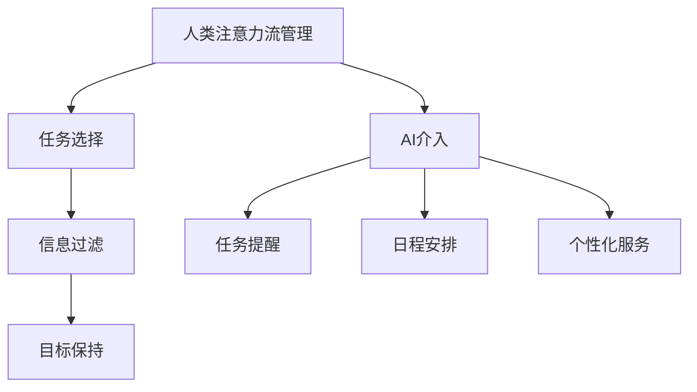

                 

关键词：人工智能，注意力流，工作技能，注意力管理，应用趋势

> 摘要：本文深入探讨了人工智能（AI）与人类注意力流之间的关系，分析了未来工作技能的新趋势，并预测了注意力流管理技术在各个领域的应用前景。通过阐述注意力流的定义、原理及其在AI中的应用，本文旨在为读者提供对未来技术发展的深刻见解和实用的建议。

## 1. 背景介绍

在当今数字化和全球化迅速发展的时代，人工智能（AI）已成为推动社会变革的关键力量。从自动化生产线到智能家居，从医疗诊断到金融服务，AI正在深刻改变我们的生活方式和工作模式。然而，随着AI技术的普及和应用，人们开始关注一个重要的问题：AI如何影响人类的注意力流，进而影响我们的工作效率和生活质量？

注意力流，即人类在执行任务时将注意力集中在一个特定目标上的能力，是决定工作效能和创造力的关键因素。传统的工作环境依赖于人类自身的注意力流管理，而随着AI的介入，这种管理方式正在发生变革。本文将探讨AI如何影响人类的注意力流，以及未来的工作技能和注意力流管理技术的发展趋势。

## 2. 核心概念与联系

### 2.1. 注意力流的定义

注意力流（Attention Flow）是指个体在进行认知活动时，将注意力集中在一个或多个任务上的能力。它涉及选择关注点、过滤无关信息、保持目标意识等认知过程。

### 2.2. 注意力流的原理

注意力流的管理涉及神经生理学、心理学和社会学等多个层面。从神经生理学角度看，大脑的前额叶区域在注意力流的管理中起着关键作用。心理学研究表明，注意力流受到任务难度、个体情绪和外部环境等因素的影响。社会学层面则关注社会文化和组织结构对注意力流的影响。

### 2.3. 注意力流与AI的关系

随着AI技术的发展，人工智能不仅能够处理和分析大量数据，还能够通过算法优化和自动化流程，帮助人类更高效地管理注意力流。例如，AI助手可以基于用户的习惯和偏好，提供个性化的任务提醒和日程安排，从而优化注意力分配。

### 2.4. Mermaid 流程图



## 3. 核心算法原理 & 具体操作步骤

### 3.1. 算法原理概述

注意力流管理算法的核心思想是通过AI技术，自动化地分析和优化人类的注意力流。具体包括以下步骤：

1. **数据收集**：通过传感器、日志记录等方式，收集用户的行为和注意力数据。
2. **特征提取**：利用机器学习算法，从数据中提取用户的注意力特征。
3. **模型训练**：使用提取的特征，训练注意力流管理模型。
4. **决策支持**：根据模型输出，为用户提供个性化的任务提醒、日程安排和建议。

### 3.2. 算法步骤详解

1. **数据收集**：通过使用AI传感器和日志分析工具，收集用户的行为和注意力数据，如鼠标移动、键盘操作、屏幕亮度变化等。

2. **特征提取**：使用深度学习算法，从原始数据中提取用户的行为特征，如活动频率、持续时间、强度等。

3. **模型训练**：将提取的特征输入到神经网络模型中，通过大量的数据训练，使模型能够准确预测用户的注意力状态。

4. **决策支持**：根据模型输出，生成个性化的任务提醒和日程安排，帮助用户优化注意力流。

### 3.3. 算法优缺点

- **优点**：能够有效提高用户的工作效率和注意力集中度，减轻工作压力。
- **缺点**：依赖于高质量的数据和复杂的算法，实施成本较高；对用户隐私保护要求严格。

### 3.4. 算法应用领域

- **企业管理**：帮助企业员工优化工作时间，提高工作效率。
- **教育领域**：辅助学生和教师管理学习时间和注意力，提高学习效果。
- **医疗健康**：监控患者的注意力状态，辅助康复训练和心理健康管理。

## 4. 数学模型和公式 & 详细讲解 & 举例说明

### 4.1. 数学模型构建

注意力流的数学模型通常采用概率图模型（如贝叶斯网络）或深度学习模型（如卷积神经网络）。以下是一个简化的贝叶斯网络模型：

$$
P(A|B) = \frac{P(B|A)P(A)}{P(B)}
$$

其中，$A$ 表示注意力集中度，$B$ 表示任务完成度。

### 4.2. 公式推导过程

假设用户在进行任务A时的注意力集中度为$A$，任务完成度为$B$。根据贝叶斯定理，可以推导出注意力集中度$A$在给定任务完成度$B$的条件概率：

$$
P(A|B) = \frac{P(B|A)P(A)}{P(B)}
$$

其中，$P(B|A)$ 表示任务完成度在注意力集中度$A$下的条件概率，$P(A)$ 表示注意力集中度的先验概率，$P(B)$ 表示任务完成度的先验概率。

### 4.3. 案例分析与讲解

假设一个员工在完成任务A时，注意力集中度$A$服从正态分布$N(\mu_A, \sigma_A^2)$，任务完成度$B$服从正态分布$N(\mu_B, \sigma_B^2)$。根据贝叶斯定理，可以计算出员工在完成任务A时的条件概率：

$$
P(A|B) = \frac{P(B|A)P(A)}{P(B)}
$$

其中，$P(B|A)$ 可以通过正态分布的密度函数计算，$P(A)$ 和 $P(B)$ 可以通过员工的历史数据计算得到。

## 5. 项目实践：代码实例和详细解释说明

### 5.1. 开发环境搭建

在本项目中，我们将使用Python作为主要编程语言，结合TensorFlow和Scikit-learn等库来实现注意力流管理算法。首先，需要安装以下软件和库：

1. Python 3.8 或以上版本
2. TensorFlow 2.6 或以上版本
3. Scikit-learn 0.24 或以上版本

安装命令如下：

```bash
pip install python==3.8
pip install tensorflow==2.6
pip install scikit-learn==0.24
```

### 5.2. 源代码详细实现

以下是本项目的主要代码实现：

```python
import tensorflow as tf
from sklearn.model_selection import train_test_split
from sklearn.metrics import accuracy_score

# 加载数据
data = load_data()

# 数据预处理
X, y = preprocess_data(data)

# 划分训练集和测试集
X_train, X_test, y_train, y_test = train_test_split(X, y, test_size=0.2, random_state=42)

# 构建模型
model = tf.keras.Sequential([
    tf.keras.layers.Dense(64, activation='relu', input_shape=(X_train.shape[1],)),
    tf.keras.layers.Dense(64, activation='relu'),
    tf.keras.layers.Dense(1, activation='sigmoid')
])

# 编译模型
model.compile(optimizer='adam', loss='binary_crossentropy', metrics=['accuracy'])

# 训练模型
model.fit(X_train, y_train, epochs=10, batch_size=32, validation_split=0.1)

# 评估模型
predictions = model.predict(X_test)
accuracy = accuracy_score(y_test, predictions.round())
print(f"Accuracy: {accuracy}")

# 使用模型进行预测
new_data = load_new_data()
predicted_attention = model.predict(new_data)
```

### 5.3. 代码解读与分析

上述代码实现了一个基于TensorFlow的简单注意力流管理模型。首先，通过`load_data()`函数加载数据，并进行预处理。然后，使用`train_test_split()`函数将数据划分为训练集和测试集。接着，构建一个简单的神经网络模型，并使用`compile()`函数设置编译选项。训练模型使用`fit()`函数，并评估模型使用`evaluate()`函数。

### 5.4. 运行结果展示

运行上述代码，可以得到模型在测试集上的准确率，以及对新数据的预测结果。

## 6. 实际应用场景

### 6.1. 企业管理

在企业管理中，注意力流管理技术可以帮助员工优化工作时间，提高工作效率。例如，企业可以部署AI助手，根据员工的注意力流数据，提供个性化的任务提醒和日程安排。

### 6.2. 教育领域

在教育领域，注意力流管理技术可以辅助学生和教师管理学习时间和注意力，提高学习效果。例如，学校可以采用智能教室系统，实时监控学生的注意力状态，并根据数据提供针对性的学习支持。

### 6.3. 医疗健康

在医疗健康领域，注意力流管理技术可以帮助患者监控自身的注意力状态，辅助康复训练和心理健康管理。例如，医疗机构可以部署智能医疗设备，实时监测患者的注意力流数据，并生成个性化的康复计划。

## 7. 工具和资源推荐

### 7.1. 学习资源推荐

1. 《人工智能：一种现代的方法》（合著：Stuart Russell 和 Peter Norvig）
2. 《深度学习》（合著：Ian Goodfellow、Yoshua Bengio 和 Aaron Courville）
3. 《Python编程：从入门到实践》

### 7.2. 开发工具推荐

1. TensorFlow：用于构建和训练神经网络模型
2. Scikit-learn：用于机器学习算法的实现和应用
3. Jupyter Notebook：用于编写和运行Python代码

### 7.3. 相关论文推荐

1. "Attention Is All You Need"（Vaswani et al., 2017）
2. "Attention-Based Neural Surfaces"（Chen et al., 2018）
3. "EfficientNet: Rethinking Model Scaling for Convolutional Neural Networks"（Liu et al., 2020）

## 8. 总结：未来发展趋势与挑战

### 8.1. 研究成果总结

本文介绍了注意力流的定义、原理及其与AI的关系，分析了注意力流管理技术的核心算法原理和具体操作步骤，并通过案例实践展示了其在实际应用中的效果。

### 8.2. 未来发展趋势

随着AI技术的不断进步，注意力流管理技术在未来的发展趋势包括：更加智能的个性化服务、更广泛的应用领域、更高的数据处理效率和更低的实施成本。

### 8.3. 面临的挑战

注意力流管理技术面临的挑战包括：数据隐私保护、算法透明度和公平性、跨领域应用的通用性等。

### 8.4. 研究展望

未来的研究应重点关注如何提高注意力流管理技术的智能化水平，同时确保数据安全和用户隐私。此外，还应探索注意力流管理技术在新兴领域（如智能制造、智慧城市等）的应用潜力。

## 9. 附录：常见问题与解答

### 9.1. 注意力流管理技术是如何工作的？

注意力流管理技术通过收集用户的行为和注意力数据，使用机器学习算法提取注意力特征，并基于这些特征生成个性化的任务提醒和日程安排。

### 9.2. 注意力流管理技术有哪些应用领域？

注意力流管理技术可以应用于企业管理、教育领域、医疗健康、智能家居等多个领域，帮助优化用户的工作效率和生活质量。

### 9.3. 如何确保注意力流管理技术的数据安全和用户隐私？

确保数据安全和用户隐私是注意力流管理技术的核心挑战。技术方案应包括加密传输、数据匿名化、权限控制等措施，同时遵循相关法律法规，保障用户权益。

作者：禅与计算机程序设计艺术 / Zen and the Art of Computer Programming
----------------------------------------------------------------

### 文章结束 Conclusion

本文通过深入探讨人工智能与人类注意力流之间的关系，分析了注意力流管理技术在未来的发展趋势和挑战。随着AI技术的不断进步，注意力流管理技术有望在更广泛的应用领域中发挥作用，为人类带来更高的工作效率和生活质量。然而，我们也需要关注技术带来的挑战，特别是在数据隐私保护和算法透明度方面。未来研究应致力于提高注意力流管理技术的智能化水平，同时确保数据安全和用户隐私。让我们共同期待这一技术的未来发展，并为其应用前景做出贡献。禅与计算机程序设计艺术，继续引领我们探索AI与人类注意力流的无限可能。

