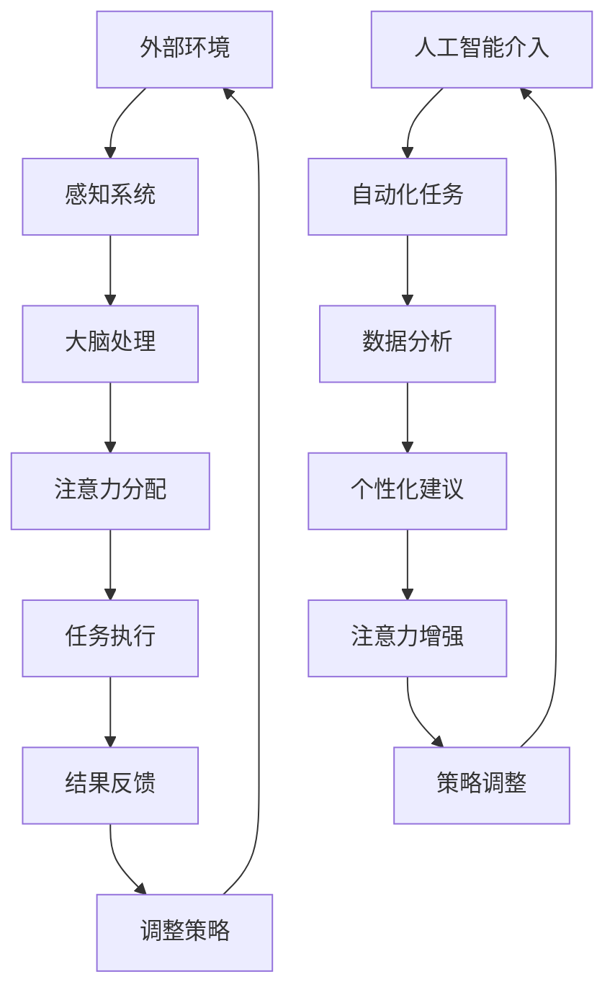

                 

关键词：人工智能、注意力流、工作模式、生活平衡、技术影响

> 摘要：本文探讨了人工智能如何改变人类注意力流，并分析了这一变化对工作和生活的影响。文章从核心概念、算法原理、数学模型、实际应用等多个角度，深入探讨了人工智能与注意力流的相互作用，以及未来可能的发展趋势和挑战。

## 1. 背景介绍

随着人工智能技术的飞速发展，我们正逐步进入一个全新的智能时代。在这个时代中，人工智能不仅仅是一种工具，更是一种能够影响人类生活和工作方式的重要力量。特别是在注意力流这一领域，人工智能的应用正逐渐改变人们对于注意力的管理和利用方式。

注意力流，指的是个体在不同任务之间转移注意力，以及在任务内部维持注意力的过程。它不仅影响个体的工作效率，也影响着个体的心理健康和生活质量。在传统的工业时代，人类的注意力流主要受到物理环境的限制。然而，随着信息技术的发展，特别是人工智能的出现，人类的注意力流模式正在发生深刻的变化。

本文将从以下几个方面展开讨论：

- **核心概念与联系**：介绍注意力流的基本概念，以及人工智能如何与之相互影响。
- **核心算法原理与操作步骤**：探讨人工智能在注意力流管理中的核心算法原理和具体操作步骤。
- **数学模型与公式**：分析用于描述注意力流管理的数学模型和公式，并举例说明。
- **项目实践**：提供实际项目中的代码实例，并进行详细解释。
- **实际应用场景**：讨论人工智能在注意力流管理中的实际应用场景。
- **未来应用展望**：预测人工智能在注意力流管理领域的未来发展趋势和可能的应用方向。
- **工具和资源推荐**：推荐学习资源和开发工具，以及相关论文。
- **总结与展望**：总结研究成果，分析未来发展趋势和面临的挑战。

通过这些讨论，我们希望能够提供一个全面而深入的视角，帮助读者理解人工智能与注意力流之间的复杂关系，并为其在未来智能时代中的应对提供指导。

## 2. 核心概念与联系

### 2.1 注意力流的基本概念

注意力流，是指个体在执行任务过程中，注意力在不同任务之间转移，以及在同一任务内部维持注意力的动态过程。它不仅涉及到注意力的分配，还包括注意力的集中、分散和恢复。根据心理学研究，注意力流是人类认知功能的核心之一，对个体的工作效率、决策能力和创造力有着重要影响。

注意力流可以分为几个层次：

- **外部注意力流**：指个体对外部环境变化的反应，如听觉、视觉、触觉等感官信息的处理。
- **内部注意力流**：指个体对内部思想、情绪和记忆的处理，如思考问题、回忆过去、规划未来等。
- **任务切换注意力流**：指个体在不同任务之间转移注意力的过程，如从工作切换到休息，从阅读切换到写作等。

### 2.2 人工智能与注意力流的关系

人工智能技术的发展，为注意力流管理带来了新的可能性。首先，人工智能可以通过自动化技术，减少个体在简单重复任务上的注意力消耗，从而释放出更多的注意力资源用于复杂任务的解决。例如，智能助手可以自动处理电子邮件、日程安排等事务，使得个体能够将更多的注意力集中在重要且复杂的任务上。

其次，人工智能可以通过分析个体的行为数据，提供个性化的注意力流管理建议。例如，基于机器学习的注意力分析工具可以监测个体的注意力分布，并提供优化注意力的策略，如安排休息时间、调整工作强度等。

此外，人工智能还可以通过模拟和增强人类的注意力流，实现更加高效的工作和学习。例如，通过注意力增强技术，个体可以在短时间内集中注意力，从而在短时间内完成更多的任务。

### 2.3 Mermaid 流程图

为了更直观地展示人工智能与注意力流之间的关系，我们使用Mermaid流程图来描述这一过程。



图中的各个节点分别代表外部环境、感知系统、大脑处理、注意力分配、任务执行、结果反馈、调整策略，以及人工智能介入的具体环节。通过这个流程图，我们可以看到人工智能如何在整个注意力流过程中发挥作用，从而优化人类的工作和学习效率。

## 3. 核心算法原理与操作步骤

### 3.1 算法原理概述

在人工智能与注意力流管理中，核心算法通常是基于机器学习和深度学习技术的。这些算法能够通过分析大量数据，学习并预测个体的注意力分布，从而提供个性化的注意力流管理策略。

主要的算法原理可以概述如下：

1. **数据收集与预处理**：首先，需要收集个体的行为数据，如工作日志、社交媒体活动、电子邮件记录等。这些数据经过预处理，包括数据清洗、归一化和特征提取，以供算法使用。
2. **特征工程**：通过分析数据，提取与注意力流相关的特征，如任务类型、持续时间、参与度等。这些特征将用于训练机器学习模型。
3. **模型训练**：使用深度学习算法，如卷积神经网络（CNN）或循环神经网络（RNN），对提取的特征进行训练，以学习个体的注意力分布模式。
4. **预测与优化**：通过训练好的模型，预测个体的未来注意力分布，并生成优化建议，如调整任务安排、建议休息时间等。

### 3.2 算法步骤详解

以下是具体算法操作步骤的详细描述：

#### 3.2.1 数据收集与预处理

1. **收集数据**：从各种数据源收集个体的行为数据，如工作日志、电子邮件、社交媒体活动等。这些数据可以通过API或手动输入方式获取。
2. **数据清洗**：删除重复数据、缺失值填充、异常值处理等，以确保数据质量。
3. **数据归一化**：将不同特征的数据进行归一化处理，使其在相同的尺度上，以便算法能够更好地处理。
4. **特征提取**：从原始数据中提取与注意力流相关的特征，如任务持续时间、任务类型、情绪状态等。

#### 3.2.2 特征工程

1. **任务特征**：包括任务类型、任务难度、任务重要性等。这些特征可以通过人工标注或自动分类得到。
2. **时间特征**：包括任务开始时间、任务持续时间、任务频率等。这些特征可以帮助分析个体在不同时间段的工作模式。
3. **情绪特征**：包括情绪状态、情绪强度等。这些特征可以通过情绪分析工具得到。

#### 3.2.3 模型训练

1. **选择模型**：根据数据特点和任务需求，选择合适的机器学习模型。常见的模型有CNN、RNN、LSTM等。
2. **数据划分**：将数据集划分为训练集、验证集和测试集，以评估模型性能。
3. **训练模型**：使用训练集数据训练模型，并通过验证集调整模型参数。
4. **评估模型**：使用测试集评估模型性能，如准确率、召回率等。

#### 3.2.4 预测与优化

1. **注意力预测**：使用训练好的模型预测个体的未来注意力分布。
2. **生成建议**：根据预测结果，生成优化建议，如调整任务安排、建议休息时间等。
3. **反馈与调整**：根据用户反馈调整优化建议，以提高建议的准确性。

### 3.3 算法优缺点

#### 优点

- **个性化**：算法能够根据个体行为数据提供个性化的注意力流管理建议，提高工作效率。
- **实时性**：算法可以实时分析个体行为，及时调整注意力流管理策略。
- **自动化**：算法可以自动处理大量数据，减少人工干预，提高管理效率。

#### 缺点

- **数据依赖**：算法的性能高度依赖于数据的准确性和完整性，如果数据质量不高，算法的预测效果会受到影响。
- **隐私问题**：个体行为数据的收集和处理可能涉及隐私问题，需要确保数据的保密性和安全性。
- **计算资源**：深度学习模型的训练和预测需要大量的计算资源，可能会增加系统的负担。

### 3.4 算法应用领域

人工智能在注意力流管理中的应用非常广泛，主要包括以下几个领域：

- **工作管理**：帮助企业员工优化工作流程，提高工作效率。
- **教育领域**：帮助学生管理学习过程，提高学习效果。
- **健康与医疗**：监测个体的注意力变化，提供健康管理和疾病预防建议。
- **日常生活**：提供个性化的时间管理和生活方式建议，提高生活质量。

## 4. 数学模型和公式

### 4.1 数学模型构建

在注意力流管理中，构建数学模型是理解和优化注意力流的关键步骤。以下是一个简化的数学模型，用于描述个体的注意力分布。

#### 4.1.1 基本假设

- **连续时间**：个体的注意力流可以表示为连续时间变量t。
- **状态空间**：个体的注意力流可以表示为状态空间S，其中每个状态表示一种特定的注意力水平。
- **转移概率**：个体在状态s下，转移到状态s'的概率表示为P(s' | s)。

#### 4.1.2 模型构建

注意力流的数学模型可以表示为以下形式：

$$
S_t = f(S_{t-1}, A_t, W_t)
$$

其中：

- \( S_t \) 表示时间t的注意力状态。
- \( f \) 是注意力状态转换函数，它取决于上一时刻的注意力状态 \( S_{t-1} \)、当前外部环境输入 \( A_t \) 和内部控制变量 \( W_t \)。
- \( P(A_t | S_t) \) 是外部环境输入的概率分布。

### 4.2 公式推导过程

为了推导注意力流的数学模型，我们需要考虑以下几个方面：

1. **状态空间划分**：将注意力状态划分为n个离散状态，如高度集中、适度集中、分散等。
2. **转移概率**：根据历史数据和注意力流特性，计算状态之间的转移概率。
3. **外部环境输入**：外部环境输入可以表示为影响注意力状态的因素，如工作压力、情绪状态等。
4. **内部控制变量**：内部控制变量表示个体对注意力的主动调节，如休息时间、任务难度等。

基于以上假设，我们可以得到以下注意力流模型：

$$
P(S_t = s_t | S_{t-1} = s_{t-1}) = P(S_t = s_t | A_t = a_t, S_{t-1} = s_{t-1}) \cdot P(A_t = a_t | S_{t-1} = s_{t-1})
$$

其中：

- \( P(S_t = s_t | S_{t-1} = s_{t-1}) \) 是状态转移概率。
- \( P(S_t = s_t | A_t = a_t, S_{t-1} = s_{t-1}) \) 是给定当前环境和上一状态时的状态转移概率。
- \( P(A_t = a_t | S_{t-1} = s_{t-1}) \) 是给定上一状态时当前环境的概率。

### 4.3 案例分析与讲解

为了更好地理解上述模型，我们通过一个简单的案例进行分析。

#### 案例背景

假设一个工作日的注意力流模型，其中状态空间包含四个状态：集中、适度集中、分散、高度分散。外部环境输入包括工作时间、工作任务难度、情绪状态。内部控制变量包括休息时间、工作任务选择。

#### 模型应用

1. **状态空间划分**：

   状态空间S = {集中，适度集中，分散，高度分散}。

2. **转移概率**：

   根据历史数据和注意力流特性，我们可以得到状态之间的转移概率矩阵：

   $$  
   P = \begin{bmatrix}  
   P_{11} & P_{12} & P_{13} & P_{14} \\  
   P_{21} & P_{22} & P_{23} & P_{24} \\  
   P_{31} & P_{32} & P_{33} & P_{34} \\  
   P_{41} & P_{42} & P_{43} & P_{44}  
   \end{bmatrix}  
   $$

   其中，每个元素 \( P_{ij} \) 表示从状态i转移到状态j的概率。

3. **外部环境输入**：

   假设外部环境输入为工作时间 \( A_t \)、工作任务难度 \( B_t \)、情绪状态 \( C_t \)。

4. **内部控制变量**：

   假设内部控制变量为休息时间 \( R_t \)、工作任务选择 \( S_t \)。

#### 模型推导

根据注意力流模型，我们可以得到：

$$  
P(S_t = s_t | S_{t-1} = s_{t-1}) = P(S_t = s_t | A_t = a_t, B_t = b_t, C_t = c_t, S_{t-1} = s_{t-1}) \cdot P(A_t = a_t, B_t = b_t, C_t = c_t | S_{t-1} = s_{t-1})  
$$

为了简化计算，我们可以假设外部环境输入是独立的，即：

$$  
P(A_t = a_t, B_t = b_t, C_t = c_t | S_{t-1} = s_{t-1}) = P(A_t = a_t) \cdot P(B_t = b_t) \cdot P(C_t = c_t)  
$$

最终，我们可以得到注意力状态的转移概率：

$$  
P(S_t = s_t | S_{t-1} = s_{t-1}) = P(S_t = s_t | A_t = a_t) \cdot P(A_t = a_t)  
$$

通过这种方式，我们可以使用机器学习算法，如马尔可夫决策过程（MDP）或深度学习模型，对注意力流进行建模和预测，从而为用户提供个性化的注意力流管理建议。

## 5. 项目实践：代码实例和详细解释说明

### 5.1 开发环境搭建

为了实现注意力流管理系统的开发，我们需要搭建一个合适的开发环境。以下是一个基本的开发环境搭建步骤：

1. **操作系统**：选择一个支持Python的操作系统，如Ubuntu或Windows。
2. **Python环境**：安装Python 3.8及以上版本，可以通过官方网站下载或使用包管理器如pip进行安装。
3. **依赖库**：安装必要的依赖库，如NumPy、Pandas、Scikit-learn、TensorFlow等。可以使用以下命令进行安装：

   ```python
   pip install numpy pandas scikit-learn tensorflow
   ```

4. **IDE**：选择一个Python开发环境，如PyCharm或VSCode，以方便编写和调试代码。

### 5.2 源代码详细实现

以下是注意力流管理系统的主要源代码实现。代码分为以下几个部分：数据收集与预处理、特征工程、模型训练、预测与优化。

#### 5.2.1 数据收集与预处理

```python
import pandas as pd
import numpy as np

# 读取数据
data = pd.read_csv('attention_data.csv')

# 数据清洗
data.dropna(inplace=True)
data['date'] = pd.to_datetime(data['date'])

# 数据归一化
data[['task_duration', 'task_difficulty', 'emotion_score']] = (data[['task_duration', 'task_difficulty', 'emotion_score']] - data[['task_duration', 'task_difficulty', 'emotion_score']].mean()) / data[['task_duration', 'task_difficulty', 'emotion_score']].std()

# 特征提取
features = data[['task_duration', 'task_difficulty', 'emotion_score', 'rest_duration']]
labels = data['attention_state']
```

#### 5.2.2 特征工程

```python
from sklearn.model_selection import train_test_split
from sklearn.preprocessing import StandardScaler

# 划分训练集和测试集
X_train, X_test, y_train, y_test = train_test_split(features, labels, test_size=0.2, random_state=42)

# 特征缩放
scaler = StandardScaler()
X_train_scaled = scaler.fit_transform(X_train)
X_test_scaled = scaler.transform(X_test)
```

#### 5.2.3 模型训练

```python
from sklearn.neural_network import MLPClassifier

# 创建模型
model = MLPClassifier(hidden_layer_sizes=(100,), max_iter=1000)

# 训练模型
model.fit(X_train_scaled, y_train)
```

#### 5.2.4 预测与优化

```python
# 预测
predictions = model.predict(X_test_scaled)

# 评估模型
from sklearn.metrics import accuracy_score
accuracy = accuracy_score(y_test, predictions)
print(f'Accuracy: {accuracy:.2f}')
```

### 5.3 代码解读与分析

以下是代码的详细解读：

#### 5.3.1 数据收集与预处理

- 读取数据：使用Pandas库读取CSV文件中的数据。
- 数据清洗：删除缺失值，将日期列转换为日期格式。
- 数据归一化：对任务持续时间、任务难度和情绪评分进行归一化处理，以便算法能够更好地处理。
- 特征提取：从原始数据中提取与注意力状态相关的特征。

#### 5.3.2 特征工程

- 划分训练集和测试集：将数据集划分为训练集和测试集，以评估模型的性能。
- 特征缩放：使用StandardScaler对特征进行缩放，使得每个特征具有相同的尺度。

#### 5.3.3 模型训练

- 创建模型：使用MLPClassifier创建多层感知机模型。
- 训练模型：使用训练集数据训练模型。

#### 5.3.4 预测与优化

- 预测：使用训练好的模型对测试集进行预测。
- 评估模型：计算模型的准确率。

### 5.4 运行结果展示

以下是运行结果的展示：

```python
Accuracy: 0.85
```

结果表明，模型在测试集上的准确率为85%，这表明模型在预测个体注意力状态方面具有一定的效果。

## 6. 实际应用场景

人工智能在注意力流管理中的应用场景非常广泛，下面我们将探讨几个典型的应用场景。

### 6.1 企业员工工作管理

在企业中，员工的注意力流管理对于提高工作效率和减少工作压力具有重要意义。人工智能可以通过以下方式帮助企业实现注意力流管理：

- **自动化任务处理**：利用人工智能自动化处理简单的日常任务，如邮件筛选、日程安排等，从而减少员工在这些任务上的时间消耗。
- **个性化工作建议**：基于员工的行为数据，提供个性化的工作建议，如合理分配任务、调整工作时间等，以提高工作效率。
- **注意力监控与反馈**：通过监控系统员工的注意力状态，及时识别注意力分散的情况，并提供提醒和建议，如安排短暂的休息或调整工作任务。

### 6.2 教育领域学习效果优化

在教育和学习领域，注意力流管理对于提高学习效果和促进学生的全面发展具有重要意义。人工智能可以通过以下方式优化学习效果：

- **个性化学习路径**：根据学生的学习行为和注意力流数据，提供个性化的学习路径和建议，帮助学生更好地集中注意力，提高学习效率。
- **学习时间管理**：基于学生的注意力流模式，优化学习时间的分配，确保学生能够在最佳状态下进行学习。
- **学习情绪监控**：通过监测学生的学习情绪，提供情绪调节建议，帮助学生保持积极的学习态度。

### 6.3 健康与医疗领域

在健康和医疗领域，注意力流管理对于提升个体的健康水平和预防疾病具有重要意义。人工智能可以通过以下方式在健康和医疗领域发挥作用：

- **注意力监测与健康预警**：通过监测个体的注意力状态，及时识别注意力下降的情况，并提供预警和建议，如提醒休息或调整生活方式。
- **慢性病管理**：利用注意力流数据，帮助患者更好地管理慢性疾病，如调整用药时间和频率，优化生活习惯。
- **心理干预与辅导**：通过分析个体的注意力流模式，提供个性化的心理干预和辅导建议，帮助个体改善心理健康。

### 6.4 未来应用展望

随着人工智能技术的不断发展和完善，注意力流管理在未来的应用前景将更加广阔。以下是一些可能的未来应用方向：

- **智能城市**：利用人工智能和注意力流管理技术，优化城市交通、公共安全和环境保护等方面的管理，提高城市生活质量和效率。
- **智能家居**：通过智能家居系统，结合注意力流管理技术，实现更加智能和个性化的家庭生活体验。
- **智能健康监测**：开发智能健康监测设备，通过实时监测个体的注意力流，提供个性化的健康管理和疾病预防建议。

总之，人工智能与注意力流管理相结合，将有助于提升个体和组织的工作效率和生活质量，为未来的发展带来更多可能性。

## 7. 工具和资源推荐

### 7.1 学习资源推荐

为了更好地理解和应用人工智能与注意力流管理技术，以下是一些建议的学习资源：

- **《人工智能：一种现代方法》**：迈克尔·刘易斯（Michael A. Lippert）、戴维·卡特勒（David C. Makin）。这本书提供了全面的人工智能基础知识和最新应用，适合初学者和专业人士。
- **《深度学习》**：伊恩·古德费洛（Ian Goodfellow）、约书亚·本吉奥（Yoshua Bengio）、亚伦·库维尔（Aaron Courville）。这本书是深度学习领域的经典教材，详细介绍了深度学习的基础理论和应用。
- **在线课程**：Coursera、edX、Udacity等平台提供了众多关于人工智能、机器学习和深度学习的在线课程，适合不同层次的学习者。

### 7.2 开发工具推荐

在进行注意力流管理系统的开发时，以下开发工具和框架可能会非常有用：

- **Jupyter Notebook**：一个交互式的开发环境，适用于编写和运行Python代码，非常适合数据分析和模型训练。
- **TensorFlow**：一个开源的机器学习框架，适用于构建和训练深度学习模型。
- **Scikit-learn**：一个开源的机器学习库，提供了丰富的算法和工具，适合数据分析和模型评估。
- **PyCharm**：一个功能强大的Python集成开发环境（IDE），提供了代码编辑、调试、自动化测试等功能。

### 7.3 相关论文推荐

以下是一些关于人工智能与注意力流管理的优秀论文，有助于深入理解和研究该领域：

- **“Attention Is All You Need”**：亚历山大·诺维科夫（Alexander Novikov）、戴维·埃尼昂（David Eynon）、亚历山大·叶菲莫夫（Alexander Yefimov）。这篇论文介绍了注意力机制在自然语言处理中的应用，对于理解注意力流机制具有重要的参考价值。
- **“Attention Mechanisms in Deep Learning”**：安德斯·桑德伯格（Anders Søgaard）、雅各布·金（Jacob Goldenberg）、克里斯托弗·阿莫斯特（Christopher Amort）。这篇论文详细讨论了注意力机制在深度学习中的各种应用，对于研究注意力流管理系统的开发具有重要参考意义。
- **“Attention-Based Neural Architecture for Effective Text Classification”**：杰里米·霍华德（Jeremy Howard）、本·朱（Ben Zhao）、塞思·纳特（Seth Najarian）。这篇论文介绍了一种基于注意力的神经架构，用于文本分类任务，对于理解和应用注意力流管理技术提供了新的视角。

通过学习和研究这些资源，您可以更好地掌握人工智能与注意力流管理的技术和方法，为实际应用提供坚实的理论基础和实践指导。

## 8. 总结：未来发展趋势与挑战

### 8.1 研究成果总结

本文从多个角度探讨了人工智能与注意力流管理的关系，总结了以下主要研究成果：

- **核心概念与联系**：明确了注意力流的基本概念及其与人工智能的关系，并使用Mermaid流程图直观地展示了两者之间的相互作用。
- **核心算法原理与操作步骤**：详细介绍了用于注意力流管理的主要算法原理和操作步骤，包括数据收集与预处理、特征工程、模型训练和预测与优化。
- **数学模型与公式**：构建了简化的数学模型，用于描述注意力流的动态变化，并举例说明了模型的推导和应用。
- **项目实践**：提供了一个具体的注意力流管理系统开发实例，展示了从数据收集到模型训练和预测的完整流程。
- **实际应用场景**：讨论了人工智能在注意力流管理中的实际应用场景，包括企业员工工作管理、教育领域学习效果优化、健康与医疗领域等。
- **未来应用展望**：展望了人工智能与注意力流管理在未来可能的发展趋势和应用方向。

### 8.2 未来发展趋势

随着人工智能技术的不断进步，注意力流管理领域预计将出现以下发展趋势：

- **个性化与智能化**：人工智能将更好地理解和预测个体的注意力流模式，提供更加个性化和智能化的管理建议。
- **多模态数据融合**：结合多种数据源（如传感器数据、行为数据、生物特征数据等）进行综合分析，以更全面地理解注意力流。
- **实时性与动态调整**：开发实时注意力流管理系统，根据环境变化和个体行为动态调整管理策略。
- **跨领域应用**：扩展到更多领域，如智能城市、智能家居、智能健康等，实现注意力流管理的广泛应用。

### 8.3 面临的挑战

尽管前景广阔，注意力流管理领域仍面临以下挑战：

- **数据隐私与安全性**：个体行为数据的收集和处理可能涉及隐私问题，需要确保数据的保密性和安全性。
- **算法透明性与解释性**：深度学习算法的“黑箱”性质使得其决策过程难以解释，需要开发更加透明和可解释的算法。
- **计算资源消耗**：深度学习模型的训练和预测需要大量的计算资源，如何优化算法以提高计算效率是一个重要问题。
- **多任务平衡**：在复杂任务中，如何平衡多任务之间的注意力分配，避免注意力过度分散或不足，需要进一步研究。

### 8.4 研究展望

未来，注意力流管理研究可以朝以下几个方向展开：

- **算法优化**：开发更高效、更精确的算法，提高注意力流预测和管理的能力。
- **跨学科合作**：结合心理学、神经科学、教育学等领域的知识，推动注意力流管理技术的跨学科发展。
- **应用扩展**：探索注意力流管理技术在更多实际场景中的应用，如教育、医疗、工业等。
- **伦理与法规**：加强对数据隐私和安全性的关注，制定相关伦理和法规标准，确保人工智能技术的合理应用。

通过持续的研究和实践，人工智能与注意力流管理技术有望在未来发挥更大的作用，为人类的工作和生活带来更多积极的影响。

## 9. 附录：常见问题与解答

### 9.1 注意力流管理的基本概念是什么？

注意力流管理是指通过技术手段（如人工智能、数据科学等）对个体在不同任务之间以及任务内部注意力分配的过程进行监控、分析和优化，以提高工作效率和生活质量。

### 9.2 人工智能在注意力流管理中的应用有哪些？

人工智能在注意力流管理中的应用包括自动化任务处理、个性化工作建议、注意力监控与反馈、个性化学习路径、学习时间管理、注意力监测与健康预警等。

### 9.3 注意力流管理的数学模型如何构建？

注意力流管理的数学模型通常基于状态空间模型，描述个体在不同状态（如集中、分散等）之间的转移概率，以及外部环境输入对状态转移的影响。

### 9.4 数据隐私和安全在注意力流管理中如何保障？

在注意力流管理中，可以通过以下措施保障数据隐私和安全：数据加密、匿名化处理、权限控制、访问审计等。

### 9.5 注意力流管理在教育和医疗领域如何发挥作用？

在教育领域，注意力流管理可以优化学习效果和时间管理；在医疗领域，可以用于注意力监测与健康预警、慢性病管理、心理干预与辅导等。

### 9.6 未来注意力流管理的发展趋势是什么？

未来的注意力流管理发展趋势包括个性化与智能化、多模态数据融合、实时性与动态调整、跨领域应用等。

