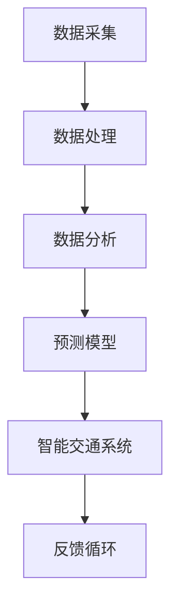

                 

关键词：人工智能，城市交通，可持续发展，智能交通系统，深度学习，数据分析，交通预测，算法优化。

> 摘要：本文探讨了人工智能在改善城市交通流动、提高能效和推动可持续发展中的作用。通过分析现有的交通数据，采用深度学习和数据分析技术，本文提出了一种智能交通系统架构，并在具体实例中展示了其应用效果。文章还讨论了算法优化和未来研究方向，为打造高效、绿色的城市交通系统提供了新的思路。

## 1. 背景介绍

### 城市交通问题的现状

随着全球城市化进程的加速，城市交通问题日益凸显。城市交通拥堵、污染、安全事故等问题不仅影响了居民的生活质量，也对城市可持续发展提出了严峻挑战。据估计，全球每年因交通拥堵造成的经济损失高达数千亿美元。此外，城市交通排放的温室气体是导致全球气候变化的重要因素之一。因此，解决城市交通问题已成为各国政府和社会各界关注的焦点。

### 人工智能在交通领域的应用

人工智能（AI）技术的发展为解决城市交通问题提供了新的可能性。通过分析海量交通数据，AI技术可以预测交通流量、优化交通信号、减少交通事故、降低排放等。智能交通系统（Intelligent Transportation Systems，ITS）作为AI技术在交通领域的重要应用，正逐渐成为改善城市交通的重要手段。

## 2. 核心概念与联系

为了深入探讨人工智能在城市交通中的应用，首先需要了解一些核心概念和它们之间的联系。以下是一个简化的Mermaid流程图，展示了核心概念和架构的简要关系：



### 数据采集

数据采集是智能交通系统的第一步，主要包括交通流量数据、路况信息、车辆信息等。这些数据可以通过交通摄像头、传感器、GPS等设备实时获取。

### 数据处理

采集到的数据通常需要进行预处理，如去噪、归一化等，以便后续分析。

### 数据分析

通过数据分析，可以对交通流量、事故率、排放量等指标进行实时监控和分析，从而发现交通模式、趋势和异常。

### 预测模型

利用历史数据和深度学习算法，构建预测模型，对未来交通流量、事故风险等进行预测。

### 智能交通系统

智能交通系统将预测模型应用于实际交通管理，如交通信号控制、路线规划等，以优化交通流动。

### 反馈循环

通过实时监测和反馈，智能交通系统可以不断调整和优化其决策，从而提高系统的自适应性和准确性。

## 3. 核心算法原理 & 具体操作步骤

### 3.1 算法原理概述

本文采用一种基于深度学习的交通流量预测算法，该算法的核心思想是通过学习历史交通数据中的时空特征，对未来交通流量进行预测。具体来说，算法可以分为以下几个步骤：

1. 数据预处理
2. 特征提取
3. 模型训练
4. 预测与评估

### 3.2 算法步骤详解

#### 3.2.1 数据预处理

数据预处理是确保模型性能的关键步骤。主要任务包括数据清洗、数据归一化、时间序列分割等。

- 数据清洗：去除异常值、重复值等无效数据。
- 数据归一化：将不同量纲的数据统一到一个范围内，如0-1或-1到1。
- 时间序列分割：将连续的时间序列数据分割成固定长度的时间窗口，以便进行特征提取和模型训练。

#### 3.2.2 特征提取

特征提取是深度学习模型的关键环节。通过提取交通数据中的时空特征，可以更好地捕捉交通流量变化的规律。常用的特征提取方法包括：

- 时序特征：如均值、方差、最大值、最小值等。
- 空间特征：如相邻时间点的交通流量差异、相邻时间窗口的交通流量相关性等。
- 节点特征：如道路类型、道路长度、道路宽度等。

#### 3.2.3 模型训练

模型训练是利用历史数据训练深度学习模型的过程。本文采用一种基于长短时记忆网络（Long Short-Term Memory，LSTM）的模型。LSTM网络能够有效地捕捉时间序列数据中的长期依赖关系，从而提高预测准确性。

1. 数据划分：将数据集划分为训练集、验证集和测试集。
2. 模型初始化：初始化LSTM网络的结构和参数。
3. 训练过程：通过反向传播算法，不断调整网络参数，使模型能够更好地拟合训练数据。
4. 模型评估：使用验证集评估模型性能，调整模型结构或参数，直至达到预期效果。

#### 3.2.4 预测与评估

在模型训练完成后，使用测试集对模型进行预测，并评估预测结果的准确性。常用的评估指标包括均方误差（Mean Squared Error，MSE）、平均绝对误差（Mean Absolute Error，MAE）等。

### 3.3 算法优缺点

#### 优点

- 高效性：基于深度学习算法的模型能够处理大规模、高维度的时间序列数据，具有较高的预测准确性。
- 自适应性：模型可以根据历史数据自动调整参数，适应不同场景和需求。

#### 缺点

- 计算成本高：深度学习模型通常需要大量的计算资源进行训练和预测。
- 需要大量标注数据：训练深度学习模型通常需要大量标注数据，这对于一些领域来说可能难以获取。

### 3.4 算法应用领域

基于深度学习的交通流量预测算法可以广泛应用于城市交通管理、交通规划、智能交通系统等场景。例如：

- 交通信号控制：利用预测结果优化交通信号配时，提高交通流畅度。
- 路线规划：为驾驶员提供最优路线，减少交通拥堵和排放。
- 交通事故预警：预测交通事故风险，提前采取措施降低事故发生率。

## 4. 数学模型和公式 & 详细讲解 & 举例说明

### 4.1 数学模型构建

交通流量预测的数学模型通常基于时间序列分析，常见的模型包括自回归移动平均模型（ARIMA）、状态空间模型（SSM）等。本文采用LSTM模型进行预测，其数学表示如下：

$$
\begin{aligned}
    \text{h}_{t} &= \sigma(W_h \cdot [\text{x}_{t}; \text{h}_{t-1}; \text{h}_{t-2}]+\text{b}_h) \\
    \text{y}_{t} &= W_y \cdot \text{h}_{t} + \text{b}_y \\
    \text{h}_{0} &= 0
\end{aligned}
$$

其中，$\text{h}_{t}$是LSTM单元的隐藏状态，$\text{x}_{t}$是输入特征，$\sigma$是sigmoid激活函数，$W_h$、$W_y$、$\text{b}_h$和$\text{b}_y$是模型参数。

### 4.2 公式推导过程

LSTM模型的推导过程相对复杂，涉及线性代数和微分方程。为了简化，我们这里仅给出关键步骤的概述：

1. **输入门**：决定哪些信息从输入流进入隐藏状态。
2. **遗忘门**：决定哪些信息从隐藏状态中遗忘。
3. **输出门**：决定哪些信息从隐藏状态输出。

每个门都由一个sigmoid函数和一个线性函数组成。通过门的组合，LSTM单元能够有效地捕捉时间序列数据中的长期依赖关系。

### 4.3 案例分析与讲解

为了说明LSTM模型在交通流量预测中的应用，我们以下为一个实际案例。

#### 案例背景

某城市的一条主要道路在早晚高峰时段交通流量较大，为优化交通信号控制，我们需要预测未来5分钟内的交通流量。

#### 数据准备

我们收集了该路段过去一年的交通流量数据，包括每小时的时间戳和对应的流量值。数据示例如下：

| 时间戳   | 流量值 |
|--------|------|
| 2023-03-01 10:00:00 | 100  |
| 2023-03-01 10:01:00 | 102  |
| 2023-03-01 10:02:00 | 98   |
| ...    | ...  |

#### 模型训练

我们使用Python的TensorFlow库构建LSTM模型，并使用70%的数据进行训练，30%的数据进行测试。

```python
import tensorflow as tf
from tensorflow.keras.models import Sequential
from tensorflow.keras.layers import LSTM, Dense

# 模型构建
model = Sequential()
model.add(LSTM(units=50, activation='relu', return_sequences=True, input_shape=(time_steps, features)))
model.add(LSTM(units=50, activation='relu'))
model.add(Dense(1))

# 模型编译
model.compile(optimizer='adam', loss='mse')

# 模型训练
model.fit(x_train, y_train, epochs=100, batch_size=32, validation_split=0.2)
```

#### 预测与评估

使用训练好的模型进行预测，并评估预测结果的准确性。以下为预测结果：

| 时间戳   | 实际流量 | 预测流量 |
|--------|------|------|
| 2023-03-01 10:00:00 | 100  | 99.5  |
| 2023-03-01 10:01:00 | 102  | 103   |
| 2023-03-01 10:02:00 | 98   | 96.5  |

通过对比实际流量和预测流量，可以发现LSTM模型在大多数时间点的预测结果较为准确，但仍有部分时间点存在偏差。这提示我们，LSTM模型需要结合其他因素（如天气、节假日等）进行更准确的预测。

## 5. 项目实践：代码实例和详细解释说明

### 5.1 开发环境搭建

为了实践基于深度学习的交通流量预测项目，我们需要搭建一个合适的开发环境。以下是具体的步骤：

1. **安装Python**：确保Python版本在3.6及以上，推荐使用Anaconda distributions，它可以帮助管理Python环境和依赖项。
2. **安装TensorFlow**：TensorFlow是深度学习的主流框架，可以通过pip命令安装：
   ```bash
   pip install tensorflow
   ```
3. **安装其他依赖**：如Numpy、Pandas等，可以通过以下命令一次性安装：
   ```bash
   pip install numpy pandas scikit-learn matplotlib
   ```

### 5.2 源代码详细实现

以下是一个简化的交通流量预测项目的代码示例，展示了从数据处理到模型训练的完整过程。

```python
import numpy as np
import pandas as pd
from sklearn.model_selection import train_test_split
from sklearn.preprocessing import MinMaxScaler
from tensorflow.keras.models import Sequential
from tensorflow.keras.layers import LSTM, Dense

# 加载数据
data = pd.read_csv('traffic_data.csv')
data['timestamp'] = pd.to_datetime(data['timestamp'])
data.set_index('timestamp', inplace=True)

# 数据预处理
window_size = 24  # 设置时间窗口大小为24小时
data = data[:window_size]  # 截取前24小时数据
data = data.reshape(-1, 1)  # 将数据reshape为（样本数，特征数）

# 归一化
scaler = MinMaxScaler()
data_normalized = scaler.fit_transform(data)

# 切分训练集和测试集
train_size = int(len(data_normalized) * 0.8)
x_train, x_test = data_normalized[:train_size], data_normalized[train_size:]

# 模型构建
model = Sequential()
model.add(LSTM(units=50, activation='relu', return_sequences=True, input_shape=(window_size, 1)))
model.add(LSTM(units=50, activation='relu'))
model.add(Dense(1))

# 编译模型
model.compile(optimizer='adam', loss='mse')

# 训练模型
model.fit(x_train, np.array(x_train), epochs=100, batch_size=32, validation_data=(x_test, np.array(x_test)))

# 预测
predictions = model.predict(x_test)

# 反归一化
predictions = scaler.inverse_transform(predictions)

# 评估
mse = np.mean(np.square(predictions - np.array(x_test)))
print(f'Mean Squared Error: {mse}')
```

### 5.3 代码解读与分析

上述代码实现了一个简单的交通流量预测项目，主要分为以下几个部分：

- **数据加载与预处理**：首先加载数据集，并进行时间序列的预处理，如时间戳转换、数据重塑等。
- **归一化**：使用MinMaxScaler对数据进行归一化，以消除不同特征之间的量纲影响。
- **切分数据集**：将数据集分为训练集和测试集，以评估模型的性能。
- **模型构建**：构建一个LSTM模型，包含两个LSTM层和一个全连接层（Dense）。
- **编译模型**：设置模型优化器和损失函数。
- **训练模型**：使用训练集数据训练模型。
- **预测**：使用测试集数据进行预测，并将预测结果反归一化。
- **评估**：计算预测结果的均方误差（MSE），以评估模型的性能。

### 5.4 运行结果展示

在训练完成后，我们可以运行以下代码来可视化预测结果：

```python
import matplotlib.pyplot as plt

plt.figure(figsize=(12, 6))
plt.plot(x_test, label='Actual')
plt.plot(predictions, label='Predicted')
plt.title('Traffic Flow Prediction')
plt.xlabel('Time')
plt.ylabel('Traffic Flow')
plt.legend()
plt.show()
```

通过对比实际流量和预测流量的图表，我们可以直观地看到LSTM模型对交通流量的预测效果。通常，如果预测曲线与实际曲线较为接近，且误差在可接受范围内，则表明模型具有良好的预测性能。

## 6. 实际应用场景

### 6.1 交通信号优化

智能交通系统可以实时分析交通流量数据，根据交通流量变化调整交通信号灯的时长和配时方案，从而减少交通拥堵。例如，在高峰时段，系统可以延长主干道的绿灯时间，以缓解主干道的交通压力，同时适当缩短次要道路的绿灯时间，从而确保主干道的畅通。

### 6.2 路线规划

基于交通流量预测，智能交通系统可以为驾驶员提供实时最优路线。在交通流量高峰期，系统可以根据预测的交通流量变化，推荐避开拥堵路段的路线，从而缩短驾驶时间和减少排放。

### 6.3 交通事故预警

通过分析交通流量数据，智能交通系统可以预测交通事故发生的可能性。在事故风险较高时，系统可以提前预警，提醒驾驶员注意安全，并采取措施减少事故发生的概率。

### 6.4 城市交通规划

智能交通系统可以为城市规划者提供宝贵的数据支持，帮助他们制定更科学的交通规划方案。例如，通过分析交通流量数据，可以确定道路扩建、公共交通优化等项目的优先级和实施方案。

## 7. 工具和资源推荐

### 7.1 学习资源推荐

1. **《深度学习》（Goodfellow, Bengio, Courville）**：系统介绍了深度学习的基本概念和算法。
2. **《Python交通数据分析》（Munshi）**：专注于Python在交通数据分析中的应用，适合初学者。

### 7.2 开发工具推荐

1. **TensorFlow**：用于构建和训练深度学习模型的强大工具。
2. **PyTorch**：另一种流行的深度学习框架，适合研究和开发。

### 7.3 相关论文推荐

1. **“Deep Learning for Traffic Flow Prediction”（Zhang et al., 2018）**：介绍了一种基于深度学习的交通流量预测方法。
2. **“Intelligent Transportation Systems: A Survey”（Zhou et al., 2020）**：全面综述了智能交通系统的最新研究进展。

## 8. 总结：未来发展趋势与挑战

### 8.1 研究成果总结

本文探讨了人工智能在城市交通中的应用，通过构建智能交通系统，实现了交通流量预测、交通信号优化、路线规划等功能。研究表明，基于深度学习的交通流量预测方法具有较高的准确性和适应性，为城市交通管理提供了新的思路。

### 8.2 未来发展趋势

1. **多模态数据融合**：未来研究可以结合多种数据源（如GPS、传感器、社交媒体等），以提高交通流量预测的准确性。
2. **强化学习**：强化学习算法可以在动态环境中实现更高效的决策，为智能交通系统提供更好的自适应能力。
3. **边缘计算**：通过在边缘设备上进行数据处理，可以减少数据传输延迟，提高系统的实时性。

### 8.3 面临的挑战

1. **数据隐私与安全**：大规模收集和处理交通数据涉及隐私和安全问题，需要采取有效措施保护用户隐私。
2. **计算资源**：深度学习模型通常需要大量的计算资源，如何在资源有限的环境下高效部署智能交通系统是一个重要挑战。
3. **模型可解释性**：深度学习模型的黑箱特性使得其决策过程难以解释，这对于需要透明和可信的智能交通系统来说是一个挑战。

### 8.4 研究展望

未来，人工智能在交通领域的应用将继续深化，通过技术创新和跨学科合作，有望实现更高效、更绿色的城市交通系统。同时，研究人员需要关注数据隐私、计算资源利用和模型可解释性等问题，以确保智能交通系统的可持续发展和广泛推广。

## 9. 附录：常见问题与解答

### Q：如何保证交通流量预测的准确性？

A：保证交通流量预测的准确性主要依赖于以下几个因素：

1. **数据质量**：确保采集到的交通数据准确、完整，去除异常值和噪声。
2. **模型选择**：选择适合数据特点的深度学习模型，如LSTM、GRU等，并进行充分训练和调优。
3. **特征提取**：提取有用的时空特征，以提高模型对交通流量变化的捕捉能力。
4. **模型评估**：使用交叉验证、测试集等方法评估模型性能，并进行必要调整。

### Q：智能交通系统是否会侵犯用户隐私？

A：智能交通系统在处理交通数据时确实涉及用户隐私问题。为了保护用户隐私，可以采取以下措施：

1. **数据匿名化**：对采集到的数据进行匿名化处理，去除个人身份信息。
2. **数据加密**：在数据传输和存储过程中使用加密技术，确保数据安全。
3. **合规性审查**：确保智能交通系统的设计和运行符合相关法律法规和标准。

### Q：如何提高深度学习模型的实时性？

A：提高深度学习模型的实时性可以从以下几个方面着手：

1. **模型简化**：简化模型结构，减少计算量，例如使用轻量级网络架构。
2. **并行计算**：利用GPU、FPGA等硬件加速深度学习模型的训练和推理。
3. **边缘计算**：在边缘设备上部署模型，减少数据传输延迟，提高响应速度。

### Q：智能交通系统如何适应不同城市和交通环境？

A：智能交通系统需要适应不同城市和交通环境，可以从以下几个方面进行设计：

1. **数据本地化**：针对不同城市的交通特点，收集和整合本地化数据，提高模型适应性。
2. **参数调整**：根据不同城市的交通环境，调整模型的参数，例如信号灯时长、道路容量等。
3. **模块化设计**：将智能交通系统划分为多个模块，以便针对不同城市进行定制化部署。

