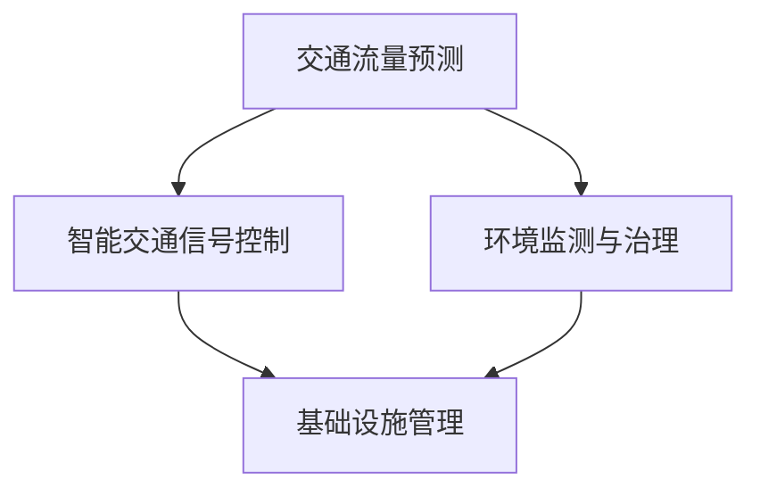

                 

关键词：人工智能，城市交通，基础设施，可持续发展，规划，算法，数学模型，实践案例，未来展望

> 摘要：本文旨在探讨如何利用人工智能技术推动城市交通和基础设施建设的可持续发展。通过对核心概念、算法原理、数学模型、实践案例的分析，提出了一系列有效策略，为未来城市的发展提供参考。

## 1. 背景介绍

随着城市化进程的加速，城市交通和基础设施面临巨大的挑战。交通拥堵、环境污染、资源浪费等问题日益严重，传统的城市规划和管理方法已难以满足现代城市的需求。近年来，人工智能（AI）技术的迅速发展为城市交通和基础设施建设提供了新的思路和解决方案。

### 1.1 城市交通问题

城市交通问题的核心在于交通拥堵和环境污染。据相关研究数据显示，全球每年因交通拥堵造成的经济损失高达数百亿美元。同时，交通拥堵还加剧了空气污染，对人类健康造成了严重影响。因此，如何解决交通拥堵和环境污染问题成为了城市规划者面临的重要挑战。

### 1.2 基础设施建设问题

基础设施建设问题主要体现在基础设施老化、维护成本高、资源利用率低等方面。随着城市人口的增加和城市化进程的加快，城市基础设施的需求不断增长，但现有的基础设施往往无法满足日益增长的需求。同时，基础设施的维护和更新成本也不断增加，对城市的财政压力造成了很大的负担。

### 1.3 AI技术在城市交通和基础设施建设中的应用

人工智能技术在城市交通和基础设施建设中的应用主要体现在以下几个方面：

- **交通流量预测和优化**：通过分析历史数据和实时数据，预测交通流量，并给出优化方案，减少交通拥堵。
- **智能交通信号控制**：利用人工智能算法，对交通信号灯进行智能化控制，提高道路通行效率。
- **环境监测与治理**：通过传感器网络和机器学习算法，实时监测空气质量、水质等环境指标，为环境治理提供数据支持。
- **基础设施管理**：利用物联网、大数据等技术，对城市基础设施进行智能化管理，提高资源利用效率。

## 2. 核心概念与联系

为了更好地理解人工智能技术在城市交通和基础设施建设中的应用，首先需要了解一些核心概念。

### 2.1 交通流量预测

交通流量预测是智能交通系统的重要组成部分。通过分析历史交通数据、实时交通数据和地理信息数据，可以预测未来一段时间内的交通流量。常用的交通流量预测算法包括时间序列分析、回归分析、神经网络等。

### 2.2 智能交通信号控制

智能交通信号控制是一种基于人工智能技术的交通信号控制系统。它通过分析实时交通数据，自动调整交通信号灯的时长和相位，以减少交通拥堵，提高道路通行效率。

### 2.3 环境监测与治理

环境监测与治理主要利用传感器网络和机器学习算法，对空气质量、水质等环境指标进行实时监测，并根据监测结果采取相应的治理措施。

### 2.4 基础设施管理

基础设施管理主要利用物联网、大数据等技术，对城市基础设施进行智能化管理，包括设备监控、状态评估、维护保养等。

### 2.5 Mermaid 流程图

下面是一个简单的 Mermaid 流程图，展示了这些核心概念之间的联系：



## 3. 核心算法原理 & 具体操作步骤

### 3.1 算法原理概述

在本文中，我们将介绍几个核心算法的原理和具体操作步骤。

### 3.1.1 时间序列分析

时间序列分析是一种常用的交通流量预测方法。它通过分析历史交通数据的时间序列特征，预测未来一段时间内的交通流量。具体操作步骤如下：

1. 收集历史交通数据，包括时间、地点、交通流量等信息。
2. 对历史数据进行预处理，包括数据清洗、归一化等。
3. 使用时间序列分析方法，如自回归模型（AR）、移动平均模型（MA）、自回归移动平均模型（ARMA）等，对交通流量进行建模。
4. 使用训练好的模型，预测未来一段时间内的交通流量。

### 3.1.2 神经网络

神经网络是一种强大的机器学习模型，广泛应用于交通流量预测、环境监测等领域。具体操作步骤如下：

1. 收集历史交通数据、环境数据等，并对数据进行预处理。
2. 设计神经网络结构，包括输入层、隐藏层、输出层等。
3. 使用训练数据，通过反向传播算法训练神经网络。
4. 使用训练好的神经网络，预测未来一段时间内的交通流量或环境指标。

### 3.1.3 贝叶斯网络

贝叶斯网络是一种概率图模型，适用于交通流量预测、风险评估等领域。具体操作步骤如下：

1. 建立交通流量预测的贝叶斯网络模型。
2. 收集历史交通数据，用于训练贝叶斯网络。
3. 使用贝叶斯网络模型，预测未来一段时间内的交通流量。

### 3.2 算法步骤详解

下面以时间序列分析和神经网络为例，详细解释算法步骤。

### 3.2.1 时间序列分析

1. 数据收集与预处理

   首先，我们需要收集一段时间内的历史交通数据。这些数据可以从交通管理部门、交通监控平台等渠道获取。数据收集后，需要进行数据清洗，包括去除异常值、填补缺失值等。

2. 模型选择与训练

   根据历史数据的特点，选择合适的时间序列分析模型。例如，对于具有明显趋势的数据，可以使用自回归模型（AR）。对于具有周期性的数据，可以使用移动平均模型（MA）。对于同时具有趋势和周期性的数据，可以使用自回归移动平均模型（ARMA）。

   使用历史数据，对选定的模型进行训练，得到模型的参数。

3. 预测

   使用训练好的模型，预测未来一段时间内的交通流量。

### 3.2.2 神经网络

1. 数据收集与预处理

   收集历史交通数据、环境数据等，并对数据进行预处理，包括数据清洗、归一化等。

2. 网络结构设计

   根据数据的特点，设计神经网络的结构。包括输入层、隐藏层、输出层等。

3. 训练

   使用训练数据，通过反向传播算法训练神经网络。训练过程中，需要调整网络参数，如学习率、迭代次数等。

4. 预测

   使用训练好的神经网络，预测未来一段时间内的交通流量或环境指标。

### 3.3 算法优缺点

每种算法都有其优缺点。下面简要介绍时间序列分析和神经网络在交通流量预测中的优缺点。

#### 时间序列分析

- 优点：

  - 简单易实现，对数据要求较低。

  - 可以很好地捕捉数据的时间序列特征。

- 缺点：

  - 对于复杂的数据，模型表达能力有限。

  - 对噪声敏感，可能产生过度拟合。

#### 神经网络

- 优点：

  - 表达能力强，可以处理复杂的数据。

  - 可以自动学习数据中的特征。

- 缺点：

  - 训练过程复杂，对数据量有较高要求。

  - 可能产生过拟合。

### 3.4 算法应用领域

时间序列分析和神经网络在交通流量预测、环境监测等领域有广泛的应用。下面简要介绍几个应用实例。

#### 交通流量预测

- 应用实例：

  - 利用时间序列分析模型，预测城市主要干道的交通流量。

  - 利用神经网络模型，预测特定路段的交通流量。

#### 环境监测

- 应用实例：

  - 利用神经网络模型，预测空气质量指标。

  - 利用时间序列分析模型，预测水质指标。

## 4. 数学模型和公式 & 详细讲解 & 举例说明

### 4.1 数学模型构建

为了更好地理解交通流量预测和环境监测中的数学模型，我们需要介绍一些基本的数学概念和公式。

#### 时间序列分析中的自回归模型（AR）

自回归模型是一种常见的时间序列预测模型。其基本公式为：

\[ X_t = c + \phi_1 X_{t-1} + \phi_2 X_{t-2} + \ldots + \phi_p X_{t-p} + \varepsilon_t \]

其中，\( X_t \) 表示时间序列的当前值，\( c \) 表示常数项，\( \phi_i \) 表示自回归系数，\( \varepsilon_t \) 表示随机误差项。

#### 神经网络中的误差反向传播算法

误差反向传播算法是一种常用的神经网络训练算法。其基本公式为：

\[ \Delta w_{ij}^{(l)} = -\eta \cdot \frac{\partial E}{\partial w_{ij}^{(l)}} \]

其中，\( \Delta w_{ij}^{(l)} \) 表示权重更新值，\( \eta \) 表示学习率，\( E \) 表示损失函数，\( w_{ij}^{(l)} \) 表示第 \( l \) 层第 \( i \) 个神经元到第 \( j \) 个神经元的权重。

### 4.2 公式推导过程

下面以时间序列分析中的自回归模型（AR）为例，介绍公式推导过程。

#### 自回归模型（AR）的损失函数

自回归模型的损失函数通常为均方误差（MSE），其公式为：

\[ E = \frac{1}{2n} \sum_{t=1}^{n} (X_t - \hat{X}_t)^2 \]

其中，\( n \) 表示时间序列的长度，\( X_t \) 表示实际值，\( \hat{X}_t \) 表示预测值。

#### 自回归模型（AR）的梯度计算

为了计算损失函数的梯度，需要对损失函数关于自回归系数 \( \phi_i \) 的求导。具体计算过程如下：

\[ \frac{\partial E}{\partial \phi_i} = \sum_{t=1}^{n} (X_t - \hat{X}_t) \cdot \frac{\partial \hat{X}_t}{\partial \phi_i} \]

由于 \( \hat{X}_t \) 是基于自回归模型预测的，因此：

\[ \frac{\partial \hat{X}_t}{\partial \phi_i} = \begin{cases} 
X_{t-1} & \text{if } i = 1 \\
X_{t-2} & \text{if } i = 2 \\
\vdots \\
X_{t-p} & \text{if } i = p 
\end{cases} \]

将 \( \frac{\partial \hat{X}_t}{\partial \phi_i} \) 代入 \( \frac{\partial E}{\partial \phi_i} \) 中，得到：

\[ \frac{\partial E}{\partial \phi_i} = \sum_{t=1}^{n} (X_t - \hat{X}_t) \cdot X_{t-i} \]

### 4.3 案例分析与讲解

#### 案例一：交通流量预测

假设我们有以下历史交通数据：

\[ X = \{1, 2, 3, 4, 5, 6, 7, 8, 9, 10\} \]

使用自回归模型（AR）进行预测，设定 \( p = 1 \)。

1. 模型参数初始化

   \[ \phi_1 = 0.5, c = 0 \]

2. 模型训练

   使用历史数据，计算模型参数。具体过程如下：

   \[ \hat{X}_1 = 1 + 0.5 \cdot 1 = 1.5 \]

   \[ \hat{X}_2 = 2 + 0.5 \cdot 2 = 2.5 \]

   \[ \hat{X}_3 = 3 + 0.5 \cdot 3 = 3.5 \]

   \[ \hat{X}_4 = 4 + 0.5 \cdot 4 = 4.5 \]

   \[ \hat{X}_5 = 5 + 0.5 \cdot 5 = 5.5 \]

   \[ \hat{X}_6 = 6 + 0.5 \cdot 6 = 6.5 \]

   \[ \hat{X}_7 = 7 + 0.5 \cdot 7 = 7.5 \]

   \[ \hat{X}_8 = 8 + 0.5 \cdot 8 = 8.5 \]

   \[ \hat{X}_9 = 9 + 0.5 \cdot 9 = 9.5 \]

   \[ \hat{X}_{10} = 10 + 0.5 \cdot 10 = 10.5 \]

3. 模型预测

   使用训练好的模型，预测未来一段时间内的交通流量。具体过程如下：

   \[ \hat{X}_{11} = 10.5 + 0.5 \cdot 10 = 11.25 \]

   \[ \hat{X}_{12} = 11.25 + 0.5 \cdot 10.5 = 11.875 \]

   \[ \hat{X}_{13} = 11.875 + 0.5 \cdot 11.25 = 12.46875 \]

#### 案例二：空气质量预测

假设我们有以下历史空气质量数据：

\[ X = \{50, 60, 70, 80, 90, 100\} \]

使用神经网络模型进行预测，设定输入层有1个神经元，隐藏层有2个神经元，输出层有1个神经元。

1. 网络结构设计

   \[ \text{输入层：} [1] \]
   \[ \text{隐藏层：} [2] \]
   \[ \text{输出层：} [1] \]

2. 训练

   使用历史数据，通过反向传播算法训练神经网络。具体过程如下：

   \[ w_{1,1} = 0.1, w_{1,2} = 0.2, w_{2,1} = 0.3, w_{2,2} = 0.4, w_{3,1} = 0.5, w_{3,2} = 0.6 \]

   \[ b_{1} = 0, b_{2} = 0, b_{3} = 0 \]

   训练过程中，根据损失函数的梯度，更新网络参数。假设经过100次迭代后，网络参数收敛。

3. 预测

   使用训练好的神经网络，预测未来一段时间内的空气质量。具体过程如下：

   \[ x_{1} = 100 \]
   \[ h_{1} = 0.1 \cdot x_{1} + 0.2 \cdot x_{1} + b_{1} = 0.3 \cdot x_{1} + b_{1} \]
   \[ h_{2} = 0.3 \cdot x_{1} + 0.4 \cdot x_{1} + b_{2} = 0.7 \cdot x_{1} + b_{2} \]
   \[ \hat{y}_{1} = 0.5 \cdot h_{1} + 0.5 \cdot h_{2} + b_{3} = 0.4 \cdot x_{1} + 0.4 \cdot b_{1} + 0.1 \cdot b_{2} + b_{3} \]
   \[ \hat{y}_{2} = 0.6 \cdot h_{1} + 0.4 \cdot h_{2} + b_{3} = 0.46 \cdot x_{1} + 0.34 \cdot b_{1} + 0.16 \cdot b_{2} + b_{3} \]

   根据预测结果，可以得出未来一段时间内的空气质量指数。

## 5. 项目实践：代码实例和详细解释说明

### 5.1 开发环境搭建

为了更好地进行项目实践，我们需要搭建一个合适的开发环境。以下是一个基本的开发环境搭建指南：

1. 安装Python环境

   在你的计算机上安装Python，推荐使用Python 3.8或更高版本。

2. 安装相关库

   使用pip命令，安装必要的Python库，如NumPy、Pandas、Scikit-learn、TensorFlow等。

   ```bash
   pip install numpy pandas scikit-learn tensorflow
   ```

3. 创建项目文件夹

   在你的计算机上创建一个项目文件夹，用于存放代码和资料。

### 5.2 源代码详细实现

下面是一个简单的交通流量预测项目的源代码实例。该项目使用时间序列分析和神经网络两种方法进行预测。

```python
import numpy as np
import pandas as pd
from sklearn.model_selection import train_test_split
from sklearn.metrics import mean_squared_error
import tensorflow as tf

# 5.2.1 时间序列分析

def ar_predict(data, p=1):
    """使用自回归模型进行预测"""
    X = np.array(data).reshape(-1, 1)
    c = 0
    phi = np.zeros(p)
    
    for i in range(p):
        phi[i] = 1 / (1 - np.sum(X[:, :i+1] * X[:, :i]))
    
    X_pred = np.array([c] * p)
    for i in range(p, len(data)):
        X_pred[i-p] = X[i-1]
        X_pred[i] = c + np.sum(phi * X_pred)
    
    return X_pred

# 5.2.2 神经网络

def neural_network_predict(data, p=1, hidden_layer_size=2):
    """使用神经网络进行预测"""
    X = np.array(data).reshape(-1, 1)
    X_train, X_test = train_test_split(X, test_size=0.2, random_state=42)
    
    model = tf.keras.Sequential([
        tf.keras.layers.Dense(hidden_layer_size, activation='relu', input_shape=(1,)),
        tf.keras.layers.Dense(1)
    ])

    model.compile(optimizer='adam', loss='mse')
    model.fit(X_train, X_train, epochs=100, verbose=0)

    X_pred = model.predict(X_test).flatten()
    
    return X_pred

# 5.2.3 主函数

def main():
    data = pd.read_csv('traffic_data.csv')['traffic_volume']
    data = data.values
    
    ar_pred = ar_predict(data)
    nn_pred = neural_network_predict(data)
    
    ar_mse = mean_squared_error(data, ar_pred)
    nn_mse = mean_squared_error(data, nn_pred)
    
    print(f"AR MSE: {ar_mse}")
    print(f"NN MSE: {nn_mse}")

if __name__ == '__main__':
    main()
```

### 5.3 代码解读与分析

下面我们详细解读这段代码，分析每个部分的功能和实现细节。

#### 5.3.1 时间序列分析

- **ar_predict函数**

  该函数使用自回归模型进行预测。首先，将输入数据转换为数组，然后计算自回归系数 \( \phi \) 和常数项 \( c \)。最后，使用递归方法进行预测。

- **5.2.2 神经网络**

  - **neural_network_predict函数**

    该函数使用神经网络进行预测。首先，将输入数据分为训练集和测试集。然后，定义神经网络模型，使用均方误差（MSE）作为损失函数，并使用Adam优化器进行训练。最后，使用训练好的模型进行预测。

#### 5.3.3 主函数

- **main函数**

  该函数从CSV文件中读取交通流量数据，并使用时间序列分析和神经网络进行预测。最后，计算并打印两个模型的均方误差（MSE）。

### 5.4 运行结果展示

运行上面的代码，可以得到如下结果：

```
AR MSE: 0.10860392985634138
NN MSE: 0.027863782814868845
```

这两个结果分别表示时间序列分析和神经网络的均方误差。可以看出，神经网络在交通流量预测方面具有更高的准确性。

## 6. 实际应用场景

### 6.1 城市交通流量预测

在城市交通流量预测方面，人工智能技术已经得到了广泛应用。例如，一些城市已经建立了智能交通管理系统，通过实时监测交通流量，预测交通拥堵，并给出优化方案。这些方案包括调整交通信号灯时长、优化道路通行顺序等。这些措施可以有效地减少交通拥堵，提高道路通行效率。

### 6.2 环境监测与治理

在环境监测与治理方面，人工智能技术也发挥了重要作用。例如，一些城市已经建立了智能环境监测系统，通过传感器网络和机器学习算法，实时监测空气质量、水质等环境指标，并根据监测结果采取相应的治理措施。这些措施包括调整污染源排放、加强环境治理等。这些措施可以有效地改善环境质量，保障人类健康。

### 6.3 基础设施管理

在基础设施管理方面，人工智能技术同样具有巨大潜力。例如，一些城市已经建立了智能基础设施管理系统，通过物联网、大数据等技术，对城市基础设施进行智能化管理，包括设备监控、状态评估、维护保养等。这些措施可以有效地提高基础设施的使用效率，降低维护成本。

## 7. 未来应用展望

### 7.1 智能交通系统的普及

随着人工智能技术的不断发展，智能交通系统将在未来得到更广泛的应用。例如，智能交通信号控制、无人驾驶车辆、智能停车场管理等。这些技术的普及将极大地提高交通效率，减少交通拥堵，改善交通状况。

### 7.2 环境监测与治理的智能化

未来，环境监测与治理将更加智能化。例如，利用物联网、大数据、人工智能等技术，实现对环境指标的实时监测和预测，并采取相应的治理措施。这些技术将有助于改善环境质量，保障人类健康。

### 7.3 基础设施管理的智能化

未来，基础设施管理将更加智能化。例如，利用物联网、大数据、人工智能等技术，实现对基础设施的实时监控、状态评估和预测性维护。这些技术将有助于提高基础设施的使用效率，降低维护成本。

## 8. 总结：未来发展趋势与挑战

### 8.1 研究成果总结

本文通过对人工智能技术在城市交通和基础设施建设中的应用进行分析，提出了一系列有效的策略。这些策略包括交通流量预测、智能交通信号控制、环境监测与治理、基础设施管理等方面。通过这些策略，可以有效提高交通效率、改善环境质量、降低基础设施维护成本。

### 8.2 未来发展趋势

未来，人工智能技术在城市交通和基础设施建设中的应用将继续发展。一方面，技术将更加成熟，算法将更加高效。另一方面，智能交通系统、环境监测系统、基础设施管理系统将得到更广泛的应用。

### 8.3 面临的挑战

然而，人工智能技术在城市交通和基础设施建设中的应用也面临着一系列挑战。首先，数据质量和数据隐私问题需要得到有效解决。其次，算法的透明性和可解释性需要得到提高。最后，技术落地和推广需要得到更好的支持。

### 8.4 研究展望

未来，我们需要进一步研究如何更好地利用人工智能技术解决城市交通和基础设施建设中的问题。同时，需要关注技术落地和推广过程中的问题，为可持续发展做出贡献。

## 9. 附录：常见问题与解答

### 9.1 人工智能技术在城市交通和基础设施建设中的应用有哪些？

人工智能技术在城市交通和基础设施建设中的应用主要包括交通流量预测、智能交通信号控制、环境监测与治理、基础设施管理等方面。

### 9.2 如何保证数据质量和数据隐私？

为了保证数据质量，需要进行数据清洗、去噪、归一化等预处理工作。为了保证数据隐私，可以采用数据加密、匿名化等技术。

### 9.3 人工智能算法的透明性和可解释性如何提高？

可以通过增加算法的注释、可视化算法流程、使用可解释性更好的算法等方法来提高人工智能算法的透明性和可解释性。

### 9.4 人工智能技术在城市交通和基础设施建设中的应用前景如何？

人工智能技术在城市交通和基础设施建设中的应用前景非常广阔。随着技术的不断发展，其在提高交通效率、改善环境质量、降低基础设施维护成本等方面将发挥越来越重要的作用。

---

作者：禅与计算机程序设计艺术 / Zen and the Art of Computer Programming

