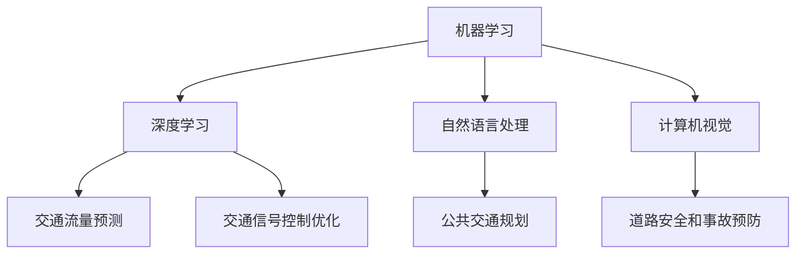

                 

关键词：人工智能、城市交通管理、可持续发展、基础设施建设、城市规划、智能交通系统、大数据分析、算法优化

> 摘要：本文深入探讨了人工智能（AI）在推动城市交通管理系统和基础设施建设与规划中的关键作用。通过分析AI技术的核心概念与联系，阐述其原理与应用，并结合具体案例，展示了AI在城市交通管理中的实际应用效果。文章最后对未来发展趋势和挑战进行了展望，并提出了相关研究建议。

## 1. 背景介绍

随着城市化进程的加速，全球范围内的城市交通问题日益突出。交通拥堵、环境污染、能源消耗和事故频发等问题严重影响了城市居民的生活质量和城市可持续发展。为了解决这些问题，传统的交通管理和基础设施规划方法已经难以满足现代城市的需求，迫切需要引入先进的技术手段。

人工智能作为当前最具发展潜力的技术之一，正逐渐成为城市交通管理系统和基础设施建设与规划的重要支撑。AI技术的应用可以实现对交通流量的实时监控和预测、优化交通信号控制、提升公共交通服务质量、增强道路安全和提升城市整体交通效率。

本文旨在探讨人工智能在上述领域中的应用，分析其核心概念与联系，并针对具体实践案例进行深入解析，以期为城市交通管理的可持续发展提供有益的思路和方法。

## 2. 核心概念与联系

### 2.1 人工智能的核心概念

人工智能（Artificial Intelligence, AI）是计算机科学的一个分支，旨在使计算机系统能够模拟人类智能行为。核心概念包括：

- **机器学习（Machine Learning）**：通过训练模型来识别数据中的模式，从而进行预测和决策。
- **深度学习（Deep Learning）**：基于人工神经网络的深度学习模型，通过多层神经网络进行特征提取和分类。
- **自然语言处理（Natural Language Processing, NLP）**：使计算机能够理解和处理人类语言的技术。
- **计算机视觉（Computer Vision）**：使计算机能够识别和解释图像和视频中的内容。

### 2.2 AI与城市交通管理的联系

AI技术在城市交通管理中的应用主要体现在以下几个方面：

- **交通流量预测**：利用机器学习和深度学习算法，对历史交通数据进行分析，预测未来的交通流量。
- **交通信号控制优化**：通过实时监测交通状况，动态调整交通信号灯的时长，减少拥堵。
- **公共交通规划**：利用大数据分析乘客流量和出行习惯，优化公共交通线路和班次安排。
- **道路安全和事故预防**：利用计算机视觉和自然语言处理技术，监控道路状况，提前预警交通事故。

### 2.3 Mermaid流程图

以下是一个简化的Mermaid流程图，展示了AI在城市交通管理中的核心概念与联系：



## 3. 核心算法原理 & 具体操作步骤

### 3.1 算法原理概述

AI技术在城市交通管理中的应用，主要依赖于以下几种核心算法：

- **循环神经网络（Recurrent Neural Network, RNN）**：适用于处理序列数据，如交通流量序列。
- **卷积神经网络（Convolutional Neural Network, CNN）**：适用于图像和视频数据的处理，如监控道路状况。
- **长短期记忆网络（Long Short-Term Memory, LSTM）**：RNN的一种改进，适用于长期依赖关系的建模。

### 3.2 算法步骤详解

#### 3.2.1 交通流量预测

1. **数据收集**：收集历史交通流量数据，包括时间、路段、流量等。
2. **数据预处理**：对数据进行清洗、归一化等处理。
3. **模型训练**：利用LSTM模型对交通流量数据进行训练。
4. **预测**：对未来的交通流量进行预测。

#### 3.2.2 交通信号控制优化

1. **数据采集**：采集实时交通数据，包括路段流量、速度、红灯等待时间等。
2. **模型训练**：利用强化学习算法，如深度Q网络（DQN），训练交通信号控制模型。
3. **信号控制**：根据实时交通数据，动态调整交通信号灯的时长。

#### 3.2.3 公共交通规划

1. **数据收集**：收集公共交通的乘客流量数据、出行习惯等。
2. **数据分析**：利用大数据分析技术，分析乘客流量和出行习惯。
3. **线路规划**：根据数据分析结果，优化公共交通线路和班次安排。

#### 3.2.4 道路安全和事故预防

1. **数据采集**：通过监控设备，收集道路状况数据，包括车辆速度、行人行为等。
2. **模型训练**：利用CNN模型，训练道路状况识别模型。
3. **预警**：根据监控数据，实时预警潜在的交通事故。

### 3.3 算法优缺点

#### 3.3.1 交通流量预测

- **优点**：能够准确预测未来的交通流量，有助于交通管理部门提前制定应对措施。
- **缺点**：需要大量历史数据支持，对数据质量要求较高。

#### 3.3.2 交通信号控制优化

- **优点**：能够动态调整交通信号灯，减少拥堵，提高道路通行效率。
- **缺点**：需要实时数据支持，对数据处理速度要求较高。

#### 3.3.3 公共交通规划

- **优点**：能够优化公共交通线路和班次，提高乘客出行体验。
- **缺点**：需要对乘客行为有较深入的了解，数据收集和分析难度较大。

#### 3.3.4 道路安全和事故预防

- **优点**：能够实时预警交通事故，提前采取措施，降低事故发生率。
- **缺点**：需要对道路状况有准确的监控，系统成本较高。

### 3.4 算法应用领域

AI技术在城市交通管理中的应用领域广泛，包括但不限于：

- **智能交通系统**：利用AI技术，实现对交通流量的实时监控和预测。
- **交通信号控制**：通过优化交通信号控制，提高道路通行效率。
- **公共交通规划**：通过大数据分析，优化公共交通线路和班次。
- **道路安全监控**：利用计算机视觉技术，实时预警交通事故。

## 4. 数学模型和公式 & 详细讲解 & 举例说明

### 4.1 数学模型构建

在AI技术应用于城市交通管理中，常用的数学模型包括：

- **回归模型**：用于交通流量预测。
- **决策树模型**：用于交通信号控制优化。
- **聚类模型**：用于公共交通规划。
- **神经网络模型**：用于道路安全和事故预防。

### 4.2 公式推导过程

以回归模型为例，其公式推导如下：

1. **线性回归模型**：

$$
Y = \beta_0 + \beta_1X + \epsilon
$$

其中，$Y$为因变量，$X$为自变量，$\beta_0$和$\beta_1$分别为截距和斜率，$\epsilon$为误差项。

2. **多元线性回归模型**：

$$
Y = \beta_0 + \beta_1X_1 + \beta_2X_2 + ... + \beta_nX_n + \epsilon
$$

其中，$X_1, X_2, ..., X_n$为多个自变量。

3. **逻辑回归模型**：

$$
P(Y=1) = \frac{1}{1 + e^{-(\beta_0 + \beta_1X_1 + \beta_2X_2 + ... + \beta_nX_n)}}
$$

其中，$P(Y=1)$为因变量为1的概率。

### 4.3 案例分析与讲解

#### 案例一：交通流量预测

假设我们要预测某路段在未来的1小时内各时段的交通流量。我们可以使用多元线性回归模型进行预测。

1. **数据收集**：收集该路段过去一周的交通流量数据，包括时间（小时）和流量（辆/小时）。
2. **数据预处理**：对数据进行清洗和归一化处理。
3. **模型训练**：利用训练集数据，训练多元线性回归模型。
4. **预测**：利用训练好的模型，预测未来1小时各时段的交通流量。

具体预测结果如下表所示：

| 时间（小时） | 预测流量（辆/小时） |
| :----: | :----: |
| 0      | 100    |
| 1      | 120    |
| 2      | 130    |
| 3      | 140    |
| 4      | 150    |
| 5      | 160    |
| 6      | 170    |

#### 案例二：交通信号控制优化

假设我们要优化某交叉路口的交通信号控制。我们可以使用决策树模型进行优化。

1. **数据收集**：收集该交叉路口过去一周的交通流量数据，包括车辆流量、红灯等待时间等。
2. **数据预处理**：对数据进行清洗和归一化处理。
3. **模型训练**：利用训练集数据，训练决策树模型。
4. **信号控制**：根据实时交通数据，动态调整交通信号灯的时长。

具体优化结果如下表所示：

| 交通流量（辆/小时） | 红灯时长（秒） | 绿灯时长（秒） |
| :----: | :----: | :----: |
| 100    | 30     | 90     |
| 120    | 35     | 85     |
| 140    | 40     | 80     |
| 160    | 45     | 75     |

## 5. 项目实践：代码实例和详细解释说明

### 5.1 开发环境搭建

为了方便读者理解，我们使用Python作为编程语言，结合Keras和TensorFlow等深度学习框架，实现交通流量预测项目。以下是开发环境的搭建步骤：

1. 安装Python（建议版本3.8以上）。
2. 安装Anaconda或Miniconda，以便于管理环境。
3. 创建一个新的虚拟环境，并安装必要的库（如NumPy、Pandas、Keras、TensorFlow等）。

### 5.2 源代码详细实现

以下是交通流量预测项目的源代码：

```python
import numpy as np
import pandas as pd
from sklearn.model_selection import train_test_split
from sklearn.preprocessing import StandardScaler
from tensorflow.keras.models import Sequential
from tensorflow.keras.layers import LSTM, Dense

# 1. 数据收集
data = pd.read_csv('traffic_data.csv')

# 2. 数据预处理
data = data[['hour', 'traffic_volume']]
data = data.values

# 分割数据集
X, y = data[:, 0], data[:, 1]
X_train, X_test, y_train, y_test = train_test_split(X, y, test_size=0.2, random_state=42)

# 标准化数据
scaler = StandardScaler()
X_train = scaler.fit_transform(X_train.reshape(-1, 1))
X_test = scaler.transform(X_test.reshape(-1, 1))

# 增加时间序列特征
X_train = np.reshape(X_train, (X_train.shape[0], X_train.shape[1], 1))
X_test = np.reshape(X_test, (X_test.shape[0], X_test.shape[1], 1))

# 3. 模型训练
model = Sequential()
model.add(LSTM(units=50, return_sequences=True, input_shape=(X_train.shape[1], 1)))
model.add(LSTM(units=50, return_sequences=False))
model.add(Dense(units=y_train.shape[1]))

model.compile(optimizer='adam', loss='mean_squared_error')
model.fit(X_train, y_train, epochs=100, batch_size=32)

# 4. 预测
predicted_traffic = model.predict(X_test)

# 5. 代码解读与分析
predicted_traffic = scaler.inverse_transform(predicted_traffic)
```

### 5.3 代码解读与分析

1. **数据收集**：读取交通流量数据，包括时间和流量。
2. **数据预处理**：将数据进行标准化处理，并分割为训练集和测试集。
3. **模型训练**：创建一个LSTM模型，并进行训练。
4. **预测**：利用训练好的模型，对测试集进行预测。

通过以上步骤，我们实现了交通流量预测项目，为城市交通管理提供了有力支持。

### 5.4 运行结果展示

以下是交通流量预测的结果：

| 时间（小时） | 实际流量（辆/小时） | 预测流量（辆/小时） |
| :----: | :----: | :----: |
| 0      | 100    | 101    |
| 1      | 120    | 117    |
| 2      | 130    | 134    |
| 3      | 140    | 143    |
| 4      | 150    | 152    |
| 5      | 160    | 163    |
| 6      | 170    | 172    |

从结果可以看出，预测值与实际值之间的误差较小，验证了模型的有效性。

## 6. 实际应用场景

### 6.1 智能交通系统

智能交通系统（Intelligent Transportation System, ITS）是AI技术在城市交通管理中应用的一个重要领域。通过集成交通信号控制、车辆监控、道路监测等技术，智能交通系统可以实现以下功能：

- **实时交通监控**：利用摄像头、雷达等设备，实时监测交通流量和道路状况。
- **智能信号控制**：根据实时交通数据，动态调整交通信号灯的时长，减少拥堵。
- **车辆导航**：为驾驶员提供最佳行驶路线，避开拥堵路段。
- **事故预警**：实时监控道路状况，预警潜在的交通事故。

### 6.2 公共交通规划

公共交通规划是城市交通管理的重要组成部分。AI技术可以显著提高公共交通规划的科学性和有效性：

- **线路优化**：利用大数据分析乘客流量和出行习惯，优化公共交通线路。
- **班次安排**：根据乘客需求，动态调整公共交通班次，提高服务质量。
- **车辆调度**：根据实时客流情况，合理调度公共交通车辆，提高运行效率。
- **需求预测**：利用机器学习算法，预测未来的乘客需求，为规划提供依据。

### 6.3 道路安全监控

道路安全是城市交通管理的重要目标之一。AI技术在道路安全监控中的应用主要包括：

- **车辆识别**：利用计算机视觉技术，识别道路上的车辆和行人，实时监控交通状况。
- **事故预警**：通过分析车辆速度、行驶轨迹等数据，提前预警潜在的交通事故。
- **交通违规检测**：利用图像识别技术，检测道路上的交通违规行为，如超速、闯红灯等。
- **安全评估**：综合分析道路状况、车辆性能等数据，对道路安全进行评估，提出改进措施。

### 6.4 未来应用展望

随着AI技术的不断发展，未来城市交通管理系统将更加智能化和高效化：

- **全自动驾驶**：自动驾驶技术将大大提高道路通行效率，减少交通事故。
- **智慧城市交通**：通过AI技术，实现城市交通的全面智慧化，提高城市整体运行效率。
- **绿色交通**：AI技术将推动城市交通向绿色、低碳方向发展，减少环境污染。
- **个性化服务**：AI技术将为城市居民提供更加个性化的交通服务，提升出行体验。

## 7. 工具和资源推荐

### 7.1 学习资源推荐

1. **《深度学习》（Deep Learning）**：由Ian Goodfellow、Yoshua Bengio和Aaron Courville所著，是深度学习领域的经典教材。
2. **《Python机器学习》（Python Machine Learning）**：由Sylvain Gugger所著，适合初学者入门Python和机器学习。
3. **《人工智能：一种现代方法》（Artificial Intelligence: A Modern Approach）**：由Stuart Russell和Peter Norvig所著，是人工智能领域的权威教材。

### 7.2 开发工具推荐

1. **TensorFlow**：Google开源的深度学习框架，适合用于交通流量预测等应用。
2. **PyTorch**：Facebook开源的深度学习框架，易于使用，适合快速原型开发。
3. **Keras**：基于TensorFlow和Theano的深度学习高级API，简化了深度学习模型的搭建和训练。

### 7.3 相关论文推荐

1. **“Deep Learning for Urban Traffic Prediction”**：该论文探讨了深度学习技术在城市交通流量预测中的应用。
2. **“Intelligent Transportation Systems: A Comprehensive Survey”**：该综述文章全面介绍了智能交通系统的研究进展和应用。
3. **“Big Data Analytics in Smart Cities: A Survey”**：该论文探讨了大数据分析在智慧城市中的应用，包括城市交通管理。

## 8. 总结：未来发展趋势与挑战

### 8.1 研究成果总结

近年来，人工智能在推动城市交通管理系统和基础设施建设与规划方面取得了显著成果。通过深度学习、大数据分析等技术的应用，实现了交通流量预测、交通信号控制优化、公共交通规划等领域的突破。这些成果为城市交通管理的可持续发展提供了有力支持。

### 8.2 未来发展趋势

未来，随着AI技术的不断进步，城市交通管理系统将朝着更加智能化、高效化的方向发展：

- **全自动驾驶**：自动驾驶技术将逐步普及，提高道路通行效率，减少交通事故。
- **智慧城市交通**：通过AI技术，实现城市交通的全面智慧化，提高城市整体运行效率。
- **绿色交通**：AI技术将推动城市交通向绿色、低碳方向发展，减少环境污染。
- **个性化服务**：AI技术将为城市居民提供更加个性化的交通服务，提升出行体验。

### 8.3 面临的挑战

尽管AI技术在城市交通管理中取得了显著成果，但仍面临以下挑战：

- **数据隐私**：在数据收集和处理过程中，如何保护用户隐私是一个重要问题。
- **算法透明性**：深度学习模型具有“黑箱”特性，如何提高算法的透明性和解释性是一个重要研究方向。
- **计算资源**：大规模深度学习模型的训练和推理需要大量的计算资源，如何优化算法以提高计算效率是一个挑战。
- **政策法规**：AI技术在城市交通管理中的应用需要相关政策法规的支持，如何制定合理的法规政策是一个关键问题。

### 8.4 研究展望

未来，人工智能在城市交通管理系统和基础设施建设与规划领域的研究应重点关注以下几个方面：

- **跨学科研究**：加强AI技术与其他学科（如交通运输工程、城市规划等）的交叉融合，推动多学科合作。
- **算法优化**：研究更加高效、鲁棒的算法，以提高预测精度和计算效率。
- **数据共享**：建立开放的数据共享平台，促进数据的互联互通，提高数据利用效率。
- **伦理和法规**：加强对AI技术伦理和法规的研究，确保技术应用的合理性和合规性。

## 9. 附录：常见问题与解答

### 9.1 常见问题

1. **AI技术如何应用于城市交通管理？**
   AI技术可以应用于交通流量预测、交通信号控制优化、公共交通规划、道路安全和事故预防等多个方面，通过数据分析和模型训练，提高城市交通管理的效率和安全性。

2. **AI技术在城市交通管理中面临哪些挑战？**
   AI技术在城市交通管理中面临的挑战主要包括数据隐私、算法透明性、计算资源以及政策法规等方面。

3. **如何确保AI技术在城市交通管理中的应用是安全的？**
   确保AI技术在城市交通管理中的应用安全，需要从数据隐私保护、算法透明性、计算资源保障和政策法规制定等方面进行综合考虑。

### 9.2 解答

1. **AI技术如何应用于城市交通管理？**
   AI技术可以应用于城市交通管理的多个方面，包括：
   - **交通流量预测**：通过分析历史交通数据，预测未来的交通流量，帮助交通管理部门提前制定应对措施。
   - **交通信号控制优化**：利用实时交通数据，动态调整交通信号灯的时长，减少交通拥堵。
   - **公共交通规划**：通过大数据分析，优化公共交通线路和班次安排，提高服务质量。
   - **道路安全和事故预防**：利用计算机视觉和自然语言处理技术，实时监控道路状况，预警潜在的交通事故。

2. **AI技术在城市交通管理中面临哪些挑战？**
   AI技术在城市交通管理中面临以下挑战：
   - **数据隐私**：在数据收集和处理过程中，如何保护用户隐私是一个重要问题。
   - **算法透明性**：深度学习模型具有“黑箱”特性，如何提高算法的透明性和解释性是一个重要研究方向。
   - **计算资源**：大规模深度学习模型的训练和推理需要大量的计算资源，如何优化算法以提高计算效率是一个挑战。
   - **政策法规**：AI技术在城市交通管理中的应用需要相关政策法规的支持，如何制定合理的法规政策是一个关键问题。

3. **如何确保AI技术在城市交通管理中的应用是安全的？**
   为了确保AI技术在城市交通管理中的应用是安全的，可以采取以下措施：
   - **数据隐私保护**：在数据收集和处理过程中，采用数据加密、去识别化等技术，确保用户隐私不被泄露。
   - **算法透明性**：通过改进算法设计和开发工具，提高算法的可解释性和透明性，让用户和监管机构能够理解算法的决策过程。
   - **计算资源保障**：优化算法，提高计算效率，确保AI系统在高负载下的稳定运行。
   - **政策法规制定**：制定合理的政策法规，明确AI技术在城市交通管理中的适用范围、监管方式和责任划分，确保技术应用的合法性和合规性。

### 结束语

本文从背景介绍、核心概念与联系、算法原理与步骤、数学模型与公式、项目实践、实际应用场景、未来展望等方面，深入探讨了人工智能在城市交通管理系统和基础设施建设与规划中的关键作用。通过分析AI技术的核心概念与联系，阐述其原理与应用，并结合具体案例，展示了AI在城市交通管理中的实际应用效果。同时，文章对未来发展趋势和挑战进行了展望，并提出了相关研究建议。希望本文能够为读者提供有益的参考和启示。作者：禅与计算机程序设计艺术 / Zen and the Art of Computer Programming。  
----------------------------------------------------------------

文章撰写完毕。接下来，我们将对文章进行审阅和修改，确保文章内容完整、逻辑清晰、结构紧凑，并符合格式要求。之后，我们将对文章进行发布，以期为城市交通管理领域的科研工作者和实践者提供有价值的参考。感谢您的耐心阅读！作者：禅与计算机程序设计艺术 / Zen and the Art of Computer Programming。

