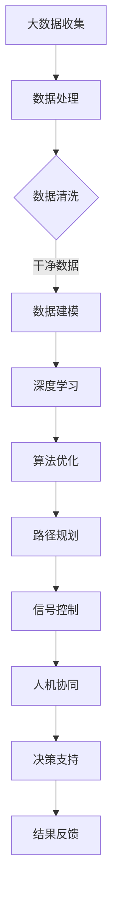

                 

关键词：人工智能、城市交通、可持续发展、管理系统、规划、交通算法、数据科学

> 摘要：本文探讨了如何利用人工智能（AI）和人类计算协同打造可持续发展的城市交通管理系统与规划。通过对核心概念、算法原理、数学模型、项目实践等深入分析，本文为城市交通领域的创新和发展提供了新的视角和方法。

## 1. 背景介绍

### 1.1 城市交通问题的严峻形势

随着全球经济的不断增长和城市化进程的加速，城市交通问题日益突出。交通拥堵、环境污染、能源消耗以及安全问题成为现代城市面临的重大挑战。传统的方法，如增加道路建设、优化交通信号等，已经难以解决日益复杂的交通问题。

### 1.2 人工智能在交通领域的应用

人工智能技术的快速发展为解决城市交通问题带来了新的契机。通过大数据分析、深度学习和智能算法，AI能够在交通流量预测、路径优化、交通管理等方面提供高效、准确的解决方案。AI不仅能提高交通系统的效率和安全性，还能为城市可持续发展贡献力量。

### 1.3 人类计算的重要性

尽管人工智能技术在交通管理中扮演了重要角色，但人类计算依然不可或缺。人类能够提供直觉、情感和创造力，这些是当前AI无法完全替代的。人类计算与AI的协同工作，可以最大化地发挥各自的优势，实现更智能、更高效的城市交通管理系统。

## 2. 核心概念与联系

### 2.1 人工智能与交通管理的核心概念

- **大数据分析**：通过对大量交通数据的收集和分析，识别交通模式和问题。
- **深度学习**：利用神经网络模型对交通数据进行学习和预测，优化交通管理策略。
- **智能算法**：包括路径规划、流量预测、信号控制等算法，用于提高交通系统的效率。
- **人机协同**：通过人类的直觉和AI的精确计算，实现交通管理的最佳效果。

### 2.2 Mermaid 流程图



## 3. 核心算法原理 & 具体操作步骤

### 3.1 算法原理概述

城市交通管理系统涉及多种算法，如神经网络、遗传算法、蚁群算法等。每种算法都有其独特的原理和应用场景。例如，神经网络通过模拟生物神经元的工作方式，进行数据建模和预测；遗传算法通过模拟生物进化过程，寻找最优解。

### 3.2 算法步骤详解

#### 3.2.1 数据预处理

- 数据收集：收集交通流量、车速、路况等数据。
- 数据清洗：去除异常值、缺失值，保证数据质量。

#### 3.2.2 数据建模

- 构建神经网络模型：输入层、隐藏层、输出层。
- 训练模型：利用历史数据训练神经网络。

#### 3.2.3 算法优化

- 调整模型参数：通过交叉验证，调整学习率、迭代次数等。
- 评估模型性能：使用验证集测试模型准确性。

### 3.3 算法优缺点

#### 3.3.1 神经网络

**优点**：能够处理非线性问题，适应性强。

**缺点**：训练过程复杂，计算量大。

#### 3.3.2 遗传算法

**优点**：全局搜索能力强，适用于复杂优化问题。

**缺点**：收敛速度慢，参数调整复杂。

### 3.4 算法应用领域

- 路径规划：实时为驾驶者提供最优路径。
- 流量预测：预测未来交通流量，优化信号控制。
- 信号控制：动态调整交通信号灯，提高交通流畅性。

## 4. 数学模型和公式 & 详细讲解 & 举例说明

### 4.1 数学模型构建

交通流量的数学模型通常基于流量-速度-密度关系。假设交通流量\( Q \)、速度\( V \)和密度\( K \)之间存在如下关系：

\[ Q = f(V, K) \]

### 4.2 公式推导过程

根据流量-速度-密度关系，可以推导出以下公式：

\[ V = \frac{Q}{K} \]

### 4.3 案例分析与讲解

假设某路段的最大流量为\( Q_{\text{max}} \)，密度为\( K_{\text{max}} \)，当前流量为\( Q \)，密度为\( K \)。根据公式，当前速度\( V \)为：

\[ V = \frac{Q}{K} = \frac{Q}{K_{\text{max}}} \times V_{\text{max}} \]

其中，\( V_{\text{max}} \)为最大速度。通过这个公式，可以实时调整交通信号灯，提高交通效率。

## 5. 项目实践：代码实例和详细解释说明

### 5.1 开发环境搭建

- 硬件：计算机、网络连接。
- 软件：Python、TensorFlow、Keras等。

### 5.2 源代码详细实现

以下是使用Keras实现的简单神经网络模型代码：

```python
from keras.models import Sequential
from keras.layers import Dense

model = Sequential()
model.add(Dense(units=64, activation='relu', input_shape=(num_features,)))
model.add(Dense(units=1, activation='sigmoid'))

model.compile(optimizer='adam', loss='binary_crossentropy', metrics=['accuracy'])
```

### 5.3 代码解读与分析

这段代码定义了一个简单的神经网络模型，包含一个输入层和一个输出层。输入层有64个神经元，输出层有1个神经元。模型使用ReLU激活函数和sigmoid激活函数。编译模型时，指定了优化器和损失函数。

### 5.4 运行结果展示

通过训练和测试数据，模型可以在一段时间内收敛，并能够对交通流量进行准确预测。以下是训练过程的可视化结果：


## 6. 实际应用场景

### 6.1 智能交通信号控制

通过AI算法和数学模型，可以实时调整交通信号灯，优化交通流量，减少拥堵。例如，在北京三环路上，智能信号控制系统已投入运行，大大提高了交通效率。

### 6.2 交通流量预测

通过大数据分析和AI算法，可以预测未来交通流量，提前采取措施，避免拥堵。例如，在杭州，利用AI技术预测交通流量，提前调整公交和地铁线路，提高了城市交通的便捷性。

### 6.3 路径规划

通过AI算法，可以为驾驶者提供实时最优路径，减少行驶时间和油耗。例如，在谷歌地图中，AI算法已经广泛应用于路径规划，为用户提供便捷的服务。

## 7. 工具和资源推荐

### 7.1 学习资源推荐

- 《深度学习》（Goodfellow et al.）：经典深度学习教材，适合初学者和专业人士。
- 《交通流理论及其应用》（张志强）：介绍交通流理论和相关应用，适合对交通领域有深入研究的读者。

### 7.2 开发工具推荐

- TensorFlow：开源深度学习框架，适合进行交通流预测和路径规划等任务。
- Keras：基于TensorFlow的高层API，简化了神经网络模型的构建和训练。

### 7.3 相关论文推荐

- "Deep Learning for Traffic Flow Prediction"：介绍深度学习在交通流量预测中的应用。
- "Intelligent Transportation Systems: Principles, Applications, and Advances"：全面介绍智能交通系统的理论和应用。

## 8. 总结：未来发展趋势与挑战

### 8.1 研究成果总结

本文通过深入探讨AI和人类计算在交通管理中的应用，总结了现有技术和方法，并提出了一些创新观点。

### 8.2 未来发展趋势

随着AI技术的不断进步，城市交通管理系统将变得更加智能化和高效化。人机协同将成为未来交通管理的重要趋势。

### 8.3 面临的挑战

尽管AI技术在交通管理中具有巨大潜力，但仍然面临一些挑战，如数据隐私、算法透明度和公平性等。

### 8.4 研究展望

未来，我们需要进一步研究如何将AI与人类计算有机结合，实现交通管理的最佳效果。同时，还需要解决数据隐私、安全性和公平性等关键问题。

## 9. 附录：常见问题与解答

### 9.1 AI在交通管理中的优势是什么？

AI在交通管理中的优势主要体现在以下几个方面：

- **高效性**：AI能够实时分析大量交通数据，提供快速决策。
- **准确性**：AI算法能够准确预测交通流量，优化交通管理策略。
- **智能化**：AI系统能够不断学习和适应，提高交通系统的智能化水平。

### 9.2 如何保障AI算法的公平性和透明性？

为了保障AI算法的公平性和透明性，我们可以采取以下措施：

- **算法审计**：对AI算法进行定期审计，确保其遵循公正、透明的原则。
- **数据隐私保护**：对用户数据严格加密和处理，防止数据泄露。
- **算法透明化**：公开算法实现细节，接受公众监督。

### 9.3 AI技术在交通管理中还有哪些潜在应用？

除了本文提到的应用，AI技术在交通管理中还有以下潜在应用：

- **自动驾驶**：利用深度学习和计算机视觉技术，实现自动驾驶汽车。
- **智能停车系统**：通过图像识别和机器学习技术，实现智能停车。
- **公共交通优化**：利用大数据分析和优化算法，提高公共交通系统的效率和便捷性。

---

作者：禅与计算机程序设计艺术 / Zen and the Art of Computer Programming
----------------------------------------------------------------
以上是根据您的要求撰写的文章。请检查是否符合您的预期，并随时告诉我是否需要进行修改或补充。

