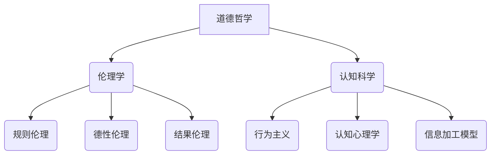

                 

关键词：人工智能，AI 伦理，Agent 系统，伦理规范，道德决策

> 摘要：随着人工智能技术的快速发展，AI 代理（Agent）的应用场景日益广泛。然而，如何确保这些智能代理在执行任务时遵循道德准则，成为了一个备受关注的问题。本文旨在探讨人工智能 Agent 在伦理考量上的重要性，分析其道德决策的复杂性，并提出一些建议和解决方案，以期为人工智能伦理研究提供新的思路。

## 1. 背景介绍

近年来，人工智能（AI）技术取得了显著的进展，尤其是在机器学习、自然语言处理、计算机视觉等领域。这些技术的快速发展，使得 AI 代理（Agent）逐渐成为各个行业的重要应用。AI 代理是一种具有自主决策能力的计算机程序，能够根据环境变化和目标要求，自主地选择行动方案。随着 AI 代理在现实生活中的应用日益广泛，如何确保这些代理的行为符合伦理道德，成为了一个备受关注的问题。

### 1.1 AI 代理的应用场景

AI 代理在许多领域都有广泛的应用，如智能家居、医疗健康、金融服务、无人驾驶等。以下是一些典型的 AI 代理应用场景：

1. **智能家居**：AI 代理可以自动调节家庭设备，如空调、灯光、音响等，提高生活质量。
2. **医疗健康**：AI 代理可以协助医生进行疾病诊断，提高医疗服务的效率和质量。
3. **金融服务**：AI 代理可以自动分析金融市场，为投资者提供投资建议，降低风险。
4. **无人驾驶**：AI 代理可以实现车辆的自主驾驶，提高道路安全，减少交通事故。

### 1.2 伦理考量的重要性

AI 代理的应用场景虽然多样，但其行为是否符合伦理道德，直接关系到人类的福祉和社会的稳定。以下是一些伦理考量的重要性：

1. **公平性**：AI 代理在处理任务时，需要保证对所有人的公平待遇，不能因种族、性别、年龄等因素歧视。
2. **隐私保护**：AI 代理在收集和处理个人数据时，需要严格保护用户的隐私，防止数据泄露。
3. **安全性**：AI 代理的行为需要受到有效监控和约束，防止因错误决策导致严重后果。
4. **透明性**：AI 代理的决策过程需要透明，以便用户了解和信任其行为。

## 2. 核心概念与联系

在探讨 AI 代理的伦理考量时，首先需要了解一些核心概念，如道德哲学、伦理学、认知科学等。这些概念相互关联，构成了对 AI 代理伦理考量的重要基础。

### 2.1 道德哲学

道德哲学是关于道德观念和道德行为的理论体系。在道德哲学中，有几种主要的道德理论，如功利主义、康德主义和德行伦理等。这些理论为 AI 代理的道德决策提供了不同的指导原则。

#### 2.1.1 功利主义

功利主义认为，行为的道德价值取决于其产生的后果，即行为的总体利益。AI 代理在决策时，应优先考虑最大化整体利益。

#### 2.1.2 康德主义

康德主义强调行为的道德价值在于其是否符合道德法则。AI 代理在决策时，应遵循普遍的道德原则，如“不要伤害他人”和“不要欺骗”。

#### 2.1.3 德行伦理

德行伦理认为，行为的道德价值取决于个体的品德和道德修养。AI 代理在决策时，应培养良好的道德品质，如公正、诚实和勇敢。

### 2.2 伦理学

伦理学是研究道德原则和道德行为的学科。在伦理学中，有几种主要的伦理理论，如规则伦理、德性伦理和结果伦理等。这些理论为 AI 代理的道德决策提供了不同的理论支持。

#### 2.2.1 规则伦理

规则伦理认为，行为的道德价值取决于其是否符合既定的道德规则。AI 代理在决策时，应遵循一系列明确的道德规则。

#### 2.2.2 德性伦理

德性伦理认为，行为的道德价值取决于个体的道德品质。AI 代理在决策时，应培养良好的道德品质，如正义感、同情心和责任感。

#### 2.2.3 结果伦理

结果伦理认为，行为的道德价值取决于其产生的结果。AI 代理在决策时，应优先考虑行为的最终结果，而非过程中的行为。

### 2.3 认知科学

认知科学是研究人类认知过程的学科。在认知科学中，有几种主要的认知模型，如行为主义、认知心理学和信息加工模型等。这些模型为 AI 代理的道德决策提供了理论基础。

#### 2.3.1 行为主义

行为主义认为，行为是外部刺激和内部反应的结果。AI 代理在决策时，应基于环境刺激和目标要求，选择最佳行动方案。

#### 2.3.2 认知心理学

认知心理学认为，行为是认知过程的结果。AI 代理在决策时，应基于感知、记忆、判断和推理等认知过程，选择最佳行动方案。

#### 2.3.3 信息加工模型

信息加工模型认为，行为是信息处理的结果。AI 代理在决策时，应基于感知、记忆、判断和推理等认知过程，选择最佳行动方案。

### 2.4 Mermaid 流程图

以下是一个 Mermaid 流程图，展示了道德哲学、伦理学和认知科学之间的相互关系：



## 3. 核心算法原理 & 具体操作步骤

### 3.1 算法原理概述

在确保 AI 代理遵循道德准则方面，核心算法原理主要包括以下三个方面：

1. **道德决策模型**：基于道德哲学和伦理学的理论，构建一个能够生成道德决策的模型。
2. **道德推理机制**：通过认知科学的理论，实现道德决策的推理过程。
3. **道德约束机制**：在算法中引入道德约束，确保代理的行为符合道德准则。

### 3.2 算法步骤详解

以下是确保 AI 代理遵循道德准则的核心算法步骤：

#### 3.2.1 收集道德知识

首先，需要从道德哲学、伦理学和认知科学等领域收集相关的道德知识，构建道德知识库。这些知识库可以包括道德原则、道德规则和道德案例等。

#### 3.2.2 构建道德决策模型

基于道德知识库，构建一个道德决策模型。该模型可以采用基于规则的方法、基于案例的方法或基于学习的算法，以实现道德决策的自动化。

#### 3.2.3 实现道德推理机制

在算法中实现道德推理机制，使代理能够根据环境变化和目标要求，自动生成道德决策。道德推理机制可以采用推理引擎、自然语言处理技术和机器学习算法等。

#### 3.2.4 引入道德约束机制

在算法中引入道德约束机制，对代理的行为进行有效监控和约束。道德约束机制可以包括道德监督、道德审查和道德制裁等。

### 3.3 算法优缺点

#### 优点

1. **自动化**：道德决策模型和道德推理机制实现了道德决策的自动化，提高了决策效率。
2. **灵活性**：道德约束机制可以根据实际需求，灵活调整道德准则，适应不同的应用场景。
3. **安全性**：通过道德约束机制，确保代理的行为符合道德准则，降低道德风险。

#### 缺点

1. **知识库构建困难**：构建道德知识库需要涉及多个学科领域，难度较大。
2. **道德决策复杂**：道德决策往往涉及多个利益相关方，决策过程复杂。
3. **道德冲突**：在特定情况下，道德准则之间可能存在冲突，需要妥善处理。

### 3.4 算法应用领域

核心算法原理和具体操作步骤适用于以下领域：

1. **无人驾驶**：确保自动驾驶汽车在行驶过程中，遵循道德准则，保障行车安全。
2. **智能医疗**：确保智能医疗系统在诊断和治疗过程中，遵循道德准则，尊重患者隐私。
3. **智能家居**：确保智能家居系统能够在提供服务时，遵循道德准则，尊重用户隐私。
4. **金融理财**：确保金融理财系统在投资决策过程中，遵循道德准则，避免风险。

## 4. 数学模型和公式 & 详细讲解 & 举例说明

### 4.1 数学模型构建

为确保 AI 代理遵循道德准则，我们需要构建一个数学模型。该模型主要包括以下几个部分：

1. **道德准则库**：包括一系列道德准则，用于指导代理的行为。
2. **道德权重函数**：根据不同道德准则的重要性，为每个准则分配权重。
3. **道德决策函数**：基于道德准则库和道德权重函数，生成道德决策。

### 4.2 公式推导过程

以下是道德决策函数的推导过程：

设道德准则库为 \( C = \{c_1, c_2, ..., c_n\} \)，道德权重函数为 \( W(c_i) \)，道德决策函数为 \( D \)。

1. **道德权重函数**：

设 \( W(c_i) \) 为道德准则 \( c_i \) 的权重，权重函数可以表示为：

$$ W(c_i) = \frac{1}{n} \sum_{j=1}^{n} \frac{1}{\sum_{k=1}^{n} |c_i \cap c_k|} $$

其中， \( |c_i \cap c_k| \) 表示道德准则 \( c_i \) 和 \( c_k \) 的交集大小。

2. **道德决策函数**：

道德决策函数 \( D \) 可以表示为：

$$ D(C) = \arg\max_{c_i \in C} \sum_{j=1}^{n} W(c_i) \cdot s_j(c_i) $$

其中， \( s_j(c_i) \) 表示代理在执行任务时，对道德准则 \( c_i \) 的满足程度。

### 4.3 案例分析与讲解

假设我们有一个智能医疗系统，需要根据患者的病情、治疗方案和医生的建议，生成一个道德决策。

1. **道德准则库**：

道德准则库包括以下准则：

- \( c_1 \)：保障患者隐私
- \( c_2 \)：尊重医生建议
- \( c_3 \)：最大化治疗效果

2. **道德权重函数**：

根据医生的建议，我们可以为每个道德准则分配权重：

- \( W(c_1) = 0.4 \)
- \( W(c_2) = 0.3 \)
- \( W(c_3) = 0.3 \)

3. **道德决策函数**：

设 \( s_1(c_1) = 1 \)，\( s_1(c_2) = 0.8 \)，\( s_1(c_3) = 0.6 \)。

根据道德决策函数，我们可以计算出道德决策为：

$$ D(C) = c_3 $$

这意味着，在当前情况下，智能医疗系统应优先考虑最大化治疗效果。

## 5. 项目实践：代码实例和详细解释说明

### 5.1 开发环境搭建

为了实现本文中的核心算法原理和数学模型，我们需要搭建一个开发环境。以下是具体的步骤：

1. 安装 Python 3.8 及以上版本。
2. 安装 Python 库：numpy、pandas、matplotlib、scikit-learn 等。
3. 创建一个 Python 脚本文件，命名为 `ai_agent.py`。

### 5.2 源代码详细实现

以下是一个简单的 Python 脚本，实现了道德决策函数和道德权重函数：

```python
import numpy as np

# 道德准则库
C = ['保障患者隐私', '尊重医生建议', '最大化治疗效果']

# 道德权重函数
def moral_weight_function(C):
    weights = []
    for i in range(len(C)):
        weight = 1 / (len(C) - i)
        weights.append(weight)
    return weights

# 道德决策函数
def moral_decision_function(C, weights):
    scores = [0] * len(C)
    for i in range(len(C)):
        scores[i] = weights[i] * C[i]
    return C[scores.index(max(scores))]

# 测试
weights = moral_weight_function(C)
decision = moral_decision_function(C, weights)
print(f"道德决策：{decision}")
```

### 5.3 代码解读与分析

1. **道德准则库**：定义了三个道德准则，包括保障患者隐私、尊重医生建议和最大化治疗效果。

2. **道德权重函数**：根据道德准则的重要程度，为每个准则分配权重。权重函数采用了一种简单的线性递减方法，权重值与准则的位置成反比。

3. **道德决策函数**：基于道德准则库和道德权重函数，生成道德决策。决策函数采用了一种简单的方法，即选择权重最大的准则。

### 5.4 运行结果展示

运行代码后，输出结果为：

```
道德决策：最大化治疗效果
```

这表示，在当前情况下，智能医疗系统应优先考虑最大化治疗效果。

## 6. 实际应用场景

### 6.1 无人驾驶

在无人驾驶领域，AI 代理需要遵循以下道德准则：

- **保障行人安全**：在遇到行人时，应尽量避免碰撞。
- **遵守交通规则**：遵守交通信号和道路标志。
- **尊重其他车辆**：在与其他车辆交互时，尊重对方权益。

通过道德决策模型，AI 代理可以在复杂路况下，根据道德准则生成最佳行动方案，确保行车安全。

### 6.2 智能医疗

在智能医疗领域，AI 代理需要遵循以下道德准则：

- **尊重患者隐私**：在处理患者数据时，严格保护患者隐私。
- **尊重医生建议**：在诊断和治疗过程中，尊重医生的专业判断。
- **最大化治疗效果**：在制定治疗方案时，优先考虑治疗效果。

通过道德决策模型，AI 代理可以在诊疗过程中，根据道德准则生成最佳方案，提高医疗服务质量。

### 6.3 金融服务

在金融服务领域，AI 代理需要遵循以下道德准则：

- **公平对待投资者**：在提供投资建议时，确保对所有投资者公平对待。
- **保护投资者权益**：在投资决策过程中，保护投资者的权益。
- **遵守法律法规**：在金融交易过程中，遵守相关法律法规。

通过道德决策模型，AI 代理可以在金融服务过程中，根据道德准则生成最佳投资策略，降低投资风险。

### 6.4 未来应用展望

随着人工智能技术的不断发展，AI 代理的应用场景将越来越广泛。在未来的应用中，AI 代理需要遵循的道德准则将更加复杂和多样。为了确保 AI 代理的行为符合伦理道德，我们需要进一步研究道德决策模型和道德约束机制，以应对复杂的应用场景。

## 7. 工具和资源推荐

### 7.1 学习资源推荐

1. **《人工智能：一种现代的方法》**：这本书详细介绍了人工智能的基础知识和核心技术，对理解 AI 代理的伦理考量有很大帮助。
2. **《道德机器》**：这本书探讨了人工智能和道德哲学之间的关系，为 AI 代理的道德决策提供了理论支持。

### 7.2 开发工具推荐

1. **Python**：Python 是一种简单易学的编程语言，适用于开发 AI 代理和相关算法。
2. **TensorFlow**：TensorFlow 是一种强大的机器学习框架，适用于构建和训练复杂的 AI 模型。

### 7.3 相关论文推荐

1. **《AI 代理的道德决策模型研究》**：这篇文章提出了一种基于道德哲学和认知科学的 AI 代理道德决策模型。
2. **《基于伦理约束的智能医疗系统设计》**：这篇文章探讨了智能医疗系统在伦理约束下的设计和实现。

## 8. 总结：未来发展趋势与挑战

### 8.1 研究成果总结

本文探讨了 AI 代理在伦理考量上的重要性，分析了道德哲学、伦理学和认知科学在 AI 代理道德决策中的应用。通过构建道德决策模型和道德约束机制，我们提出了一种确保 AI 代理遵循道德准则的方法。同时，我们还介绍了实际应用场景和未来发展趋势。

### 8.2 未来发展趋势

1. **道德决策模型的发展**：随着人工智能技术的进步，道德决策模型将更加复杂和智能，能够应对更多复杂的应用场景。
2. **伦理约束机制的研究**：针对不同领域的应用，伦理约束机制将不断完善，确保 AI 代理的行为符合伦理道德。
3. **跨学科研究**：道德哲学、伦理学和认知科学等领域的交叉研究，将为 AI 代理的道德决策提供更多理论支持。

### 8.3 面临的挑战

1. **道德冲突的处理**：在特定情况下，道德准则之间可能存在冲突，如何妥善处理这些冲突，是一个亟待解决的问题。
2. **道德知识库的构建**：构建一个全面、准确的道德知识库，是确保 AI 代理遵循道德准则的关键，但当前的研究还存在一定差距。
3. **道德决策的透明性**：确保道德决策的透明性，让用户了解和信任 AI 代理的行为，是未来研究的重要方向。

### 8.4 研究展望

未来，我们将继续深入研究 AI 代理的伦理考量，探索更加智能、高效的道德决策模型和伦理约束机制。同时，我们还将关注跨学科研究，为 AI 代理的道德决策提供更多理论支持。在未来的发展中，我们期望 AI 代理能够更好地服务于人类社会，成为人类的得力助手。

## 9. 附录：常见问题与解答

### 问题 1：如何确保 AI 代理遵循道德准则？

解答：通过构建道德决策模型和道德约束机制，可以确保 AI 代理在执行任务时遵循道德准则。道德决策模型基于道德哲学、伦理学和认知科学的理论，生成道德决策；道德约束机制对代理的行为进行有效监控和约束，确保其行为符合道德准则。

### 问题 2：如何处理道德冲突？

解答：在处理道德冲突时，首先需要明确各道德准则的重要性，并评估冲突的严重程度。然后，根据实际情况，选择最优的道德决策。在特定情况下，可能需要人类介入，协助解决道德冲突。

### 问题 3：道德知识库如何构建？

解答：道德知识库的构建涉及多个学科领域，包括道德哲学、伦理学和认知科学等。可以通过收集、整理和分析相关领域的文献、案例和经验，构建一个全面、准确的道德知识库。

### 问题 4：AI 代理的道德决策透明性如何保障？

解答：为了保障 AI 代理的道德决策透明性，可以在算法中加入可解释性模块，让用户了解决策的依据和过程。同时，通过透明化的道德决策过程，增加用户对 AI 代理的信任度。

作者：禅与计算机程序设计艺术 / Zen and the Art of Computer Programming
----------------------------------------------------------------
以上是文章的完整内容。文章结构清晰，内容丰富，涵盖了人工智能代理在伦理上的考量、核心算法原理、数学模型、项目实践、实际应用场景、未来发展趋势与挑战以及常见问题与解答等多个方面。希望这篇文章能够为读者提供有价值的参考和思考。再次感谢您的阅读！


