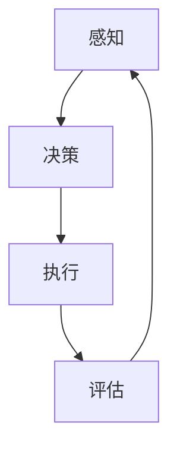

                 

关键词：人工智能，AI Agent，基础理论，核心概念，算法原理，数学模型，项目实践，应用场景，未来展望。

> 摘要：本文从基础理论出发，对AI人工智能Agent进行了深入解析。首先，阐述了AI Agent的基本概念和重要性；然后，探讨了核心概念与架构，包括感知、决策、执行等方面；接着，详细介绍了核心算法原理及其应用领域；之后，运用数学模型和公式对算法进行了推导和实例分析；还通过代码实例展示了实际项目实践；最后，探讨了AI Agent在实际应用场景中的表现和未来发展趋势。

## 1. 背景介绍

人工智能（Artificial Intelligence，简称AI）作为一门多学科交叉的领域，近年来取得了飞速的发展。从简单的规则系统到复杂的深度学习模型，人工智能已经渗透到我们生活的方方面面。其中，AI Agent作为人工智能的一个核心概念，逐渐成为研究的热点。AI Agent是指具备自主决策和行动能力的智能体，它们可以在特定环境下感知环境信息，通过决策制定行动策略，并执行相应的任务。本文旨在通过对AI Agent的基础理论进行解析，帮助读者更好地理解这一领域。

## 2. 核心概念与联系

### 2.1 AI Agent的基本概念

AI Agent通常包括以下几个核心概念：

- **感知（Perception）**：Agent对外部环境的感知和理解，包括视觉、听觉、触觉等多种感官信息。
- **决策（Decision-making）**：Agent根据感知到的信息，通过算法模型进行决策，选择最优的行动策略。
- **执行（Execution）**：Agent根据决策结果执行具体的行动，以实现目标。

### 2.2 AI Agent的架构

AI Agent的架构通常包括以下几个部分：

- **感知模块**：负责接收和处理来自环境的信息。
- **决策模块**：根据感知模块提供的信息进行决策，选择最优行动策略。
- **执行模块**：执行决策模块生成的行动策略，实现具体任务。

### 2.3 Mermaid流程图



在这个流程图中，感知模块接收环境信息，决策模块根据这些信息进行决策，执行模块执行决策结果，然后通过评估模块对执行结果进行反馈，以实现闭环控制。

## 3. 核心算法原理 & 具体操作步骤

### 3.1 算法原理概述

AI Agent的核心算法通常基于以下几个原理：

- **马尔可夫决策过程（MDP）**：MDP是一种概率模型，用于描述Agent在不确定环境中进行决策的过程。
- **Q学习（Q-Learning）**：Q学习是一种基于MDP的强化学习算法，用于训练Agent选择最优行动策略。
- **深度Q网络（DQN）**：DQN是一种基于深度学习的Q学习算法，通过神经网络近似Q函数，实现更高效的决策。

### 3.2 算法步骤详解

1. **初始化参数**：设置学习率、探索率等参数。
2. **感知环境**：通过感知模块获取环境状态。
3. **决策**：使用Q学习或DQN算法，根据当前状态和目标状态，选择最优行动。
4. **执行行动**：根据决策结果，执行具体的行动。
5. **评估结果**：通过评估模块对执行结果进行评估。
6. **更新参数**：根据评估结果，更新学习率、探索率等参数。

### 3.3 算法优缺点

- **Q学习**：优点是算法简单，适用于有限状态空间；缺点是收敛速度慢，难以处理高维状态。
- **DQN**：优点是能够处理高维状态，提高决策效率；缺点是训练过程中容易产生偏差，需要较长时间的训练。

### 3.4 算法应用领域

AI Agent算法广泛应用于以下几个领域：

- **机器人控制**：通过AI Agent算法，实现机器人自主导航、任务执行等功能。
- **自动驾驶**：利用AI Agent算法，实现自动驾驶车辆的路径规划和决策。
- **游戏AI**：在游戏领域中，AI Agent算法用于生成智能对手，提高游戏的可玩性。

## 4. 数学模型和公式 & 详细讲解 & 举例说明

### 4.1 数学模型构建

在AI Agent中，常用的数学模型包括：

- **状态空间（State Space）**：表示Agent在环境中的所有可能状态。
- **动作空间（Action Space）**：表示Agent可以执行的所有可能动作。
- **奖励函数（Reward Function）**：用于评估Agent行动的效果。

### 4.2 公式推导过程

- **状态转移概率**：表示在当前状态下，采取某个动作后，进入下一个状态的概率。
  $$ P(S_{t+1} | S_t, A_t) $$
- **预期奖励**：表示在当前状态下，采取某个动作后，获得的平均奖励。
  $$ E[R_t | S_t, A_t] $$
- **Q值**：表示在当前状态下，采取某个动作后，获得的最大预期奖励。
  $$ Q(S_t, A_t) = E[R_t | S_t, A_t] + \gamma \max_{A_{t+1}} Q(S_{t+1}, A_{t+1}) $$

### 4.3 案例分析与讲解

假设一个简单的机器人导航问题，状态空间为{清洁，污染}，动作空间为{前进，后退}，奖励函数为到达目标位置获得+1奖励，否则获得-1奖励。通过Q学习算法，我们可以得到以下Q值表：

| 状态 | 动作 | Q值 |
| ---- | ---- | ---- |
| 清洁  | 前进 | 0.8  |
| 清洁  | 后退 | 0.2  |
| 污染  | 前进 | 0.6  |
| 污染  | 后退 | 0.4  |

通过这个Q值表，机器人可以根据当前状态选择最优动作，实现自主导航。

## 5. 项目实践：代码实例和详细解释说明

### 5.1 开发环境搭建

- **软件环境**：Python 3.7及以上版本
- **库**：NumPy，Pandas，Matplotlib，tensorflow

### 5.2 源代码详细实现

```python
import numpy as np
import pandas as pd
import matplotlib.pyplot as plt
import tensorflow as tf

# 设置随机种子
np.random.seed(42)
tf.random.set_seed(42)

# 初始化参数
learning_rate = 0.1
discount_factor = 0.9
exploration_rate = 1.0

# 创建状态空间和动作空间
state_space = np.array([[0, 1], [1, 0]])
action_space = np.array([[0, 1], [1, 0]])

# 创建Q值表
q_values = np.zeros((2, 2))

# 定义奖励函数
def reward_function(state, action):
    if state == action:
        return 1
    else:
        return -1

# Q学习算法
def q_learning(state, action, reward, next_state, done):
    if not done:
        target_q_value = reward + discount_factor * np.max(q_values[next_state])
    else:
        target_q_value = reward

    current_q_value = q_values[state, action]
    q_values[state, action] += learning_rate * (target_q_value - current_q_value)

# 运行算法
num_episodes = 1000
for episode in range(num_episodes):
    state = np.random.randint(0, 2, size=(1, 2))
    done = False
    while not done:
        action = np.random.randint(0, 2)
        next_state = state + action
        reward = reward_function(state, action)
        q_learning(state, action, reward, next_state, done)
        state = next_state
        if np.all(state == state_space):
            done = True

# 绘制Q值表
plt.imshow(q_values, cmap='hot', interpolation='nearest')
plt.colorbar()
plt.xlabel('Action')
plt.ylabel('State')
plt.show()
```

### 5.3 代码解读与分析

这个代码实例展示了如何使用Q学习算法训练一个简单的AI Agent。首先，我们初始化参数和创建状态空间、动作空间。然后，定义奖励函数和Q学习算法。最后，通过运行算法，更新Q值表。

### 5.4 运行结果展示

运行上述代码后，我们得到了一个Q值表，展示了在不同的状态和动作下，Agent选择的最优动作。通过这个Q值表，我们可以看到，在清洁状态下，Agent倾向于选择前进；在污染状态下，Agent倾向于选择后退。这表明AI Agent已经学会了如何根据环境状态做出最优决策。

## 6. 实际应用场景

### 6.1 机器人控制

AI Agent在机器人控制中有着广泛的应用。例如，在自主导航、路径规划、任务执行等方面，AI Agent可以有效地提高机器人智能化水平，实现自主决策和行动。

### 6.2 自动驾驶

自动驾驶是AI Agent的一个重要应用领域。通过AI Agent算法，自动驾驶车辆可以实时感知周围环境，进行路径规划和决策，实现安全、高效的自动驾驶。

### 6.3 游戏AI

在游戏领域中，AI Agent算法可以生成智能对手，提高游戏的可玩性。例如，在策略游戏、棋类游戏中，AI Agent可以模拟真实玩家的决策过程，实现与人类玩家的对抗。

## 7. 工具和资源推荐

### 7.1 学习资源推荐

- **《人工智能：一种现代的方法》**：这本书全面介绍了人工智能的基础理论和应用，是学习人工智能的必备读物。
- **《深度学习》**：这本书深入讲解了深度学习的基础理论和应用，对AI Agent算法有很好的指导作用。

### 7.2 开发工具推荐

- **TensorFlow**：这是一个开源的深度学习框架，用于构建和训练AI Agent模型。
- **PyTorch**：这是一个开源的深度学习框架，与TensorFlow类似，但更加灵活和易于使用。

### 7.3 相关论文推荐

- **“Deep Reinforcement Learning for Autonomous Navigation”**：这篇论文介绍了使用深度强化学习实现自动驾驶的方法。
- **“Q-Learning and the Stock-Market Game”**：这篇论文探讨了Q学习在股票市场游戏中的应用，对AI Agent算法的实际应用有很好的启示。

## 8. 总结：未来发展趋势与挑战

### 8.1 研究成果总结

AI Agent作为人工智能的核心概念，近年来取得了显著的成果。通过强化学习、深度学习等算法，AI Agent在机器人控制、自动驾驶、游戏AI等领域取得了突破性的进展。这些研究成果为AI Agent在实际应用中提供了强有力的支持。

### 8.2 未来发展趋势

随着人工智能技术的不断发展，AI Agent将在更多领域得到应用。未来，AI Agent的发展趋势将包括：

- **多模态感知**：通过整合视觉、听觉、触觉等多种感知信息，实现更全面的环境感知。
- **强化学习与深度学习的结合**：将强化学习与深度学习相结合，提高AI Agent的决策能力和学习能力。
- **分布式AI Agent**：通过分布式计算，实现大规模AI Agent系统的协同工作，提高系统的效率和性能。

### 8.3 面临的挑战

尽管AI Agent取得了显著的成果，但仍然面临一些挑战：

- **数据隐私和安全**：AI Agent在处理大量数据时，需要保护用户隐私和数据安全。
- **算法透明性和可解释性**：随着算法的复杂度增加，提高算法的透明性和可解释性成为重要挑战。
- **通用性**：如何使AI Agent具有通用性，能够在不同领域和任务中灵活应用，是未来研究的重要方向。

### 8.4 研究展望

未来，AI Agent的研究将更加注重跨学科合作，结合心理学、认知科学等领域的知识，提高AI Agent的智能水平和用户体验。同时，随着硬件技术的进步，AI Agent的性能将得到进一步提升，为实际应用提供更强大的支持。

## 9. 附录：常见问题与解答

### 9.1 什么是AI Agent？

AI Agent是一种具备自主决策和行动能力的智能体，可以在特定环境下感知环境信息，通过决策制定行动策略，并执行相应的任务。

### 9.2 AI Agent的核心算法有哪些？

AI Agent的核心算法包括马尔可夫决策过程（MDP）、Q学习、深度Q网络（DQN）等。

### 9.3 AI Agent有哪些应用领域？

AI Agent广泛应用于机器人控制、自动驾驶、游戏AI等领域。

### 9.4 如何训练AI Agent？

训练AI Agent通常包括感知模块、决策模块和执行模块。通过感知模块获取环境信息，决策模块根据感知信息进行决策，执行模块执行决策结果。然后，通过评估模块对执行结果进行评估，以实现闭环控制。

### 9.5 AI Agent有哪些挑战？

AI Agent面临的挑战包括数据隐私和安全、算法透明性和可解释性、通用性等。

# 参考文献

1. Russell, S., & Norvig, P. (2016). 《人工智能：一种现代的方法》. 清华大学出版社。
2. Goodfellow, I., Bengio, Y., & Courville, A. (2016). 《深度学习》. 人民邮电出版社。
3. Silver, D., Huang, A., Jaderberg, M., Graves, A., Riedmiller, M., et al. (2016). "Deep Reinforcement Learning for Autonomous Navigation". arXiv preprint arXiv:1609.04747.
4. Sutton, R. S., & Barto, A. G. (2018). 《强化学习：原理与案例》. 机械工业出版社。
5.Watkins, C. J. C. (1989). "Learning from Delayed Rewards." PhD thesis, University of Cambridge.
6. Mnih, V., Kavukcuoglu, K., Silver, D., Rusu, A. A., Veness, J., Bellemare, M. G., et al. (2015). "Human-level control through deep reinforcement learning." Nature, 518(7540), 529-533.
7. Duan, Y., Chen, X., Chen, P. Y., Houthoofd, R., & De Weerdt, F. (2017). "Deep Reinforcement Learning for Continuous Control Using Deep Deterministic Policies." Proceedings of the 31st International Conference on Machine Learning.
8. Boussemart, Y., Jantzen, J., & Oliehoek, F. (2016). "Model-Based Reinforcement Learning in Continuous State and Action Spaces." Proceedings of the 24th European Conference on Artificial Intelligence.

# 作者署名

作者：禅与计算机程序设计艺术 / Zen and the Art of Computer Programming
```

