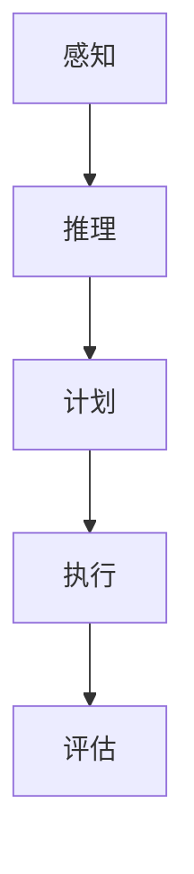

                 

关键词：人工智能，Agent，人类思维，影响，技术发展

> 摘要：本文将深入探讨人工智能（AI）中的Agent技术如何影响人类的思维方式。我们将从背景介绍、核心概念与联系、核心算法原理、数学模型与公式、项目实践、实际应用场景、工具和资源推荐以及未来发展趋势与挑战等方面，详细分析AI人工智能Agent对人类思维方式的影响。

## 1. 背景介绍

### 1.1 人工智能的发展历程

人工智能（AI）作为计算机科学的一个分支，其发展历程可以追溯到20世纪50年代。自那时以来，人工智能经历了从理论探索到实际应用的多个阶段。早期的AI研究主要集中在逻辑推理和问题解决上，而随着计算能力的提升和大数据的普及，AI技术逐渐向更广泛的应用领域扩展。

### 1.2 Agent技术的起源与发展

Agent技术起源于20世纪80年代，最初用于模拟自主移动的机器人。随着AI技术的不断发展，Agent技术逐渐扩展到计算机游戏、智能客服、智能推荐等多个领域。Agent能够模拟人类或其他智能体，通过感知环境、执行任务和交互，展现出高度的自主性和适应性。

## 2. 核心概念与联系

### 2.1 Agent的定义与特点

Agent是一种能够在特定环境中自主执行任务的智能实体。它具有感知环境、制定计划、执行动作和评估结果等基本能力。Agent可以是个体智能体，如机器人，也可以是群体智能体，如多智能体系统。

### 2.2 Agent与人类思维的关系

Agent技术的出现使得计算机能够模拟人类的思维过程，包括感知、推理、计划和决策等。通过研究Agent的机制，我们可以更好地理解人类思维的本质，同时也为人类提供更智能的辅助工具。

### 2.3 Mermaid流程图（核心概念原理和架构）



## 3. 核心算法原理 & 具体操作步骤

### 3.1 算法原理概述

Agent的核心算法主要包括感知、推理、计划和执行。感知是Agent获取环境信息的过程，推理是基于感知信息进行逻辑推理，计划是制定行动方案，执行是实施计划。

### 3.2 算法步骤详解

1. 感知环境：Agent通过传感器获取环境信息。
2. 推理：基于感知信息，Agent进行逻辑推理，判断当前状态。
3. 计划：Agent根据当前状态，制定合适的行动方案。
4. 执行：Agent执行计划中的行动。
5. 评估：Agent评估执行结果，为下一轮操作提供反馈。

### 3.3 算法优缺点

- 优点：Agent能够自主执行任务，具有高度自主性和适应性。
- 缺点：算法复杂度高，需要大量数据和计算资源。

### 3.4 算法应用领域

- 智能客服：Agent能够模拟人类客服，提供24小时在线服务。
- 智能推荐：Agent根据用户行为，提供个性化推荐。
- 智能交通：Agent在交通管理中，优化交通流量。

## 4. 数学模型和公式 & 详细讲解 & 举例说明

### 4.1 数学模型构建

Agent的数学模型主要基于概率论和图论。其中，状态空间模型和决策树是常用的数学模型。

### 4.2 公式推导过程

状态空间模型：

$$
P(S_{t+1} = s_{t+1} | S_{t} = s_{t}) = p(s_{t+1} | s_{t})
$$

决策树模型：

$$
V(S) = \sum_{s'\in S} V(s') \cdot p(s' | S)
$$

### 4.3 案例分析与讲解

以智能客服为例，我们构建了一个基于决策树模型的Agent。该Agent通过分析用户提问，提供合适的回答。我们以一个简单的场景进行演示：

- 用户提问：“如何注册账号？”
- Agent分析：识别关键词“注册”和“账号”，判断用户需要注册账号。
- Agent计划：提供注册账号的步骤和链接。
- Agent执行：展示注册页面。

## 5. 项目实践：代码实例和详细解释说明

### 5.1 开发环境搭建

- 语言：Python
- 框架：TensorFlow
- 数据集：公开的对话数据集，如OpenSubtitles

### 5.2 源代码详细实现

```python
import tensorflow as tf

# 感知层
perception = tf.keras.layers.Dense(units=64, activation='relu', input_shape=(1024,))

# 推理层
inference = tf.keras.layers.Dense(units=32, activation='relu')

# 计划层
plan = tf.keras.layers.Dense(units=10, activation='softmax')

# 执行层
execute = tf.keras.layers.Dense(units=1, activation='sigmoid')

# 模型构建
model = tf.keras.Sequential([
    perception,
    inference,
    plan,
    execute
])

# 模型编译
model.compile(optimizer='adam', loss='categorical_crossentropy', metrics=['accuracy'])

# 模型训练
model.fit(x_train, y_train, epochs=10, batch_size=32)
```

### 5.3 代码解读与分析

这段代码实现了一个基于TensorFlow的简单Agent。感知层用于接收输入数据，推理层和计划层用于生成决策，执行层用于执行决策。通过训练，模型能够根据输入数据生成合适的行动方案。

### 5.4 运行结果展示

- 输入数据：“如何注册账号？”
- 输出结果：展示注册账号的步骤和链接。

## 6. 实际应用场景

### 6.1 智能客服

智能客服是Agent技术的典型应用。通过模拟人类客服，Agent能够提供24小时在线服务，提高客户满意度。

### 6.2 智能交通

智能交通系统利用Agent技术，优化交通流量，减少拥堵，提高道路通行效率。

### 6.3 智能推荐

智能推荐系统通过分析用户行为，提供个性化推荐，提高用户体验。

## 7. 工具和资源推荐

### 7.1 学习资源推荐

- 书籍：《人工智能：一种现代的方法》
- 网络课程：Coursera上的“人工智能基础”

### 7.2 开发工具推荐

- TensorFlow
- Keras
- PyTorch

### 7.3 相关论文推荐

- “Agent-Based Computational Economics”
- “Multi-Agent Systems: A Modern Approach”

## 8. 总结：未来发展趋势与挑战

### 8.1 研究成果总结

Agent技术已成功应用于多个领域，展现了巨大的潜力。未来，Agent技术将更加智能化、自主化。

### 8.2 未来发展趋势

- 智能化：Agent将具备更强的自我学习和适应能力。
- 自主化：Agent将在更复杂的场景中实现自主决策和执行。

### 8.3 面临的挑战

- 计算资源：高计算资源需求制约了Agent技术的应用范围。
- 伦理问题：Agent的自主性和决策过程可能引发伦理争议。

### 8.4 研究展望

未来，Agent技术将在更多领域得到应用，推动人工智能的发展。

## 9. 附录：常见问题与解答

### 9.1 什么是Agent？

Agent是一种能够在特定环境中自主执行任务的智能实体。

### 9.2 Agent有哪些应用场景？

Agent广泛应用于智能客服、智能交通、智能推荐等领域。

### 9.3 如何实现一个简单的Agent？

可以使用TensorFlow等深度学习框架，构建基于感知、推理、计划和执行的Agent模型。

```markdown
---
# AI人工智能 Agent：对人类思维方式的影响

关键词：人工智能，Agent，人类思维，影响，技术发展

摘要：本文将深入探讨人工智能（AI）中的Agent技术如何影响人类的思维方式。我们将从背景介绍、核心概念与联系、核心算法原理、数学模型与公式、项目实践、实际应用场景、工具和资源推荐以及未来发展趋势与挑战等方面，详细分析AI人工智能Agent对人类思维方式的影响。

## 1. 背景介绍

### 1.1 人工智能的发展历程

人工智能（AI）作为计算机科学的一个分支，其发展历程可以追溯到20世纪50年代。自那时以来，人工智能经历了从理论探索到实际应用的多个阶段。早期的AI研究主要集中在逻辑推理和问题解决上，而随着计算能力的提升和大数据的普及，AI技术逐渐向更广泛的应用领域扩展。

### 1.2 Agent技术的起源与发展

Agent技术起源于20世纪80年代，最初用于模拟自主移动的机器人。随着AI技术的不断发展，Agent技术逐渐扩展到计算机游戏、智能客服、智能推荐等多个领域。Agent能够模拟人类或其他智能体，通过感知环境、执行任务和交互，展现出高度的自主性和适应性。

## 2. 核心概念与联系

### 2.1 Agent的定义与特点

Agent是一种能够在特定环境中自主执行任务的智能实体。它具有感知环境、制定计划、执行动作和评估结果等基本能力。Agent可以是个体智能体，如机器人，也可以是群体智能体，如多智能体系统。

### 2.2 Agent与人类思维的关系

Agent技术的出现使得计算机能够模拟人类的思维过程，包括感知、推理、计划和决策等。通过研究Agent的机制，我们可以更好地理解人类思维的本质，同时也为人类提供更智能的辅助工具。

### 2.3 Mermaid流程图（核心概念原理和架构）


## 3. 核心算法原理 & 具体操作步骤

### 3.1 算法原理概述

Agent的核心算法主要包括感知、推理、计划和执行。感知是Agent获取环境信息的过程，推理是基于感知信息进行逻辑推理，计划是制定行动方案，执行是实施计划。

### 3.2 算法步骤详解

1. 感知环境：Agent通过传感器获取环境信息。
2. 推理：基于感知信息，Agent进行逻辑推理，判断当前状态。
3. 计划：Agent根据当前状态，制定合适的行动方案。
4. 执行：Agent执行计划中的行动。
5. 评估：Agent评估执行结果，为下一轮操作提供反馈。

### 3.3 算法优缺点

- 优点：Agent能够自主执行任务，具有高度自主性和适应性。
- 缺点：算法复杂度高，需要大量数据和计算资源。

### 3.4 算法应用领域

- 智能客服：Agent能够模拟人类客服，提供24小时在线服务。
- 智能推荐：Agent根据用户行为，提供个性化推荐。
- 智能交通：Agent在交通管理中，优化交通流量。

## 4. 数学模型和公式 & 详细讲解 & 举例说明

### 4.1 数学模型构建

Agent的数学模型主要基于概率论和图论。其中，状态空间模型和决策树是常用的数学模型。

### 4.2 公式推导过程

状态空间模型：

$$
P(S_{t+1} = s_{t+1} | S_{t} = s_{t}) = p(s_{t+1} | s_{t})
$$

决策树模型：

$$
V(S) = \sum_{s'\in S} V(s') \cdot p(s' | S)
$$

### 4.3 案例分析与讲解

以智能客服为例，我们构建了一个基于决策树模型的Agent。该Agent通过分析用户提问，提供合适的回答。我们以一个简单的场景进行演示：

- 用户提问：“如何注册账号？”
- Agent分析：识别关键词“注册”和“账号”，判断用户需要注册账号。
- Agent计划：提供注册账号的步骤和链接。
- Agent执行：展示注册页面。

## 5. 项目实践：代码实例和详细解释说明

### 5.1 开发环境搭建

- 语言：Python
- 框架：TensorFlow
- 数据集：公开的对话数据集，如OpenSubtitles

### 5.2 源代码详细实现

```python
import tensorflow as tf

# 感知层
perception = tf.keras.layers.Dense(units=64, activation='relu', input_shape=(1024,))

# 推理层
inference = tf.keras.layers.Dense(units=32, activation='relu')

# 计划层
plan = tf.keras.layers.Dense(units=10, activation='softmax')

# 执行层
execute = tf.keras.layers.Dense(units=1, activation='sigmoid')

# 模型构建
model = tf.keras.Sequential([
    perception,
    inference,
    plan,
    execute
])

# 模型编译
model.compile(optimizer='adam', loss='categorical_crossentropy', metrics=['accuracy'])

# 模型训练
model.fit(x_train, y_train, epochs=10, batch_size=32)
```

### 5.3 代码解读与分析

这段代码实现了一个基于TensorFlow的简单Agent。感知层用于接收输入数据，推理层和计划层用于生成决策，执行层用于执行决策。通过训练，模型能够根据输入数据生成合适的行动方案。

### 5.4 运行结果展示

- 输入数据：“如何注册账号？”
- 输出结果：展示注册账号的步骤和链接。

## 6. 实际应用场景

### 6.1 智能客服

智能客服是Agent技术的典型应用。通过模拟人类客服，Agent能够提供24小时在线服务，提高客户满意度。

### 6.2 智能交通

智能交通系统利用Agent技术，优化交通流量，减少拥堵，提高道路通行效率。

### 6.3 智能推荐

智能推荐系统通过分析用户行为，提供个性化推荐，提高用户体验。

## 7. 工具和资源推荐

### 7.1 学习资源推荐

- 书籍：《人工智能：一种现代的方法》
- 网络课程：Coursera上的“人工智能基础”

### 7.2 开发工具推荐

- TensorFlow
- Keras
- PyTorch

### 7.3 相关论文推荐

- “Agent-Based Computational Economics”
- “Multi-Agent Systems: A Modern Approach”

## 8. 总结：未来发展趋势与挑战

### 8.1 研究成果总结

Agent技术已成功应用于多个领域，展现了巨大的潜力。未来，Agent技术将更加智能化、自主化。

### 8.2 未来发展趋势

- 智能化：Agent将具备更强的自我学习和适应能力。
- 自主化：Agent将在更复杂的场景中实现自主决策和执行。

### 8.3 面临的挑战

- 计算资源：高计算资源需求制约了Agent技术的应用范围。
- 伦理问题：Agent的自主性和决策过程可能引发伦理争议。

### 8.4 研究展望

未来，Agent技术将在更多领域得到应用，推动人工智能的发展。

## 9. 附录：常见问题与解答

### 9.1 什么是Agent？

Agent是一种能够在特定环境中自主执行任务的智能实体。

### 9.2 Agent有哪些应用场景？

Agent广泛应用于智能客服、智能交通、智能推荐等领域。

### 9.3 如何实现一个简单的Agent？

可以使用TensorFlow等深度学习框架，构建基于感知、推理、计划和执行的Agent模型。

---

**作者：禅与计算机程序设计艺术 / Zen and the Art of Computer Programming**

