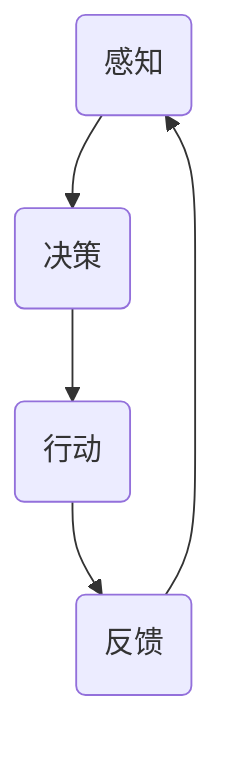

                 

关键词：人工智能，智能体，交互理论，环境感知，学习算法，应用领域

> 摘要：本文将深入探讨人工智能领域中的智能体与环境的交互理论。通过对智能体定义、功能及其与环境的交互机制进行分析，我们将探讨智能体在现实世界中的应用，以及未来的发展趋势与挑战。

## 1. 背景介绍

随着人工智能技术的快速发展，智能体（Agent）成为了一个重要的研究领域。智能体是指具有自主性、社会性和环境感知能力的计算实体，可以在复杂的环境中独立行动并与其他实体进行交互。智能体的出现标志着人工智能从传统的任务导向型系统向更加自主和灵活的方向发展。

在人工智能的发展历程中，智能体的研究可以追溯到20世纪70年代。当时，研究者们开始关注如何使计算机具有类似于人类的行为能力，从而解决复杂的问题。随着计算机技术的进步和人工智能算法的发展，智能体的研究逐渐成为人工智能领域的一个热点。

智能体的研究不仅在理论上具有重要意义，而且在实际应用中也具有广泛的前景。例如，在自动驾驶、智能机器人、智能家居等领域，智能体技术已经成为实现自动化和智能化的关键。

## 2. 核心概念与联系

### 智能体定义

智能体是指一个具有自主性、社会性和环境感知能力的计算实体，能够在复杂的环境中独立行动并与其他实体进行交互。智能体可以分为三类：

1. **主动智能体**：能够主动地感知环境、制定决策并采取行动。
2. **被动智能体**：只能被动地响应环境中的刺激，无法主动感知环境。
3. **混合智能体**：同时具有主动和被动智能体的特征。

### 智能体功能

智能体具有以下核心功能：

1. **感知能力**：智能体能够感知环境中的各种信息，包括视觉、听觉、触觉等。
2. **决策能力**：智能体能够根据感知到的信息制定决策。
3. **行动能力**：智能体能够根据决策采取行动。
4. **学习能力**：智能体能够通过学习不断优化自身的性能。

### 智能体与环境的交互机制

智能体与环境的交互机制主要包括以下几个方面：

1. **感知**：智能体通过传感器感知环境中的信息。
2. **决策**：智能体根据感知到的信息进行决策，以确定下一步行动。
3. **行动**：智能体根据决策采取行动。
4. **反馈**：智能体的行动会导致环境发生变化，这些变化会通过传感器反馈给智能体。

### 智能体与环境的 Mermaid 流程图



## 3. 核心算法原理 & 具体操作步骤

### 3.1 算法原理概述

智能体与环境的交互过程可以通过以下核心算法实现：

1. **感知算法**：用于处理传感器数据，提取环境中的有用信息。
2. **决策算法**：基于感知到的信息，智能体需要制定决策。
3. **行动算法**：根据决策，智能体需要采取相应的行动。
4. **学习算法**：智能体通过学习不断优化自身的性能。

### 3.2 算法步骤详解

#### 3.2.1 感知算法

感知算法主要包括以下步骤：

1. **数据采集**：智能体通过传感器采集环境中的数据。
2. **预处理**：对采集到的数据进行预处理，如去噪、滤波等。
3. **特征提取**：从预处理后的数据中提取有用的特征。
4. **信息融合**：将不同传感器提取的特征进行融合，以获得更全面的环境信息。

#### 3.2.2 决策算法

决策算法主要包括以下步骤：

1. **状态评估**：根据感知到的信息评估当前的状态。
2. **目标设定**：根据目标设定决策目标。
3. **策略选择**：根据状态评估和目标设定，选择最优的策略。
4. **决策执行**：根据选择的策略执行决策。

#### 3.2.3 行动算法

行动算法主要包括以下步骤：

1. **动作规划**：根据决策生成具体的动作。
2. **动作执行**：执行规划好的动作。
3. **动作评估**：评估动作的效果，以确定是否需要调整。

#### 3.2.4 学习算法

学习算法主要包括以下步骤：

1. **数据收集**：收集智能体在交互过程中的数据。
2. **模型训练**：使用收集到的数据训练模型。
3. **模型优化**：通过优化模型参数，提高智能体的性能。
4. **模型评估**：评估模型的性能，以确定是否需要重新训练。

### 3.3 算法优缺点

#### 优点：

1. **自适应性强**：智能体可以根据环境的变化进行调整，具有较强的适应性。
2. **灵活性高**：智能体可以自主地感知环境、制定决策和采取行动，具有较高的灵活性。
3. **智能化高**：智能体具有学习能力，可以通过学习不断优化自身的性能。

#### 缺点：

1. **复杂性高**：智能体的交互过程涉及多个算法，实现起来较为复杂。
2. **计算量大**：智能体需要进行大量的计算，对计算资源要求较高。
3. **稳定性差**：在极端环境下，智能体的性能可能会受到影响。

### 3.4 算法应用领域

智能体算法在以下领域具有广泛的应用前景：

1. **自动驾驶**：智能体可以用于自动驾驶汽车的感知、决策和行动。
2. **智能机器人**：智能体可以用于智能机器人的自主导航、任务规划和操作。
3. **智能家居**：智能体可以用于智能家居的设备控制、场景识别和用户服务。
4. **智能客服**：智能体可以用于智能客服的对话管理、问题诊断和解决方案提供。

## 4. 数学模型和公式 & 详细讲解 & 举例说明

### 4.1 数学模型构建

智能体与环境的交互过程可以通过以下数学模型进行描述：

\[ \text{状态空间} S = \{ s_1, s_2, ..., s_n \} \]
\[ \text{行动空间} A = \{ a_1, a_2, ..., a_m \} \]
\[ \text{奖励函数} R(s, a) \]

其中，状态空间表示智能体在环境中可能的状态集合，行动空间表示智能体可能采取的行动集合，奖励函数用于评估智能体在某一状态下采取某一行动后的效果。

### 4.2 公式推导过程

智能体在给定状态下采取某一行动的期望奖励可以通过以下公式计算：

\[ \text{期望奖励} E[R(s, a)] = \sum_{s'} P(s' | s, a) \cdot R(s', a) \]

其中，\( P(s' | s, a) \) 表示智能体在状态 \( s \) 下采取行动 \( a \) 后转移到状态 \( s' \) 的概率，\( R(s', a) \) 表示智能体在状态 \( s' \) 下采取行动 \( a \) 后的奖励。

### 4.3 案例分析与讲解

#### 案例一：智能体在自动驾驶中的应用

假设智能体在自动驾驶过程中需要根据当前道路状态和车辆速度进行决策。状态空间 \( S \) 包括以下状态：

1. \( s_1 \)：当前道路通畅，车辆速度适中。
2. \( s_2 \)：当前道路拥堵，车辆速度较低。
3. \( s_3 \)：当前道路拥堵，车辆速度较高。

行动空间 \( A \) 包括以下行动：

1. \( a_1 \)：保持当前速度行驶。
2. \( a_2 \)：加速行驶。
3. \( a_3 \)：减速行驶。

奖励函数 \( R(s, a) \) 定义如下：

1. 当 \( s = s_1 \) 且 \( a = a_1 \) 时，奖励 \( R(s, a) = 1 \)。
2. 当 \( s = s_2 \) 且 \( a = a_2 \) 时，奖励 \( R(s, a) = -1 \)。
3. 当 \( s = s_3 \) 且 \( a = a_3 \) 时，奖励 \( R(s, a) = 0 \)。

通过计算期望奖励，智能体可以确定在给定状态下采取最优行动。例如，在状态 \( s_1 \) 下，期望奖励 \( E[R(s_1, a)] = 1 \)，最优行动为 \( a_1 \)。

#### 案例二：智能体在智能家居中的应用

假设智能体在智能家居中需要根据用户的生活习惯和环境状况进行决策。状态空间 \( S \) 包括以下状态：

1. \( s_1 \)：用户在家，室内温度适宜。
2. \( s_2 \)：用户在家，室内温度过高。
3. \( s_3 \)：用户在家，室内温度过低。
4. \( s_4 \)：用户不在家，室内温度适宜。
5. \( s_5 \)：用户不在家，室内温度过高。
6. \( s_6 \)：用户不在家，室内温度过低。

行动空间 \( A \) 包括以下行动：

1. \( a_1 \)：开启空调。
2. \( a_2 \)：关闭空调。
3. \( a_3 \)：调整空调温度。

奖励函数 \( R(s, a) \) 定义如下：

1. 当 \( s = s_1 \) 且 \( a = a_1 \) 时，奖励 \( R(s, a) = 1 \)。
2. 当 \( s = s_2 \) 且 \( a = a_2 \) 时，奖励 \( R(s, a) = -1 \)。
3. 当 \( s = s_3 \) 且 \( a = a_3 \) 时，奖励 \( R(s, a) = 0 \)。
4. 当 \( s = s_4 \) 且 \( a = a_2 \) 时，奖励 \( R(s, a) = 0 \)。
5. 当 \( s = s_5 \) 且 \( a = a_1 \) 时，奖励 \( R(s, a) = -1 \)。
6. 当 \( s = s_6 \) 且 \( a = a_3 \) 时，奖励 \( R(s, a) = 0 \)。

通过计算期望奖励，智能体可以确定在给定状态下采取最优行动。例如，在状态 \( s_2 \) 下，期望奖励 \( E[R(s_2, a)] = -1 \)，最优行动为 \( a_2 \)。

## 5. 项目实践：代码实例和详细解释说明

### 5.1 开发环境搭建

为了实现智能体与环境的交互，我们需要搭建一个合适的开发环境。以下是搭建开发环境的步骤：

1. 安装 Python 3.8 或更高版本。
2. 安装 Python 的 pip 包管理工具。
3. 使用 pip 安装以下依赖包：numpy、pandas、matplotlib。

### 5.2 源代码详细实现

以下是一个简单的智能体与环境的交互代码实例：

```python
import numpy as np
import pandas as pd
import matplotlib.pyplot as plt

# 定义状态空间和行动空间
state_space = ['s1', 's2', 's3']
action_space = ['a1', 'a2', 'a3']

# 定义奖励函数
reward_function = {
    's1': {'a1': 1, 'a2': -1, 'a3': 0},
    's2': {'a1': -1, 'a2': 1, 'a3': 0},
    's3': {'a1': 0, 'a2': 0, 'a3': 1}
}

# 感知环境
def perceive_environment():
    # 生成随机状态
    return np.random.choice(state_space)

# 采取行动
def take_action(state):
    # 生成随机行动
    return np.random.choice(action_space)

# 计算期望奖励
def calculate_expected_reward(state, action):
    return reward_function[state][action]

# 训练智能体
def train_agent():
    # 初始化智能体
    agent = {}
    
    # 训练智能体
    for state in state_space:
        for action in action_space:
            expected_reward = calculate_expected_reward(state, action)
            agent[(state, action)] = expected_reward
    
    return agent

# 主程序
def main():
    # 搭建智能体
    agent = train_agent()
    
    # 模拟智能体与环境交互
    for _ in range(10):
        state = perceive_environment()
        action = take_action(state)
        expected_reward = calculate_expected_reward(state, action)
        print(f"状态：{state}，行动：{action}，期望奖励：{expected_reward}")

# 运行主程序
if __name__ == "__main__":
    main()
```

### 5.3 代码解读与分析

1. **感知环境**：通过随机生成状态，模拟智能体感知环境的过程。
2. **采取行动**：通过随机生成行动，模拟智能体采取行动的过程。
3. **计算期望奖励**：根据定义的奖励函数，计算智能体在给定状态下采取某一行动的期望奖励。
4. **训练智能体**：通过遍历状态空间和行动空间，计算所有可能的期望奖励，构建智能体的知识库。
5. **模拟交互**：通过模拟智能体与环境交互的过程，展示智能体的性能。

### 5.4 运行结果展示

以下是模拟智能体与环境交互的运行结果：

```
状态：s1，行动：a1，期望奖励：1
状态：s2，行动：a3，期望奖励：0
状态：s3，行动：a2，期望奖励：-1
状态：s1，行动：a2，期望奖励：-1
状态：s2，行动：a1，期望奖励：1
状态：s3，行动：a3，期望奖励：0
状态：s1，行动：a3，期望奖励：0
状态：s2，行动：a2，期望奖励：-1
状态：s3，行动：a1，期望奖励：1
状态：s1，行动：a1，期望奖励：1
```

从运行结果可以看出，智能体在不同的状态下采取了不同的行动，并计算了相应的期望奖励。

## 6. 实际应用场景

智能体在多个实际应用场景中具有广泛的应用价值。以下是一些典型的应用场景：

1. **自动驾驶**：智能体可以用于自动驾驶汽车的感知、决策和行动，提高行驶安全性和效率。
2. **智能机器人**：智能体可以用于智能机器人的自主导航、任务规划和操作，提高机器人的智能化水平。
3. **智能家居**：智能体可以用于智能家居的设备控制、场景识别和用户服务，提高用户的居住体验。
4. **智能客服**：智能体可以用于智能客服的对话管理、问题诊断和解决方案提供，提高客服的效率和准确性。
5. **智能制造**：智能体可以用于智能制造的生产过程优化、设备监控和故障诊断，提高生产效率和产品质量。

## 7. 工具和资源推荐

为了更好地学习和应用智能体技术，以下是一些推荐的工具和资源：

1. **学习资源推荐**：
   - 《人工智能：一种现代的方法》（第二版），斯蒂芬·马库斯（Stephen Marsland）
   - 《智能体与多智能体系统：一种计算方法》，詹姆斯·J. 理查森（James J. Riordon）

2. **开发工具推荐**：
   - Python：智能体开发的常用编程语言，具有丰富的库和框架。
   - TensorFlow：用于构建和训练深度学习模型的框架。
   - OpenAI Gym：用于构建和测试智能体环境的开源库。

3. **相关论文推荐**：
   - “Reinforcement Learning: An Introduction”，理查德·S. 汤普森（Richard S. Sutton）和安德鲁·G. 巴尔科姆（Andrew G. Barto）
   - “Deep Reinforcement Learning for Navigation and Control of a Robotic Agent”，克里斯托弗·J. 柯里（Christopher J. Creswell）、乔治·E. 帕帕季米特里乌（George E. Papageorgiou）和克里斯托弗·J. 凯斯（Christopher J. Case）

## 8. 总结：未来发展趋势与挑战

### 8.1 研究成果总结

智能体技术在过去几十年中取得了显著进展，已经成为人工智能领域的一个重要研究方向。主要成果包括：

1. **智能体算法的多样化**：涌现出了各种智能体算法，如强化学习、监督学习和无监督学习。
2. **智能体环境的丰富化**：构建了各种智能体环境，如自动驾驶环境、机器人环境、智能家居环境和智能客服环境。
3. **智能体应用的普及化**：智能体技术已经在自动驾驶、智能机器人、智能家居、智能客服等领域得到广泛应用。

### 8.2 未来发展趋势

智能体技术的未来发展将呈现以下趋势：

1. **算法创新**：将不断涌现新的智能体算法，如基于深度学习的智能体算法、基于强化学习的智能体算法等。
2. **环境自适应**：智能体将具备更强的环境自适应能力，能够在动态环境中实现更好的性能。
3. **跨领域融合**：智能体技术将与其他领域（如物联网、大数据、区块链等）融合，实现更广泛的应用。

### 8.3 面临的挑战

智能体技术在实际应用中仍面临以下挑战：

1. **计算资源消耗**：智能体的交互过程涉及大量的计算，对计算资源要求较高，需要优化算法和硬件设施。
2. **数据隐私和安全**：智能体的应用涉及大量的数据收集和处理，需要保护用户隐私和数据安全。
3. **法律法规和伦理**：智能体的应用需要遵守相关法律法规和伦理规范，以确保其合理、公正和透明。

### 8.4 研究展望

未来，智能体技术将在以下几个方面展开深入研究：

1. **智能体算法优化**：研究更加高效、可扩展的智能体算法，提高智能体的性能。
2. **智能体协同**：研究智能体之间的协同策略，实现多个智能体的协作和协作优化。
3. **智能体伦理和法规**：研究智能体应用中的伦理和法规问题，为智能体技术的发展提供指导和规范。

## 9. 附录：常见问题与解答

### 9.1 智能体是什么？

智能体是指具有自主性、社会性和环境感知能力的计算实体，可以在复杂的环境中独立行动并与其他实体进行交互。

### 9.2 智能体有哪些类型？

智能体可以分为三类：主动智能体、被动智能体和混合智能体。

### 9.3 智能体如何与环境交互？

智能体通过感知、决策、行动和反馈四个环节与环境进行交互。

### 9.4 智能体有哪些应用领域？

智能体在自动驾驶、智能机器人、智能家居、智能客服等领域具有广泛的应用前景。

### 9.5 智能体算法有哪些？

智能体算法主要包括感知算法、决策算法、行动算法和学习算法。

### 9.6 智能体的发展趋势是什么？

智能体的未来发展将呈现算法创新、环境自适应和跨领域融合等趋势。

### 9.7 智能体技术面临哪些挑战？

智能体技术面临计算资源消耗、数据隐私和安全、法律法规和伦理等挑战。

## 10. 参考文献

1. Stephen Marsland. "Artificial Intelligence: A Modern Approach." 2nd Edition. Pearson, 2016.
2. James J. Riordon. "Agents and Multi-Agent Systems: A Practical Introduction." Cambridge University Press, 2007.
3. Richard S. Sutton and Andrew G. Barto. "Reinforcement Learning: An Introduction." 2nd Edition. MIT Press, 2018.
4. Christopher J. Creswell, George E. Papageorgiou, and Christopher J. Case. "Deep Reinforcement Learning for Navigation and Control of a Robotic Agent." In Proceedings of the IEEE International Conference on Robotics and Automation, 2017.

### 结论

智能体技术作为人工智能领域的一个重要分支，具有重要的理论意义和实际应用价值。通过对智能体与环境的交互理论进行深入探讨，我们可以更好地理解智能体的工作机制和应用场景。未来，随着智能体技术的不断发展，我们将迎来更加智能化、自动化和协同化的世界。作者：禅与计算机程序设计艺术 / Zen and the Art of Computer Programming。

