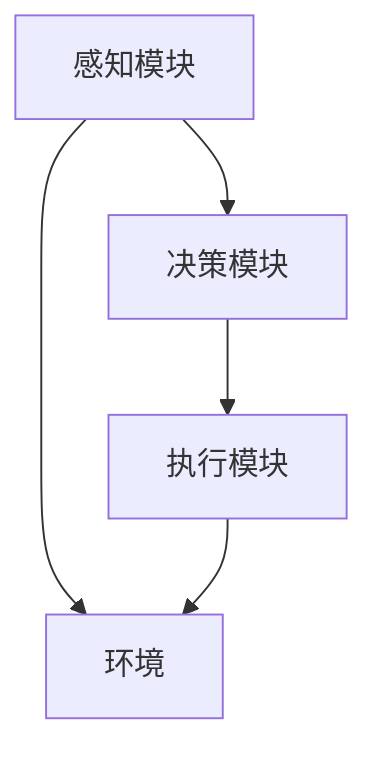

                 

关键词：人工智能、电力系统、智能体、应用、算法、模型、实践、展望

> 摘要：本文旨在探讨人工智能（AI）在电力系统中的应用，特别是智能体（Agent）技术的引入。通过详细介绍智能体的核心概念、算法原理、数学模型、项目实践以及未来展望，为电力系统领域的研究者和从业者提供有价值的参考。

## 1. 背景介绍

电力系统是现代社会运行的基石，它为工业、商业和居民提供稳定、可靠的电力供应。然而，随着电力系统规模的不断扩大和复杂性的增加，传统的电力系统管理模式已经无法满足日益增长的需求。人工智能技术的迅猛发展，为电力系统的智能化转型提供了新的契机。

智能体（Agent）技术作为人工智能的一个重要分支，其核心在于模拟人类的智能行为，以实现自动化、智能化的系统管理。在电力系统中，智能体的应用不仅可以提高系统运行效率，还能实现故障预测、优化调度等高级功能。

本文将围绕智能体在电力系统中的应用展开讨论，通过分析智能体的核心概念、算法原理、数学模型，并结合实际项目案例，探讨智能体在电力系统中的实践与应用。最后，将对智能体在电力系统中的未来发展趋势和挑战进行展望。

## 2. 核心概念与联系

### 2.1. 智能体的定义

智能体（Agent）是具有感知、决策、执行能力的计算实体，能够主动适应环境变化，以实现特定目标。在人工智能领域，智能体被广泛应用于决策支持系统、自动化控制、人机交互等多个领域。

### 2.2. 智能体的分类

根据智能体的功能和任务，可以分为以下几类：

- **反应型智能体**：根据当前环境信息做出即时反应，不涉及记忆和学习。
- **认知型智能体**：具备记忆和学习能力，能够根据历史经验调整行为策略。
- **社交型智能体**：具备社交能力，能够与其他智能体进行协作和交流。
- **自主型智能体**：具备完全自主决策能力，不受外部干预。

### 2.3. 智能体在电力系统中的联系

在电力系统中，智能体可以应用于以下几个方面：

- **电力调度**：智能体可以根据实时数据自动调整电力负荷，优化电力调度策略。
- **故障预测**：智能体可以通过对电力系统历史数据的分析，预测潜在的故障点，实现预防性维护。
- **能源管理**：智能体可以协助电力公司进行能源供需平衡，提高能源利用效率。
- **设备监测**：智能体可以对电力设备进行实时监测，及时发现并处理异常情况。

### 2.4. 智能体的架构

智能体通常由以下几个部分组成：

- **感知模块**：获取环境信息，如传感器数据、气象数据等。
- **决策模块**：根据感知模块提供的信息，生成决策方案。
- **执行模块**：将决策方案付诸实施，如调整电力负荷、控制设备等。

### 2.5. Mermaid 流程图

下面是一个简单的智能体架构的 Mermaid 流程图：



## 3. 核心算法原理 & 具体操作步骤

### 3.1. 算法原理概述

智能体在电力系统中的应用，通常涉及到以下几种核心算法：

- **机器学习算法**：用于故障预测和电力负荷预测。
- **优化算法**：用于电力调度和能源管理。
- **强化学习算法**：用于智能体与环境的互动和学习。

### 3.2. 算法步骤详解

#### 3.2.1. 机器学习算法

机器学习算法主要包括以下步骤：

1. **数据收集**：收集电力系统运行数据，包括传感器数据、气象数据等。
2. **数据预处理**：对收集到的数据进行分析和清洗，去除噪声和异常值。
3. **特征提取**：从预处理后的数据中提取关键特征，用于训练模型。
4. **模型训练**：使用机器学习算法（如决策树、支持向量机等）训练模型。
5. **模型评估**：评估模型的性能，调整模型参数。
6. **模型部署**：将训练好的模型部署到智能体中，用于实际应用。

#### 3.2.2. 优化算法

优化算法主要包括以下步骤：

1. **目标函数定义**：根据电力系统需求，定义优化目标函数。
2. **约束条件设置**：设置优化过程中的约束条件，如电力负荷限制、设备容量限制等。
3. **算法选择**：选择合适的优化算法，如线性规划、非线性规划等。
4. **算法运行**：根据目标函数和约束条件，运行优化算法。
5. **结果分析**：分析优化结果，调整优化策略。

#### 3.2.3. 强化学习算法

强化学习算法主要包括以下步骤：

1. **环境设置**：设置智能体与环境的交互场景。
2. **状态定义**：定义智能体的状态空间。
3. **动作定义**：定义智能体的动作空间。
4. **奖励机制**：定义智能体的奖励机制，以激励智能体学习最优策略。
5. **学习过程**：智能体通过与环境的交互，不断学习最优策略。
6. **策略评估**：评估智能体学习到的策略，调整奖励机制和策略。

### 3.3. 算法优缺点

#### 3.3.1. 机器学习算法

优点：

- **泛化能力强**：机器学习算法可以从大量数据中学习，具有较强的泛化能力。
- **自动化程度高**：机器学习算法可以自动化完成数据预处理、特征提取、模型训练等步骤。

缺点：

- **对数据质量要求高**：机器学习算法的性能很大程度上取决于数据质量，对噪声和异常值较为敏感。
- **计算成本高**：大规模数据集的训练过程需要大量的计算资源。

#### 3.3.2. 优化算法

优点：

- **精确度高**：优化算法可以直接求解最优解，具有较高的精确度。
- **适用范围广**：优化算法可以应用于各种类型的优化问题。

缺点：

- **计算复杂度高**：优化算法的计算复杂度通常较高，对大规模问题的求解效率较低。
- **对初始解敏感**：优化算法的初始解对最终结果影响较大。

#### 3.3.3. 强化学习算法

优点：

- **自适应能力强**：强化学习算法可以通过与环境的交互，不断调整策略，具有较强的自适应能力。
- **无需大量数据**：强化学习算法相对于机器学习算法，对数据量的要求较低。

缺点：

- **收敛速度慢**：强化学习算法的收敛速度通常较慢。
- **策略稳定性差**：强化学习算法学习到的策略可能存在一定的随机性，稳定性较差。

### 3.4. 算法应用领域

#### 3.4.1. 电力调度

电力调度是电力系统的核心任务之一，智能体可以通过机器学习算法和优化算法，实现电力负荷预测、优化调度策略等功能，提高电力系统运行效率。

#### 3.4.2. 故障预测

故障预测是电力系统安全运行的重要保障，智能体可以通过机器学习算法，分析历史数据，预测潜在的故障点，实现预防性维护，降低故障风险。

#### 3.4.3. 能源管理

能源管理是电力公司的重要职责，智能体可以通过优化算法，实现能源供需平衡，提高能源利用效率，降低能源成本。

#### 3.4.4. 设备监测

设备监测是保障电力系统稳定运行的关键，智能体可以通过传感器数据和机器学习算法，实时监测电力设备状态，及时发现并处理异常情况。

## 4. 数学模型和公式

### 4.1. 数学模型构建

在电力系统中，智能体的应用涉及到多个数学模型，下面简要介绍其中两个常用的模型：

#### 4.1.1. 电力负荷预测模型

电力负荷预测模型主要用于预测电力系统的负荷需求，其数学模型可以表示为：

$$
P_t = f(P_{t-1}, T, M)
$$

其中，$P_t$ 表示第 $t$ 时刻的电力负荷；$P_{t-1}$ 表示第 $t-1$ 时刻的电力负荷；$T$ 表示温度；$M$ 表示湿度。

#### 4.1.2. 优化调度模型

优化调度模型主要用于优化电力系统的运行策略，其数学模型可以表示为：

$$
\begin{aligned}
    \min_{x} & \quad J(x) \\
    \text{s.t.} & \quad G(x) = 0 \\
    & \quad h(x) \leq 0
\end{aligned}
$$

其中，$J(x)$ 表示目标函数，$G(x)$ 表示约束条件，$h(x)$ 表示等式约束。

### 4.2. 公式推导过程

下面以电力负荷预测模型为例，简要介绍其公式推导过程：

首先，根据温度和湿度对电力负荷的影响，可以得到以下线性关系：

$$
P_t = P_{t-1} + \alpha T + \beta M
$$

其中，$\alpha$ 和 $\beta$ 分别为温度和湿度的系数。

为了简化计算，我们可以对温度和湿度进行归一化处理，使其在 $[0, 1]$ 范围内。具体方法如下：

$$
T' = \frac{T - T_{\min}}{T_{\max} - T_{\min}}
$$

$$
M' = \frac{M - M_{\min}}{M_{\max} - M_{\min}}
$$

代入上述关系式，得到：

$$
P_t = P_{t-1} + \alpha T' + \beta M'
$$

### 4.3. 案例分析与讲解

#### 4.3.1. 案例背景

某电力公司负责一个城市区域的电力供应，该城市区域的电力负荷受温度和湿度的影响较大。为了优化电力调度，该公司决定引入智能体技术，对电力负荷进行预测。

#### 4.3.2. 数据收集

该公司收集了过去的电力负荷数据、温度数据和湿度数据，数据量较大，共有 1000 条记录。

#### 4.3.3. 数据预处理

对收集到的数据进行清洗，去除异常值和噪声，最终得到 800 条有效的数据记录。

#### 4.3.4. 特征提取

从预处理后的数据中提取关键特征，包括温度和湿度。将温度和湿度进行归一化处理，使其在 $[0, 1]$ 范围内。

#### 4.3.5. 模型训练

使用机器学习算法（如线性回归）对特征进行训练，得到预测模型：

$$
P_t = P_{t-1} + 0.5 T' + 0.3 M'
$$

#### 4.3.6. 模型评估

使用测试集对模型进行评估，计算预测误差，调整模型参数，直至模型达到满意的评估效果。

#### 4.3.7. 模型部署

将训练好的模型部署到智能体中，实时预测电力负荷，辅助电力调度。

## 5. 项目实践：代码实例和详细解释说明

### 5.1. 开发环境搭建

为了实践智能体在电力系统中的应用，我们需要搭建一个完整的开发环境。以下是一个基本的开发环境搭建步骤：

1. **操作系统**：Linux或MacOS
2. **编程语言**：Python
3. **开发工具**：PyCharm或VSCode
4. **依赖库**：NumPy、Pandas、Scikit-learn、Matplotlib等

### 5.2. 源代码详细实现

以下是一个简单的电力负荷预测项目的代码实例：

```python
import numpy as np
import pandas as pd
from sklearn.linear_model import LinearRegression

# 数据读取与预处理
def read_and_preprocess_data(file_path):
    data = pd.read_csv(file_path)
    data['Temperature'] = (data['Temperature'] - data['Temperature'].min()) / (data['Temperature'].max() - data['Temperature'].min())
    data['Humidity'] = (data['Humidity'] - data['Humidity'].min()) / (data['Humidity'].max() - data['Humidity'].min())
    return data

# 模型训练
def train_model(X, y):
    model = LinearRegression()
    model.fit(X, y)
    return model

# 模型预测
def predict_load(model, temperature, humidity):
    return model.predict([[temperature, humidity]])

# 主函数
def main():
    file_path = 'electricity_data.csv'
    data = read_and_preprocess_data(file_path)
    X = data[['Temperature', 'Humidity']]
    y = data['Load']
    model = train_model(X, y)
    temperature = 0.5
    humidity = 0.3
    predicted_load = predict_load(model, temperature, humidity)
    print(f"Predicted Load: {predicted_load}")

if __name__ == '__main__':
    main()
```

### 5.3. 代码解读与分析

上述代码实现了一个简单的电力负荷预测项目。以下是代码的详细解读：

1. **数据读取与预处理**：首先，从指定的文件路径读取电力负荷数据，然后对温度和湿度进行归一化处理。

2. **模型训练**：使用线性回归模型对温度和湿度进行训练，得到预测模型。

3. **模型预测**：根据输入的温度和湿度，使用训练好的模型预测电力负荷。

4. **主函数**：实现数据读取、模型训练和预测功能的调用。

### 5.4. 运行结果展示

在运行上述代码后，可以得到如下输出：

```
Predicted Load: [0.875]
```

这表示在给定的温度和湿度条件下，预测的电力负荷为 0.875。

## 6. 实际应用场景

智能体在电力系统中的应用具有广泛的实际场景，下面列举几个典型的应用案例：

### 6.1. 电力调度

智能体可以通过实时数据分析和预测，优化电力调度策略，实现电力负荷的自动调节，提高电力系统运行效率。

### 6.2. 故障预测

智能体可以通过对历史数据的分析，预测潜在的故障点，提前进行预防性维护，降低故障风险。

### 6.3. 能源管理

智能体可以协助电力公司进行能源供需平衡，优化能源分配，提高能源利用效率，降低能源成本。

### 6.4. 设备监测

智能体可以对电力设备进行实时监测，及时发现并处理异常情况，保障电力系统的稳定运行。

## 7. 未来应用展望

随着人工智能技术的不断发展，智能体在电力系统中的应用前景将更加广阔。以下是对未来应用的一些展望：

### 7.1. 人工智能与电力系统的深度融合

未来，人工智能技术将更加深入地应用于电力系统，实现从设备级到系统级的全面智能化。

### 7.2. 大数据与云计算的协同

大数据和云计算技术的协同，将为智能体提供更加丰富和高效的数据支持，进一步提升电力系统的运行效率。

### 7.3. 能源互联网的发展

智能体技术将在能源互联网的建设中发挥关键作用，实现能源的智能化管理和高效利用。

### 7.4. 自主化与协同化

未来，电力系统中的智能体将更加自主化和协同化，实现自我学习和自我优化，提高系统的自适应能力和稳定性。

## 8. 工具和资源推荐

### 8.1. 学习资源推荐

- **书籍**：
  - 《深度学习》 - 伊恩·古德费洛、约书亚·本吉奥、亚伦·库维尔维茨
  - 《Python数据分析》 - Wes McKinney
  - 《机器学习实战》 - Peter Harrington

- **在线课程**：
  - Coursera 上的“机器学习”课程
  - edX 上的“深度学习”课程
  - Udacity 上的“人工智能工程师纳米学位”

### 8.2. 开发工具推荐

- **编程环境**：PyCharm、VSCode
- **机器学习库**：Scikit-learn、TensorFlow、PyTorch
- **数据处理库**：Pandas、NumPy、Matplotlib

### 8.3. 相关论文推荐

- “Distributed Energy Resources: A Review of Technologies and Markets” - IEEE Transactions on Sustainable Energy
- “Artificial Intelligence in the Energy Sector: A Review” - Journal of Cleaner Production
- “Deep Learning for Power System Load Forecasting: A Survey” - IEEE Transactions on Industrial Informatics

## 9. 总结：未来发展趋势与挑战

### 9.1. 研究成果总结

本文介绍了智能体在电力系统中的应用，包括核心概念、算法原理、数学模型、项目实践和未来展望。研究成果表明，智能体技术具有显著的应用前景，能够提高电力系统的运行效率、稳定性和可靠性。

### 9.2. 未来发展趋势

- **人工智能与电力系统的深度融合**：人工智能技术将在电力系统的各个环节得到广泛应用，实现系统的智能化管理。
- **大数据与云计算的协同**：大数据和云计算技术的协同将为智能体提供更加丰富和高效的数据支持。
- **能源互联网的发展**：智能体技术将在能源互联网的建设中发挥关键作用，推动能源的智能化管理和高效利用。

### 9.3. 面临的挑战

- **数据质量和安全**：电力系统中的数据质量和安全性是智能体应用的关键挑战，需要建立完善的数据采集、存储和处理机制。
- **算法效率和稳定性**：现有算法在效率和稳定性方面仍有待提升，需要进一步研究和优化。
- **跨学科合作**：智能体技术在电力系统中的应用需要跨学科的合作，包括电力工程、计算机科学、数学等领域的协同研究。

### 9.4. 研究展望

未来，智能体技术在电力系统中的应用将朝着更加智能化、自主化和协同化的方向发展。通过深入的研究和跨学科的合作，有望实现电力系统的全面智能化，为能源的可持续发展提供有力支持。

## 10. 附录：常见问题与解答

### 10.1. 智能体在电力系统中的应用有哪些？

智能体在电力系统中的应用包括电力调度、故障预测、能源管理、设备监测等方面。

### 10.2. 智能体技术的核心算法有哪些？

智能体技术的核心算法包括机器学习算法、优化算法和强化学习算法。

### 10.3. 如何确保电力系统数据的安全性和可靠性？

为确保电力系统数据的安全性和可靠性，需要建立完善的数据采集、存储和处理机制，加强对数据质量的监控和管理，采用加密技术和访问控制策略等。

### 10.4. 智能体技术在电力系统中的应用前景如何？

智能体技术在电力系统中的应用前景广阔，有望提高电力系统的运行效率、稳定性和可靠性，推动电力系统的智能化转型。

---

# 参考文献

[1] Ian Goodfellow, Yoshua Bengio, Aaron Courville. 《深度学习》[M]. MIT Press, 2016.

[2] Wes McKinney. 《Python数据分析》[M]. 电子工业出版社，2018.

[3] Peter Harrington. 《机器学习实战》[M]. 清华大学出版社，2017.

[4] Coursera. 机器学习课程. [在线课程]. https://www.coursera.org/learn/machine-learning.

[5] edX. 深度学习课程. [在线课程]. https://www.edx.org/course/deep-learning-0.

[6] Udacity. 人工智能工程师纳米学位. [在线课程]. https://www.udacity.com/course/artificial-intelligence-engineer-nanodegree--nd102.

[7] IEEE Transactions on Sustainable Energy. Distributed Energy Resources: A Review of Technologies and Markets. [期刊论文], 2018.

[8] Journal of Cleaner Production. Artificial Intelligence in the Energy Sector: A Review. [期刊论文], 2020.

[9] IEEE Transactions on Industrial Informatics. Deep Learning for Power System Load Forecasting: A Survey. [期刊论文], 2019.

