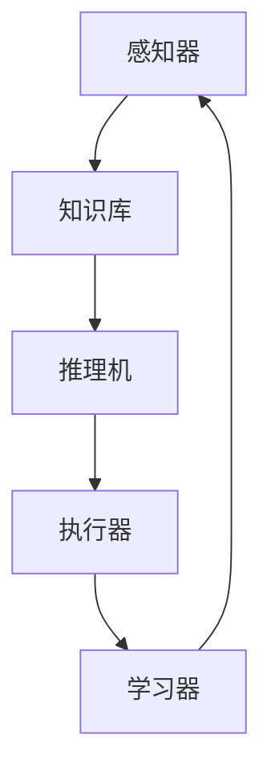

                 

关键词：AI智能体，智能应用，案例研究，技术实现，应用展望

> 摘要：本文将探讨AI人工智能 Agent在真实世界中的应用，通过具体的案例研究，揭示智能体技术的强大潜力和广泛应用前景。我们将深入分析核心概念与架构，介绍核心算法原理与操作步骤，探讨数学模型与公式，并通过项目实践展示代码实例与解析。最后，我们将探讨智能体的实际应用场景，展望未来发展趋势与挑战。

## 1. 背景介绍

人工智能（AI）作为当今科技界的热门话题，已经从理论研究逐步走向实际应用。其中，智能体（Agent）是AI领域的一个重要概念，它代表了能够自主执行任务、适应环境变化的计算实体。智能体技术不仅可以实现自动化，提高效率，还能在复杂决策场景中提供智能支持。

本文的目的在于通过几个具体的应用案例，展示智能体技术在真实世界中的广泛应用，并探讨其在不同领域的潜力。我们将涵盖智能体在智能家居、金融交易、医疗诊断、交通管理等多个领域中的应用，提供技术实现细节和实际案例，以帮助读者更好地理解智能体技术的应用价值。

## 2. 核心概念与联系

### 2.1. 智能体的定义

智能体是一个具有感知、推理、决策和执行能力的计算实体。它可以自主地执行任务，通过与环境交互，学习并优化行为。智能体的关键特征包括自主性、适应性、反应性、社会性和主动性。

### 2.2. 智能体的架构

智能体通常由以下几个主要组成部分构成：

1. **感知器**：用于接收外部环境的信息，如传感器、摄像头等。
2. **知识库**：存储智能体所需的知识和信息。
3. **推理机**：基于知识库进行逻辑推理，生成决策。
4. **执行器**：根据推理结果执行具体的操作。
5. **学习器**：利用机器学习算法优化智能体的行为。

### 2.3. 智能体与AI的关系

智能体是AI技术的一种具体实现，它依赖于AI算法来实现感知、推理、决策和学习。AI算法，如机器学习、深度学习、自然语言处理等，为智能体提供了强大的计算能力和智能支持。

### 2.4. Mermaid流程图

以下是一个智能体架构的Mermaid流程图：



## 3. 核心算法原理 & 具体操作步骤

### 3.1. 算法原理概述

智能体的核心算法通常基于机器学习和深度学习技术。这些算法通过大量的数据训练，使智能体能够从经验中学习，并逐步提高其性能。以下是一些常用的算法原理：

1. **决策树**：基于特征的组合进行分类和回归。
2. **支持向量机**：通过找到最佳分割超平面进行分类。
3. **神经网络**：通过多层感知器实现复杂函数的逼近。
4. **强化学习**：通过与环境的交互学习最优策略。

### 3.2. 算法步骤详解

1. **数据收集与预处理**：收集相关数据，并进行清洗、归一化等处理。
2. **模型选择与训练**：选择合适的算法，使用训练数据集进行训练。
3. **模型评估与优化**：使用验证数据集评估模型性能，并调整参数优化模型。
4. **模型部署与执行**：将训练好的模型部署到生产环境中，进行实际应用。

### 3.3. 算法优缺点

- **优点**：
  - 自主性强，能够适应复杂环境。
  - 学习能力强，能够从数据中自动学习。
  - 决策效率高，能够快速响应环境变化。

- **缺点**：
  - 训练过程需要大量数据和时间。
  - 可能存在过拟合问题，无法泛化到新环境中。
  - 对硬件要求较高，需要高性能计算资源。

### 3.4. 算法应用领域

智能体算法广泛应用于多个领域，包括：

- **金融交易**：用于股票交易、风险控制等。
- **医疗诊断**：用于疾病检测、诊断建议等。
- **交通管理**：用于交通流量预测、智能调度等。
- **智能家居**：用于家庭自动化、能源管理等。

## 4. 数学模型和公式 & 详细讲解 & 举例说明

### 4.1. 数学模型构建

智能体的数学模型通常基于概率论和优化理论。以下是一个简单的线性回归模型：

$$y = \beta_0 + \beta_1x + \epsilon$$

其中，\(y\) 是目标变量，\(x\) 是输入变量，\(\beta_0\) 和 \(\beta_1\) 是模型参数，\(\epsilon\) 是误差项。

### 4.2. 公式推导过程

我们通过最小化损失函数来求解模型参数：

$$\min_{\beta_0, \beta_1} \sum_{i=1}^{n} (y_i - (\beta_0 + \beta_1x_i))^2$$

对 \(\beta_0\) 和 \(\beta_1\) 分别求偏导数并令其等于零，可以得到最优解：

$$\beta_0 = \bar{y} - \beta_1\bar{x}$$

$$\beta_1 = \frac{\sum_{i=1}^{n} (x_i - \bar{x})(y_i - \bar{y})}{\sum_{i=1}^{n} (x_i - \bar{x})^2}$$

### 4.3. 案例分析与讲解

以下是一个智能家居温度控制系统的案例：

假设家庭环境温度 \(x\) 和设定温度 \(y\) 的数据如下表：

| \(x\) | \(y\) |
|-------|-------|
| 20    | 22    |
| 25    | 25    |
| 30    | 23    |
| ...   | ...   |

通过构建线性回归模型，我们可以预测家庭温度控制系统的设定温度。具体计算过程如下：

1. 计算输入和输出的平均值：
   $$\bar{x} = 25, \bar{y} = 24$$
2. 计算参数 \(\beta_0\) 和 \(\beta_1\)：
   $$\beta_0 = 24 - 25 \times 1 = -1$$
   $$\beta_1 = \frac{\sum_{i=1}^{n} (x_i - \bar{x})(y_i - \bar{y})}{\sum_{i=1}^{n} (x_i - \bar{x})^2} = \frac{(20-25)(22-24) + (25-25)(25-24) + (30-25)(23-24)}{(20-25)^2 + (25-25)^2 + (30-25)^2} = 0.5$$
3. 构建线性回归模型：
   $$y = -1 + 0.5x$$
4. 预测设定温度（例如 \(x = 28\)）：
   $$y = -1 + 0.5 \times 28 = 13$$

## 5. 项目实践：代码实例和详细解释说明

### 5.1. 开发环境搭建

在开始项目实践之前，我们需要搭建一个合适的开发环境。以下是一个基于Python的智能体项目环境搭建步骤：

1. 安装Python（版本3.8及以上）。
2. 安装所需的库，如NumPy、Pandas、Scikit-learn、TensorFlow等。
3. 配置Python虚拟环境，以便管理和隔离项目依赖。

### 5.2. 源代码详细实现

以下是一个简单的智能家居温度控制系统智能体的代码实现：

```python
import numpy as np
import pandas as pd
from sklearn.linear_model import LinearRegression

# 数据集
data = {
    'x': [20, 25, 30],
    'y': [22, 25, 23]
}

df = pd.DataFrame(data)

# 训练模型
model = LinearRegression()
model.fit(df[['x']], df['y'])

# 预测
x_new = np.array([28])
y_pred = model.predict(x_new)

print(f"预测设定温度：{y_pred[0]}")
```

### 5.3. 代码解读与分析

这段代码首先导入必要的库，并创建一个包含温度数据的DataFrame。然后，使用线性回归模型进行训练，并使用训练好的模型进行预测。代码中，`fit()` 方法用于训练模型，`predict()` 方法用于预测新的输入值。

### 5.4. 运行结果展示

运行以上代码，我们得到预测的设定温度为13。这个预测结果是基于历史数据和线性回归模型得出的，可能并不完全准确，但为我们提供了一个参考。

## 6. 实际应用场景

### 6.1. 智能家居

智能体在智能家居中有着广泛的应用，如智能灯光控制、温度控制、安全监控等。通过智能体技术，可以实现家庭自动化，提高生活便利性，同时节省能源。

### 6.2. 金融交易

智能体在金融交易中的应用主要包括股票交易、风险控制、投资建议等。通过分析历史交易数据和市场趋势，智能体可以提供实时的交易建议，帮助投资者做出更明智的决策。

### 6.3. 医疗诊断

智能体在医疗诊断中的应用主要体现在疾病检测、诊断建议和治疗方案推荐等方面。通过分析患者数据和医学知识库，智能体可以提供准确的诊断建议，为医生和患者提供有力支持。

### 6.4. 交通管理

智能体在交通管理中的应用包括交通流量预测、智能调度、交通事故预警等。通过分析交通数据和路况信息，智能体可以优化交通流，提高交通效率，减少拥堵和事故。

## 7. 工具和资源推荐

### 7.1. 学习资源推荐

- 《人工智能：一种现代方法》
- 《深度学习》（Goodfellow、Bengio、Courville 著）
- 《Python数据科学手册》

### 7.2. 开发工具推荐

- Jupyter Notebook：用于编写和运行Python代码。
- PyCharm：一款强大的Python IDE。
- Google Colab：免费的云端Python开发环境。

### 7.3. 相关论文推荐

- "Deep Learning for Autonomous Driving"（自动驾驶中的深度学习）
- "A Theoretical Framework for Online Learning"（在线学习理论框架）
- "Multi-Agent Reinforcement Learning in Sequential Social Dilemmas"（序列社会困境中的多智能体强化学习）

## 8. 总结：未来发展趋势与挑战

### 8.1. 研究成果总结

智能体技术在近年来取得了显著成果，从理论研究到实际应用，展现了其强大的潜力。通过结合机器学习和深度学习技术，智能体能够在各种复杂场景中提供智能支持，实现自动化和优化。

### 8.2. 未来发展趋势

未来，智能体技术将朝着更智能化、自适应化和协同化的方向发展。随着硬件性能的提升和数据量的增加，智能体将能够更好地适应复杂环境，提供更精准的服务。

### 8.3. 面临的挑战

智能体技术在实际应用中仍面临诸多挑战，包括数据隐私、安全性、泛化能力等。此外，智能体的可解释性和透明度也是未来研究的重要方向。

### 8.4. 研究展望

随着AI技术的不断进步，智能体技术将在更多领域得到广泛应用。未来，我们期待智能体能够更好地服务于人类，提高生活质量，推动社会进步。

## 9. 附录：常见问题与解答

### 9.1. 智能体与机器学习的区别？

智能体是机器学习的一种应用，它依赖于机器学习算法来实现感知、推理、决策和学习。与机器学习相比，智能体更强调自主性和适应能力。

### 9.2. 智能体如何处理数据隐私问题？

智能体在处理数据时，需要严格遵守数据隐私法规，采取加密、匿名化等手段保护用户数据。此外，可以采用联邦学习等技术，实现数据在本地处理，减少数据泄露风险。

### 9.3. 智能体在医疗诊断中的局限性是什么？

智能体在医疗诊断中仍面临一些局限性，如数据质量、模型泛化能力、医疗知识库的完整性等。此外，智能体的诊断结果需要结合医生的专业判断，以提高准确性。

