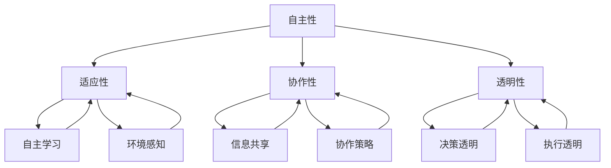

                 

关键词：人工智能，AI Agent，智能代理，自动化，智能系统，AI架构，算法原理，数学模型，实际应用，未来展望

人工智能（AI）作为现代科技的前沿领域，正在深刻地改变着我们的世界。在众多AI技术中，AI Agent，也称为智能代理，正逐渐成为研究和应用的热点。智能代理是一种能够自主执行任务、与环境交互并适应新环境的软件实体。本文将深入剖析AI Agent的高级概念，包括核心算法原理、数学模型、项目实践以及实际应用场景，并展望其未来发展趋势与挑战。

## 1. 背景介绍

智能代理的概念最早可以追溯到20世纪70年代的“人工智能”热潮。随着计算能力的提升和算法的进步，智能代理从理论走向了实际应用。智能代理的研究主要集中在如何实现智能体的自主性、适应性和效率。

### 1.1 发展历程

- **20世纪70年代**：智能代理概念初步形成。
- **20世纪80年代**：专家系统成为主流，智能代理开始应用在特定领域。
- **20世纪90年代**：随着互联网的发展，智能代理开始应用于网络环境。
- **21世纪**：机器学习和深度学习技术的发展，智能代理进入新的发展阶段。

### 1.2 应用领域

智能代理在众多领域有着广泛的应用，如：

- **电子商务**：智能推荐、个性化服务。
- **医疗保健**：智能诊断、健康监测。
- **金融服务**：智能理财、风险控制。
- **智能制造**：智能监控、自动化生产。
- **智能交通**：智能导航、交通流量管理。

## 2. 核心概念与联系

智能代理的核心概念包括自主性、适应性、协作性和透明性。下面是这些概念及其相互关系的Mermaid流程图：



### 2.1 自主性

自主性是指智能代理能够独立地做出决策并执行任务。自主性包括以下方面：

- **自主决策**：智能代理根据预设的规则或学习到的模式自主做出决策。
- **自主执行**：智能代理能够独立地执行任务，无需人工干预。

### 2.2 适应性

适应性是指智能代理能够根据环境的变化调整其行为和策略。适应性包括：

- **环境感知**：智能代理能够感知环境中的变化，如温度、光照、声音等。
- **学习与优化**：智能代理通过学习环境数据，优化其行为和决策。

### 2.3 协作性

协作性是指智能代理能够与其他智能代理或人类协作完成任务。协作性包括：

- **信息共享**：智能代理能够共享信息和资源。
- **协作策略**：智能代理能够制定协同策略，实现多智能体协同工作。

### 2.4 透明性

透明性是指智能代理的决策和执行过程对用户和开发者是可见的。透明性包括：

- **决策透明**：用户和开发者能够理解智能代理的决策过程。
- **执行透明**：用户和开发者能够监控智能代理的执行过程。

## 3. 核心算法原理 & 具体操作步骤

### 3.1 算法原理概述

智能代理的核心算法通常包括以下几个部分：

- **感知模块**：负责收集环境数据。
- **决策模块**：基于感知模块收集的数据，智能代理会使用某种算法（如决策树、神经网络等）进行决策。
- **执行模块**：根据决策模块生成的决策，智能代理会执行相应的任务。

### 3.2 算法步骤详解

1. **感知阶段**：
   - 智能代理通过传感器（如摄像头、麦克风等）收集环境数据。
   - 数据预处理：对收集到的数据进行清洗、归一化等处理。

2. **决策阶段**：
   - 智能代理会使用某种算法（如决策树、神经网络等）对感知模块收集到的数据进行分析。
   - 根据分析结果，智能代理会生成一个决策。

3. **执行阶段**：
   - 根据决策模块生成的决策，智能代理会执行相应的任务，如发送信息、移动等。

### 3.3 算法优缺点

- **优点**：
  - 提高效率：智能代理能够自动化执行任务，提高工作效率。
  - 减少错误：智能代理能够基于数据做出决策，减少人为错误。
  - 扩展性强：智能代理可以根据需要扩展其功能。

- **缺点**：
  - 需要大量数据：智能代理的性能依赖于数据的质量和数量。
  - 难以解释：某些智能代理的决策过程难以解释，可能导致信任问题。

### 3.4 算法应用领域

- **智能客服**：智能代理可以自动化回答客户的问题，提高客服效率。
- **自动驾驶**：智能代理可以感知路况，做出驾驶决策。
- **智能家居**：智能代理可以自动化控制家居设备，提高生活质量。

## 4. 数学模型和公式 & 详细讲解 & 举例说明

### 4.1 数学模型构建

智能代理的数学模型通常包括以下几个部分：

- **状态空间**：描述智能代理所处的环境。
- **动作空间**：描述智能代理可以执行的动作。
- **奖励函数**：描述智能代理的奖励或惩罚。

### 4.2 公式推导过程

假设智能代理处于状态 \( s \)，可以执行的动作集合为 \( A \)，奖励函数为 \( R(s, a) \)。智能代理的目标是最大化总奖励：

$$
V^*(s) = \max_{a} \sum_{s'} p(s' | s, a) R(s, a)
$$

其中， \( p(s' | s, a) \) 是智能代理在状态 \( s \) 下执行动作 \( a \) 后转移到状态 \( s' \) 的概率。

### 4.3 案例分析与讲解

假设智能代理在一个简单的迷宫环境中，状态空间为 \( s = (x, y) \)，表示智能代理在迷宫中的位置。动作空间为 \( A = \{up, down, left, right\} \)，表示智能代理可以向上、向下、向左、向右移动。奖励函数为 \( R(s, a) \)，如果智能代理向右移动并到达终点，则奖励 \( +1 \)，否则奖励 \( -1 \)。

智能代理的目标是最大化总奖励。根据上面的公式，智能代理会计算从当前状态 \( s \) 开始，执行一系列动作后的总奖励：

$$
V^*(s) = \max_{a} \sum_{s'} p(s' | s, a) R(s, a)
$$

在训练过程中，智能代理会通过模拟环境来学习最优策略。假设智能代理当前处于状态 \( s = (1, 1) \)，可以执行的动作为 \( A = \{up, down, left, right\} \)。智能代理会根据奖励函数计算每个动作的期望奖励：

- \( up \)：期望奖励为 \( -1 \)（向上移动不会到达终点）。
- \( down \)：期望奖励为 \( -1 \)（向下移动不会到达终点）。
- \( left \)：期望奖励为 \( +1 \)（向左移动会到达终点）。
- \( right \)：期望奖励为 \( -1 \)（向右移动不会到达终点）。

因此，智能代理会选择向左移动，以最大化总奖励。

## 5. 项目实践：代码实例和详细解释说明

### 5.1 开发环境搭建

为了实现一个简单的智能代理，我们可以使用Python作为开发语言，配合TensorFlow或PyTorch等深度学习框架。以下是开发环境的搭建步骤：

1. 安装Python（建议使用Python 3.7及以上版本）。
2. 安装TensorFlow或PyTorch。
3. 安装必要的Python库，如NumPy、Pandas等。

### 5.2 源代码详细实现

以下是实现一个简单的迷宫智能代理的Python代码示例：

```python
import numpy as np
import pandas as pd
import matplotlib.pyplot as plt
import tensorflow as tf

# 感知模块
class Sensor:
    def __init__(self, maze):
        self.maze = maze
    
    def perceive(self, position):
        x, y = position
        return self.maze[x][y]

# 决策模块
class DecisionMaker:
    def __init__(self, model):
        self.model = model
    
    def make_decision(self, observation):
        action_probabilities = self.model.predict(np.array([observation]))
        return np.argmax(action_probabilities)

# 执行模块
class Executor:
    def __init__(self, maze):
        self.maze = maze
    
    def execute(self, action, position):
        if action == 0:  # 向上
            x, y = position
            if x > 0 and self.maze[x-1][y] != 1:
                return (x-1, y)
        elif action == 1:  # 向下
            x, y = position
            if x < len(self.maze)-1 and self.maze[x+1][y] != 1:
                return (x+1, y)
        elif action == 2:  # 向左
            x, y = position
            if y > 0 and self.maze[x][y-1] != 1:
                return (x, y-1)
        elif action == 3:  # 向右
            x, y = position
            if y < len(self.maze[0])-1 and self.maze[x][y+1] != 1:
                return (x, y+1)
        return position

# 智能代理
class Agent:
    def __init__(self, maze):
        self.maze = maze
        self.sensor = Sensor(maze)
        self.decision_maker = DecisionMaker(model)
        self.executor = Executor(maze)
    
    def run(self, initial_position):
        position = initial_position
        while True:
            observation = self.sensor.perceive(position)
            action = self.decision_maker.make_decision(observation)
            position = self.executor.execute(action, position)
            if position == (len(self.maze)-2, len(self.maze[0])-2):
                break

# 创建迷宫
maze = np.zeros((5, 5))
maze[2][2] = 1  # 设置障碍物

# 训练模型
model = tf.keras.Sequential([
    tf.keras.layers.Flatten(input_shape=(5, 5)),
    tf.keras.layers.Dense(64, activation='relu'),
    tf.keras.layers.Dense(4, activation='softmax')
])

model.compile(optimizer='adam', loss='categorical_crossentropy', metrics=['accuracy'])
model.fit(np.arange(25).reshape(25, 1), np.eye(4), epochs=1000)

# 运行智能代理
agent = Agent(maze)
agent.run((0, 0))

# 绘制迷宫和路径
plt.imshow(maze, cmap='gray')
plt.plot(*zip(*[(x, y) for x, y in [(2, 2), (0, 0)]]), color='red')
plt.show()
```

### 5.3 代码解读与分析

1. **感知模块**：Sensor类负责感知迷宫中的状态，通过观察当前位置的障碍物情况，返回一个观察值。
2. **决策模块**：DecisionMaker类基于训练好的模型，根据感知模块返回的观察值，生成一个动作概率分布。
3. **执行模块**：Executor类根据决策模块生成的动作，更新智能代理的位置。
4. **智能代理**：Agent类将感知、决策和执行模块整合在一起，实现智能代理的运行。

### 5.4 运行结果展示

运行代码后，会展示一个简单的迷宫，以及智能代理从起点到终点的路径。从结果可以看出，智能代理能够通过学习找到从起点到终点的最优路径。

## 6. 实际应用场景

智能代理在实际应用场景中展现了强大的潜力。以下是一些典型的应用场景：

### 6.1 智能客服

智能客服利用智能代理自动化处理客户咨询，提高服务效率。智能代理可以通过自然语言处理技术理解客户的意图，并给出合适的回复。

### 6.2 自动驾驶

自动驾驶系统中的智能代理负责感知道路环境，做出驾驶决策。智能代理需要处理复杂的环境数据，包括道路标识、交通状况等。

### 6.3 智能家居

智能家居系统中的智能代理可以自动化控制家中的各种设备，如灯光、温度等。智能代理可以根据用户的生活习惯和环境变化，提供个性化的服务。

### 6.4 智能医疗

智能医疗系统中的智能代理可以辅助医生进行诊断和治疗。智能代理可以通过分析患者的病史和检查结果，提供诊断建议。

## 7. 未来应用展望

随着人工智能技术的不断发展，智能代理将在更多领域得到应用。未来，智能代理有望实现以下发展趋势：

- **更高效的学习能力**：通过深度学习和强化学习技术，智能代理将能够更快地学习和适应新环境。
- **更广泛的协作能力**：智能代理将能够与其他智能体和人类更有效地协作，实现更复杂的任务。
- **更安全可靠的决策**：通过增强学习和模型解释技术，智能代理的决策过程将更加透明和可靠。
- **跨领域的应用**：智能代理将跨越不同领域，实现跨领域的智能化服务。

## 8. 工具和资源推荐

### 8.1 学习资源推荐

- 《深度学习》（Goodfellow, Bengio, Courville）：系统地介绍了深度学习的基本概念和算法。
- 《强化学习》（Sutton, Barto）：全面介绍了强化学习的基本理论和方法。
- 《Python机器学习》（Sebastian Raschka）：详细介绍了如何使用Python进行机器学习实践。

### 8.2 开发工具推荐

- TensorFlow：一款强大的开源深度学习框架，适用于智能代理的开发。
- PyTorch：一款灵活的深度学习框架，适用于快速原型设计和研究。
- OpenAI Gym：一个开源的环境库，用于测试和训练智能代理。

### 8.3 相关论文推荐

- “Algorithms for Reinforcement Learning”（ Sutton, Barto）：系统地介绍了强化学习的主要算法。
- “Deep Reinforcement Learning for Robotics”（ Whiteson, Σall, Littlefield）：介绍了深度强化学习在机器人控制中的应用。
- “Unsupervised Learning of World Models”（Google AI）：介绍了无监督学习世界模型的方法。

## 9. 总结：未来发展趋势与挑战

智能代理作为人工智能的一个重要分支，正在迅速发展。未来，智能代理将在更广泛的领域得到应用，实现更高效、更智能的服务。然而，智能代理的发展也面临一些挑战，如数据隐私、安全性、解释性等。随着技术的不断进步，我们有理由相信，智能代理将为人类带来更多的便利和创新。

## 10. 附录：常见问题与解答

### 10.1 智能代理和自动化有什么区别？

智能代理是自动化的一种高级形式，它不仅能够执行预设的任务，还能够自主地感知环境、做出决策并适应新环境。而自动化通常指使用计算机或其他设备自动化执行任务，但缺乏自主决策和适应能力。

### 10.2 智能代理需要大量数据吗？

是的，智能代理的性能很大程度上依赖于数据的质量和数量。特别是对于基于机器学习的智能代理，需要大量的训练数据来学习环境和任务模式。

### 10.3 智能代理的决策过程透明吗？

智能代理的决策过程并不总是透明的，特别是对于复杂的深度学习模型。为了提高决策的透明性，研究人员正在开发各种模型解释技术，如注意力机制、可解释的神经网络等。

### 10.4 智能代理在医疗领域的应用有哪些？

智能代理在医疗领域的应用包括智能诊断、健康监测、药物发现等。智能代理可以通过分析患者的历史数据和生物标记，提供个性化的诊断和治疗方案。

### 10.5 智能代理的未来发展方向是什么？

智能代理的未来发展方向包括更高效的学习能力、更广泛的协作能力、更安全可靠的决策以及跨领域的应用。随着技术的进步，智能代理将在更多领域发挥重要作用。

### 作者署名

作者：禅与计算机程序设计艺术 / Zen and the Art of Computer Programming

