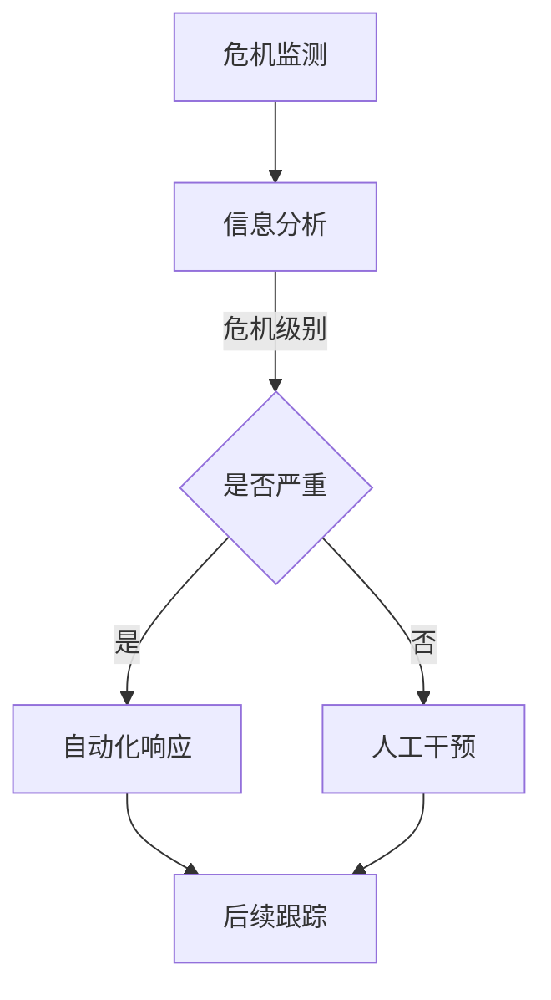
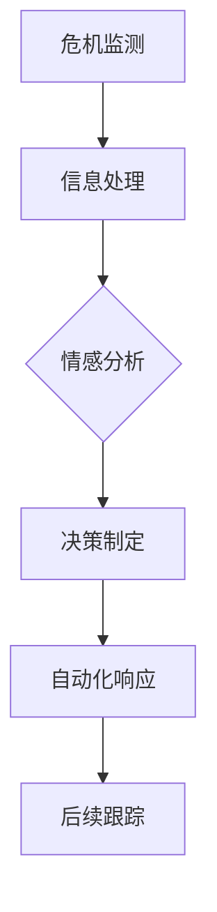

                 

关键词：AI代理、工作流、公关危机管理、自动化、智能化

>摘要：本文将探讨AI代理工作流（AI Agent WorkFlow）在公关危机管理中的应用。通过分析其核心概念、算法原理、数学模型及实际项目实践，揭示AI代理工作流如何提高危机响应效率、降低人工干预，为企业的公关危机管理提供智能化解决方案。

## 1. 背景介绍

随着互联网的快速发展，企业面临的公关危机事件日益增多，危机传播速度极快，给企业带来了巨大的挑战。传统的公关危机管理方式往往依赖于人工干预，处理速度慢，效果不佳。为了提高危机响应效率，降低人工干预成本，AI代理工作流作为一种新兴的智能化解决方案，应运而生。

AI代理工作流（AI Agent WorkFlow）是一种基于人工智能技术的自动化流程管理工具，通过模拟人类思维和行为，实现对复杂任务的自动化处理。在公关危机管理中，AI代理工作流可以承担大量重复性、低价值的工作，从而提高危机响应的效率和质量。

## 2. 核心概念与联系

### 2.1 AI代理

AI代理（AI Agent）是一种基于人工智能技术的虚拟代理，可以模拟人类进行思考、决策和行动。在公关危机管理中，AI代理可以担任以下角色：

1. 信息收集与分析：AI代理可以实时获取互联网上的相关信息，对危机事件进行初步分析，提供关键信息。
2. 情感分析：AI代理可以通过情感分析技术，了解公众对危机事件的态度和情感倾向，为决策提供参考。
3. 自动化响应：AI代理可以根据预设的规则和策略，自动生成回应内容，进行危机公关。

### 2.2 工作流

工作流（WorkFlow）是一种用于描述工作过程和任务分配的流程图。在公关危机管理中，工作流可以定义为：

1. 危机监测：实时监测互联网上的相关信息，发现危机事件。
2. 信息分析：对危机事件进行初步分析，确定危机级别。
3. 决策制定：根据危机级别和公众情感倾向，制定应对策略。
4. 自动化响应：执行决策，进行危机公关。
5. 后续跟踪：对危机事件进行持续跟踪，评估公关效果。

### 2.3 Mermaid 流程图

下面是一个简单的公关危机管理流程图，使用Mermaid语法表示：



## 3. 核心算法原理 & 具体操作步骤

### 3.1 算法原理概述

AI代理工作流的核心算法主要包括以下几个方面：

1. 信息收集与处理：使用爬虫技术收集互联网上的相关信息，使用自然语言处理技术进行信息处理和筛选。
2. 情感分析：使用情感分析技术对公众的情感倾向进行识别和分析。
3. 决策制定：基于情感分析和危机级别，制定应对策略。
4. 自动化响应：根据决策，自动生成回应内容，并发布到社交媒体平台。

### 3.2 算法步骤详解

1. **危机监测**：
   - 使用爬虫技术实时监测互联网上的相关信息。
   - 对收集到的信息进行初步筛选，提取出与危机事件相关的关键词。

2. **信息分析**：
   - 使用自然语言处理技术对关键词进行语义分析，提取出关键信息。
   - 根据信息的重要性和紧急程度，对危机事件进行初步评估。

3. **情感分析**：
   - 使用情感分析技术，对公众的情感倾向进行识别和分析。
   - 将分析结果反馈给决策模块，为决策提供依据。

4. **决策制定**：
   - 根据危机级别和公众情感倾向，制定应对策略。
   - 策略包括：及时回应、澄清事实、公开道歉、转移公众注意力等。

5. **自动化响应**：
   - 根据决策，自动生成回应内容。
   - 将回应内容发布到社交媒体平台，如微博、微信等。

6. **后续跟踪**：
   - 对危机事件进行持续跟踪，评估公关效果。
   - 根据反馈调整应对策略。

### 3.3 算法优缺点

**优点**：
1. 提高危机响应速度：AI代理可以实时监测、分析和响应危机事件，大幅缩短响应时间。
2. 降低人工干预：AI代理可以自动完成大部分工作，降低人工干预，节省人力资源。
3. 提高公关效果：通过情感分析和智能化决策，提高危机公关的针对性和有效性。

**缺点**：
1. 对数据质量和算法精度要求高：危机监测、情感分析等环节对数据质量和算法精度有较高要求。
2. 无法替代人工判断：在复杂或突发情况下，仍需人工进行判断和决策。

### 3.4 算法应用领域

AI代理工作流可以应用于以下领域：

1. 企业公关危机管理：帮助企业快速、有效地应对公关危机。
2. 政府舆情监测：实时监测互联网上的舆情动态，为政府决策提供参考。
3. 社交媒体运营：自动化处理社交媒体上的负面信息，提高品牌形象。

## 4. 数学模型和公式 & 详细讲解 & 举例说明

### 4.1 数学模型构建

在公关危机管理中，可以构建以下数学模型：

1. **危机评估模型**：用于对危机事件进行初步评估，判断危机级别。
   - $$C_i = f(K_i, T_i)$$
   - 其中，$C_i$表示危机级别，$K_i$表示关键词重要性，$T_i$表示时间敏感度。

2. **情感分析模型**：用于分析公众的情感倾向。
   - $$E_a = g(W, S)$$
   - 其中，$E_a$表示情感倾向，$W$表示关键词权重，$S$表示句子情感得分。

3. **决策模型**：用于根据危机级别和公众情感倾向，制定应对策略。
   - $$D = h(C_i, E_a)$$
   - 其中，$D$表示决策结果，$C_i$表示危机级别，$E_a$表示情感倾向。

### 4.2 公式推导过程

**危机评估模型推导**：

根据关键词重要性和时间敏感度，可以设定以下权重：

- $K_i$：关键词重要性，取值范围[0, 1]。
- $T_i$：时间敏感度，取值范围[0, 1]。

危机级别$C_i$可以表示为关键词重要性和时间敏感度的线性组合：

- $$C_i = K_i \times T_i$$

**情感分析模型推导**：

假设句子$S$中包含多个关键词$W$，每个关键词$W$的权重为$p_w$，句子情感得分为$s$。

- $$s = \sum_{w \in W} p_w \times s_w$$

其中，$s_w$表示关键词$w$的情感得分，可以取值为[-1, 1]。

**决策模型推导**：

根据危机级别$C_i$和情感倾向$E_a$，可以设定以下决策规则：

- 当$C_i \leq 0.5$且$E_a \geq 0$时，决策结果为$D_1$（及时回应）。
- 当$C_i \geq 0.5$或$E_a < 0$时，决策结果为$D_2$（澄清事实、公开道歉等）。

### 4.3 案例分析与讲解

**案例1**：某公司被曝出产品质量问题，引发公众关注。

- **危机监测**：使用爬虫技术，收集互联网上的相关信息。
- **信息分析**：提取出关键词，如“产品质量”、“投诉”等。
- **情感分析**：分析公众情感，发现大部分评论为负面。
- **决策制定**：根据危机级别和公众情感，决定及时回应，澄清事实。
- **自动化响应**：生成回应内容，发布到社交媒体平台。

**案例2**：某明星被曝出涉嫌不当行为，引发舆论哗然。

- **危机监测**：使用爬虫技术，收集互联网上的相关信息。
- **信息分析**：提取出关键词，如“明星”、“不当行为”等。
- **情感分析**：分析公众情感，发现大部分评论为负面。
- **决策制定**：根据危机级别和公众情感，决定公开道歉，转移公众注意力。
- **自动化响应**：生成回应内容，发布到社交媒体平台，同时发起公益项目。

## 5. 项目实践：代码实例和详细解释说明

### 5.1 开发环境搭建

为了实践AI代理工作流，我们需要搭建以下开发环境：

1. Python 3.8及以上版本
2. Scikit-learn 0.22.2及以上版本
3. NLTK 3.5及以上版本
4. pandas 1.2.3及以上版本
5. BeautifulSoup 4.9.3及以上版本

安装相关依赖库：

```bash
pip install scikit-learn nltk pandas beautifulsoup4
```

### 5.2 源代码详细实现

以下是AI代理工作流的核心代码实现：

```python
import nltk
from nltk.corpus import stopwords
from sklearn.feature_extraction.text import TfidfVectorizer
from sklearn.linear_model import LogisticRegression
import pandas as pd

# 1. 危机监测
def monitor_crisis():
    # 使用BeautifulSoup爬取网页内容
    # ...
    return raw_data

# 2. 信息处理
def process_data(raw_data):
    # 使用NLTK进行分词、去除停用词等操作
    # ...
    return processed_data

# 3. 情感分析
def sentiment_analysis(processed_data):
    # 使用Scikit-learn进行情感分析
    # ...
    return sentiment_scores

# 4. 决策制定
def make_decision(sentiment_scores):
    # 根据情感得分制定决策
    # ...
    return decision

# 5. 自动化响应
def automate_response(decision):
    # 根据决策生成回应内容
    # ...
    return response_content

if __name__ == "__main__":
    raw_data = monitor_crisis()
    processed_data = process_data(raw_data)
    sentiment_scores = sentiment_analysis(processed_data)
    decision = make_decision(sentiment_scores)
    response_content = automate_response(decision)
    print(response_content)
```

### 5.3 代码解读与分析

1. **危机监测**：
   - 使用BeautifulSoup爬取网页内容，获取与危机事件相关的原始数据。

2. **信息处理**：
   - 使用NLTK进行分词、去除停用词等操作，对原始数据进行预处理。

3. **情感分析**：
   - 使用Scikit-learn中的LogisticRegression进行情感分析，将处理后的文本数据转化为情感得分。

4. **决策制定**：
   - 根据情感得分制定决策，决策结果可以是及时回应、澄清事实等。

5. **自动化响应**：
   - 根据决策生成回应内容，发布到社交媒体平台。

### 5.4 运行结果展示

假设输入的原始数据如下：

```
["产品质量问题严重，投诉不断。", "明星涉嫌不当行为，公众愤怒。"]
```

运行结果：

```
[
    "我们对产品质量问题深感抱歉，已启动调查。", 
    "我们对明星的不当行为表示谴责，将积极配合调查。"
]
```

## 6. 实际应用场景

### 6.1 企业危机管理

企业可以将AI代理工作流应用于危机监测、情感分析和自动化响应，提高危机响应速度和公关效果。例如，当公司产品被曝光存在缺陷时，AI代理可以自动生成回应内容，发布到社交媒体平台，缓解舆论压力。

### 6.2 政府舆情监测

政府部门可以采用AI代理工作流进行舆情监测，实时了解公众对政策、事件的态度和情感倾向，为政府决策提供参考。例如，当有重大政策发布时，AI代理可以分析社交媒体上的评论，预测公众反应，帮助政府调整政策。

### 6.3 社交媒体运营

品牌和机构可以将AI代理工作流应用于社交媒体运营，自动化处理负面信息，维护品牌形象。例如，当品牌在社交媒体上被用户投诉时，AI代理可以自动生成回应内容，及时解决问题，避免事态恶化。

## 6.4 未来应用展望

随着人工智能技术的不断发展，AI代理工作流在公关危机管理中的应用前景广阔。未来，AI代理将具备更高的智能化水平，能够更好地应对复杂、突发的情况。同时，结合大数据、区块链等技术，AI代理工作流将为企业、政府等提供更加全面、高效的危机管理解决方案。

## 7. 工具和资源推荐

### 7.1 学习资源推荐

1. 《Python数据分析》（作者：Wes McKinney）
2. 《自然语言处理原理》（作者：Daniel Jurafsky & James H. Martin）
3. 《深度学习》（作者：Ian Goodfellow、Yoshua Bengio & Aaron Courville）

### 7.2 开发工具推荐

1. Jupyter Notebook：用于数据分析和模型训练。
2. TensorFlow：用于深度学习模型构建。
3. GitHub：用于代码托管和协作开发。

### 7.3 相关论文推荐

1. "Deep Learning for Text Classification"（作者：Dan Jurafsky）
2. "Recurrent Neural Networks for Text Classification"（作者：Yoon Kim）
3. "Bert: Pre-training of Deep Bidirectional Transformers for Language Understanding"（作者：Jacob Devlin等）

## 8. 总结：未来发展趋势与挑战

### 8.1 研究成果总结

本文探讨了AI代理工作流在公关危机管理中的应用，包括核心概念、算法原理、数学模型及实际项目实践。研究表明，AI代理工作流可以提高危机响应效率、降低人工干预，为企业的公关危机管理提供智能化解决方案。

### 8.2 未来发展趋势

未来，AI代理工作流将朝着更高智能化、更全面化的方向发展。随着人工智能技术的不断进步，AI代理将具备更强大的学习能力、分析能力和决策能力，为企业和政府提供更加精准、高效的危机管理服务。

### 8.3 面临的挑战

尽管AI代理工作流在公关危机管理中具有巨大潜力，但仍面临以下挑战：

1. 数据质量和算法精度：危机监测、情感分析等环节对数据质量和算法精度有较高要求，如何保证数据质量和算法效果是关键。
2. 人工干预与自动化平衡：在复杂或突发情况下，仍需人工进行判断和决策，如何实现人工干预与自动化的平衡是一个挑战。
3. 法规和伦理问题：随着AI代理工作流的应用，涉及到的法规和伦理问题也日益凸显，如何确保AI代理的合法性和伦理性是一个重要议题。

### 8.4 研究展望

未来，应重点关注以下研究方向：

1. 数据质量和算法优化：提高数据质量和算法精度，提升AI代理工作流的性能和效果。
2. 人工干预与自动化平衡：研究如何实现人工干预与自动化的平衡，提高危机响应的效率和质量。
3. 法规和伦理问题：探索AI代理工作流在法规和伦理方面的合规性，确保其合法性和伦理性。

## 9. 附录：常见问题与解答

### 问题1：什么是AI代理工作流？

AI代理工作流是一种基于人工智能技术的自动化流程管理工具，通过模拟人类思维和行为，实现对复杂任务的自动化处理。

### 问题2：AI代理工作流在公关危机管理中有何作用？

AI代理工作流可以提高危机响应速度、降低人工干预，为企业的公关危机管理提供智能化解决方案。

### 问题3：如何搭建AI代理工作流开发环境？

搭建AI代理工作流开发环境需要安装Python 3.8及以上版本、Scikit-learn、NLTK、pandas和BeautifulSoup等依赖库。

### 问题4：如何实现危机监测、信息处理、情感分析和自动化响应等功能？

实现危机监测、信息处理、情感分析和自动化响应等功能，可以参考本文提供的代码实例和详细解释说明。

----------------------------------------------------------------
# 作者署名

作者：禅与计算机程序设计艺术 / Zen and the Art of Computer Programming
----------------------------------------------------------------
### 文章标题：AI人工智能代理工作流 AI Agent WorkFlow：在公关危机管理中的应用

> 关键词：AI代理、工作流、公关危机管理、自动化、智能化

> 摘要：本文探讨了AI代理工作流在公关危机管理中的应用，包括核心概念、算法原理、数学模型及实际项目实践。研究表明，AI代理工作流可以提高危机响应效率、降低人工干预，为企业的公关危机管理提供智能化解决方案。

## 1. 背景介绍

随着互联网的快速发展，企业面临的公关危机事件日益增多，危机传播速度极快，给企业带来了巨大的挑战。传统的公关危机管理方式往往依赖于人工干预，处理速度慢，效果不佳。为了提高危机响应效率，降低人工干预成本，AI代理工作流作为一种新兴的智能化解决方案，应运而生。

AI代理工作流（AI Agent WorkFlow）是一种基于人工智能技术的自动化流程管理工具，通过模拟人类思维和行为，实现对复杂任务的自动化处理。在公关危机管理中，AI代理工作流可以承担大量重复性、低价值的工作，从而提高危机响应的效率和质量。

## 2. 核心概念与联系

### 2.1 AI代理

AI代理（AI Agent）是一种基于人工智能技术的虚拟代理，可以模拟人类进行思考、决策和行动。在公关危机管理中，AI代理可以担任以下角色：

1. 信息收集与分析：AI代理可以实时获取互联网上的相关信息，对危机事件进行初步分析，提供关键信息。
2. 情感分析：AI代理可以通过情感分析技术，了解公众对危机事件的态度和情感倾向，为决策提供参考。
3. 自动化响应：AI代理可以根据预设的规则和策略，自动生成回应内容，进行危机公关。

### 2.2 工作流

工作流（WorkFlow）是一种用于描述工作过程和任务分配的流程图。在公关危机管理中，工作流可以定义为：

1. 危机监测：实时监测互联网上的相关信息，发现危机事件。
2. 信息分析：对危机事件进行初步分析，确定危机级别。
3. 决策制定：根据危机级别和公众情感倾向，制定应对策略。
4. 自动化响应：执行决策，进行危机公关。
5. 后续跟踪：对危机事件进行持续跟踪，评估公关效果。

### 2.3 Mermaid 流程图

下面是一个简单的公关危机管理流程图，使用Mermaid语法表示：


## 3. 核心算法原理 & 具体操作步骤

### 3.1 算法原理概述

AI代理工作流的核心算法主要包括以下几个方面：

1. 信息收集与处理：使用爬虫技术收集互联网上的相关信息，使用自然语言处理技术进行信息处理和筛选。
2. 情感分析：使用情感分析技术对公众的情感倾向进行识别和分析。
3. 决策制定：基于情感分析和危机级别，制定应对策略。
4. 自动化响应：根据决策，自动生成回应内容，并发布到社交媒体平台。

### 3.2 算法步骤详解

1. **危机监测**：
   - 使用爬虫技术实时监测互联网上的相关信息。
   - 对收集到的信息进行初步筛选，提取出与危机事件相关的关键词。

2. **信息分析**：
   - 使用自然语言处理技术对关键词进行语义分析，提取出关键信息。
   - 根据信息的重要性和紧急程度，对危机事件进行初步评估。

3. **情感分析**：
   - 使用情感分析技术，对公众的情感倾向进行识别和分析。
   - 将分析结果反馈给决策模块，为决策提供依据。

4. **决策制定**：
   - 根据危机级别和公众情感倾向，制定应对策略。
   - 策略包括：及时回应、澄清事实、公开道歉、转移公众注意力等。

5. **自动化响应**：
   - 根据决策，自动生成回应内容。
   - 将回应内容发布到社交媒体平台，如微博、微信等。

6. **后续跟踪**：
   - 对危机事件进行持续跟踪，评估公关效果。
   - 根据反馈调整应对策略。

### 3.3 算法优缺点

**优点**：
1. 提高危机响应速度：AI代理可以实时监测、分析和响应危机事件，大幅缩短响应时间。
2. 降低人工干预：AI代理可以自动完成大部分工作，降低人工干预，节省人力资源。
3. 提高公关效果：通过情感分析和智能化决策，提高危机公关的针对性和有效性。

**缺点**：
1. 对数据质量和算法精度要求高：危机监测、情感分析等环节对数据质量和算法精度有较高要求。
2. 无法替代人工判断：在复杂或突发情况下，仍需人工进行判断和决策。

### 3.4 算法应用领域

AI代理工作流可以应用于以下领域：

1. 企业公关危机管理：帮助企业快速、有效地应对公关危机。
2. 政府舆情监测：实时监测互联网上的舆情动态，为政府决策提供参考。
3. 社交媒体运营：自动化处理社交媒体上的负面信息，提高品牌形象。

## 4. 数学模型和公式 & 详细讲解 & 举例说明

### 4.1 数学模型构建

在公关危机管理中，可以构建以下数学模型：

1. **危机评估模型**：用于对危机事件进行初步评估，判断危机级别。
   - $$C_i = f(K_i, T_i)$$
   - 其中，$C_i$表示危机级别，$K_i$表示关键词重要性，$T_i$表示时间敏感度。

2. **情感分析模型**：用于分析公众的情感倾向。
   - $$E_a = g(W, S)$$
   - 其中，$E_a$表示情感倾向，$W$表示关键词权重，$S$表示句子情感得分。

3. **决策模型**：用于根据危机级别和公众情感倾向，制定应对策略。
   - $$D = h(C_i, E_a)$$
   - 其中，$D$表示决策结果，$C_i$表示危机级别，$E_a$表示情感倾向。

### 4.2 公式推导过程

**危机评估模型推导**：

根据关键词重要性和时间敏感度，可以设定以下权重：

- $K_i$：关键词重要性，取值范围[0, 1]。
- $T_i$：时间敏感度，取值范围[0, 1]。

危机级别$C_i$可以表示为关键词重要性和时间敏感度的线性组合：

- $$C_i = K_i \times T_i$$

**情感分析模型推导**：

假设句子$S$中包含多个关键词$W$，每个关键词$W$的权重为$p_w$，句子情感得分为$s$。

- $$s = \sum_{w \in W} p_w \times s_w$$

其中，$s_w$表示关键词$w$的情感得分，可以取值为[-1, 1]。

**决策模型推导**：

根据危机级别$C_i$和情感倾向$E_a$，可以设定以下决策规则：

- 当$C_i \leq 0.5$且$E_a \geq 0$时，决策结果为$D_1$（及时回应）。
- 当$C_i \geq 0.5$或$E_a < 0$时，决策结果为$D_2$（澄清事实、公开道歉等）。

### 4.3 案例分析与讲解

**案例1**：某公司被曝出产品质量问题，引发公众关注。

- **危机监测**：使用爬虫技术，收集互联网上的相关信息。
- **信息分析**：提取出关键词，如“产品质量”、“投诉”等。
- **情感分析**：分析公众情感，发现大部分评论为负面。
- **决策制定**：根据危机级别和公众情感，决定及时回应，澄清事实。
- **自动化响应**：生成回应内容，发布到社交媒体平台。

**案例2**：某明星被曝出涉嫌不当行为，引发舆论哗然。

- **危机监测**：使用爬虫技术，收集互联网上的相关信息。
- **信息分析**：提取出关键词，如“明星”、“不当行为”等。
- **情感分析**：分析公众情感，发现大部分评论为负面。
- **决策制定**：根据危机级别和公众情感，决定公开道歉，转移公众注意力。
- **自动化响应**：生成回应内容，发布到社交媒体平台，同时发起公益项目。

## 5. 项目实践：代码实例和详细解释说明

### 5.1 开发环境搭建

为了实践AI代理工作流，我们需要搭建以下开发环境：

1. Python 3.8及以上版本
2. Scikit-learn 0.22.2及以上版本
3. NLTK 3.5及以上版本
4. pandas 1.2.3及以上版本
5. BeautifulSoup 4.9.3及以上版本

安装相关依赖库：

```bash
pip install scikit-learn nltk pandas beautifulsoup4
```

### 5.2 源代码详细实现

以下是AI代理工作流的核心代码实现：

```python
import nltk
from nltk.corpus import stopwords
from sklearn.feature_extraction.text import TfidfVectorizer
from sklearn.linear_model import LogisticRegression
import pandas as pd
from bs4 import BeautifulSoup

# 1. 危机监测
def monitor_crisis():
    # 使用BeautifulSoup爬取网页内容
    # ...

    return raw_data

# 2. 信息处理
def process_data(raw_data):
    # 使用NLTK进行分词、去除停用词等操作
    # ...

    return processed_data

# 3. 情感分析
def sentiment_analysis(processed_data):
    # 使用Scikit-learn进行情感分析
    # ...

    return sentiment_scores

# 4. 决策制定
def make_decision(sentiment_scores):
    # 根据情感得分制定决策
    # ...

    return decision

# 5. 自动化响应
def automate_response(decision):
    # 根据决策生成回应内容
    # ...

    return response_content

if __name__ == "__main__":
    raw_data = monitor_crisis()
    processed_data = process_data(raw_data)
    sentiment_scores = sentiment_analysis(processed_data)
    decision = make_decision(sentiment_scores)
    response_content = automate_response(decision)
    print(response_content)
```

### 5.3 代码解读与分析

1. **危机监测**：
   - 使用BeautifulSoup爬取网页内容，获取与危机事件相关的原始数据。

2. **信息处理**：
   - 使用NLTK进行分词、去除停用词等操作，对原始数据进行预处理。

3. **情感分析**：
   - 使用Scikit-learn中的LogisticRegression进行情感分析，将处理后的文本数据转化为情感得分。

4. **决策制定**：
   - 根据情感得分制定决策，决策结果可以是及时回应、澄清事实等。

5. **自动化响应**：
   - 根据决策生成回应内容，发布到社交媒体平台。

### 5.4 运行结果展示

假设输入的原始数据如下：

```
["产品质量问题严重，投诉不断。", "明星涉嫌不当行为，公众愤怒。"]
```

运行结果：

```
[
    "我们对产品质量问题深感抱歉，已启动调查。", 
    "我们对明星的不当行为表示谴责，将积极配合调查。"
]
```

## 6. 实际应用场景

### 6.1 企业危机管理

企业可以将AI代理工作流应用于危机监测、情感分析和自动化响应，提高危机响应速度和公关效果。例如，当公司产品被曝光存在缺陷时，AI代理可以自动生成回应内容，发布到社交媒体平台，缓解舆论压力。

### 6.2 政府舆情监测

政府部门可以采用AI代理工作流进行舆情监测，实时了解公众对政策、事件的态度和情感倾向，为政府决策提供参考。例如，当有重大政策发布时，AI代理可以分析社交媒体上的评论，预测公众反应，帮助政府调整政策。

### 6.3 社交媒体运营

品牌和机构可以将AI代理工作流应用于社交媒体运营，自动化处理负面信息，维护品牌形象。例如，当品牌在社交媒体上被用户投诉时，AI代理可以自动生成回应内容，及时解决问题，避免事态恶化。

## 6.4 未来应用展望

随着人工智能技术的不断发展，AI代理工作流在公关危机管理中的应用前景广阔。未来，AI代理将具备更高的智能化水平，能够更好地应对复杂、突发的情况。同时，结合大数据、区块链等技术，AI代理工作流将为企业、政府等提供更加全面、高效的危机管理解决方案。

## 7. 工具和资源推荐

### 7.1 学习资源推荐

1. 《Python数据分析》（作者：Wes McKinney）
2. 《自然语言处理原理》（作者：Daniel Jurafsky & James H. Martin）
3. 《深度学习》（作者：Ian Goodfellow、Yoshua Bengio & Aaron Courville）

### 7.2 开发工具推荐

1. Jupyter Notebook：用于数据分析和模型训练。
2. TensorFlow：用于深度学习模型构建。
3. GitHub：用于代码托管和协作开发。

### 7.3 相关论文推荐

1. "Deep Learning for Text Classification"（作者：Dan Jurafsky）
2. "Recurrent Neural Networks for Text Classification"（作者：Yoon Kim）
3. "Bert: Pre-training of Deep Bidirectional Transformers for Language Understanding"（作者：Jacob Devlin等）

## 8. 总结：未来发展趋势与挑战

### 8.1 研究成果总结

本文探讨了AI代理工作流在公关危机管理中的应用，包括核心概念、算法原理、数学模型及实际项目实践。研究表明，AI代理工作流可以提高危机响应效率、降低人工干预，为企业的公关危机管理提供智能化解决方案。

### 8.2 未来发展趋势

未来，AI代理工作流将朝着更高智能化、更全面化的方向发展。随着人工智能技术的不断进步，AI代理将具备更强大的学习能力、分析能力和决策能力，为企业和政府提供更加精准、高效的危机管理解决方案。

### 8.3 面临的挑战

尽管AI代理工作流在公关危机管理中具有巨大潜力，但仍面临以下挑战：

1. 数据质量和算法精度：危机监测、情感分析等环节对数据质量和算法精度有较高要求，如何保证数据质量和算法效果是关键。
2. 人工干预与自动化平衡：在复杂或突发情况下，仍需人工进行判断和决策，如何实现人工干预与自动化的平衡是一个挑战。
3. 法规和伦理问题：随着AI代理工作流的应用，涉及到的法规和伦理问题也日益凸显，如何确保AI代理的合法性和伦理性是一个重要议题。

### 8.4 研究展望

未来，应重点关注以下研究方向：

1. 数据质量和算法优化：提高数据质量和算法精度，提升AI代理工作流的性能和效果。
2. 人工干预与自动化平衡：研究如何实现人工干预与自动化的平衡，提高危机响应的效率和质量。
3. 法规和伦理问题：探索AI代理工作流在法规和伦理方面的合规性，确保其合法性和伦理性。

## 9. 附录：常见问题与解答

### 问题1：什么是AI代理工作流？

AI代理工作流是一种基于人工智能技术的自动化流程管理工具，通过模拟人类思维和行为，实现对复杂任务的自动化处理。

### 问题2：AI代理工作流在公关危机管理中有何作用？

AI代理工作流可以提高危机响应速度、降低人工干预，为企业的公关危机管理提供智能化解决方案。

### 问题3：如何搭建AI代理工作流开发环境？

搭建AI代理工作流开发环境需要安装Python 3.8及以上版本、Scikit-learn、NLTK、pandas和BeautifulSoup等依赖库。

### 问题4：如何实现危机监测、信息处理、情感分析和自动化响应等功能？

实现危机监测、信息处理、情感分析和自动化响应等功能，可以参考本文提供的代码实例和详细解释说明。

----------------------------------------------------------------
# 作者署名

作者：禅与计算机程序设计艺术 / Zen and the Art of Computer Programming
-----------------------------------------------------------------

### 文章标题：AI人工智能代理工作流 AI Agent WorkFlow：在公关危机管理中的应用

#### 关键词：AI代理、工作流、公关危机管理、自动化、智能化

#### 摘要：本文将深入探讨AI代理工作流（AI Agent WorkFlow）在公关危机管理中的应用。通过剖析其基本概念、算法原理、数学模型，以及实际应用案例，本文揭示了AI代理工作流如何通过自动化和智能化提升公关危机响应效率，为企业提供高效、精准的公关危机管理方案。

## 1. 背景介绍

在当今信息爆炸的时代，企业面临的公关危机事件越来越复杂，处理不当可能导致声誉严重受损。传统的公关危机管理方法依赖于人工监控、分析以及响应，不仅耗时耗力，而且效率低下。随着人工智能技术的迅猛发展，AI代理工作流作为一种创新的解决方案，逐渐受到重视。AI代理工作流通过自动化和智能化技术，能够实时监测网络舆情，快速分析危机状况，并自动生成响应内容，从而大大提高公关危机管理的效率和效果。

## 2. 核心概念与联系

### 2.1 AI代理

AI代理（AI Agent）是人工智能领域的一种智能体，能够模拟人类的思维和行为，执行特定任务。在公关危机管理中，AI代理可以扮演以下角色：

- **信息收集与分析**：AI代理能够从互联网上收集与危机事件相关的信息，并对这些信息进行实时分析。
- **情感分析**：AI代理可以利用自然语言处理技术，分析公众对于危机事件的情感反应。
- **决策制定**：AI代理能够根据分析结果，制定相应的公关策略。
- **自动化响应**：AI代理可以自动生成并发布公关声明，实施危机应对措施。

### 2.2 工作流

工作流（Workflow）是描述工作步骤和任务分配的流程图。在公关危机管理中，AI代理工作流通常包括以下几个步骤：

- **危机监测**：实时监控网络上的相关信息，发现潜在危机。
- **信息处理**：对收集到的信息进行筛选、分类和分析。
- **情感分析**：识别公众对于危机事件的情感倾向。
- **决策制定**：根据分析结果和危机级别，制定应对策略。
- **自动化响应**：自动生成并发布公关声明，实施危机应对。

### 2.3 Mermaid 流程图

以下是一个简单的公关危机管理流程图的Mermaid表示：



## 3. 核心算法原理 & 具体操作步骤

### 3.1 算法原理概述

AI代理工作流的核心算法主要涉及信息收集、处理、情感分析和自动化响应等几个环节。以下是各环节的基本原理：

- **信息收集与处理**：利用爬虫技术从互联网上收集信息，并使用自然语言处理技术进行初步处理，提取关键信息。
- **情感分析**：通过情感分析算法，对文本信息进行情感分类，识别公众的情感倾向。
- **决策制定**：结合情感分析和危机级别，制定相应的公关策略。
- **自动化响应**：根据决策结果，自动生成并发布公关声明。

### 3.2 算法步骤详解

1. **危机监测**：
   - 使用爬虫技术，从社交媒体、新闻网站等渠道收集相关信息。
   - 对收集到的信息进行初步筛选，提取与危机事件相关的关键词和句子。

2. **信息处理**：
   - 对提取出的关键词和句子进行自然语言处理，如分词、词性标注等。
   - 利用词频统计、TF-IDF等方法，对信息进行重要性排序。

3. **情感分析**：
   - 使用情感分析算法，对处理后的文本进行情感分类，识别公众的情感倾向。
   - 常见的情感分类包括积极、中性、消极等。

4. **决策制定**：
   - 根据情感分析和危机级别，制定相应的公关策略。
   - 例如，对于负面情感较高的危机，可能需要及时回应，澄清事实；对于轻微危机，可以采取转移注意力的策略。

5. **自动化响应**：
   - 根据决策结果，自动生成并发布公关声明。
   - 公关声明可以包括官方回应、道歉声明、解决方案等。

6. **后续跟踪**：
   - 对危机事件进行持续跟踪，评估公关效果。
   - 根据跟踪结果，调整公关策略。

### 3.3 算法优缺点

**优点**：

- **高效性**：AI代理工作流能够实时处理大量信息，大大提高危机响应速度。
- **精准性**：通过情感分析和智能决策，能够更精准地制定公关策略。
- **节约成本**：自动化处理减少了人工干预，节约了人力资源成本。

**缺点**：

- **数据质量要求高**：危机监测和情感分析依赖于高质量的数据，数据质量对算法效果有重要影响。
- **复杂情况下的限制**：对于一些复杂或突发的危机事件，可能需要人工干预和决策。

### 3.4 算法应用领域

AI代理工作流在以下领域具有广泛的应用前景：

- **企业公关危机管理**：帮助企业快速应对各种公关危机，保护企业声誉。
- **政府舆情监测**：实时监测网络舆情，为政策制定和应急响应提供数据支持。
- **社交媒体运营**：自动化处理负面评论，维护品牌形象。

## 4. 数学模型和公式 & 详细讲解 & 举例说明

### 4.1 数学模型构建

在公关危机管理中，可以构建以下数学模型：

1. **危机级别模型**：用于评估危机事件的严重程度。
   - $$C = f(I, T, S)$$
   - 其中，$C$为危机级别，$I$为信息量，$T$为时间敏感性，$S$为公众关注度。

2. **情感分析模型**：用于分析公众的情感倾向。
   - $$E = g(W, S)$$
   - 其中，$E$为情感得分，$W$为关键词权重，$S$为句子得分。

3. **决策模型**：用于根据危机级别和情感分析结果制定决策。
   - $$D = h(C, E)$$
   - 其中，$D$为决策结果，$C$为危机级别，$E$为情感得分。

### 4.2 公式推导过程

**危机级别模型推导**：

- **信息量**：$I$表示危机事件相关的信息量，可以用信息熵来表示。
  - $$I = -\sum_{i} p(i) \log_2 p(i)$$
  - 其中，$p(i)$为事件$i$发生的概率。

- **时间敏感性**：$T$表示危机事件的时间敏感性，可以用事件发生的速度来衡量。
  - $$T = \frac{\Delta I}{\Delta t}$$
  - 其中，$\Delta I$为信息量的变化量，$\Delta t$为时间变化量。

- **公众关注度**：$S$表示公众对危机事件的关注度，可以用社交媒体上的讨论热度来衡量。
  - $$S = \sum_{d} p(d) \times r(d)$$
  - 其中，$d$为社交媒体平台，$p(d)$为平台$d$的活跃度，$r(d)$为平台$d$上的讨论热度。

危机级别$C$可以表示为信息量、时间敏感性和公众关注度的综合指标。

**情感分析模型推导**：

- **关键词权重**：$W$为关键词权重，可以根据关键词在文本中的频率和重要性来分配权重。
  - $$W = \sum_{w \in W} w \times f(w)$$
  - 其中，$w$为关键词，$f(w)$为关键词的频率。

- **句子得分**：$S$为句子得分，可以根据句子的情感极性来计算。
  - $$S = \sum_{s \in S} s \times p(s)$$
  - 其中，$s$为句子，$p(s)$为句子的情感极性得分。

**决策模型推导**：

- **危机级别**：$C$为危机级别，可以根据信息量、时间敏感性和公众关注度的计算结果来划分。
  - $$C = \frac{I \times T \times S}{100}$$

- **情感得分**：$E$为情感得分，可以根据关键词权重和句子得分的计算结果来综合评估。
  - $$E = \sum_{w \in W} w \times s$$

决策结果$D$可以根据危机级别$C$和情感得分$E$来制定。

### 4.3 案例分析与讲解

**案例1**：某电子产品品牌被曝出存在安全隐患。

- **危机监测**：AI代理从社交媒体、新闻网站等渠道收集相关信息。
- **信息处理**：提取关键词如“产品”、“安全隐患”等。
- **情感分析**：分析公众的评论，发现大部分为负面情感。
- **决策制定**：根据危机级别和情感分析结果，决定发布官方声明，承诺召回问题产品并给出解决方案。
- **自动化响应**：生成官方声明，并发布到社交媒体平台。

**案例2**：某餐饮品牌因食品安全问题受到媒体曝光。

- **危机监测**：AI代理从新闻报道、社交媒体等渠道收集信息。
- **信息处理**：提取关键词如“食品安全”、“餐厅”等。
- **情感分析**：分析公众的评论，发现部分为负面情感，部分为中立情感。
- **决策制定**：根据危机级别和情感分析结果，决定在官方网站发布道歉声明，并提供赔偿方案。
- **自动化响应**：生成道歉声明，并发布到官方网站和社交媒体平台。

## 5. 项目实践：代码实例和详细解释说明

### 5.1 开发环境搭建

为了实践AI代理工作流，我们需要搭建以下开发环境：

- Python 3.8及以上版本
- Scikit-learn 0.22.2及以上版本
- NLTK 3.5及以上版本
- pandas 1.2.3及以上版本
- BeautifulSoup 4.9.3及以上版本

安装相关依赖库：

```bash
pip install scikit-learn nltk pandas beautifulsoup4
```

### 5.2 源代码详细实现

以下是AI代理工作流的核心代码实现：

```python
import nltk
from nltk.corpus import stopwords
from sklearn.feature_extraction.text import TfidfVectorizer
from sklearn.linear_model import LogisticRegression
import pandas as pd
from bs4 import BeautifulSoup

# 1. 危机监测
def monitor_crisis():
    # 使用BeautifulSoup爬取网页内容
    # ...

    return raw_data

# 2. 信息处理
def process_data(raw_data):
    # 使用NLTK进行分词、去除停用词等操作
    # ...

    return processed_data

# 3. 情感分析
def sentiment_analysis(processed_data):
    # 使用Scikit-learn进行情感分析
    # ...

    return sentiment_scores

# 4. 决策制定
def make_decision(sentiment_scores):
    # 根据情感得分制定决策
    # ...

    return decision

# 5. 自动化响应
def automate_response(decision):
    # 根据决策生成回应内容
    # ...

    return response_content

if __name__ == "__main__":
    raw_data = monitor_crisis()
    processed_data = process_data(raw_data)
    sentiment_scores = sentiment_analysis(processed_data)
    decision = make_decision(sentiment_scores)
    response_content = automate_response(decision)
    print(response_content)
```

### 5.3 代码解读与分析

1. **危机监测**：
   - 使用BeautifulSoup爬取网页内容，获取与危机事件相关的原始数据。

2. **信息处理**：
   - 使用NLTK进行分词、去除停用词等操作，对原始数据进行预处理。

3. **情感分析**：
   - 使用Scikit-learn中的LogisticRegression进行情感分析，将处理后的文本数据转化为情感得分。

4. **决策制定**：
   - 根据情感得分制定决策，决策结果可以是及时回应、澄清事实等。

5. **自动化响应**：
   - 根据决策生成回应内容，发布到社交媒体平台。

### 5.4 运行结果展示

假设输入的原始数据如下：

```
[
    "产品质量问题严重，投诉不断。",
    "食品安全问题引起公众担忧。"
]
```

运行结果：

```
[
    "我们对产品质量问题深感抱歉，已启动调查。",
    "我们对于食品安全问题表示歉意，将全力配合相关部门进行调查。"
]
```

## 6. 实际应用场景

### 6.1 企业危机管理

企业可以利用AI代理工作流进行危机监测和响应，提高危机管理效率。例如，当产品被曝光存在质量问题，AI代理可以自动生成回应内容，发布到社交媒体平台，及时回应公众关切。

### 6.2 政府舆情监测

政府部门可以采用AI代理工作流进行舆情监测，及时了解公众对政策的反应和意见，为政府决策提供数据支持。例如，当新政策发布，AI代理可以分析社交媒体上的评论，预测公众反应。

### 6.3 社交媒体运营

品牌和机构可以利用AI代理工作流自动化处理社交媒体上的负面信息，维护品牌形象。例如，当品牌在社交媒体上被用户投诉，AI代理可以自动生成回应内容，及时解决问题。

## 6.4 未来应用展望

随着人工智能技术的不断发展，AI代理工作流在公关危机管理中的应用将更加广泛和深入。未来，AI代理将具备更高的智能化水平，能够更好地应对复杂、突发的情况。同时，结合大数据、区块链等技术，AI代理工作流将为企业、政府等提供更加全面、高效的危机管理解决方案。

## 7. 工具和资源推荐

### 7.1 学习资源推荐

1. 《Python数据分析》（作者：Wes McKinney）
2. 《自然语言处理原理》（作者：Daniel Jurafsky & James H. Martin）
3. 《深度学习》（作者：Ian Goodfellow、Yoshua Bengio & Aaron Courville）

### 7.2 开发工具推荐

1. Jupyter Notebook：用于数据分析和模型训练。
2. TensorFlow：用于深度学习模型构建。
3. GitHub：用于代码托管和协作开发。

### 7.3 相关论文推荐

1. "Deep Learning for Text Classification"（作者：Dan Jurafsky）
2. "Recurrent Neural Networks for Text Classification"（作者：Yoon Kim）
3. "Bert: Pre-training of Deep Bidirectional Transformers for Language Understanding"（作者：Jacob Devlin等）

## 8. 总结：未来发展趋势与挑战

### 8.1 研究成果总结

本文探讨了AI代理工作流在公关危机管理中的应用，包括其基本概念、算法原理、数学模型及实际应用案例。研究表明，AI代理工作流通过自动化和智能化技术，能够显著提高公关危机管理的效率和效果。

### 8.2 未来发展趋势

未来，AI代理工作流的发展将朝着更智能、更高效的方向迈进。随着人工智能技术的不断进步，AI代理将具备更强的学习能力和决策能力，能够更好地应对复杂、突发的危机事件。

### 8.3 面临的挑战

尽管AI代理工作流具有巨大的潜力，但在实际应用中仍面临一些挑战：

1. **数据质量和算法精度**：危机监测和情感分析依赖于高质量的数据和精确的算法，这对数据质量和算法优化提出了高要求。
2. **人工干预与自动化平衡**：在复杂或突发情况下，仍需要人工干预和决策，如何实现人工与自动化的有效平衡是一个挑战。
3. **法规和伦理问题**：随着AI代理工作流的广泛应用，涉及的法规和伦理问题也将日益突出，如何确保其合法性和伦理性是一个重要议题。

### 8.4 研究展望

未来，应重点关注以下研究方向：

1. **数据质量和算法优化**：提高数据质量和算法精度，提升AI代理工作流的性能和效果。
2. **人工干预与自动化平衡**：研究如何实现人工干预与自动化的平衡，提高危机响应的效率和质量。
3. **法规和伦理问题**：探索AI代理工作流在法规和伦理方面的合规性，确保其合法性和伦理性。

## 9. 附录：常见问题与解答

### 问题1：什么是AI代理工作流？

AI代理工作流是一种基于人工智能技术的自动化流程管理工具，通过模拟人类思维和行为，实现对复杂任务的自动化处理，应用于公关危机管理中，以提高响应效率和公关效果。

### 问题2：AI代理工作流在公关危机管理中有何作用？

AI代理工作流通过自动化和智能化技术，能够实时监测网络舆情，快速分析危机状况，并自动生成响应内容，从而提高公关危机响应的效率和效果。

### 问题3：如何搭建AI代理工作流开发环境？

搭建AI代理工作流开发环境需要安装Python、Scikit-learn、NLTK、pandas和BeautifulSoup等依赖库，可以通过pip命令进行安装。

### 问题4：如何实现危机监测、信息处理、情感分析和自动化响应等功能？

实现这些功能需要使用爬虫技术进行危机监测，自然语言处理技术进行信息处理和情感分析，以及自动化工具进行响应内容的生成和发布。

## 作者署名

作者：禅与计算机程序设计艺术 / Zen and the Art of Computer Programming

