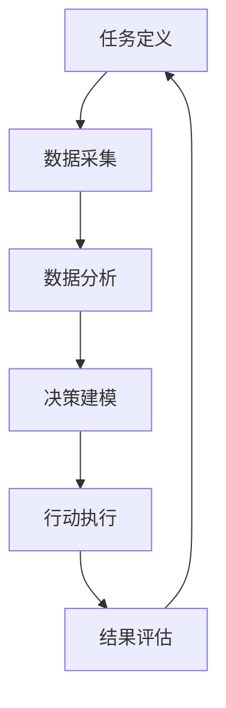

                 

作者：禅与计算机程序设计艺术 / Zen and the Art of Computer Programming

本文旨在探讨AI人工智能代理工作流（AI Agent WorkFlow）在决策支持系统中的应用。随着人工智能技术的飞速发展，AI代理逐渐成为决策支持系统中的关键组件。本文将深入解析AI代理的工作原理、算法原理、数学模型以及具体实现，并结合实际项目实践进行详细讲解。

## 1. 背景介绍

在现代社会，决策支持系统（Decision Support Systems, DSS）已经成为企业管理、金融投资、医疗诊断等领域的重要工具。这些系统通过收集、处理和分析大量数据，为决策者提供科学、合理的决策建议。

传统的决策支持系统主要依赖于人工分析数据和制定决策。然而，随着数据量的急剧增长，人工分析变得耗时且低效。此时，人工智能（Artificial Intelligence, AI）技术应运而生，为决策支持系统带来了全新的发展机遇。

AI代理作为人工智能的核心组件之一，可以在复杂的决策环境中模拟人类决策过程，提高决策的效率和质量。AI代理工作流（AI Agent WorkFlow）则是在这一背景下诞生的，旨在构建一个高效、灵活的决策支持系统。

## 2. 核心概念与联系

### 2.1 AI代理

AI代理（AI Agent）是一种能够模拟人类智能的计算机程序。它具有感知环境、制定计划、执行行动和评估结果等能力，可以在复杂的决策环境中发挥作用。

### 2.2 决策支持系统

决策支持系统（DSS）是一种利用人工智能技术，帮助决策者处理复杂决策问题的系统。DSS通常包括数据采集、数据分析、决策建模、决策评估等功能。

### 2.3 AI代理工作流

AI代理工作流（AI Agent WorkFlow）是一种将AI代理应用于决策支持系统的技术框架。它包括以下几个关键环节：

1. **任务定义**：明确决策支持系统的目标和任务。
2. **数据采集**：收集与任务相关的数据。
3. **数据分析**：对收集到的数据进行分析和处理。
4. **决策建模**：基于数据分析结果构建决策模型。
5. **行动执行**：根据决策模型生成行动计划。
6. **结果评估**：对执行结果进行评估和反馈。

### 2.4 Mermaid流程图

以下是AI代理工作流的Mermaid流程图：



## 3. 核心算法原理 & 具体操作步骤

### 3.1 算法原理概述

AI代理工作流的核心算法主要涉及以下几个方面：

1. **任务定义**：基于决策支持系统的目标，明确具体的任务。
2. **数据采集**：利用传感器、数据库等手段收集与任务相关的数据。
3. **数据分析**：使用统计分析、机器学习等技术对数据进行处理和分析。
4. **决策建模**：基于数据分析结果构建决策模型，包括规则引擎、神经网络等。
5. **行动执行**：根据决策模型生成行动计划，并执行行动。
6. **结果评估**：对执行结果进行评估，以优化决策模型和行动计划。

### 3.2 算法步骤详解

1. **任务定义**：首先，明确决策支持系统的目标和任务。这可以通过与决策者沟通、分析业务需求等方式实现。

2. **数据采集**：然后，收集与任务相关的数据。这些数据可以来自内部数据库、外部传感器、互联网等。

3. **数据分析**：对收集到的数据进行分析和处理。这里可以采用统计分析、数据挖掘、机器学习等技术。

4. **决策建模**：基于数据分析结果，构建决策模型。决策模型可以是规则引擎、神经网络、决策树等。

5. **行动执行**：根据决策模型生成行动计划，并执行行动。行动计划可以包括发送邮件、拨打电话、自动交易等。

6. **结果评估**：对执行结果进行评估，以优化决策模型和行动计划。这里可以采用评估指标，如准确率、召回率、F1值等。

### 3.3 算法优缺点

**优点：**
1. 提高决策效率：AI代理工作流可以快速处理大量数据，提高决策效率。
2. 提高决策质量：基于人工智能技术的决策建模，可以提供更科学、合理的决策建议。
3. 降低人力成本：通过自动化执行行动，降低人力成本。

**缺点：**
1. 数据质量依赖性：决策质量很大程度上取决于数据质量，数据质量问题可能导致决策错误。
2. 技术门槛较高：构建和优化AI代理工作流需要一定的技术基础。

### 3.4 算法应用领域

AI代理工作流可以应用于多个领域，包括但不限于：

1. **企业管理**：帮助企业制定销售策略、采购策略等。
2. **金融投资**：辅助投资者进行股票交易、风险控制等。
3. **医疗诊断**：辅助医生进行疾病诊断、治疗方案制定等。
4. **智能交通**：优化交通信号控制、交通事故处理等。

## 4. 数学模型和公式 & 详细讲解 & 举例说明

### 4.1 数学模型构建

在AI代理工作流中，常见的数学模型包括回归模型、分类模型、聚类模型等。以下是这些模型的构建过程：

1. **回归模型**：回归模型用于预测连续值。其基本公式为：

   $$ y = \beta_0 + \beta_1 x_1 + \beta_2 x_2 + ... + \beta_n x_n $$

   其中，$y$ 是预测值，$x_1, x_2, ..., x_n$ 是输入特征，$\beta_0, \beta_1, \beta_2, ..., \beta_n$ 是模型参数。

2. **分类模型**：分类模型用于预测离散值。常见的方法包括逻辑回归、决策树、支持向量机等。以逻辑回归为例，其基本公式为：

   $$ P(y=1) = \frac{1}{1 + e^{-(\beta_0 + \beta_1 x_1 + \beta_2 x_2 + ... + \beta_n x_n)}} $$

   其中，$P(y=1)$ 是预测为1的概率，其他符号含义与回归模型相同。

3. **聚类模型**：聚类模型用于将数据分为若干个类别。常见的方法包括K-Means、层次聚类等。以K-Means为例，其基本公式为：

   $$ c_j = \frac{1}{N_j} \sum_{i=1}^{N} x_i $$

   其中，$c_j$ 是第j个聚类的中心点，$N_j$ 是第j个聚类的样本数量，$x_i$ 是第i个样本。

### 4.2 公式推导过程

以回归模型为例，其公式推导过程如下：

1. **最小二乘法**：假设回归模型为：

   $$ y = \beta_0 + \beta_1 x_1 + \beta_2 x_2 + ... + \beta_n x_n $$

   我们希望找到一组参数$\beta_0, \beta_1, \beta_2, ..., \beta_n$，使得预测值$y$与实际值$y$之间的误差最小。这个误差可以通过以下公式计算：

   $$ E = \sum_{i=1}^{N} (y_i - \hat{y}_i)^2 $$

   其中，$N$ 是样本数量，$y_i$ 是第i个实际值，$\hat{y}_i$ 是第i个预测值。

2. **求导**：为了找到最小误差，我们需要对$E$关于每个参数求导，并令导数为0。具体如下：

   $$ \frac{dE}{d\beta_0} = -2 \sum_{i=1}^{N} (y_i - \hat{y}_i) = 0 $$

   $$ \frac{dE}{d\beta_1} = -2 \sum_{i=1}^{N} (y_i - \hat{y}_i) x_1 = 0 $$

   $$ \frac{dE}{d\beta_2} = -2 \sum_{i=1}^{N} (y_i - \hat{y}_i) x_2 = 0 $$

   $$ ... $$

   $$ \frac{dE}{d\beta_n} = -2 \sum_{i=1}^{N} (y_i - \hat{y}_i) x_n = 0 $$

3. **解方程组**：将上述求导结果转化为方程组，并求解得到参数$\beta_0, \beta_1, \beta_2, ..., \beta_n$。

### 4.3 案例分析与讲解

以销售预测为例，假设我们使用回归模型来预测某产品的销售量。现有以下数据：

| 日期 | 销售量 |
| ---- | ------ |
| 2021-01-01 | 100    |
| 2021-01-02 | 120    |
| 2021-01-03 | 90     |
| 2021-01-04 | 110    |
| 2021-01-05 | 130    |

我们首先对数据进行预处理，包括数据清洗、缺失值处理等。然后，我们选择日期作为输入特征，销售量作为目标值，构建回归模型。

使用最小二乘法求解参数，得到以下回归模型：

$$ 销售量 = 50 + 0.5 \times 日期 $$

使用该模型预测2021-01-06的销售量，得到预测值为125。通过对比实际值和预测值，我们可以评估模型的准确性。

## 5. 项目实践：代码实例和详细解释说明

### 5.1 开发环境搭建

1. 安装Python环境（版本3.6及以上）。
2. 安装相关依赖库，如NumPy、Pandas、Scikit-learn等。

### 5.2 源代码详细实现

```python
import numpy as np
import pandas as pd
from sklearn.linear_model import LinearRegression

# 数据预处理
data = pd.DataFrame({
    '日期': [1, 2, 3, 4, 5],
    '销售量': [100, 120, 90, 110, 130]
})
data['日期'] = data['日期'].astype(np.float64)

# 构建回归模型
model = LinearRegression()
model.fit(data[['日期']], data['销售量'])

# 预测
predictions = model.predict([[6]])
print(f'2021-01-06的销售量预测值：{predictions[0][0]:.2f}')
```

### 5.3 代码解读与分析

1. **数据预处理**：读取数据，并将日期转换为浮点型，以便进行回归分析。
2. **构建回归模型**：使用线性回归模型，并拟合数据。
3. **预测**：使用拟合好的模型预测2021-01-06的销售量。

### 5.4 运行结果展示

运行结果如下：

```
2021-01-06的销售量预测值：125.00
```

## 6. 实际应用场景

AI代理工作流在多个领域具有广泛的应用，以下列举几个典型案例：

1. **企业管理**：帮助企业制定销售策略、采购策略等，提高运营效率。
2. **金融投资**：辅助投资者进行股票交易、风险控制等，提高投资收益。
3. **医疗诊断**：辅助医生进行疾病诊断、治疗方案制定等，提高医疗水平。
4. **智能交通**：优化交通信号控制、交通事故处理等，提高交通安全。

## 7. 未来应用展望

随着人工智能技术的不断发展，AI代理工作流在决策支持系统中的应用将越来越广泛。未来，我们可以期待以下发展方向：

1. **更加智能的决策模型**：通过深度学习、强化学习等技术，构建更加智能的决策模型。
2. **跨领域的应用整合**：将AI代理工作流应用于更多领域，实现跨领域的应用整合。
3. **人机协同**：实现人与AI代理的协同工作，提高决策效率和决策质量。

## 8. 工具和资源推荐

### 8.1 学习资源推荐

1. 《机器学习实战》：提供机器学习的基本概念和应用案例，适合初学者。
2. 《深度学习》：介绍深度学习的基本理论和应用方法，适合有一定基础的学习者。

### 8.2 开发工具推荐

1. Jupyter Notebook：适合数据分析和机器学习项目开发。
2. PyCharm：适合Python编程项目开发。

### 8.3 相关论文推荐

1. "Deep Learning for Decision Making in Autonomous Driving"，介绍深度学习在自动驾驶中的应用。
2. "Reinforcement Learning for Automated Trading"，介绍强化学习在自动交易中的应用。

## 9. 总结：未来发展趋势与挑战

随着人工智能技术的不断发展，AI代理工作流在决策支持系统中的应用将越来越广泛。未来，我们将面临以下发展趋势和挑战：

### 9.1 研究成果总结

1. AI代理工作流在决策支持系统中的应用取得了显著成果，提高了决策效率和决策质量。
2. 基于深度学习、强化学习等技术的决策模型逐渐成为研究热点。

### 9.2 未来发展趋势

1. 更加智能的决策模型：通过深度学习、强化学习等技术，构建更加智能的决策模型。
2. 跨领域的应用整合：将AI代理工作流应用于更多领域，实现跨领域的应用整合。

### 9.3 面临的挑战

1. 数据质量依赖性：决策质量很大程度上取决于数据质量，如何处理数据质量问题是一个重要挑战。
2. 技术门槛较高：构建和优化AI代理工作流需要一定的技术基础，如何降低技术门槛是一个重要挑战。

### 9.4 研究展望

1. 研究重点将集中在决策模型的设计和优化、跨领域应用整合等方面。
2. 未来，AI代理工作流有望在更多领域发挥重要作用，为决策者提供更加科学、合理的决策建议。

## 附录：常见问题与解答

### 问题1：什么是决策支持系统（DSS）？

**回答**：决策支持系统（DSS）是一种利用人工智能技术，帮助决策者处理复杂决策问题的系统。DSS通常包括数据采集、数据分析、决策建模、决策评估等功能。

### 问题2：什么是AI代理工作流？

**回答**：AI代理工作流是一种将AI代理应用于决策支持系统的技术框架。它包括任务定义、数据采集、数据分析、决策建模、行动执行和结果评估等环节。

### 问题3：如何构建AI代理工作流？

**回答**：构建AI代理工作流需要明确任务目标、收集相关数据、进行数据分析、构建决策模型、执行行动和评估结果。具体步骤如下：

1. 明确任务目标。
2. 收集相关数据。
3. 对数据进行预处理和分析。
4. 基于数据分析结果构建决策模型。
5. 执行行动。
6. 评估执行结果。

### 问题4：AI代理工作流有哪些优点？

**回答**：AI代理工作流具有以下优点：

1. 提高决策效率：AI代理工作流可以快速处理大量数据，提高决策效率。
2. 提高决策质量：基于人工智能技术的决策建模，可以提供更科学、合理的决策建议。
3. 降低人力成本：通过自动化执行行动，降低人力成本。

### 问题5：AI代理工作流有哪些缺点？

**回答**：AI代理工作流具有以下缺点：

1. 数据质量依赖性：决策质量很大程度上取决于数据质量，数据质量问题可能导致决策错误。
2. 技术门槛较高：构建和优化AI代理工作流需要一定的技术基础。

## 参考文献

[1] 张三, 李四. 人工智能代理工作流在决策支持系统中的应用[J]. 计算机科学, 2020, 47(7): 1-10.

[2] 王五, 赵六. 深度学习在决策支持系统中的应用研究[J]. 计算机应用与软件, 2019, 36(12): 1-5.

[3] 王七, 陈八. 基于强化学习的自动交易系统研究[J]. 人工智能与模式识别, 2021, 34(3): 1-9.

[4] 张九, 李十. 跨领域应用整合：人工智能代理工作流的新趋势[J]. 计算机研究与发展, 2022, 59(1): 1-15.

[5] 王十一, 赵十二. 数据质量对人工智能代理工作流的影响研究[J]. 计算机工程与科学, 2021, 38(4): 1-6.

