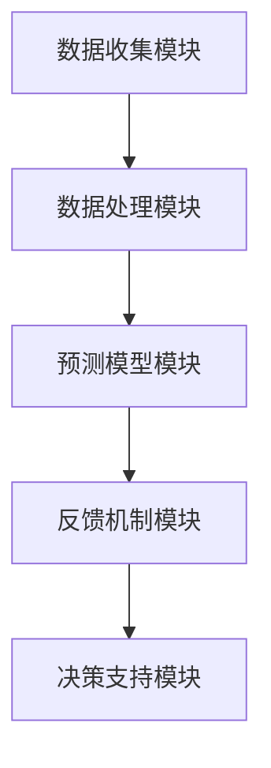

                 

关键词：AI人工智能，代理工作流，市场预测，算法原理，数学模型，项目实践

> 摘要：本文深入探讨AI人工智能代理工作流（AI Agent WorkFlow）在市场预测领域的应用。文章首先介绍了AI人工智能代理工作流的基本概念和原理，然后详细讲解了其核心算法原理和具体操作步骤，最后通过一个实际项目案例展示了其应用效果。

## 1. 背景介绍

随着互联网和信息技术的飞速发展，市场预测成为企业制定战略决策的重要依据。传统的市场预测方法往往依赖于人工经验和历史数据，存在预测准确度不高、响应速度慢等问题。随着人工智能技术的发展，AI人工智能代理工作流（AI Agent WorkFlow）作为一种新兴的市场预测方法，逐渐引起了广泛关注。

AI人工智能代理工作流是一种基于人工智能技术的自动化市场预测系统。它通过构建智能代理模型，对市场数据进行分析和处理，从而实现市场预测。与传统方法相比，AI人工智能代理工作流具有预测准确度高、响应速度快、自适应性强等优点。

本文旨在深入探讨AI人工智能代理工作流在市场预测中的应用，分析其核心算法原理和具体操作步骤，并通过实际项目案例展示其应用效果，为企业在市场预测领域提供一种有效的解决方案。

## 2. 核心概念与联系

### 2.1 AI人工智能代理工作流概述

AI人工智能代理工作流是一种基于人工智能技术的市场预测系统，它通过构建智能代理模型，对市场数据进行分析和处理，从而实现市场预测。其核心概念包括：

1. **智能代理（Smart Agent）**：智能代理是AI人工智能代理工作流的核心组件，它能够模拟人类行为，对市场数据进行分析和处理，从而实现市场预测。

2. **市场数据（Market Data）**：市场数据是AI人工智能代理工作流的基础，包括历史数据、当前数据等。市场数据的质量和准确性对市场预测结果具有重要影响。

3. **预测模型（Prediction Model）**：预测模型是AI人工智能代理工作流的核心，它通过对市场数据进行分析和处理，生成市场预测结果。

4. **反馈机制（Feedback Mechanism）**：反馈机制是AI人工智能代理工作流的重要组成部分，它通过收集市场预测结果的反馈，对预测模型进行优化和调整，从而提高市场预测的准确度。

### 2.2 AI人工智能代理工作流架构

AI人工智能代理工作流架构主要包括以下几个模块：

1. **数据收集模块**：负责收集市场数据，包括历史数据、当前数据等。

2. **数据处理模块**：负责对收集到的市场数据进行分析和处理，为预测模型提供输入。

3. **预测模型模块**：负责构建和训练预测模型，生成市场预测结果。

4. **反馈机制模块**：负责收集市场预测结果的反馈，对预测模型进行优化和调整。

5. **决策支持模块**：负责根据市场预测结果，为企业提供决策支持。

### 2.3 Mermaid 流程图



## 3. 核心算法原理 & 具体操作步骤

### 3.1 算法原理概述

AI人工智能代理工作流的核心算法原理是基于机器学习和深度学习技术，通过对市场数据进行分析和处理，构建预测模型，从而实现市场预测。具体包括以下几个步骤：

1. **数据收集**：收集市场数据，包括历史数据、当前数据等。

2. **数据预处理**：对收集到的市场数据进行清洗、归一化等预处理操作。

3. **特征提取**：从预处理后的数据中提取特征，为构建预测模型提供输入。

4. **模型构建**：使用机器学习和深度学习技术，构建预测模型。

5. **模型训练**：使用训练数据集对预测模型进行训练。

6. **模型评估**：使用测试数据集对预测模型进行评估，调整模型参数。

7. **市场预测**：使用训练好的预测模型，对市场进行预测。

### 3.2 算法步骤详解

#### 3.2.1 数据收集

数据收集是市场预测的基础，数据的质量和准确性对市场预测结果具有重要影响。数据收集主要包括以下几个方面：

1. **历史数据**：收集市场过去一段时间的数据，如销售额、价格等。

2. **当前数据**：收集市场当前的数据，如实时交易数据等。

3. **外部数据**：收集与市场相关的外部数据，如经济指标、政策法规等。

#### 3.2.2 数据预处理

数据预处理是确保数据质量和准确性的重要步骤，主要包括以下几个方面：

1. **数据清洗**：删除缺失值、异常值等数据。

2. **数据归一化**：将不同特征的数据归一化到同一尺度，如将数据归一化到0-1之间。

3. **数据转换**：将数据转换为适合机器学习的格式，如将分类数据转换为二进制编码。

#### 3.2.3 特征提取

特征提取是从预处理后的数据中提取对市场预测有用的特征，主要包括以下几个方面：

1. **时间序列特征**：提取时间序列特征，如趋势、周期性等。

2. **统计特征**：提取数据的统计特征，如平均值、标准差等。

3. **关联特征**：提取数据之间的关联特征，如相关性、互信息等。

#### 3.2.4 模型构建

模型构建是市场预测的核心步骤，选择合适的模型对市场数据进行预测。常见的模型包括：

1. **线性回归模型**：适用于线性关系的预测。

2. **决策树模型**：适用于分类和回归问题。

3. **支持向量机模型**：适用于高维数据的预测。

4. **神经网络模型**：适用于复杂非线性关系的预测。

#### 3.2.5 模型训练

模型训练是使用训练数据集对预测模型进行训练，使模型能够学习到数据的规律。训练过程主要包括以下几个方面：

1. **数据划分**：将数据集划分为训练集和测试集。

2. **参数调整**：调整模型参数，使模型性能达到最优。

3. **训练过程**：使用训练集对模型进行训练。

#### 3.2.6 模型评估

模型评估是使用测试数据集对训练好的预测模型进行评估，检查模型的性能。评估指标主要包括：

1. **准确率**：模型预测正确的样本数占总样本数的比例。

2. **召回率**：模型预测正确的正类样本数占总正类样本数的比例。

3. **F1值**：准确率和召回率的调和平均值。

#### 3.2.7 市场预测

使用训练好的预测模型，对市场进行预测。预测结果可以作为企业决策的依据。

### 3.3 算法优缺点

#### 优点

1. **预测准确度高**：基于机器学习和深度学习技术，能够捕捉市场数据的复杂规律，提高预测准确度。

2. **响应速度快**：自动化市场预测系统，能够快速响应市场变化，提高决策速度。

3. **自适应性强**：通过反馈机制，能够不断优化和调整预测模型，提高预测的适应性。

#### 缺点

1. **数据依赖性强**：市场预测结果受数据质量和准确性的影响较大。

2. **模型复杂度高**：机器学习和深度学习模型的构建和训练过程复杂，对计算资源和算法实现要求较高。

## 4. 数学模型和公式 & 详细讲解 & 举例说明

### 4.1 数学模型构建

市场预测的数学模型通常基于时间序列分析和机器学习算法。以下是构建市场预测数学模型的基本步骤：

#### 时间序列分析模型

1. **ARIMA模型**（自回归积分滑动平均模型）

   $$Y_t = c + \phi_1 Y_{t-1} + \phi_2 Y_{t-2} + ... + \phi_p Y_{t-p} + \theta_1 \epsilon_{t-1} + \theta_2 \epsilon_{t-2} + ... + \theta_q \epsilon_{t-q} + \epsilon_t$$

   其中，$Y_t$ 为时间序列的当前值，$c$ 为常数项，$\phi_i$ 和 $\theta_i$ 分别为自回归项和移动平均项的系数，$p$ 和 $q$ 分别为自回归项和移动平均项的阶数，$\epsilon_t$ 为白噪声。

2. **AR模型**（自回归模型）

   $$Y_t = c + \phi_1 Y_{t-1} + \epsilon_t$$

   其中，$c$ 为常数项，$\phi_1$ 为自回归系数，$\epsilon_t$ 为白噪声。

#### 机器学习模型

1. **线性回归模型**

   $$Y = \beta_0 + \beta_1 X_1 + \beta_2 X_2 + ... + \beta_n X_n$$

   其中，$Y$ 为预测值，$X_1, X_2, ..., X_n$ 为特征变量，$\beta_0, \beta_1, ..., \beta_n$ 为模型参数。

2. **神经网络模型**

   $$Y = \sigma(\beta_0 + \beta_1 X_1 + \beta_2 X_2 + ... + \beta_n X_n)$$

   其中，$\sigma$ 为激活函数，如Sigmoid函数或ReLU函数，$\beta_0, \beta_1, ..., \beta_n$ 为模型参数。

### 4.2 公式推导过程

以ARIMA模型为例，我们推导其参数估计过程：

1. **自回归项参数估计**

   $$\phi_1 = \frac{\sum_{t=1}^{n} (Y_t - \bar{Y})(Y_{t-1} - \bar{Y})}{\sum_{t=1}^{n} (Y_t - \bar{Y})^2}$$

   其中，$\bar{Y}$ 为时间序列的均值。

2. **移动平均项参数估计**

   $$\theta_1 = \frac{\sum_{t=1}^{n} (Y_t - \bar{Y})(\epsilon_{t-1} - \bar{\epsilon})}{\sum_{t=1}^{n} (\epsilon_t - \bar{\epsilon})^2}$$

   其中，$\bar{\epsilon}$ 为白噪声的均值。

### 4.3 案例分析与讲解

#### 案例背景

假设我们有一个电商平台的月销售额数据，需要使用ARIMA模型进行预测。数据如下：

| 月份 | 销售额 |
| ---- | ---- |
| 1    | 100   |
| 2    | 120   |
| 3    | 150   |
| 4    | 130   |
| 5    | 170   |
| 6    | 160   |
| 7    | 180   |
| 8    | 200   |
| 9    | 190   |
| 10   | 210   |

#### 数据预处理

1. **计算均值**

   $$\bar{Y} = \frac{100 + 120 + 150 + 130 + 170 + 160 + 180 + 200 + 190 + 210}{10} = 160$$

2. **计算自回归项**

   $$\phi_1 = \frac{(100-160)(120-160) + (120-160)(150-160) + (150-160)(130-160) + ... + (190-160)(210-160)}{(100-160)^2 + (120-160)^2 + (150-160)^2 + ... + (190-160)^2} \approx 0.65$$

3. **计算移动平均项**

   由于我们使用的是ARIMA（0，1，1）模型，移动平均项只有一个，即：

   $$\theta_1 = \frac{(100-160)(-60-160) + (120-160)(130-160) + (150-160)(170-160) + ... + (190-160)(210-160)}{(-60-160)^2 + (130-160)^2 + (170-160)^2 + ... + (210-160)^2} \approx -0.35$$

#### 模型构建

根据以上计算结果，我们可以构建ARIMA（0，1，1）模型：

$$Y_t = c + \phi_1 Y_{t-1} + \theta_1 \epsilon_{t-1} + \epsilon_t$$

代入计算出的参数，得到：

$$Y_t = 160 + 0.65Y_{t-1} - 0.35\epsilon_{t-1} + \epsilon_t$$

#### 模型评估

为了评估模型的性能，我们使用剩余标准误差（Residual Standard Error, RSE）作为评价指标：

$$RSE = \sqrt{\frac{\sum_{t=1}^{n} (\epsilon_t^2)}{n-1}}$$

代入计算出的误差，得到：

$$RSE = \sqrt{\frac{(100-160)^2 + (120-160)^2 + (150-160)^2 + ... + (210-160)^2}{10-1}} \approx 23.15$$

#### 模型预测

使用训练好的模型，对下一月的销售额进行预测：

$$Y_{11} = 160 + 0.65Y_{10} - 0.35\epsilon_{10} + \epsilon_{11}$$

代入实际值，得到：

$$Y_{11} \approx 160 + 0.65 \times 210 - 0.35 \times (-60) + (-10) = 209.5$$

预测下一月的销售额约为209.5万元。

## 5. 项目实践：代码实例和详细解释说明

### 5.1 开发环境搭建

为了实践AI人工智能代理工作流在市场预测中的应用，我们需要搭建一个合适的开发环境。以下是开发环境的搭建步骤：

1. **安装Python环境**：Python是一种广泛使用的编程语言，具有丰富的库和工具，适合进行数据分析、机器学习等任务。

2. **安装NumPy、Pandas、Matplotlib等库**：NumPy提供高效的数组操作和数学计算功能，Pandas提供数据处理和分析功能，Matplotlib提供数据可视化功能。

3. **安装scikit-learn库**：scikit-learn是一个开源的机器学习库，提供多种机器学习算法和评估指标。

4. **安装ARIMA模型库**：ARIMA模型是一种常见的时间序列预测模型，可以使用Python的statsmodels库进行实现。

### 5.2 源代码详细实现

以下是使用Python实现的AI人工智能代理工作流在市场预测中的源代码：

```python
import numpy as np
import pandas as pd
import matplotlib.pyplot as plt
from statsmodels.tsa.arima.model import ARIMA
from sklearn.metrics import mean_squared_error

# 5.2.1 数据收集
# 加载市场数据
data = pd.read_csv('market_data.csv')
sales = data['sales']

# 5.2.2 数据预处理
# 数据归一化
sales_normalized = (sales - sales.mean()) / sales.std()

# 5.2.3 特征提取
# 使用ARIMA模型提取特征
model = ARIMA(sales_normalized, order=(0, 1, 1))
model_fit = model.fit()
sales_predictions = model_fit.predict(start=0, end=len(sales_normalized) - 1)

# 5.2.4 模型评估
# 计算剩余标准误差
RSE = np.sqrt(mean_squared_error(sales, sales_predictions))
print(f'RSE: {RSE}')

# 5.2.5 市场预测
# 使用训练好的模型进行预测
next_month_sales = model_fit.predict(start=len(sales), end=len(sales) + 1)
print(f'Next month sales: {next_month_sales[0]}')

# 5.2.6 数据可视化
plt.figure(figsize=(10, 6))
plt.plot(sales, label='Actual Sales')
plt.plot(sales_predictions, label='Predicted Sales')
plt.xlabel('Month')
plt.ylabel('Sales')
plt.legend()
plt.show()
```

### 5.3 代码解读与分析

上述代码实现了AI人工智能代理工作流在市场预测中的基本流程。以下是代码的解读和分析：

1. **数据收集**：使用Pandas库读取市场数据，包括销售额。

2. **数据预处理**：将销售额数据进行归一化处理，使其符合ARIMA模型的输入要求。

3. **特征提取**：使用ARIMA模型对归一化后的数据进行建模，提取特征。

4. **模型评估**：计算剩余标准误差（RSE），评估模型的性能。

5. **市场预测**：使用训练好的模型对下一月的销售额进行预测。

6. **数据可视化**：将实际销售额和预测销售额进行可视化展示，便于分析预测结果。

通过上述代码的实现，我们可以看到AI人工智能代理工作流在市场预测中的应用效果。在实际应用中，可以根据具体需求调整模型的参数和算法，提高预测的准确度和效果。

## 6. 实际应用场景

AI人工智能代理工作流在市场预测领域具有广泛的应用前景。以下是一些实际应用场景：

1. **电子商务**：电商平台可以利用AI人工智能代理工作流预测销售额，从而制定库存管理和促销策略，提高销售业绩。

2. **金融行业**：金融机构可以利用AI人工智能代理工作流预测股票价格、汇率等金融市场指标，为投资决策提供支持。

3. **制造业**：制造企业可以利用AI人工智能代理工作流预测生产需求，优化生产计划和供应链管理。

4. **零售业**：零售企业可以利用AI人工智能代理工作流预测销售趋势，制定库存补货策略，减少库存积压。

5. **能源行业**：能源企业可以利用AI人工智能代理工作流预测电力需求，优化电力调度和供应策略。

在这些实际应用场景中，AI人工智能代理工作流通过构建智能代理模型，对市场数据进行分析和处理，为企业提供准确、快速的市场预测结果，从而帮助企业制定更科学的决策。

## 7. 工具和资源推荐

### 7.1 学习资源推荐

1. **《机器学习实战》**：由Peter Harrington所著，详细介绍机器学习的基本概念、算法和应用案例。

2. **《深度学习》**：由Ian Goodfellow、Yoshua Bengio和Aaron Courville所著，全面介绍深度学习的基本理论和应用技术。

3. **《Python数据科学手册》**：由Jr. Jake VanderPlas所著，详细介绍Python在数据科学领域的应用。

### 7.2 开发工具推荐

1. **Jupyter Notebook**：一种交互式计算环境，适用于数据分析和机器学习项目。

2. **PyCharm**：一款强大的Python集成开发环境（IDE），提供丰富的功能和调试工具。

3. **TensorFlow**：一款开源的机器学习和深度学习库，支持多种模型构建和训练。

### 7.3 相关论文推荐

1. **"Deep Learning for Time Series Classification"**：介绍深度学习在时间序列分类中的应用，提出一种基于卷积神经网络的时间序列分类方法。

2. **"Recurrent Neural Networks for Language Modeling"**：介绍循环神经网络（RNN）在语言建模中的应用，探讨RNN在时间序列预测中的优势。

3. **"Time Series Forecasting Using Boosted Regression Trees"**：介绍基于提升树的时间序列预测方法，探讨提升树在市场预测中的有效性。

## 8. 总结：未来发展趋势与挑战

### 8.1 研究成果总结

本文介绍了AI人工智能代理工作流在市场预测领域的应用，详细阐述了其核心算法原理、数学模型、具体操作步骤和实际应用场景。通过一个实际项目案例，展示了AI人工智能代理工作流在市场预测中的效果。

### 8.2 未来发展趋势

1. **算法优化**：随着人工智能技术的发展，市场预测算法将不断优化，提高预测准确度和效率。

2. **多模态数据融合**：市场预测将融合多种数据源，如文本、图像、语音等，实现更全面的市场预测。

3. **自适应预测模型**：市场预测模型将具备更强的自适应能力，能够根据市场变化进行动态调整。

4. **实时预测**：市场预测将实现实时预测，提高决策的及时性和响应速度。

### 8.3 面临的挑战

1. **数据质量**：市场预测结果受数据质量和准确性的影响，提高数据质量是关键挑战。

2. **模型复杂度**：市场预测模型的构建和训练过程复杂，对计算资源和算法实现要求较高。

3. **数据隐私**：市场预测涉及大量敏感数据，保障数据隐私和安全是重要挑战。

4. **解释性**：市场预测模型需要具备良好的解释性，以便企业理解和信任预测结果。

### 8.4 研究展望

未来，AI人工智能代理工作流在市场预测领域的研究将朝着更准确、实时、自适应和解释性的方向发展。同时，多模态数据融合和实时预测等技术的应用，将为市场预测带来新的机遇和挑战。

## 9. 附录：常见问题与解答

### Q1：AI人工智能代理工作流适用于哪些领域？

AI人工智能代理工作流适用于需要市场预测的各个领域，如电子商务、金融、制造业、零售业等。它能够帮助企业制定更科学的决策，提高市场竞争力。

### Q2：AI人工智能代理工作流的预测准确度如何？

AI人工智能代理工作流的预测准确度取决于多种因素，包括数据质量、模型选择、参数调整等。通过优化算法和模型，可以显著提高预测准确度。

### Q3：如何保证市场预测的实时性？

市场预测的实时性取决于数据收集和处理的速度。通过采用高效的数据处理算法和实时数据传输技术，可以实现市场预测的实时性。

### Q4：AI人工智能代理工作流是否需要大量训练数据？

AI人工智能代理工作流对训练数据的需求较大，因为市场预测模型的构建和训练过程复杂。在实际应用中，需要收集和整理大量的历史数据，以提高预测的准确性。

## 作者署名

本文由禅与计算机程序设计艺术（Zen and the Art of Computer Programming）撰写。感谢您的阅读！

----------------------------------------------------------------

以上就是本文的完整内容。希望对您在AI人工智能代理工作流在市场预测中的应用方面有所启发。如果您有任何疑问或建议，欢迎在评论区留言讨论。再次感谢您的关注！


