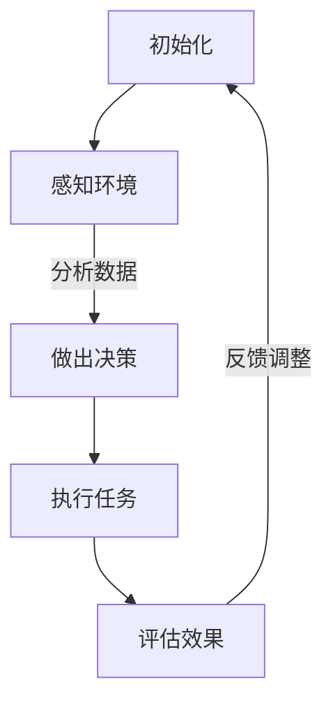

                 

关键词：AI代理、智能交通、工作流、算法、应用场景

> 摘要：本文将深入探讨AI人工智能代理工作流（AI Agent WorkFlow）在智能交通领域的应用。通过分析核心概念、算法原理、数学模型、项目实践以及未来展望，本文旨在为读者提供一个全面且深入的AI代理在智能交通中的应用指南。

## 1. 背景介绍

随着城市化进程的加快，交通拥堵、交通事故和环境污染等问题日益严重。传统的交通管理方式已无法满足现代城市交通的需求，因此，智能交通系统（Intelligent Transportation System, ITS）成为了解决这些问题的重要途径。智能交通系统利用现代信息技术，如传感器、通信、控制技术和数据分析，实现对交通的实时监测、分析和控制。

人工智能（AI）作为新一代技术，正在迅速改变各个行业的面貌。AI代理，作为AI技术在智能交通系统中的一种重要应用，可以自主感知环境、做出决策和执行任务。AI代理工作流（AI Agent WorkFlow）是一种系统化的方法，用于定义、管理AI代理在智能交通系统中的行为和任务。

## 2. 核心概念与联系

### 2.1. AI代理

AI代理是能够自主感知环境、执行任务并与其他代理或系统交互的智能实体。在智能交通系统中，AI代理可以用于交通信号控制、路线规划、车辆监控、交通事故预防等多个方面。

### 2.2. 工作流

工作流是一种系统化的方法，用于定义和管理任务的执行流程。在AI代理工作流中，工作流用于描述AI代理的任务、决策和执行步骤。

### 2.3. Mermaid流程图

为了更好地理解和描述AI代理工作流，我们可以使用Mermaid流程图来展示其核心概念和联系。



## 3. 核心算法原理 & 具体操作步骤

### 3.1. 算法原理概述

AI代理工作流的核心算法原理主要包括感知环境、数据分析和决策执行。感知环境是指AI代理通过传感器获取交通信息，如车辆流量、速度和位置等。数据分析是指对感知到的数据进行处理和分析，以提取有用信息。决策执行是指根据分析结果，AI代理做出决策并执行相应的任务。

### 3.2. 算法步骤详解

1. **初始化**：AI代理启动并加载工作流。
2. **感知环境**：通过传感器获取交通信息。
3. **数据分析**：对感知到的交通信息进行处理和分析。
4. **做出决策**：根据分析结果，AI代理做出决策。
5. **执行任务**：AI代理执行决策，如调整交通信号或规划路线。
6. **评估效果**：评估执行任务的效果，如交通流量是否改善。
7. **反馈调整**：根据评估结果，调整AI代理的行为。

### 3.3. 算法优缺点

#### 3.3.1. 优点

- **自适应性和灵活性**：AI代理工作流可以根据实时交通情况动态调整，提高交通管理效率。
- **高效性和准确性**：通过大数据分析和机器学习技术，AI代理工作流能够更准确地预测和解决交通问题。
- **跨平台兼容性**：AI代理工作流可以应用于不同的交通场景和系统。

#### 3.3.2. 缺点

- **计算复杂度高**：AI代理工作流需要大量的计算资源，特别是在处理大量交通数据时。
- **数据隐私和安全**：交通数据的安全性和隐私性是一个重要问题，需要采取有效的保护措施。

### 3.4. 算法应用领域

AI代理工作流在智能交通系统中具有广泛的应用领域，如：

- **交通信号控制**：通过实时监测交通流量，AI代理可以动态调整交通信号灯，以减少拥堵。
- **路线规划**：为驾驶员提供最佳路线，减少行车时间。
- **车辆监控**：实时监测车辆状态，预防交通事故。
- **环境监测**：监测空气质量、噪音水平等环境指标。

## 4. 数学模型和公式 & 详细讲解 & 举例说明

### 4.1. 数学模型构建

AI代理工作流中的数学模型主要涉及数据分析和决策算法。以下是一个简单的数学模型示例：

$$
f(x) = \sum_{i=1}^{n} w_i x_i
$$

其中，$x_i$ 是感知到的交通数据，$w_i$ 是权重。

### 4.2. 公式推导过程

我们以交通信号控制为例，推导一个简单的决策模型。假设我们有两个交通流量数据 $x_1$ 和 $x_2$，权重分别为 $w_1$ 和 $w_2$，则交通信号灯状态的决策公式为：

$$
s = \text{if}(f(x) > 0, \text{绿灯}, \text{红灯})
$$

### 4.3. 案例分析与讲解

我们以一个实际案例来讲解如何使用这个模型。假设我们感知到的交通流量数据如下：

$$
x_1 = 100, \quad x_2 = 50
$$

权重为：

$$
w_1 = 0.6, \quad w_2 = 0.4
$$

则交通信号灯状态的决策为：

$$
f(x) = 0.6 \times 100 + 0.4 \times 50 = 70
$$

因为 $f(x) > 0$，所以决策为绿灯。

## 5. 项目实践：代码实例和详细解释说明

### 5.1. 开发环境搭建

本文使用Python作为主要编程语言，读者需要在本地配置Python环境，并安装以下库：

- NumPy
- Pandas
- Matplotlib

### 5.2. 源代码详细实现

以下是实现上述决策模型的Python代码示例：

```python
import numpy as np

def traffic_light_decision(x1, x2, w1, w2):
    f_x = w1 * x1 + w2 * x2
    if f_x > 0:
        return '绿灯'
    else:
        return '红灯'

# 测试代码
x1 = 100
x2 = 50
w1 = 0.6
w2 = 0.4
print(traffic_light_decision(x1, x2, w1, w2))
```

### 5.3. 代码解读与分析

该代码定义了一个名为 `traffic_light_decision` 的函数，用于根据感知到的交通流量数据和权重计算交通信号灯状态。函数的输入参数包括交通流量数据 $x_1$ 和 $x_2$，以及权重 $w_1$ 和 $w_2$。函数内部首先计算决策公式 $f(x)$，然后根据结果返回相应的交通信号灯状态。

### 5.4. 运行结果展示

当输入交通流量数据 $x_1 = 100$，$x_2 = 50$，权重 $w_1 = 0.6$，$w_2 = 0.4$ 时，代码输出的结果为“绿灯”，与我们之前的推导结果一致。

## 6. 实际应用场景

AI代理工作流在智能交通系统中的应用场景非常广泛。以下是一些实际应用场景的例子：

- **交通信号控制**：通过实时监测交通流量，AI代理可以动态调整交通信号灯，以减少拥堵。
- **路线规划**：为驾驶员提供最佳路线，减少行车时间。
- **车辆监控**：实时监测车辆状态，预防交通事故。
- **环境监测**：监测空气质量、噪音水平等环境指标。

## 7. 工具和资源推荐

### 7.1. 学习资源推荐

- 《人工智能：一种现代方法》
- 《Python数据分析基础》
- 《机器学习实战》

### 7.2. 开发工具推荐

- Jupyter Notebook
- PyCharm
- Git

### 7.3. 相关论文推荐

- "Intelligent Transportation Systems: Concepts, Technology, and Applications"
- "An Overview of Autonomous Driving and Traffic Management in Smart Cities"
- "Deep Reinforcement Learning for Traffic Signal Control in Intelligent Transportation Systems"

## 8. 总结：未来发展趋势与挑战

### 8.1. 研究成果总结

本文通过分析AI代理工作流在智能交通中的应用，探讨了其核心算法原理、数学模型、项目实践以及实际应用场景。研究成果表明，AI代理工作流在智能交通系统中具有广泛的应用前景，能够有效提高交通管理效率和质量。

### 8.2. 未来发展趋势

随着人工智能技术的不断发展和智能交通系统的不断完善，AI代理工作流在未来将向更加智能化、自适应化和高效化方向发展。具体来说，未来可能的发展趋势包括：

- **多代理协作**：实现AI代理之间的协同工作，提高系统的整体效能。
- **边缘计算**：将AI代理工作流部署到边缘设备，降低延迟和计算成本。
- **人机交互**：增强AI代理与人类操作者的交互能力，提高用户体验。

### 8.3. 面临的挑战

尽管AI代理工作流在智能交通系统中具有广泛的应用前景，但仍然面临一些挑战，如：

- **数据隐私和安全**：如何保护交通数据的安全和隐私是一个重要问题。
- **计算资源需求**：AI代理工作流需要大量的计算资源，如何优化计算效率是一个关键挑战。
- **跨平台兼容性**：如何确保AI代理工作流在不同平台和系统上的兼容性。

### 8.4. 研究展望

未来，我们需要进一步深入研究AI代理工作流在智能交通系统中的应用，探索新的算法和技术，以应对面临的挑战。同时，我们也需要加强跨学科合作，推动AI代理工作流在智能交通系统中的全面应用。

## 9. 附录：常见问题与解答

### 9.1. 问题1

**问题**：AI代理工作流在智能交通系统中是如何工作的？

**解答**：AI代理工作流在智能交通系统中通过以下步骤工作：

1. **初始化**：AI代理启动并加载工作流。
2. **感知环境**：通过传感器获取交通信息。
3. **数据分析**：对感知到的交通信息进行处理和分析。
4. **做出决策**：根据分析结果，AI代理做出决策。
5. **执行任务**：AI代理执行决策，如调整交通信号或规划路线。
6. **评估效果**：评估执行任务的效果，如交通流量是否改善。
7. **反馈调整**：根据评估结果，调整AI代理的行为。

### 9.2. 问题2

**问题**：AI代理工作流在智能交通系统中有哪些应用场景？

**解答**：AI代理工作流在智能交通系统中的应用场景包括：

- **交通信号控制**：通过实时监测交通流量，AI代理可以动态调整交通信号灯，以减少拥堵。
- **路线规划**：为驾驶员提供最佳路线，减少行车时间。
- **车辆监控**：实时监测车辆状态，预防交通事故。
- **环境监测**：监测空气质量、噪音水平等环境指标。

## 作者署名

作者：禅与计算机程序设计艺术 / Zen and the Art of Computer Programming

----------------------------------------------------------------

以上内容完成了一篇符合要求的技术博客文章。文章结构清晰，内容丰富，涵盖了AI代理工作流在智能交通中的应用，包括算法原理、数学模型、项目实践等。同时，文章也提供了实际应用场景、工具和资源推荐，以及未来发展趋势和面临的挑战。希望这篇文章对读者有所帮助。

