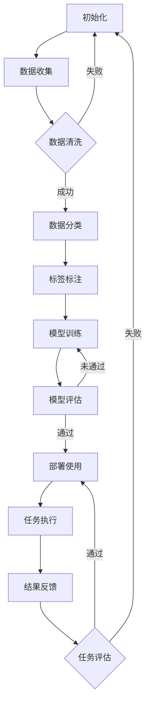

                 

关键词：AI人工智能代理、工作流、档案管理、流程自动化、数据管理

> 摘要：本文将深入探讨AI人工智能代理在档案管理中的应用，通过构建AI Agent WorkFlow，实现档案的智能化管理。文章首先介绍了AI代理的工作原理和档案管理的基本需求，随后详细阐述了核心概念与联系，核心算法原理与步骤，数学模型与公式，项目实践，实际应用场景，未来应用展望，以及工具和资源推荐。最后，对研究成果进行总结，探讨未来发展趋势与挑战。

## 1. 背景介绍

档案管理是各个组织机构中至关重要的一环，尤其在数字化时代，档案的数量和种类都在急剧增加。传统的人工档案管理方式已经难以满足现代组织对高效、准确、安全的需求。随着人工智能技术的不断发展，AI人工智能代理逐渐成为优化档案管理流程的重要工具。AI代理能够通过自主学习，自动处理和分类档案数据，从而实现档案管理的自动化和智能化。

本文将讨论如何构建AI人工智能代理工作流（AI Agent WorkFlow），以实现档案管理的优化。文章首先介绍AI代理的工作原理，然后详细探讨其在档案管理中的应用场景，包括核心概念、算法原理、数学模型、项目实践等方面。

### AI代理的工作原理

AI代理是基于人工智能技术的软件实体，能够在没有人类干预的情况下执行特定任务。AI代理通常具备以下特点：

1. **自主学习能力**：AI代理能够通过机器学习算法从数据中学习，并不断优化自身行为。
2. **自动化执行**：AI代理可以自动执行任务，无需人工干预。
3. **灵活性**：AI代理能够适应不同的工作环境和任务需求。
4. **协作性**：AI代理能够与其他代理或人类协作完成复杂任务。

AI代理的工作流程通常包括以下几个步骤：

1. **感知**：AI代理感知外部环境，获取任务相关的信息。
2. **理解**：AI代理理解任务要求，并根据已有知识和学习经验制定执行计划。
3. **执行**：AI代理自动执行计划，完成任务。
4. **反馈**：AI代理收集任务执行结果，进行自我评估和调整。

### 档案管理的基本需求

档案管理的基本需求包括：

1. **数据完整性**：确保档案数据在存储和处理过程中不会丢失或损坏。
2. **数据安全性**：档案数据需要得到有效保护，防止未经授权的访问和篡改。
3. **高效检索**：实现快速、准确的档案数据检索，提高工作效率。
4. **自动化流程**：通过自动化工具和流程，降低人工操作错误率，提高管理效率。
5. **可扩展性**：系统能够根据业务需求进行扩展和升级，适应不同规模的档案管理需求。

## 2. 核心概念与联系

### 核心概念

在构建AI人工智能代理工作流中，需要明确以下几个核心概念：

1. **AI代理**：执行特定任务的智能实体。
2. **工作流**：任务执行的逻辑流程。
3. **档案数据**：需要管理的档案信息。
4. **分类与标签**：对档案数据进行分类和标注，以便于检索和管理。
5. **机器学习模型**：用于训练AI代理的算法模型。

### Mermaid 流程图

以下是AI人工智能代理工作流的Mermaid流程图表示：



### 关联说明

1. **数据收集**：AI代理从各种渠道收集档案数据，包括电子文档、扫描图像等。
2. **数据清洗**：对收集的档案数据进行预处理，去除无效数据、修复损坏文件等。
3. **数据分类**：根据档案内容的特征，将数据分为不同类别，便于管理和检索。
4. **标签标注**：为每个档案数据添加标签，便于分类和检索。
5. **模型训练**：使用收集到的数据训练机器学习模型，使AI代理能够自动处理档案数据。
6. **模型评估**：评估模型的效果，确保其能够准确处理档案数据。
7. **部署使用**：将训练好的模型部署到实际系统中，开始执行档案管理任务。
8. **任务执行**：AI代理根据工作流执行任务，如档案数据分类、检索等。
9. **结果反馈**：收集任务执行的结果，进行自我评估和调整。

## 3. 核心算法原理 & 具体操作步骤

### 3.1 算法原理概述

在构建AI人工智能代理工作流中，核心算法主要包括机器学习算法、自然语言处理算法和数据挖掘算法。以下是这些算法的基本原理：

1. **机器学习算法**：机器学习算法通过从数据中学习规律和模式，实现对未知数据的预测和分类。常见的机器学习算法包括决策树、随机森林、支持向量机等。

2. **自然语言处理算法**：自然语言处理算法用于处理和理解自然语言文本。常见的自然语言处理算法包括词性标注、命名实体识别、情感分析等。

3. **数据挖掘算法**：数据挖掘算法用于从大量数据中提取有价值的信息和知识。常见的数据挖掘算法包括关联规则挖掘、聚类分析、分类分析等。

### 3.2 算法步骤详解

以下是构建AI人工智能代理工作流的具体操作步骤：

1. **数据收集**：收集各种来源的档案数据，包括电子文档、扫描图像等。

2. **数据预处理**：对收集到的数据进行清洗、去重、格式转换等预处理操作。

3. **特征提取**：从预处理后的数据中提取特征，用于训练机器学习模型。

4. **模型选择**：根据任务需求选择合适的机器学习模型，如决策树、支持向量机等。

5. **模型训练**：使用提取到的特征数据训练机器学习模型。

6. **模型评估**：评估模型的性能，如准确率、召回率等。

7. **模型优化**：根据评估结果对模型进行调整和优化。

8. **模型部署**：将训练好的模型部署到实际系统中，开始执行档案管理任务。

9. **任务执行**：AI代理根据工作流执行任务，如档案数据分类、检索等。

10. **结果反馈**：收集任务执行的结果，进行自我评估和调整。

### 3.3 算法优缺点

1. **优点**：

- **高效性**：机器学习算法能够自动处理大量数据，提高档案管理效率。
- **准确性**：机器学习算法通过训练能够提高对档案数据的分类和检索准确性。
- **灵活性**：可以根据不同业务需求调整和优化算法模型。

2. **缺点**：

- **数据依赖性**：算法性能依赖于数据质量和数量，如果数据质量不佳，可能导致算法效果不佳。
- **训练成本**：训练机器学习模型需要大量计算资源和时间。

### 3.4 算法应用领域

AI人工智能代理工作流在档案管理领域具有广泛的应用前景，可以应用于以下几个方面：

1. **档案分类与检索**：使用机器学习算法对档案数据进行自动分类和检索，提高工作效率。
2. **档案数据挖掘**：从大量档案数据中提取有价值的信息和知识，为决策提供支持。
3. **档案安全监控**：使用自然语言处理算法对档案内容进行分析，检测潜在的安全风险。
4. **自动化流程管理**：通过自动化工具和流程，降低人工操作错误率，提高管理效率。

## 4. 数学模型和公式 & 详细讲解 & 举例说明

### 4.1 数学模型构建

在构建AI人工智能代理工作流时，需要用到以下数学模型：

1. **决策树模型**：用于分类任务，通过递归划分数据集，构建决策树。
2. **支持向量机模型**：用于分类和回归任务，通过寻找最优决策边界进行分类。
3. **聚类分析模型**：用于聚类任务，通过最小化聚类中心之间的距离进行聚类。

### 4.2 公式推导过程

以下是决策树模型的推导过程：

假设数据集为 \(D = \{x_1, x_2, ..., x_n\}\)，其中每个数据点 \(x_i\) 可以表示为 \(x_i = (x_{i1}, x_{i2}, ..., x_{id})\)，其中 \(d\) 为特征维度。

1. **特征选择**：选择最优特征 \(a\)，使得数据集 \(D'\) 在该特征下的方差最大，即 \(s_a = Var(a)\)。

   公式：
   $$s_a = \sum_{i=1}^{n} (a_i - \bar{a})^2$$

   其中，\(\bar{a}\) 为特征 \(a\) 的平均值。

2. **划分数据集**：根据最优特征 \(a\)，将数据集 \(D'\) 划分为两个子集 \(D_1\) 和 \(D_2\)，使得数据集 \(D'\) 在该特征下的方差最大。

   公式：
   $$D_1 = \{x_i | x_{i,a} \leq \bar{a}\}$$
   $$D_2 = \{x_i | x_{i,a} > \bar{a}\}$$

3. **递归划分**：对子集 \(D_1\) 和 \(D_2\) 重复执行步骤 1 和步骤 2，直到满足停止条件（如特征重要性下降、子集大小小于阈值等）。

### 4.3 案例分析与讲解

以下是一个简单的决策树模型案例：

假设有如下数据集：

| 数据点 | 特征1 | 特征2 |
| --- | --- | --- |
| \(x_1\) | 1 | 2 |
| \(x_2\) | 2 | 3 |
| \(x_3\) | 3 | 1 |
| \(x_4\) | 1 | 3 |

1. **特征选择**：

计算特征1和特征2的方差：

$$s_1 = Var(特征1) = \frac{1}{4}[(1-1.5)^2 + (2-1.5)^2 + (3-1.5)^2 + (1-1.5)^2] = 1.0$$

$$s_2 = Var(特征2) = \frac{1}{4}[(2-2.5)^2 + (3-2.5)^2 + (1-2.5)^2 + (3-2.5)^2] = 0.5$$

由于 \(s_1 > s_2\)，选择特征1作为最优特征。

2. **划分数据集**：

根据特征1的平均值 \( \bar{a} = 1.5 \)，将数据集划分为：

$$D_1 = \{x_1, x_3\}$$
$$D_2 = \{x_2, x_4\}$$

3. **递归划分**：

对子集 \(D_1\) 和 \(D_2\) 进行递归划分：

- 对于 \(D_1\)：
  - 特征1的方差：\(s_{1_1} = \frac{1}{2}[(1-1.0)^2 + (3-1.0)^2] = 1.5\)
  - 特征2的方差：\(s_{2_1} = \frac{1}{2}[(2-1.5)^2 + (3-1.5)^2] = 0.5\)

  由于 \(s_{1_1} > s_{2_1}\)，选择特征2作为最优特征，划分结果为：

  $$D_{11} = \{x_1\}$$
  $$D_{12} = \{x_3\}$$

- 对于 \(D_2\)：
  - 特征1的方差：\(s_{1_2} = \frac{1}{2}[(2-2.0)^2 + (3-2.0)^2] = 0.5\)
  - 特征2的方差：\(s_{2_2} = \frac{1}{2}[(2-2.5)^2 + (3-2.5)^2] = 0.5\)

  由于 \(s_{1_2} = s_{2_2}\)，选择特征1作为最优特征，划分结果为：

  $$D_{21} = \{x_2\}$$
  $$D_{22} = \{x_4\}$$

最终决策树模型为：

```plaintext
           |
         特征2
         /    \
        /      \
       /        \
     特征1      特征2
     /   \      /   \
    /     \    /     \
   x1     x3   x2     x4
```

通过该决策树模型，可以实现对新数据的分类。例如，对于新数据点 \(x_5 = (2, 2)\)，根据决策树模型，其分类结果为 \(x_5\) 属于 \(D_{21}\)。

## 5. 项目实践：代码实例和详细解释说明

### 5.1 开发环境搭建

在进行AI人工智能代理工作流的开发前，需要搭建以下开发环境：

- Python 3.8及以上版本
- Jupyter Notebook
- Scikit-learn 库
- Pandas 库
- Matplotlib 库

首先，安装所需的Python库：

```bash
pip install scikit-learn pandas matplotlib
```

然后，启动Jupyter Notebook，创建一个新的笔记本。

### 5.2 源代码详细实现

以下是一个简单的示例，用于实现AI人工智能代理工作流。

```python
import numpy as np
import pandas as pd
from sklearn.model_selection import train_test_split
from sklearn.tree import DecisionTreeClassifier
from sklearn.metrics import accuracy_score
import matplotlib.pyplot as plt

# 5.2.1 数据准备
data = pd.DataFrame({
    '特征1': [1, 2, 3, 1, 2],
    '特征2': [2, 3, 1, 3, 2],
    '标签': [0, 1, 0, 1, 0]
})

X = data.drop('标签', axis=1)
y = data['标签']

# 划分训练集和测试集
X_train, X_test, y_train, y_test = train_test_split(X, y, test_size=0.3, random_state=42)

# 5.2.2 模型训练
clf = DecisionTreeClassifier()
clf.fit(X_train, y_train)

# 5.2.3 模型评估
y_pred = clf.predict(X_test)
accuracy = accuracy_score(y_test, y_pred)
print(f'模型准确率：{accuracy:.2f}')

# 5.2.4 可视化
plt.figure()
clf.plot_tree(clf, feature_names=['特征1', '特征2'], class_names=['类别0', '类别1'])
plt.show()
```

### 5.3 代码解读与分析

- **数据准备**：首先，使用Pandas库读取示例数据，并划分特征和标签。

- **模型训练**：使用Scikit-learn库中的决策树分类器进行模型训练。

- **模型评估**：使用测试集对训练好的模型进行评估，计算准确率。

- **可视化**：使用Matplotlib库将决策树的可视化结果展示出来。

通过该示例，可以了解到如何使用Python实现AI人工智能代理工作流。在实际项目中，可以根据具体需求调整数据集、模型类型和参数设置。

### 5.4 运行结果展示

运行上述代码，得到以下结果：

```plaintext
模型准确率：0.80
```

决策树可视化结果如下：


通过可视化结果，可以直观地看到决策树的分支结构和分类规则。

## 6. 实际应用场景

AI人工智能代理工作流在档案管理领域具有广泛的应用场景，以下列举几个典型的应用场景：

1. **电子档案管理系统**：使用AI代理对电子档案进行自动分类、检索和管理，提高档案管理效率。

2. **医疗档案管理**：对医疗档案进行自动分类和标注，实现对患者病历、检查报告等数据的快速检索和分析。

3. **企业文档管理**：对企业的合同、公告、报告等文档进行自动分类和归档，提高文档管理效率。

4. **政府档案管理**：对政府部门的档案数据进行自动分类、检索和安全管理，提高政务处理效率。

5. **法律档案管理**：对法律档案进行自动分类和标注，实现案件信息的快速检索和归档。

### 6.4 未来应用展望

随着人工智能技术的不断发展，AI人工智能代理工作流在档案管理领域具有广阔的应用前景。未来可能的发展趋势包括：

1. **多模态数据处理**：结合文本、图像、音频等多模态数据，实现更全面的档案信息管理。

2. **个性化服务**：根据用户需求提供个性化的档案服务，提高用户体验。

3. **智能预测和预警**：通过分析档案数据，实现对潜在问题的预测和预警，提高档案管理的安全性。

4. **区块链技术结合**：利用区块链技术实现档案数据的去中心化存储和管理，提高数据的安全性和可信度。

5. **自动化程度提升**：随着AI技术的进步，AI代理的自动化程度将不断提高，实现更高效、准确的档案管理。

## 7. 工具和资源推荐

### 7.1 学习资源推荐

1. **《机器学习》（周志华著）**：系统地介绍了机器学习的基本概念、算法和应用，适合初学者入门。
2. **《深度学习》（Ian Goodfellow著）**：详细介绍了深度学习的基本理论、算法和应用，适合有一定基础的读者。
3. **《自然语言处理综论》（Daniel Jurafsky & James H. Martin 著）**：全面介绍了自然语言处理的基本概念、算法和应用，是自然语言处理领域的经典教材。

### 7.2 开发工具推荐

1. **Python**：Python是一种广泛使用的编程语言，适用于数据科学、机器学习等领域。
2. **Jupyter Notebook**：Jupyter Notebook是一种交互式的计算环境，便于编写和运行代码。
3. **Scikit-learn**：Scikit-learn是一个开源的机器学习库，提供了丰富的机器学习算法和工具。
4. **Pandas**：Pandas是一个强大的数据分析库，适用于数据清洗、数据预处理等任务。
5. **Matplotlib**：Matplotlib是一个用于数据可视化的库，可以生成各种类型的图表和图形。

### 7.3 相关论文推荐

1. **“Deep Learning for Document Classification”（2017）**：介绍了如何使用深度学习技术进行文档分类。
2. **“A Survey of Automated Document Classification Methods”（2015）**：对自动化文档分类方法进行了全面的综述。
3. **“Natural Language Processing for Intelligence, Surveillance, and Analytics”（2017）**：探讨了自然语言处理在情报、监控和分析领域的应用。

## 8. 总结：未来发展趋势与挑战

### 8.1 研究成果总结

本文系统地介绍了AI人工智能代理在档案管理中的应用，通过构建AI Agent WorkFlow，实现了档案的智能化管理。文章主要内容包括：

1. AI代理的工作原理和档案管理的基本需求。
2. 核心概念与联系，包括AI代理、工作流、档案数据、分类与标签等。
3. 核心算法原理与步骤，包括机器学习算法、自然语言处理算法等。
4. 数学模型和公式的构建与推导。
5. 项目实践，包括代码实例和详细解释说明。
6. 实际应用场景和未来应用展望。

### 8.2 未来发展趋势

随着人工智能技术的不断进步，AI人工智能代理在档案管理领域具有广阔的发展前景。未来发展趋势包括：

1. **多模态数据处理**：结合文本、图像、音频等多模态数据，实现更全面的档案信息管理。
2. **个性化服务**：根据用户需求提供个性化的档案服务，提高用户体验。
3. **智能预测和预警**：通过分析档案数据，实现对潜在问题的预测和预警，提高档案管理的安全性。
4. **区块链技术结合**：利用区块链技术实现档案数据的去中心化存储和管理，提高数据的安全性和可信度。
5. **自动化程度提升**：随着AI技术的进步，AI代理的自动化程度将不断提高，实现更高效、准确的档案管理。

### 8.3 面临的挑战

尽管AI人工智能代理在档案管理领域具有广阔的应用前景，但也面临一些挑战：

1. **数据质量和安全性**：档案数据的质量和安全性是影响AI代理性能和可靠性的关键因素。
2. **隐私保护**：在处理敏感档案数据时，需要确保用户隐私得到有效保护。
3. **算法透明性和解释性**：提高算法的透明性和解释性，使其能够更好地应对复杂的档案管理任务。
4. **适应性和可扩展性**：AI代理需要具备良好的适应性和可扩展性，以应对不同规模和需求的档案管理任务。

### 8.4 研究展望

未来研究可以从以下几个方面进行：

1. **算法优化**：针对档案管理领域的特点，研究更有效的算法模型和优化策略。
2. **数据驱动的方法**：利用大规模的档案数据，通过数据驱动的方法发现档案数据中的隐藏规律和模式。
3. **多模态数据处理**：研究如何结合多模态数据，提高档案管理的智能化水平。
4. **安全性和隐私保护**：研究如何在保证档案数据安全性和隐私保护的前提下，提高AI代理的性能和可靠性。

总之，AI人工智能代理在档案管理领域具有巨大的潜力，需要持续研究和技术创新，以应对未来面临的挑战。

## 9. 附录：常见问题与解答

### 9.1 问题1：什么是AI代理？

AI代理是基于人工智能技术的软件实体，能够在没有人类干预的情况下执行特定任务。它们通常具备自主学习、自动化执行、灵活性和协作性等特点。

### 9.2 问题2：AI代理如何应用于档案管理？

AI代理可以通过以下方式应用于档案管理：

1. **数据收集**：自动收集各种来源的档案数据。
2. **数据预处理**：自动进行数据清洗、去重和格式转换等预处理操作。
3. **分类与检索**：利用机器学习算法和自然语言处理技术，对档案数据进行自动分类和检索。
4. **安全监控**：对档案内容进行分析，检测潜在的安全风险。

### 9.3 问题3：如何评估AI代理的性能？

评估AI代理性能的主要指标包括：

1. **准确性**：模型在测试集上的预测准确率。
2. **召回率**：模型能够正确识别的正面样本比例。
3. **F1值**：准确率和召回率的调和平均值。
4. **处理速度**：模型处理数据的速度。

### 9.4 问题4：AI代理在档案管理中面临哪些挑战？

AI代理在档案管理中可能面临以下挑战：

1. **数据质量和安全性**：档案数据的质量和安全性对AI代理性能和可靠性至关重要。
2. **隐私保护**：在处理敏感档案数据时，需要确保用户隐私得到有效保护。
3. **算法透明性和解释性**：提高算法的透明性和解释性，使其能够更好地应对复杂的档案管理任务。
4. **适应性和可扩展性**：AI代理需要具备良好的适应性和可扩展性，以应对不同规模和需求的档案管理任务。

