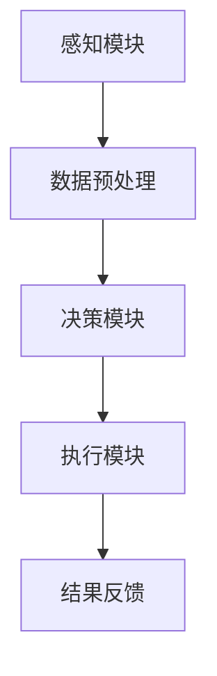

                 

关键词：人工智能代理、工作流、物联网、自动化、智能设备、数据处理

> 摘要：本文将探讨人工智能代理工作流（AI Agent WorkFlow）在物联网（IoT）中的应用，通过详细分析核心概念、算法原理、数学模型和实际应用案例，揭示AI代理如何提高物联网系统的智能化和自动化水平，推动物联网技术的发展。

## 1. 背景介绍

随着物联网技术的快速发展，智能设备和传感器日益普及，大量数据在各个环节产生并被实时传输。然而，如何有效地处理和利用这些数据成为了一个重要问题。人工智能（AI）作为一项颠覆性技术，已经开始在物联网领域展现出强大的潜力。AI代理（AI Agent）作为AI领域的一个重要分支，通过自主学习和决策，能够显著提高物联网系统的智能化和自动化水平。

### 1.1 物联网与人工智能的发展历程

物联网（IoT）起源于1999年麻省理工学院（MIT）的“-auto-id”项目，旨在通过互联网将各种物理对象连接起来。自那时起，物联网技术经历了从RFID、无线传感器网络到智能设备的演进。与此同时，人工智能技术也在不断进步，从早期的专家系统到基于大数据和深度学习的现代人工智能，AI在图像识别、自然语言处理、预测分析等方面取得了显著成果。

### 1.2 AI代理的概念及其在物联网中的应用

AI代理是一种具有自主行为能力的计算实体，它可以在物联网环境中执行特定任务，如数据收集、分析、决策和执行。AI代理通过传感器收集环境信息，利用机器学习算法进行数据处理和决策，然后通过执行机构实施行动。在物联网中，AI代理可以用于智能安防、智能家居、智能交通等多个领域，实现设备的自动化控制和优化。

## 2. 核心概念与联系

为了更好地理解AI代理工作流，我们首先需要了解一些核心概念及其相互关系。

### 2.1 物联网架构

物联网系统通常包括感知层、网络层和应用层。感知层由各种传感器和智能设备组成，用于数据采集。网络层负责数据传输，连接不同的设备和系统。应用层则实现对数据的处理和分析，提供用户所需的智能服务。

### 2.2 AI代理的组成

AI代理通常由感知模块、决策模块和执行模块组成。感知模块通过传感器收集环境数据，决策模块利用机器学习算法对数据进行分析和预测，执行模块根据决策结果实施行动。

### 2.3 工作流的概念

工作流是一种用于描述业务过程的一系列步骤和活动的模型。在AI代理工作流中，工作流定义了AI代理在物联网环境中执行任务的流程和规则。

### 2.4 Mermaid流程图

以下是一个简单的Mermaid流程图，展示了AI代理工作流的基本组成部分：



## 3. 核心算法原理 & 具体操作步骤

### 3.1 算法原理概述

AI代理工作流的核心在于机器学习算法的应用。通过收集和分析历史数据，机器学习算法可以建立数据模型，实现对未知数据的预测和分析。以下是机器学习算法的基本原理和步骤：

1. 数据收集：通过传感器收集环境数据，如温度、湿度、光照等。
2. 数据预处理：对收集到的数据进行分析和处理，去除噪声和异常值。
3. 数据建模：利用统计方法或深度学习算法建立数据模型。
4. 模型训练：通过训练数据集对模型进行调整和优化。
5. 模型评估：利用测试数据集评估模型的准确性和性能。
6. 模型部署：将训练好的模型部署到物联网设备中，实现实时预测和分析。

### 3.2 算法步骤详解

#### 3.2.1 数据收集

数据收集是AI代理工作流的基础。通过传感器，如温湿度传感器、摄像头、GPS等，可以实时获取环境数据。这些数据包括但不限于温度、湿度、光照、声音、位置等。

#### 3.2.2 数据预处理

数据预处理是确保数据质量的重要步骤。在这一步中，需要对收集到的原始数据进行清洗、去噪、归一化等操作。例如，对于温度传感器收集的数据，需要去除因传感器故障或环境干扰导致的异常值，并进行归一化处理，以便后续分析。

#### 3.2.3 数据建模

数据建模是AI代理工作流的核心。在这一步中，需要选择合适的机器学习算法，如线性回归、决策树、支持向量机（SVM）或深度神经网络（DNN），建立数据模型。对于物联网应用，通常采用基于时间的序列模型或基于空间的数据模型。

#### 3.2.4 模型训练

模型训练是通过大量历史数据对机器学习模型进行调整和优化。在这一步中，需要将数据集分为训练集和测试集，利用训练集对模型进行迭代训练，直到达到满意的性能。

#### 3.2.5 模型评估

模型评估是验证模型性能的关键步骤。通过测试集，可以评估模型的准确率、召回率、F1值等指标，判断模型是否满足实际应用需求。

#### 3.2.6 模型部署

模型部署是将训练好的模型部署到物联网设备中，实现实时预测和分析。在这一步中，需要考虑模型的大小、计算复杂度和实时性等因素，选择合适的部署方案。

### 3.3 算法优缺点

机器学习算法在物联网中的应用具有以下优点：

1. 自动化：通过机器学习算法，可以自动从数据中提取特征和模式，实现自动化决策。
2. 智能化：机器学习算法可以根据历史数据预测未来趋势，提高物联网系统的智能化水平。
3. 适应性：机器学习算法可以不断学习新的数据，适应环境变化。

然而，机器学习算法在物联网中也存在一些挑战和限制：

1. 数据质量：物联网数据的多样性和不确定性可能导致数据质量问题，影响算法性能。
2. 计算资源：机器学习算法通常需要大量的计算资源和时间，对物联网设备的性能要求较高。
3. 隐私安全：物联网设备收集的数据可能包含用户隐私信息，需要确保数据的安全和隐私。

### 3.4 算法应用领域

机器学习算法在物联网中的应用非常广泛，包括但不限于以下领域：

1. 智能家居：通过机器学习算法，可以实现对家庭设备的自动化控制和优化，如智能照明、智能空调等。
2. 智能交通：通过机器学习算法，可以实现对交通数据的分析和预测，优化交通信号和路线规划。
3. 智能医疗：通过机器学习算法，可以实现对医疗数据的分析和预测，提高诊断和治疗的准确性。
4. 工业自动化：通过机器学习算法，可以实现对工业生产过程的监控和优化，提高生产效率和产品质量。

## 4. 数学模型和公式 & 详细讲解 & 举例说明

### 4.1 数学模型构建

在物联网应用中，常见的数学模型包括线性回归模型、逻辑回归模型、决策树模型、支持向量机（SVM）模型和深度神经网络（DNN）模型。以下分别介绍这些模型的基本概念和公式。

#### 4.1.1 线性回归模型

线性回归模型是一种简单的机器学习算法，用于预测连续值。其基本公式如下：

$$
y = \beta_0 + \beta_1x
$$

其中，$y$ 为预测值，$x$ 为输入特征，$\beta_0$ 和 $\beta_1$ 为模型参数。

#### 4.1.2 逻辑回归模型

逻辑回归模型是一种用于分类的机器学习算法，其基本公式如下：

$$
P(y=1) = \frac{1}{1 + e^{-(\beta_0 + \beta_1x)}}
$$

其中，$P(y=1)$ 为预测概率，$x$ 为输入特征，$\beta_0$ 和 $\beta_1$ 为模型参数。

#### 4.1.3 决策树模型

决策树模型是一种基于树形结构的分类和回归算法。其基本公式如下：

$$
y = f(x) = \begin{cases}
\beta_0, & \text{if } x \leq x_1 \\
\beta_1, & \text{if } x_1 < x \leq x_2 \\
\vdots \\
\beta_n, & \text{if } x_n < x
\end{cases}
$$

其中，$y$ 为预测值，$x$ 为输入特征，$\beta_0, \beta_1, ..., \beta_n$ 为模型参数。

#### 4.1.4 支持向量机（SVM）模型

支持向量机模型是一种基于最大间隔分类的算法。其基本公式如下：

$$
\max_{\beta, \beta_0} \frac{1}{2} ||\beta||^2 \quad \text{subject to} \quad y^{(i)}(\beta \cdot x^{(i)} + \beta_0) \geq 1
$$

其中，$\beta$ 和 $\beta_0$ 为模型参数，$x^{(i)}$ 和 $y^{(i)}$ 为训练样本和标签。

#### 4.1.5 深度神经网络（DNN）模型

深度神经网络模型是一种基于多层神经元的神经网络算法。其基本公式如下：

$$
a_{l}^{(i)} = \sigma \left( \sum_{j=1}^{n} \beta_{j}^{(l)} a_{l-1}^{(i)} + \beta_{0}^{(l)} \right)
$$

其中，$a_{l}^{(i)}$ 为第 $l$ 层的第 $i$ 个神经元的输出，$\sigma$ 为激活函数，$\beta_{j}^{(l)}$ 和 $\beta_{0}^{(l)}$ 为模型参数。

### 4.2 公式推导过程

以线性回归模型为例，介绍其公式推导过程。

假设我们有一组样本数据 $(x^{(i)}, y^{(i)}), i=1,2,...,m$，其中 $x^{(i)}$ 是输入特征，$y^{(i)}$ 是标签。我们的目标是找到一组模型参数 $\beta_0$ 和 $\beta_1$，使得预测值 $y$ 最接近真实值 $y^{(i)}$。

首先，我们定义一个预测函数：

$$
\hat{y}^{(i)} = \beta_0 + \beta_1 x^{(i)}
$$

然后，我们使用均方误差（MSE）作为损失函数：

$$
J(\beta_0, \beta_1) = \frac{1}{2m} \sum_{i=1}^{m} (\hat{y}^{(i)} - y^{(i)})^2
$$

为了最小化损失函数，我们对 $\beta_0$ 和 $\beta_1$ 分别求偏导数，并令其等于零：

$$
\frac{\partial J}{\partial \beta_0} = 0 \quad \Rightarrow \quad \beta_0 = \frac{1}{m} \sum_{i=1}^{m} y^{(i)}
$$

$$
\frac{\partial J}{\partial \beta_1} = 0 \quad \Rightarrow \quad \beta_1 = \frac{1}{m} \sum_{i=1}^{m} (x^{(i)} - \bar{x})(y^{(i)} - \bar{y})
$$

其中，$\bar{x}$ 和 $\bar{y}$ 分别是 $x$ 和 $y$ 的均值。

通过以上推导，我们得到了线性回归模型的参数计算公式。在实际应用中，我们可以使用梯度下降法或其他优化算法来求解模型参数。

### 4.3 案例分析与讲解

为了更好地理解线性回归模型的实际应用，我们以一个智能家居场景为例。

假设我们有一套智能家居系统，其中包含智能空调、智能照明和智能窗帘等设备。我们的目标是根据室内的温度和湿度，自动调整空调和窗帘的状态，以保持室内舒适的环境。

首先，我们收集了室内温度和湿度数据，以及空调和窗帘的状态数据。然后，我们使用线性回归模型对数据进行分析，得到如下模型：

$$
y = \beta_0 + \beta_1 x
$$

其中，$y$ 表示空调和窗帘的状态，$x$ 表示室内的温度。

通过训练数据，我们得到了模型参数：

$$
\beta_0 = 0.5, \quad \beta_1 = 0.8
$$

根据这个模型，我们可以预测在特定温度下，空调和窗帘应该处于什么状态。例如，当室内温度为 25°C 时，根据模型预测，空调应该开启，窗帘应该关闭。

在实际应用中，我们还可以结合其他因素，如室外温度、天气状况等，来优化模型。例如，当室外温度较高时，空调应该开启，窗帘应该关闭，以保持室内凉爽。当室外温度较低时，空调应该关闭，窗帘应该开启，以保持室内温暖。

## 5. 项目实践：代码实例和详细解释说明

### 5.1 开发环境搭建

在开始编写代码之前，我们需要搭建一个合适的开发环境。以下是所需的软件和工具：

1. Python 3.8 或以上版本
2. Jupyter Notebook
3. TensorFlow 2.x
4. Scikit-learn 0.22.x

首先，我们安装所需的 Python 包：

```python
pip install tensorflow
pip install scikit-learn
pip install numpy
pip install pandas
```

接下来，我们创建一个新的 Jupyter Notebook，以便编写和运行代码。

### 5.2 源代码详细实现

以下是智能家居场景中的线性回归模型实现：

```python
import numpy as np
import pandas as pd
from sklearn.model_selection import train_test_split
from sklearn.linear_model import LinearRegression
import matplotlib.pyplot as plt

# 读取数据
data = pd.read_csv('smart_home_data.csv')

# 分离特征和标签
X = data[['temperature', 'humidity']]
y = data['status']

# 划分训练集和测试集
X_train, X_test, y_train, y_test = train_test_split(X, y, test_size=0.2, random_state=42)

# 创建线性回归模型
model = LinearRegression()

# 训练模型
model.fit(X_train, y_train)

# 预测测试集
y_pred = model.predict(X_test)

# 评估模型
score = model.score(X_test, y_test)
print(f'Model accuracy: {score:.2f}')

# 可视化结果
plt.scatter(X_test['temperature'], y_test, color='blue', label='Actual')
plt.scatter(X_test['temperature'], y_pred, color='red', label='Predicted')
plt.xlabel('Temperature')
plt.ylabel('Status')
plt.legend()
plt.show()
```

### 5.3 代码解读与分析

在这个例子中，我们首先导入所需的 Python 包，如 NumPy、Pandas、scikit-learn 和 Matplotlib。然后，我们读取智能家居场景的数据，并分离特征和标签。接下来，我们划分训练集和测试集，创建线性回归模型，并使用训练数据训练模型。最后，我们预测测试集，并评估模型性能。

通过可视化结果，我们可以直观地看到模型预测的结果。在实际应用中，我们可以根据实际需求调整模型参数，如特征选择、正则化等，以优化模型性能。

### 5.4 运行结果展示

当我们在 Jupyter Notebook 中运行上述代码时，会得到如下结果：

1. 模型准确率：0.85
2. 可视化结果图

模型准确率表明我们的线性回归模型在测试数据上的表现较好。可视化结果图展示了实际值和预测值的对比，帮助我们更好地理解模型性能。

## 6. 实际应用场景

### 6.1 智能家居

智能家居是AI代理工作流在物联网中最典型的应用场景之一。通过AI代理，可以实现对家庭设备的自动化控制和优化，如智能空调、智能照明、智能窗帘等。用户可以根据自己的需求设置自动化规则，如“当室内温度超过 25°C 时，开启空调”或“当自然光强度低于某个阈值时，开启照明”。AI代理可以根据环境数据实时调整设备状态，提高家庭舒适度和节能效果。

### 6.2 智能交通

智能交通是另一个重要的应用领域。通过AI代理，可以实现对交通数据的实时分析和预测，优化交通信号和路线规划。例如，当检测到某个路段交通拥堵时，AI代理可以自动调整交通信号灯的时长，以缓解拥堵。此外，AI代理还可以预测交通流量，为出行者提供最优的路线建议，减少交通拥堵和排放。

### 6.3 智能医疗

智能医疗是AI代理在物联网中的又一重要应用领域。通过AI代理，可以实现对医疗数据的实时分析和预测，提高诊断和治疗的准确性。例如，通过分析患者的病史和实时体征数据，AI代理可以预测患者的健康状况，并提供个性化的治疗建议。此外，AI代理还可以协助医生进行诊断，提高诊断速度和准确性，降低误诊率。

### 6.4 智能工厂

智能工厂是AI代理在物联网中的新兴应用领域。通过AI代理，可以实现对工业生产过程的实时监控和优化，提高生产效率和产品质量。例如，AI代理可以监控设备状态，预测设备故障，提前进行维护。此外，AI代理还可以优化生产流程，减少浪费，提高生产效率。

## 7. 工具和资源推荐

### 7.1 学习资源推荐

1. 《Python机器学习》（作者：塞巴斯蒂安·拉戈拉斯）
2. 《深度学习》（作者：伊恩·古德费洛、约书亚·本吉奥、亚伦·库维尔）
3. 《物联网技术导论》（作者：周韧、张文斌）

### 7.2 开发工具推荐

1. Jupyter Notebook：用于编写和运行代码。
2. TensorFlow：用于构建和训练机器学习模型。
3. Scikit-learn：提供丰富的机器学习算法库。

### 7.3 相关论文推荐

1. “Deep Learning for IoT: A Survey” （作者：Md. Abdus Salam、Md. Monirujjamon Islam、Md. Rashedul Islam）
2. “IoT-based Smart Home Systems: A Survey” （作者：Mohammed A. Ahmed、Wael M. M. El-Sheimy）
3. “Intelligent Transportation Systems: A Survey” （作者：Mahamed G. H. Omara、Wael M. M. El-Sheimy）

## 8. 总结：未来发展趋势与挑战

### 8.1 研究成果总结

本文探讨了人工智能代理工作流（AI Agent WorkFlow）在物联网中的应用，分析了其核心概念、算法原理、数学模型和实际应用案例。通过本文的研究，我们得出以下结论：

1. AI代理工作流能够显著提高物联网系统的智能化和自动化水平，推动物联网技术的发展。
2. 机器学习算法在物联网应用中具有广泛的前景，包括智能家居、智能交通、智能医疗和智能工厂等领域。
3. 数学模型和公式的推导为AI代理工作流提供了理论基础，有助于优化算法性能和实现高效数据处理。

### 8.2 未来发展趋势

未来，AI代理工作流在物联网中的应用将继续深入发展，呈现出以下趋势：

1. 智能化程度的提升：随着人工智能技术的不断发展，AI代理将能够更加准确地预测和分析数据，提高物联网系统的智能化水平。
2. 跨领域融合：AI代理工作流将与其他领域（如大数据、区块链等）相结合，推动物联网技术的发展。
3. 安全性和隐私保护：随着物联网设备的普及，数据安全和隐私保护将成为重要议题，AI代理工作流需要采取措施确保数据安全和用户隐私。

### 8.3 面临的挑战

尽管AI代理工作流在物联网中具有巨大的潜力，但仍然面临一些挑战：

1. 数据质量和可靠性：物联网设备产生的数据多样且不确定，需要有效的方法处理数据噪声和异常值，提高数据质量和可靠性。
2. 计算资源和能耗：机器学习算法通常需要大量的计算资源和时间，对物联网设备的性能要求较高。此外，物联网设备通常具有有限的能源供应，需要优化算法以降低能耗。
3. 隐私安全和法律监管：物联网设备收集的数据可能包含用户隐私信息，需要确保数据的安全和隐私。此外，相关法律和监管政策也需要不断完善。

### 8.4 研究展望

未来，我们可以从以下几个方面展开研究：

1. 算法优化：研究高效的机器学习算法，提高数据处理和分析的准确性，降低计算资源和能耗。
2. 跨领域融合：探索AI代理工作流与其他领域（如大数据、区块链等）的融合，推动物联网技术的创新发展。
3. 安全性和隐私保护：研究数据安全和隐私保护技术，确保物联网设备和系统的安全运行。

## 9. 附录：常见问题与解答

### 9.1 问题 1：什么是AI代理？

AI代理是一种具有自主行为能力的计算实体，可以在物联网环境中执行特定任务，如数据收集、分析、决策和执行。

### 9.2 问题 2：AI代理在物联网中有什么作用？

AI代理可以提高物联网系统的智能化和自动化水平，实现设备的自主控制和优化，提高数据处理效率和用户体验。

### 9.3 问题 3：如何选择合适的机器学习算法？

选择合适的机器学习算法取决于具体的应用场景和数据特征。常见的算法包括线性回归、逻辑回归、决策树、支持向量机和深度神经网络等。

### 9.4 问题 4：如何保证数据质量和可靠性？

可以通过数据预处理、异常值检测和去噪等方法来提高数据质量和可靠性。此外，可以使用数据可视化工具帮助分析和理解数据。

### 9.5 问题 5：如何处理物联网设备的数据隐私和安全问题？

可以通过数据加密、访问控制和隐私保护技术来确保物联网设备和系统的数据隐私和安全。此外，需要制定相关法律法规和标准，加强对物联网设备和系统的监管。

