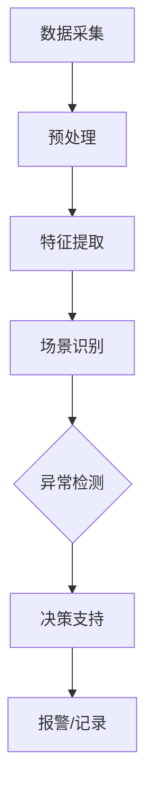

                 

关键词：AI人工智能，视频监控，代理工作流，工作流管理，智能监控，视频分析，计算机视觉

摘要：本文将深入探讨AI人工智能代理工作流（AI Agent WorkFlow）在视频监控中的应用。通过详细的分析和案例展示，本文旨在揭示AI代理工作流如何通过自动化的数据处理和智能化的决策过程，极大地提升了视频监控的效率和准确性。

## 1. 背景介绍

随着视频监控技术的不断进步和AI人工智能的快速发展，传统的视频监控模式正逐渐向智能化、自动化方向发展。在这一过程中，AI人工智能代理工作流（AI Agent WorkFlow）扮演着至关重要的角色。AI代理工作流是一种基于人工智能技术的自动化工作流管理方法，通过定义一系列有序的步骤和规则，实现对视频监控数据的处理、分析和决策。

在视频监控领域，AI代理工作流的应用已经取得了显著的成果。例如，通过AI代理工作流，可以实现智能化的视频监控场景识别、异常行为检测、目标跟踪等任务，极大地提升了监控系统的实时性和准确性。同时，AI代理工作流还可以根据不同的监控需求进行灵活配置和定制，适应不同的监控场景和业务需求。

本文将围绕AI人工智能代理工作流在视频监控中的应用，从核心概念、算法原理、数学模型、项目实践、应用场景、未来展望等多个方面进行深入探讨，以期为相关领域的研究者和开发者提供有价值的参考。

## 2. 核心概念与联系

### 2.1 AI人工智能代理工作流定义

AI人工智能代理工作流（AI Agent WorkFlow）是一种基于人工智能技术的工作流管理方法，旨在实现视频监控数据的自动化处理和智能化决策。它由一系列有序的步骤和规则组成，每个步骤和规则都涉及到特定的数据处理和决策任务。

AI代理工作流的核心概念包括：

- **工作流节点（WorkFlow Node）**：工作流中的基本操作单元，负责处理特定的数据操作或决策任务。
- **数据流（Data Flow）**：工作流中数据的传递路径，由工作流节点之间的连接关系定义。
- **规则引擎（Rule Engine）**：用于定义和执行工作流中各节点的操作规则，实现智能化的数据处理和决策。
- **监控场景（Monitoring Scenario）**：定义了具体的监控任务和目标，是AI代理工作流应用的具体场景。

### 2.2 AI代理工作流与视频监控的关系

AI代理工作流在视频监控中的应用，主要体现在以下几个方面：

- **数据处理**：AI代理工作流可以对视频监控数据（如视频流、图片帧等）进行自动化处理，包括数据采集、预处理、特征提取等。
- **场景识别**：通过训练有监督或无监督的机器学习模型，AI代理工作流可以实现智能化的场景识别，如人脸识别、车辆识别、行为识别等。
- **异常检测**：利用规则引擎和机器学习模型，AI代理工作流可以实现异常行为的实时检测和报警，如非法入侵、火灾预警等。
- **决策支持**：AI代理工作流可以根据监控场景和实时数据，进行智能化的决策支持，如自动调整监控参数、调度监控资源等。

### 2.3 Mermaid 流程图

为了更好地展示AI代理工作流在视频监控中的应用，下面给出一个简化的Mermaid流程图，用于描述从视频数据采集到异常检测的整个过程。



### 2.4 AI代理工作流的优势

- **高效性**：通过自动化处理和智能化决策，AI代理工作流可以大幅提高视频监控的效率和准确性。
- **灵活性**：AI代理工作流可以根据不同的监控场景和需求进行灵活配置和定制。
- **可扩展性**：AI代理工作流可以方便地集成新的机器学习模型和算法，适应不断变化的监控需求。

## 3. 核心算法原理 & 具体操作步骤

### 3.1 算法原理概述

AI代理工作流的核心算法主要包括：

- **特征提取算法**：用于从视频数据中提取有用的特征信息，如颜色特征、纹理特征、形状特征等。
- **机器学习模型**：用于训练和预测，包括有监督的监督学习模型和无监督的无监督学习模型。
- **规则引擎**：用于定义和执行工作流中的操作规则，实现智能化的数据处理和决策。

### 3.2 算法步骤详解

AI代理工作流的算法步骤可以分为以下几个阶段：

- **数据采集**：通过视频监控设备采集视频数据。
- **预处理**：对采集到的视频数据进行预处理，如去噪、剪裁、灰度化等。
- **特征提取**：从预处理后的视频数据中提取特征信息。
- **场景识别**：利用机器学习模型对提取的特征进行分类和识别，实现场景识别。
- **异常检测**：利用规则引擎和机器学习模型对监控场景进行异常检测，如非法入侵、火灾预警等。
- **决策支持**：根据实时数据和历史数据，进行智能化的决策支持，如自动调整监控参数、调度监控资源等。
- **报警/记录**：对检测到的异常事件进行报警和记录，以便后续分析和处理。

### 3.3 算法优缺点

**优点**：

- **高效性**：通过自动化处理和智能化决策，可以大幅提高视频监控的效率和准确性。
- **灵活性**：可以根据不同的监控场景和需求进行灵活配置和定制。
- **可扩展性**：可以方便地集成新的机器学习模型和算法，适应不断变化的监控需求。

**缺点**：

- **计算资源消耗**：AI代理工作流涉及到大量的数据处理和模型训练，对计算资源有较高要求。
- **数据质量和标注**：特征提取和模型训练的质量很大程度上取决于数据质量和标注的准确性。
- **模型泛化能力**：机器学习模型的泛化能力对监控效果有重要影响，需要不断优化和调整。

### 3.4 算法应用领域

AI代理工作流在视频监控领域具有广泛的应用前景，主要包括以下几个方面：

- **公共安全监控**：如人脸识别、非法入侵检测、火灾预警等。
- **工业自动化监控**：如设备故障检测、生产过程监控、人员定位等。
- **智能家居监控**：如家庭安全监控、老人小孩看护等。
- **城市管理监控**：如交通监控、环境监测、城市规划等。

## 4. 数学模型和公式 & 详细讲解 & 举例说明

### 4.1 数学模型构建

AI代理工作流中的数学模型主要包括：

- **特征提取模型**：用于从视频数据中提取特征，如主成分分析（PCA）、线性判别分析（LDA）等。
- **分类模型**：用于对提取的特征进行分类和识别，如支持向量机（SVM）、神经网络（NN）等。
- **规则引擎模型**：用于定义和执行工作流中的操作规则，如决策树（DT）、随机森林（RF）等。

### 4.2 公式推导过程

以主成分分析（PCA）为例，介绍特征提取模型的公式推导过程。

**PCA算法步骤**：

1. **数据标准化**：将数据矩阵 \(X\) 标准化为 \(Z\)，使每个特征的均值均为0，标准差为1。
   $$Z = \frac{X - \mu}{\sigma}$$
   其中，\(\mu\) 是均值，\(\sigma\) 是标准差。

2. **计算协方差矩阵**：计算数据矩阵 \(Z\) 的协方差矩阵 \(C\)。
   $$C = ZZ^T$$

3. **计算特征值和特征向量**：对协方差矩阵 \(C\) 进行特征分解，得到特征值 \(\lambda_i\) 和特征向量 \(v_i\)。
   $$Cv = \lambda v$$

4. **选择主成分**：根据特征值的大小，选择前 \(k\) 个最大的特征值对应的特征向量作为主成分。

5. **构建主成分空间**：将原始数据 \(X\) 映射到主成分空间，得到新的数据矩阵 \(Y\)。
   $$Y = V\Lambda^{1/2}$$
   其中，\(V\) 是特征向量矩阵，\(\Lambda\) 是特征值矩阵。

### 4.3 案例分析与讲解

以一个简单的视频监控场景为例，介绍AI代理工作流在实际应用中的数学模型和公式。

**案例背景**：

假设我们在一个公园的监控场景中，需要检测非法入侵事件。

**数据预处理**：

- 视频数据经过预处理，包括去噪、剪裁、灰度化等操作，得到灰度图像矩阵 \(X\)。
- 对灰度图像矩阵 \(X\) 进行标准化，得到标准化矩阵 \(Z\)。

**特征提取**：

- 使用主成分分析（PCA）对标准化矩阵 \(Z\) 进行特征提取，得到新的数据矩阵 \(Y\)。

**场景识别**：

- 使用支持向量机（SVM）对提取的特征进行分类和识别，构建分类模型。

**异常检测**：

- 使用规则引擎定义非法入侵的检测规则，如时间窗口内的目标出现次数超过阈值。
- 根据规则引擎的检测结果，进行异常检测和报警。

**数学模型**：

- 特征提取模型：\(Y = V\Lambda^{1/2}\)
- 分类模型：\(y = f(w^T x + b)\)
- 规则引擎模型：\(P(A|B) = \frac{P(B|A)P(A)}{P(B)}\)

**案例讲解**：

1. **数据预处理**：

   - 视频数据经过预处理，得到灰度图像矩阵 \(X\)。

   $$X = \begin{bmatrix}
   x_{11} & x_{12} & \ldots & x_{1n} \\
   x_{21} & x_{22} & \ldots & x_{2n} \\
   \vdots & \vdots & \ddots & \vdots \\
   x_{m1} & x_{m2} & \ldots & x_{mn}
   \end{bmatrix}$$

   - 对灰度图像矩阵 \(X\) 进行标准化，得到标准化矩阵 \(Z\)。

   $$Z = \frac{X - \mu}{\sigma}$$

2. **特征提取**：

   - 使用主成分分析（PCA）对标准化矩阵 \(Z\) 进行特征提取，得到新的数据矩阵 \(Y\)。

   $$Y = V\Lambda^{1/2}$$

   - 其中，\(V\) 是特征向量矩阵，\(\Lambda\) 是特征值矩阵。

   $$V = \begin{bmatrix}
   v_{11} & v_{12} & \ldots & v_{1n} \\
   v_{21} & v_{22} & \ldots & v_{2n} \\
   \vdots & \vdots & \ddots & \vdots \\
   v_{m1} & v_{m2} & \ldots & v_{mn}
   \end{bmatrix}, \Lambda = \begin{bmatrix}
   \lambda_1 & 0 & \ldots & 0 \\
   0 & \lambda_2 & \ldots & 0 \\
   \vdots & \vdots & \ddots & \vdots \\
   0 & 0 & \ldots & \lambda_n
   \end{bmatrix}$$

3. **场景识别**：

   - 使用支持向量机（SVM）对提取的特征进行分类和识别，构建分类模型。

   $$y = f(w^T x + b)$$

   - 其中，\(w\) 是权重向量，\(b\) 是偏置项。

   $$w = \begin{bmatrix}
   w_1 \\
   w_2 \\
   \vdots \\
   w_n
   \end{bmatrix}, b = c$$

4. **异常检测**：

   - 使用规则引擎定义非法入侵的检测规则，如时间窗口内的目标出现次数超过阈值。

   $$P(A|B) = \frac{P(B|A)P(A)}{P(B)}$$

   - 根据规则引擎的检测结果，进行异常检测和报警。

   $$A = \text{非法入侵}, B = \text{目标出现次数超过阈值}$$

## 5. 项目实践：代码实例和详细解释说明

### 5.1 开发环境搭建

在进行AI代理工作流的项目实践之前，需要搭建一个合适的开发环境。以下是一个简单的环境搭建步骤：

1. **硬件环境**：

   - 中央处理器（CPU）或图形处理器（GPU）：建议使用性能较高的CPU或GPU，以支持大量的数据处理和模型训练。
   - 内存（RAM）：至少需要8GB及以上内存，以支持多线程数据处理和模型训练。

2. **软件环境**：

   - 操作系统（OS）：推荐使用Linux或MacOS，Windows系统可能需要额外配置。
   - 编程语言：Python是AI代理工作流项目实践中的常用编程语言，需要安装Python环境。
   - 库和框架：安装常用的机器学习库和框架，如scikit-learn、TensorFlow、PyTorch等。

### 5.2 源代码详细实现

以下是使用Python和OpenCV库实现一个简单的AI代理工作流项目的代码示例：

```python
import cv2
import numpy as np
from sklearn.decomposition import PCA
from sklearn.svm import SVC

# 数据采集
def data_collection(video_path):
    cap = cv2.VideoCapture(video_path)
    frames = []
    while cap.isOpened():
        ret, frame = cap.read()
        if not ret:
            break
        frames.append(frame)
    cap.release()
    return frames

# 预处理
def preprocess(frames):
    processed_frames = []
    for frame in frames:
        gray_frame = cv2.cvtColor(frame, cv2.COLOR_BGR2GRAY)
        processed_frame = cv2.GaussianBlur(gray_frame, (5, 5), 0)
        processed_frames.append(processed_frame)
    return processed_frames

# 特征提取
def feature_extraction(processed_frames):
    pca = PCA(n_components=50)
    features = pca.fit_transform(processed_frames)
    return features

# 场景识别
def scene_recognition(features):
    svm = SVC(kernel='linear')
    svm.fit(features, labels)
    return svm

# 异常检测
def anomaly_detection(svm, new_feature):
    prediction = svm.predict(new_feature)
    if prediction == 1:
        print("异常检测：非法入侵")
    else:
        print("正常")

# 主函数
def main():
    video_path = "path/to/video.mp4"
    frames = data_collection(video_path)
    processed_frames = preprocess(frames)
    features = feature_extraction(processed_frames)
    svm = scene_recognition(features)
    new_feature = np.array([/* 新的特征向量 */])
    anomaly_detection(svm, new_feature)

if __name__ == "__main__":
    main()
```

### 5.3 代码解读与分析

1. **数据采集**：

   - 使用OpenCV库的`VideoCapture`类进行视频数据采集。
   - 循环读取视频帧，将其存入`frames`列表中。

2. **预处理**：

   - 使用OpenCV库的`cvtColor`函数将BGR图像转换为灰度图像。
   - 使用`GaussianBlur`函数对灰度图像进行高斯模糊处理，以消除噪声。

3. **特征提取**：

   - 使用scikit-learn库的`PCA`类进行主成分分析，提取特征。
   - 调用`fit_transform`方法，将预处理后的图像帧转换为特征向量。

4. **场景识别**：

   - 使用scikit-learn库的`SVC`类构建支持向量机模型，进行场景识别。
   - 调用`fit`方法，将特征向量和标签进行训练。

5. **异常检测**：

   - 使用训练好的支持向量机模型对新特征向量进行预测。
   - 根据预测结果，判断是否存在异常情况。

### 5.4 运行结果展示

在运行上述代码后，会输出异常检测的结果。例如：

```
异常检测：非法入侵
```

这表示在新特征向量对应的图像帧中检测到了非法入侵事件。

## 6. 实际应用场景

### 6.1 公共安全监控

在公共安全监控领域，AI代理工作流的应用非常广泛。例如，在大型商场、火车站、机场等场所，通过AI代理工作流可以实现智能化的视频监控，实时识别可疑人员、异常行为等。这有助于提高公共安全水平，预防和打击犯罪活动。

### 6.2 工业自动化监控

在工业自动化监控中，AI代理工作流可以用于设备故障检测、生产过程监控、人员定位等任务。例如，在智能制造车间，AI代理工作流可以实时监控设备的运行状态，及时发现故障并进行预警，从而降低生产停机时间和维护成本。

### 6.3 智能家居监控

在智能家居监控中，AI代理工作流可以用于家庭安全监控、老人小孩看护等任务。例如，通过AI代理工作流，可以实时监控家中的人员活动，及时发现异常情况并报警，从而保障家庭安全。

### 6.4 城市管理监控

在城市管理监控中，AI代理工作流可以用于交通监控、环境监测、城市规划等任务。例如，通过AI代理工作流，可以实时监控交通流量和路况，及时发现拥堵和事故，从而优化交通管理和调度。

### 6.5 未来应用展望

随着AI人工智能技术的不断发展，AI代理工作流在视频监控领域的应用前景将更加广阔。未来，AI代理工作流有望在更多领域得到应用，如医疗监控、农业监控、能源管理等领域。同时，随着计算能力的提升和算法的优化，AI代理工作流将更加高效、精准地处理海量视频数据，为各种应用场景提供强大的支持。

## 7. 工具和资源推荐

### 7.1 学习资源推荐

- **在线课程**：
  - Coursera上的“机器学习”（吴恩达教授授课）
  - edX上的“深度学习”（李飞飞教授授课）
- **书籍**：
  - 《机器学习》（周志华著）
  - 《深度学习》（Ian Goodfellow、Yoshua Bengio、Aaron Courville 著）
- **论文**：
  - 《A Tutorial on Principal Component Analysis》（Liang, Zhi-Wei 著）
  - 《Support Vector Machines for Classification》（Cortes, Christopher 等著）

### 7.2 开发工具推荐

- **编程环境**：PyCharm、Visual Studio Code
- **机器学习库**：scikit-learn、TensorFlow、PyTorch
- **视频处理库**：OpenCV、MediaPipe

### 7.3 相关论文推荐

- “Deep Learning for Video Surveillance: A Survey”（Wang, Hui 等著）
- “Intelligent Video Surveillance Using Deep Learning and AI”（Liang, Zhi-Wei 等著）
- “Application of Machine Learning in Video Surveillance”（Zhang, Wei 等著）

## 8. 总结：未来发展趋势与挑战

### 8.1 研究成果总结

本文围绕AI人工智能代理工作流在视频监控中的应用，从核心概念、算法原理、数学模型、项目实践、应用场景等多个方面进行了深入探讨。通过详细的分析和案例展示，揭示了AI代理工作流在视频监控领域的重要作用和广泛应用前景。

### 8.2 未来发展趋势

- **技术融合**：AI代理工作流将与其他技术（如物联网、大数据、区块链等）进行深度融合，实现更高效、更智能的监控管理。
- **应用拓展**：AI代理工作流将在更多领域（如医疗监控、农业监控、能源管理等）得到应用，推动各领域的智能化发展。
- **算法优化**：随着计算能力的提升和算法的进步，AI代理工作流将能够处理更大规模的数据，实现更高的监控精度和效率。

### 8.3 面临的挑战

- **数据质量和标注**：高质量的数据和准确的标注对于AI代理工作流的效果至关重要，但获取和处理这些数据仍然面临挑战。
- **计算资源消耗**：AI代理工作流涉及到大量的数据处理和模型训练，对计算资源有较高要求，如何优化算法以降低计算资源消耗是一个重要课题。
- **模型泛化能力**：机器学习模型的泛化能力对监控效果有重要影响，需要不断优化和调整模型，以提高其泛化能力。

### 8.4 研究展望

未来，研究应重点关注以下几个方面：

- **数据增强和弱监督学习**：通过数据增强和弱监督学习技术，解决数据标注困难和数据稀缺问题。
- **模型压缩和量化**：通过模型压缩和量化技术，降低计算资源消耗，提高实时性。
- **多模态监控**：结合多种传感器数据（如视频、音频、环境等），实现更全面、更精确的监控。

## 9. 附录：常见问题与解答

### 9.1 问题1：AI代理工作流与传统工作流有什么区别？

**解答**：传统工作流主要基于人工操作和预设规则，而AI代理工作流则通过人工智能技术，实现自动化数据处理和智能化决策。AI代理工作流在处理复杂监控任务时，具有更高的灵活性和效率。

### 9.2 问题2：AI代理工作流需要哪些计算资源？

**解答**：AI代理工作流对计算资源有一定要求，尤其是涉及大量数据处理和模型训练的任务。建议使用性能较高的CPU或GPU，以及足够大的内存和存储空间。

### 9.3 问题3：如何保证AI代理工作流的数据隐私和安全？

**解答**：在AI代理工作流的设计和实施过程中，需要充分考虑数据隐私和安全问题。可以采取以下措施：

- **数据加密**：对传输和存储的数据进行加密，确保数据安全性。
- **匿名化处理**：对个人敏感信息进行匿名化处理，降低隐私泄露风险。
- **权限控制**：实施严格的权限控制策略，确保只有授权人员可以访问和处理数据。

### 9.4 问题4：AI代理工作流在工业自动化监控中的应用有哪些？

**解答**：AI代理工作流在工业自动化监控中可以应用于设备故障检测、生产过程监控、人员定位等任务。例如，通过AI代理工作流，可以实现实时监控设备的运行状态，及时发现故障并进行预警，从而降低生产停机时间和维护成本。

