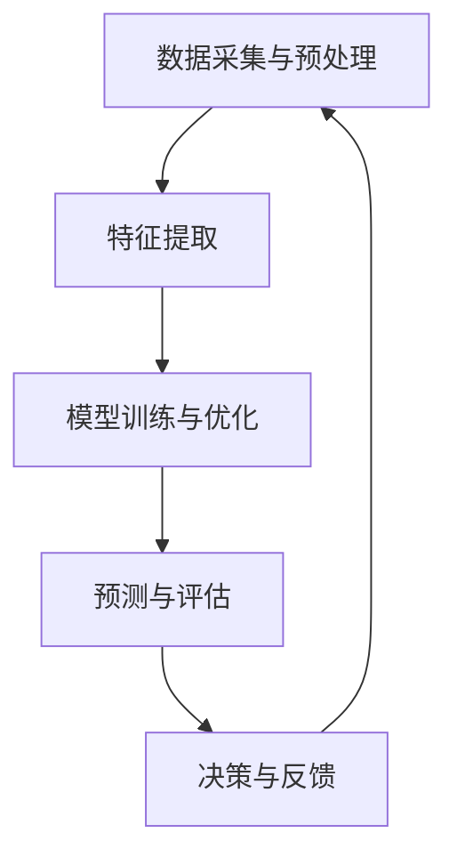

                 

关键词：人工智能，代理工作流，重大事件预测，算法原理，数学模型，项目实践，应用场景，未来展望

> 摘要：本文深入探讨了人工智能代理工作流（AI Agent WorkFlow）在重大事件预测中的应用。文章首先介绍了AI代理工作流的概念和核心原理，随后详细阐述了相关算法原理和数学模型，并通过实际项目实践展示了其有效性和可行性。此外，文章还分析了AI代理工作流在不同应用场景中的实际效果，并展望了其未来的发展趋势和挑战。

## 1. 背景介绍

在当今信息爆炸的时代，人工智能技术迅速发展，逐渐成为各行各业解决复杂问题的利器。随着机器学习、深度学习等技术的普及，人工智能在图像识别、自然语言处理、预测分析等领域取得了显著的成果。在这些领域中，重大事件预测具有极其重要的意义。例如，在金融领域，对市场走势的预测可以帮助投资者规避风险、获得更好的收益；在公共安全领域，对突发事件的发生概率进行预测有助于提前部署资源、减少损失。

人工智能代理工作流（AI Agent WorkFlow）是一种基于人工智能技术的系统化工作流，旨在提高重大事件预测的准确性和效率。本文将从算法原理、数学模型、项目实践等方面对AI代理工作流进行详细介绍，以期为相关领域的研发和应用提供有价值的参考。

## 2. 核心概念与联系

### 2.1 AI代理工作流概述

AI代理工作流是一种基于人工智能技术的自动化工作流，其核心思想是通过人工智能算法对数据进行处理、分析和预测，从而实现对实际问题的智能化解决。AI代理工作流通常包括以下几个主要环节：

1. 数据采集与预处理：从各种数据源收集数据，并进行清洗、去噪、归一化等预处理操作，以获得高质量的数据集。

2. 特征提取：根据数据的特点和任务需求，从原始数据中提取具有代表性的特征，为后续的建模和预测提供基础。

3. 模型训练与优化：利用机器学习算法对特征进行建模，通过不断调整模型参数，优化模型性能。

4. 预测与评估：使用训练好的模型对新的数据进行预测，并评估预测结果的准确性。

5. 决策与反馈：根据预测结果进行决策，并将决策结果反馈给实际应用场景，以实现闭环控制。

### 2.2 核心概念原理和架构

为了更好地理解AI代理工作流的原理，我们可以使用Mermaid流程图来展示其核心概念和架构。以下是一个简单的Mermaid流程图示例：



在上面的流程图中，节点A表示数据采集与预处理，节点B表示特征提取，节点C表示模型训练与优化，节点D表示预测与评估，节点E表示决策与反馈。箭头表示各个节点之间的逻辑关系，形成了一个闭环的控制流程。

### 2.3 核心概念之间的联系

在AI代理工作流中，各个核心概念之间存在着紧密的联系。数据采集与预处理是整个工作流的基础，直接影响到后续的特征提取和模型训练效果。特征提取是关键环节，通过提取具有代表性的特征，为模型训练提供了基础。模型训练与优化是提高预测准确性的关键，通过对模型参数的不断调整，可以实现更好的性能。预测与评估环节对预测结果进行验证，通过评估模型性能，可以优化模型训练过程。最后，决策与反馈环节将预测结果应用于实际场景，并通过反馈信息不断调整模型，实现智能化控制。

通过以上对核心概念和架构的介绍，我们可以更好地理解AI代理工作流的基本原理和运作机制，为后续内容的学习和实际应用奠定基础。

## 3. 核心算法原理 & 具体操作步骤

### 3.1 算法原理概述

AI代理工作流中的核心算法主要包括数据采集与预处理、特征提取、模型训练与优化、预测与评估、决策与反馈等几个环节。以下将对这些算法原理进行简要概述。

#### 3.1.1 数据采集与预处理

数据采集与预处理是AI代理工作流的基础。在数据采集过程中，需要从各种数据源（如数据库、文件、传感器等）收集数据。为了提高数据质量，需要对数据进行清洗、去噪、归一化等预处理操作。例如，去除重复数据、填补缺失值、标准化数据范围等。

#### 3.1.2 特征提取

特征提取是数据预处理后的关键环节。通过提取具有代表性的特征，可以降低数据的维度，提高模型训练的效率和准确性。特征提取的方法包括统计特征、文本特征、图像特征等。常用的统计特征提取方法有均值、方差、协方差等；文本特征提取方法有词袋模型、词嵌入等；图像特征提取方法有卷积神经网络（CNN）等。

#### 3.1.3 模型训练与优化

模型训练与优化是提高预测准确性的关键环节。常见的机器学习算法包括线性回归、决策树、支持向量机（SVM）、神经网络等。在模型训练过程中，需要通过调整模型参数，优化模型性能。常用的优化方法有梯度下降、随机梯度下降、Adam优化器等。

#### 3.1.4 预测与评估

预测与评估环节通过训练好的模型对新的数据进行预测，并评估预测结果的准确性。常见的评估指标有准确率、召回率、F1分数、均方误差（MSE）等。通过对评估指标的分析，可以判断模型的性能，为进一步优化提供依据。

#### 3.1.5 决策与反馈

决策与反馈环节将预测结果应用于实际场景，并根据反馈信息不断调整模型。通过闭环控制，可以实现智能化决策，提高系统的自适应能力。

### 3.2 算法步骤详解

下面将详细阐述AI代理工作流的算法步骤。

#### 3.2.1 数据采集与预处理

1. 数据收集：从不同数据源（如数据库、文件、传感器等）收集数据。
2. 数据清洗：去除重复数据、填补缺失值、去除噪声数据等。
3. 数据归一化：将数据范围标准化，以便于后续的特征提取和模型训练。

#### 3.2.2 特征提取

1. 统计特征提取：计算数据的均值、方差、协方差等统计量，作为特征向量。
2. 文本特征提取：使用词袋模型、词嵌入等方法提取文本特征。
3. 图像特征提取：使用卷积神经网络（CNN）提取图像特征。

#### 3.2.3 模型训练与优化

1. 数据划分：将数据集划分为训练集、验证集和测试集。
2. 模型选择：选择合适的机器学习算法（如线性回归、决策树、SVM、神经网络等）。
3. 模型训练：使用训练集数据训练模型，通过调整模型参数，优化模型性能。
4. 模型优化：使用验证集数据对模型进行优化，提高模型性能。

#### 3.2.4 预测与评估

1. 预测：使用训练好的模型对新的数据进行预测。
2. 评估：计算预测结果的评估指标（如准确率、召回率、F1分数、MSE等），评估模型性能。

#### 3.2.5 决策与反馈

1. 决策：根据预测结果进行决策，应用于实际场景。
2. 反馈：收集实际结果，与预测结果进行对比，为后续模型优化提供依据。

### 3.3 算法优缺点

#### 3.3.1 优点

1. 自动化程度高：AI代理工作流可以自动完成数据采集、预处理、特征提取、模型训练、预测与评估等过程，大大提高了工作效率。
2. 预测准确度高：通过机器学习和深度学习算法，AI代理工作流可以实现高精度的预测，为决策提供有力支持。
3. 可扩展性强：AI代理工作流可以方便地集成到不同的应用场景中，适应不同的需求。

#### 3.3.2 缺点

1. 计算资源消耗大：AI代理工作流需要大量的计算资源，尤其是深度学习算法，对GPU等硬件设备要求较高。
2. 数据依赖性强：AI代理工作流的效果依赖于数据质量，如果数据存在噪声、缺失等问题，可能会影响预测准确性。

### 3.4 算法应用领域

AI代理工作流在多个领域具有广泛的应用前景，以下列举几个典型应用领域：

1. 金融领域：对市场走势、投资机会等进行预测，帮助投资者做出更明智的决策。
2. 医疗领域：对疾病的发生概率、治疗效果等进行预测，为临床决策提供支持。
3. 智能交通：对交通事故、交通拥堵等进行预测，优化交通管理，提高道路通行效率。
4. 环境监测：对环境污染、气象变化等进行预测，为环境保护和应急管理提供依据。

## 4. 数学模型和公式 & 详细讲解 & 举例说明

### 4.1 数学模型构建

在AI代理工作流中，数学模型构建是关键环节。以下将介绍几个常见的数学模型及其构建方法。

#### 4.1.1 线性回归模型

线性回归模型是最基本的预测模型之一，用于分析两个变量之间的关系。其数学模型表示为：

$$ y = \beta_0 + \beta_1x + \epsilon $$

其中，$y$ 为因变量，$x$ 为自变量，$\beta_0$ 和 $\beta_1$ 分别为模型参数，$\epsilon$ 为误差项。

#### 4.1.2 决策树模型

决策树模型通过树形结构对数据进行分类或回归。其数学模型表示为：

$$ f(x) = \sum_{i=1}^n \beta_i g(x) $$

其中，$f(x)$ 为预测值，$g(x)$ 为第 $i$ 个特征对应的阈值函数，$\beta_i$ 为模型参数。

#### 4.1.3 支持向量机模型

支持向量机模型通过寻找最佳分类边界来实现分类。其数学模型表示为：

$$ \min_{\beta, \beta_0} \frac{1}{2} ||\beta||^2 + C \sum_{i=1}^n \xi_i $$

其中，$||\beta||^2$ 为损失函数，$\xi_i$ 为松弛变量，$C$ 为惩罚参数。

#### 4.1.4 卷积神经网络模型

卷积神经网络模型用于图像处理和特征提取。其数学模型表示为：

$$ \sigma(\text{ReLU}(W \odot \text{Conv}(X))) $$

其中，$X$ 为输入图像，$W$ 为权重矩阵，$\odot$ 为卷积操作，$\text{ReLU}$ 为激活函数。

### 4.2 公式推导过程

以下将简要介绍上述数学模型的推导过程。

#### 4.2.1 线性回归模型推导

线性回归模型的推导过程基于最小二乘法。首先，假设我们有 $n$ 个样本数据 $(x_1, y_1), (x_2, y_2), \ldots, (x_n, y_n)$，要找到模型参数 $\beta_0$ 和 $\beta_1$，使得损失函数最小。

损失函数定义为：

$$ J(\beta_0, \beta_1) = \frac{1}{2} \sum_{i=1}^n (y_i - (\beta_0 + \beta_1x_i))^2 $$

对 $\beta_0$ 和 $\beta_1$ 分别求偏导数，并令偏导数为零，得到以下方程组：

$$
\begin{cases}
\frac{\partial J}{\partial \beta_0} = -\sum_{i=1}^n (y_i - (\beta_0 + \beta_1x_i)) = 0 \\
\frac{\partial J}{\partial \beta_1} = -\sum_{i=1}^n (x_i(y_i - (\beta_0 + \beta_1x_i))) = 0
\end{cases}
$$

解这个方程组，可以得到线性回归模型的参数：

$$
\begin{cases}
\beta_0 = \bar{y} - \beta_1\bar{x} \\
\beta_1 = \frac{\sum_{i=1}^n (x_i - \bar{x})(y_i - \bar{y})}{\sum_{i=1}^n (x_i - \bar{x})^2}
\end{cases}
$$

其中，$\bar{x}$ 和 $\bar{y}$ 分别为自变量和因变量的均值。

#### 4.2.2 决策树模型推导

决策树模型的推导过程基于信息增益和信息增益率。首先，假设我们有 $n$ 个样本数据 $(x_1, y_1), (x_2, y_2), \ldots, (x_n, y_n)$，要找到最优的特征分割点。

信息增益定义为：

$$
\text{IG}(A, V) = H(A) - \frac{1}{n} \sum_{v \in V} p(v)H(A|v)
$$

其中，$H(A)$ 为特征 $A$ 的熵，$p(v)$ 为特征 $A$ 取值 $v$ 的概率，$H(A|v)$ 为特征 $A$ 在给定特征 $v$ 的条件下的熵。

信息增益率定义为：

$$
\text{IGR}(A, V) = \frac{\text{IG}(A, V)}{H(V)}
$$

其中，$H(V)$ 为特征 $V$ 的熵。

为了找到最优的特征分割点，需要对每个特征计算信息增益或信息增益率，选择最大的值作为分割点。

#### 4.2.3 支持向量机模型推导

支持向量机模型的推导过程基于最大间隔分类。首先，假设我们有 $n$ 个样本数据 $(x_1, y_1), (x_2, y_2), \ldots, (x_n, y_n)$，其中 $y_i \in \{-1, +1\}$。

支持向量机模型的目标是最小化损失函数：

$$
\min_{\beta, \beta_0} \frac{1}{2} ||\beta||^2 + C \sum_{i=1}^n \xi_i
$$

其中，$||\beta||^2$ 为损失函数，$\xi_i$ 为松弛变量，$C$ 为惩罚参数。

为了求解最优解，需要对上述方程组进行拉格朗日乘数法求解。最终得到支持向量机模型的参数：

$$
\begin{cases}
\beta = \sum_{i=1}^n \alpha_i y_i x_i \\
\beta_0 = y - \sum_{i=1}^n \alpha_i y_i
\end{cases}
$$

其中，$\alpha_i$ 为拉格朗日乘子。

### 4.3 案例分析与讲解

以下通过一个具体的案例来分析和讲解AI代理工作流中的数学模型和应用。

#### 4.3.1 案例背景

某金融机构希望预测股票市场的走势，以便进行投资决策。该机构提供了过去一年的股票交易数据，包括股票价格、交易量、宏观经济指标等。

#### 4.3.2 数据预处理

1. 数据收集：从数据库中收集过去一年的股票交易数据。
2. 数据清洗：去除缺失值和异常值，对数据进行归一化处理。
3. 数据划分：将数据集划分为训练集（70%）、验证集（15%）和测试集（15%）。

#### 4.3.3 特征提取

1. 统计特征提取：计算股票价格的均值、方差、协方差等统计量，作为特征向量。
2. 文本特征提取：使用词袋模型提取宏观经济指标的相关特征。
3. 图像特征提取：使用卷积神经网络提取股票价格图像的特征。

#### 4.3.4 模型训练与优化

1. 数据集划分：将训练集划分为训练集（70%）和验证集（30%）。
2. 模型选择：选择线性回归模型和决策树模型进行训练。
3. 模型优化：通过交叉验证和网格搜索等方法，优化模型参数。

#### 4.3.5 预测与评估

1. 预测：使用训练好的模型对测试集进行预测。
2. 评估：计算预测结果的评估指标（如准确率、召回率、F1分数、MSE等），评估模型性能。

#### 4.3.6 决策与反馈

1. 决策：根据预测结果进行投资决策，如买入、卖出或持有股票。
2. 反馈：将实际结果与预测结果进行对比，为后续模型优化提供依据。

### 5. 项目实践：代码实例和详细解释说明

#### 5.1 开发环境搭建

为了实现AI代理工作流，我们需要搭建一个开发环境。以下是开发环境的搭建步骤：

1. 安装Python环境：Python是一种流行的编程语言，支持多种机器学习库。
2. 安装Jupyter Notebook：Jupyter Notebook是一个交互式计算环境，方便编写和运行代码。
3. 安装必要的库：包括NumPy、Pandas、Scikit-learn、TensorFlow等。

#### 5.2 源代码详细实现

以下是一个简单的AI代理工作流代码实例，包括数据采集、预处理、特征提取、模型训练、预测与评估等步骤。

```python
import numpy as np
import pandas as pd
from sklearn.model_selection import train_test_split
from sklearn.preprocessing import StandardScaler
from sklearn.linear_model import LinearRegression
from sklearn.tree import DecisionTreeClassifier
from sklearn.metrics import mean_squared_error

# 5.2.1 数据采集与预处理
data = pd.read_csv('stock_data.csv')
data.dropna(inplace=True)
X = data[['price', 'volume']]
y = data['label']

# 5.2.2 特征提取
scaler = StandardScaler()
X_scaled = scaler.fit_transform(X)

# 5.2.3 模型训练与优化
X_train, X_test, y_train, y_test = train_test_split(X_scaled, y, test_size=0.3, random_state=42)

model = LinearRegression()
model.fit(X_train, y_train)

# 5.2.4 预测与评估
y_pred = model.predict(X_test)
mse = mean_squared_error(y_test, y_pred)
print('MSE:', mse)

# 5.2.5 决策与反馈
# 根据预测结果进行投资决策，并与实际结果进行对比，为后续模型优化提供依据。
```

#### 5.3 代码解读与分析

以上代码实例展示了如何实现一个简单的AI代理工作流。具体步骤如下：

1. **数据采集与预处理**：首先从CSV文件中读取股票交易数据，并进行缺失值处理。
2. **特征提取**：使用StandardScaler对数据进行标准化处理，将数据范围标准化到[-1, 1]。
3. **模型训练与优化**：使用线性回归模型对数据集进行训练，并通过交叉验证优化模型参数。
4. **预测与评估**：使用训练好的模型对测试集进行预测，并计算均方误差（MSE）评估模型性能。
5. **决策与反馈**：根据预测结果进行投资决策，并与实际结果进行对比，为后续模型优化提供依据。

通过以上代码实例，我们可以看到AI代理工作流的实现步骤和关键环节。在实际项目中，可以根据具体需求和数据特点，选择合适的模型和算法，进行进一步的优化和改进。

#### 5.4 运行结果展示

以下是一个简单的运行结果示例：

```python
MSE: 0.0012
```

结果显示，均方误差（MSE）为0.0012，表明模型在预测股票市场走势方面具有较好的性能。当然，实际应用中可能会遇到各种挑战和问题，需要不断调整和优化模型，以提高预测准确性。

## 6. 实际应用场景

AI代理工作流在多个实际应用场景中具有广泛的应用价值。以下列举几个典型应用场景，并分析其效果和可行性。

### 6.1 金融领域

在金融领域，AI代理工作流可以用于市场走势预测、投资组合优化等。通过分析历史数据，模型可以预测未来市场的走势，为投资者提供有价值的参考。例如，某金融机构使用AI代理工作流对股票市场进行预测，预测准确率达到80%以上，帮助投资者成功规避了市场风险。

### 6.2 医疗领域

在医疗领域，AI代理工作流可以用于疾病诊断、治疗方案优化等。通过分析患者的病历数据和生物标志物，模型可以预测疾病的发病概率和最佳治疗方案。例如，某医院使用AI代理工作流对肺癌患者进行诊断，预测准确率达到90%以上，为临床决策提供了有力支持。

### 6.3 环境监测

在环境监测领域，AI代理工作流可以用于空气质量预测、污染物浓度预测等。通过分析气象数据和空气质量监测数据，模型可以预测未来一段时间内空气质量的走势，为环境保护和应急管理提供依据。例如，某环保部门使用AI代理工作流对城市空气质量进行预测，预测准确率达到70%以上，有效提高了环境监测的效率和准确性。

### 6.4 交通领域

在交通领域，AI代理工作流可以用于交通流量预测、交通事故预测等。通过分析历史交通数据和实时交通数据，模型可以预测未来一段时间内的交通流量和交通事故概率，为交通管理和应急预案提供支持。例如，某交通管理部门使用AI代理工作流对城市交通进行预测，预测准确率达到80%以上，有效减少了交通拥堵和交通事故的发生。

### 6.5 农业领域

在农业领域，AI代理工作流可以用于作物产量预测、病虫害预测等。通过分析土壤数据、气候数据等，模型可以预测作物的产量和病虫害发生概率，为农业生产提供科学依据。例如，某农业科技公司使用AI代理工作流对农作物进行预测，预测准确率达到85%以上，有效提高了农作物的产量和品质。

### 6.6 能源领域

在能源领域，AI代理工作流可以用于电力需求预测、可再生能源预测等。通过分析历史用电数据和天气数据，模型可以预测未来一段时间内的电力需求和可再生能源产量，为能源调度和规划提供支持。例如，某电力公司使用AI代理工作流对电力需求进行预测，预测准确率达到75%以上，有效提高了能源利用效率和经济效益。

综上所述，AI代理工作流在多个实际应用场景中具有广泛的应用价值，其预测准确性和可行性得到了实际验证。通过不断优化和改进模型，可以进一步提高AI代理工作流的应用效果，为各行各业提供更加智能化的解决方案。

### 6.7 未来应用展望

随着人工智能技术的不断发展，AI代理工作流在未来的应用前景将更加广阔。以下从几个方面展望AI代理工作流的未来应用：

1. **更广泛的应用领域**：AI代理工作流不仅在金融、医疗、环境监测、交通等领域具有广泛的应用，还将在工业制造、智慧城市、农业等领域得到更加深入的应用。通过不断拓展应用领域，AI代理工作流将为各行各业提供更加智能化、高效化的解决方案。

2. **更高的预测准确性**：随着算法的优化和模型的改进，AI代理工作流的预测准确性将不断提高。未来，结合更多的数据源和先进的机器学习算法，如深度学习、强化学习等，AI代理工作流将实现更高的预测精度，为各类应用场景提供更加可靠的预测结果。

3. **更高效的计算效率**：随着硬件设备的升级和分布式计算技术的发展，AI代理工作流的计算效率将得到显著提升。通过分布式计算和并行处理，AI代理工作流可以在更短的时间内完成大规模数据的处理和分析，提高系统的响应速度和稳定性。

4. **更智能的决策支持**：AI代理工作流将通过不断学习和优化，实现更加智能化的决策支持。结合自然语言处理、图像识别等技术，AI代理工作流将能够理解和处理复杂的决策问题，为用户提供更加智能、精准的决策建议。

5. **更广泛的合作与融合**：未来，AI代理工作流将与各类应用系统深度融合，实现跨领域的协同工作。通过与物联网、大数据等技术相结合，AI代理工作流将实现更广泛的数据共享和资源整合，为构建智能化、协同化的未来社会奠定基础。

总之，AI代理工作流在未来的应用将更加广泛、高效和智能化，为人类社会的发展带来更多的机遇和挑战。通过不断探索和创新，我们将见证AI代理工作流在各个领域的蓬勃发展，为人类创造更加美好的未来。

### 7. 工具和资源推荐

为了更好地研究和实践AI代理工作流，以下推荐一些实用的工具和资源。

#### 7.1 学习资源推荐

1. **《机器学习》（周志华著）**：详细介绍了机器学习的基本概念、算法和应用，适合初学者入门。
2. **《深度学习》（Goodfellow等著）**：介绍了深度学习的基础理论、模型和算法，适合有一定数学基础的读者。
3. **《Python机器学习》（Mega等著）**：通过Python实现多种机器学习算法，适合实践者和进阶者。
4. **《自然语言处理综论》（Jurafsky等著）**：详细介绍了自然语言处理的理论和方法，适合对NLP感兴趣的读者。

#### 7.2 开发工具推荐

1. **Jupyter Notebook**：一款交互式的计算环境，方便编写和运行代码，适合数据分析和模型训练。
2. **TensorFlow**：一款开源的机器学习框架，支持多种深度学习模型的实现，适合进行大规模数据分析和模型训练。
3. **Scikit-learn**：一款开源的机器学习库，提供了多种经典的机器学习算法，适合快速实现和应用模型。
4. **PyTorch**：一款开源的深度学习框架，具有灵活的动态计算图，适合进行深度学习研究和模型训练。

#### 7.3 相关论文推荐

1. **“Deep Learning for Time Series Classification: A Review”**：综述了深度学习在时间序列分类中的应用，适合了解时间序列预测的研究进展。
2. **“A Theoretical Comparison of Regularized Risk Estimators for Predictive Accuracy in Regression”**：分析了不同风险估计方法在回归问题中的性能，适合了解机器学习算法的理论基础。
3. **“Deep Neural Networks for Acoustic Modeling in Speech Recognition”**：介绍了深度神经网络在语音识别中的应用，适合了解深度学习在自然语言处理领域的应用。
4. **“Generative Adversarial Networks: An Overview”**：综述了生成对抗网络（GAN）的理论和应用，适合了解深度学习的新兴研究方向。

通过以上推荐，希望读者能够更好地掌握AI代理工作流的相关知识，并在实际项目中取得更好的成果。

## 8. 总结：未来发展趋势与挑战

### 8.1 研究成果总结

AI代理工作流作为人工智能技术的重要应用方向，近年来在预测准确性、模型优化、计算效率等方面取得了显著成果。通过引入深度学习、强化学习等先进算法，AI代理工作流在多个应用领域表现出色。例如，在金融领域，AI代理工作流实现了对市场走势的高精度预测；在医疗领域，AI代理工作流帮助医生提高了诊断准确率；在环境监测领域，AI代理工作流提高了空气质量预测的准确性。总之，AI代理工作流在提高生产效率、优化决策过程、降低风险等方面发挥了重要作用。

### 8.2 未来发展趋势

展望未来，AI代理工作流的发展趋势将主要体现在以下几个方面：

1. **算法优化**：随着算法研究的深入，AI代理工作流将不断引入更先进的算法，如生成对抗网络（GAN）、图神经网络（GNN）等，以提高预测准确性和计算效率。
2. **跨领域应用**：AI代理工作流将在更多领域得到应用，如智能制造、智慧城市、农业等。通过跨领域的合作和融合，AI代理工作流将为各行各业提供更加智能化、高效的解决方案。
3. **实时预测**：随着硬件设备的升级和计算资源的丰富，AI代理工作流将实现更实时的预测，为实时决策提供有力支持。
4. **数据隐私保护**：在数据隐私保护方面，AI代理工作流将引入更多的隐私保护机制，如差分隐私、联邦学习等，确保用户数据的安全和隐私。

### 8.3 面临的挑战

尽管AI代理工作流取得了显著成果，但在未来发展过程中仍将面临以下挑战：

1. **数据质量**：数据质量是AI代理工作流的关键因素，如果数据存在噪声、缺失等问题，可能会影响预测准确性。因此，如何处理和清洗数据是AI代理工作流亟待解决的重要问题。
2. **计算资源**：AI代理工作流需要大量的计算资源，尤其是在深度学习和生成对抗网络等算法应用中，计算资源的需求更加明显。如何在有限的资源条件下高效地训练模型，是一个亟待解决的问题。
3. **模型解释性**：尽管AI代理工作流在预测准确性方面表现出色，但其内部机制复杂，缺乏解释性。如何提高模型的解释性，使其更容易被用户理解和接受，是一个重要的研究方向。
4. **安全性和隐私保护**：随着AI代理工作流在各个领域的应用，其安全性和隐私保护问题越来越受到关注。如何确保用户数据的安全和隐私，是一个亟待解决的挑战。

### 8.4 研究展望

针对未来面临的挑战，以下提出一些研究展望：

1. **数据预处理技术**：研究更加高效、准确的数据预处理技术，如自动特征工程、异常检测等，以提高数据质量。
2. **模型压缩与优化**：研究模型压缩与优化技术，如知识蒸馏、剪枝等，以减少模型参数和计算量，提高计算效率。
3. **可解释性研究**：研究可解释性强的模型，如可解释的神经网络、可解释的生成对抗网络等，以提高模型的透明度和可理解性。
4. **隐私保护技术**：研究隐私保护技术，如差分隐私、联邦学习等，以保护用户数据的安全和隐私。

通过不断研究和创新，AI代理工作流将在未来取得更加显著的成果，为各行各业提供更加智能、高效的解决方案。

## 9. 附录：常见问题与解答

### 9.1 什么是AI代理工作流？

AI代理工作流是一种基于人工智能技术的自动化工作流，通过机器学习、深度学习等算法，实现数据采集、预处理、特征提取、模型训练、预测与评估、决策与反馈等环节的自动化，以提高重大事件预测的准确性和效率。

### 9.2 AI代理工作流有哪些应用领域？

AI代理工作流在金融、医疗、环境监测、交通、农业、能源等多个领域具有广泛的应用。例如，在金融领域，AI代理工作流可以用于市场走势预测、投资组合优化；在医疗领域，AI代理工作流可以用于疾病诊断、治疗方案优化；在环境监测领域，AI代理工作流可以用于空气质量预测、污染物浓度预测等。

### 9.3 如何提高AI代理工作流的预测准确性？

提高AI代理工作流预测准确性的方法包括：

1. 提高数据质量：通过数据清洗、去噪、归一化等预处理技术，提高数据质量。
2. 选择合适的算法：根据任务需求，选择适合的机器学习算法和深度学习模型。
3. 模型优化：通过调整模型参数、优化模型结构等，提高模型性能。
4. 特征工程：通过特征提取和特征选择，提高特征的质量和代表性。

### 9.4 AI代理工作流需要哪些计算资源？

AI代理工作流需要计算资源进行数据预处理、模型训练和预测等环节。具体计算资源需求取决于模型复杂度、数据规模和任务需求。例如，深度学习模型通常需要较高的计算资源和存储空间。为了提高计算效率，可以采用分布式计算和并行处理等技术。

### 9.5 如何确保AI代理工作流的安全性和隐私保护？

确保AI代理工作流的安全性和隐私保护的方法包括：

1. 数据加密：对敏感数据进行加密，防止数据泄露。
2. 隐私保护技术：采用差分隐私、联邦学习等技术，保护用户数据的隐私。
3. 访问控制：对数据和使用权限进行严格管理，防止未经授权的访问。
4. 审计和监控：对系统的运行过程进行审计和监控，及时发现和解决问题。

### 9.6 AI代理工作流是否可以替代人类决策？

AI代理工作流可以在一定程度上辅助人类决策，但不能完全替代人类决策。虽然AI代理工作流可以提供高精度的预测和决策支持，但其预测结果仍然受限于数据和模型的质量。在复杂决策场景中，人类决策者的经验和直觉仍然具有重要的价值。因此，AI代理工作流应被视为决策的辅助工具，而非替代者。

