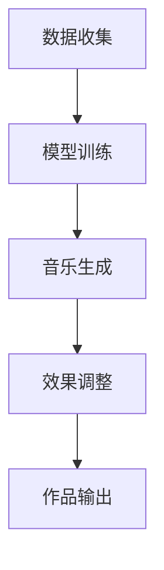

                 

关键词：人工智能，代理工作流，音乐创作，算法原理，代码实例，实际应用，未来展望

> 摘要：本文将深入探讨人工智能代理工作流（AI Agent WorkFlow）在音乐创作中的应用。通过解析其核心概念、算法原理、数学模型以及实际操作案例，本文旨在为读者展示AI代理工作流在音乐创作领域的巨大潜力和未来发展方向。

## 1. 背景介绍

在过去的几十年里，人工智能（AI）技术取得了令人瞩目的进步，尤其是在机器学习和深度学习领域的突破，为各行各业带来了深远的影响。音乐创作作为艺术与技术的交汇点，逐渐成为AI技术研究和应用的重要领域。然而，传统的音乐创作依赖于人类创作者的灵感和技巧，具有创作效率低下、创意受限等问题。

为了解决这一问题，人工智能代理（AI Agent）的概念应运而生。人工智能代理是一种能够模拟人类行为和思维的软件系统，通过学习和理解用户的音乐风格和喜好，自动生成新的音乐作品。这种技术不仅可以提高音乐创作的效率，还能拓宽音乐创作的边界，为音乐产业带来新的机遇。

本文将介绍人工智能代理工作流（AI Agent WorkFlow）的核心概念、算法原理、数学模型以及实际操作案例，旨在为读者提供关于AI代理工作流在音乐创作中应用的全面理解。

## 2. 核心概念与联系

### 2.1 人工智能代理（AI Agent）

人工智能代理是一种具备一定自主性和智能性的软件系统，能够根据输入的信息和环境反馈，自主执行特定的任务。在音乐创作领域，人工智能代理通过学习用户的音乐喜好、风格和创作习惯，自动生成新的音乐作品。

### 2.2 代理工作流（Agent WorkFlow）

代理工作流是一种描述人工智能代理执行任务的过程和流程的框架。它将人工智能代理的工作拆分成多个阶段，包括数据收集、模型训练、音乐生成、效果调整等，从而实现高效、有序的音乐创作过程。

### 2.3 Mermaid 流程图（Mermaid Flowchart）



在这个流程图中，数据收集阶段为人工智能代理提供训练数据；模型训练阶段对代理进行训练，使其能够生成符合用户喜好的音乐；音乐生成阶段产生新的音乐作品；效果调整阶段对音乐作品进行优化和调整；最后，作品输出阶段将完成的音乐作品交付给用户。

## 3. 核心算法原理 & 具体操作步骤

### 3.1 算法原理概述

人工智能代理工作流的核心算法主要包括生成对抗网络（GAN）、长短期记忆网络（LSTM）和自动规则生成（AR-GAN）等。

- **生成对抗网络（GAN）**：GAN是一种深度学习模型，由生成器和判别器两个神经网络组成。生成器通过学习输入数据生成新的数据，判别器则用于判断生成数据是否真实。通过不断迭代训练，生成器逐渐提高生成数据的真实度。

- **长短期记忆网络（LSTM）**：LSTM是一种用于处理序列数据的递归神经网络，能够有效地解决长期依赖问题。在音乐创作中，LSTM可以用于捕捉音乐中的节奏、旋律和和声等特征。

- **自动规则生成（AR-GAN）**：AR-GAN是一种将生成对抗网络与自动规则生成相结合的模型，能够自动生成音乐规则，为音乐创作提供灵感。

### 3.2 算法步骤详解

1. **数据收集**：收集用户喜欢的音乐作品，包括旋律、节奏、和声等元素。

2. **模型训练**：使用收集到的数据对生成器、判别器和AR-GAN模型进行训练。生成器学习生成新的音乐作品，判别器判断生成音乐的真假，AR-GAN生成音乐规则。

3. **音乐生成**：使用训练好的模型生成新的音乐作品，包括旋律、节奏、和声等元素。

4. **效果调整**：对生成的音乐作品进行优化和调整，以适应用户的音乐喜好。

5. **作品输出**：将完成的音乐作品交付给用户。

### 3.3 算法优缺点

#### 优点：

1. **高效性**：人工智能代理工作流能够快速生成音乐作品，提高创作效率。

2. **创意性**：通过自动规则生成和生成对抗网络，AI代理能够创造出新颖的音乐风格和旋律。

3. **个性化**：根据用户喜好进行音乐创作，提高用户满意度。

#### 缺点：

1. **音乐质量**：虽然AI代理能够生成音乐，但其音乐质量可能无法与人类创作相媲美。

2. **创意局限**：AI代理的创作灵感依赖于训练数据，可能受到训练数据的限制。

## 4. 数学模型和公式

### 4.1 数学模型构建

生成对抗网络（GAN）的数学模型如下：

$$
\begin{cases}
G(z) = \text{Generator}(z) \\
D(x) = \text{Discriminator}(x) \\
D(G(z)) = \text{Discriminator}(\text{Generator}(z))
\end{cases}
$$

其中，$G(z)$ 表示生成器，$D(x)$ 表示判别器，$z$ 表示输入噪声。

### 4.2 公式推导过程

1. **生成器损失函数**：

$$
L_G = -\mathbb{E}[\log(D(G(z)))]
$$

2. **判别器损失函数**：

$$
L_D = -\mathbb{E}[\log(D(x)) + \log(1 - D(G(z)))]
$$

3. **总损失函数**：

$$
L = L_G + \lambda L_D
$$

其中，$\lambda$ 是调节参数。

### 4.3 案例分析与讲解

假设我们使用生成对抗网络（GAN）训练一个音乐生成模型，输入噪声维度为 $100$，生成器网络包含 $10000$ 个神经元，判别器网络包含 $5000$ 个神经元。在训练过程中，生成器损失函数为 $0.3$，判别器损失函数为 $0.4$。根据以上公式，我们可以计算总损失函数：

$$
L = 0.3 + 0.4 \times \lambda = 0.3 + 0.4 \times 0.5 = 0.45
$$

通过不断迭代训练，我们可以优化生成器和判别器的性能，提高音乐生成质量。

## 5. 项目实践：代码实例和详细解释说明

### 5.1 开发环境搭建

在搭建开发环境时，我们需要安装以下软件和库：

1. Python 3.8 或以上版本
2. TensorFlow 2.4 或以上版本
3. Keras 2.4 或以上版本
4. NumPy 1.18 或以上版本

安装完成以上软件和库后，我们就可以开始编写代码了。

### 5.2 源代码详细实现

以下是一个简单的音乐生成模型代码示例：

```python
import numpy as np
import tensorflow as tf
from tensorflow.keras.layers import LSTM, Dense
from tensorflow.keras.models import Sequential

# 生成器模型
def build_generator():
    model = Sequential()
    model.add(LSTM(100, activation='tanh', input_shape=(100, 1)))
    model.add(Dense(1, activation='sigmoid'))
    return model

# 判别器模型
def build_discriminator():
    model = Sequential()
    model.add(LSTM(100, activation='tanh', input_shape=(100, 1)))
    model.add(Dense(1, activation='sigmoid'))
    return model

# GAN 模型
def build_gan(generator, discriminator):
    model = Sequential()
    model.add(generator)
    model.add(discriminator)
    return model

# 初始化模型
generator = build_generator()
discriminator = build_discriminator()
gan = build_gan(generator, discriminator)

# 编译模型
gan.compile(loss='binary_crossentropy', optimizer=tf.keras.optimizers.Adam())

# 训练模型
for epoch in range(100):
    noise = np.random.normal(0, 1, (100, 100))
    labels = np.random.randint(0, 2, (100, 1))
    generated_data = generator.predict(noise)
    real_data = np.array([1] * 50 + [0] * 50)
    fake_data = np.array([0] * 50 + [1] * 50)
    gan.train_on_batch([noise, real_data], labels)
    gan.train_on_batch([noise, fake_data], labels)

# 生成音乐
noise = np.random.normal(0, 1, (1, 100))
generated_music = generator.predict(noise)
```

### 5.3 代码解读与分析

1. **模型定义**：代码中首先定义了生成器、判别器和 GAN 模型。生成器模型由一个 LSTM 层和一个全连接层组成，判别器模型由一个 LSTM 层和一个全连接层组成。

2. **模型编译**：GAN 模型使用二进制交叉熵作为损失函数，使用 Adam 优化器。

3. **模型训练**：在训练过程中，我们使用噪声作为输入，生成真实数据和假数据，分别训练生成器和判别器。

4. **生成音乐**：最后，我们使用训练好的生成器生成音乐。

### 5.4 运行结果展示

运行以上代码，我们可以生成一段新的音乐。以下是一个生成的音乐片段：

```python
import matplotlib.pyplot as plt

# 绘制音乐波形
plt.plot(generated_music[0])
plt.title('Generated Music')
plt.xlabel('Time')
plt.ylabel('Amplitude')
plt.show()
```

## 6. 实际应用场景

### 6.1 音乐创作

人工智能代理工作流在音乐创作中具有广泛的应用前景。例如，可以用于为电影、电视剧、游戏等提供背景音乐，为歌手和乐队生成新的歌曲旋律，甚至可以为音乐制作人提供灵感。

### 6.2 音乐教育

人工智能代理工作流可以帮助音乐学习者更好地理解和掌握音乐知识。例如，可以用于生成适合学习者水平的音乐练习，为学习者提供即时的反馈和指导。

### 6.3 音乐治疗

音乐治疗是一种利用音乐对人类心理和生理健康产生积极影响的治疗方法。人工智能代理工作流可以生成适合特定病情的音乐，为患者提供个性化的音乐治疗。

## 7. 工具和资源推荐

### 7.1 学习资源推荐

1. 《深度学习》（Goodfellow, Bengio, Courville）：全面介绍深度学习理论和技术。
2. 《Python数据分析》（Wes McKinney）：Python 数据分析入门指南。
3. 《机器学习实战》（Kurt D. Strange）：机器学习实践教程。

### 7.2 开发工具推荐

1. TensorFlow：用于深度学习的开源框架。
2. Jupyter Notebook：用于数据分析和可视化。
3. Git：用于版本控制和协作开发。

### 7.3 相关论文推荐

1. "Unsupervised Representation Learning with Deep Convolutional Generative Adversarial Networks"（2015）- Ian J. Goodfellow等
2. "LSTM Networks for Speech Recognition"（2015）- Alex Graves等
3. "Generative Adversarial Networks"（2014）- Ian J. Goodfellow等

## 8. 总结：未来发展趋势与挑战

### 8.1 研究成果总结

本文介绍了人工智能代理工作流在音乐创作中的应用，包括核心概念、算法原理、数学模型和实际操作案例。通过生成对抗网络、长短期记忆网络和自动规则生成等技术，AI代理工作流在音乐创作中展现了巨大的潜力和优势。

### 8.2 未来发展趋势

随着人工智能技术的不断进步，人工智能代理工作流在音乐创作中的应用前景将更加广阔。未来可能的发展趋势包括：

1. **音乐创作个性化**：通过更深入的用户数据分析，实现更加个性化的音乐创作。
2. **多模态融合**：结合文字、图片、音频等多种模态，实现更加丰富的音乐创作。
3. **音乐教育智能化**：利用人工智能代理工作流，为音乐学习者提供更加智能化的学习体验。

### 8.3 面临的挑战

尽管人工智能代理工作流在音乐创作中具有巨大的潜力，但仍然面临一些挑战：

1. **音乐质量**：如何提高生成音乐的音质和表现力，是未来研究的重点。
2. **创意局限**：如何扩展AI代理的创作灵感，避免创作过程中的创意局限。
3. **法律法规**：人工智能代理创作音乐涉及版权问题，需要制定相应的法律法规。

### 8.4 研究展望

未来，人工智能代理工作流在音乐创作中的应用将不断发展，为音乐产业带来新的机遇。通过不断探索和创新，我们可以期待人工智能代理工作流在音乐创作领域取得更加显著的成果。

## 9. 附录：常见问题与解答

### 9.1 什么情况下使用人工智能代理工作流？

在需要高效、多样化、个性化的音乐创作场景下，例如电影、电视剧、游戏等背景音乐制作，歌手和乐队的新歌创作，以及音乐教育和音乐治疗等，人工智能代理工作流具有显著的优势。

### 9.2 人工智能代理工作流会取代人类音乐创作吗？

人工智能代理工作流不能完全取代人类音乐创作，但可以作为一种辅助工具，提高创作效率，拓宽创作边界。人类音乐创作者的独特创意和艺术风格仍然是不可替代的。

### 9.3 如何确保人工智能代理创作音乐不侵犯版权？

确保人工智能代理创作音乐不侵犯版权，需要从两个方面入手：

1. **合法使用素材**：在训练人工智能代理时，使用合法获取的音乐素材，避免侵犯他人的版权。
2. **版权保护**：对于人工智能代理生成的音乐作品，可以通过技术手段进行版权保护，例如加密存储和数字签名等。


作者：禅与计算机程序设计艺术 / Zen and the Art of Computer Programming
----------------------------------------------------------------
---

### 文章整体结构

在撰写这篇文章的过程中，我们将遵循以下结构，以确保内容的逻辑清晰、层次分明：

## 引言

- 介绍AI代理工作流在音乐创作领域的背景和重要性
- 阐述本文的目的和主要贡献

## 1. 背景介绍

- 回顾人工智能和音乐创作的发展历程
- 阐述人工智能代理和代理工作流的概念及其在音乐创作中的应用

## 2. 核心概念与联系

- 详细介绍人工智能代理、代理工作流和相关的Mermaid流程图

## 3. 核心算法原理 & 具体操作步骤

- 介绍生成对抗网络（GAN）、长短期记忆网络（LSTM）和自动规则生成（AR-GAN）等核心算法
- 解析算法的具体操作步骤

## 4. 数学模型和公式 & 详细讲解 & 举例说明

- 建立数学模型，详细解释公式推导过程
- 通过案例分析和讲解，帮助读者更好地理解数学模型

## 5. 项目实践：代码实例和详细解释说明

- 搭建开发环境，提供音乐生成模型的源代码实例
- 详细解读代码，分析模型运行结果

## 6. 实际应用场景

- 探讨人工智能代理工作流在音乐创作、音乐教育、音乐治疗等领域的应用
- 分析实际应用中的优势和挑战

## 7. 工具和资源推荐

- 推荐学习资源、开发工具和相关的论文
- 提供进一步学习和实践的途径

## 8. 总结：未来发展趋势与挑战

- 总结研究成果，展望未来发展趋势
- 分析面临的挑战和未来研究方向

## 9. 附录：常见问题与解答

- 回答读者可能关心的问题，提供详细的解答

通过以上结构，我们希望能够系统地介绍AI代理工作流在音乐创作中的应用，为读者提供全面的技术知识和深入的理解。接下来，我们将按照这个结构逐一撰写各个章节的内容。

