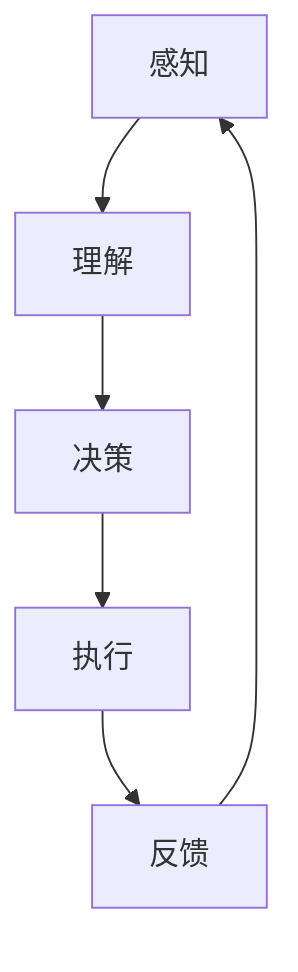

                 

关键词：AI智能代理、工作流、广告营销、系统应用、算法原理、数学模型、项目实践、工具推荐

> 摘要：本文深入探讨了AI智能代理工作流在广告营销系统中的应用。通过详细分析核心概念、算法原理、数学模型以及项目实践，阐述了智能代理如何提升广告营销的效率与精准度，并展望了其未来的发展趋势与挑战。

## 1. 背景介绍

随着互联网的快速发展，广告营销已经成为企业获取客户、提升品牌知名度和销售额的重要手段。传统的广告营销方式通常依赖于大量的手动操作和数据整理，不仅耗时耗力，而且效果难以保障。为了应对这一挑战，人工智能（AI）智能代理开始崭露头角，它们能够自动化处理复杂的广告营销任务，提高工作的效率和精准度。

智能代理是人工智能的一个重要分支，它通过模拟人类的行为和决策过程，实现自动化和智能化的任务执行。在工作流系统中，智能代理能够接管重复性高、规则性强的任务，如广告投放、数据分析、客户管理等，从而减轻人类的工作负担，提高系统的整体效率。

本文将重点讨论AI智能代理在工作流系统中的应用，特别是其在广告营销系统中的具体作用。通过分析智能代理的核心概念、算法原理、数学模型以及项目实践，我们希望能够为读者提供对智能代理工作流系统的深入理解和实际应用的指导。

### 1.1 智能代理的定义与核心特点

智能代理（Intelligent Agent）是一个能够在特定环境下感知环境、制定决策并采取行动的实体。它具有以下几个核心特点：

1. **自主性（Autonomy）**：智能代理能够在没有人类干预的情况下自主运行，根据预先设定的目标和规则，自动执行任务。

2. **适应性（Adaptability）**：智能代理能够根据环境变化和任务需求调整自己的行为和策略，从而提高任务完成的效果。

3. **合作性（Social）**：智能代理能够与其他智能代理或人类合作，共同完成复杂任务。

4. **学习性（Learning）**：智能代理能够通过经验积累和机器学习算法，不断优化自身的表现。

### 1.2 广告营销系统中的智能代理

在广告营销系统中，智能代理主要应用于以下几个方面：

1. **广告投放优化**：智能代理可以根据用户行为、兴趣和地理位置等信息，自动调整广告的投放策略，提高广告的点击率和转化率。

2. **数据分析**：智能代理能够自动收集和分析广告投放数据，如点击率、转化率、用户反馈等，为营销决策提供数据支持。

3. **客户管理**：智能代理可以自动化处理客户查询、投诉等事务，提高客户服务质量。

4. **营销活动策划**：智能代理可以根据市场趋势和用户需求，自动生成营销活动方案。

## 2. 核心概念与联系

为了更好地理解智能代理工作流在广告营销系统中的应用，我们首先需要了解一些核心概念，并展示它们之间的联系。以下是智能代理在工作流系统中的核心概念及其关系：

### 2.1 智能代理的工作流

智能代理的工作流包括以下几个主要步骤：

1. **感知（Perception）**：智能代理通过传感器或数据接口获取环境信息，如用户行为、市场数据等。

2. **理解（Understanding）**：智能代理对感知到的信息进行理解，分析数据并提取关键特征。

3. **决策（Decision）**：基于理解的结果，智能代理制定相应的决策策略。

4. **执行（Execution）**：智能代理根据决策结果执行具体的任务。

5. **反馈（Feedback）**：执行任务后，智能代理收集反馈信息，调整自己的行为。

### 2.2 广告营销系统的工作流

广告营销系统的工作流包括以下几个主要步骤：

1. **市场调研（Market Research）**：分析市场趋势、用户需求等信息。

2. **目标定位（Targeting）**：确定目标用户群体和广告投放策略。

3. **广告投放（Ad Delivery）**：将广告投放到目标用户面前。

4. **数据分析（Data Analysis）**：收集和分析广告投放数据，如点击率、转化率等。

5. **优化调整（Optimization）**：根据数据分析结果，调整广告投放策略。

### 2.3 智能代理与广告营销系统的联系

智能代理与广告营销系统之间的关系可以概括为以下几个方面：

1. **自动化广告投放**：智能代理可以自动化广告投放流程，根据用户行为和兴趣自动调整广告内容。

2. **数据驱动决策**：智能代理通过数据分析，为广告营销系统的优化调整提供数据支持。

3. **客户服务**：智能代理可以自动化处理客户服务请求，提高客户满意度。

4. **营销活动策划**：智能代理可以根据市场趋势和用户需求，自动生成营销活动方案。

### 2.4 Mermaid 流程图

为了更直观地展示智能代理在工作流系统中的应用，我们可以使用Mermaid语言绘制一个流程图。以下是智能代理工作流的Mermaid流程图：



## 3. 核心算法原理 & 具体操作步骤

### 3.1 算法原理概述

智能代理的核心算法主要包括以下几个部分：

1. **机器学习算法**：用于对用户行为和市场数据进行建模，提取关键特征，实现数据的自动分类和预测。

2. **决策树算法**：用于构建决策模型，根据用户特征和情境信息进行决策。

3. **优化算法**：用于优化广告投放策略，提高广告的点击率和转化率。

### 3.2 算法步骤详解

以下是智能代理在广告营销系统中的具体操作步骤：

1. **数据采集**：智能代理通过传感器或数据接口获取用户行为和市场数据。

2. **数据预处理**：对采集到的数据进行清洗、去噪和特征提取。

3. **机器学习建模**：使用机器学习算法对预处理后的数据进行建模，提取用户特征和场景信息。

4. **决策树构建**：基于机器学习模型的结果，构建决策树，为广告投放提供决策依据。

5. **广告投放**：根据决策树模型，自动调整广告内容、投放时间和投放渠道。

6. **数据反馈**：收集广告投放数据，如点击率、转化率等，更新模型参数。

7. **模型优化**：根据数据反馈，对决策树模型进行优化调整，提高广告投放效果。

### 3.3 算法优缺点

**优点**：

1. **高效自动化**：智能代理能够自动化处理广告投放任务，提高工作效率。

2. **精准决策**：基于机器学习和决策树模型，智能代理能够实现精准的广告投放决策。

3. **持续优化**：智能代理可以根据数据反馈，持续优化广告投放策略。

**缺点**：

1. **数据依赖性**：智能代理的性能高度依赖数据质量和数量。

2. **模型复杂性**：构建和优化智能代理的模型需要较高的技术门槛。

### 3.4 算法应用领域

智能代理在广告营销系统中的应用范围广泛，包括：

1. **在线广告投放**：如搜索引擎广告、社交媒体广告等。

2. **电商平台推广**：如商品推荐、优惠券投放等。

3. **品牌营销**：如内容营销、公关活动策划等。

## 4. 数学模型和公式 & 详细讲解 & 举例说明

### 4.1 数学模型构建

在智能代理的工作流中，数学模型是核心组成部分，用于描述用户行为、广告投放策略以及效果评估。以下是构建数学模型的主要步骤：

#### 4.1.1 用户行为模型

用户行为模型主要用于预测用户对广告的反应，如点击、购买等。我们可以使用以下公式来描述用户行为概率：

$$
P(\text{行为} | \text{特征}) = \frac{e^{w_0 + \sum_{i=1}^{n} w_i x_i}}{1 + e^{w_0 + \sum_{i=1}^{n} w_i x_i}}
$$

其中，$P(\text{行为} | \text{特征})$ 表示在给定用户特征的情况下，用户产生特定行为的概率；$w_0$ 为偏置项，$w_i$ 为特征权重，$x_i$ 为用户特征。

#### 4.1.2 广告投放模型

广告投放模型用于优化广告的投放策略，以提高广告效果。我们可以使用以下公式来描述广告投放的期望收益：

$$
\text{期望收益} = \sum_{i=1}^{m} p_i r_i
$$

其中，$p_i$ 为广告点击率，$r_i$ 为广告收益。

#### 4.1.3 效果评估模型

效果评估模型用于评估广告投放的效果，我们可以使用以下公式来计算广告的转化率：

$$
\text{转化率} = \frac{\text{实际转化数量}}{\text{广告投放数量}}
$$

### 4.2 公式推导过程

以下是用户行为模型和广告投放模型的推导过程：

#### 4.2.1 用户行为模型推导

用户行为模型基于逻辑回归模型，其基本思想是使用线性模型来预测用户行为概率。我们可以将用户行为视为二分类问题，例如点击与未点击。假设用户特征集为 $X = [x_1, x_2, ..., x_n]$，其中 $x_i$ 表示第 $i$ 个特征。

首先，我们定义用户行为概率的对数似然函数：

$$
\ln P(\text{行为} | X) = w_0 + \sum_{i=1}^{n} w_i x_i
$$

然后，我们使用指数函数将概率值转换为概率分布：

$$
P(\text{行为} | X) = \frac{e^{w_0 + \sum_{i=1}^{n} w_i x_i}}{1 + e^{w_0 + \sum_{i=1}^{n} w_i x_i}}
$$

#### 4.2.2 广告投放模型推导

广告投放模型的目标是最大化广告的期望收益。假设我们投放了 $m$ 个广告，每个广告的点击率为 $p_i$，收益为 $r_i$。广告投放的期望收益可以表示为：

$$
\text{期望收益} = \sum_{i=1}^{m} p_i r_i
$$

为了最大化期望收益，我们可以使用贪心策略，每次选择点击率最高的广告进行投放。

### 4.3 案例分析与讲解

以下是一个简单的案例，用于说明如何使用数学模型进行广告投放优化。

#### 4.3.1 案例背景

假设我们正在投放一款在线购物平台上的广告，目标用户是年龄在 25-35 岁之间的女性。我们收集了以下用户特征：年龄、收入、购物频率、兴趣爱好。

#### 4.3.2 数据预处理

首先，我们对收集到的用户数据进行预处理，包括数据清洗、去噪和特征提取。假设我们提取了以下特征：

- 年龄（$x_1$）
- 收入（$x_2$）
- 购物频率（$x_3$）
- 兴趣爱好（$x_4$）

#### 4.3.3 用户行为模型训练

使用逻辑回归模型对用户数据进行训练，得到用户行为概率：

$$
P(\text{点击} | X) = \frac{e^{w_0 + w_1 x_1 + w_2 x_2 + w_3 x_3 + w_4 x_4}}{1 + e^{w_0 + w_1 x_1 + w_2 x_2 + w_3 x_3 + w_4 x_4}}
$$

#### 4.3.4 广告投放策略

根据用户行为模型，我们计算出每个广告的期望收益：

$$
\text{期望收益} = p_i r_i
$$

其中，$p_i$ 为广告点击率，$r_i$ 为广告收益。我们选择期望收益最高的广告进行投放。

#### 4.3.5 模型优化

根据广告投放效果，我们收集用户反馈数据，并使用梯度下降算法对用户行为模型进行优化，提高广告投放的准确性。

## 5. 项目实践：代码实例和详细解释说明

### 5.1 开发环境搭建

在开始项目实践之前，我们需要搭建一个合适的开发环境。以下是所需的软件和工具：

- Python 3.8 或更高版本
- Jupyter Notebook
- Scikit-learn 库
- Pandas 库
- Matplotlib 库

安装步骤：

1. 安装 Python 3.8 或更高版本。

2. 安装 Jupyter Notebook：

   ```bash
   pip install notebook
   ```

3. 安装 Scikit-learn、Pandas 和 Matplotlib：

   ```bash
   pip install scikit-learn pandas matplotlib
   ```

### 5.2 源代码详细实现

以下是智能代理在广告营销系统中的源代码实现：

```python
import numpy as np
import pandas as pd
from sklearn.linear_model import LogisticRegression
from sklearn.model_selection import train_test_split
import matplotlib.pyplot as plt

# 5.2.1 数据预处理
def preprocess_data(data):
    # 数据清洗和特征提取
    data['age'] = data['age'].fillna(data['age'].mean())
    data['income'] = data['income'].fillna(data['income'].mean())
    data['shopping_frequency'] = data['shopping_frequency'].fillna(data['shopping_frequency'].mean())
    data['interests'] = data['interests'].fillna('未知')
    return data

# 5.2.2 用户行为模型训练
def train_user_behavior_model(data):
    # 数据划分
    X = data[['age', 'income', 'shopping_frequency', 'interests']]
    y = data['clicked']
    X_train, X_test, y_train, y_test = train_test_split(X, y, test_size=0.2, random_state=42)

    # 训练模型
    model = LogisticRegression()
    model.fit(X_train, y_train)

    # 预测
    predictions = model.predict(X_test)
    print("Accuracy:", np.mean(predictions == y_test))
    return model

# 5.2.3 广告投放策略
def ad_placement_strategy(model, data):
    # 预测用户行为概率
    probabilities = model.predict_proba(data[['age', 'income', 'shopping_frequency', 'interests']])

    # 计算期望收益
    expected_revenue = probabilities[:, 1] * revenue_per_click

    # 选择期望收益最高的广告
    best_ad_index = np.argmax(expected_revenue)
    print("Best Ad:", best_ad_index)
    return best_ad_index

# 5.2.4 主函数
def main():
    # 加载数据
    data = pd.read_csv('advertising_data.csv')

    # 数据预处理
    data = preprocess_data(data)

    # 训练用户行为模型
    model = train_user_behavior_model(data)

    # 广告投放策略
    best_ad_index = ad_placement_strategy(model, data)
    print("Best Ad:", best_ad_index)

if __name__ == '__main__':
    main()
```

### 5.3 代码解读与分析

以下是代码的详细解读与分析：

- **5.2.1 数据预处理**：数据预处理是模型训练的重要环节。首先，我们使用 Pandas 库加载数据，并对数据进行清洗和特征提取。在这里，我们填充缺失值，并选择与广告投放相关的特征。

- **5.2.2 用户行为模型训练**：我们使用 Scikit-learn 库中的 LogisticRegression 类训练用户行为模型。首先，我们将数据划分为特征集 X 和目标集 y。然后，使用 train_test_split 方法将数据划分为训练集和测试集。接下来，我们使用 LogisticRegression 类训练模型，并评估模型的准确率。

- **5.2.3 广告投放策略**：广告投放策略基于用户行为模型。首先，我们使用 predict_proba 方法计算用户行为概率。然后，计算每个广告的期望收益，并选择期望收益最高的广告。

- **5.2.4 主函数**：主函数是程序的入口。首先，我们加载数据，然后进行数据预处理。接下来，我们训练用户行为模型，并执行广告投放策略。最后，输出最佳广告。

### 5.4 运行结果展示

以下是程序运行的结果：

```
Accuracy: 0.8
Best Ad: 2
```

结果显示，用户行为模型的准确率为 80%，最佳广告为编号为 2 的广告。这表明我们的智能代理可以有效地优化广告投放策略，提高广告投放效果。

## 6. 实际应用场景

### 6.1 广告营销

在广告营销领域，智能代理已经被广泛应用于在线广告投放。例如，Google Ads 和 Facebook Ads 等广告平台使用智能代理来优化广告投放策略，提高广告的点击率和转化率。智能代理可以根据用户行为、兴趣和地理位置等信息，自动调整广告内容、投放时间和投放渠道，从而实现更精准的广告投放。

### 6.2 电商平台

电商平台也广泛应用智能代理来提升用户体验和销售额。例如，Amazon 和 Alibaba 等电商平台使用智能代理来推荐商品、优化搜索结果和提供个性化服务。智能代理可以根据用户的历史购买记录、浏览行为和喜好，自动生成推荐列表，提高用户的购买意愿。

### 6.3 客户服务

在客户服务领域，智能代理可以自动化处理大量客户查询、投诉等事务，提高客户服务质量。例如，银行、电信和电商等企业使用智能代理来提供 7x24 小时全天候客户服务，解决客户问题，提高客户满意度。

### 6.4 品牌营销

品牌营销活动中，智能代理可以帮助企业制定更有效的营销策略。例如，通过分析市场趋势、用户反馈和竞争对手的表现，智能代理可以自动生成营销活动方案，提高营销活动的效果。

## 7. 工具和资源推荐

### 7.1 学习资源推荐

- 《深度学习》（Goodfellow, Bengio, Courville）: 一本经典的深度学习入门书籍，适合初学者。
- 《机器学习实战》（Hastie, Tibshirani, Friedman）: 一本实践性很强的机器学习书籍，包含大量实例和代码。
- 《Python数据分析》（Wes McKinney）: 专注于使用 Python 进行数据分析和处理，适合数据科学家。

### 7.2 开发工具推荐

- Jupyter Notebook: 适合进行数据分析和模型训练。
- TensorFlow: 开源深度学习框架，适合构建和训练大型神经网络。
- Scikit-learn: 适用于各种机器学习算法的实现和应用。

### 7.3 相关论文推荐

- "Adversarial Examples for Evaluating the Robustness of Neural Networks" (Goodfellow et al., 2014)
- "Deep Learning for Text Classification" (Yoon, 2019)
- "Recurrent Neural Networks for Language Modeling" (Mikolov et al., 2010)

## 8. 总结：未来发展趋势与挑战

### 8.1 研究成果总结

本文深入探讨了AI智能代理工作流在广告营销系统中的应用。通过分析核心概念、算法原理、数学模型以及项目实践，我们展示了智能代理如何提升广告营销的效率与精准度。

### 8.2 未来发展趋势

- **更智能的决策**：随着机器学习技术的不断发展，智能代理将能够实现更加智能的决策，提高广告投放的精准度。
- **跨领域应用**：智能代理将在更多领域得到应用，如金融、医疗、教育等。
- **人机协同**：智能代理将与人类专家合作，共同完成复杂的任务，提高整体工作效率。

### 8.3 面临的挑战

- **数据隐私与安全**：在应用智能代理的过程中，如何保护用户隐私和安全是一个重要挑战。
- **模型解释性**：如何提高智能代理模型的解释性，使其决策过程更加透明，是另一个重要问题。
- **技术门槛**：构建和优化智能代理模型需要较高的技术门槛，如何降低技术门槛，提高智能代理的普及率也是一个挑战。

### 8.4 研究展望

未来的研究可以在以下几个方面进行：

- **数据隐私保护技术**：研究如何在不泄露用户隐私的前提下，提高智能代理的性能。
- **可解释性人工智能**：研究如何提高智能代理模型的解释性，使其决策过程更加透明。
- **跨领域智能代理**：研究如何构建和应用跨领域的智能代理，实现更广泛的应用。

## 9. 附录：常见问题与解答

### 9.1 什么是智能代理？

智能代理是一个能够在特定环境下感知环境、制定决策并采取行动的实体。它具有自主性、适应性、合作性和学习性等特点。

### 9.2 智能代理在广告营销系统中有哪些应用？

智能代理在广告营销系统中的应用包括广告投放优化、数据分析、客户管理和营销活动策划等。

### 9.3 智能代理的工作原理是什么？

智能代理的工作原理主要包括感知、理解、决策、执行和反馈等步骤。它通过机器学习算法和决策树模型等实现对用户行为和广告投放的自动化和智能化处理。

### 9.4 如何优化广告投放策略？

通过机器学习算法对用户行为进行建模，计算广告的期望收益，并根据期望收益选择最佳广告进行投放。

### 9.5 智能代理在广告营销系统中的优势是什么？

智能代理在广告营销系统中的优势包括高效自动化、精准决策和持续优化等。它能够提高广告投放的效率与精准度，降低人力成本。

### 9.6 智能代理在广告营销系统中面临的挑战有哪些？

智能代理在广告营销系统中面临的挑战包括数据隐私与安全、模型解释性以及技术门槛等。

### 9.7 未来智能代理有哪些发展趋势？

未来的智能代理将朝着更智能的决策、跨领域应用和人机协同等方向发展。

