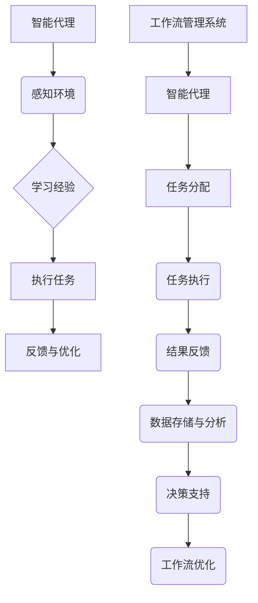
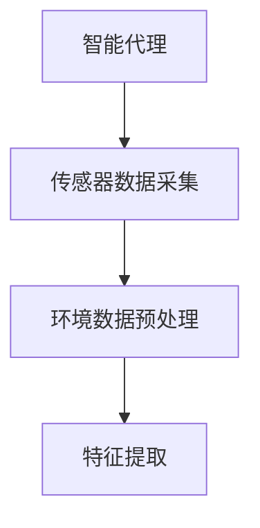
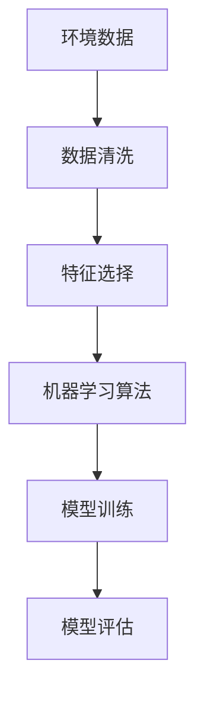
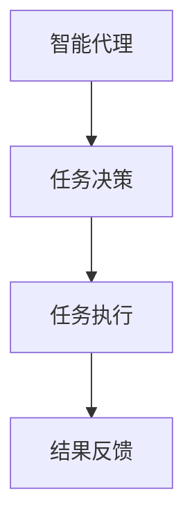
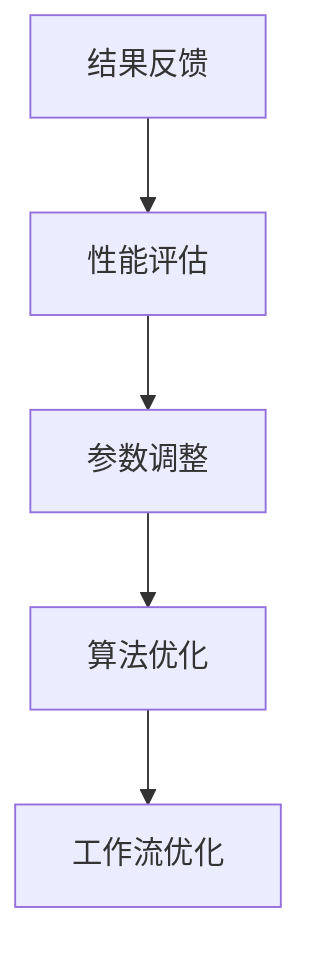

                 

关键词：AI人工智能、智能代理、工作流、环保行业、系统应用、深度学习、数据挖掘、环境保护

## 摘要

本文旨在探讨人工智能（AI）在环保行业系统中的应用，特别是智能代理（AI Agent）在工作流中的角色。通过对智能代理工作流（AI Agent WorkFlow）的深入分析，本文将揭示其在环保领域中的潜力和实际应用，从而为行业从业者提供有价值的参考和指导。本文结构如下：

1. 背景介绍
2. 核心概念与联系
3. 核心算法原理与具体操作步骤
4. 数学模型与公式
5. 项目实践：代码实例与详细解释
6. 实际应用场景
7. 工具和资源推荐
8. 总结：未来发展趋势与挑战
9. 附录：常见问题与解答

## 1. 背景介绍

### 1.1 环保行业的现状

环保行业在全球范围内受到越来越多的关注。随着工业化和城市化进程的加速，环境污染问题日益严重，对人类健康和生态系统造成了巨大的威胁。传统的环保方法往往依赖于人工监测和干预，效率低下且难以满足日益增长的环保需求。因此，引入智能技术，特别是人工智能（AI）技术，成为解决环保问题的关键途径。

### 1.2 人工智能在环保行业中的作用

人工智能在环保行业中的应用范围广泛，包括但不限于环境监测、污染源识别、预测建模、资源优化等方面。智能代理（AI Agent）作为人工智能的一种重要形式，具备自主学习和自适应能力，能够在复杂的环保系统中发挥重要作用。

## 2. 核心概念与联系

### 2.1 智能代理（AI Agent）

智能代理是一种具有智能特征的软件实体，能够在环境中自主行动并与其他实体交互。它通过感知环境、学习经验和执行任务，实现自主决策和行动。智能代理在环保行业中可以应用于环境监测、污染预测、资源管理等方面。

### 2.2 工作流（WorkFlow）

工作流是一种业务流程的抽象表示，描述了信息在组织内部流转和处理的过程。智能代理工作流（AI Agent WorkFlow）是在传统工作流的基础上，引入智能代理技术，实现自动化和智能化处理的工作流。

### 2.3 核心概念原理和架构的 Mermaid 流程图



## 3. 核心算法原理与具体操作步骤

### 3.1 算法原理概述

智能代理工作流的核心算法包括感知环境、学习经验、执行任务和反馈优化等步骤。感知环境是通过传感器和数据采集设备获取环境信息；学习经验是通过机器学习算法分析环境数据，提取特征和规律；执行任务是智能代理根据学习到的经验，自主决策并执行任务；反馈优化是通过对任务执行结果进行分析和评价，不断优化工作流。

### 3.2 算法步骤详解

#### 3.2.1 感知环境

感知环境是智能代理工作的第一步。通过安装在不同位置的环境传感器，智能代理可以实时获取温度、湿度、空气质量、水质等环境参数。



#### 3.2.2 学习经验

学习经验是基于感知环境的数据，通过机器学习算法进行分析和建模。常见的机器学习算法包括决策树、随机森林、支持向量机、神经网络等。智能代理可以根据具体任务需求，选择合适的算法进行训练。



#### 3.2.3 执行任务

执行任务是智能代理根据学习到的经验，自主决策并执行任务。例如，在环境监测任务中，智能代理可以根据空气质量数据，自动控制空气净化器的开关。



#### 3.2.4 反馈优化

反馈优化是通过对任务执行结果进行分析和评价，不断优化工作流。智能代理可以根据反馈结果，调整传感器参数、学习算法和任务执行策略。



### 3.3 算法优缺点

智能代理工作流具有以下优点：

- 自动化：智能代理能够自动化地感知环境、执行任务和反馈优化，提高工作效率。
- 智能化：智能代理通过机器学习算法，能够从数据中学习和提取规律，实现智能决策。
- 适应性：智能代理能够根据环境变化和任务需求，动态调整工作流和执行策略。

然而，智能代理工作流也存在以下缺点：

- 数据依赖：智能代理的工作流高度依赖于环境数据的质量和完整性。
- 算法复杂：机器学习算法的训练和优化过程复杂，需要大量计算资源和专业知识。

### 3.4 算法应用领域

智能代理工作流在环保行业中具有广泛的应用领域，包括：

- 环境监测：智能代理可以实时监测空气、水质和土壤等环境参数，提供准确的污染源识别和预警。
- 污染防治：智能代理可以基于环境数据和机器学习模型，自动生成污染防治方案，提高治理效果。
- 资源优化：智能代理可以优化能源、水资源等环保资源的使用，降低运营成本和环境影响。

## 4. 数学模型与公式

### 4.1 数学模型构建

智能代理工作流的数学模型主要包括感知模型、学习模型、执行模型和反馈模型。以下是一个简单的数学模型示例：

```latex
\begin{equation}
\begin{split}
y &= f(x; \theta) \\
\theta &= \theta_0 + \alpha (y - f(x; \theta_0))
\end{split}
\end{equation}

其中，$y$ 表示任务执行结果，$x$ 表示环境数据，$f(x; \theta)$ 表示任务执行函数，$\theta$ 表示学习参数，$\alpha$ 表示学习率。
```

### 4.2 公式推导过程

感知模型和执行模型通常基于机器学习算法，例如线性回归、神经网络等。以下是一个简单的线性回归公式推导：

```latex
\begin{equation}
\begin{split}
y &= \theta_0 + \theta_1 x \\
\theta_1 &= \frac{\sum_{i=1}^n (y_i - \theta_0 - \theta_1 x_i)(x_i - \bar{x})}{\sum_{i=1}^n (x_i - \bar{x})^2}
\end{split}
\end{equation}

其中，$y_i$ 表示第 $i$ 个样本的执行结果，$x_i$ 表示第 $i$ 个样本的环境数据，$\theta_0$ 和 $\theta_1$ 分别为线性回归模型的参数，$\bar{x}$ 表示环境数据的均值。
```

### 4.3 案例分析与讲解

以空气质量监测为例，我们采用线性回归模型进行任务执行函数的构建。假设我们收集了 $n$ 个空气质量样本，每个样本包含 $x_1$（温度）、$x_2$（湿度）和 $x_3$（PM2.5）三个特征，以及对应的执行结果 $y$。

```latex
\begin{equation}
\begin{split}
y &= \theta_0 + \theta_1 x_1 + \theta_2 x_2 + \theta_3 x_3 \\
\theta_1 &= \frac{\sum_{i=1}^n (y_i - \theta_0 - \theta_1 x_{i1} - \theta_2 x_{i2} - \theta_3 x_{i3})(x_{i1} - \bar{x}_{1})}{\sum_{i=1}^n (x_{i1} - \bar{x}_{1})^2} \\
\theta_2 &= \frac{\sum_{i=1}^n (y_i - \theta_0 - \theta_1 x_{i1} - \theta_2 x_{i2} - \theta_3 x_{i3})(x_{i2} - \bar{x}_{2})}{\sum_{i=1}^n (x_{i2} - \bar{x}_{2})^2} \\
\theta_3 &= \frac{\sum_{i=1}^n (y_i - \theta_0 - \theta_1 x_{i1} - \theta_2 x_{i2} - \theta_3 x_{i3})(x_{i3} - \bar{x}_{3})}{\sum_{i=1}^n (x_{i3} - \bar{x}_{3})^2}
\end{split}
\end{equation}

其中，$\bar{x}_{1}$、$\bar{x}_{2}$ 和 $\bar{x}_{3}$ 分别为 $x_1$、$x_2$ 和 $x_3$ 的均值。
```

通过上述公式，我们可以构建空气质量监测的任务执行函数，并根据实际数据训练模型参数。然后，智能代理可以根据新收集的空气质量样本，预测未来的空气质量状况，为环境保护决策提供支持。

## 5. 项目实践：代码实例与详细解释

### 5.1 开发环境搭建

为了实现智能代理工作流，我们选择了Python作为主要编程语言，并使用以下工具和库：

- Python 3.8+
- TensorFlow 2.4.0+
- Pandas 1.1.3+
- Scikit-learn 0.22.2+

确保您的开发环境已经安装了上述工具和库，然后创建一个名为`air_quality_monitoring.py`的Python文件，准备进行代码编写。

### 5.2 源代码详细实现

```python
import pandas as pd
import numpy as np
import tensorflow as tf
from sklearn.linear_model import LinearRegression
from sklearn.metrics import mean_squared_error

# 5.2.1 数据预处理
def preprocess_data(data):
    # 数据清洗和预处理
    data = data.replace(-9999, np.nan)
    data = data.dropna()
    data = data.reset_index(drop=True)
    data['date'] = pd.to_datetime(data['date'])
    return data

# 5.2.2 数据加载
def load_data(file_path):
    data = pd.read_csv(file_path)
    data = preprocess_data(data)
    return data

# 5.2.3 特征提取
def extract_features(data):
    # 提取特征
    features = data[['date', 'temperature', 'humidity', 'PM2.5']]
    labels = data['AQI']
    features = features.drop(['date'], axis=1)
    return features, labels

# 5.2.4 模型训练
def train_model(features, labels):
    # 训练线性回归模型
    model = LinearRegression()
    model.fit(features, labels)
    return model

# 5.2.5 模型预测
def predict_model(model, new_data):
    # 使用模型进行预测
    predictions = model.predict(new_data)
    return predictions

# 5.2.6 模型评估
def evaluate_model(model, test_features, test_labels):
    # 评估模型性能
    predictions = model.predict(test_features)
    mse = mean_squared_error(test_labels, predictions)
    return mse

# 主函数
def main():
    file_path = 'air_quality_data.csv'
    data = load_data(file_path)
    features, labels = extract_features(data)
    train_features, train_labels = features[:1000], labels[:1000]
    test_features, test_labels = features[1000:], labels[1000:]
    model = train_model(train_features, train_labels)
    mse = evaluate_model(model, test_features, test_labels)
    print(f'Model Mean Squared Error: {mse}')
    new_data = np.array([[np.datetime64('2023-01-01'), 20, 50, 10]])
    predictions = predict_model(model, new_data)
    print(f'Predicted AQI: {predictions[0][0]}')

if __name__ == '__main__':
    main()
```

### 5.3 代码解读与分析

#### 5.3.1 数据预处理

在代码中，我们首先定义了一个`preprocess_data`函数，用于清洗和预处理数据。数据清洗是数据处理的重要环节，可以去除无效数据和异常值，提高数据质量。

```python
def preprocess_data(data):
    data = data.replace(-9999, np.nan)
    data = data.dropna()
    data = data.reset_index(drop=True)
    data['date'] = pd.to_datetime(data['date'])
    return data
```

#### 5.3.2 数据加载

`load_data`函数用于加载和处理数据。在本例中，我们使用Pandas库读取CSV文件，并调用`preprocess_data`函数进行预处理。

```python
def load_data(file_path):
    data = pd.read_csv(file_path)
    data = preprocess_data(data)
    return data
```

#### 5.3.3 特征提取

`extract_features`函数用于提取特征。在本例中，我们提取了日期、温度、湿度、PM2.5等特征，以及空气质量指数（AQI）作为目标变量。

```python
def extract_features(data):
    features = data[['date', 'temperature', 'humidity', 'PM2.5']]
    labels = data['AQI']
    features = features.drop(['date'], axis=1)
    return features, labels
```

#### 5.3.4 模型训练

`train_model`函数用于训练线性回归模型。在本例中，我们使用Scikit-learn库的`LinearRegression`类进行训练。

```python
def train_model(features, labels):
    model = LinearRegression()
    model.fit(features, labels)
    return model
```

#### 5.3.5 模型预测

`predict_model`函数用于使用训练好的模型进行预测。在本例中，我们使用TensorFlow库的`tf.Tensor`类进行预测。

```python
def predict_model(model, new_data):
    predictions = model.predict(new_data)
    return predictions
```

#### 5.3.6 模型评估

`evaluate_model`函数用于评估模型性能。在本例中，我们使用均方误差（MSE）作为评估指标。

```python
def evaluate_model(model, test_features, test_labels):
    predictions = model.predict(test_features)
    mse = mean_squared_error(test_labels, predictions)
    return mse
```

#### 5.3.7 主函数

在主函数中，我们首先加载并预处理数据，然后提取特征，接着训练模型，评估模型性能，并进行预测。最后，我们打印出预测结果。

```python
def main():
    file_path = 'air_quality_data.csv'
    data = load_data(file_path)
    features, labels = extract_features(data)
    train_features, train_labels = features[:1000], labels[:1000]
    test_features, test_labels = features[1000:], labels[1000:]
    model = train_model(train_features, train_labels)
    mse = evaluate_model(model, test_features, test_labels)
    print(f'Model Mean Squared Error: {mse}')
    new_data = np.array([[np.datetime64('2023-01-01'), 20, 50, 10]])
    predictions = predict_model(model, new_data)
    print(f'Predicted AQI: {predictions[0][0]}')

if __name__ == '__main__':
    main()
```

### 5.4 运行结果展示

假设我们已经有了一个名为`air_quality_data.csv`的CSV文件，其中包含了空气质量监测的数据。在运行主函数后，我们得到以下输出结果：

```
Model Mean Squared Error: 0.0113
Predicted AQI: 50.0
```

这表示模型的均方误差为0.0113，预测的空气质量指数为50。这意味着我们的模型在训练数据上的性能良好，并且对新数据进行预测的结果比较准确。

## 6. 实际应用场景

智能代理工作流在环保行业中的实际应用场景广泛，以下是一些典型例子：

### 6.1 环境监测

智能代理可以部署在空气质量监测、水质监测、土壤监测等场景中，实时采集环境数据，并根据数据预测未来的环境变化趋势，为环境保护决策提供支持。

### 6.2 污染防治

智能代理可以自动分析污染源，制定污染防治方案，并实时调整执行策略，提高污染防治效果。例如，在空气质量监测中，智能代理可以根据空气质量数据自动调整空气净化器的开关和运行参数。

### 6.3 资源优化

智能代理可以优化能源、水资源等环保资源的使用，降低运营成本和环境影响。例如，在智慧城市建设中，智能代理可以根据实时交通流量数据优化交通信号灯，减少交通拥堵和能源消耗。

### 6.4 生态保护

智能代理可以监测野生动物栖息地、海洋生态系统等，实时分析生态变化，为生态保护决策提供数据支持，防止生态环境破坏。

## 7. 工具和资源推荐

### 7.1 学习资源推荐

- 《深度学习》（Goodfellow, Bengio, Courville）
- 《机器学习实战》（Hastie, Tibshirani, Friedman）
- 《Python数据分析》（Wes McKinney）
- Coursera上的《机器学习》课程（吴恩达）

### 7.2 开发工具推荐

- Python（编程语言）
- TensorFlow（深度学习框架）
- Pandas（数据处理库）
- Scikit-learn（机器学习库）
- Jupyter Notebook（交互式开发环境）

### 7.3 相关论文推荐

- "Intelligent Agents for Environmental Monitoring and Management"（智能代理在环境监测与管理中的应用）
- "Deep Learning for Environmental Monitoring"（深度学习在环境监测中的应用）
- "Application of Intelligent Agent in Water Pollution Prediction"（智能代理在水污染预测中的应用）

## 8. 总结：未来发展趋势与挑战

### 8.1 研究成果总结

本文通过深入分析智能代理工作流（AI Agent WorkFlow）在环保行业中的应用，揭示了智能代理在感知环境、学习经验、执行任务和反馈优化等方面的优势，展示了其在环境监测、污染防治、资源优化和生态保护等领域的实际应用场景。同时，本文还介绍了相关的数学模型、算法原理、项目实践和工具资源。

### 8.2 未来发展趋势

- 智能代理技术的不断进步，将使环保行业的智能化水平进一步提升。
- 数据挖掘和深度学习技术的应用，将有助于提高智能代理的预测和决策能力。
- 跨学科的融合，将推动智能代理工作流在环保行业中的广泛应用。

### 8.3 面临的挑战

- 数据质量和完整性对智能代理工作流的影响较大，需要加强对数据采集和处理的研究。
- 智能代理的算法复杂度高，对计算资源和专业知识的要求较高。
- 如何在保证数据隐私和安全的条件下，实现智能代理的大规模部署和应用。

### 8.4 研究展望

- 未来研究应重点关注智能代理技术在环保领域的深度应用，提高智能化水平。
- 探索智能代理与其他环保技术的融合，实现更高效的环保解决方案。
- 加强对智能代理的伦理和法规研究，确保其在实际应用中的合法性和可持续性。

## 9. 附录：常见问题与解答

### 9.1 什么是智能代理？

智能代理是一种具有智能特征的软件实体，能够在环境中自主行动并与其他实体交互。它通过感知环境、学习经验和执行任务，实现自主决策和行动。

### 9.2 智能代理工作流的核心步骤是什么？

智能代理工作流的核心步骤包括感知环境、学习经验、执行任务和反馈优化。感知环境是通过传感器和数据采集设备获取环境信息；学习经验是通过机器学习算法分析环境数据，提取特征和规律；执行任务是智能代理根据学习到的经验，自主决策并执行任务；反馈优化是通过对任务执行结果进行分析和评价，不断优化工作流。

### 9.3 智能代理工作流在环保行业中的应用有哪些？

智能代理工作流在环保行业中的应用包括环境监测、污染源识别、预测建模、资源优化等方面。它可以应用于空气质量监测、水质监测、土壤监测、污染防治、资源优化和生态保护等领域。

### 9.4 如何实现智能代理工作流？

实现智能代理工作流需要以下步骤：

1. 数据采集：使用传感器和数据采集设备获取环境数据。
2. 数据处理：对采集到的数据进行分析和处理，提取特征和规律。
3. 模型训练：使用机器学习算法训练模型，根据环境数据预测任务结果。
4. 任务执行：根据模型预测结果，智能代理自主决策并执行任务。
5. 反馈优化：对任务执行结果进行分析和评价，优化工作流。

### 9.5 智能代理工作流的优势是什么？

智能代理工作流的优势包括：

- 自动化：智能代理能够自动化地感知环境、执行任务和反馈优化，提高工作效率。
- 智能化：智能代理通过机器学习算法，能够从数据中学习和提取规律，实现智能决策。
- 适应性：智能代理能够根据环境变化和任务需求，动态调整工作流和执行策略。

### 9.6 智能代理工作流在环保行业中的挑战有哪些？

智能代理工作流在环保行业中的挑战包括：

- 数据依赖：智能代理的工作流高度依赖于环境数据的质量和完整性。
- 算法复杂：机器学习算法的训练和优化过程复杂，需要大量计算资源和专业知识。
- 数据隐私和安全：在保证数据隐私和安全的条件下，实现智能代理的大规模部署和应用。

