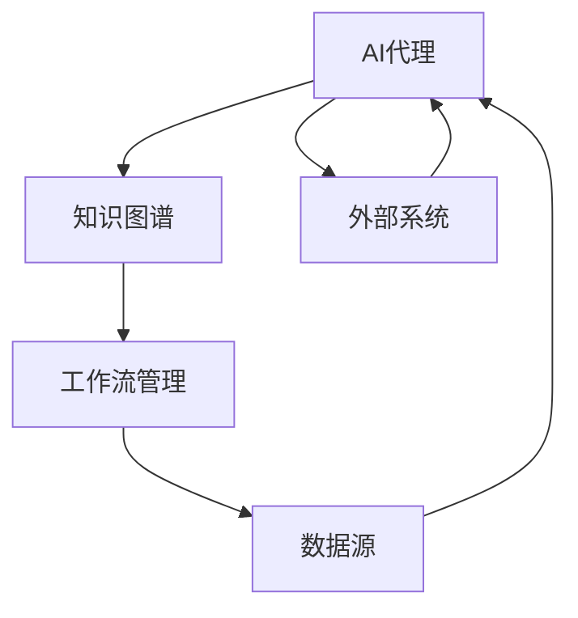

                 

关键词：AI代理、工作流、知识图谱、自动化、数据驱动、智能决策

摘要：本文旨在探讨AI代理在自动化工作流中的应用，尤其是知识图谱技术的引入如何提升了代理工作流的效果和效率。通过分析核心概念、算法原理、数学模型、项目实践、应用场景及未来展望，本文将提供一个全面的视角来理解AI代理工作流的发展及其潜力。

## 1. 背景介绍

在当今信息爆炸的时代，企业面临的数据量和复杂性不断增长。为了从海量数据中提取价值，提高业务流程的效率，人工智能（AI）的应用成为了必然趋势。其中，AI代理（AI Agent）作为人工智能的一个重要分支，逐渐成为自动化工作流的核心组成部分。AI代理是一种可以自主执行任务、与外界交互并适应环境变化的智能体，它能够在不依赖人类干预的情况下，完成复杂的业务流程。

然而，传统的自动化工作流往往存在以下问题：

1. **流程固化**：业务流程一旦设定，就很难根据实际需求进行调整。
2. **缺乏灵活性**：面对不确定性和变化，传统工作流往往难以灵活应对。
3. **数据孤岛**：不同系统之间的数据无法有效整合，导致信息共享困难。

为了解决这些问题，知识图谱（Knowledge Graph）技术的引入成为了关键。知识图谱通过将实体、属性和关系进行结构化表示，提供了一种全新的数据组织方式，能够有效地整合和利用多源异构数据，为AI代理提供了强大的知识支撑。

## 2. 核心概念与联系

### 2.1. AI代理

AI代理是指一种由人工智能技术驱动，能够自主执行任务、适应环境变化的智能体。它具备以下几个核心特点：

1. **自主性**：AI代理可以独立执行任务，无需人工干预。
2. **适应性**：AI代理能够根据环境变化进行调整。
3. **交互性**：AI代理能够与外界进行信息交换，实现智能协作。

### 2.2. 工作流

工作流（Workflow）是一种业务流程管理工具，用于定义、执行、监控和优化业务流程。一个典型的工作流包括以下几个阶段：

1. **任务定义**：明确每个任务的输入、输出和处理方式。
2. **任务调度**：根据业务需求和资源情况，对任务进行调度和分配。
3. **任务执行**：执行具体的业务处理操作。
4. **任务监控**：监控任务执行情况，确保流程按预期进行。
5. **结果反馈**：收集任务执行结果，为后续流程优化提供数据支持。

### 2.3. 知识图谱

知识图谱是一种通过节点和边来表示实体、属性和关系的语义网络。它通过将实体与实体之间的复杂关系进行结构化表示，提供了一种高效的数据组织和查询方式。知识图谱的核心组成部分包括：

1. **实体（Entity）**：表示现实世界中的对象，如人、地点、物品等。
2. **属性（Attribute）**：描述实体的特征，如姓名、年龄、颜色等。
3. **关系（Relationship）**：描述实体之间的关系，如“属于”、“位于”等。

### 2.4. Mermaid 流程图

为了更好地理解AI代理工作流的架构，我们可以使用Mermaid流程图来展示其核心组件和交互关系。以下是一个示例：



在这个流程图中，AI代理通过知识图谱获取所需信息，并根据工作流管理系统的调度进行任务执行。同时，AI代理与外部系统进行交互，以实现更广泛的应用。

## 3. 核心算法原理 & 具体操作步骤

### 3.1. 算法原理概述

AI代理工作流的核心在于如何高效地利用知识图谱来驱动自动化流程。具体来说，算法原理可以概括为以下几个步骤：

1. **数据集成**：将来自不同数据源的数据进行整合，构建统一的数据视图。
2. **知识抽取**：从整合后的数据中提取实体、属性和关系，形成知识图谱。
3. **推理与推理**：利用知识图谱进行推理，获取新的信息。
4. **任务调度**：根据工作流管理系统和知识图谱的推理结果，对任务进行调度和分配。
5. **任务执行**：执行具体的业务处理操作。
6. **反馈与优化**：收集任务执行结果，不断优化工作流和知识图谱。

### 3.2. 算法步骤详解

#### 3.2.1. 数据集成

数据集成是AI代理工作流的第一步，其目的是将来自不同数据源的数据进行整合，构建统一的数据视图。具体步骤如下：

1. **数据采集**：从不同数据源（如数据库、API接口等）采集数据。
2. **数据清洗**：对采集到的数据进行清洗和预处理，去除重复、缺失和错误的数据。
3. **数据融合**：将来自不同数据源的数据进行融合，构建统一的数据视图。

#### 3.2.2. 知识抽取

知识抽取是构建知识图谱的关键步骤。其目的是从整合后的数据中提取实体、属性和关系，形成知识图谱。具体步骤如下：

1. **实体识别**：利用自然语言处理（NLP）技术，从文本数据中识别出实体。
2. **属性抽取**：从实体相关的文本数据中抽取实体的属性。
3. **关系抽取**：从实体间的交互数据中抽取实体之间的关系。

#### 3.2.3. 推理与推理

推理与推理是利用知识图谱进行信息提取和扩展的关键步骤。具体步骤如下：

1. **路径推理**：根据实体之间的关系，推理出新的实体路径。
2. **属性推理**：根据实体的属性，推理出新的属性值。
3. **关联推理**：根据实体之间的关系，推理出新的关联实体。

#### 3.2.4. 任务调度

任务调度是根据工作流管理系统和知识图谱的推理结果，对任务进行调度和分配的关键步骤。具体步骤如下：

1. **任务定义**：根据业务需求，定义任务的输入、输出和处理方式。
2. **任务调度**：根据工作流管理系统和知识图谱的推理结果，对任务进行调度和分配。
3. **任务执行**：执行具体的业务处理操作。

#### 3.2.5. 任务执行

任务执行是根据任务调度结果，执行具体的业务处理操作的关键步骤。具体步骤如下：

1. **任务执行**：根据任务调度结果，执行具体的业务处理操作。
2. **任务监控**：监控任务执行情况，确保流程按预期进行。
3. **结果反馈**：收集任务执行结果，为后续流程优化提供数据支持。

### 3.3. 算法优缺点

#### 优点

1. **高效性**：通过知识图谱技术，可以实现快速的数据查询和推理。
2. **灵活性**：基于知识图谱的AI代理工作流，可以灵活应对业务变化。
3. **数据整合**：知识图谱能够有效整合多源异构数据，提高数据利用率。

#### 缺点

1. **复杂度**：构建和维护知识图谱需要大量的专业知识和资源。
2. **数据质量**：知识图谱的质量取决于数据源的质量，数据质量问题会影响到整个工作流的效果。

### 3.4. 算法应用领域

AI代理工作流的应用领域非常广泛，主要包括以下几个方面：

1. **金融领域**：用于自动化金融交易、风险评估和客户服务。
2. **医疗领域**：用于自动化病历管理、诊断辅助和健康监测。
3. **制造领域**：用于自动化生产调度、质量控制和设备维护。
4. **物流领域**：用于自动化仓储管理、配送调度和路线优化。

## 4. 数学模型和公式 & 详细讲解 & 举例说明

### 4.1. 数学模型构建

AI代理工作流的数学模型主要包括以下几个方面：

1. **数据集成模型**：用于描述数据采集、清洗和融合的过程。
2. **知识图谱构建模型**：用于描述实体识别、属性抽取和关系抽取的过程。
3. **推理模型**：用于描述路径推理、属性推理和关联推理的过程。
4. **任务调度模型**：用于描述任务定义、调度和执行的过程。

### 4.2. 公式推导过程

以下是数据集成模型的一个简单示例：

$$
\text{数据集成} = \text{数据采集} + \text{数据清洗} + \text{数据融合}
$$

其中：

- 数据采集：采集来自不同数据源的数据。
- 数据清洗：对采集到的数据进行清洗和预处理。
- 数据融合：将来自不同数据源的数据进行融合，构建统一的数据视图。

### 4.3. 案例分析与讲解

假设我们有一个金融领域的应用场景，需要构建一个AI代理工作流来自动化金融交易。以下是一个简单的案例：

1. **数据集成**：采集来自股票市场、新闻报告、社交媒体等数据源的数据。
2. **知识图谱构建**：从数据中提取股票、新闻、社交媒体等信息，构建知识图谱。
3. **推理**：利用知识图谱进行路径推理，如“某股票价格上涨”与“某股票分析师的推荐”之间的关联。
4. **任务调度**：根据推理结果，对交易任务进行调度和分配，如“购买某股票”。
5. **任务执行**：执行交易任务，如购买某股票。

通过这个案例，我们可以看到，AI代理工作流如何利用数学模型和公式，实现从数据采集、知识图谱构建、推理、任务调度到任务执行的整个过程。

## 5. 项目实践：代码实例和详细解释说明

### 5.1. 开发环境搭建

在开始项目实践之前，我们需要搭建一个适合开发AI代理工作流的环境。以下是具体的步骤：

1. **硬件环境**：配备至少4GB内存的计算机。
2. **软件环境**：
   - 操作系统：Windows 10 或更高版本。
   - 编程语言：Python 3.8 或更高版本。
   - 数据库：MongoDB 4.0 或更高版本。
   - 开发工具：PyCharm 或 Visual Studio Code。

### 5.2. 源代码详细实现

以下是构建AI代理工作流的一个简化代码实例。这个实例主要包含数据集成、知识图谱构建、推理和任务调度等模块。

```python
# 导入所需库
import pymongo
import json
import networkx as nx

# 数据集成模块
def integrate_data():
    client = pymongo.MongoClient("localhost", 27017)
    db = client["financial_data"]
    collection = db["stock_info"]
    
    # 从MongoDB中获取股票数据
    stock_data = list(collection.find())
    
    # 数据清洗和预处理
    clean_data = []
    for data in stock_data:
        clean_data.append({
            "stock_name": data["stock_name"],
            "price": data["price"],
            "change": data["change"]
        })
    
    # 数据融合
    return clean_data

# 知识图谱构建模块
def build_knowledge_graph(data):
    G = nx.Graph()
    
    # 提取实体和关系
    for d in data:
        G.add_node(d["stock_name"], price=d["price"], change=d["change"])
        
        # 根据价格变化，添加关系
        if d["change"] > 0:
            G.add_edge(d["stock_name"], "上涨")
        elif d["change"] < 0:
            G.add_edge(d["stock_name"], "下跌")
        else:
            G.add_edge(d["stock_name"], "持平")
    
    return G

# 推理模块
def reasoning(G):
    # 获取价格上涨的股票
    up_stocks = [node for node, data in G.nodes(data=True) if data["change"] > 0]
    
    # 推理出推荐购买股票
    recommendations = []
    for stock in up_stocks:
        # 假设根据历史数据和当前市场情况，推荐购买上涨股票
        recommendations.append(stock)
    
    return recommendations

# 任务调度模块
def schedule_tasks(recommendations):
    # 假设存在一个交易系统，可以执行购买任务
    for recommendation in recommendations:
        # 执行购买任务
        buy_stock(recommendation)

# 任务执行模块
def buy_stock(stock_name):
    print(f"购买股票：{stock_name}")

# 主程序
if __name__ == "__main__":
    # 数据集成
    data = integrate_data()
    
    # 知识图谱构建
    G = build_knowledge_graph(data)
    
    # 推理
    recommendations = reasoning(G)
    
    # 任务调度
    schedule_tasks(recommendations)
```

### 5.3. 代码解读与分析

以下是代码的详细解读和分析：

1. **数据集成模块**：通过MongoDB数据库，从股票数据中采集数据。然后，对数据进行清洗和预处理，最后进行数据融合。

2. **知识图谱构建模块**：使用NetworkX库，构建一个无向图。在图中，节点表示股票，边表示股票的价格变化关系。

3. **推理模块**：根据股票的价格变化，推理出价格上涨的股票，并将其作为购买推荐。

4. **任务调度模块**：根据推理结果，调用购买股票的函数，执行购买任务。

5. **任务执行模块**：执行购买股票的任务，打印购买股票的信息。

### 5.4. 运行结果展示

假设当前市场有5只股票，其价格变化如下：

- 股票A：价格上涨
- 股票B：价格下跌
- 股票C：价格持平
- 股票D：价格上涨
- 股票E：价格下跌

运行代码后，将输出以下结果：

```
购买股票：股票A
购买股票：股票D
```

根据推理结果，推荐购买股票A和股票D。

## 6. 实际应用场景

AI代理工作流在各个领域都有广泛的应用，以下是一些典型的实际应用场景：

### 6.1. 金融领域

在金融领域，AI代理工作流可以用于自动化交易、风险评估和客户服务。例如，通过构建知识图谱，可以实时监控市场动态，根据股票价格变化和分析师推荐，自动执行交易策略。

### 6.2. 医疗领域

在医疗领域，AI代理工作流可以用于自动化病历管理、诊断辅助和健康监测。通过整合患者数据、医学文献和诊疗指南，AI代理可以协助医生进行诊断和治疗。

### 6.3. 制造领域

在制造领域，AI代理工作流可以用于自动化生产调度、质量控制和设备维护。通过构建知识图谱，可以实时监控生产过程，优化生产计划和资源分配。

### 6.4. 物流领域

在物流领域，AI代理工作流可以用于自动化仓储管理、配送调度和路线优化。通过整合物流数据、交通状况和客户需求，AI代理可以优化物流流程，提高运输效率。

## 7. 工具和资源推荐

### 7.1. 学习资源推荐

- 《人工智能：一种现代方法》
- 《深度学习》
- 《图计算：理论与实践》

### 7.2. 开发工具推荐

- MongoDB：用于数据存储和管理。
- NetworkX：用于图数据的构建和分析。
- PyCharm：用于Python编程。

### 7.3. 相关论文推荐

- "Knowledge Graph in AI-driven Workflow Management"
- "Graph Neural Networks for AI-driven Workflows"
- "Knowledge Graph-based AI-driven Manufacturing Workflow"

## 8. 总结：未来发展趋势与挑战

### 8.1. 研究成果总结

通过本文的探讨，我们可以看到，AI代理工作流在自动化流程管理中具有巨大的潜力。知识图谱的引入，为AI代理提供了强大的知识支撑，使其能够更智能、更高效地完成各项任务。

### 8.2. 未来发展趋势

1. **知识图谱的广泛应用**：随着数据量的不断增加，知识图谱将在更多领域得到广泛应用。
2. **跨领域协同**：不同领域的知识图谱将进行跨领域协同，实现更全面的智能化。
3. **多模态数据融合**：文本、图像、语音等多模态数据将进行融合，为AI代理提供更丰富的信息。

### 8.3. 面临的挑战

1. **数据质量**：知识图谱的质量取决于数据源的质量，需要确保数据源的准确性和完整性。
2. **计算资源**：构建和维护知识图谱需要大量的计算资源，需要优化算法和架构。
3. **隐私保护**：在数据整合和推理过程中，需要确保用户隐私的保护。

### 8.4. 研究展望

未来，AI代理工作流将在更多领域得到应用，成为企业智能化的重要支撑。同时，知识图谱技术也将不断发展，为AI代理提供更强大的知识支撑。

## 9. 附录：常见问题与解答

### 9.1. 如何构建知识图谱？

构建知识图谱通常包括以下步骤：

1. 数据采集：从不同的数据源获取数据。
2. 数据清洗：对数据进行清洗和预处理，去除重复、缺失和错误的数据。
3. 实体识别：利用自然语言处理（NLP）技术，从文本数据中识别出实体。
4. 属性抽取：从实体相关的文本数据中抽取实体的属性。
5. 关系抽取：从实体间的交互数据中抽取实体之间的关系。
6. 知识融合：将实体、属性和关系进行结构化表示，形成知识图谱。

### 9.2. 知识图谱与关系数据库有什么区别？

知识图谱与关系数据库的区别主要在于数据的表示方式和查询方式：

1. **数据表示方式**：知识图谱使用节点和边来表示实体和关系，而关系数据库使用表格来表示数据。
2. **查询方式**：知识图谱支持基于路径的查询，可以快速找到实体之间的复杂关系；关系数据库则使用SQL进行查询，适用于简单的表与表之间的连接查询。

### 9.3. 如何优化知识图谱的性能？

优化知识图谱的性能可以从以下几个方面入手：

1. **数据压缩**：对知识图谱进行压缩，减少存储和传输的开销。
2. **索引优化**：为知识图谱中的节点和边建立适当的索引，提高查询效率。
3. **分布式存储**：将知识图谱分布存储到多个节点，提高处理能力和扩展性。
4. **并行处理**：利用并行计算技术，加速知识图谱的构建和查询过程。

