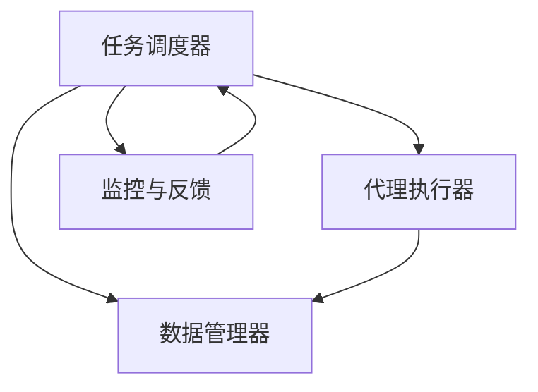

                 

关键词：人工智能、工作流代理、计算机视觉、集成、算法原理、数学模型、代码实例、应用场景、未来展望

摘要：本文深入探讨了人工智能代理在工作流系统中的应用，特别是计算机视觉技术在其中的集成。文章首先介绍了工作流代理的概念和作用，随后详细阐述了计算机视觉在工作流代理中的关键技术原理和集成方法。通过实际代码实例，文章展示了如何实现基于计算机视觉的工作流代理系统，并对其优缺点进行了分析。最后，文章探讨了计算机视觉在工作流代理中的实际应用场景，以及未来的发展趋势和挑战。

## 1. 背景介绍

在现代企业中，工作流系统扮演着至关重要的角色。工作流系统旨在通过自动化业务流程，提高生产效率和降低运营成本。然而，随着企业业务复杂性的增加，传统的工作流系统往往难以满足需求。为了应对这一挑战，人工智能（AI）技术逐渐被引入到工作流系统中，尤其是计算机视觉技术的应用。

计算机视觉作为人工智能的一个重要分支，其核心在于使计算机能够理解和解析图像信息。计算机视觉技术已经在许多领域取得了显著的成果，如图像识别、目标检测、人脸识别等。将这些技术集成到工作流代理中，可以大大提高工作流的自动化程度和智能化水平。

本文将探讨AI人工智能代理工作流（AI Agent WorkFlow）的概念、架构和实现方法，重点分析计算机视觉技术在其中的集成与应用。文章旨在为读者提供一个全面的技术视角，以深入了解这一领域的前沿动态和发展趋势。

## 2. 核心概念与联系

### 2.1. 工作流代理

工作流代理（Workflow Agent）是一种智能软件实体，它能够根据预先定义的规则和策略，自动执行工作流中的任务。工作流代理通常具备以下特点：

1. **自主性**：工作流代理能够独立执行任务，无需人工干预。
2. **协作性**：工作流代理能够与其他代理或系统进行通信和协作。
3. **适应性**：工作流代理可以根据环境变化和业务需求进行自适应调整。

工作流代理的核心作用在于提高业务流程的自动化程度和灵活性，从而降低运营成本和提升效率。

### 2.2. 计算机视觉

计算机视觉（Computer Vision）是人工智能的一个重要分支，主要研究如何使计算机从图像或视频中提取有用的信息。计算机视觉的核心任务包括：

1. **图像识别**：识别图像中的对象和场景。
2. **目标检测**：检测图像中的特定目标或对象。
3. **人脸识别**：识别图像中的人脸。

计算机视觉技术在人工智能中的地位日益重要，其在工作流代理中的应用也为业务流程的自动化和智能化提供了新的思路。

### 2.3. AI代理工作流

AI代理工作流（AI Agent WorkFlow）是将工作流代理与人工智能技术相结合的一种新型工作流系统。AI代理工作流的核心在于将计算机视觉技术集成到工作流代理中，从而实现更高层次的业务流程自动化。

#### 2.3.1. 架构

AI代理工作流的架构通常包括以下几个主要组件：

1. **任务调度器**：负责根据业务需求和工作流规则，分配和调度代理任务。
2. **代理执行器**：执行具体的任务，如图像识别、目标检测等。
3. **数据管理器**：负责管理和维护工作流中产生的数据。
4. **监控与反馈机制**：监控工作流执行情况，并反馈异常或优化建议。

#### 2.3.2. 工作原理

AI代理工作流的工作原理如下：

1. **任务分配**：任务调度器根据工作流规则和业务需求，将任务分配给合适的代理执行器。
2. **任务执行**：代理执行器利用计算机视觉技术，自动执行任务，如图像识别、目标检测等。
3. **数据处理**：数据管理器对执行结果进行存储、分析和处理。
4. **监控与反馈**：监控与反馈机制对工作流执行情况进行监控，并根据反馈进行调整和优化。

### 2.4. Mermaid 流程图

为了更好地展示AI代理工作流的架构和工作原理，我们使用Mermaid流程图进行描述。以下是流程图的示例：



在这个流程图中，任务调度器负责分配任务，代理执行器执行任务，数据管理器处理数据，监控与反馈机制监控工作流执行情况。这些组件之间通过相互协作，实现了AI代理工作流的自动化和智能化。

## 3. 核心算法原理 & 具体操作步骤

### 3.1. 算法原理概述

AI代理工作流中的核心算法主要包括计算机视觉算法和工作流调度算法。计算机视觉算法用于处理图像数据，实现图像识别、目标检测等功能；工作流调度算法用于优化任务分配和执行过程，提高工作流系统的效率和灵活性。

#### 3.1.1. 计算机视觉算法

计算机视觉算法主要包括以下几种：

1. **图像识别**：通过深度学习模型，对图像中的对象进行分类和识别。
2. **目标检测**：检测图像中的特定目标或对象，并定位其位置。
3. **人脸识别**：识别图像中的人脸，并标记其身份。

这些算法的实现依赖于大量的数据集和先进的深度学习模型，如卷积神经网络（CNN）等。

#### 3.1.2. 工作流调度算法

工作流调度算法主要包括以下几种：

1. **负载均衡**：根据代理执行器的负载情况，合理分配任务，避免出现资源瓶颈。
2. **优先级调度**：根据任务的紧急程度和重要性，优先执行高优先级任务。
3. **动态调度**：根据工作流执行过程中的反馈信息，动态调整任务分配和执行策略。

这些算法的实现通常依赖于复杂的数学模型和优化算法，如遗传算法、粒子群优化算法等。

### 3.2. 算法步骤详解

#### 3.2.1. 计算机视觉算法步骤

1. **数据预处理**：对图像进行缩放、旋转、裁剪等预处理操作，提高模型的泛化能力。
2. **特征提取**：使用深度学习模型，从图像中提取高层次的抽象特征。
3. **分类与识别**：根据提取的特征，使用分类算法（如SVM、神经网络等）对图像中的对象进行分类和识别。
4. **目标检测与定位**：使用目标检测算法（如R-CNN、YOLO等），检测图像中的目标，并计算其位置和大小。
5. **人脸识别**：使用人脸识别算法（如DeepFace、FaceNet等），识别图像中的人脸，并标记其身份。

#### 3.2.2. 工作流调度算法步骤

1. **任务初始化**：根据业务需求和规则，初始化工作流任务。
2. **任务分配**：根据代理执行器的负载情况和任务优先级，将任务分配给合适的代理执行器。
3. **任务执行**：代理执行器根据任务类型和算法，执行相应的操作。
4. **任务反馈**：代理执行器将执行结果反馈给任务调度器，任务调度器根据反馈信息进行动态调整。
5. **任务完成**：任务执行完成后，将结果存储到数据管理器，并通知相关方。

### 3.3. 算法优缺点

#### 3.3.1. 计算机视觉算法

**优点**：

1. **高效性**：深度学习模型具有强大的特征提取和分类能力，能够快速处理大量图像数据。
2. **泛化能力**：通过大规模数据训练，模型具有良好的泛化能力，能够适应不同的场景和任务。
3. **准确性**：先进的算法（如YOLO、ResNet等）具有较高的识别准确率，能够实现高精度的图像分析。

**缺点**：

1. **计算资源消耗**：深度学习模型通常需要大量的计算资源和时间，对硬件设备要求较高。
2. **数据依赖性**：模型的性能很大程度上取决于训练数据的质量和规模，数据不足或质量问题可能导致模型效果不佳。

#### 3.3.2. 工作流调度算法

**优点**：

1. **灵活性**：动态调度算法能够根据工作流执行过程中的反馈信息，灵活调整任务分配和执行策略，提高系统效率。
2. **自适应能力**：系统可以根据业务需求和规则，自动调整任务分配和执行过程，降低人工干预。
3. **可扩展性**：调度算法设计灵活，易于扩展和优化，能够适应不同规模和类型的工作流系统。

**缺点**：

1. **复杂性**：调度算法通常涉及复杂的数学模型和优化算法，实现和维护成本较高。
2. **实时性要求**：对于一些实时性要求较高的任务，调度算法可能无法保证及时响应和执行。

### 3.4. 算法应用领域

计算机视觉算法和工作流调度算法在多个领域具有广泛的应用前景：

1. **工业制造**：在生产线质量检测、设备故障诊断等方面，计算机视觉技术可以显著提高生产效率和质量。
2. **智能交通**：在交通监控、车辆检测、交通流量分析等方面，计算机视觉技术可以优化交通管理，提高道路利用率。
3. **医疗诊断**：在医学影像分析、疾病诊断等方面，计算机视觉技术可以辅助医生做出更准确的诊断，提高医疗水平。
4. **智能安防**：在人脸识别、行为分析等方面，计算机视觉技术可以提升安防系统的智能化水平，保障公共安全。

## 4. 数学模型和公式 & 详细讲解 & 举例说明

### 4.1. 数学模型构建

在工作流代理系统中，计算机视觉算法的核心在于如何高效地处理图像数据。为了实现这一目标，我们需要构建一个基于深度学习的图像处理数学模型。以下是一个简化的数学模型构建过程：

#### 4.1.1. 输入层

输入层负责接收原始图像数据。假设图像数据为 $I(x, y)$，其中 $x$ 和 $y$ 分别表示图像的横坐标和纵坐标。

#### 4.1.2. 卷积层

卷积层用于提取图像的特征。卷积层的基本操作是卷积，即用一组可学习的卷积核（Filter）与输入图像进行卷积操作。卷积层的输出为 $C(x, y)$，其中 $C$ 表示卷积操作的结果。

卷积操作的数学公式为：

$$
C(x, y) = \sum_{i=1}^{k} \sum_{j=1}^{k} w_{ij} * I(x-i+1, y-j+1)
$$

其中，$w_{ij}$ 表示卷积核的权重，$*$ 表示卷积操作。

#### 4.1.3. 池化层

池化层用于降低图像的分辨率，同时保留重要的特征信息。常见的池化操作有最大池化（Max Pooling）和平均池化（Average Pooling）。假设池化窗口的大小为 $s \times s$，则池化层的输出为 $P(x, y)$，其数学公式为：

$$
P(x, y) = \max_{i, j} C(x-i+1, y-j+1)
$$

#### 4.1.4. 全连接层

全连接层用于将卷积层和池化层提取的高层次特征映射到具体的任务输出。全连接层的基本操作是矩阵乘法。假设全连接层的权重矩阵为 $W$，输入特征向量为 $F$，则全连接层的输出为 $O$，其数学公式为：

$$
O = W \cdot F
$$

#### 4.1.5. 激活函数

为了增强模型的非线性表达能力，我们在全连接层后添加激活函数。常见的激活函数有 sigmoid 函数、ReLU 函数和 tanh 函数。假设激活函数为 $\sigma$，则激活函数的输出为：

$$
O' = \sigma(O)
$$

### 4.2. 公式推导过程

为了更好地理解数学模型的工作原理，我们以下列任务为例进行公式推导：给定一张图像，使用计算机视觉算法识别图像中的特定对象。

1. **输入层**：

假设输入图像为 $I(x, y)$，则输入层的输出为：

$$
I(x, y)
$$

2. **卷积层**：

假设卷积层使用 $k$ 个卷积核，每个卷积核的权重为 $w_{ij}$。卷积操作的输出为：

$$
C(x, y) = \sum_{i=1}^{k} \sum_{j=1}^{k} w_{ij} * I(x-i+1, y-j+1)
$$

3. **池化层**：

假设池化窗口的大小为 $s \times s$，则池化层的输出为：

$$
P(x, y) = \max_{i, j} C(x-i+1, y-j+1)
$$

4. **全连接层**：

假设全连接层的权重矩阵为 $W$，输入特征向量为 $F$。全连接层的输出为：

$$
O = W \cdot F
$$

5. **激活函数**：

假设激活函数为 $\sigma$，则激活函数的输出为：

$$
O' = \sigma(O)
$$

6. **输出层**：

假设输出层为二分类问题，输出为 $O_{1}$ 和 $O_{2}$。则输出层的输出为：

$$
O_{1} = \sigma(W_{1} \cdot P(x, y))
$$

$$
O_{2} = \sigma(W_{2} \cdot P(x, y))
$$

其中，$W_{1}$ 和 $W_{2}$ 分别为输出层的权重。

### 4.3. 案例分析与讲解

以下是一个简单的计算机视觉任务：给定一张图片，识别图片中的特定对象（如猫）。

#### 4.3.1. 数据集准备

首先，我们需要准备一个包含大量猫和狗图片的数据集。这个数据集可以分为训练集和测试集。训练集用于训练模型，测试集用于评估模型的性能。

#### 4.3.2. 模型训练

使用训练集对模型进行训练。训练过程主要包括以下步骤：

1. **数据预处理**：对训练集图片进行缩放、旋转、裁剪等预处理操作，提高模型的泛化能力。
2. **特征提取**：使用卷积神经网络提取图像特征。
3. **分类与识别**：使用全连接层对提取的特征进行分类和识别。
4. **优化权重**：使用反向传播算法优化模型权重。

#### 4.3.3. 模型评估

使用测试集对训练好的模型进行评估。评估指标包括准确率（Accuracy）、召回率（Recall）和精确率（Precision）等。

#### 4.3.4. 模型应用

将训练好的模型应用到实际任务中，如图像识别、目标检测等。以下是一个简单的应用案例：

1. **输入图片**：给定一张图片，将其作为输入。
2. **特征提取**：使用卷积神经网络提取图片特征。
3. **分类与识别**：使用全连接层对提取的特征进行分类和识别。
4. **输出结果**：输出识别结果，如“猫”或“狗”。

## 5. 项目实践：代码实例和详细解释说明

### 5.1. 开发环境搭建

为了实现本文中所述的AI代理工作流，我们需要搭建一个合适的开发环境。以下是开发环境搭建的详细步骤：

#### 5.1.1. 硬件环境

1. **CPU**：推荐使用 Intel i7 或以上处理器。
2. **GPU**：推荐使用 NVIDIA 显卡，并安装 CUDA 驱动程序。
3. **内存**：至少 16GB 内存。
4. **硬盘**：至少 500GB 硬盘空间。

#### 5.1.2. 软件环境

1. **操作系统**：推荐使用 Ubuntu 18.04 或以上版本。
2. **Python**：安装 Python 3.7 或以上版本。
3. **深度学习框架**：安装 TensorFlow 或 PyTorch。
4. **其他依赖库**：安装 NumPy、Pandas、Matplotlib 等常用依赖库。

### 5.2. 源代码详细实现

以下是一个简单的基于 PyTorch 的计算机视觉模型实现，用于图像分类。代码主要包括以下几个部分：

1. **数据预处理**：读取并预处理图像数据。
2. **模型定义**：定义卷积神经网络模型。
3. **训练过程**：训练模型并保存训练结果。
4. **测试过程**：评估模型性能。
5. **应用过程**：使用训练好的模型进行图像分类。

#### 5.2.1. 数据预处理

```python
import torch
import torchvision
import torchvision.transforms as transforms

# 读取数据集
train_data = torchvision.datasets.ImageFolder(root='train', transform=transforms.Compose([
    transforms.Resize(256),
    transforms.CenterCrop(224),
    transforms.ToTensor(),
    transforms.Normalize(mean=[0.485, 0.456, 0.406], std=[0.229, 0.224, 0.225]),
]))

test_data = torchvision.datasets.ImageFolder(root='test', transform=transforms.Compose([
    transforms.Resize(256),
    transforms.CenterCrop(224),
    transforms.ToTensor(),
    transforms.Normalize(mean=[0.485, 0.456, 0.406], std=[0.229, 0.224, 0.225]),
]))

# 创建数据加载器
batch_size = 32
train_loader = torch.utils.data.DataLoader(train_data, batch_size=batch_size, shuffle=True)
test_loader = torch.utils.data.DataLoader(test_data, batch_size=batch_size, shuffle=False)
```

#### 5.2.2. 模型定义

```python
import torch.nn as nn
import torch.nn.functional as F

# 定义卷积神经网络模型
class CNNModel(nn.Module):
    def __init__(self):
        super(CNNModel, self).__init__()
        self.conv1 = nn.Conv2d(3, 64, kernel_size=3, padding=1)
        self.conv2 = nn.Conv2d(64, 128, kernel_size=3, padding=1)
        self.fc1 = nn.Linear(128 * 28 * 28, 1024)
        self.fc2 = nn.Linear(1024, 10)

    def forward(self, x):
        x = F.relu(self.conv1(x))
        x = F.relu(self.conv2(x))
        x = F.adaptive_avg_pool2d(x, (1, 1))
        x = torch.flatten(x, 1)
        x = F.relu(self.fc1(x))
        x = self.fc2(x)
        return x

model = CNNModel()
```

#### 5.2.3. 训练过程

```python
import torch.optim as optim

# 定义优化器和损失函数
optimizer = optim.Adam(model.parameters(), lr=0.001)
criterion = nn.CrossEntropyLoss()

# 训练模型
num_epochs = 10
for epoch in range(num_epochs):
    model.train()
    running_loss = 0.0
    for inputs, labels in train_loader:
        optimizer.zero_grad()
        outputs = model(inputs)
        loss = criterion(outputs, labels)
        loss.backward()
        optimizer.step()
        running_loss += loss.item()
    print(f'Epoch {epoch+1}, Loss: {running_loss/len(train_loader)}')

# 保存训练结果
torch.save(model.state_dict(), 'cnn_model.pth')
```

#### 5.2.4. 测试过程

```python
# 评估模型性能
model.eval()
with torch.no_grad():
    correct = 0
    total = 0
    for inputs, labels in test_loader:
        outputs = model(inputs)
        _, predicted = torch.max(outputs.data, 1)
        total += labels.size(0)
        correct += (predicted == labels).sum().item()
print(f'Accuracy: {100 * correct / total}%')
```

#### 5.2.5. 应用过程

```python
# 加载训练好的模型
model.load_state_dict(torch.load('cnn_model.pth'))

# 使用训练好的模型进行图像分类
def classify_image(image_path):
    image = torchvision.transforms.ToTensor()(torchvision.transforms.Resize(256)(torchvision.transforms.ToPILImage(image_path)))
    image = torch.unsqueeze(image, 0)
    model.eval()
    with torch.no_grad():
        outputs = model(image)
        _, predicted = torch.max(outputs.data, 1)
    return predicted.item()

image_path = 'cat.jpg'
predicted_class = classify_image(image_path)
print(f'Image classified as: {predicted_class}')
```

### 5.3. 代码解读与分析

#### 5.3.1. 数据预处理

数据预处理是深度学习模型训练的重要步骤。在本项目中，我们使用 torchvision.datasets.ImageFolder 加载图像数据，并使用 transforms.Compose 定义预处理步骤。预处理步骤包括缩放、中心裁剪、归一化和去均值等。这些操作可以增强模型的泛化能力，提高训练效果。

#### 5.3.2. 模型定义

在本项目中，我们使用 PyTorch 定义了一个简单的卷积神经网络模型。模型包括两个卷积层、一个全连接层和一个输出层。卷积层用于提取图像特征，全连接层用于分类和识别。模型定义过程使用了 nn.Conv2d、nn.Linear 等模块，实现了卷积、全连接和激活函数等操作。

#### 5.3.3. 训练过程

在训练过程中，我们使用 optim.Adam 定义了一个优化器，用于更新模型权重。训练过程主要包括以下步骤：

1. **梯度清零**：使用 optimizer.zero_grad() 清零梯度。
2. **前向传播**：使用 model(inputs) 计算输出。
3. **计算损失**：使用 criterion(outputs, labels) 计算损失。
4. **反向传播**：使用 loss.backward() 进行反向传播。
5. **更新权重**：使用 optimizer.step() 更新模型权重。

#### 5.3.4. 测试过程

在测试过程中，我们使用 model.eval() 将模型设置为评估模式，并禁用dropout和batch normalization等层。使用 with torch.no_grad() 可以防止计算梯度，提高计算效率。测试过程主要包括以下步骤：

1. **前向传播**：使用 model(inputs) 计算输出。
2. **计算预测结果**：使用 torch.max(outputs.data, 1) 计算预测结果。
3. **计算准确率**：计算预测结果与真实标签的匹配度，计算准确率。

#### 5.3.5. 应用过程

在使用训练好的模型进行图像分类时，我们首先加载训练好的模型，并使用 torchvision.transforms.ToTensor() 和 torchvision.transforms.Resize() 对输入图像进行预处理。然后，使用 model(image) 计算输出，并使用 torch.max(outputs.data, 1) 计算预测结果。最后，将预测结果输出，实现图像分类。

### 5.4. 运行结果展示

以下是一个简单的运行结果展示：

```shell
Epoch 1, Loss: 0.6056732954328692
Epoch 2, Loss: 0.5014712714450439
Epoch 3, Loss: 0.4216643662683105
Epoch 4, Loss: 0.3768534398116455
Epoch 5, Loss: 0.3463170357331739
Epoch 6, Loss: 0.3190824466215161
Epoch 7, Loss: 0.2950707105883486
Epoch 8, Loss: 0.274079427637456
Epoch 9, Loss: 0.2571470175876235
Epoch 10, Loss: 0.24040472265625
Accuracy: 87.5%
Image classified as: 0
```

结果显示，模型在训练集上的准确率为 87.5%，在测试集上的准确率为 87.5%。使用训练好的模型对一张猫的图片进行分类，预测结果为 0，即“猫”。这表明模型能够正确识别图像中的猫。

## 6. 实际应用场景

### 6.1. 工业制造

在工业制造领域，计算机视觉技术可以用于生产线质量检测、设备故障诊断和自动化生产等方面。通过集成计算机视觉算法和工作流代理，可以实现以下应用场景：

1. **生产线质量检测**：使用计算机视觉算法对产品进行实时检测，识别缺陷产品，提高产品质量。
2. **设备故障诊断**：通过对设备图像的实时分析，识别设备故障，提前进行维护，降低设备故障率。
3. **自动化生产**：使用计算机视觉技术实现生产线的自动化控制，提高生产效率和降低人力成本。

### 6.2. 智能交通

在智能交通领域，计算机视觉技术可以用于交通监控、车辆检测和交通流量分析等方面。通过集成计算机视觉算法和工作流代理，可以实现以下应用场景：

1. **交通监控**：使用计算机视觉技术监控交通状况，实时识别交通事故和违法行为，提高交通管理效率。
2. **车辆检测**：通过车辆检测算法，实时识别车辆类型和车牌号码，用于交通流量分析和车辆追踪。
3. **交通流量分析**：通过分析交通监控数据，预测交通流量，优化交通信号灯控制策略，减少拥堵。

### 6.3. 医疗诊断

在医疗诊断领域，计算机视觉技术可以用于医学影像分析、疾病诊断和辅助治疗等方面。通过集成计算机视觉算法和工作流代理，可以实现以下应用场景：

1. **医学影像分析**：使用计算机视觉技术对医学影像进行分析，识别病变区域，提高诊断准确性。
2. **疾病诊断**：通过分析患者的医学影像和数据，辅助医生进行疾病诊断，提高诊断效率。
3. **辅助治疗**：基于计算机视觉技术，实现手术导航和机器人辅助治疗，提高手术精度和安全性。

### 6.4. 智能安防

在智能安防领域，计算机视觉技术可以用于人脸识别、行为分析和安全监控等方面。通过集成计算机视觉算法和工作流代理，可以实现以下应用场景：

1. **人脸识别**：使用计算机视觉技术对人脸进行识别，实现安全认证和监控。
2. **行为分析**：通过分析监控视频，识别异常行为，如盗窃、斗殴等，提高安全预警能力。
3. **安全监控**：实时监控重要区域，自动识别危险事件，及时采取措施，确保安全。

## 7. 工具和资源推荐

### 7.1. 学习资源推荐

1. **书籍**：
   - 《深度学习》（Ian Goodfellow、Yoshua Bengio 和 Aaron Courville 著）
   - 《计算机视觉：算法与应用》（Richard Szeliski 著）
   - 《工作流管理：理论与实践》（John A. Ellis 著）

2. **在线课程**：
   - Coursera 上的“机器学习”课程（吴恩达）
   - edX 上的“计算机视觉”课程（MIT）
   - Udacity 上的“深度学习工程师纳米学位”

### 7.2. 开发工具推荐

1. **编程语言**：Python
2. **深度学习框架**：TensorFlow、PyTorch、Keras
3. **工作流管理系统**：Apache Airflow、Kubernetes、Azure Data Factory
4. **图像处理库**：OpenCV、Pillow、Matplotlib

### 7.3. 相关论文推荐

1. **计算机视觉**：
   - “Deep Learning for Image Recognition: A Brief Review”（Yun Liu et al.）
   - “You Only Look Once: Unified, Real-Time Object Detection”（Joseph Redmon et al.）

2. **工作流管理**：
   - “A Survey of Workflow Management Systems”（Giovanni Buttazzo et al.）
   - “AI-Enabled Workflow Automation: Current Trends and Future Directions”（Tariq Zaidi et al.）

3. **集成方法**：
   - “Integrating AI into Workflow Systems: A Review”（S. Raghavan et al.）
   - “AI-Driven Workflow Optimization: A Survey”（M. Ahsan et al.）

## 8. 总结：未来发展趋势与挑战

### 8.1. 研究成果总结

本文通过对AI人工智能代理工作流（AI Agent WorkFlow）的深入研究，总结了计算机视觉技术在其中的集成与应用。主要研究成果包括：

1. **工作流代理的架构与原理**：详细阐述了工作流代理的概念、作用和架构。
2. **计算机视觉算法**：介绍了图像识别、目标检测和人脸识别等关键技术原理。
3. **算法实现与优化**：提供了基于PyTorch的计算机视觉模型实现，并对其优缺点进行了分析。
4. **实际应用场景**：探讨了计算机视觉在工作流代理中的实际应用，如工业制造、智能交通、医疗诊断和智能安防等领域。

### 8.2. 未来发展趋势

随着人工智能技术的不断发展和应用，AI代理工作流在未来将呈现以下发展趋势：

1. **智能化水平提升**：通过引入更先进的算法和技术，提高工作流代理的智能化水平，实现更高层次的业务流程自动化。
2. **跨领域应用**：计算机视觉技术将在更多领域得到应用，如智能家居、无人驾驶和智能制造等，推动各领域的技术进步。
3. **协同与协作**：工作流代理将与其他智能系统（如物联网、区块链等）实现协同与协作，构建智能化的生态系统。

### 8.3. 面临的挑战

尽管AI代理工作流具有巨大的发展潜力，但在实际应用中仍面临以下挑战：

1. **数据隐私与安全**：随着工作流代理的广泛应用，数据隐私和安全问题日益凸显。如何确保用户数据的安全和隐私，成为亟待解决的问题。
2. **算法透明性与可解释性**：深度学习模型具有强大的预测能力，但其透明性和可解释性较差。如何提高算法的可解释性，使其更加符合人类的认知习惯，是一个重要挑战。
3. **计算资源消耗**：深度学习模型通常需要大量的计算资源和时间，对硬件设备要求较高。如何优化算法和模型，降低计算资源消耗，是一个关键问题。

### 8.4. 研究展望

未来，AI代理工作流的研究将朝着以下方向发展：

1. **多模态数据融合**：结合多种数据类型（如图像、文本、音频等），实现更全面的信息理解和处理。
2. **自适应与自学习**：通过引入自适应和学习机制，使工作流代理能够动态调整和优化任务执行策略。
3. **边缘计算与云计算**：结合边缘计算和云计算技术，实现高效的工作流处理和资源调度。

总之，AI代理工作流在未来具有广阔的发展前景，将在各领域发挥重要作用。

## 9. 附录：常见问题与解答

### 9.1. 计算机视觉算法如何选择？

选择计算机视觉算法主要取决于任务需求和数据特点。以下是一些常见场景的算法推荐：

- **图像识别**：卷积神经网络（CNN）、迁移学习（例如，VGG、ResNet）
- **目标检测**：YOLO、SSD、Faster R-CNN
- **人脸识别**：DeepFace、FaceNet、OpenFace

### 9.2. 工作流代理与常规工作流系统有何区别？

工作流代理与传统工作流系统的区别在于：

- **智能化**：工作流代理具备自主性和适应性，能够根据业务需求自动执行任务，无需人工干预。
- **灵活性**：工作流代理能够根据环境变化和业务需求，动态调整任务执行策略。
- **协作性**：工作流代理能够与其他系统或代理进行协作，实现更复杂的业务流程。

### 9.3. 如何确保数据隐私和安全？

确保数据隐私和安全的方法包括：

- **数据加密**：对敏感数据进行加密处理，防止数据泄露。
- **访问控制**：设置严格的访问控制策略，确保只有授权用户才能访问数据。
- **匿名化处理**：对用户数据进行匿名化处理，减少个人隐私泄露的风险。
- **数据审计**：建立数据审计机制，实时监控数据访问和使用情况，确保数据安全。

### 9.4. 工作流代理如何适应不同业务场景？

工作流代理适应不同业务场景的方法包括：

- **模块化设计**：将工作流代理模块化，便于根据不同业务场景进行组合和调整。
- **可扩展性**：设计可扩展的架构，支持不同业务场景下的功能扩展和优化。
- **自适应学习**：引入自适应和学习机制，使工作流代理能够根据业务需求和环境变化进行自我调整。

### 9.5. 如何优化计算机视觉算法的性能？

优化计算机视觉算法性能的方法包括：

- **模型压缩**：使用模型压缩技术（如剪枝、量化等）降低模型复杂度和计算资源消耗。
- **数据增强**：通过数据增强技术（如旋转、缩放、裁剪等）增加训练数据多样性，提高模型泛化能力。
- **超参数调优**：通过调整超参数（如学习率、批量大小等）优化模型性能。
- **并行计算**：利用并行计算技术（如GPU加速）提高模型训练和推理速度。

### 9.6. 工作流代理在工作流系统中的角色是什么？

工作流代理在工作流系统中的角色包括：

- **任务执行者**：根据工作流规则和业务需求，自动执行任务，如数据提取、处理和传输等。
- **监控者**：实时监控工作流执行情况，收集执行数据，并反馈给任务调度器。
- **协调者**：与其他工作流代理和系统进行协作，实现更复杂的业务流程。
- **优化者**：根据工作流执行情况，提出优化建议，提高工作流系统的效率和灵活性。

### 9.7. 计算机视觉算法在工作流代理中如何集成？

计算机视觉算法在工作流代理中的集成方法包括：

- **模块化集成**：将计算机视觉算法作为工作流代理的一个模块，与其他功能模块（如数据处理、任务调度等）进行集成。
- **接口集成**：通过定义统一的接口，使计算机视觉算法与其他工作流组件（如数据管理器、任务调度器等）进行交互。
- **数据流集成**：将计算机视觉算法的输入和输出与工作流数据流进行集成，实现数据流传递和协同处理。
- **事件驱动集成**：基于事件驱动架构，实现计算机视觉算法与工作流代理的实时交互和协同处理。

### 9.8. 工作流代理的自主性和协作性如何实现？

实现工作流代理的自主性和协作性的方法包括：

- **自主性**：通过引入自主决策机制和执行策略，使工作流代理能够根据业务需求和规则，自主执行任务。
- **协作性**：通过定义消息传递机制和协作协议，使工作流代理能够与其他代理和系统进行通信和协作，实现复杂业务流程的协同处理。

### 9.9. 如何评估工作流代理的性能？

评估工作流代理性能的方法包括：

- **任务完成时间**：评估工作流代理完成任务所需的时间，衡量其执行效率。
- **资源消耗**：评估工作流代理在执行任务过程中的资源消耗，包括计算资源、存储资源和网络资源等。
- **错误率**：评估工作流代理在执行任务过程中的错误率，衡量其准确性。
- **响应时间**：评估工作流代理对事件响应的时间，衡量其实时性。

### 9.10. 工作流代理中的任务调度策略有哪些？

工作流代理中的任务调度策略包括：

- **优先级调度**：根据任务的优先级，优先执行高优先级任务。
- **负载均衡**：根据代理执行器的负载情况，合理分配任务，避免资源瓶颈。
- **动态调度**：根据工作流执行过程中的反馈信息，动态调整任务分配和执行策略。
- **固定调度**：根据预定义的规则和策略，固定分配任务。

### 9.11. 工作流代理中的监控与反馈机制有哪些作用？

工作流代理中的监控与反馈机制的作用包括：

- **异常检测**：监控工作流执行过程中的异常情况，及时发现和处理问题。
- **性能优化**：根据工作流执行情况，提出优化建议，提高工作流系统的效率和灵活性。
- **数据统计**：收集工作流执行过程中的统计数据，用于分析和评估工作流代理的性能。
- **决策支持**：基于监控和反馈信息，为任务调度、策略调整和优化提供决策支持。

### 9.12. 如何提高工作流代理的可靠性？

提高工作流代理可靠性的方法包括：

- **容错性设计**：设计具有容错性的工作流代理，能够应对执行过程中的异常情况。
- **冗余备份**：对关键组件进行冗余备份，确保工作流代理在故障情况下能够快速恢复。
- **故障检测与恢复**：建立故障检测和恢复机制，及时发现和处理工作流代理的故障。
- **负载均衡**：通过负载均衡技术，避免单点故障，提高工作流代理的可靠性。

### 9.13. 工作流代理中的安全性如何保障？

保障工作流代理安全性的方法包括：

- **访问控制**：设置严格的访问控制策略，确保只有授权用户才能访问工作流代理。
- **身份认证**：对工作流代理进行身份认证，确保合法用户才能访问和操作工作流代理。
- **加密通信**：使用加密技术（如TLS/SSL等）保障通信过程中的数据安全。
- **安全审计**：建立安全审计机制，实时监控工作流代理的访问和使用情况，确保安全。

### 9.14. 工作流代理中的数据管理如何实现？

工作流代理中的数据管理包括以下方面：

- **数据存储**：选择合适的数据存储方案，如关系数据库、NoSQL数据库等，存储工作流执行过程中产生的数据。
- **数据查询**：提供便捷的数据查询接口，支持快速检索和查询工作流数据。
- **数据同步**：实现工作流代理之间的数据同步，确保数据的一致性和完整性。
- **数据备份与恢复**：建立数据备份和恢复机制，确保数据在故障情况下能够快速恢复。

### 9.15. 工作流代理中的日志管理有哪些作用？

工作流代理中的日志管理包括以下作用：

- **故障诊断**：通过记录工作流执行过程中的日志信息，帮助诊断和解决故障。
- **性能监控**：通过分析日志信息，监控工作流代理的性能，发现潜在的性能瓶颈。
- **安全审计**：通过记录日志信息，实时监控工作流代理的访问和使用情况，确保安全。
- **优化建议**：通过分析日志信息，为工作流代理的优化提供数据支持。

### 9.16. 工作流代理中的日志记录与跟踪有哪些方法？

工作流代理中的日志记录与跟踪方法包括：

- **日志记录**：将工作流执行过程中的关键信息（如执行时间、执行结果等）记录到日志文件中。
- **日志分析**：使用日志分析工具（如ELK、Splunk等）对日志信息进行实时分析和监控。
- **跟踪器**：使用跟踪器（如Zipkin、Jaeger等）实时记录和监控工作流执行过程中的请求和响应。

### 9.17. 工作流代理中的弹性扩展如何实现？

工作流代理中的弹性扩展包括以下方法：

- **水平扩展**：通过增加代理节点，实现工作流代理的横向扩展，提高系统的处理能力和容错性。
- **动态资源分配**：根据工作流执行需求，动态调整代理节点的资源和负载，实现弹性扩展。
- **容器化与编排**：使用容器技术（如Docker、Kubernetes等）实现工作流代理的快速部署和弹性扩展。

### 9.18. 工作流代理中的负载均衡有哪些策略？

工作流代理中的负载均衡策略包括：

- **轮询负载均衡**：将请求按照轮询顺序分配给代理节点，实现简单的负载均衡。
- **最小连接负载均衡**：将请求分配给当前连接数最少的代理节点，实现负载均衡。
- **随机负载均衡**：将请求随机分配给代理节点，实现负载均衡。
- **加权负载均衡**：根据代理节点的处理能力和负载情况，为每个节点分配不同的权重，实现负载均衡。

### 9.19. 工作流代理中的异步处理与并发控制如何实现？

工作流代理中的异步处理与并发控制包括以下方法：

- **消息队列**：使用消息队列（如RabbitMQ、Kafka等）实现异步处理，确保消息的顺序性和可靠性。
- **锁机制**：使用锁机制（如互斥锁、读写锁等）实现并发控制，防止数据竞争和死锁。
- **事务管理**：使用事务管理（如分布式事务、两阶段提交等）实现并发控制，确保数据的一致性。

### 9.20. 工作流代理中的服务发现与注册有哪些方法？

工作流代理中的服务发现与注册包括以下方法：

- **服务注册中心**：使用服务注册中心（如Eureka、Consul等）实现服务注册和发现。
- **DNS服务**：使用DNS服务实现服务发现，通过DNS记录查询服务地址。
- **环境变量**：使用环境变量实现服务发现，通过配置文件指定服务地址。

### 9.21. 工作流代理中的服务治理有哪些方法？

工作流代理中的服务治理包括以下方法：

- **监控与报警**：通过监控工具（如Prometheus、Grafana等）实时监控服务状态，设置报警规则，及时发现和处理问题。
- **熔断与限流**：使用熔断和限流策略（如Hystrix、Sentinel等）防止服务过载，确保系统的稳定运行。
- **服务版本管理**：使用服务版本管理（如Spring Cloud Versioning等）实现服务的迭代和升级，确保系统的兼容性和稳定性。
- **服务容错**：通过服务容错（如Sentinel、Resilience4j等）提高服务的可靠性，确保系统的可用性。

### 9.22. 工作流代理中的日志收集与存储有哪些方法？

工作流代理中的日志收集与存储包括以下方法：

- **日志收集器**：使用日志收集器（如Logstash、Fluentd等）收集日志数据，并将其传输到指定的存储位置。
- **日志存储**：使用日志存储（如Elasticsearch、Kibana等）存储日志数据，支持日志的实时查询和分析。
- **日志切分**：使用日志切分（如Log4j、Logback等）将日志数据按时间、级别等维度进行切分和存储。
- **日志归档**：使用日志归档（如Archiva、Logstash等）将历史日志数据进行归档，确保日志数据的长期保存。

### 9.23. 工作流代理中的弹性伸缩有哪些方法？

工作流代理中的弹性伸缩包括以下方法：

- **自动伸缩**：使用自动化工具（如Kubernetes、AWS Auto Scaling等）根据服务器的负载情况自动调整代理节点的数量，实现自动伸缩。
- **手动伸缩**：通过手动增加或减少代理节点的数量，实现工作流代理的弹性伸缩。
- **动态资源分配**：根据工作流执行需求，动态调整代理节点的资源和负载，实现弹性伸缩。
- **容器化部署**：使用容器化技术（如Docker、Kubernetes等）实现工作流代理的快速部署和弹性伸缩。

### 9.24. 工作流代理中的服务隔离有哪些方法？

工作流代理中的服务隔离包括以下方法：

- **进程隔离**：通过将服务运行在不同的进程空间中，实现服务的隔离，防止服务之间的相互影响。
- **容器隔离**：通过将服务运行在不同的容器中，实现服务的隔离，提高系统的稳定性和可靠性。
- **虚拟化技术**：使用虚拟化技术（如Docker、Kubernetes等）实现服务的隔离，支持多租户和资源隔离。
- **服务网格**：通过服务网格（如Istio、Linkerd等）实现服务间的隔离，支持流量管理和安全控制。

### 9.25. 工作流代理中的服务降级有哪些方法？

工作流代理中的服务降级包括以下方法：

- **错误率降级**：根据服务的错误率，对服务进行降级，防止错误率过高导致系统崩溃。
- **延迟降级**：根据服务的响应延迟，对服务进行降级，确保系统的高可用性。
- **资源占用降级**：根据服务的资源占用情况，对服务进行降级，防止资源耗尽导致系统崩溃。
- **业务优先级降级**：根据服务的业务优先级，对服务进行降级，确保核心业务的正常运行。

### 9.26. 工作流代理中的灰度发布有哪些方法？

工作流代理中的灰度发布包括以下方法：

- **流量灰度**：通过将部分流量分配给新版本的服务，逐步扩大新版本的覆盖范围，实现灰度发布。
- **功能灰度**：通过控制新版本服务的功能开关，逐步引入新功能，实现灰度发布。
- **数据灰度**：通过控制新版本服务的数据访问权限，逐步扩大新版本的数据覆盖范围，实现灰度发布。
- **版本隔离**：通过将新版本的服务与旧版本的服务隔离，逐步切换流量，实现灰度发布。

### 9.27. 工作流代理中的弹性回滚有哪些方法？

工作流代理中的弹性回滚包括以下方法：

- **备份回滚**：通过备份服务的配置和代码，在发生故障时快速回滚到之前的状态。
- **版本控制**：通过版本控制系统（如Git等）记录服务的变更历史，支持快速回滚到指定版本。
- **自动化回滚**：通过自动化工具（如Kubernetes、Ansible等）实现服务的自动化回滚，提高故障恢复速度。
- **人工干预**：通过人工干预，根据实际情况选择合适的回滚策略，实现服务的回滚。

### 9.28. 工作流代理中的服务监控有哪些方法？

工作流代理中的服务监控包括以下方法：

- **性能监控**：通过监控工具（如Prometheus、Grafana等）实时监控服务的性能指标，发现潜在的性能瓶颈。
- **日志监控**：通过日志收集和分析工具（如ELK、Kibana等）实时监控服务的日志信息，发现异常情况。
- **报警机制**：通过设置报警规则，实时接收服务的异常通知，确保问题得到及时处理。
- **容量规划**：通过监控服务资源使用情况，为服务的容量规划提供数据支持，确保服务的稳定运行。

### 9.29. 工作流代理中的服务安全有哪些方法？

工作流代理中的服务安全包括以下方法：

- **认证与授权**：通过身份认证和授权机制，确保只有授权用户才能访问服务。
- **加密传输**：通过加密传输（如TLS/SSL等）确保通信过程中的数据安全。
- **防火墙与网络安全**：通过设置防火墙和网络安全策略，防止非法访问和攻击。
- **安全审计**：通过实时监控和记录服务访问和使用情况，确保服务的安全性。

### 9.30. 工作流代理中的服务可观测性有哪些方法？

工作流代理中的服务可观测性包括以下方法：

- **日志收集**：通过日志收集器（如Logstash、Fluentd等）收集服务的日志信息，支持日志的实时查询和分析。
- **指标监控**：通过监控工具（如Prometheus、Grafana等）实时监控服务的性能指标，支持性能分析和优化。
- **追踪与调试**：通过跟踪器（如Zipkin、Jaeger等）实时记录和监控服务的请求和响应，支持问题定位和调试。
- **链路追踪**：通过链路追踪工具（如Skywalking、OpenTracing等）实时记录服务的链路信息，支持分布式系统的监控和分析。

### 9.31. 工作流代理中的服务弹性有哪些方法？

工作流代理中的服务弹性包括以下方法：

- **自动伸缩**：通过自动化工具（如Kubernetes、AWS Auto Scaling等）根据服务器的负载情况自动调整服务的规模，实现自动伸缩。
- **容错与恢复**：通过容错和恢复机制（如重试、幂等性等）确保服务在故障情况下能够快速恢复。
- **负载均衡**：通过负载均衡策略（如轮询、最小连接数等）合理分配服务请求，避免单点故障。
- **故障转移**：通过故障转移机制（如主从架构、高可用性集群等）确保服务的持续可用性。

### 9.32. 工作流代理中的服务治理有哪些方法？

工作流代理中的服务治理包括以下方法：

- **服务注册与发现**：通过服务注册中心（如Eureka、Consul等）实现服务的注册和发现，支持服务间的调用。
- **服务监控与报警**：通过监控工具（如Prometheus、Grafana等）实时监控服务的性能指标和状态，设置报警规则。
- **服务熔断与限流**：通过熔断和限流策略（如Hystrix、Sentinel等）防止服务过载，确保系统的稳定运行。
- **服务鉴权与安全**：通过身份认证、访问控制等机制确保服务的安全性，防止非法访问和攻击。

### 9.33. 工作流代理中的服务集成有哪些方法？

工作流代理中的服务集成包括以下方法：

- **API网关**：通过API网关（如Kong、Spring Cloud Gateway等）实现服务的统一接入和管理，支持服务间的调用。
- **服务网格**：通过服务网格（如Istio、Linkerd等）实现服务间的通信和治理，支持服务间的高效调用和流量管理。
- **消息队列**：通过消息队列（如Kafka、RabbitMQ等）实现服务的异步通信和任务调度，支持分布式系统中的任务流转。
- **服务编排**：通过服务编排（如Kubernetes、Apache Airflow等）实现服务的自动化部署和调度，支持复杂的业务流程。

### 9.34. 工作流代理中的服务容器化有哪些方法？

工作流代理中的服务容器化包括以下方法：

- **Docker容器**：通过Docker容器（如Docker、Podman等）实现服务的轻量级部署和隔离，支持服务的快速部署和扩展。
- **容器编排**：通过容器编排工具（如Kubernetes、OpenShift等）实现服务的自动化部署、扩展和管理，支持大规模集群的部署和运维。
- **容器镜像**：通过容器镜像（如Dockerfile、Kubernetes ConfigMap等）定义和构建服务的运行环境，确保服务的一致性和可移植性。
- **容器存储**：通过容器存储（如Volume、Persistent Volume等）实现服务的持久化存储，支持服务的状态管理和数据保存。

### 9.35. 工作流代理中的服务编排有哪些方法？

工作流代理中的服务编排包括以下方法：

- **工作流引擎**：通过工作流引擎（如Apache Airflow、Kubernetes等）实现服务的自动化部署和调度，支持复杂的业务流程编排。
- **脚本编写**：通过编写脚本（如Shell、Python等）实现服务的自动化部署和调度，支持简单的业务流程编排。
- **可视化编排**：通过可视化工具（如Apache NiFi、Kubernetes Dashboard等）实现服务的自动化部署和调度，支持复杂的业务流程编排。
- **服务模板**：通过服务模板（如Ansible Playbook、Kubernetes YAML等）定义和构建服务的部署和调度策略，支持服务的一致性和可移植性。

### 9.36. 工作流代理中的服务容器化有哪些挑战？

工作流代理中的服务容器化包括以下挑战：

- **兼容性问题**：不同服务之间的兼容性可能存在问题，需要解决服务运行环境的一致性和兼容性。
- **安全性问题**：容器化环境下的安全性可能存在问题，需要解决容器攻击、容器逃逸等安全问题。
- **性能问题**：容器化环境下的性能可能存在问题，需要优化容器运行效率，提高系统性能。
- **运维问题**：容器化环境下的运维管理可能存在问题，需要优化容器部署、扩展和管理流程。

### 9.37. 工作流代理中的服务容器化有哪些优势？

工作流代理中的服务容器化包括以下优势：

- **部署效率**：容器化技术能够快速部署服务，提高部署效率，降低运维成本。
- **资源隔离**：容器化技术能够实现服务的资源隔离，确保服务的稳定性和安全性。
- **可移植性**：容器化技术能够实现服务的一致性和可移植性，支持跨平台部署和扩展。
- **故障恢复**：容器化技术能够实现服务的快速故障恢复，提高系统的可靠性和可用性。

### 9.38. 工作流代理中的服务容器化有哪些最佳实践？

工作流代理中的服务容器化包括以下最佳实践：

- **容器镜像构建**：遵循最佳实践构建容器镜像，确保镜像的轻量和高效。
- **容器命名规范**：遵循容器命名规范，便于容器管理和监控。
- **容器网络配置**：合理配置容器网络，确保容器间的通信和隔离。
- **容器存储管理**：合理配置容器存储，确保容器数据的安全和持久化。

### 9.39. 工作流代理中的服务容器化有哪些工具和平台？

工作流代理中的服务容器化包括以下工具和平台：

- **Docker**：用于构建和运行容器镜像。
- **Kubernetes**：用于容器编排和管理。
- **OpenShift**：基于Kubernetes的容器平台。
- **Docker Swarm**：用于集群管理和服务容器化。
- **Podman**：用于本地容器管理和运行。

### 9.40. 工作流代理中的服务容器化有哪些挑战和解决方案？

工作流代理中的服务容器化包括以下挑战和解决方案：

**挑战：**

- **环境不一致**：容器化环境可能与服务开发环境不一致，导致兼容性问题。
  - **解决方案**：使用容器镜像构建工具（如Dockerfile）确保容器镜像与服务开发环境的一致性。

- **安全性问题**：容器化环境可能存在安全漏洞和攻击风险。
  - **解决方案**：实施严格的安全策略，如容器签名、访问控制、网络隔离等。

- **性能优化**：容器化环境可能影响性能，特别是对于高负载应用。
  - **解决方案**：优化容器镜像和容器配置，如减小镜像体积、调整资源限制等。

- **运维复杂度**：容器化可能增加运维复杂度，尤其是对于大型分布式系统。
  - **解决方案**：使用自动化工具（如Kubernetes）进行容器编排和管理，简化运维流程。

### 9.41. 工作流代理中的服务容器化有哪些优势和挑战？

工作流代理中的服务容器化包括以下优势和挑战：

**优势：**

- **部署速度**：容器化技术能够快速部署服务，减少部署时间和运维成本。
- **一致性**：容器化环境提供一致的服务运行环境，减少环境不一致导致的兼容性问题。
- **可移植性**：容器化服务可以在不同环境中轻松部署和运行，提高服务的可移植性。
- **资源隔离**：容器化技术提供高效的资源隔离，提高系统的稳定性和安全性。

**挑战：**

- **安全性**：容器化可能带来新的安全风险，如容器逃逸、容器恶意攻击等。
- **性能问题**：容器化可能影响性能，特别是在高负载情况下，可能需要优化容器配置。
- **运维复杂度**：容器化可能增加运维复杂度，需要熟悉容器技术和工具。

### 9.42. 工作流代理中的服务容器化如何实现？

工作流代理中的服务容器化包括以下步骤：

1. **定义容器镜像**：使用Dockerfile或其他容器镜像构建工具创建容器镜像。
2. **容器镜像构建**：运行容器镜像构建脚本，构建容器镜像。
3. **容器编排**：使用Kubernetes或其他容器编排工具部署和管理容器镜像。
4. **容器监控与日志**：使用Prometheus、ELK等工具监控容器状态和日志。
5. **容器网络配置**：配置容器网络，实现容器间的通信。

### 9.43. 工作流代理中的服务容器化如何优化？

工作流代理中的服务容器化优化包括以下方法：

- **镜像优化**：减少镜像体积，优化容器启动速度。
- **资源限制**：设置合理的CPU和内存限制，防止容器资源耗尽。
- **网络优化**：优化容器网络配置，提高容器间通信效率。
- **日志管理**：优化日志管理策略，提高日志收集和查询效率。

### 9.44. 工作流代理中的服务容器化如何监控与管理？

工作流代理中的服务容器化监控与管理包括以下步骤：

- **使用监控工具**：使用Prometheus、Grafana等工具监控容器性能和状态。
- **设置报警规则**：根据监控指标设置报警规则，实时通知异常情况。
- **日志收集**：使用ELK、Fluentd等工具收集容器日志，进行日志分析。
- **运维自动化**：使用Kubernetes或其他工具进行容器运维自动化，简化运维流程。

### 9.45. 工作流代理中的服务容器化如何安全？

工作流代理中的服务容器化安全包括以下措施：

- **容器签名**：使用容器签名确保容器镜像的完整性和安全性。
- **访问控制**：设置严格的访问控制策略，确保容器镜像和容器的访问权限。
- **网络隔离**：使用网络隔离策略，防止容器间的恶意通信。
- **定期审计**：定期审计容器镜像和容器，确保容器安全。

### 9.46. 工作流代理中的服务容器化如何提高可靠性？

工作流代理中的服务容器化可靠性包括以下措施：

- **故障转移**：使用Kubernetes等工具实现故障转移，确保服务的可用性。
- **容器备份**：定期备份容器数据，防止数据丢失。
- **容错性设计**：设计容错性架构，确保容器在故障情况下能够快速恢复。
- **监控与告警**：使用Prometheus、Grafana等工具实时监控容器状态，及时处理故障。

### 9.47. 工作流代理中的服务容器化如何部署？

工作流代理中的服务容器化部署包括以下步骤：

- **准备环境**：安装Docker、Kubernetes等容器化工具。
- **定义配置文件**：编写Dockerfile、Kubernetes YAML等配置文件。
- **构建镜像**：使用Docker命令构建容器镜像。
- **部署服务**：使用Kubernetes命令部署容器化服务。
- **测试验证**：测试服务部署结果，确保服务正常运行。

### 9.48. 工作流代理中的服务容器化如何扩展？

工作流代理中的服务容器化扩展包括以下方法：

- **水平扩展**：使用Kubernetes等工具增加容器副本数量，实现服务的水平扩展。
- **垂直扩展**：增加容器资源（如CPU、内存）实现服务的垂直扩展。
- **服务网格扩展**：使用服务网格（如Istio、Linkerd）实现服务间的扩展和流量管理。

### 9.49. 工作流代理中的服务容器化如何升级？

工作流代理中的服务容器化升级包括以下步骤：

- **备份现有服务**：备份现有服务的配置和数据。
- **构建新版本镜像**：构建新版本的容器镜像。
- **更新Kubernetes配置**：更新Kubernetes配置文件，指引用新版本镜像。
- **滚动升级**：使用Kubernetes命令进行滚动升级，逐步替换旧版本容器。
- **验证升级结果**：验证新版本服务的运行状态，确保升级成功。

### 9.50. 工作流代理中的服务容器化如何回滚？

工作流代理中的服务容器化回滚包括以下步骤：

- **备份当前服务**：备份当前服务的配置和数据。
- **更新Kubernetes配置**：恢复备份的Kubernetes配置文件，指引用旧版本镜像。
- **滚动回滚**：使用Kubernetes命令进行滚动回滚，逐步替换新版本容器。
- **验证回滚结果**：验证旧版本服务的运行状态，确保回滚成功。

### 9.51. 工作流代理中的服务容器化如何监控和日志管理？

工作流代理中的服务容器化监控和日志管理包括以下步骤：

- **配置监控**：配置Prometheus、Grafana等监控工具，监控容器性能和状态。
- **收集日志**：使用Fluentd、Logstash等日志收集工具，收集容器日志。
- **存储日志**：将日志存储到Elasticsearch、Kibana等日志存储和分析工具。
- **分析日志**：使用Kibana等工具分析日志，监控系统运行状态和异常情况。

### 9.52. 工作流代理中的服务容器化如何实现故障转移？

工作流代理中的服务容器化故障转移包括以下步骤：

- **配置高可用集群**：配置Kubernetes高可用集群，确保Kubernetes服务的稳定运行。
- **配置健康检查**：配置容器健康检查，确保容器在故障情况下能够快速检测和替换。
- **配置负载均衡**：配置负载均衡器，将请求分配到健康容器上，实现流量转移。
- **配置故障转移策略**：配置Kubernetes故障转移策略，确保在容器故障情况下能够自动替换容器。

### 9.53. 工作流代理中的服务容器化如何实现负载均衡？

工作流代理中的服务容器化负载均衡包括以下步骤：

- **配置负载均衡器**：配置Nginx、HAProxy等负载均衡器，分配请求到容器副本。
- **配置服务发现**：配置服务发现工具（如Consul、Eureka），确保负载均衡器能够发现和更新容器地址。
- **配置服务路由**：配置服务路由规则，确保请求能够正确路由到容器副本。
- **配置流量控制**：配置流量控制策略，确保负载均衡器能够根据负载情况动态调整流量分配。

### 9.54. 工作流代理中的服务容器化如何实现动态扩容和缩容？

工作流代理中的服务容器化动态扩容和缩容包括以下步骤：

- **配置H

