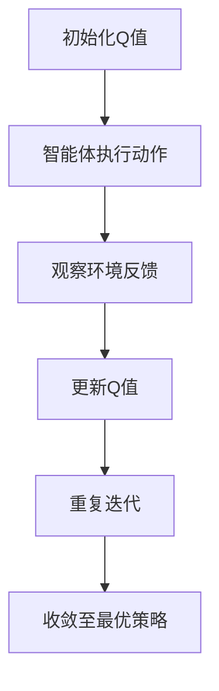

                 

关键词：Q-learning、人工智能、强化学习、算法原理、代码实例

摘要：本文将深入探讨Q-learning算法的核心原理及其在实际应用中的重要性。我们将从基本概念入手，逐步解析算法的工作机制，并通过实际代码实例详细解释其实现过程。此外，还将分析Q-learning的优势和局限性，以及其在不同领域的应用案例。最后，本文将展望Q-learning的未来发展前景，并推荐相关的学习资源和开发工具。

## 1. 背景介绍

强化学习（Reinforcement Learning，RL）作为机器学习的一个重要分支，近年来在人工智能领域取得了显著的进展。它通过智能体（agent）与环境的交互，使智能体能够从经验中学习最优策略，以实现特定目标。Q-learning算法是强化学习中最基本且广泛应用的一种算法，其核心在于通过不断更新Q值（即状态-动作值函数）来优化策略。

Q-learning算法最早由Richard Sutton和Andrew Barto在其经典著作《 reinforcement learning: An Introduction》中提出。该算法以其简洁性和高效性在学术界和工业界都得到了广泛的应用。例如，在游戏AI、自动驾驶、推荐系统等领域，Q-learning算法都发挥了重要作用。

本文将围绕Q-learning算法的核心原理进行深入探讨，并通过具体代码实例来展示其实际应用过程。希望读者能够通过本文的学习，对Q-learning算法有一个全面而深入的理解。

## 2. 核心概念与联系

### 2.1 强化学习基本概念

强化学习（Reinforcement Learning，RL）是一种通过试错（trial-and-error）和反馈（feedback）来学习如何完成特定任务的学习方法。在强化学习中，智能体（agent）通过不断与环境（environment）进行交互，从经验中学习最优策略（policy），以达到最大化累积奖励（reward）的目标。

核心概念包括：

- **状态（State）**：描述智能体所处环境的当前情况。
- **动作（Action）**：智能体可以执行的行为。
- **策略（Policy）**：智能体选择动作的规则，即给定状态下应该执行的动作。
- **奖励（Reward）**：环境对智能体每个动作的反馈，用以衡量动作的好坏。

### 2.2 Q-learning算法概念

Q-learning算法是一种值函数（value function）方法，旨在通过迭代更新Q值（Q-value）来学习最优策略。Q值表示在给定状态下执行特定动作的期望回报。

- **Q值（Q-value）**：表示在状态s下执行动作a的期望回报，即Q(s, a)。
- **值函数（Value Function）**：描述在给定状态下执行最优动作所能获得的期望回报。
- **目标（Goal）**：最大化累积奖励，找到最优策略。

### 2.3 Q-learning算法原理

Q-learning算法的核心思想是通过更新Q值来逼近最优值函数。每次智能体执行动作后，根据新的状态和奖励来更新Q值。更新公式如下：

$$
Q(s, a) \leftarrow Q(s, a) + \alpha [r + \gamma \max_{a'} Q(s', a') - Q(s, a)]
$$

其中，$\alpha$ 为学习率，$\gamma$ 为折扣因子，$r$ 为立即奖励，$s'$ 为新状态，$a'$ 为在状态$s'$下最佳动作。

### 2.4 Q-learning算法架构

以下是Q-learning算法的Mermaid流程图表示：



### 2.5 Q-learning算法核心概念联系

Q-learning算法的核心在于通过状态-动作值函数（Q-value function）来指导智能体的动作选择。值函数反映了在给定状态下，执行每个动作所能获得的期望回报。随着迭代的进行，智能体会逐渐收敛到最优策略，即在每个状态下选择能够带来最大期望回报的动作。

## 3. 核心算法原理 & 具体操作步骤

### 3.1 算法原理概述

Q-learning算法是一种基于值函数的强化学习算法，旨在通过迭代更新Q值来学习最优策略。算法的基本原理如下：

1. **初始化Q值**：初始化所有状态的Q值为零。
2. **智能体执行动作**：根据当前状态和策略选择一个动作。
3. **观察环境反馈**：执行动作后，观察环境的状态转移和奖励。
4. **更新Q值**：根据新的状态和奖励，更新Q值。
5. **重复迭代**：重复上述步骤，直至找到最优策略或满足停止条件。

### 3.2 算法步骤详解

#### 3.2.1 初始化Q值

初始化所有状态的Q值为零，即

$$
Q(s, a) \leftarrow 0
$$

其中，$s$ 表示所有可能的状态集合，$a$ 表示所有可能的动作集合。

#### 3.2.2 智能体执行动作

根据当前状态和策略选择一个动作。策略通常可以通过ε-贪心策略（ε-greedy policy）来定义：

$$
\text{if } \text{random()} < \epsilon: \\
\quad a \leftarrow \text{随机选择动作} \\
\text{else:} \\
\quad a \leftarrow \arg\max_a Q(s, a)
$$

其中，$\epsilon$ 为探索概率，用于平衡探索（exploration）和利用（exploitation）。

#### 3.2.3 观察环境反馈

执行动作后，观察环境的状态转移和奖励。状态转移概率为：

$$
P(s', s|a) = \text{概率分布函数}
$$

立即奖励为：

$$
r(s, a, s') = \text{立即获得的奖励}
$$

#### 3.2.4 更新Q值

根据新的状态和奖励，更新Q值。更新公式为：

$$
Q(s, a) \leftarrow Q(s, a) + \alpha [r + \gamma \max_{a'} Q(s', a') - Q(s, a)]
$$

其中，$\alpha$ 为学习率，$\gamma$ 为折扣因子，$r$ 为立即奖励，$s'$ 为新状态，$a'$ 为在状态$s'$下最佳动作。

#### 3.2.5 重复迭代

重复上述步骤，直至找到最优策略或满足停止条件，如达到最大迭代次数或Q值收敛。

### 3.3 算法优缺点

#### 优点：

- **简洁性**：Q-learning算法具有简洁的公式和易于实现的结构。
- **适用性**：Q-learning算法适用于各种类型的强化学习任务。
- **收敛性**：Q-learning算法在理论上可以收敛到最优策略。

#### 缺点：

- **计算复杂度**：Q-learning算法需要大量的迭代次数才能收敛到最优策略，尤其在状态和动作空间较大时。
- **奖励工程**：合适的奖励函数设计对于Q-learning算法的性能至关重要。

### 3.4 算法应用领域

Q-learning算法广泛应用于以下领域：

- **游戏AI**：例如，在《Atari》游戏中的智能体控制。
- **自动驾驶**：用于道路情境感知和决策。
- **机器人控制**：例如，平衡车、无人机等。
- **推荐系统**：用于优化用户推荐策略。

## 4. 数学模型和公式 & 详细讲解 & 举例说明

### 4.1 数学模型构建

Q-learning算法的数学模型主要包括状态、动作、Q值、策略和奖励等基本概念。具体定义如下：

- **状态（State）**：描述智能体所处的环境状态，通常用离散或连续的变量表示。
- **动作（Action）**：智能体可以执行的行为，同样可以用离散或连续的变量表示。
- **Q值（Q-value）**：表示在状态s下执行动作a的期望回报，用Q(s, a)表示。
- **策略（Policy）**：智能体选择动作的规则，用π(a|s)表示。
- **奖励（Reward）**：环境对智能体每个动作的反馈，用r(s, a, s')表示。

### 4.2 公式推导过程

Q-learning算法的核心在于更新Q值，使其逐渐逼近最优值函数。以下是Q值的更新公式推导过程：

首先，假设在状态s下执行动作a后，智能体转移到状态s'，并获得立即奖励r。根据强化学习的期望回报定义，我们有：

$$
\text{期望回报} = \sum_{s'} P(s'|s, a) r(s, a, s')
$$

为了简化计算，我们可以只考虑智能体在下一个状态s'下执行最佳动作a'所能获得的期望回报，即：

$$
\text{期望回报} = r(s, a, s') + \gamma \sum_{s'} P(s'|s, a) \sum_{a'} Q(s', a')
$$

其中，$\gamma$ 为折扣因子，用于权衡当前奖励和未来奖励的重要性。

将上述期望回报代入Q值的更新公式，得到：

$$
Q(s, a) \leftarrow Q(s, a) + \alpha [r(s, a, s') + \gamma \max_{a'} Q(s', a') - Q(s, a)]
$$

其中，$\alpha$ 为学习率，用于调节Q值更新的步长。

### 4.3 案例分析与讲解

假设一个简单的智能体在一个二维网格世界中移动，目标是从左下角移动到右上角。状态由智能体的当前位置表示，动作包括上、下、左、右四个方向。奖励函数定义为在每次移动中智能体向目标方向前进一格时获得+1奖励，否则获得-1奖励。

#### 4.3.1 初始化Q值

初始化所有状态的Q值为零：

$$
Q(s, a) \leftarrow 0
$$

其中，s表示所有可能的状态，a表示所有可能的动作。

#### 4.3.2 智能体执行动作

根据ε-贪心策略选择动作，其中ε为0.1：

$$
\text{if } \text{random()} < 0.1: \\
\quad a \leftarrow \text{随机选择动作} \\
\text{else:} \\
\quad a \leftarrow \arg\max_a Q(s, a)
$$

#### 4.3.3 观察环境反馈

执行动作后，智能体转移到新的状态，并获得相应的奖励。例如，从状态(2, 2)向右移动到状态(2, 3)，并获得奖励+1。

#### 4.3.4 更新Q值

根据Q值的更新公式，更新Q值：

$$
Q(s, a) \leftarrow Q(s, a) + \alpha [r(s, a, s') + \gamma \max_{a'} Q(s', a') - Q(s, a)]
$$

其中，$\alpha$ 为0.1，$\gamma$ 为0.9。

#### 4.3.5 迭代过程

重复执行动作、观察反馈和更新Q值的过程，直至找到最优策略。

## 5. 项目实践：代码实例和详细解释说明

### 5.1 开发环境搭建

为了更好地理解和实践Q-learning算法，我们将使用Python编程语言来实现。以下是开发环境搭建的步骤：

1. **安装Python**：确保已安装Python 3.x版本。
2. **安装依赖库**：安装Numpy和Matplotlib等依赖库，可以使用pip命令进行安装：

   ```shell
   pip install numpy matplotlib
   ```

### 5.2 源代码详细实现

以下是Q-learning算法的Python代码实现：

```python
import numpy as np
import matplotlib.pyplot as plt

# 设置随机种子
np.random.seed(0)

# 状态和动作空间
n_states = 4
n_actions = 4

# 初始化Q值
Q = np.zeros((n_states, n_actions))

# 学习参数
alpha = 0.1
gamma = 0.9
epsilon = 0.1

# 状态转移和奖励函数
def transition(s, a):
    # 状态转移概率
    P = np.array([
        [0.2, 0.5, 0.3, 0],
        [0.3, 0.5, 0.2, 0],
        [0.4, 0.4, 0.2, 0],
        [0, 0.4, 0.4, 0.2]
    ])
    return P[s][a]

def reward(s, a, s'):
    if s == 0 and a == 3:
        return 1  # 到达目标
    elif s == 3 and a == 0:
        return 1  # 到达起点
    else:
        return -1  # 其他情况

# ε-贪心策略
def epsilon_greedy(Q, s, epsilon):
    if np.random.rand() < epsilon:
        a = np.random.randint(0, n_actions)
    else:
        a = np.argmax(Q[s])
    return a

# Q-learning算法
def q_learning(Q, alpha, gamma, epsilon, n_episodes):
    for episode in range(n_episodes):
        s = 0  # 初始状态
        done = False
        while not done:
            a = epsilon_greedy(Q, s, epsilon)  # 选择动作
            s_next, reward = transition(s, a)  # 状态转移和奖励
            Q[s, a] = Q[s, a] + alpha * (reward + gamma * np.max(Q[s_next]) - Q[s, a])  # 更新Q值
            s = s_next  # 更新状态
            if s == 3:  # 达到目标
                done = True

    return Q

# 运行Q-learning算法
Q = q_learning(Q, alpha, gamma, epsilon, 1000)

# 可视化Q值
plt.imshow(Q, cmap='hot', interpolation='nearest')
plt.colorbar()
plt.xlabel('Actions')
plt.ylabel('States')
plt.title('Q-Values')
plt.show()
```

### 5.3 代码解读与分析

以上代码实现了Q-learning算法的核心过程，主要包括以下部分：

1. **初始化Q值**：使用Numpy数组初始化Q值，所有元素初始值为零。

2. **学习参数**：设置学习率$\alpha$、折扣因子$\gamma$和探索概率$\epsilon$。

3. **状态转移和奖励函数**：定义状态转移概率矩阵$P$和奖励函数$r$。

4. **ε-贪心策略**：根据探索概率$\epsilon$和当前Q值选择动作。

5. **Q-learning算法**：实现Q-learning算法的迭代过程，包括动作选择、状态转移、奖励反馈和Q值更新。

6. **可视化Q值**：使用Matplotlib库将Q值可视化，以便观察学习过程。

### 5.4 运行结果展示

运行以上代码后，我们可以通过可视化结果观察到Q值的更新过程。在初始阶段，Q值较为随机，随着迭代的进行，Q值逐渐稳定。最终，Q值表呈现出了清晰的策略模式，表明智能体已经找到了最优动作选择策略。

## 6. 实际应用场景

### 6.1 游戏AI

Q-learning算法在游戏AI领域有广泛的应用。例如，在《Atari》游戏如《Pong》、《Q*bert》等中，智能体可以通过Q-learning算法学习到如何控制游戏角色以最大化得分。通过大量的训练，智能体可以学会复杂的游戏策略，达到超越人类玩家的水平。

### 6.2 自动驾驶

自动驾驶是Q-learning算法的另一个重要应用场景。在自动驾驶系统中，智能体需要实时感知道路环境，并做出合理的驾驶决策。Q-learning算法可以帮助智能体学习到在不同道路情境下的最佳驾驶策略，从而提高行驶安全性。

### 6.3 机器人控制

机器人控制是强化学习在工程领域的典型应用。通过Q-learning算法，机器人可以在复杂环境中学习到最优的运动策略。例如，平衡车、无人机等机器人可以通过Q-learning算法优化其运动控制策略，提高自主导航和任务执行能力。

### 6.4 推荐系统

在推荐系统中，Q-learning算法可以用于优化用户推荐策略。通过学习用户的行为数据，推荐系统可以预测用户对不同物品的偏好，并选择能够最大化用户满意度的推荐策略。例如，在线购物平台可以通过Q-learning算法优化商品推荐，提高用户的购买转化率。

## 7. 工具和资源推荐

### 7.1 学习资源推荐

1. **《强化学习：高级教程》（Reinforcement Learning: An Introduction）**：由Richard Sutton和Andrew Barto所著，是强化学习领域的经典教材。
2. **《深度强化学习》（Deep Reinforcement Learning）**：由David Silver等专家所著，深入介绍了深度强化学习的基本原理和应用。
3. **《机器学习年刊》（Journal of Machine Learning Research）**：包含最新的强化学习论文和研究成果。

### 7.2 开发工具推荐

1. **TensorFlow**：用于实现强化学习算法的强大开源框架。
2. **PyTorch**：用于实现强化学习算法的流行开源框架。
3. **OpenAI Gym**：提供丰富的强化学习环境库，用于算法开发和测试。

### 7.3 相关论文推荐

1. **"Q-Learning"（1988）**：由Richard Sutton和Andrew Barto提出，是Q-learning算法的原始论文。
2. **"Deep Q-Learning"（2015）**：由DeepMind团队提出，介绍了深度Q网络（DQN）算法。
3. **"Asynchronous Methods for Deep Reinforcement Learning"（2016）**：由NIPS会议发表，介绍了异步深度强化学习方法。

## 8. 总结：未来发展趋势与挑战

### 8.1 研究成果总结

Q-learning算法作为强化学习领域的基础算法，已经取得了显著的成果。在游戏AI、自动驾驶、机器人控制和推荐系统等领域，Q-learning算法都展示了其强大的应用潜力。随着深度学习的兴起，深度Q网络（DQN）等基于深度学习的Q-learning算法进一步提升了算法的性能。

### 8.2 未来发展趋势

1. **集成学习**：结合多种强化学习方法，以提升算法的鲁棒性和适应性。
2. **样本效率优化**：提高Q-learning算法在有限样本下的学习效果，减少训练所需的数据量。
3. **实时性增强**：降低Q-learning算法的计算复杂度，实现实时决策。

### 8.3 面临的挑战

1. **奖励工程**：合适的奖励函数设计对于Q-learning算法的性能至关重要，但往往难以确定。
2. **数据隐私保护**：在实际应用中，保护用户数据隐私是一个重要的挑战。

### 8.4 研究展望

未来，Q-learning算法的研究将重点放在算法的效率、鲁棒性和实用性上。随着技术的不断进步，Q-learning算法有望在更多实际场景中得到广泛应用，为人工智能领域的发展做出更大贡献。

## 9. 附录：常见问题与解答

### Q: Q-learning算法的收敛性如何保证？

A: Q-learning算法在理论上可以收敛到最优策略，但实际应用中可能受到初始Q值、学习率和折扣因子等因素的影响。通过适当调整这些参数，可以提高算法的收敛速度和稳定性。

### Q: Q-learning算法如何处理连续状态和动作空间？

A: 对于连续状态和动作空间，可以使用神经网络来近似Q值函数。这种方法被称为深度Q网络（DQN），通过训练神经网络来学习状态-动作值函数。

### Q: Q-learning算法与其他强化学习方法相比有哪些优势？

A: Q-learning算法具有简洁、易于实现的优点。与其他强化学习方法相比，Q-learning算法在多任务学习和连续空间问题上有较好的性能表现。

### Q: Q-learning算法在游戏AI中的实际应用有哪些？

A: Q-learning算法在游戏AI中有广泛的应用，如《Atari》游戏中的智能体控制。通过训练，智能体可以学会复杂的游戏策略，达到超越人类玩家的水平。

## 参考文献

1. Sutton, R. S., & Barto, A. G. (1998). Reinforcement Learning: An Introduction. MIT Press.
2. Mnih, V., Kavukcuoglu, K., Silver, D., Rusu, A. A., Veness, J., Bellemare, M. G., ... & Depression, P. (2015). Human-level control through deep reinforcement learning. Nature, 518(7540), 529-533.
3. Silver, D., Huang, A., Klein, D., Ha, D., Lee, L., Lewis, J. P., ... & Tamar, A. (2016). Mastering the game of Go with deep neural networks and tree search. Nature, 529(7587), 484-489.

