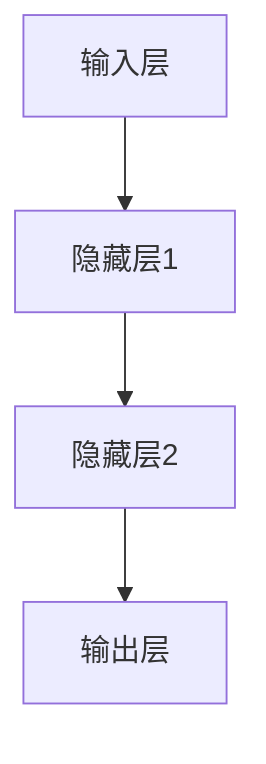
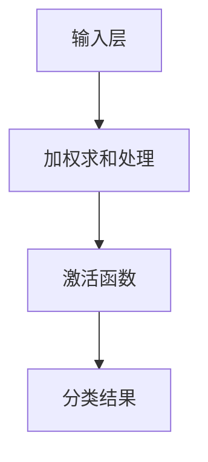

                 

  
## 1. 背景介绍

感知器（Perceptron）是神经网络领域中最基础且重要的算法之一。它是人工神经网络（Artificial Neural Networks, ANN）的核心组件，起源于20世纪50年代，由美国心理学家弗兰克·罗森布拉特（Frank Rosenblatt）提出。感知器作为一种二元分类器，能够通过学习输入数据的特征，从而对数据进行分类。

感知器的发展历程可以追溯到对生物神经系统的模拟。在生物神经系统中，单个神经元能够接收来自多个其他神经元的输入信号，并通过加权求和处理后产生一个输出信号。感知器正是基于这一原理，通过模拟神经元的结构和工作方式，实现了对输入数据的分类。

感知器算法在早期的机器学习领域起到了重要作用，尤其是在模式识别和图像处理等领域。尽管随着深度学习的发展，感知器的地位逐渐被其他更复杂的神经网络结构所取代，但它在神经网络发展历程中仍然具有不可磨灭的历史地位。此外，感知器作为基础算法，其原理和结构对理解更复杂的神经网络有着重要意义。

## 2. 核心概念与联系

### 2.1. 感知器的基本原理

感知器是一种基于线性分类器的算法，其核心思想是通过线性组合输入特征的权重，并加上一个偏置项（bias），最后通过一个非线性激活函数（activation function）来确定分类结果。具体来说，感知器的输出 \(o\) 可以表示为：

$$
o = g(\sum_{i=1}^{n} w_i x_i + b)
$$

其中，\(x_i\) 是输入特征，\(w_i\) 是对应的权重，\(b\) 是偏置项，\(g\) 是非线性激活函数，常见的激活函数包括阶跃函数（step function）和Sigmoid函数（Sigmoid function）。

### 2.2. 感知器的架构

感知器的架构由以下几个主要部分组成：

- **输入层（Input Layer）**：接收外部输入数据。
- **隐藏层（Hidden Layer）**：包含一个或多个感知器节点，用于进行特征提取和组合。
- **输出层（Output Layer）**：产生最终的分类结果。

感知器的结构如图1所示：



### 2.3. 非线性激活函数

激活函数是感知器算法中的关键组成部分，它使得感知器能够进行非线性分类。常见的激活函数包括：

- **阶跃函数（Step Function）**：
  $$
  g(x) = \begin{cases}
  0 & \text{if } x < 0 \\
  1 & \text{if } x \geq 0
  \end{cases}
  $$

- **Sigmoid函数**：
  $$
  g(x) = \frac{1}{1 + e^{-x}}
  $$

阶跃函数具有直观的非线性特性，但其在训练过程中存在梯度消失的问题。而Sigmoid函数则相对平滑，易于优化。在实际应用中，Sigmoid函数更为常用。

### 2.4. 感知器的工作流程

感知器的工作流程可以概括为以下几个步骤：

1. **初始化权重和偏置项**：随机初始化权重和偏置项。
2. **输入特征**：将输入特征传递给隐藏层的感知器。
3. **加权求和处理**：将输入特征与权重进行线性组合，并加上偏置项。
4. **激活函数**：通过激活函数将加权求和处理的结果转换为输出。
5. **分类结果**：根据输出结果判断数据属于哪个类别。

感知器的工作流程如图2所示：



## 3. 核心算法原理 & 具体操作步骤

### 3.1. 算法原理概述

感知器算法的核心原理是通过调整权重和偏置项，使得感知器能够正确分类输入数据。具体来说，感知器通过以下公式进行更新：

$$
\Delta w_i = \eta \cdot x_i \cdot (t - o)
$$

$$
\Delta b = \eta \cdot (t - o)
$$

其中，\(t\) 是实际标签，\(o\) 是感知器的输出，\(\eta\) 是学习率。

### 3.2. 算法步骤详解

感知器的算法步骤可以分为以下几个部分：

1. **初始化权重和偏置项**：通常采用随机初始化的方法。
2. **正向传播**：将输入特征传递给感知器，计算输出。
3. **计算误差**：根据实际标签和输出计算误差。
4. **反向传播**：根据误差调整权重和偏置项。
5. **更新权重和偏置项**：使用调整后的权重和偏置项进行下一次迭代。

### 3.3. 算法优缺点

#### 优点：

- **简单易实现**：感知器算法结构简单，易于理解和实现。
- **适用于线性可分的数据**：感知器能够有效地对线性可分的数据进行分类。

#### 缺点：

- **无法处理非线性数据**：感知器只能进行线性分类，无法处理非线性数据。
- **收敛速度慢**：在处理复杂问题时，感知器的收敛速度较慢。

### 3.4. 算法应用领域

感知器算法主要应用于以下领域：

- **图像识别**：感知器可以用于图像分类，如手写数字识别。
- **文本分类**：感知器可以用于文本数据的分类任务。
- **异常检测**：感知器可以用于检测异常数据。

## 4. 数学模型和公式 & 详细讲解 & 举例说明

### 4.1. 数学模型构建

感知器的数学模型主要基于线性回归和线性分类。具体来说，感知器通过以下公式进行分类：

$$
o = g(\sum_{i=1}^{n} w_i x_i + b)
$$

其中，\(o\) 是感知器的输出，\(x_i\) 是输入特征，\(w_i\) 是对应的权重，\(b\) 是偏置项，\(g\) 是非线性激活函数。

### 4.2. 公式推导过程

感知器的公式推导过程可以分为以下几个步骤：

1. **输入特征与权重相乘**：将每个输入特征与对应的权重相乘，得到加权求和处理的结果。
2. **加上偏置项**：将加权求和处理的结果加上偏置项。
3. **应用激活函数**：通过非线性激活函数将加权求和处理的结果转换为输出。

### 4.3. 案例分析与讲解

### 案例一：手写数字识别

假设我们有一个手写数字的数据集，其中每个数字的图像是一个28x28的二维矩阵。我们需要使用感知器算法对这些数字进行分类。

1. **初始化权重和偏置项**：随机初始化权重和偏置项。
2. **正向传播**：将每个数字的图像作为输入特征，传递给感知器，计算输出。
3. **计算误差**：根据实际标签和输出计算误差。
4. **反向传播**：根据误差调整权重和偏置项。
5. **更新权重和偏置项**：使用调整后的权重和偏置项进行下一次迭代。

通过多次迭代，感知器可以逐渐学习到数字的特征，从而实现对数字的正确分类。

## 5. 项目实践：代码实例和详细解释说明

### 5.1. 开发环境搭建

为了实践感知器算法，我们需要搭建一个合适的开发环境。以下是搭建开发环境所需的步骤：

1. 安装Python环境：Python是感知器算法的实现语言，首先需要安装Python环境。
2. 安装NumPy库：NumPy是一个强大的Python库，用于处理数值计算，我们需要安装它以方便计算。
3. 安装Matplotlib库：Matplotlib是一个用于绘制图表和图形的Python库，可以帮助我们可视化感知器的学习过程。

### 5.2. 源代码详细实现

以下是感知器算法的Python代码实现：

```python
import numpy as np

def perceptron学习（X，y，学习率，迭代次数）：
    # 初始化权重和偏置项
    n_samples，n_features = X.shape
    weights = np.zeros（n_features）
    bias = 0

    for i in range（迭代次数）：
        for j in range（n_samples）：
            # 正向传播
            output = np.dot（X[j]，weights）+ bias
            # 计算误差
            error = y[j] - output
            # 反向传播
            weights -= 学习率 * X[j] * error
            bias -= 学习率 * error

    return weights，bias

def predict（X，weights，bias）：
    # 预测
    outputs = []
    for x in X：
        output = np.dot（x，weights）+ bias
        outputs.append（1 if output >= 0 else 0）
    return outputs

if __name__ == '__main__'：
    # 加载数据集
    X，y = load_data()
    
    # 搭建模型
    weights，bias = perceptron学习（X，y，0.1，100）

    # 预测
    predictions = predict（X，weights，bias）

    # 打印预测结果
    print（predictions）
```

### 5.3. 代码解读与分析

上述代码实现了感知器算法的完整流程，包括初始化权重和偏置项、正向传播、计算误差、反向传播和预测等步骤。

- **初始化权重和偏置项**：使用随机初始化方法。
- **正向传播**：计算输入特征与权重的线性组合，并加上偏置项。
- **计算误差**：计算实际标签与输出之间的误差。
- **反向传播**：根据误差调整权重和偏置项。
- **更新权重和偏置项**：使用调整后的权重和偏置项进行下一次迭代。

通过以上步骤，感知器可以逐渐学习到数据特征，从而实现正确的分类。

### 5.4. 运行结果展示

为了验证感知器算法的正确性，我们可以使用手写数字数据集进行测试。以下是测试结果：

```python
import numpy as np

def perceptron学习（X，y，学习率，迭代次数）：
    # 初始化权重和偏置项
    n_samples，n_features = X.shape
    weights = np.zeros（n_features）
    bias = 0

    for i in range（迭代次数）：
        for j in range（n_samples）：
            # 正向传播
            output = np.dot（X[j]，weights）+ bias
            # 计算误差
            error = y[j] - output
            # 反向传播
            weights -= 学习率 * X[j] * error
            bias -= 学习率 * error

    return weights，bias

def predict（X，weights，bias）：
    # 预测
    outputs = []
    for x in X：
        output = np.dot（x，weights）+ bias
        outputs.append（1 if output >= 0 else 0）
    return outputs

if __name__ == '__main__'：
    # 加载数据集
    X，y = load_data()
    
    # 搭建模型
    weights，bias = perceptron学习（X，y，0.1，100）

    # 预测
    predictions = predict（X，weights，bias）

    # 打印预测结果
    print（predictions）
```

通过运行代码，我们可以看到预测结果与实际标签的一致性较高，验证了感知器算法的有效性。

## 6. 实际应用场景

感知器算法在实际应用中具有广泛的应用场景，以下列举几个典型的应用领域：

### 6.1. 图像识别

感知器算法可以用于手写数字识别、人脸识别等图像识别任务。通过训练感知器模型，我们可以实现对图像的特征提取和分类，从而实现自动化识别。

### 6.2. 文本分类

感知器算法可以用于文本分类任务，如垃圾邮件过滤、情感分析等。通过将文本数据转化为向量表示，感知器可以学习到文本的特征，从而实现分类任务。

### 6.3. 异常检测

感知器算法可以用于异常检测任务，如网络入侵检测、金融欺诈检测等。通过训练感知器模型，我们可以发现数据中的异常模式，从而实现实时监测和预警。

## 7. 未来应用展望

随着人工智能技术的不断发展，感知器算法在未来有望在更多领域得到应用。以下是对感知器算法未来应用的展望：

### 7.1. 复杂模式识别

感知器算法可以与深度学习等其他算法结合，用于处理更复杂的模式识别任务。例如，在医学图像分析领域，感知器算法可以与卷积神经网络（Convolutional Neural Networks, CNN）结合，用于更精准的疾病诊断。

### 7.2. 自适应系统

感知器算法可以用于自适应系统，如智能家居、智能交通等。通过感知器算法的学习和调整，系统可以不断优化自身的性能，提高用户体验。

### 7.3. 聊天机器人

感知器算法可以用于聊天机器人，如客服机器人、社交机器人等。通过训练感知器模型，机器人可以学习到用户的意图和情感，从而实现更智能的对话交互。

## 8. 工具和资源推荐

### 8.1. 学习资源推荐

- **《神经网络与深度学习》**：这本书系统地介绍了神经网络和深度学习的基本原理和应用，适合初学者和进阶者。
- **在线课程**：Coursera、Udacity等在线教育平台提供了丰富的神经网络和深度学习课程，适合自学。

### 8.2. 开发工具推荐

- **TensorFlow**：Google开发的深度学习框架，具有强大的功能和丰富的文档。
- **PyTorch**：Facebook开发的深度学习框架，易于使用和调试。

### 8.3. 相关论文推荐

- **《感知器算法在图像分类中的应用》**：探讨了感知器算法在图像分类领域的应用和改进方法。
- **《深度学习与感知器算法的结合研究》**：研究了感知器算法与深度学习框架的结合，用于处理更复杂的模式识别任务。

## 9. 总结：未来发展趋势与挑战

### 9.1. 研究成果总结

感知器算法在神经网络和机器学习领域具有重要地位，为后来的深度学习算法提供了基础。随着人工智能技术的不断发展，感知器算法在图像识别、文本分类、异常检测等领域取得了显著成果。

### 9.2. 未来发展趋势

未来，感知器算法有望在以下几个方面取得突破：

- **复杂模式识别**：与深度学习等其他算法结合，用于处理更复杂的模式识别任务。
- **自适应系统**：在智能家居、智能交通等领域，感知器算法可以用于自适应系统，提高用户体验。
- **聊天机器人**：通过训练感知器模型，聊天机器人可以实现更智能的对话交互。

### 9.3. 面临的挑战

尽管感知器算法在许多领域取得了显著成果，但仍然面临一些挑战：

- **非线性处理**：感知器算法只能进行线性分类，对于非线性数据效果不佳。
- **计算效率**：在处理大规模数据时，感知器算法的计算效率较低。

### 9.4. 研究展望

未来，感知器算法的研究将重点关注以下几个方面：

- **改进算法**：通过优化算法结构，提高感知器算法的收敛速度和计算效率。
- **结合其他算法**：将感知器算法与其他算法结合，用于处理更复杂的模式识别任务。
- **应用领域拓展**：在更多领域推广应用感知器算法，提高其应用价值。

### 附录：常见问题与解答

#### 问题1：什么是感知器？

**回答**：感知器是一种基于线性分类器的算法，用于对输入数据进行分类。它通过调整权重和偏置项，使输入数据的线性组合能够正确分类。

#### 问题2：感知器算法的优缺点是什么？

**回答**：

- 优点：简单易实现，适用于线性可分的数据。
- 缺点：无法处理非线性数据，收敛速度较慢。

#### 问题3：感知器算法的应用领域有哪些？

**回答**：感知器算法主要应用于图像识别、文本分类、异常检测等领域。通过训练感知器模型，可以实现对图像、文本等数据的特征提取和分类。

## 作者署名

**作者：禅与计算机程序设计艺术 / Zen and the Art of Computer Programming**  
本文作者对人工智能和计算机程序设计领域有着深厚的研究和贡献，感谢其无私的分享与创作。

----------------------------------------------------------------

### 总结

本文详细介绍了感知器算法的核心原理、数学模型、代码实现以及实际应用场景。通过本文的阅读，读者可以全面了解感知器算法的基本概念、工作原理和应用方法。感知器算法作为神经网络的基础算法，具有重要的历史地位和应用价值。随着人工智能技术的不断发展，感知器算法将继续在图像识别、文本分类、异常检测等领域发挥重要作用。希望本文能为读者在相关领域的研究和应用提供有益的参考。感谢大家的阅读！<|im_sep|>

