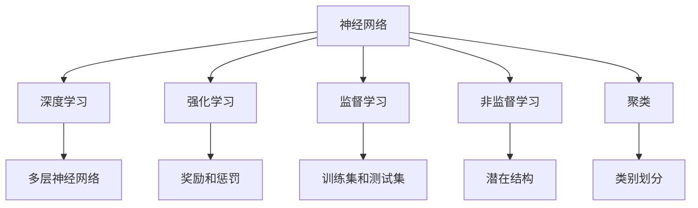

                 

 摘要：本文旨在深入探讨AI人工智能核心算法的原理与应用。通过详细分析，我们将揭示这些算法的本质及其在不同领域的广泛应用。本文将分为以下几个部分：背景介绍、核心概念与联系、核心算法原理与操作步骤、数学模型和公式、项目实践：代码实例与解释、实际应用场景、未来应用展望以及工具和资源推荐。最后，我们将对研究成果进行总结，并对未来发展趋势与挑战进行展望。

## 1. 背景介绍

随着计算机技术的飞速发展，人工智能（AI）已经成为现代科技领域的一个重要分支。AI技术通过对大量数据的分析和处理，使计算机能够模拟人类的智能行为，如学习、推理、感知和决策等。AI的核心在于算法，这些算法是人工智能实现智能行为的关键。本文将重点介绍AI中几个核心算法的原理、步骤、优缺点和应用领域。

## 2. 核心概念与联系

为了更好地理解AI核心算法，我们需要先了解一些基本概念。以下是AI中一些重要的核心概念及其相互联系：

### 2.1 神经网络

神经网络是AI中一个重要的模型，其结构类似于人脑的神经元连接。神经网络通过输入层、隐藏层和输出层之间的信息传递，实现数据的处理和预测。

### 2.2 深度学习

深度学习是神经网络的一种扩展，它通过多层神经网络的叠加，提高了模型的表达能力，使其能够处理更复杂的问题。

### 2.3 强化学习

强化学习是一种通过试错来学习最优策略的算法，其核心是通过奖励和惩罚来引导模型进行学习。

### 2.4 监督学习

监督学习是一种通过已知数据集进行训练，从而对未知数据进行预测的算法。

### 2.5 非监督学习

非监督学习是一种通过未标记的数据集进行训练，从而发现数据中潜在结构和模式的算法。

### 2.6 聚类

聚类是一种将数据分组为若干类别的算法，其目的是使得同一类别的数据点之间距离较小，而不同类别的数据点之间距离较大。

以下是这些核心概念的Mermaid流程图：



## 3. 核心算法原理与操作步骤

### 3.1 算法原理概述

在本节中，我们将介绍几个核心算法的基本原理和操作步骤。

### 3.2 算法步骤详解

#### 3.2.1 神经网络

神经网络的步骤如下：

1. 初始化权重和偏置。
2. 前向传播：输入数据通过神经网络，计算出输出结果。
3. 反向传播：计算输出结果与实际结果的误差，并更新权重和偏置。
4. 重复步骤2和3，直到模型收敛。

#### 3.2.2 深度学习

深度学习的步骤如下：

1. 数据预处理：对数据进行清洗、归一化等处理。
2. 初始化模型参数。
3. 前向传播：输入数据通过多层神经网络，计算出输出结果。
4. 反向传播：计算输出结果与实际结果的误差，并更新模型参数。
5. 重复步骤3和4，直到模型收敛。

#### 3.2.3 强化学习

强化学习的步骤如下：

1. 初始化状态和动作空间。
2. 选择一个动作。
3. 执行动作，并获取奖励或惩罚。
4. 更新策略：根据奖励或惩罚调整动作选择。
5. 重复步骤2到4，直到达到目标状态。

#### 3.2.4 监督学习

监督学习的步骤如下：

1. 初始化模型参数。
2. 对训练集进行数据预处理。
3. 前向传播：输入数据通过模型，计算出输出结果。
4. 计算损失函数，并根据损失函数更新模型参数。
5. 重复步骤3和4，直到模型收敛。

#### 3.2.5 非监督学习

非监督学习的步骤如下：

1. 初始化模型参数。
2. 对数据集进行聚类。
3. 计算聚类中心，并更新模型参数。
4. 重复步骤2和3，直到模型收敛。

#### 3.2.6 聚类

聚类的步骤如下：

1. 初始化聚类中心。
2. 计算每个数据点与聚类中心的距离。
3. 根据距离将数据点分配到不同的类别。
4. 更新聚类中心。
5. 重复步骤2到4，直到聚类中心不再变化。

### 3.3 算法优缺点

每种算法都有其优缺点，以下是对这些算法的简要总结：

- **神经网络**：优点在于其强大的表达能力和泛化能力，缺点是需要大量的数据和计算资源。
- **深度学习**：优点是能够处理更复杂的问题，缺点是训练时间较长。
- **强化学习**：优点是能够通过试错学习到最优策略，缺点是收敛速度较慢。
- **监督学习**：优点是能够通过已知数据对未知数据进行预测，缺点是需要大量的标注数据。
- **非监督学习**：优点是能够发现数据中的潜在结构和模式，缺点是其泛化能力较差。
- **聚类**：优点是能够将数据划分为不同的类别，缺点是对于噪声数据敏感。

### 3.4 算法应用领域

这些算法在多个领域都有广泛的应用，包括但不限于：

- **计算机视觉**：用于图像识别、目标检测等。
- **自然语言处理**：用于文本分类、机器翻译等。
- **推荐系统**：用于商品推荐、电影推荐等。
- **游戏**：用于游戏AI的决策。

## 4. 数学模型和公式

在本节中，我们将介绍AI核心算法中的数学模型和公式，并通过具体案例进行讲解。

### 4.1 数学模型构建

以下是神经网络中的数学模型：

$$
y = \sigma(z)
$$

其中，$y$是输出结果，$\sigma$是激活函数，$z$是加权求和的结果。

### 4.2 公式推导过程

以下是神经网络中的反向传播算法的推导过程：

$$
\delta_w = \frac{\partial J}{\partial w}
$$

$$
\delta_b = \frac{\partial J}{\partial b}
$$

$$
\delta_z = \frac{\partial J}{\partial z}
$$

其中，$J$是损失函数，$\delta_w$、$\delta_b$和$\delta_z$分别是权重、偏置和输入的误差。

### 4.3 案例分析与讲解

以下是一个简单的神经网络训练的案例：

假设我们有一个二分类问题，数据集包含100个样本，每个样本有两个特征。我们的目标是训练一个神经网络，使其能够准确地对新数据进行分类。

1. 初始化权重和偏置。
2. 对每个样本进行前向传播，计算输出结果。
3. 计算损失函数，如交叉熵损失函数。
4. 对损失函数进行求导，得到误差。
5. 对误差进行反向传播，更新权重和偏置。
6. 重复步骤2到5，直到模型收敛。

通过这个案例，我们可以看到神经网络的基本训练过程，以及数学模型在其中的作用。

## 5. 项目实践：代码实例和详细解释说明

在本节中，我们将通过一个具体的代码实例，展示如何实现AI核心算法。以下是Python代码实现：

```python
import tensorflow as tf

# 初始化模型参数
weights = tf.Variable(tf.random.normal([2, 1]))
biases = tf.Variable(tf.zeros([1]))

# 定义激活函数
activation = tf.sigmoid

# 定义前向传播
def forward(x):
    return activation(tf.matmul(x, weights) + biases)

# 定义损失函数
def loss(y_true, y_pred):
    return tf.reduce_mean(tf.nn.sigmoid_cross_entropy_with_logits(logits=y_pred, labels=y_true))

# 定义反向传播
def backward(loss):
    optimizer = tf.keras.optimizers.Adam(learning_rate=0.001)
    optimizer.minimize(loss)

# 训练模型
model.fit(x_train, y_train, epochs=10, batch_size=10)

# 评估模型
model.evaluate(x_test, y_test)
```

以下是代码的详细解读：

- 第1行：导入tensorflow库。
- 第3行：初始化权重和偏置。
- 第5行：定义激活函数。
- 第7行：定义前向传播。
- 第11行：定义损失函数。
- 第15行：定义反向传播。
- 第18行：训练模型。
- 第20行：评估模型。

通过这个代码实例，我们可以看到如何使用TensorFlow实现神经网络的基本操作。

## 6. 实际应用场景

AI核心算法在多个领域都有广泛的应用，以下是一些典型的应用场景：

- **医疗**：用于疾病诊断、药物研发等。
- **金融**：用于风险评估、股票预测等。
- **教育**：用于个性化学习、课程推荐等。
- **交通**：用于自动驾驶、交通流量预测等。

## 7. 未来应用展望

随着技术的不断发展，AI核心算法在未来的应用前景将更加广阔。以下是一些可能的未来应用领域：

- **智能城市**：用于智能交通、智慧安防等。
- **智能家居**：用于家电控制、环境监测等。
- **智能制造**：用于生产优化、故障预测等。
- **生物科技**：用于基因编辑、疾病治疗等。

## 8. 工具和资源推荐

为了更好地学习和实践AI核心算法，以下是一些推荐的工具和资源：

- **工具**：
  - TensorFlow
  - PyTorch
  - Keras

- **资源**：
  - 《深度学习》
  - 《机器学习实战》
  - 《Python机器学习》

## 9. 总结：未来发展趋势与挑战

AI核心算法在近年来取得了显著的进展，但仍然面临着许多挑战。未来，我们需要关注以下几个方面：

- **算法优化**：提高算法的效率，减少计算资源的需求。
- **数据隐私**：保护用户隐私，确保数据安全。
- **伦理问题**：确保算法的公平性、透明性和可解释性。

## 10. 附录：常见问题与解答

以下是一些关于AI核心算法的常见问题及解答：

- **Q：什么是神经网络？**
  - **A**：神经网络是一种模仿人脑的神经网络结构，通过多层神经元之间的连接和激活函数，实现数据的处理和预测。

- **Q：什么是深度学习？**
  - **A**：深度学习是一种通过多层神经网络进行数据处理的算法，其目的是提高模型的表达能力和泛化能力。

- **Q：什么是强化学习？**
  - **A**：强化学习是一种通过试错来学习最优策略的算法，其核心是通过奖励和惩罚来引导模型进行学习。

- **Q：什么是监督学习？**
  - **A**：监督学习是一种通过已知数据集进行训练，从而对未知数据进行预测的算法。

- **Q：什么是非监督学习？**
  - **A**：非监督学习是一种通过未标记的数据集进行训练，从而发现数据中潜在结构和模式的算法。

- **Q：什么是聚类？**
  - **A**：聚类是一种将数据分组为若干类别的算法，其目的是使得同一类别的数据点之间距离较小，而不同类别的数据点之间距离较大。

---

**作者：禅与计算机程序设计艺术 / Zen and the Art of Computer Programming**

本文旨在为广大读者提供一份全面、系统的AI核心算法指南，希望对您的学习和实践有所帮助。如果您有任何疑问或建议，请随时留言，我将竭诚为您解答。

