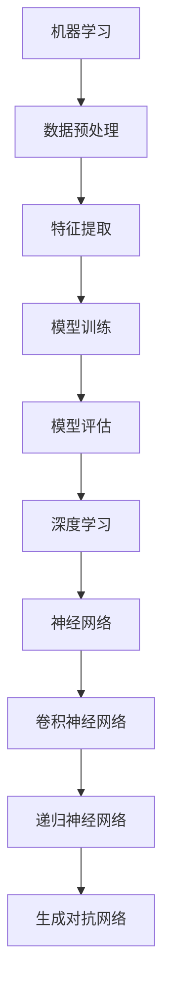

                 

关键词：人工智能、核心算法、机器学习、深度学习、代码实例

> 摘要：本文将深入探讨人工智能领域中的核心算法原理，并通过代码实例详细解释其实现方法和应用。我们将覆盖从基础机器学习算法到深度学习框架的各个方面，旨在为读者提供全面的技术理解和实践指导。

## 1. 背景介绍

人工智能（AI）作为计算机科学的前沿领域，已经取得了显著的发展。人工智能的核心在于构建能够模拟、延伸和扩展人类智能的计算机系统。这些系统通过学习数据、模式识别和自主决策来执行复杂的任务。

### 1.1 人工智能的发展历史

人工智能的概念最早可以追溯到20世纪50年代。当时，科学家们开始探索如何让计算机执行与人类相似的认知任务。从早期的规则推理系统到近年来的深度学习，人工智能的发展经历了多个阶段。

- **符号人工智能**：基于规则和逻辑推理，如专家系统。
- **知识表示与推理**：利用符号表示和逻辑推理来解决复杂问题。
- **机器学习**：通过数据驱动的方法，如神经网络，自动发现模式和规律。
- **深度学习**：利用多层神经网络进行高效的特征学习和模式识别。

### 1.2 人工智能的应用领域

人工智能在多个领域都取得了重要成果，包括：

- **图像识别与处理**：从医学影像分析到自动驾驶。
- **自然语言处理**：从机器翻译到智能客服。
- **智能决策支持系统**：从金融风险评估到供应链管理。
- **智能制造**：从自动化生产线到工业机器人。

## 2. 核心概念与联系

在深入研究人工智能的核心算法之前，我们需要理解一些基础概念，并展示它们之间的联系。以下是关键概念及其在AI系统中的关系：



### 2.1 机器学习

机器学习是人工智能的基础，它使计算机系统能够从数据中学习，并对未知数据进行预测或决策。

- **数据预处理**：清洗、转换和归一化数据，以便于模型训练。
- **特征提取**：从原始数据中提取有用的信息，作为模型的输入。
- **模型训练**：通过调整模型参数，使其能够对新的数据进行准确的预测。
- **模型评估**：评估模型的性能，包括准确性、召回率、F1分数等。

### 2.2 深度学习

深度学习是机器学习的一种重要分支，通过多层神经网络来学习复杂的函数。

- **神经网络**：由多个神经元组成，每个神经元负责处理一部分信息。
- **卷积神经网络（CNN）**：特别适用于图像识别任务，通过卷积层提取空间特征。
- **递归神经网络（RNN）**：特别适用于序列数据，如时间序列分析。
- **生成对抗网络（GAN）**：用于生成新的数据样本，如生成虚假图像。

## 3. 核心算法原理 & 具体操作步骤

### 3.1 算法原理概述

在这部分，我们将详细探讨几个核心的人工智能算法，包括线性回归、决策树、支持向量机和卷积神经网络。

#### 3.1.1 线性回归

线性回归是一种简单而强大的预测模型，用于建模两个变量之间的线性关系。

- **公式**：y = wx + b
- **参数**：w（权重），b（偏置）
- **训练方法**：最小二乘法

#### 3.1.2 决策树

决策树是一种树形结构，用于分类或回归任务。

- **构建过程**：通过选择最佳特征和阈值来划分数据。
- **分类方法**：信息增益、基尼不纯度

#### 3.1.3 支持向量机

支持向量机是一种用于分类的线性模型，通过最大化分类边界。

- **公式**：w·x + b = 0
- **优化目标**：最大化分类边界

#### 3.1.4 卷积神经网络

卷积神经网络是一种深度学习模型，特别适用于图像识别。

- **网络结构**：输入层、卷积层、池化层、全连接层、输出层
- **训练方法**：反向传播

### 3.2 算法步骤详解

#### 3.2.1 线性回归步骤

1. 数据预处理：清洗和归一化输入数据。
2. 计算特征矩阵X和目标向量y。
3. 初始化模型参数w和b。
4. 计算损失函数J(w, b)。
5. 使用梯度下降法更新参数w和b。

#### 3.2.2 决策树步骤

1. 计算每个特征的信息增益。
2. 选择具有最高信息增益的特征。
3. 根据选择的特征划分数据。
4. 递归构建决策树。

#### 3.2.3 支持向量机步骤

1. 计算每个数据点的特征向量。
2. 训练线性分类器。
3. 优化分类边界。
4. 计算支持向量。

#### 3.2.4 卷积神经网络步骤

1. 输入数据预处理。
2. 通过卷积层提取特征。
3. 通过池化层减小特征图的大小。
4. 通过全连接层进行分类。
5. 计算损失函数并更新参数。

### 3.3 算法优缺点

每种算法都有其优缺点，适用于不同的场景。

- **线性回归**：简单、易于实现，但适用于线性关系的任务。
- **决策树**：易于理解、解释，但可能产生过拟合。
- **支持向量机**：性能优秀，但计算复杂度高。
- **卷积神经网络**：适用于图像和语音任务，但参数数量庞大。

### 3.4 算法应用领域

这些算法在不同的应用领域有着广泛的应用：

- **线性回归**：金融预测、住房定价。
- **决策树**：医疗诊断、信用评分。
- **支持向量机**：文本分类、图像识别。
- **卷积神经网络**：图像识别、语音识别。

## 4. 数学模型和公式 & 详细讲解 & 举例说明

在深入探讨核心算法时，理解其背后的数学模型和公式至关重要。以下是几种常见算法的数学模型和公式：

### 4.1 线性回归

#### 数学模型：

\[ y = wx + b \]

#### 损失函数：

\[ J(w, b) = \frac{1}{2m} \sum_{i=1}^{m} (wx_i + b - y_i)^2 \]

#### 梯度下降：

\[ \frac{\partial J}{\partial w} = x_i(y_i - wx_i - b) \]
\[ \frac{\partial J}{\partial b} = y_i - wx_i - b \]

#### 例子：

假设我们有数据集 \( x = [1, 2, 3, 4, 5] \) 和 \( y = [2, 4, 5, 4, 5] \)，我们可以使用线性回归来拟合这些数据。

### 4.2 决策树

#### 信息增益：

\[ IG(D, A) = H(D) - \sum_{v \in V} \frac{|D_v|}{|D|} H(D_v) \]

#### 基尼不纯度：

\[ Gini(D) = 1 - \sum_{v \in V} \frac{|D_v|}{|D|} \]

#### 例子：

假设我们有数据集 \( D \) 和特征 \( A \)，我们可以计算每个特征的信息增益或基尼不纯度来选择最佳划分。

### 4.3 支持向量机

#### 公式：

\[ w \cdot x + b = 0 \]

#### 优化目标：

\[ \min_{w, b} \frac{1}{2} ||w||^2 + C \sum_{i=1}^{m} \max(0, y_i(w \cdot x_i + b)) \]

#### 例子：

假设我们有数据集 \( x = [x_1, x_2, ..., x_m] \) 和 \( y = [y_1, y_2, ..., y_m] \)，我们可以使用支持向量机来构建分类器。

## 5. 项目实践：代码实例和详细解释说明

在本节中，我们将通过具体的代码实例来展示如何实现上述算法。这里以Python为例，展示线性回归和决策树的应用。

### 5.1 开发环境搭建

确保Python环境已安装。可以使用以下命令安装所需的库：

```bash
pip install numpy matplotlib scikit-learn
```

### 5.2 源代码详细实现

#### 线性回归

```python
import numpy as np
import matplotlib.pyplot as plt
from sklearn.linear_model import LinearRegression

# 数据集
X = np.array([1, 2, 3, 4, 5]).reshape(-1, 1)
y = np.array([2, 4, 5, 4, 5])

# 初始化模型
model = LinearRegression()

# 训练模型
model.fit(X, y)

# 预测
y_pred = model.predict(X)

# 可视化
plt.scatter(X, y, color='blue')
plt.plot(X, y_pred, color='red')
plt.xlabel('X')
plt.ylabel('Y')
plt.show()
```

#### 决策树

```python
from sklearn.tree import DecisionTreeClassifier
import pandas as pd

# 数据集
data = pd.read_csv('data.csv')
X = data.drop('target', axis=1)
y = data['target']

# 初始化模型
model = DecisionTreeClassifier()

# 训练模型
model.fit(X, y)

# 可视化决策树
from sklearn.tree import plot_tree
plt.figure(figsize=(12, 8))
plot_tree(model, filled=True)
plt.show()
```

### 5.3 代码解读与分析

线性回归代码中，我们首先导入所需的库，然后加载数据集，并使用`LinearRegression`类初始化模型。接着，我们通过`fit`方法训练模型，并使用`predict`方法进行预测。最后，我们使用matplotlib库将真实值和预测值可视化。

决策树代码中，我们首先导入所需的库，并加载数据集。然后，我们使用`DecisionTreeClassifier`类初始化模型，并通过`fit`方法训练模型。最后，我们使用`plot_tree`函数将决策树可视化。

### 5.4 运行结果展示

运行上述代码后，我们将看到线性回归的可视化结果和决策树的结构图。

## 6. 实际应用场景

人工智能算法在各个领域都有着广泛的应用。以下是几个实际应用场景的例子：

- **医疗诊断**：通过深度学习模型对医学图像进行自动分析，辅助医生进行诊断。
- **自动驾驶**：利用卷积神经网络对图像进行处理，实现车辆检测和路径规划。
- **智能客服**：使用自然语言处理技术，构建智能客服系统，提高客户服务效率。
- **金融风控**：通过机器学习模型对客户行为进行分析，识别欺诈行为，降低金融风险。

## 7. 工具和资源推荐

为了更好地学习和应用人工智能算法，以下是几个推荐的工具和资源：

### 7.1 学习资源推荐

- **《深度学习》（Goodfellow, Bengio, Courville）**：全面介绍深度学习的理论和实践。
- **《Python机器学习》（Sebastian Raschka）**：通过Python实例讲解机器学习算法。
- **《机器学习实战》（Peter Harrington）**：通过实践项目介绍机器学习算法。

### 7.2 开发工具推荐

- **Jupyter Notebook**：用于编写和运行代码，支持多种编程语言。
- **TensorFlow**：用于构建和训练深度学习模型。
- **PyTorch**：用于构建和训练深度学习模型，具有灵活的动态计算图。

### 7.3 相关论文推荐

- **“Deep Learning” (Goodfellow, Bengio, Courville, 2015)**
- **“Learning representations for visual recognition” (Krizhevsky, Sutskever, Hinton, 2012)**
- **“Natural Language Inference with Probabilistic Models” (Berthelot et al., 2017)**

## 8. 总结：未来发展趋势与挑战

人工智能领域正快速发展，未来发展趋势包括：

- **更多的深度学习应用**：在更多领域实现深度学习，如医疗、金融、制造等。
- **更高效的算法**：开发更高效的算法，降低计算成本，提高模型性能。
- **隐私保护和伦理**：确保人工智能系统的隐私保护和伦理合规。

同时，人工智能领域也面临以下挑战：

- **数据隐私和伦理**：如何在保护用户隐私的同时，有效利用数据。
- **计算资源**：处理大规模数据和复杂模型所需的计算资源。
- **模型解释性**：提高模型的可解释性，使其更易于理解和信任。

## 9. 附录：常见问题与解答

### 9.1 机器学习与深度学习的区别？

机器学习是一种更广泛的概念，包括各种学习算法，而深度学习是机器学习的一种特殊类型，基于多层神经网络进行学习。

### 9.2 如何选择合适的人工智能算法？

根据具体任务和数据特征选择合适的算法。例如，线性回归适用于线性关系任务，而卷积神经网络适用于图像识别。

### 9.3 如何提高模型性能？

通过增加数据量、改进特征提取、调整模型参数和使用更先进的算法，可以提高模型性能。

### 9.4 如何确保模型的可解释性？

通过可视化模型结构、解释模型参数和提供详细的计算过程，可以提高模型的可解释性。

---

作者：禅与计算机程序设计艺术 / Zen and the Art of Computer Programming
----------------------------------------------------------------

