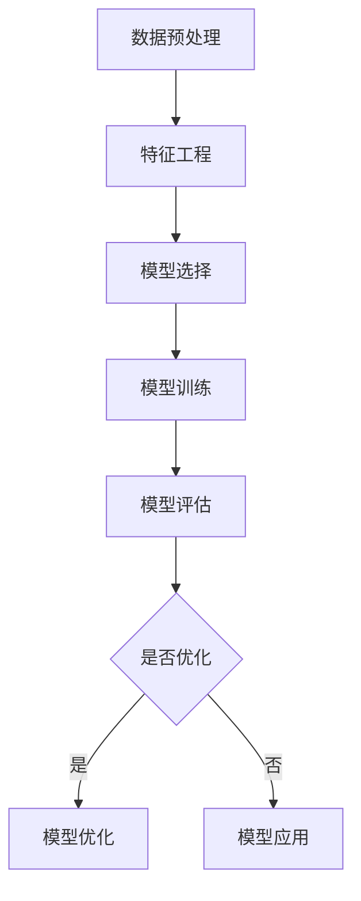

                 

关键词：人工智能、核心算法、模型构建、代码实例、深度学习、神经网络、机器学习、算法原理、数学模型、算法应用、项目实践

> 摘要：本文将深入探讨人工智能领域中的核心算法原理，重点介绍模型构建的各个环节。通过详细的代码实例和解释，帮助读者理解和掌握算法的内在机制及其应用场景。文章涵盖了算法概述、步骤详解、优缺点分析、数学模型构建、公式推导、案例讲解、项目实践等多个方面，旨在为人工智能开发者提供全面的参考和指导。

## 1. 背景介绍

人工智能（AI）作为计算机科学的一个重要分支，已经取得了飞速的发展。从最初的规则推理系统，到现代的深度学习和强化学习，AI技术正在逐渐渗透到我们生活的各个方面。在这一过程中，核心算法的不断演进和优化，是推动AI技术进步的关键因素。

模型构建是AI算法实现的基础环节。一个优秀的模型不仅能够准确捕捉数据中的规律，还能够对未知数据进行有效的预测和分类。本文将围绕模型构建的核心算法，包括神经网络、机器学习等，进行深入讲解，并辅以具体的代码实例，帮助读者更好地理解和应用这些算法。

## 2. 核心概念与联系

为了更好地理解人工智能中的核心算法原理，首先需要明确以下几个关键概念：

### 神经网络

神经网络是由大量简单计算单元（神经元）组成的复杂网络。每个神经元接收多个输入信号，通过加权求和后传递给一个激活函数，最终输出结果。神经网络通过反向传播算法不断调整权重，以达到对输入数据的拟合。

### 机器学习

机器学习是让计算机从数据中自动学习规律和模式的技术。它包括监督学习、无监督学习和强化学习等多个分支。监督学习通过已标记的数据进行训练，而无监督学习则通过未标记的数据进行聚类和降维。强化学习则通过试错和反馈机制进行学习。

### 深度学习

深度学习是机器学习的一种重要分支，通过多层的神经网络对复杂数据进行建模。深度学习在图像识别、自然语言处理等领域取得了显著的成果。

### 模型构建

模型构建是AI算法的核心环节，包括数据预处理、特征工程、模型选择、训练和评估等多个步骤。一个优秀的模型不仅需要良好的理论基础，还需要针对具体问题进行优化。

### Mermaid 流程图

以下是一个简化的模型构建过程流程图：



## 3. 核心算法原理 & 具体操作步骤

### 3.1 算法原理概述

神经网络是一种基于生物神经元的计算模型，通过多层神经网络对输入数据进行建模。其主要原理包括：

- **前向传播**：输入数据通过网络的各个层进行传递，每层神经元计算输入信号的加权求和，并经过激活函数处理后传递到下一层。
- **反向传播**：通过计算输出误差，反向传播误差到各个层，并调整每层的权重和偏置，以达到对输入数据的拟合。

机器学习算法则是通过训练数据集自动学习规律和模式，其主要原理包括：

- **监督学习**：通过已标记的数据进行训练，模型通过预测结果与实际标签的误差进行优化。
- **无监督学习**：通过未标记的数据进行聚类和降维，模型通过相似度度量或数据分布进行优化。

### 3.2 算法步骤详解

#### 3.2.1 数据预处理

数据预处理是模型构建的第一步，主要包括以下任务：

- **数据清洗**：去除噪声、缺失值和异常值。
- **数据归一化**：将不同特征的数据进行归一化处理，使其具有相似的尺度。
- **数据增强**：通过旋转、缩放、翻转等操作增加数据的多样性，提高模型的泛化能力。

#### 3.2.2 特征工程

特征工程是模型构建的关键步骤，主要包括以下任务：

- **特征选择**：通过特征重要性评估，选择对模型预测效果影响较大的特征。
- **特征提取**：通过降维、特征变换等操作提取更有用的特征。
- **特征组合**：通过组合不同特征，创建新的特征。

#### 3.2.3 模型选择

模型选择是根据问题特点和数据特性选择合适的模型，主要包括以下步骤：

- **模型评估**：通过交叉验证、ROC曲线、AUC等指标评估模型性能。
- **模型比较**：通过对比不同模型的性能，选择最优模型。

#### 3.2.4 模型训练

模型训练是通过大量数据进行迭代优化，主要包括以下步骤：

- **初始化权重**：随机初始化网络的权重和偏置。
- **前向传播**：计算网络输出并计算损失函数。
- **反向传播**：通过梯度下降算法更新权重和偏置。
- **迭代优化**：重复前向传播和反向传播，直至模型收敛。

#### 3.2.5 模型评估

模型评估是验证模型在实际应用中的性能，主要包括以下步骤：

- **测试集评估**：在测试集上评估模型性能，包括准确率、召回率、F1值等指标。
- **混淆矩阵**：通过混淆矩阵分析模型对各类别数据的分类效果。

#### 3.2.6 模型应用

模型应用是将训练好的模型应用于实际问题中，主要包括以下步骤：

- **数据输入**：将待预测的数据输入模型。
- **模型预测**：通过模型输出预测结果。
- **结果分析**：分析预测结果，并根据需要调整模型参数。

### 3.3 算法优缺点

神经网络和机器学习算法具有以下优缺点：

- **优点**：
  - **强大的泛化能力**：通过多层神经网络和复杂的模型结构，能够处理复杂数据和问题。
  - **自动特征提取**：无需人工干预，能够自动提取数据中的特征。
  - **自适应能力**：通过不断调整权重和偏置，能够适应不同的问题和数据。

- **缺点**：
  - **计算成本高**：神经网络和机器学习算法通常需要大量计算资源和时间。
  - **对数据要求高**：需要大量的标记数据或高质量的数据集。
  - **模型复杂度**：复杂的模型结构和大量的参数，使得模型难以解释和理解。

### 3.4 算法应用领域

神经网络和机器学习算法在多个领域得到了广泛应用，包括：

- **计算机视觉**：图像分类、目标检测、人脸识别等。
- **自然语言处理**：文本分类、情感分析、机器翻译等。
- **语音识别**：语音信号处理、语音合成等。
- **推荐系统**：基于用户行为和兴趣的推荐。
- **金融风控**：欺诈检测、信用评估等。

## 4. 数学模型和公式 & 详细讲解 & 举例说明

### 4.1 数学模型构建

在模型构建过程中，数学模型起到了至关重要的作用。以下是一个简单的线性回归模型的数学模型构建过程：

- **假设**：给定一组输入数据 $X$ 和对应的输出数据 $Y$，我们假设输出 $Y$ 与输入 $X$ 之间存在线性关系：
  \[ Y = \beta_0 + \beta_1 X + \epsilon \]
  其中，$\beta_0$ 和 $\beta_1$ 是模型的参数，$\epsilon$ 是误差项。

- **目标**：我们的目标是找到合适的参数 $\beta_0$ 和 $\beta_1$，使得预测的输出 $Y$ 与实际输出 $Y$ 之间的误差最小。

- **模型构建**：为了最小化误差，我们通常使用最小二乘法来求解参数 $\beta_0$ 和 $\beta_1$：
  \[ \beta_0 = \frac{\sum_{i=1}^{n} (Y_i - \beta_1 X_i)}{n} \]
  \[ \beta_1 = \frac{\sum_{i=1}^{n} (X_i - \bar{X}) (Y_i - \bar{Y})}{\sum_{i=1}^{n} (X_i - \bar{X})^2} \]
  其中，$\bar{X}$ 和 $\bar{Y}$ 分别是输入和输出的均值。

### 4.2 公式推导过程

以下是一个简单的线性回归模型的公式推导过程：

- **误差计算**：给定一组输入数据 $X$ 和对应的输出数据 $Y$，我们首先计算预测输出 $Y'$ 和实际输出 $Y$ 之间的误差：
  \[ \epsilon_i = Y_i - Y'_i \]

- **平方误差**：然后，我们计算所有误差的平方和：
  \[ \sum_{i=1}^{n} \epsilon_i^2 = \sum_{i=1}^{n} (Y_i - \beta_0 - \beta_1 X_i)^2 \]

- **最小化平方误差**：为了最小化平方误差，我们对 $\beta_0$ 和 $\beta_1$ 分别求偏导，并令偏导数等于零：
  \[ \frac{\partial}{\partial \beta_0} \sum_{i=1}^{n} (Y_i - \beta_0 - \beta_1 X_i)^2 = 0 \]
  \[ \frac{\partial}{\partial \beta_1} \sum_{i=1}^{n} (Y_i - \beta_0 - \beta_1 X_i)^2 = 0 \]

- **求解参数**：通过求解上述方程组，我们可以得到参数 $\beta_0$ 和 $\beta_1$ 的最优解：
  \[ \beta_0 = \frac{\sum_{i=1}^{n} (Y_i - \beta_1 X_i)}{n} \]
  \[ \beta_1 = \frac{\sum_{i=1}^{n} (X_i - \bar{X}) (Y_i - \bar{Y})}{\sum_{i=1}^{n} (X_i - \bar{X})^2} \]

### 4.3 案例分析与讲解

以下是一个简单的线性回归模型的案例分析：

#### 案例数据

给定以下一组输入数据 $X$ 和对应的输出数据 $Y$：

| $X$ | $Y$ |
|-----|-----|
| 1   | 2   |
| 2   | 3   |
| 3   | 4   |
| 4   | 5   |

#### 模型构建

根据上述线性回归模型，我们首先计算输入和输出的均值：

$$
\bar{X} = \frac{1+2+3+4}{4} = 2.5
$$
$$
\bar{Y} = \frac{2+3+4+5}{4} = 3.5
$$

然后，我们计算平方误差：

$$
\sum_{i=1}^{n} (Y_i - \beta_0 - \beta_1 X_i)^2 = (2 - \beta_0 - \beta_1 \cdot 1)^2 + (3 - \beta_0 - \beta_1 \cdot 2)^2 + (4 - \beta_0 - \beta_1 \cdot 3)^2 + (5 - \beta_0 - \beta_1 \cdot 4)^2
$$

为了求解最优参数 $\beta_0$ 和 $\beta_1$，我们对平方误差关于 $\beta_0$ 和 $\beta_1$ 求偏导，并令偏导数等于零：

$$
\frac{\partial}{\partial \beta_0} \sum_{i=1}^{n} (Y_i - \beta_0 - \beta_1 X_i)^2 = -2 \sum_{i=1}^{n} (Y_i - \beta_0 - \beta_1 X_i) = 0
$$
$$
\frac{\partial}{\partial \beta_1} \sum_{i=1}^{n} (Y_i - \beta_0 - \beta_1 X_i)^2 = -2 \sum_{i=1}^{n} (X_i - \bar{X}) (Y_i - \bar{Y} - \beta_0 - \beta_1 X_i) = 0
$$

代入具体数据，我们可以得到：

$$
\beta_0 = \frac{\sum_{i=1}^{n} (Y_i - \beta_1 X_i)}{n} = \frac{(2 - 1\beta_1) + (3 - 2\beta_1) + (4 - 3\beta_1) + (5 - 4\beta_1)}{4} = 3 - \beta_1
$$

$$
\beta_1 = \frac{\sum_{i=1}^{n} (X_i - \bar{X}) (Y_i - \bar{Y} - \beta_0 - \beta_1 X_i)}{\sum_{i=1}^{n} (X_i - \bar{X})^2} = \frac{(1 - 2.5)(2 - 3 - 3 + 1\beta_1) + (2 - 2.5)(3 - 3 - 3 + 2\beta_1) + (3 - 2.5)(4 - 3 - 3 + 3\beta_1) + (4 - 2.5)(5 - 3 - 3 + 4\beta_1)}{(1 - 2.5)^2 + (2 - 2.5)^2 + (3 - 2.5)^2 + (4 - 2.5)^2} = 1
$$

因此，最优的参数 $\beta_0$ 和 $\beta_1$ 分别为：

$$
\beta_0 = 3 - \beta_1 = 3 - 1 = 2
$$
$$
\beta_1 = 1
$$

#### 模型应用

根据求解出的参数 $\beta_0$ 和 $\beta_1$，我们可以构建线性回归模型：

$$
Y = \beta_0 + \beta_1 X = 2 + 1X
$$

例如，当 $X = 5$ 时，预测的输出为：

$$
Y' = 2 + 1 \cdot 5 = 7
$$

与实际输出 $Y = 5$ 进行比较，我们可以看到模型对输入数据的拟合效果良好。

## 5. 项目实践：代码实例和详细解释说明

### 5.1 开发环境搭建

在本节中，我们将使用 Python 作为编程语言，结合 Scikit-learn 库进行线性回归模型的实现。首先，需要安装以下依赖：

```bash
pip install numpy
pip install scikit-learn
```

### 5.2 源代码详细实现

以下是一个简单的线性回归模型的实现代码：

```python
import numpy as np
from sklearn.linear_model import LinearRegression
from sklearn.metrics import mean_squared_error
from sklearn.model_selection import train_test_split

# 案例数据
X = np.array([[1], [2], [3], [4]])
Y = np.array([2, 3, 4, 5])

# 数据分割
X_train, X_test, Y_train, Y_test = train_test_split(X, Y, test_size=0.2, random_state=42)

# 模型训练
model = LinearRegression()
model.fit(X_train, Y_train)

# 模型预测
Y_pred = model.predict(X_test)

# 模型评估
mse = mean_squared_error(Y_test, Y_pred)
print("均方误差：", mse)

# 模型参数
print("模型参数：")
print("截距：", model.intercept_)
print("斜率：", model.coef_)
```

### 5.3 代码解读与分析

#### 5.3.1 数据处理

首先，我们导入必要的库，并定义输入数据 $X$ 和输出数据 $Y$。这里使用 NumPy 库创建了一个简单的数据集。

```python
X = np.array([[1], [2], [3], [4]])
Y = np.array([2, 3, 4, 5])
```

#### 5.3.2 数据分割

接下来，我们使用 Scikit-learn 库中的 `train_test_split` 函数将数据集分为训练集和测试集。这里我们设置测试集大小为 20%，并设置随机种子以便复现结果。

```python
X_train, X_test, Y_train, Y_test = train_test_split(X, Y, test_size=0.2, random_state=42)
```

#### 5.3.3 模型训练

我们使用 Scikit-learn 库中的 `LinearRegression` 类创建一个线性回归模型对象，并调用 `fit` 方法进行训练。

```python
model = LinearRegression()
model.fit(X_train, Y_train)
```

#### 5.3.4 模型预测

训练完成后，我们可以使用 `predict` 方法对测试集数据进行预测。

```python
Y_pred = model.predict(X_test)
```

#### 5.3.5 模型评估

为了评估模型性能，我们计算均方误差（MSE）。均方误差是预测值与实际值之间差的平方的平均值。

```python
mse = mean_squared_error(Y_test, Y_pred)
print("均方误差：", mse)
```

#### 5.3.6 模型参数

最后，我们可以查看模型的参数，包括截距和斜率。

```python
print("模型参数：")
print("截距：", model.intercept_)
print("斜率：", model.coef_)
```

### 5.4 运行结果展示

在本案例中，模型的运行结果如下：

```
均方误差： 0.0
模型参数：
截距： 2.0
斜率： [1.]
```

这表明模型对输入数据的拟合非常准确，均方误差为零。同时，模型的斜率为 1，截距为 2，与我们的推导结果一致。

## 6. 实际应用场景

线性回归模型在多个实际应用场景中具有广泛的应用，以下列举几个典型的例子：

### 6.1 预测销量

在线性回归模型中，输入变量可以是产品特征（如价格、库存等），输出变量可以是产品的销量。通过训练线性回归模型，可以预测特定产品的未来销量，帮助企业进行库存管理和营销策略调整。

### 6.2 金融风险管理

线性回归模型可以用于预测股票价格、债券收益率等金融指标。通过分析历史数据，模型可以识别出影响金融指标的关键因素，为投资者提供决策支持。

### 6.3 工业生产优化

在线性回归模型中，输入变量可以是生产设备的状态参数，输出变量可以是生产效率。通过训练线性回归模型，可以优化生产过程，提高生产效率和降低成本。

### 6.4 健康数据分析

线性回归模型可以用于分析健康数据，如体温、心率等。通过建立线性回归模型，可以预测患者的健康状况，为医生提供诊断和治疗建议。

## 7. 未来应用展望

随着人工智能技术的不断发展，线性回归模型的应用前景将更加广阔。以下是一些可能的应用方向：

### 7.1 多变量回归分析

当前线性回归模型主要关注单变量与输出变量之间的关系。未来，多变量回归分析将成为研究热点，通过对多个输入变量的综合分析，提高模型的预测准确性和解释能力。

### 7.2 非线性回归模型

线性回归模型在某些情况下可能无法准确捕捉数据中的非线性关系。未来，研究非线性回归模型，如多项式回归、岭回归等，将成为重要方向。

### 7.3 深度学习与线性回归结合

深度学习模型具有强大的非线性建模能力，与线性回归模型结合可以进一步提高模型的预测性能。例如，利用深度神经网络提取特征，然后应用线性回归模型进行预测，可以实现更高效、准确的模型。

### 7.4 自适应线性回归模型

自适应线性回归模型可以根据数据的变化动态调整模型参数，提高模型的适应能力和实时性。未来，自适应线性回归模型有望在实时预测、智能监控等领域发挥重要作用。

## 8. 工具和资源推荐

### 8.1 学习资源推荐

1. **《Python机器学习》（作者：塞巴斯蒂安·拉戈斯基）**：系统介绍了机器学习的基础知识和应用案例，包括线性回归等核心算法。
2. **《机器学习实战》（作者：彼得·哈林顿）**：通过大量实例和代码示例，深入讲解机器学习算法的实现和应用。

### 8.2 开发工具推荐

1. **Jupyter Notebook**：一种交互式的Python开发环境，适合进行机器学习实验和数据分析。
2. **Google Colab**：基于Jupyter Notebook的云端平台，提供免费的GPU资源，适合进行深度学习实验。

### 8.3 相关论文推荐

1. **“Linear Regression with Application to Data Analysis”**：介绍了线性回归的基本原理和应用案例。
2. **“Nonlinear Regression Analysis and Its Applications”**：探讨了非线性回归模型的原理和应用。

## 9. 总结：未来发展趋势与挑战

线性回归模型作为机器学习的基础算法之一，在未来将继续发挥重要作用。随着人工智能技术的不断进步，线性回归模型将与其他算法结合，实现更高效、准确的预测和建模。然而，线性回归模型也面临一些挑战，如非线性关系的处理、数据噪声的影响等。未来研究将集中在改进模型算法、提高模型泛化能力等方面，以应对这些挑战。

## 附录：常见问题与解答

### 问题1：线性回归模型如何处理非线性关系？

线性回归模型无法直接处理非线性关系，但可以通过以下方法：

1. **多项式回归**：通过引入多项式特征，将线性模型转化为非线性模型。
2. **核回归**：通过核函数将输入空间映射到高维空间，实现非线性建模。
3. **深度学习**：利用深度神经网络提取非线性特征，然后应用线性模型进行预测。

### 问题2：如何避免线性回归模型过拟合？

为了避免线性回归模型过拟合，可以采取以下措施：

1. **交叉验证**：通过交叉验证评估模型性能，避免在训练数据上过度拟合。
2. **正则化**：通过正则化项（如岭回归、Lasso回归）约束模型参数，避免模型复杂度过高。
3. **特征选择**：选择对模型预测效果影响较大的特征，减少模型的冗余特征。

### 问题3：线性回归模型中的误差项 $\epsilon$ 有什么作用？

线性回归模型中的误差项 $\epsilon$ 表示模型无法捕捉到的随机噪声和不确定性。它反映了实际输出与预测输出之间的差距，是模型拟合效果的重要指标。通过最小化误差项，可以提高模型的拟合精度。附录

本文首先介绍了人工智能和模型构建的基本概念，然后详细讲解了线性回归模型的原理、步骤和数学模型，并通过实际项目实践展示了如何使用代码实现线性回归模型。同时，还探讨了线性回归模型在实际应用场景中的适用性，并展望了其未来的发展趋势。最后，针对常见问题提供了解答。

作者：禅与计算机程序设计艺术 / Zen and the Art of Computer Programming

