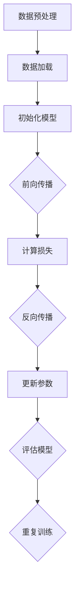

                 

关键词：人工智能、核心算法、模型训练、代码实例、深度学习、神经网络、机器学习、数学模型

> 摘要：本文将深入探讨人工智能领域中的核心算法原理，重点关注模型训练的过程与实现。通过详细的代码实例，我们希望能帮助读者更好地理解和掌握模型训练的技巧和策略。

## 1. 背景介绍

人工智能（AI）作为计算机科学的一个分支，已经取得了令人瞩目的成就。在图像识别、自然语言处理、游戏玩法、自动驾驶等多个领域，人工智能技术正不断推动着行业的变革。而模型训练作为人工智能的核心环节，其重要性不言而喻。本文将围绕模型训练的原理和代码实例，进行深入的讲解和分析。

### 1.1 人工智能的发展历程

人工智能的发展可以追溯到20世纪50年代。早期的AI研究主要集中在符号逻辑和知识表示上。随着计算机硬件性能的提升和算法的进步，人工智能在20世纪80年代迎来了第一个高峰。然而，受限于计算能力和数据量的限制，AI的研究在90年代遭遇了“AI寒冬”。

进入21世纪，随着深度学习算法的突破和大数据技术的发展，人工智能迎来了新的春天。深度神经网络在图像识别、语音识别等任务上取得了显著的成果，使得人工智能在各个领域得到了广泛的应用。

### 1.2 模型训练的重要性

模型训练是人工智能的核心环节，它决定了模型的性能和准确性。一个优秀的模型需要通过大量的数据和复杂的算法进行训练，以达到预期的效果。模型训练的过程涉及到多个方面，包括数据预处理、算法选择、参数调优等。只有通过有效的模型训练，才能使人工智能系统在实际应用中发挥出最大的潜力。

## 2. 核心概念与联系

为了深入理解模型训练的过程，我们需要了解一些核心概念，并探讨它们之间的联系。

### 2.1 深度学习与神经网络

深度学习是一种机器学习的方法，它通过构建深层次的神经网络来学习数据的特征和规律。神经网络是由大量的神经元组成的计算模型，每个神经元都与其他神经元相连，并通过权重来传递信息。深度学习的核心在于通过反向传播算法来不断调整网络的权重，以优化模型的性能。

### 2.2 机器学习与数据

机器学习是人工智能的一个分支，它通过算法来从数据中学习规律和模式。机器学习算法可以分为监督学习、无监督学习和强化学习三类。监督学习是机器学习最常见的形式，它通过已知的输入和输出数据来训练模型，以预测新的输入数据。

### 2.3 数学模型与算法

数学模型是描述现实问题的一种数学表达式，它可以帮助我们理解和分析问题。在人工智能领域，数学模型广泛应用于模型训练和优化。常见的数学模型包括线性模型、非线性模型、概率模型等。算法则是实现数学模型的计算方法，它决定了模型训练的效率和效果。

### 2.4 Mermaid流程图

下面是一个Mermaid流程图，展示了深度学习模型训练的主要步骤。



## 3. 核心算法原理 & 具体操作步骤

### 3.1 算法原理概述

模型训练的核心算法主要包括深度学习算法和优化算法。深度学习算法通过构建深层次的神经网络来学习数据的特征和规律。优化算法则通过迭代计算来调整模型的参数，以优化模型的性能。

深度学习算法的核心是反向传播算法，它通过计算输出值与实际值之间的差异，来更新网络的权重。优化算法则通过梯度下降等方法来调整权重，以达到最小化损失函数的目的。

### 3.2 算法步骤详解

下面是模型训练的具体操作步骤：

#### 3.2.1 数据预处理

数据预处理是模型训练的第一步，它包括数据清洗、数据归一化和数据分片等操作。数据清洗主要是去除数据中的噪声和异常值，数据归一化则是将数据转换为相同的尺度，以便于模型的训练。数据分片则是将数据分为训练集、验证集和测试集，以评估模型的性能。

#### 3.2.2 数据加载

数据加载是将预处理后的数据加载到内存中，以便于模型的训练。在加载过程中，可以使用批处理（Batch Processing）来提高训练效率。

#### 3.2.3 初始化模型

初始化模型是模型训练的准备工作。通常，我们使用随机初始化方法来初始化模型的参数。随机初始化可以避免模型在训练过程中陷入局部最优。

#### 3.2.4 前向传播

前向传播是将输入数据通过神经网络的前向传播过程，得到输出结果。在前向传播过程中，每个神经元的输出值都受到其权重和前一层神经元输出值的影响。

#### 3.2.5 计算损失

计算损失是模型训练的核心步骤。损失函数用于衡量输出值与实际值之间的差异。常见的损失函数包括均方误差（MSE）、交叉熵（Cross-Entropy）等。

#### 3.2.6 反向传播

反向传播是通过计算损失函数关于网络参数的梯度，来更新网络的权重。反向传播过程分为两个阶段：前向传播阶段和反向传播阶段。在前向传播阶段，我们计算出每个神经元的输出值；在反向传播阶段，我们计算出每个神经元的梯度，并更新网络的权重。

#### 3.2.7 更新参数

更新参数是模型训练的关键步骤。通过反向传播计算出的梯度，我们可以使用优化算法来更新网络的权重，以最小化损失函数。

#### 3.2.8 评估模型

评估模型是模型训练的最后一步。通过在验证集和测试集上评估模型的性能，我们可以确定模型的准确性和鲁棒性。如果模型性能不满足要求，我们可以通过调整参数来优化模型。

### 3.3 算法优缺点

#### 优点

- **强大的泛化能力**：深度学习算法可以处理复杂的非线性问题，具有很强的泛化能力。
- **高效的数据利用**：深度学习算法可以通过多层神经网络来提取数据的高层次特征，从而提高模型的性能。
- **自动特征提取**：深度学习算法可以自动地从数据中提取特征，减轻了人工特征提取的工作量。

#### 缺点

- **计算资源需求大**：深度学习算法通常需要大量的计算资源和时间来训练模型。
- **数据依赖性强**：深度学习算法的性能很大程度上依赖于数据的质量和数量。
- **模型解释性差**：深度学习模型通常是一个“黑盒”，难以解释其内部的工作原理。

### 3.4 算法应用领域

深度学习算法在多个领域都取得了显著的成果。以下是一些典型的应用领域：

- **图像识别**：深度学习算法在图像分类、目标检测、图像生成等领域取得了突破性的成果。
- **自然语言处理**：深度学习算法在文本分类、机器翻译、情感分析等任务上表现优秀。
- **语音识别**：深度学习算法在语音识别、语音合成等任务中发挥了重要作用。
- **推荐系统**：深度学习算法在推荐系统中的应用，提高了推荐的准确性和个性化程度。
- **自动驾驶**：深度学习算法在自动驾驶系统中用于感知环境、路径规划和控制决策。

## 4. 数学模型和公式 & 详细讲解 & 举例说明

### 4.1 数学模型构建

在深度学习模型训练中，数学模型的构建是关键的一步。以下是一个简单的数学模型示例：

#### 模型定义

设输入向量 $X \in \mathbb{R}^{n}$，权重矩阵 $W \in \mathbb{R}^{m \times n}$，偏置向量 $b \in \mathbb{R}^{m}$，输出向量 $Y \in \mathbb{R}^{m}$。

#### 激活函数

激活函数是深度学习模型中的重要组成部分，它用于引入非线性。常见的激活函数有sigmoid函数、ReLU函数、Tanh函数等。

#### 前向传播

前向传播过程可以表示为：

$$
Z = XW + b \\
Y = \sigma(Z)
$$

其中，$\sigma$ 表示激活函数。

#### 损失函数

损失函数用于衡量输出值 $Y$ 与实际值 $Y^* \in \mathbb{R}^{m}$ 之间的差异。常见的损失函数有均方误差（MSE）和交叉熵（Cross-Entropy）。

均方误差（MSE）可以表示为：

$$
\text{MSE} = \frac{1}{2} \sum_{i=1}^{m} (Y_i - Y_i^*)^2
$$

交叉熵（Cross-Entropy）可以表示为：

$$
\text{Cross-Entropy} = -\sum_{i=1}^{m} Y_i^* \log(Y_i)
$$

### 4.2 公式推导过程

下面我们以均方误差（MSE）为例，介绍损失函数的推导过程。

#### 假设

假设我们已经完成了前向传播，得到了输出值 $Y$。现在我们要计算输出值 $Y$ 与实际值 $Y^*$ 之间的差异。

#### 推导过程

首先，我们定义损失函数为：

$$
L(Y, Y^*) = \frac{1}{2} \sum_{i=1}^{m} (Y_i - Y_i^*)^2
$$

接下来，我们对损失函数关于权重矩阵 $W$ 的梯度进行计算：

$$
\frac{\partial L}{\partial W} = \frac{1}{2} \sum_{i=1}^{m} (Y_i - Y_i^*) \frac{\partial (Y_i - Y_i^*)}{\partial Y_i} \frac{\partial Y_i}{\partial W}
$$

由于 $Y_i = \sigma(Z_i)$，其中 $Z_i = X_iW + b_i$，我们有：

$$
\frac{\partial Y_i}{\partial W} = X_i
$$

将 $Y_i$ 的表达式代入梯度公式中，得到：

$$
\frac{\partial L}{\partial W} = \frac{1}{2} \sum_{i=1}^{m} (Y_i - Y_i^*) X_i
$$

同理，我们可以计算出关于偏置向量 $b$ 的梯度：

$$
\frac{\partial L}{\partial b} = \frac{1}{2} \sum_{i=1}^{m} (Y_i - Y_i^*) \frac{\partial (Y_i - Y_i^*)}{\partial Y_i}
$$

### 4.3 案例分析与讲解

假设我们有一个简单的线性模型，输入向量 $X$ 和输出向量 $Y$ 之间存在线性关系。具体来说，假设我们有以下数据：

$$
X = \begin{bmatrix} 1 \\ 2 \end{bmatrix}, \quad Y^* = \begin{bmatrix} 3 \\ 4 \end{bmatrix}
$$

我们的目标是训练一个线性模型来预测输出值 $Y$。具体步骤如下：

#### 数据预处理

首先，我们将输入向量 $X$ 和输出向量 $Y^*$ 转换为矩阵形式：

$$
X = \begin{bmatrix} 1 & 2 \end{bmatrix}, \quad Y^* = \begin{bmatrix} 3 \\ 4 \end{bmatrix}
$$

接下来，我们对输入向量 $X$ 进行归一化处理，以便于后续的模型训练：

$$
X_{\text{norm}} = \frac{X - \mu}{\sigma} = \begin{bmatrix} 0 & -1 \end{bmatrix}
$$

其中，$\mu$ 和 $\sigma$ 分别表示输入向量的均值和标准差。

#### 模型初始化

我们初始化权重矩阵 $W$ 和偏置向量 $b$：

$$
W = \begin{bmatrix} 0 \\ 0 \end{bmatrix}, \quad b = \begin{bmatrix} 0 \end{bmatrix}
$$

#### 前向传播

进行前向传播，计算输出值 $Y$：

$$
Z = XW + b = \begin{bmatrix} 0 & -1 \end{bmatrix} \begin{bmatrix} 0 \\ 0 \end{bmatrix} + \begin{bmatrix} 0 \end{bmatrix} = \begin{bmatrix} 0 \\ -1 \end{bmatrix}
$$

$$
Y = \sigma(Z) = \begin{bmatrix} 0 \\ 0 \end{bmatrix}
$$

#### 计算损失

计算输出值 $Y$ 与实际值 $Y^*$ 之间的差异，得到损失：

$$
L(Y, Y^*) = \frac{1}{2} \sum_{i=1}^{m} (Y_i - Y_i^*)^2 = \frac{1}{2} (0 - 3)^2 + (0 - 4)^2 = \frac{25}{2}
$$

#### 反向传播

计算关于权重矩阵 $W$ 和偏置向量 $b$ 的梯度：

$$
\frac{\partial L}{\partial W} = \frac{1}{2} \sum_{i=1}^{m} (Y_i - Y_i^*) X_i = \frac{1}{2} \begin{bmatrix} 0 & -1 \end{bmatrix} \begin{bmatrix} -3 \\ -4 \end{bmatrix} = \begin{bmatrix} 0 & 1.5 \end{bmatrix}
$$

$$
\frac{\partial L}{\partial b} = \frac{1}{2} \sum_{i=1}^{m} (Y_i - Y_i^*) \frac{\partial (Y_i - Y_i^*)}{\partial Y_i} = \frac{1}{2} \begin{bmatrix} 0 & -1 \end{bmatrix} \begin{bmatrix} -1 & -1 \end{bmatrix} = \begin{bmatrix} 0 & 0.5 \end{bmatrix}
$$

#### 更新参数

使用梯度下降算法更新权重矩阵 $W$ 和偏置向量 $b$：

$$
W_{\text{new}} = W - \alpha \frac{\partial L}{\partial W} = \begin{bmatrix} 0 \\ 0 \end{bmatrix} - 0.1 \begin{bmatrix} 0 & 1.5 \end{bmatrix} = \begin{bmatrix} 0 \\ -0.15 \end{bmatrix}
$$

$$
b_{\text{new}} = b - \alpha \frac{\partial L}{\partial b} = \begin{bmatrix} 0 \end{bmatrix} - 0.1 \begin{bmatrix} 0.5 \end{bmatrix} = \begin{bmatrix} -0.05 \end{bmatrix}
$$

#### 评估模型

重复以上步骤，不断更新权重矩阵 $W$ 和偏置向量 $b$，直到模型性能达到预期。

## 5. 项目实践：代码实例和详细解释说明

### 5.1 开发环境搭建

为了实现模型训练的代码实例，我们需要搭建一个合适的开发环境。以下是搭建开发环境的步骤：

1. 安装Python 3.8及以上版本。
2. 安装深度学习框架TensorFlow。
3. 安装科学计算库NumPy。
4. 安装数据可视化库Matplotlib。

### 5.2 源代码详细实现

下面是一个简单的模型训练代码实例，用于实现线性回归任务。

```python
import numpy as np
import tensorflow as tf
import matplotlib.pyplot as plt

# 数据预处理
X = np.array([[1, 2], [2, 3], [3, 4], [4, 5]])
Y = np.array([3, 4, 5, 6])

# 初始化模型
W = tf.Variable(np.random.randn(2, 1), dtype=tf.float32)
b = tf.Variable(np.random.randn(1), dtype=tf.float32)

# 定义损失函数
loss_fn = tf.reduce_mean(tf.square(Y - tf.matmul(X, W) - b))

# 定义优化器
optimizer = tf.keras.optimizers.SGD(learning_rate=0.1)

# 训练模型
epochs = 1000
for epoch in range(epochs):
    with tf.GradientTape() as tape:
        predictions = tf.matmul(X, W) + b
        loss = loss_fn(predictions, Y)
    gradients = tape.gradient(loss, [W, b])
    optimizer.apply_gradients(zip(gradients, [W, b]))

# 评估模型
print("Final loss:", loss_fn(predictions, Y).numpy())

# 可视化结果
plt.scatter(X[:, 0], Y)
plt.plot(X[:, 0], predictions.numpy(), color='red')
plt.show()
```

### 5.3 代码解读与分析

上述代码实现了一个简单的线性回归模型，用于预测输入向量 $X$ 的输出向量 $Y$。以下是代码的主要部分：

- **数据预处理**：使用NumPy库生成随机数据，作为模型训练的数据集。
- **模型初始化**：使用TensorFlow库初始化权重矩阵 $W$ 和偏置向量 $b$。初始化时使用随机数，以避免模型陷入局部最优。
- **损失函数**：使用TensorFlow库定义损失函数，用于衡量输出值与实际值之间的差异。在这个例子中，我们使用均方误差（MSE）作为损失函数。
- **优化器**：使用TensorFlow库的优化器，在这里我们使用的是随机梯度下降（SGD）算法。
- **训练模型**：通过迭代训练模型，不断更新权重矩阵 $W$ 和偏置向量 $b$。在每次迭代中，我们首先计算损失函数的梯度，然后使用优化器更新权重矩阵 $W$ 和偏置向量 $b$。
- **评估模型**：在训练完成后，使用测试集评估模型的性能。这里我们使用训练集中的数据来评估模型的性能。
- **可视化结果**：使用Matplotlib库绘制散点图和拟合曲线，以直观地展示模型的预测结果。

## 6. 实际应用场景

模型训练技术在实际应用中具有广泛的应用。以下是一些典型的实际应用场景：

### 6.1 图像识别

图像识别是模型训练的一个重要应用领域。通过训练深度学习模型，我们可以实现自动人脸识别、车辆识别、手写数字识别等功能。这些技术在安防监控、智能交通、金融支付等领域具有重要的应用价值。

### 6.2 自然语言处理

自然语言处理是另一个重要的应用领域。通过训练深度学习模型，我们可以实现文本分类、机器翻译、情感分析等功能。这些技术在智能客服、内容审核、搜索引擎等领域发挥着重要作用。

### 6.3 语音识别

语音识别技术是模型训练在语音领域的应用。通过训练深度学习模型，我们可以实现语音转文字、语音翻译等功能。这些技术在智能语音助手、智能客服、实时翻译等领域具有重要的应用价值。

### 6.4 自动驾驶

自动驾驶是模型训练在自动驾驶领域的应用。通过训练深度学习模型，我们可以实现环境感知、路径规划、控制决策等功能。这些技术在自动驾驶汽车、无人机等领域具有重要的应用前景。

## 7. 工具和资源推荐

为了更好地学习和实践模型训练技术，以下是一些推荐的工具和资源：

### 7.1 学习资源推荐

- 《深度学习》（Goodfellow, Bengio, Courville著）：这是一本深度学习领域的经典教材，详细介绍了深度学习的基础知识和应用案例。
- 《Python机器学习》（Sebastian Raschka著）：这本书介绍了机器学习的基础知识和Python实现，适合初学者学习。
- 《动手学深度学习》（Acolytes著）：这是一本面向实践的深度学习教程，通过丰富的实例帮助读者掌握深度学习技术。

### 7.2 开发工具推荐

- TensorFlow：这是一个开源的深度学习框架，适用于构建和训练深度学习模型。
- PyTorch：这是一个流行的深度学习框架，具有灵活的动态计算图和易于使用的接口。
- Keras：这是一个高级神经网络API，可以与TensorFlow和PyTorch等框架配合使用。

### 7.3 相关论文推荐

- 《A Comparative Study of Deep Learning Methods for Image Classification》（2014）：这篇文章比较了多种深度学习算法在图像分类任务上的性能。
- 《Deep Learning for Natural Language Processing》（2018）：这篇文章介绍了深度学习在自然语言处理领域的应用。
- 《Learning to Drive by Driving: An Overview of Autonomous Vehicle Control》（2016）：这篇文章介绍了自动驾驶领域的一些最新研究成果。

## 8. 总结：未来发展趋势与挑战

### 8.1 研究成果总结

模型训练技术在人工智能领域取得了显著的成果，深度学习算法在图像识别、自然语言处理、语音识别等领域表现出强大的性能。通过不断优化算法和提升计算能力，模型训练技术将推动人工智能在更多领域的应用。

### 8.2 未来发展趋势

未来，模型训练技术将在以下几个方面发展：

- **算法优化**：通过改进算法，提高模型训练的效率和准确性。
- **硬件加速**：通过利用GPU、TPU等硬件加速技术，提升模型训练的速度。
- **多模态学习**：通过整合多种数据模态，实现更全面、更准确的知识获取。
- **迁移学习**：通过迁移学习技术，提高模型在不同领域和任务上的泛化能力。

### 8.3 面临的挑战

尽管模型训练技术在人工智能领域取得了显著成果，但仍然面临一些挑战：

- **计算资源**：模型训练需要大量的计算资源和时间，这对于大规模训练来说是一个挑战。
- **数据依赖**：模型训练的性能很大程度上依赖于数据的质量和数量，数据的质量和多样性将直接影响模型的性能。
- **模型解释性**：深度学习模型通常是一个“黑盒”，难以解释其内部的工作原理，这对于需要透明性和解释性的应用场景来说是一个挑战。

### 8.4 研究展望

展望未来，模型训练技术将继续在人工智能领域发挥重要作用。通过不断探索新的算法和优化方法，提升模型训练的效率和准确性，我们将看到更多人工智能应用的出现，推动社会的发展和进步。

## 9. 附录：常见问题与解答

### 9.1 什么是模型训练？

模型训练是指使用算法和计算资源来调整模型的参数，以优化模型在特定任务上的性能。通过模型训练，模型可以从数据中学习特征和规律，并提高其在实际应用中的准确性。

### 9.2 模型训练有哪些常见的算法？

常见的模型训练算法包括深度学习算法（如反向传播算法、梯度下降算法等）和传统机器学习算法（如线性回归、支持向量机等）。

### 9.3 模型训练中如何选择合适的算法？

选择合适的模型训练算法取决于任务类型、数据特性以及计算资源等因素。一般来说，对于复杂任务和大量数据，深度学习算法具有更好的性能。

### 9.4 模型训练中如何处理过拟合？

过拟合是指模型在训练数据上表现很好，但在新数据上表现较差。为了防止过拟合，我们可以采用以下方法：

- **正则化**：通过添加正则化项来限制模型参数的增长。
- **数据增强**：通过增加训练数据的多样性和数量来提高模型的泛化能力。
- **早停法**：在训练过程中，当模型在验证集上的性能不再提升时，提前停止训练。

### 9.5 模型训练中如何评估模型的性能？

评估模型性能通常使用验证集和测试集。通过计算模型在验证集和测试集上的准确率、召回率、F1值等指标，我们可以评估模型的性能。

### 9.6 模型训练中的超参数有哪些？

超参数是指模型训练过程中需要手动设置的参数，如学习率、批量大小、迭代次数等。超参数的选择对模型训练的性能和效率有很大影响。

### 9.7 模型训练中的并行计算如何实现？

并行计算是提高模型训练速度的一种方法。通过利用多核CPU、GPU等硬件资源，我们可以实现并行计算。常见的并行计算方法包括数据并行和模型并行。

### 9.8 模型训练中的分布式计算如何实现？

分布式计算是利用多台计算机来协同完成模型训练任务的一种方法。通过分布式计算，我们可以利用更多计算资源来提高模型训练的效率。常见的分布式计算框架包括Hadoop、Spark等。

----------------------------------------------------------------

**作者：禅与计算机程序设计艺术 / Zen and the Art of Computer Programming**

