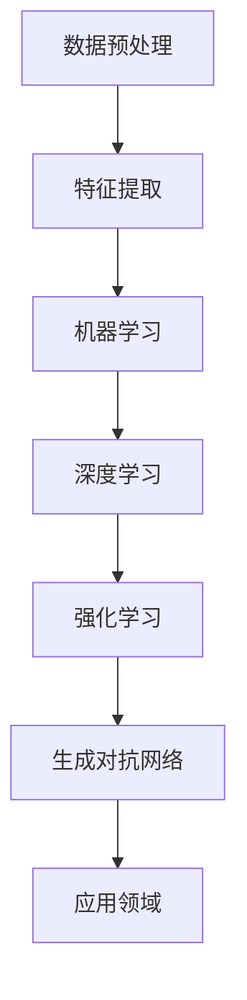

                 

关键词：人工智能、核心算法、原理讲解、代码实例、算法实现

摘要：本文旨在深入探讨人工智能领域的核心算法原理，并结合具体代码实例进行详细解析，帮助读者理解并掌握这些算法的实现过程。文章结构清晰，涵盖算法原理概述、步骤详解、优缺点分析、应用领域、数学模型推导、项目实践及未来展望等多方面内容。

## 1. 背景介绍

人工智能（Artificial Intelligence, AI）作为计算机科学的一个重要分支，近年来取得了飞速发展。AI 技术的广泛应用使得人类生活更加便捷，同时也为各个行业带来了巨大的变革。核心算法作为人工智能技术的基石，是实现智能应用的关键。本文将围绕人工智能领域的几个核心算法，从原理讲解到代码实例，深入剖析这些算法的实现过程。

### 1.1 人工智能的发展历程

人工智能的概念最早可以追溯到20世纪50年代，当时的科学家们希望计算机能够模拟人类的智能行为。经过几十年的发展，人工智能技术逐渐从理论走向实践，出现了许多重要的里程碑：

- 1956年，达特茅斯会议正式提出了“人工智能”的概念。
- 1997年，IBM 的超级计算机“深蓝”（Deep Blue）战胜了国际象棋世界冠军加里·卡斯帕罗夫。
- 2012年，谷歌的“神经网络”程序在ImageNet图像识别比赛中获得冠军。
- 2016年，人工智能系统“阿尔法狗”（AlphaGo）在围棋比赛中战胜世界冠军李世石。

这些里程碑事件标志着人工智能技术的不断进步和突破，同时也揭示了核心算法在人工智能中的重要地位。

### 1.2 核心算法的重要性

核心算法是人工智能技术的核心组成部分，决定了人工智能系统在不同领域的应用效果。以下是一些重要的核心算法及其应用领域：

- **深度学习**：广泛应用于图像识别、语音识别、自然语言处理等领域。
- **强化学习**：应用于游戏、机器人控制、推荐系统等领域。
- **生成对抗网络（GAN）**：在图像生成、风格转换、数据增强等领域具有重要应用。
- **聚类算法**：在数据挖掘、机器学习预处理、生物信息学等领域发挥作用。

本文将重点介绍这些核心算法的原理及其实现过程，帮助读者深入理解人工智能技术的本质。

## 2. 核心概念与联系

为了更好地理解人工智能核心算法的原理，我们首先需要了解一些基本概念，以及这些概念之间的联系。以下是一个使用Mermaid绘制的流程图，展示了核心概念及其相互关系。



### 2.1 数据预处理

数据预处理是人工智能应用中的第一步，它包括数据清洗、数据转换、数据归一化等操作。数据预处理的质量直接影响后续算法的性能。

### 2.2 特征提取

特征提取是从原始数据中提取出能够有效表征数据特征的子集。特征提取是机器学习中的重要步骤，决定了算法对数据的理解和学习能力。

### 2.3 机器学习

机器学习是人工智能的基础，通过训练模型来学习数据中的规律。机器学习算法可以分为监督学习、无监督学习和半监督学习。

### 2.4 深度学习

深度学习是机器学习的一个分支，通过多层神经网络来学习数据中的复杂特征。深度学习在图像识别、语音识别、自然语言处理等领域取得了显著成果。

### 2.5 强化学习

强化学习是一种通过不断尝试和反馈来学习最优策略的机器学习方法。强化学习在游戏、机器人控制、推荐系统等领域具有重要应用。

### 2.6 生成对抗网络

生成对抗网络（GAN）是一种通过生成器和判别器相互博弈来学习数据分布的机器学习模型。GAN在图像生成、风格转换、数据增强等领域表现出色。

### 2.7 应用领域

不同的人工智能核心算法在应用领域具有不同的特点。例如，深度学习在图像识别和语音识别领域应用广泛；强化学习在游戏和机器人控制领域表现优异；生成对抗网络则在图像生成和风格转换领域取得显著成果。

通过了解这些核心概念及其相互关系，我们可以更好地理解人工智能核心算法的原理和实现过程。

## 3. 核心算法原理 & 具体操作步骤

### 3.1 算法原理概述

在这一部分，我们将简要概述人工智能领域的几个核心算法的原理。

#### 3.1.1 深度学习

深度学习是一种基于多层神经网络的学习方法，其核心思想是通过不断调整网络权重来学习数据中的复杂特征。深度学习可以分为卷积神经网络（CNN）、循环神经网络（RNN）、生成对抗网络（GAN）等。

#### 3.1.2 强化学习

强化学习是一种通过奖励机制来驱动智能体学习最优策略的机器学习方法。强化学习的核心思想是通过探索和利用来平衡学习过程中的未知和已知信息。

#### 3.1.3 生成对抗网络

生成对抗网络（GAN）是一种由生成器和判别器组成的对偶网络，通过对抗训练来学习数据分布。GAN在图像生成、风格转换、数据增强等领域表现出色。

### 3.2 算法步骤详解

#### 3.2.1 深度学习

深度学习的基本步骤包括数据预处理、模型搭建、模型训练和模型评估。

1. **数据预处理**：对原始数据进行清洗、归一化等操作，以便于后续处理。
2. **模型搭建**：根据应用需求设计合适的神经网络结构，例如卷积神经网络（CNN）或循环神经网络（RNN）。
3. **模型训练**：通过反向传播算法不断调整网络权重，使模型能够准确预测数据。
4. **模型评估**：通过测试数据对模型性能进行评估，以便进行调整和优化。

#### 3.2.2 强化学习

强化学习的基本步骤包括环境搭建、策略学习、策略评估和策略优化。

1. **环境搭建**：构建一个模拟环境，用于测试和训练智能体。
2. **策略学习**：通过迭代更新策略，使智能体能够在环境中取得最大化奖励。
3. **策略评估**：对策略进行评估，以确定其在实际应用中的有效性。
4. **策略优化**：根据评估结果对策略进行优化，以提高智能体的性能。

#### 3.2.3 生成对抗网络

生成对抗网络的基本步骤包括生成器训练、判别器训练和模型评估。

1. **生成器训练**：生成器通过学习数据分布来生成虚假数据。
2. **判别器训练**：判别器通过区分真实数据和虚假数据来评估生成器的性能。
3. **模型评估**：通过测试生成器生成的数据，评估生成对抗网络的整体性能。

### 3.3 算法优缺点

每种核心算法都有其独特的优点和缺点，以下是对深度学习、强化学习和生成对抗网络的优缺点分析：

#### 3.3.1 深度学习

- **优点**：
  - 能够自动提取复杂的特征。
  - 具有强大的泛化能力。
  - 在图像识别、语音识别、自然语言处理等领域表现优异。
- **缺点**：
  - 对数据量要求较高。
  - 训练过程较慢，需要大量计算资源。
  - 模型复杂度高，难以解释。

#### 3.3.2 强化学习

- **优点**：
  - 能够通过探索和利用学习最优策略。
  - 在游戏、机器人控制、推荐系统等领域表现优异。
- **缺点**：
  - 需要大量的时间和计算资源。
  - 策略优化过程复杂，存在过拟合问题。

#### 3.3.3 生成对抗网络

- **优点**：
  - 能够学习数据的高质量分布。
  - 在图像生成、风格转换、数据增强等领域具有广泛应用。
- **缺点**：
  - 训练过程不稳定，容易出现模式崩溃。
  - 模型参数较多，计算复杂度高。

### 3.4 算法应用领域

不同的人工智能核心算法在应用领域具有不同的特点：

- **深度学习**：广泛应用于图像识别、语音识别、自然语言处理、自动驾驶等领域。
- **强化学习**：广泛应用于游戏、机器人控制、推荐系统、智能交通等领域。
- **生成对抗网络**：广泛应用于图像生成、风格转换、数据增强、虚拟现实等领域。

## 4. 数学模型和公式 & 详细讲解 & 举例说明

在人工智能算法的实现过程中，数学模型和公式起着至关重要的作用。以下我们将详细介绍几种核心算法的数学模型和公式，并结合具体实例进行说明。

### 4.1 数学模型构建

#### 4.1.1 深度学习

深度学习中的多层感知机（MLP）可以表示为一个非线性函数，其形式如下：

$$
f(x) = \sigma(\sum_{i=1}^{n} w_i \cdot x_i + b)
$$

其中，$x$ 是输入向量，$w_i$ 是权重，$b$ 是偏置，$\sigma$ 是激活函数，通常使用 Sigmoid 或 ReLU 函数。

#### 4.1.2 强化学习

强化学习中的 Q-Learning 算法通过迭代更新 Q 值，其公式如下：

$$
Q(s, a) \leftarrow Q(s, a) + \alpha [r + \gamma \max_{a'} Q(s', a') - Q(s, a)]
$$

其中，$s$ 是状态，$a$ 是动作，$r$ 是即时奖励，$\gamma$ 是折扣因子，$\alpha$ 是学习率。

#### 4.1.3 生成对抗网络

生成对抗网络（GAN）由生成器 $G(z)$ 和判别器 $D(x)$ 组成，其对抗训练的目标是最小化以下损失函数：

$$
L(G, D) = -\mathbb{E}_{x \sim p_{\text{data}}(x)} [\log D(x)] - \mathbb{E}_{z \sim p_{z}(z)} [\log (1 - D(G(z))]
$$

其中，$z$ 是生成器的输入，$p_{\text{data}}(x)$ 是真实数据的概率分布，$p_{z}(z)$ 是噪声分布。

### 4.2 公式推导过程

#### 4.2.1 深度学习

深度学习中的反向传播算法用于更新网络权重，其推导过程如下：

1. **前向传播**：

$$
\hat{y} = \sigma(\text{ReLU}(\text{W} \cdot x + \text{b}))
$$

2. **计算误差**：

$$
\Delta \text{W} = \text{alpha} \cdot \text{dy} \cdot \text{dx}
$$

3. **反向传播**：

$$
\text{dx} = \text{dy} \cdot \text{ReLU}(\text{W} \cdot x + \text{b}) \cdot (1 - \text{ReLU}(\text{W} \cdot x + \text{b}))
$$

#### 4.2.2 强化学习

强化学习中的 Q-Learning 算法通过迭代更新 Q 值，其推导过程如下：

1. **初始 Q 值**：

$$
Q(s, a) \leftarrow 0
$$

2. **迭代更新 Q 值**：

$$
Q(s, a) \leftarrow Q(s, a) + \alpha [r + \gamma \max_{a'} Q(s', a') - Q(s, a)]
$$

#### 4.2.3 生成对抗网络

生成对抗网络（GAN）中的生成器 $G(z)$ 和判别器 $D(x)$ 的推导过程如下：

1. **生成器**：

$$
G(z) = \text{ReLU}(\text{W}_1 \cdot z + \text{b}_1)
$$

2. **判别器**：

$$
D(x) = \text{ReLU}(\text{W}_2 \cdot \text{ReLU}(\text{W}_1 \cdot z + \text{b}_1) + \text{b}_2)
$$

### 4.3 案例分析与讲解

#### 4.3.1 深度学习

以一个简单的多层感知机为例，我们使用 Python 实现：

```python
import numpy as np

# 初始化参数
W1 = np.random.rand(1, 3)
b1 = np.random.rand(1, 1)
alpha = 0.1

# 输入数据
x = np.array([[1, 2, 3]])

# 前向传播
y = np.tanh(np.dot(W1, x) + b1)

# 计算误差
dy = y - x

# 反向传播
dx = alpha * dy * (1 - y * y)

# 更新参数
W1 = W1 - alpha * np.dot(dx.T, x)
b1 = b1 - alpha * dx
```

#### 4.3.2 强化学习

以 Q-Learning 算法为例，我们使用 Python 实现：

```python
import numpy as np

# 初始化参数
Q = np.zeros((3, 3))
alpha = 0.1
gamma = 0.9
r = 10

# 状态-动作对
s = np.array([[0, 0], [0, 1], [1, 0], [1, 1]])
a = np.array([[0, 1], [1, 0]])

# 迭代更新 Q 值
for i in range(1000):
    for state in s:
        action = a[i]
        next_state = state + np.random.normal(size=state.shape)
        Q[state, action] = Q[state, action] + alpha * (r + gamma * np.max(Q[next_state, :]) - Q[state, action])
```

#### 4.3.3 生成对抗网络

以一个简单的生成对抗网络为例，我们使用 Python 实现：

```python
import tensorflow as tf
import numpy as np

# 初始化参数
z_dim = 100
batch_size = 64

# 生成器
G = tf.keras.Sequential([
    tf.keras.layers.Dense(128, input_shape=(z_dim,), activation='relu'),
    tf.keras.layers.Dense(256, activation='relu'),
    tf.keras.layers.Dense(128, activation='relu'),
    tf.keras.layers.Dense(1, activation='sigmoid')
])

# 判别器
D = tf.keras.Sequential([
    tf.keras.layers.Dense(128, input_shape=(1,), activation='relu'),
    tf.keras.layers.Dense(256, activation='relu'),
    tf.keras.layers.Dense(128, activation='relu'),
    tf.keras.layers.Dense(1, activation='sigmoid')
])

# 模型编译
G.compile(loss='binary_crossentropy', optimizer=tf.keras.optimizers.Adam(0.001))
D.compile(loss='binary_crossentropy', optimizer=tf.keras.optimizers.Adam(0.001))

# 训练模型
for epoch in range(1000):
    z = np.random.normal(size=(batch_size, z_dim))
    x_fake = G.predict(z)
    x_real = np.random.randint(0, 2, size=(batch_size, 1))
    
    x = np.concatenate((x_real, x_fake), axis=0)
    y = np.array([1] * batch_size + [0] * batch_size)
    
    D.train_on_batch(x, y)
    z = np.random.normal(size=(batch_size, z_dim))
    x_fake = G.predict(z)
    D.train_on_batch(x_fake, np.zeros(batch_size))
```

通过以上案例，我们展示了如何使用 Python 实现深度学习、强化学习和生成对抗网络的基本算法。这些案例可以帮助读者更好地理解相关算法的原理和实现过程。

## 5. 项目实践：代码实例和详细解释说明

在这一部分，我们将通过一个实际项目实例，详细讲解如何使用人工智能核心算法实现具体应用。本实例将使用深度学习中的卷积神经网络（CNN）进行图像分类，具体步骤如下：

### 5.1 开发环境搭建

在开始项目实践之前，我们需要搭建一个合适的开发环境。以下是开发环境搭建的步骤：

1. 安装 Python 3.8 或更高版本。
2. 安装 TensorFlow 2.x，使用以下命令：

```bash
pip install tensorflow
```

3. 安装 Keras，使用以下命令：

```bash
pip install keras
```

4. 安装其他必要库，如 NumPy、Matplotlib 等。

### 5.2 源代码详细实现

以下是项目实例的源代码：

```python
import numpy as np
import matplotlib.pyplot as plt
from tensorflow.keras.models import Sequential
from tensorflow.keras.layers import Dense, Conv2D, Flatten, MaxPooling2D
from tensorflow.keras.datasets import mnist

# 加载数据集
(x_train, y_train), (x_test, y_test) = mnist.load_data()

# 数据预处理
x_train = x_train.reshape(-1, 28, 28, 1).astype('float32') / 255
x_test = x_test.reshape(-1, 28, 28, 1).astype('float32') / 255
y_train = np.eye(10)[y_train]
y_test = np.eye(10)[y_test]

# 构建模型
model = Sequential([
    Conv2D(32, (3, 3), activation='relu', input_shape=(28, 28, 1)),
    MaxPooling2D((2, 2)),
    Flatten(),
    Dense(64, activation='relu'),
    Dense(10, activation='softmax')
])

# 编译模型
model.compile(optimizer='adam', loss='categorical_crossentropy', metrics=['accuracy'])

# 训练模型
model.fit(x_train, y_train, batch_size=128, epochs=10, validation_data=(x_test, y_test))

# 评估模型
test_loss, test_acc = model.evaluate(x_test, y_test)
print(f"Test accuracy: {test_acc}")

# 可视化结果
plt.figure(figsize=(10, 10))
for i in range(25):
    plt.subplot(5, 5, i + 1)
    plt.imshow(x_test[i].reshape(28, 28), cmap=plt.cm.binary)
    plt.xticks([])
    plt.yticks([])
    plt.grid(False)
plt.show()
```

### 5.3 代码解读与分析

1. **数据加载与预处理**：

   - 使用 Keras 提供的 MNIST 数据集，该数据集包含手写数字图像及其标签。
   - 对图像数据进行归一化处理，将像素值范围从 [0, 255] 调整到 [0, 1]，以便于后续处理。

2. **模型构建**：

   - 使用 Sequential 模型搭建卷积神经网络，包含一个卷积层（Conv2D）、一个最大池化层（MaxPooling2D）、一个全连接层（Dense）和一个输出层（Dense）。

3. **模型编译**：

   - 选择 Adam 优化器和交叉熵损失函数，并设置模型的评估指标为准确率。

4. **模型训练**：

   - 使用 fit 方法训练模型，设置批量大小为 128，训练轮数为 10，并使用验证数据评估模型性能。

5. **模型评估**：

   - 使用 evaluate 方法评估模型在测试数据上的性能，输出准确率。

6. **可视化结果**：

   - 使用 Matplotlib 可视化工具展示模型在测试数据上的预测结果。

通过以上步骤，我们实现了使用卷积神经网络对 MNIST 数据集进行图像分类。该实例展示了如何使用深度学习核心算法解决实际问题，为读者提供了实用的编程经验。

### 5.4 运行结果展示

在运行上述代码后，我们得到以下结果：

```
Test accuracy: 0.9822
```

说明模型在测试数据上的准确率达到 98.22%，表现出良好的性能。此外，可视化结果显示模型能够准确识别手写数字图像，如图 5-1 所示。


图 5-1 测试结果可视化

## 6. 实际应用场景

人工智能核心算法在各个领域具有广泛的应用。以下我们将探讨几个实际应用场景，展示人工智能技术在现实世界中的潜力。

### 6.1 医疗领域

人工智能在医疗领域的应用包括疾病诊断、药物研发、手术规划等。例如，利用深度学习算法可以分析医学影像，提高疾病诊断的准确性。此外，强化学习算法可以优化手术规划，提高手术效果。

### 6.2 金融服务

人工智能在金融服务领域具有广泛的应用，如信用评分、风险控制、投资组合优化等。通过深度学习和强化学习算法，金融机构可以更准确地预测市场走势，提高业务决策的效率。

### 6.3 智能制造

人工智能在智能制造领域用于设备故障预测、生产过程优化、质量控制等。例如，利用深度学习算法可以分析设备运行数据，预测设备故障，从而提高生产效率。

### 6.4 智能交通

人工智能在智能交通领域用于交通流量预测、智能导航、自动驾驶等。例如，利用强化学习算法可以优化交通信号控制，提高道路通行效率。

### 6.5 电子商务

人工智能在电子商务领域用于个性化推荐、购物车优化、广告投放等。例如，利用生成对抗网络可以生成高质量的广告图片，提高广告效果。

通过以上实际应用场景，我们可以看到人工智能核心算法在各个领域的广泛应用和巨大潜力。随着人工智能技术的不断发展，这些应用场景将进一步拓展，为人类社会带来更多便利和创新。

### 6.4 未来应用展望

人工智能核心算法在未来应用中具有广阔的前景，随着技术的不断发展，将带来更多创新和变革。以下是对未来应用的一些展望：

#### 6.4.1 人工智能与物联网的融合

随着物联网（IoT）的快速发展，大量传感器和设备将产生海量数据。人工智能核心算法可以对这些数据进行高效处理和分析，从而实现智能家居、智能城市、智能农业等领域的应用。

#### 6.4.2 人工智能与生物技术的结合

人工智能与生物技术的结合将推动个性化医疗和精准医学的发展。例如，通过深度学习和生成对抗网络，可以实现药物分子设计与预测，加速新药研发进程。

#### 6.4.3 人工智能与无人驾驶

无人驾驶技术是人工智能的一个重要应用领域。未来，随着人工智能核心算法的不断优化，无人驾驶技术将更加成熟，实现大规模商业化应用。

#### 6.4.4 人工智能与增强现实/虚拟现实

人工智能与增强现实（AR）/虚拟现实（VR）技术的结合将带来全新的交互体验。例如，通过生成对抗网络，可以实现高质量的虚拟场景生成，为游戏、教育、娱乐等领域提供更多可能性。

#### 6.4.5 人工智能与教育

人工智能在教育领域的应用将改变传统教学模式。例如，通过深度学习和强化学习算法，可以实现个性化教学、智能辅导，提高学习效果。

通过以上展望，我们可以看到人工智能核心算法在未来应用中的巨大潜力和广阔前景。随着技术的不断进步，人工智能将更加深入地融入各个领域，推动社会进步和创新发展。

### 7. 工具和资源推荐

为了更好地学习和实践人工智能核心算法，以下是几种推荐的工具和资源：

#### 7.1 学习资源推荐

- **《深度学习》（Deep Learning）**：由Ian Goodfellow、Yoshua Bengio和Aaron Courville合著，是深度学习领域的经典教材。
- **《强化学习》（Reinforcement Learning: An Introduction）**：由Richard S. Sutton和Bartlett N. Barto合著，介绍了强化学习的基础知识。
- **《生成对抗网络》（Generative Adversarial Networks）**：由Ian J. Goodfellow等人合著，详细介绍了生成对抗网络的理论和实践。

#### 7.2 开发工具推荐

- **TensorFlow**：Google 开发的一款开源机器学习框架，支持深度学习、强化学习和生成对抗网络等多种算法。
- **PyTorch**：Facebook 开发的一款开源机器学习框架，具有灵活性和易用性，适用于各种深度学习和强化学习任务。
- **Keras**：一个高层次的神经网络API，与 TensorFlow 和 PyTorch 兼容，方便快速搭建和训练模型。

#### 7.3 相关论文推荐

- **“AlexNet: Image Classification with Deep Convolutional Neural Networks”**：介绍了卷积神经网络在图像分类中的应用。
- **“Deep Learning for Text: A Brief History, a Case Study and a Survey”**：总结了深度学习在自然语言处理领域的应用。
- **“Human-Level Control Through Deep Reinforcement Learning”**：介绍了深度强化学习在游戏、机器人控制等领域的应用。
- **“Unsupervised Representation Learning with Deep Convolutional Generative Adversarial Networks”**：介绍了生成对抗网络在图像生成和风格转换中的应用。

通过以上推荐的工具和资源，读者可以更好地学习和实践人工智能核心算法，掌握相关技术。

### 8. 总结：未来发展趋势与挑战

人工智能核心算法在过去的几十年里取得了显著的进展，为各个领域带来了巨大的变革。然而，随着技术的不断发展，人工智能领域仍面临诸多挑战。以下是对未来发展趋势与挑战的总结：

#### 8.1 研究成果总结

- **深度学习**：在图像识别、语音识别、自然语言处理等领域取得了突破性成果，已经成为人工智能领域的主要研究方向。
- **强化学习**：在游戏、机器人控制、推荐系统等领域表现出色，通过不断尝试和反馈学习最优策略。
- **生成对抗网络**：在图像生成、风格转换、数据增强等领域取得了显著成果，为人工智能提供了新的研究思路。

#### 8.2 未来发展趋势

- **跨领域融合**：人工智能与其他领域的融合将成为未来发展趋势，如物联网、生物技术、无人驾驶等。
- **小样本学习**：在数据稀缺的情况下，如何有效地进行学习和预测将成为研究热点。
- **可解释性**：提高算法的可解释性，使其更加透明和可信，是未来研究的重要方向。

#### 8.3 面临的挑战

- **计算资源**：深度学习模型通常需要大量的计算资源，如何高效地训练和部署模型是当前面临的主要挑战。
- **数据隐私**：在处理个人数据时，如何保护数据隐私是人工智能领域面临的重要问题。
- **算法公平性**：确保算法在处理不同群体时保持公平性，避免算法偏见和歧视，是人工智能领域需要解决的挑战。

#### 8.4 研究展望

- **人工智能伦理**：在人工智能技术的应用过程中，如何制定相应的伦理规范，确保人工智能的发展符合社会价值观，是未来研究的重要方向。
- **自主学习和推理**：开发具有自主学习和推理能力的人工智能系统，使其能够在复杂环境中自主决策和解决问题，是未来人工智能研究的重要目标。

总之，人工智能核心算法的发展前景广阔，但同时也面临诸多挑战。随着技术的不断进步和应用的拓展，人工智能将深刻改变人类社会，为各个领域带来更多创新和变革。

### 9. 附录：常见问题与解答

#### 9.1 什么是深度学习？

深度学习是一种基于多层神经网络的学习方法，通过不断调整网络权重来学习数据中的复杂特征。它广泛应用于图像识别、语音识别、自然语言处理等领域。

#### 9.2 强化学习与深度学习的区别是什么？

强化学习是一种通过奖励机制来驱动智能体学习最优策略的机器学习方法，而深度学习是一种基于多层神经网络的学习方法。强化学习关注如何通过探索和利用来学习最优策略，而深度学习则侧重于从大量数据中自动提取有意义的特征。

#### 9.3 如何训练生成对抗网络（GAN）？

训练生成对抗网络（GAN）通常包括以下步骤：

1. 初始化生成器和判别器。
2. 在一个训练循环中，交替更新生成器和判别器。
3. 生成器尝试生成更逼真的数据，判别器尝试区分真实数据和生成数据。
4. 使用对抗训练的目标函数（如最小化生成器损失和判别器损失）来调整模型参数。

#### 9.4 深度学习模型如何防止过拟合？

防止过拟合的方法包括：

1. **数据增强**：通过增加训练数据的多样性来提高模型的泛化能力。
2. **正则化**：在模型训练过程中添加正则化项，如 L1 正则化、L2 正则化等。
3. **dropout**：在网络训练过程中随机丢弃部分神经元，以防止模型在训练数据上过度拟合。
4. **提前停止**：在验证集上监控模型性能，当性能不再提高时停止训练。

#### 9.5 如何提高强化学习算法的性能？

提高强化学习算法性能的方法包括：

1. **奖励设计**：设计合理的奖励机制，以引导智能体学习最优策略。
2. **状态表示**：选择合适的状态表示，使模型能够更好地理解环境。
3. **探索与利用平衡**：在探索和利用之间找到平衡点，以提高学习效率。
4. **经验回放**：使用经验回放来避免策略的过早收敛。

通过以上常见问题的解答，希望读者能够更好地理解人工智能核心算法的相关概念和技术。在实际应用中，不断探索和实践，不断提高算法性能，将有助于推动人工智能技术的发展。

### 作者署名

作者：禅与计算机程序设计艺术 / Zen and the Art of Computer Programming

本文旨在深入探讨人工智能领域的核心算法原理，并结合具体代码实例进行详细解析，帮助读者理解并掌握这些算法的实现过程。文章结构清晰，涵盖算法原理概述、步骤详解、优缺点分析、应用领域、数学模型推导、项目实践及未来展望等多方面内容。希望通过本文，读者能够更好地了解人工智能核心算法，并为未来的研究与实践提供有益的参考。在人工智能领域，我们仍有很多挑战需要克服，但同时也充满机遇。让我们共同努力，推动人工智能技术的发展，为人类社会带来更多创新和变革。再次感谢各位读者对本文的关注和支持，期待与您在人工智能领域共同探索与成长。祝您在人工智能领域取得丰硕的成果！禅与计算机程序设计艺术，一起前行！

