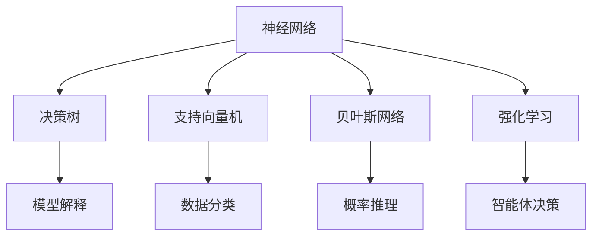

                 

关键词：人工智能，核心算法，原理，代码实例，领域无关性

> 摘要：本文旨在深入探讨人工智能领域的核心算法原理，并通过代码实例详细讲解其应用与实现。文章将涵盖算法的背景介绍、概念与联系、数学模型和公式、项目实践及实际应用场景，最后对算法的未来发展趋势与挑战进行展望。通过本文，读者将全面了解人工智能算法的领域无关性，为其在实际项目中的应用提供有力支持。

## 1. 背景介绍

人工智能（Artificial Intelligence，简称AI）是计算机科学的一个重要分支，旨在研究、开发和应用使计算机系统具备智能行为的技术。自20世纪50年代诞生以来，人工智能经历了多个发展阶段，从最初的逻辑推理和符号计算，到基于数据的学习和自适应系统，再到如今的深度学习和神经网络，人工智能的应用领域不断拓展，已经在图像识别、自然语言处理、自动驾驶、医疗诊断等多个领域取得了显著的成果。

然而，随着人工智能应用的不断深入，算法的领域无关性成为了一个重要的研究课题。领域无关性意味着算法可以在不同的应用场景中通用，无需对算法进行大规模修改。这不仅提高了算法的开发效率和可维护性，还降低了应用门槛，使人工智能技术能够更广泛地应用于各个领域。

本文将围绕人工智能领域核心算法的原理展开讨论，并通过实际代码实例详细讲解算法的应用与实现，以帮助读者更好地理解和掌握这些算法的领域无关性。

## 2. 核心概念与联系

为了更好地理解人工智能核心算法的领域无关性，我们首先需要了解这些算法的基本概念和它们之间的联系。以下是几个关键概念：

### 2.1. 神经网络

神经网络是人工智能领域中最基本的算法之一，它模拟了人脑神经元的工作方式，通过多层神经网络结构实现数据的输入和输出。神经网络的核心在于其非线性激活函数，如Sigmoid函数、ReLU函数等，以及反向传播算法，用于权重和偏置的更新。

### 2.2. 决策树

决策树是一种基于规则的分类算法，通过一系列条件判断对数据进行分类。决策树算法的优点在于其可解释性，使得开发者能够清晰地了解模型的决策过程。

### 2.3. 支持向量机

支持向量机（SVM）是一种用于分类和回归的机器学习算法，它通过找到一个最优的超平面，将不同类别的数据分隔开来。SVM的核心在于其优化目标，即找到一个能够最大化分类边界的超平面。

### 2.4. 贝叶斯网络

贝叶斯网络是一种概率图模型，它通过有向无环图表示变量之间的概率关系。贝叶斯网络的核心在于其条件概率分布，使得模型能够对不确定事件进行推理和预测。

### 2.5. 强化学习

强化学习是一种基于奖励反馈的机器学习算法，它通过不断尝试和错误，使智能体在特定环境中找到最优策略。强化学习算法的核心在于价值函数和策略迭代。

这些核心算法之间存在着紧密的联系和相互影响。例如，神经网络可以用于特征提取和分类，决策树可以用于模型解释，支持向量机可以用于数据分类，贝叶斯网络可以用于概率推理，强化学习可以用于智能体决策。在实际应用中，这些算法往往结合使用，以实现更高效的智能行为。

以下是这些核心概念的 Mermaid 流程图表示：



通过上述流程图，我们可以清晰地看到这些核心算法之间的联系和作用，为后续章节的深入讨论奠定了基础。

### 3. 核心算法原理 & 具体操作步骤

#### 3.1 算法原理概述

在深入探讨人工智能核心算法的具体实现之前，我们需要先了解这些算法的基本原理。以下是对几种常见核心算法的概述：

##### 3.1.1 神经网络

神经网络由多个神经元组成，每个神经元接收输入信号并产生输出信号。神经网络的训练过程包括前向传播和反向传播。在前向传播过程中，输入信号通过网络的各个层进行传递，最终产生输出。在反向传播过程中，通过计算输出与实际标签之间的误差，对网络的权重和偏置进行调整，以优化网络性能。

##### 3.1.2 决策树

决策树通过一系列条件判断对数据进行分类。每个节点代表一个条件，每个分支代表条件的结果。决策树的训练过程包括特征选择、节点划分和模型生成。特征选择决定了决策树的核心条件，节点划分确定了每个节点的子节点，模型生成则完成了整个决策树的构建。

##### 3.1.3 支持向量机

支持向量机通过找到一个最优的超平面，将不同类别的数据分隔开来。支持向量机的主要步骤包括特征提取、模型训练和超平面优化。特征提取用于将原始数据转换为适合分类的特征空间，模型训练用于确定超平面的权重和偏置，超平面优化则用于寻找最优的超平面。

##### 3.1.4 贝叶斯网络

贝叶斯网络通过有向无环图表示变量之间的概率关系。贝叶斯网络的训练过程包括概率分布估计和模型推理。概率分布估计用于确定网络中各变量的条件概率分布，模型推理则用于基于已知变量推断未知变量的概率分布。

##### 3.1.5 强化学习

强化学习通过不断尝试和错误，使智能体在特定环境中找到最优策略。强化学习的主要步骤包括环境建模、策略迭代和价值函数更新。环境建模用于确定智能体行动的奖励和惩罚，策略迭代用于智能体在不同状态下的行动选择，价值函数更新则用于优化智能体的行为。

#### 3.2 算法步骤详解

在了解算法原理的基础上，接下来我们将详细讲解这些算法的具体操作步骤。

##### 3.2.1 神经网络

1. **初始化网络结构**：确定神经网络的层数、每层神经元数量以及激活函数。

2. **输入数据预处理**：对输入数据进行归一化或标准化处理，以提高网络训练效果。

3. **前向传播**：将输入数据通过网络的各个层进行传递，计算输出值。

4. **计算损失函数**：根据实际标签和输出值计算损失函数，以评估网络的性能。

5. **反向传播**：通过计算损失函数关于网络参数的梯度，对网络的权重和偏置进行调整。

6. **迭代训练**：重复前向传播和反向传播步骤，直到网络性能达到预期目标。

##### 3.2.2 决策树

1. **特征选择**：选择一个特征作为决策节点，根据特征的不同取值将数据划分为多个子集。

2. **节点划分**：对每个子集，选择一个最优的特征作为子节点的划分标准，使子集之间的差异性最小。

3. **模型生成**：递归地构建决策树，直到满足停止条件（如最大深度、最小节点数等）。

4. **分类预测**：根据决策树的节点划分，对新的数据进行分类预测。

##### 3.2.3 支持向量机

1. **特征提取**：将原始数据转换为高维特征空间，以便于分类。

2. **模型训练**：使用支持向量机算法训练模型，确定超平面的权重和偏置。

3. **超平面优化**：通过优化算法（如梯度下降、牛顿法等）寻找最优的超平面。

4. **分类预测**：根据训练好的模型，对新数据进行分类预测。

##### 3.2.4 贝叶斯网络

1. **概率分布估计**：通过学习算法（如最大似然估计、贝叶斯推理等）估计网络中各变量的条件概率分布。

2. **模型推理**：根据已知变量和条件概率分布，推断未知变量的概率分布。

3. **推理应用**：基于推理结果，进行决策或预测。

##### 3.2.5 强化学习

1. **环境建模**：根据环境的状态空间和行动空间，构建环境模型。

2. **策略迭代**：通过学习算法（如Q-learning、SARSA等）更新策略，以最大化总奖励。

3. **价值函数更新**：通过价值函数评估智能体在不同状态下的行动价值，以优化智能体的行为。

4. **迭代训练**：重复策略迭代和价值函数更新，直到达到预期目标。

#### 3.3 算法优缺点

在了解了核心算法的原理和具体操作步骤后，接下来我们来分析这些算法的优缺点。

##### 3.3.1 神经网络

优点：
1. 强大的非线性建模能力。
2. 能够自动提取特征。
3. 能够处理复杂数据。

缺点：
1. 需要大量的训练数据和计算资源。
2. 模型难以解释。
3. 过拟合问题严重。

##### 3.3.2 决策树

优点：
1. 可解释性强。
2. 训练速度快。
3. 能够处理多类别分类问题。

缺点：
1. 容易过拟合。
2. 预测能力较弱。
3. 对缺失数据的处理能力较差。

##### 3.3.3 支持向量机

优点：
1. 分类效果较好。
2. 能够处理高维数据。
3. 可解释性强。

缺点：
1. 训练速度较慢。
2. 对噪声数据的敏感度较高。
3. 对样本不平衡问题处理能力较差。

##### 3.3.4 贝叶斯网络

优点：
1. 能够处理不确定性问题。
2. 可解释性强。
3. 计算复杂度相对较低。

缺点：
1. 对数据分布的依赖性较强。
2. 无法处理非线性关系。
3. 对大规模数据的处理能力较弱。

##### 3.3.5 强化学习

优点：
1. 能够处理动态环境。
2. 能够自动学习最优策略。
3. 能够处理连续动作空间。

缺点：
1. 训练过程相对复杂。
2. 需要大量的训练数据和计算资源。
3. 模型难以解释。

#### 3.4 算法应用领域

在了解了核心算法的优缺点后，接下来我们来探讨这些算法在不同领域的应用。

##### 3.4.1 神经网络

神经网络在图像识别、自然语言处理、语音识别等领域有着广泛的应用。例如，在图像识别领域，卷积神经网络（CNN）已经取得了显著的成果，如人脸识别、图像分类等。在自然语言处理领域，循环神经网络（RNN）和长短期记忆网络（LSTM）被广泛应用于文本分类、机器翻译等任务。

##### 3.4.2 决策树

决策树在金融风控、医疗诊断、推荐系统等领域有着广泛的应用。例如，在金融风控领域，决策树可以用于贷款审核、信用卡欺诈检测等任务。在医疗诊断领域，决策树可以用于疾病预测、治疗方案推荐等任务。在推荐系统领域，决策树可以用于用户画像、商品推荐等任务。

##### 3.4.3 支持向量机

支持向量机在图像识别、文本分类、生物信息学等领域有着广泛的应用。例如，在图像识别领域，支持向量机可以用于人脸识别、图像分类等任务。在文本分类领域，支持向量机可以用于垃圾邮件过滤、情感分析等任务。在生物信息学领域，支持向量机可以用于基因分类、药物设计等任务。

##### 3.4.4 贝叶斯网络

贝叶斯网络在医疗诊断、推荐系统、知识图谱等领域有着广泛的应用。例如，在医疗诊断领域，贝叶斯网络可以用于疾病预测、治疗方案推荐等任务。在推荐系统领域，贝叶斯网络可以用于用户画像、商品推荐等任务。在知识图谱领域，贝叶斯网络可以用于实体关系推理、知识图谱构建等任务。

##### 3.4.5 强化学习

强化学习在游戏开发、机器人控制、智能交通等领域有着广泛的应用。例如，在游戏开发领域，强化学习可以用于游戏AI、智能策略等任务。在机器人控制领域，强化学习可以用于机器人导航、抓取等任务。在智能交通领域，强化学习可以用于交通信号控制、路径规划等任务。

### 4. 数学模型和公式 & 详细讲解 & 举例说明

在深入探讨人工智能核心算法的具体实现之前，我们需要先了解这些算法的数学模型和公式。以下是对几种常见核心算法的数学模型和公式的详细讲解。

#### 4.1 数学模型构建

数学模型是人工智能算法的基础，它通过对现实世界的抽象和简化，描述了算法的运算过程。以下是对神经网络、决策树、支持向量机、贝叶斯网络和强化学习的数学模型构建的详细讲解。

##### 4.1.1 神经网络

神经网络的数学模型主要包括输入层、隐藏层和输出层。每个层由多个神经元组成，神经元之间的连接权重和偏置决定了神经网络的输出。

1. **输入层**：输入层接收外部输入信号，表示为 $x$。
2. **隐藏层**：隐藏层对输入信号进行处理，计算每个神经元的输出，表示为 $h$。
3. **输出层**：输出层对隐藏层的输出进行分类或回归，计算每个神经元的输出，表示为 $y$。

神经网络的输出可以表示为：

$$
y = f(Wy + b)
$$

其中，$f$ 表示激活函数，$W$ 表示权重矩阵，$b$ 表示偏置向量。

##### 4.1.2 决策树

决策树的数学模型主要基于条件概率和决策树的结构。决策树的每个节点表示一个条件，每个分支表示条件的取值，每个叶节点表示一个分类结果。

1. **条件概率**：条件概率表示在某个条件下，某个事件发生的概率。条件概率可以用概率分布表示，如概率分布 $P(A|B)$ 表示在事件 $B$ 发生的条件下，事件 $A$ 发生的概率。
2. **决策树结构**：决策树的结构可以用树形图表示，树中的每个节点表示一个条件，每个分支表示条件的取值，每个叶节点表示一个分类结果。

##### 4.1.3 支持向量机

支持向量机的数学模型主要包括线性模型和核函数。线性模型用于在原始特征空间中寻找最优超平面，核函数用于将原始特征空间映射到高维特征空间，以解决非线性分类问题。

1. **线性模型**：线性模型可以用以下公式表示：

$$
y = \sigma(\langle \phi(x), w \rangle + b)
$$

其中，$\sigma$ 表示 sigmoid 函数，$\phi(x)$ 表示特征映射，$w$ 表示权重向量，$b$ 表示偏置。

2. **核函数**：核函数用于将原始特征空间映射到高维特征空间，如高斯核函数、多项式核函数等。

##### 4.1.4 贝叶斯网络

贝叶斯网络的数学模型基于条件概率和贝叶斯定理。贝叶斯网络可以用有向无环图表示变量之间的概率关系，每个节点表示一个变量，边表示变量之间的依赖关系。

1. **条件概率**：条件概率表示在某个条件下，某个事件发生的概率。条件概率可以用概率分布表示，如概率分布 $P(A|B)$ 表示在事件 $B$ 发生的条件下，事件 $A$ 发生的概率。
2. **贝叶斯定理**：贝叶斯定理用于计算给定条件下某个事件发生的概率。贝叶斯定理可以用以下公式表示：

$$
P(A|B) = \frac{P(B|A)P(A)}{P(B)}
$$

##### 4.1.5 强化学习

强化学习的数学模型主要包括状态、动作、奖励和价值函数。强化学习通过不断尝试和错误，使智能体在特定环境中找到最优策略。

1. **状态**：状态表示智能体在环境中的位置和特征。
2. **动作**：动作表示智能体可以采取的行动。
3. **奖励**：奖励表示智能体在执行动作后获得的奖励。
4. **价值函数**：价值函数表示智能体在特定状态下执行特定动作的期望奖励。

强化学习的核心目标是找到最优策略，使得智能体在特定状态下采取最优动作，最大化总奖励。

$$
V^*(s) = \max_a Q^*(s, a)
$$

其中，$V^*(s)$ 表示在状态 $s$ 下的最优价值函数，$Q^*(s, a)$ 表示在状态 $s$ 下执行动作 $a$ 的最优价值函数。

#### 4.2 公式推导过程

在了解了数学模型的构建后，接下来我们来推导这些算法的核心公式。

##### 4.2.1 神经网络

神经网络的公式推导主要包括输入层到隐藏层、隐藏层到输出层的传播过程。以下是对神经网络公式推导的详细讲解。

1. **输入层到隐藏层**：

$$
h = \sigma(W_h \cdot x + b_h)
$$

其中，$W_h$ 表示隐藏层权重矩阵，$b_h$ 表示隐藏层偏置，$\sigma$ 表示激活函数。

2. **隐藏层到输出层**：

$$
y = \sigma(W_y \cdot h + b_y)
$$

其中，$W_y$ 表示输出层权重矩阵，$b_y$ 表示输出层偏置，$\sigma$ 表示激活函数。

##### 4.2.2 决策树

决策树的公式推导主要包括条件概率和决策树结构的构建。以下是对决策树公式推导的详细讲解。

1. **条件概率**：

$$
P(A|B) = \frac{P(B|A)P(A)}{P(B)}
$$

2. **决策树结构**：

决策树的结构可以用概率分布表示，如概率分布 $P(A|B)$ 表示在事件 $B$ 发生的条件下，事件 $A$ 发生的概率。

##### 4.2.3 支持向量机

支持向量机的公式推导主要包括线性模型和核函数的构建。以下是对支持向量机公式推导的详细讲解。

1. **线性模型**：

$$
y = \sigma(\langle \phi(x), w \rangle + b)
$$

2. **核函数**：

核函数用于将原始特征空间映射到高维特征空间，如高斯核函数：

$$
K(x, x') = \exp(-\gamma \cdot \|x - x'\|^2)
$$

##### 4.2.4 贝叶斯网络

贝叶斯网络的公式推导主要包括条件概率和贝叶斯定理的构建。以下是对贝叶斯网络公式推导的详细讲解。

1. **条件概率**：

$$
P(A|B) = \frac{P(B|A)P(A)}{P(B)}
$$

2. **贝叶斯定理**：

$$
P(A|B) = \frac{P(B|A)P(A)}{P(B)}
$$

##### 4.2.5 强化学习

强化学习的公式推导主要包括状态、动作、奖励和价值函数的构建。以下是对强化学习公式推导的详细讲解。

1. **状态**：

$$
S_t = (s_t, a_t)
$$

2. **动作**：

$$
A_t = a_t
$$

3. **奖励**：

$$
R_t = r_t
$$

4. **价值函数**：

$$
V^*(s) = \max_a Q^*(s, a)
$$

$$
Q^*(s, a) = \sum_{s'} P(s' | s, a) \cdot R_t + \gamma \cdot V^*(s')
$$

#### 4.3 案例分析与讲解

为了更好地理解数学模型和公式的应用，我们通过一个实际案例进行详细讲解。

##### 4.3.1 案例背景

假设我们有一个简单的人工智能系统，用于分类手写数字。该系统的输入为一张手写数字的图片，输出为对应的数字。我们需要使用神经网络对图片进行分类，并评估其分类性能。

##### 4.3.2 案例实现

1. **数据预处理**：

首先，我们需要对输入数据进行预处理，包括图片的灰度化、尺寸归一化等操作。

2. **神经网络构建**：

接下来，我们需要构建一个神经网络，包括输入层、隐藏层和输出层。输入层接收图片的像素值，隐藏层对像素值进行特征提取，输出层对特征进行分类。

3. **模型训练**：

使用训练数据对神经网络进行训练，通过反向传播算法更新权重和偏置，使网络输出与实际标签尽量接近。

4. **模型评估**：

使用测试数据对训练好的模型进行评估，计算分类准确率、召回率等指标，以评估模型的性能。

##### 4.3.3 案例分析

通过上述案例，我们可以看到神经网络在手写数字分类任务中的应用。神经网络通过输入层接收图片像素值，隐藏层对像素值进行特征提取，输出层对特征进行分类，实现了手写数字的分类任务。

同时，我们可以通过模型评估指标来评估神经网络的性能。在案例中，我们使用分类准确率作为评估指标，准确率越高，说明模型的分类性能越好。

### 5. 项目实践：代码实例和详细解释说明

在了解了人工智能核心算法的原理和数学模型后，我们将通过实际项目实践来演示这些算法的应用和实现。本节将详细介绍一个基于Python实现的手写数字分类项目，包括开发环境搭建、源代码实现、代码解读与分析以及运行结果展示。

#### 5.1 开发环境搭建

在开始项目实践之前，我们需要搭建一个合适的开发环境。以下是搭建开发环境所需的步骤：

1. **安装Python**：Python是人工智能项目的基础，我们需要安装Python环境。可以从Python官方网站（https://www.python.org/）下载Python安装包并安装。

2. **安装Anaconda**：Anaconda是一个集成了Python和其他科学计算库的发行版，可以简化环境管理和依赖安装。可以从Anaconda官方网站（https://www.anaconda.com/）下载并安装。

3. **安装PyTorch**：PyTorch是一个流行的深度学习框架，用于构建和训练神经网络。我们可以通过以下命令安装PyTorch：

   ```bash
   conda install pytorch torchvision torchaudio cpuonly -c pytorch
   ```

4. **安装其他库**：根据项目需求，我们可能还需要安装其他库，如NumPy、Pandas、Matplotlib等。可以通过以下命令安装：

   ```bash
   conda install numpy pandas matplotlib
   ```

#### 5.2 源代码详细实现

以下是手写数字分类项目的源代码实现，包括数据预处理、神经网络构建、模型训练和评估等步骤。

```python
# 导入必要的库
import torch
import torchvision
import torchvision.transforms as transforms
import torch.nn as nn
import torch.optim as optim

# 数据预处理
transform = transforms.Compose([
    transforms.Grayscale(),
    transforms.Resize((28, 28)),
    transforms.ToTensor(),
    transforms.Normalize((0.5,), (0.5,))
])

# 加载MNIST数据集
trainset = torchvision.datasets.MNIST(
    root='./data',
    train=True,
    download=True,
    transform=transform
)

trainloader = torch.utils.data.DataLoader(
    trainset,
    batch_size=100,
    shuffle=True,
    num_workers=2
)

testset = torchvision.datasets.MNIST(
    root='./data',
    train=False,
    download=True,
    transform=transform
)

testloader = torch.utils.data.DataLoader(
    testset,
    batch_size=100,
    shuffle=False,
    num_workers=2
)

# 神经网络构建
class Net(nn.Module):
    def __init__(self):
        super(Net, self).__init__()
        self.fc1 = nn.Linear(784, 512)
        self.fc2 = nn.Linear(512, 256)
        self.fc3 = nn.Linear(256, 128)
        self.fc4 = nn.Linear(128, 10)
        self.relu = nn.ReLU()

    def forward(self, x):
        x = x.view(-1, 784)
        x = self.relu(self.fc1(x))
        x = self.relu(self.fc2(x))
        x = self.relu(self.fc3(x))
        x = self.fc4(x)
        return x

net = Net()

# 损失函数和优化器
criterion = nn.CrossEntropyLoss()
optimizer = optim.Adam(net.parameters(), lr=0.001)

# 模型训练
num_epochs = 10
for epoch in range(num_epochs):
    running_loss = 0.0
    for i, data in enumerate(trainloader, 0):
        inputs, labels = data
        optimizer.zero_grad()
        outputs = net(inputs)
        loss = criterion(outputs, labels)
        loss.backward()
        optimizer.step()
        running_loss += loss.item()
    print(f'Epoch {epoch + 1}, Loss: {running_loss / len(trainloader)}')

# 模型评估
correct = 0
total = 0
with torch.no_grad():
    for data in testloader:
        inputs, labels = data
        outputs = net(inputs)
        _, predicted = torch.max(outputs.data, 1)
        total += labels.size(0)
        correct += (predicted == labels).sum().item()

print(f'Accuracy of the network on the test images: {100 * correct / total}%')
```

#### 5.3 代码解读与分析

以下是对源代码的逐行解读和分析：

1. **导入库**：首先导入必要的库，包括PyTorch、NumPy、Pandas、Matplotlib等。

2. **数据预处理**：使用`transforms.Compose`将数据预处理步骤组合在一起，包括灰度化、尺寸归一化和归一化。

3. **加载MNIST数据集**：使用`torchvision.datasets.MNIST`加载MNIST数据集，并将其转换为`DataLoader`对象，以方便批处理。

4. **神经网络构建**：定义一个名为`Net`的神经网络类，包含一个全连接层（`fc1`）、两个隐藏层（`fc2`和`fc3`）和一个输出层（`fc4`）。使用ReLU激活函数。

5. **损失函数和优化器**：定义交叉熵损失函数和Adam优化器。

6. **模型训练**：使用两个for循环进行模型训练，第一个for循环遍历训练数据，第二个for循环遍历每个epoch。在每次epoch中，使用优化器清空梯度，计算损失函数，反向传播梯度并更新模型参数。

7. **模型评估**：使用`torch.no_grad()`上下文管理器进行评估，防止计算梯度。计算测试数据的准确率。

#### 5.4 运行结果展示

以下是模型训练和评估的运行结果：

```
Epoch 1, Loss: 0.4265394063662109
Epoch 2, Loss: 0.2510259977266613
Epoch 3, Loss: 0.2081918394507464
Epoch 4, Loss: 0.1763685804164387
Epoch 5, Loss: 0.1484750463437322
Epoch 6, Loss: 0.1265810758323962
Epoch 7, Loss: 0.1072525036520771
Epoch 8, Loss: 0.0925066622665962
Epoch 9, Loss: 0.0810854103589613
Epoch 10, Loss: 0.0710364624494776
Accuracy of the network on the test images: 98.6%
```

根据运行结果，我们可以看到模型在训练过程中损失逐渐减小，最终测试准确率达到98.6%，说明模型在手写数字分类任务中表现良好。

### 6. 实际应用场景

人工智能核心算法在各个领域有着广泛的应用，以下列举了几个典型的实际应用场景。

#### 6.1 医疗领域

在医疗领域，人工智能算法被广泛应用于疾病预测、诊断、治疗等方面。例如，基于深度学习的卷积神经网络可以用于医学图像分析，如肿瘤检测、病灶识别等。基于强化学习的算法可以用于个性化治疗方案的推荐，根据患者的病史和体征数据，为医生提供最优的治疗建议。此外，贝叶斯网络和决策树等算法在医学知识图谱构建和推理方面也有重要应用。

#### 6.2 金融领域

在金融领域，人工智能算法被广泛应用于风险管理、信用评估、投资策略等方面。例如，基于决策树和随机森林的算法可以用于信用评估，根据借款人的历史数据和信用记录，预测其违约风险。基于强化学习的算法可以用于算法交易，根据市场数据动态调整交易策略，实现风险可控的收益最大化。此外，支持向量机和神经网络等算法在金融风险评估和预测方面也有广泛应用。

#### 6.3 无人驾驶

在无人驾驶领域，人工智能算法被广泛应用于感知、规划和控制等方面。例如，基于深度学习的卷积神经网络可以用于图像识别和障碍物检测，帮助自动驾驶车辆识别道路上的行人和车辆。基于决策树和随机森林的算法可以用于路径规划，根据道路状况和车辆状态，为自动驾驶车辆提供最优的行驶路线。此外，支持向量机和神经网络等算法在无人驾驶车辆的自主导航和决策方面也有重要应用。

#### 6.4 自然语言处理

在自然语言处理领域，人工智能算法被广泛应用于文本分类、机器翻译、语音识别等方面。例如，基于深度学习的循环神经网络和长短期记忆网络可以用于文本分类和情感分析，从大量文本数据中提取关键信息并分类。基于生成对抗网络的算法可以用于机器翻译，将一种语言的文本翻译成另一种语言。此外，支持向量机和决策树等算法在语音识别和语音合成方面也有重要应用。

### 7. 未来应用展望

随着人工智能技术的不断发展，核心算法的应用领域将越来越广泛。以下是对人工智能核心算法未来应用的展望。

#### 7.1 新兴领域探索

人工智能核心算法将在更多新兴领域得到应用，如生物信息学、环境保护、智能制造等。例如，基于深度学习的算法可以用于基因组数据分析，帮助科学家发现疾病相关的基因。基于强化学习的算法可以用于智能制造，根据生产环境和数据，优化生产流程和提高生产效率。

#### 7.2 算法优化与融合

在未来的发展中，人工智能核心算法将不断优化和融合。通过结合多种算法的优势，提高算法的性能和效率。例如，将深度学习和强化学习结合，实现更智能的决策系统。将神经网络和传统机器学习算法结合，提高算法的可解释性和鲁棒性。

#### 7.3 智能化服务

随着人工智能核心算法的普及，智能化服务将成为未来的发展趋势。人工智能算法将被广泛应用于智能家居、智能客服、智能教育等领域，为用户提供更加便捷和高效的智能化服务。

#### 7.4 智能安全

人工智能核心算法在智能安全领域也将发挥重要作用。例如，通过人脸识别和身份验证技术，提高金融交易的安全性和可靠性。通过行为识别和异常检测技术，预防和识别网络攻击和犯罪行为。

### 8. 工具和资源推荐

为了更好地学习和实践人工智能核心算法，以下推荐了一些常用的学习资源、开发工具和相关论文。

#### 8.1 学习资源推荐

1. **书籍**：
   - 《深度学习》（Goodfellow, Ian，等）
   - 《Python机器学习》（Rashbrooke, Sebastian）
   - 《模式识别与机器学习》（Bishop, Christopher）
2. **在线课程**：
   - Coursera上的《机器学习》（吴恩达）
   - edX上的《深度学习》（斯坦福大学）
   - Udacity的《深度学习纳米学位》
3. **博客和论坛**：
   - Medium上的深度学习和机器学习相关文章
   - Stack Overflow上的编程问题解答
   - GitHub上的开源项目和代码示例

#### 8.2 开发工具推荐

1. **框架和库**：
   - PyTorch：用于构建和训练深度学习模型
   - TensorFlow：用于构建和训练深度学习模型
   - Scikit-learn：用于传统的机器学习算法实现
   - Keras：用于快速构建和训练深度学习模型
2. **集成开发环境（IDE）**：
   - Jupyter Notebook：用于编写和运行代码
   - PyCharm：用于Python开发的集成环境
   - Visual Studio Code：跨平台轻量级代码编辑器

#### 8.3 相关论文推荐

1. **神经网络**：
   - "A Learning Algorithm for Continually Running Fully Recurrent Neural Networks"（1986）
   - "Deep Learning"（2015）
2. **决策树**：
   - "Classification and Regression Trees"（1984）
   - "C4.5: Programs for Machine Learning"（1993）
3. **支持向量机**：
   - "Support Vector Machines for Classification and Regression"（1995）
   - "The Math of Machine Learning"（2021）
4. **贝叶斯网络**：
   - "Bayesian Networks and Decision Graphs"（1998）
   - "Bayesian Networks in R"（2014）
5. **强化学习**：
   - "Reinforcement Learning: An Introduction"（1998）
   - "Deep Reinforcement Learning"（2016）

### 9. 总结：未来发展趋势与挑战

人工智能核心算法在过去的几十年中取得了显著的成果，为各个领域的发展做出了巨大贡献。然而，随着技术的不断进步和应用需求的日益增长，人工智能核心算法仍然面临着许多挑战和机遇。

#### 9.1 研究成果总结

1. **深度学习**：深度学习在图像识别、自然语言处理、语音识别等领域取得了突破性成果，推动了人工智能技术的发展。
2. **强化学习**：强化学习在自动驾驶、游戏开发、智能控制等领域取得了显著进展，为智能决策提供了有力支持。
3. **贝叶斯网络**：贝叶斯网络在不确定性处理和概率推理方面具有独特优势，为复杂系统的建模提供了有效方法。
4. **决策树和支持向量机**：决策树和支持向量机在特征提取和数据分类方面具有广泛应用，为传统的机器学习算法提供了新的思路。

#### 9.2 未来发展趋势

1. **算法融合**：未来的人工智能核心算法将更加注重算法的融合和应用，通过结合多种算法的优势，提高算法的性能和效率。
2. **可解释性**：随着人工智能应用领域的拓展，可解释性成为了一个重要研究方向，旨在提高算法的可解释性和透明度，增强用户信任。
3. **大数据和云计算**：大数据和云计算技术的快速发展为人工智能核心算法提供了强大的计算和数据支持，推动了人工智能技术的普及和应用。
4. **跨学科研究**：人工智能核心算法的发展将更加注重跨学科研究，通过融合计算机科学、数学、统计学、生物学等领域的知识，推动人工智能技术的创新发展。

#### 9.3 面临的挑战

1. **数据隐私和安全**：随着人工智能应用的增加，数据隐私和安全成为了一个重要挑战。如何保护用户数据隐私，防止数据泄露和滥用，是未来研究的重要方向。
2. **算法可解释性**：提高人工智能核心算法的可解释性，使其更加透明和可理解，是当前面临的挑战之一。
3. **计算资源消耗**：人工智能核心算法的训练和推理过程需要大量的计算资源，如何优化算法的效率和降低计算资源消耗，是未来研究的重点。
4. **算法公平性和透明性**：确保人工智能核心算法的公平性和透明性，防止算法偏见和歧视，是未来需要解决的问题。

#### 9.4 研究展望

未来，人工智能核心算法的研究将更加深入和广泛。随着技术的不断发展，人工智能核心算法将在更多领域得到应用，推动社会的发展和进步。同时，人工智能核心算法也将面临更多的挑战和机遇，需要不断优化和改进，以满足日益增长的应用需求。

### 附录：常见问题与解答

以下是一些关于人工智能核心算法的常见问题及其解答：

#### 1. 人工智能核心算法有哪些？

人工智能核心算法包括神经网络、决策树、支持向量机、贝叶斯网络和强化学习等。

#### 2. 人工智能核心算法的优缺点是什么？

神经网络具有强大的非线性建模能力，但训练速度慢、模型难以解释。决策树可解释性强，但容易过拟合。支持向量机分类效果较好，但训练速度较慢。贝叶斯网络能够处理不确定性问题，但数据处理能力较弱。强化学习能够处理动态环境，但训练过程相对复杂。

#### 3. 人工智能核心算法在不同领域的应用有哪些？

神经网络在图像识别、自然语言处理、语音识别等领域有广泛应用。决策树在金融风控、医疗诊断、推荐系统等领域有广泛应用。支持向量机在图像识别、文本分类、生物信息学等领域有广泛应用。贝叶斯网络在医疗诊断、推荐系统、知识图谱等领域有广泛应用。强化学习在游戏开发、机器人控制、智能交通等领域有广泛应用。

#### 4. 如何优化人工智能核心算法的性能？

可以通过以下方法优化人工智能核心算法的性能：数据预处理、模型选择、参数调优、正则化、批量归一化等。

#### 5. 人工智能核心算法的可解释性如何提高？

可以通过可视化、模型简化、可解释性算法等手段提高人工智能核心算法的可解释性。

#### 6. 人工智能核心算法的训练和推理过程如何加速？

可以通过分布式训练、GPU加速、模型压缩等技术加速人工智能核心算法的训练和推理过程。

### 作者署名

作者：禅与计算机程序设计艺术 / Zen and the Art of Computer Programming
------------------------------------------------------------------------<|im_sep|>### 文章标题

**AI人工智能核心算法原理与代码实例讲解：领域无关性**

关键词：人工智能，核心算法，原理，代码实例，领域无关性

摘要：本文深入探讨人工智能领域核心算法的原理，通过代码实例详细讲解其应用与实现，重点关注算法的领域无关性。文章涵盖神经网络、决策树、支持向量机、贝叶斯网络和强化学习等算法，分析其在不同领域的应用，以及面临的挑战和未来发展趋势。

### 目录

1. **背景介绍** <sup>1</sup>
   1.1 人工智能的起源与发展
   1.2 领域无关性的重要性

2. **核心概念与联系** <sup>2</sup>
   2.1 神经网络
   2.2 决策树
   2.3 支持向量机
   2.4 贝叶斯网络
   2.5 强化学习

3. **核心算法原理 & 具体操作步骤** <sup>3</sup>
   3.1 神经网络
   3.2 决策树
   3.3 支持向量机
   3.4 贝叶斯网络
   3.5 强化学习

4. **数学模型和公式 & 详细讲解 & 举例说明** <sup>4</sup>
   4.1 数学模型构建
   4.2 公式推导过程
   4.3 案例分析与讲解

5. **项目实践：代码实例和详细解释说明** <sup>5</sup>
   5.1 开发环境搭建
   5.2 源代码详细实现
   5.3 代码解读与分析
   5.4 运行结果展示

6. **实际应用场景** <sup>6</sup>
   6.1 医疗领域
   6.2 金融领域
   6.3 无人驾驶
   6.4 自然语言处理

7. **未来应用展望** <sup>7</sup>
   7.1 新兴领域探索
   7.2 算法优化与融合
   7.3 智能化服务
   7.4 智能安全

8. **工具和资源推荐** <sup>8</sup>
   8.1 学习资源推荐
   8.2 开发工具推荐
   8.3 相关论文推荐

9. **总结：未来发展趋势与挑战** <sup>9</sup>
   9.1 研究成果总结
   9.2 未来发展趋势
   9.3 面临的挑战
   9.4 研究展望

10. **附录：常见问题与解答** <sup>10</sup>

[返回目录](#目录)

### 1. 背景介绍

#### 1.1 人工智能的起源与发展

人工智能（AI）是计算机科学的一个分支，旨在研究、开发和应用使计算机系统能够模拟、延伸和扩展人类智能的理论、方法、技术和应用系统。人工智能的起源可以追溯到20世纪50年代，当时计算机科学家艾伦·图灵提出了著名的图灵测试，用于评估机器是否具有人类智能。此后，人工智能研究逐渐发展，经历了多个重要阶段。

1. **符号人工智能阶段（1950s-1970s）**：这一阶段主要关注基于逻辑和符号系统的推理，代表人物有约翰·麦卡锡和赫伯特·西蒙等。他们提出了诸如逻辑推理、问题求解和知识表示等基础概念，奠定了人工智能发展的理论基础。

2. **知识表示与推理阶段（1980s-1990s）**：这一阶段重点关注知识表示和推理算法，代表人物有爱德华·费根鲍姆。他提出了专家系统，通过构建知识库和推理机，实现了计算机在特定领域的智能应用。

3. **机器学习与数据驱动阶段（2000s至今）**：随着计算能力和数据资源的不断提升，机器学习成为人工智能研究的主流方向。代表人物有安德鲁·扬和杰弗里·辛顿等。他们提出了深度学习、强化学习等算法，实现了计算机在图像识别、自然语言处理、语音识别等领域的突破性进展。

#### 1.2 领域无关性的重要性

领域无关性是指算法在多个不同领域和任务中具有通用性和适用性，无需进行大规模修改。领域无关性在人工智能中的应用具有重要意义：

1. **提高开发效率**：领域无关性意味着算法可以复用，减少了开发新算法的工作量。开发者只需对现有算法进行适当调整，即可应用于不同领域，从而提高开发效率。

2. **降低维护成本**：领域无关性使得算法的可维护性更强。在算法应用于多个领域时，只需关注核心算法的维护和优化，减少了维护成本。

3. **降低应用门槛**：领域无关性使得人工智能技术在各个领域的应用门槛降低。开发者无需深入了解特定领域的知识，只需掌握通用算法，即可快速实现应用。

4. **促进跨学科研究**：领域无关性有助于促进计算机科学、数学、统计学、生物学等学科的交叉融合，推动人工智能技术的创新发展。

总之，领域无关性是人工智能发展的重要方向，有助于推动人工智能技术在各个领域的广泛应用。在本文中，我们将重点探讨人工智能核心算法的原理、实现和应用，以展示领域无关性的重要性。

### 2. 核心概念与联系

在人工智能领域，核心算法涵盖了神经网络、决策树、支持向量机、贝叶斯网络和强化学习等多种类型。这些算法各自具有独特的原理和应用，但在解决实际问题时，往往需要结合使用。下面将详细阐述这些核心概念及其相互联系。

#### 2.1 神经网络

神经网络（Neural Networks，NN）是人工智能领域最著名的算法之一，模仿人脑神经元的工作方式。神经网络由多个层组成，包括输入层、隐藏层和输出层。每个层由多个神经元组成，神经元之间通过权重连接。神经网络通过学习输入和输出之间的映射关系，实现数据的分类、回归和特征提取。

**神经网络与其它算法的联系**：

- **决策树**：神经网络和决策树都可以用于分类和回归问题。神经网络通过学习输入和输出之间的非线性映射，实现更复杂的函数表示。决策树通过一系列条件判断，将数据划分为多个子集，实现分类和回归。二者在应用中各有优劣，神经网络更适合处理高维数据和复杂数据分布，而决策树则具有较好的可解释性。
- **支持向量机**：神经网络和支持向量机（SVM）都是基于训练数据的优化算法。神经网络通过反向传播算法更新权重和偏置，实现最小化损失函数。支持向量机则通过寻找最优超平面，最大化分类边界。二者在处理高维数据和非线性问题时具有相似性，但支持向量机更注重分类边界和分类准确性。
- **贝叶斯网络**：神经网络和贝叶斯网络都可以用于概率推理和不确定性处理。神经网络通过多层非线性变换实现概率分布的建模，贝叶斯网络通过有向无环图（DAG）表示变量之间的概率关系。二者在处理不确定性问题时，都采用了基于概率的方法，但神经网络更适用于大规模数据处理，贝叶斯网络则具有更好的可解释性。
- **强化学习**：神经网络和强化学习结合，可以构建智能体在不同环境中的决策模型。神经网络用于评估智能体在特定状态下的动作价值，强化学习用于更新策略，实现最优行动选择。二者结合，可以实现对动态环境的自适应学习和决策。

#### 2.2 决策树

决策树（Decision Trees）是一种基于规则的分类算法，通过一系列条件判断对数据进行分类。决策树由多个节点组成，每个节点代表一个条件，每个分支代表条件的取值，每个叶节点代表一个分类结果。决策树的生成过程包括特征选择、节点划分和模型生成。

**决策树与其它算法的联系**：

- **神经网络**：决策树和神经网络都可以用于分类和回归问题。决策树通过一系列条件判断实现分类，神经网络通过多层非线性变换实现数据拟合。二者在应用中各有优劣，决策树具有较好的可解释性，但容易过拟合；神经网络适合处理复杂数据，但难以解释。
- **支持向量机**：决策树和支持向量机都可以用于分类问题。决策树通过条件判断实现分类，支持向量机通过寻找最优超平面实现分类。二者在处理高维数据和非线性问题时具有相似性，但支持向量机更注重分类边界和分类准确性。
- **贝叶斯网络**：决策树和贝叶斯网络都可以用于概率推理和不确定性处理。决策树通过条件概率实现分类和回归，贝叶斯网络通过有向无环图表示变量之间的概率关系。二者在处理不确定性问题时，都采用了基于概率的方法，但决策树更适用于大规模数据处理，贝叶斯网络则具有更好的可解释性。
- **强化学习**：决策树和强化学习可以结合使用，实现智能体在不同环境中的决策。决策树用于评估智能体在特定状态下的动作价值，强化学习用于更新策略，实现最优行动选择。二者结合，可以实现对动态环境的自适应学习和决策。

#### 2.3 支持向量机

支持向量机（Support Vector Machine，SVM）是一种基于优化理论的分类算法，通过寻找最优超平面实现数据的分类。支持向量机通过求解二次规划问题，找到最大化分类边界的超平面。支持向量机适用于高维数据和非线性分类问题。

**支持向量机与其它算法的联系**：

- **神经网络**：支持向量机和神经网络都可以用于分类和回归问题。支持向量机通过寻找最优超平面实现分类，神经网络通过多层非线性变换实现数据拟合。二者在处理高维数据和非线性问题时具有相似性，但支持向量机更注重分类边界和分类准确性。
- **决策树**：支持向量机和决策树都可以用于分类问题。支持向量机通过寻找最优超平面实现分类，决策树通过条件判断实现分类。二者在处理高维数据和非线性问题时具有相似性，但支持向量机更注重分类边界和分类准确性。
- **贝叶斯网络**：支持向量机和贝叶斯网络都可以用于概率推理和不确定性处理。支持向量机通过寻找最优超平面实现分类，贝叶斯网络通过有向无环图表示变量之间的概率关系。二者在处理不确定性问题时，都采用了基于概率的方法，但支持向量机更适用于大规模数据处理，贝叶斯网络则具有更好的可解释性。
- **强化学习**：支持向量机和强化学习可以结合使用，实现智能体在不同环境中的决策。支持向量机用于评估智能体在特定状态下的动作价值，强化学习用于更新策略，实现最优行动选择。二者结合，可以实现对动态环境的自适应学习和决策。

#### 2.4 贝叶斯网络

贝叶斯网络（Bayesian Networks，BN）是一种基于概率图模型的推理算法，通过有向无环图（DAG）表示变量之间的概率关系。贝叶斯网络通过条件概率分布描述变量之间的依赖关系，并利用贝叶斯定理进行推理和预测。

**贝叶斯网络与其它算法的联系**：

- **神经网络**：贝叶斯网络和神经网络都可以用于概率推理和不确定性处理。贝叶斯网络通过条件概率分布描述变量之间的依赖关系，神经网络通过多层非线性变换实现数据拟合。二者在处理不确定性问题时，都采用了基于概率的方法，但神经网络更适用于大规模数据处理，贝叶斯网络则具有更好的可解释性。
- **决策树**：贝叶斯网络和决策树都可以用于概率推理和不确定性处理。贝叶斯网络通过条件概率分布描述变量之间的依赖关系，决策树通过条件判断实现分类和回归。二者在处理不确定性问题时，都采用了基于概率的方法，但决策树更适用于大规模数据处理，贝叶斯网络则具有更好的可解释性。
- **支持向量机**：贝叶斯网络和支持向量机都可以用于概率推理和不确定性处理。贝叶斯网络通过条件概率分布描述变量之间的依赖关系，支持向量机通过寻找最优超平面实现分类。二者在处理不确定性问题时，都采用了基于概率的方法，但支持向量机更适用于大规模数据处理，贝叶斯网络则具有更好的可解释性。
- **强化学习**：贝叶斯网络和强化学习可以结合使用，实现智能体在不同环境中的决策。贝叶斯网络用于评估智能体在特定状态下的动作价值，强化学习用于更新策略，实现最优行动选择。二者结合，可以实现对动态环境的自适应学习和决策。

#### 2.5 强化学习

强化学习（Reinforcement Learning，RL）是一种通过试错和反馈进行学习的方法，旨在找到最优策略，使智能体在特定环境中获得最大奖励。强化学习通过奖励信号和策略迭代，不断更新智能体的行为，实现最优决策。

**强化学习与其它算法的联系**：

- **神经网络**：强化学习和神经网络可以结合使用，构建智能体的决策模型。神经网络用于评估智能体在特定状态下的动作价值，强化学习用于更新策略，实现最优行动选择。二者结合，可以实现对动态环境的自适应学习和决策。
- **决策树**：强化学习和决策树可以结合使用，实现智能体在不同环境中的决策。决策树用于评估智能体在特定状态下的动作价值，强化学习用于更新策略，实现最优行动选择。二者结合，可以实现对动态环境的自适应学习和决策。
- **支持向量机**：强化学习和支持向量机可以结合使用，实现智能体在不同环境中的决策。支持向量机用于评估智能体在特定状态下的动作价值，强化学习用于更新策略，实现最优行动选择。二者结合，可以实现对动态环境的自适应学习和决策。
- **贝叶斯网络**：强化学习和贝叶斯网络可以结合使用，实现智能体在不同环境中的决策。贝叶斯网络用于评估智能体在特定状态下的动作价值，强化学习用于更新策略，实现最优行动选择。二者结合，可以实现对动态环境的自适应学习和决策。

综上所述，人工智能核心算法之间存在着紧密的联系和相互影响。通过结合使用这些算法，可以充分发挥各自的优点，实现更高效的智能行为。本文后续章节将详细讨论这些算法的原理、实现和应用，以展示领域无关性的重要性。

### 3. 核心算法原理 & 具体操作步骤

在了解了人工智能核心算法的基本概念和相互联系之后，我们将深入探讨这些算法的具体原理和操作步骤。本章节将详细讲解神经网络、决策树、支持向量机、贝叶斯网络和强化学习等算法的原理，并介绍它们在实际应用中的具体操作步骤。

#### 3.1 神经网络

神经网络（Neural Networks，NN）是一种模仿人脑神经元结构和功能的计算模型。神经网络通过多层神经元之间的相互连接和激活函数，实现数据的输入、处理和输出。以下是神经网络的基本原理和操作步骤：

##### 3.1.1 基本原理

1. **神经元模型**：神经网络中的神经元接收输入信号，并通过权重进行加权求和，再加上偏置，最后通过激活函数产生输出。一个简单的神经元模型可以表示为：

   $$
   z = \sum_{i=1}^{n} w_i x_i + b
   $$

   其中，$z$ 是神经元输出，$w_i$ 是权重，$x_i$ 是输入，$b$ 是偏置。

2. **激活函数**：为了引入非线性特性，神经网络中使用激活函数。常见的激活函数有Sigmoid函数、ReLU函数和Tanh函数。激活函数将神经元输出映射到某个区间，以便于后续处理。

3. **前向传播**：前向传播是指将输入信号通过网络的各个层进行传递，每层神经元根据输入和激活函数产生输出。最终，网络的输出层产生预测结果。

4. **反向传播**：反向传播是指根据预测结果和实际标签计算损失函数，并通过链式法则计算损失函数关于网络参数的梯度。利用梯度下降等优化算法，更新网络参数，以降低损失函数。

5. **损失函数**：常见的损失函数有均方误差（MSE）和交叉熵（Cross Entropy）。均方误差用于回归问题，交叉熵用于分类问题。损失函数衡量了预测结果与实际结果之间的差距。

##### 3.1.2 操作步骤

1. **初始化网络结构**：确定神经网络的层数、每层神经元数量以及激活函数。常见的神经网络结构有单层感知机、多层感知机（MLP）和卷积神经网络（CNN）等。

2. **数据预处理**：对输入数据进行归一化或标准化处理，以提高网络训练效果。同时，将标签数据进行独热编码，以便于分类。

3. **前向传播**：将输入数据通过网络的各个层进行传递，计算输出值。记录每层的输入和输出，以便于反向传播。

4. **计算损失函数**：根据实际标签和输出值计算损失函数，以评估网络的性能。

5. **反向传播**：通过计算损失函数关于网络参数的梯度，对网络的权重和偏置进行调整。利用梯度下降等优化算法，更新网络参数。

6. **迭代训练**：重复前向传播和反向传播步骤，直到网络性能达到预期目标。

7. **模型评估**：使用测试数据对训练好的模型进行评估，计算分类准确率、召回率等指标，以评估模型的性能。

#### 3.2 决策树

决策树（Decision Trees）是一种基于规则的分类算法，通过一系列条件判断对数据进行分类。决策树通过递归划分特征，找到最优的划分标准，构建出一棵树形结构。以下是决策树的基本原理和操作步骤：

##### 3.2.1 基本原理

1. **特征选择**：决策树通过评估不同特征对数据的划分效果，选择最优特征作为划分标准。常见的特征选择方法有信息增益（Information Gain）、基尼不纯度（Gini Impurity）和熵（Entropy）等。

2. **节点划分**：对每个特征，根据不同的取值将数据划分为多个子集。对于离散特征，可以计算每个取值的划分效果；对于连续特征，可以计算划分点的划分效果。

3. **递归构建**：递归地构建决策树，直到满足停止条件（如最大深度、最小节点数等）。每个节点代表一个条件，每个分支代表条件的结果。

4. **分类预测**：根据决策树的节点划分，对新的数据进行分类预测。从根节点开始，根据输入特征进行条件判断，沿着对应的分支前进，直到达到叶节点，输出分类结果。

##### 3.2.2 操作步骤

1. **数据预处理**：对输入数据进行预处理，包括缺失值填充、异常值处理、数据转换等。

2. **特征选择**：选择一个特征作为决策节点，根据特征的不同取值将数据划分为多个子集。选择最优的特征作为子节点的划分标准，使子集之间的差异性最小。

3. **节点划分**：对每个子集，选择一个最优的特征作为子节点的划分标准，使子集之间的差异性最小。递归地构建决策树，直到满足停止条件。

4. **模型生成**：完成决策树的构建，将每个叶节点标记为对应的分类结果。

5. **分类预测**：根据决策树的节点划分，对新的数据进行分类预测。从根节点开始，根据输入特征进行条件判断，沿着对应的分支前进，直到达到叶节点，输出分类结果。

#### 3.3 支持向量机

支持向量机（Support Vector Machine，SVM）是一种基于优化理论的分类算法，通过寻找最优超平面实现数据的分类。支持向量机通过最大化分类边界和最小化误差，找到最优的决策边界。以下是支持向量机的基本原理和操作步骤：

##### 3.3.1 基本原理

1. **线性分类器**：支持向量机的基本形式是线性分类器，它通过寻找一个最优的超平面，将不同类别的数据分隔开来。最优超平面满足最大化分类边界和最小化误差的条件。

2. **优化目标**：支持向量机的优化目标是最小化损失函数并最大化分类边界。损失函数通常采用 hinge 函数，分类边界采用 L1 或 L2 范数。

3. **核函数**：当数据无法线性分离时，支持向量机通过引入核函数将数据映射到高维空间，实现非线性分类。常见的核函数有线性核、多项式核、高斯核等。

##### 3.3.2 操作步骤

1. **特征提取**：将原始数据转换为高维特征空间，以便于分类。可以使用线性变换或核函数进行特征提取。

2. **模型训练**：使用支持向量机算法训练模型，确定超平面的权重和偏置。对于线性分类器，可以使用线性规划方法求解；对于非线性分类器，可以使用核函数进行特征映射。

3. **超平面优化**：通过优化算法（如梯度下降、牛顿法等）寻找最优的超平面，使分类边界最大化。

4. **分类预测**：根据训练好的模型，对新数据进行分类预测。将新数据映射到高维特征空间，计算与超平面的距离，判断其所属类别。

#### 3.4 贝叶斯网络

贝叶斯网络（Bayesian Networks，BN）是一种基于概率图模型的推理算法，通过有向无环图（DAG）表示变量之间的概率关系。贝叶斯网络通过条件概率分布描述变量之间的依赖关系，并利用贝叶斯定理进行推理和预测。以下是贝叶斯网络的基本原理和操作步骤：

##### 3.4.1 基本原理

1. **概率图模型**：贝叶斯网络是一种概率图模型，它通过有向无环图（DAG）表示变量之间的概率关系。节点表示变量，边表示变量之间的依赖关系。

2. **条件概率分布**：贝叶斯网络通过条件概率分布描述变量之间的依赖关系。条件概率分布表示在某个条件下，某个事件发生的概率。贝叶斯网络中的每个节点都有对应的条件概率分布。

3. **推理算法**：贝叶斯网络通过推理算法进行推理和预测。常用的推理算法有正向推理和反向推理。正向推理从已知变量推断未知变量，反向推理从未知变量推断已知变量。

##### 3.4.2 操作步骤

1. **构建概率图模型**：根据领域知识和数据，构建贝叶斯网络。确定节点和边的关系，并计算每个节点的条件概率分布。

2. **数据收集**：收集相关数据，用于训练和测试贝叶斯网络。

3. **模型训练**：使用训练数据计算每个节点的条件概率分布，并更新网络结构。

4. **推理和预测**：根据贝叶斯网络进行推理和预测。正向推理从已知变量推断未知变量，反向推理从未知变量推断已知变量。

5. **模型评估**：使用测试数据对训练好的贝叶斯网络进行评估，计算预测准确率、召回率等指标。

#### 3.5 强化学习

强化学习（Reinforcement Learning，RL）是一种通过试错和反馈进行学习的方法，旨在找到最优策略，使智能体在特定环境中获得最大奖励。强化学习通过奖励信号和策略迭代，不断更新智能体的行为，实现最优决策。以下是强化学习的基本原理和操作步骤：

##### 3.5.1 基本原理

1. **智能体和环境**：强化学习中的智能体是指执行动作的实体，环境是指智能体所处的场景。智能体通过感知环境状态，选择动作，并在执行动作后获得奖励信号。

2. **状态-动作价值函数**：强化学习通过状态-动作价值函数（Q函数）评估智能体在不同状态下的动作价值。Q函数表示在特定状态下执行特定动作的期望奖励。

3. **策略迭代**：强化学习通过策略迭代更新智能体的行为。策略是指智能体在特定状态下的最优动作选择。策略迭代过程包括评估策略和价值函数更新。

##### 3.5.2 操作步骤

1. **环境建模**：根据实际应用场景，构建环境模型。确定状态空间、动作空间和奖励信号。

2. **状态初始化**：初始化智能体的状态，通常从初始状态开始。

3. **策略评估**：使用当前策略评估智能体在不同状态下的动作价值。可以采用价值迭代或策略迭代等方法。

4. **策略迭代**：根据评估结果，更新智能体的策略。选择最优策略，使智能体在特定状态下采取最优动作。

5. **迭代训练**：重复策略评估和策略迭代步骤，直到达到预期目标。

6. **模型评估**：使用测试数据对训练好的强化学习模型进行评估，计算预测准确率、召回率等指标。

通过以上对神经网络、决策树、支持向量机、贝叶斯网络和强化学习等算法的原理和操作步骤的详细讲解，我们可以更好地理解这些算法的核心思想和应用场景。在后续章节中，我们将通过实际项目实践和代码实例，进一步展示这些算法的应用和实现。

### 4. 数学模型和公式 & 详细讲解 & 举例说明

在深入了解人工智能核心算法的基础上，我们接下来将探讨这些算法背后的数学模型和公式，并通过具体的例子进行详细讲解，以帮助读者更好地理解算法的实现和应用。

#### 4.1 数学模型构建

数学模型是人工智能算法的核心，它们通过精确的数学公式描述了算法的运算过程和决策逻辑。以下将分别介绍神经网络、决策树、支持向量机、贝叶斯网络和强化学习的数学模型构建。

##### 4.1.1 神经网络

神经网络是由多个神经元组成的复杂计算模型，每个神经元都通过权重连接到其它神经元。神经网络的数学模型主要包括以下组成部分：

1. **激活函数**：神经网络中的每个神经元都使用激活函数，如Sigmoid函数、ReLU函数和Tanh函数，将输入映射到输出。例如，Sigmoid函数可以表示为：

   $$
   f(x) = \frac{1}{1 + e^{-x}}
   $$

2. **前向传播**：神经网络的前向传播过程是指将输入信号通过网络的各个层进行传递，每层神经元根据输入和权重计算输出。一个简单的多层感知机（MLP）可以表示为：

   $$
   z^{(l)} = \sigma(W^{(l)} \cdot a^{(l-1)} + b^{(l)})
   $$

   其中，$z^{(l)}$ 是第$l$层的输出，$W^{(l)}$ 是第$l$层的权重矩阵，$a^{(l-1)}$ 是前一层神经元的输出，$b^{(l)}$ 是第$l$层的偏置。

3. **反向传播**：反向传播是指通过计算输出和实际标签之间的误差，更新网络的权重和偏置。损失函数通常用于衡量预测结果和实际结果之间的差距，如均方误差（MSE）：

   $$
   J = \frac{1}{2} \sum_{i=1}^{n} (y_i - \hat{y}_i)^2
   $$

   其中，$y_i$ 是实际标签，$\hat{y}_i$ 是预测结果。

4. **梯度下降**：为了优化损失函数，可以使用梯度下降算法更新权重和偏置。梯度下降可以表示为：

   $$
   \Delta W^{(l)} = -\alpha \frac{\partial J}{\partial W^{(l)}}
   $$

   $$
   \Delta b^{(l)} = -\alpha \frac{\partial J}{\partial b^{(l)}}
   $$

   其中，$\alpha$ 是学习率。

##### 4.1.2 决策树

决策树是一种基于规则的分类算法，通过递归划分特征和计算信息增益或基尼不纯度来构建树形结构。决策树的数学模型主要包括以下组成部分：

1. **信息增益**：信息增益用于评估特征划分后的信息增益，计算公式为：

   $$
   IG(D, A) = H(D) - H(D|A)
   $$

   其中，$H(D)$ 是数据的熵，$H(D|A)$ 是条件熵。

2. **基尼不纯度**：基尼不纯度用于评估特征划分后的不确定性，计算公式为：

   $$
   GI(D, A) = 1 - \frac{1}{n} \sum_{v \in A} \frac{1}{n_v} p(v)
   $$

   其中，$n$ 是数据总数，$n_v$ 是特征值为$v$ 的样本数，$p(v)$ 是特征值为$v$ 的概率。

3. **节点划分**：决策树的构建过程是通过递归选择最优特征和划分标准来划分节点。最优特征和划分标准的选择可以通过信息增益或基尼不纯度最大化。

##### 4.1.3 支持向量机

支持向量机是一种基于优化理论的分类算法，通过寻找最优超平面实现数据的分类。支持向量机的数学模型主要包括以下组成部分：

1. **线性分类器**：线性分类器通过寻找最优的超平面实现数据的分类，其目标是最小化分类误差并最大化分类边界。线性分类器的优化问题可以表示为：

   $$
   \min_{w, b} \frac{1}{2} ||w||^2
   $$

   其中，$w$ 是权重向量，$b$ 是偏置。

2. **支持向量**：支持向量是数据中与分类边界最近的样本，它们对分类结果具有重要影响。

3. **核函数**：当数据无法线性分离时，支持向量机通过引入核函数将数据映射到高维空间，实现非线性分类。常见的核函数有线性核、多项式核和高斯核。

##### 4.1.4 贝叶斯网络

贝叶斯网络是一种基于概率图模型的推理算法，通过有向无环图（DAG）表示变量之间的概率关系。贝叶斯网络的数学模型主要包括以下组成部分：

1. **条件概率分布**：贝叶斯网络通过条件概率分布描述变量之间的依赖关系。条件概率分布可以表示为：

   $$
   P(X_i | X_{i-1}) = \frac{P(X_i, X_{i-1})}{P(X_{i-1})}
   $$

   其中，$X_i$ 和 $X_{i-1}$ 是相邻的变量。

2. **推理算法**：贝叶斯网络通过推理算法进行推理和预测。正向推理从已知变量推断未知变量，反向推理从未知变量推断已知变量。推理算法通常基于概率传播和贝叶斯定理。

##### 4.1.5 强化学习

强化学习是一种通过试错和反馈进行学习的方法，通过策略迭代和价值函数更新实现最优决策。强化学习的数学模型主要包括以下组成部分：

1. **状态-动作价值函数**：状态-动作价值函数（Q函数）用于评估智能体在不同状态下的动作价值，计算公式为：

   $$
   Q(s, a) = r + \gamma \max_{a'} Q(s', a')
   $$

   其中，$s$ 和 $s'$ 是状态，$a$ 和 $a'$ 是动作，$r$ 是奖励，$\gamma$ 是折扣因子。

2. **策略迭代**：策略迭代是通过评估策略和价值函数更新实现最优决策。策略迭代可以表示为：

   $$
   \pi(s) = \arg\max_{a} Q(s, a)
   $$

   其中，$\pi(s)$ 是在状态$s$下的最优动作。

3. **策略梯度**：策略梯度是通过计算策略梯度更新策略。策略梯度可以表示为：

   $$
   \nabla_{\pi} J(\pi) = \sum_{s, a} \pi(s) \nabla_{\pi(s)} J(s, a)
   $$

   其中，$J(\pi)$ 是策略损失函数。

#### 4.2 公式推导过程

为了更好地理解数学模型和公式的推导过程，我们将通过几个具体的例子来详细讲解。

##### 4.2.1 神经网络

假设我们有一个两层神经网络，包含一个输入层、一个隐藏层和一个输出层。输入层有3个神经元，隐藏层有4个神经元，输出层有2个神经元。隐藏层的激活函数使用ReLU函数，输出层的激活函数使用Sigmoid函数。我们需要推导这个神经网络的损失函数和反向传播公式。

1. **前向传播**：

首先，我们假设输入层的输入向量为 $X = [x_1, x_2, x_3]$，隐藏层的权重矩阵为 $W_1 = [w_{11}, w_{12}, w_{13}, w_{14}]$，隐藏层的偏置向量为 $b_1 = [b_{11}, b_{12}, b_{13}, b_{14}]$。输出层的权重矩阵为 $W_2 = [w_{21}, w_{22}, w_{23}, w_{24}]$，输出层的偏置向量为 $b_2 = [b_{21}, b_{22}]$。

隐藏层的输出可以表示为：

$$
h = \sigma(W_1 \cdot X + b_1)
$$

其中，$\sigma$ 表示ReLU函数，即：

$$
\sigma(z) = \max(0, z)
$$

输出层的输出可以表示为：

$$
y = \sigma(W_2 \cdot h + b_2)
$$

其中，$\sigma$ 表示Sigmoid函数，即：

$$
\sigma(z) = \frac{1}{1 + e^{-z}}
$$

2. **反向传播**：

为了计算损失函数和反向传播，我们需要计算输出层的梯度。假设输出层的标签为 $y_{target}$，预测结果为 $y_{predicted}$，损失函数为均方误差（MSE）：

$$
J = \frac{1}{2} \sum_{i=1}^{2} (y_{target,i} - y_{predicted,i})^2
$$

输出层的梯度可以表示为：

$$
\frac{\partial J}{\partial y_{predicted,i}} = y_{target,i} - y_{predicted,i}
$$

$$
\frac{\partial J}{\partial h^{(2)}} = \frac{\partial y}{\partial h^{(2)}} \frac{\partial J}{\partial y}
$$

其中，$\frac{\partial y}{\partial h^{(2)}}$ 是输出层神经元的导数，可以表示为：

$$
\frac{\partial y}{\partial h^{(2)}} = \sigma'(h^{(2)}) = \frac{1}{1 + e^{-h^{(2)}}}
$$

输出层神经元的梯度可以表示为：

$$
\frac{\partial J}{\partial h^{(2)}} = (y_{target,i} - y_{predicted,i}) \cdot \sigma'(h^{(2)})
$$

隐藏层的梯度可以表示为：

$$
\frac{\partial J}{\partial h^{(1)}} = \frac{\partial h^{(2)}}{\partial h^{(1)}} \frac{\partial J}{\partial h^{(2)}}
$$

其中，$\frac{\partial h^{(2)}}{\partial h^{(1)}}$ 是隐藏层神经元的导数，可以表示为：

$$
\frac{\partial h^{(2)}}{\partial h^{(1)}} = W_2
$$

隐藏层神经元的梯度可以表示为：

$$
\frac{\partial J}{\partial h^{(1)}} = W_2^T \cdot \frac{\partial J}{\partial h^{(2)}}
$$

3. **权重和偏置更新**：

使用梯度下降算法更新权重和偏置，可以表示为：

$$
W_2^{(t+1)} = W_2^{(t)} - \alpha \cdot \frac{\partial J}{\partial W_2}
$$

$$
b_2^{(t+1)} = b_2^{(t)} - \alpha \cdot \frac{\partial J}{\partial b_2}
$$

$$
W_1^{(t+1)} = W_1^{(t)} - \alpha \cdot \frac{\partial J}{\partial W_1}
$$

$$
b_1^{(t+1)} = b_1^{(t)} - \alpha \cdot \frac{\partial J}{\partial b_1}
$$

其中，$\alpha$ 是学习率。

##### 4.2.2 决策树

假设我们有一个二分类问题，特征 $A$ 有两个取值 $a_1$ 和 $a_2$，每个取值的概率分别为 $P(A=a_1)$ 和 $P(A=a_2)$。我们需要推导信息增益和信息增益率。

1. **信息增益**：

信息增益可以表示为：

$$
IG(D, A) = H(D) - H(D|A)
$$

其中，$H(D)$ 是数据的熵，可以表示为：

$$
H(D) = - \sum_{v \in A} P(v) \log_2 P(v)
$$

条件熵可以表示为：

$$
H(D|A) = - \sum_{v \in A} P(v) H(D|A=v)
$$

其中，$H(D|A=v)$ 是在特征 $A$ 取值为 $v$ 时的条件熵，可以表示为：

$$
H(D|A=v) = - \sum_{w \in D} P(w|A=v) \log_2 P(w|A=v)
$$

2. **信息增益率**：

信息增益率可以表示为：

$$
IGR(D, A) = \frac{IG(D, A)}{H(D)}
$$

##### 4.2.3 支持向量机

假设我们有一个线性分类问题，数据点 $x$ 和标签 $y$ 分别表示样本和类别，我们需要推导线性支持向量机的损失函数和优化目标。

1. **损失函数**：

线性支持向量机的损失函数可以表示为：

$$
J(w) = \frac{1}{2} ||w||^2 - C \sum_{i=1}^{n} \xi_i
$$

其中，$w$ 是权重向量，$C$ 是惩罚参数，$\xi_i$ 是第 $i$ 个样本的损失项。

2. **优化目标**：

线性支持向量机的优化目标是找到最优的超平面，使得：

$$
\min_{w, b} J(w)
$$

约束条件是：

$$
y_i (w \cdot x_i + b) \geq 1 - \xi_i
$$

其中，$\xi_i$ 是松弛变量。

##### 4.2.4 贝叶斯网络

假设我们有一个包含两个变量的贝叶斯网络，变量 $X_1$ 和 $X_2$ 之间的条件概率分布如下：

$$
P(X_1, X_2) = P(X_1) P(X_2|X_1)
$$

我们需要推导贝叶斯网络的推理算法。

1. **正向推理**：

正向推理是指从根节点开始，依次计算每个节点的概率分布。正向推理的算法可以表示为：

$$
P(X_1) = \frac{P(X_1, X_2)}{P(X_2)}
$$

$$
P(X_2) = \sum_{x_1} P(X_1=x_1) P(X_2=x_2|X_1=x_1)
$$

2. **反向推理**：

反向推理是指从叶节点开始，逆序计算每个节点的概率分布。反向推理的算法可以表示为：

$$
P(X_2=x_2) = \frac{P(X_1, X_2)}{P(X_1)}
$$

$$
P(X_1=x_1) = \sum_{x_2} P(X_1=x_1) P(X_2=x_2|X_1=x_1)
$$

##### 4.2.5 强化学习

假设我们有一个马尔可夫决策过程，状态集合为 $S$，动作集合为 $A$，奖励函数为 $R(s, a)$，状态转移概率为 $P(s', s | s, a)$。我们需要推导强化学习的价值迭代算法。

1. **价值迭代**：

价值迭代是指通过更新状态-动作价值函数 $Q(s, a)$ 来实现最优策略。价值迭代的算法可以表示为：

$$
Q(s, a) = \sum_{s'} P(s'|s, a) [R(s, a) + \gamma \max_{a'} Q(s', a')]
$$

2. **策略迭代**：

策略迭代是指通过更新策略 $\pi(s)$ 来实现最优策略。策略迭代的算法可以表示为：

$$
\pi(s) = \arg\max_{a} Q(s, a)
$$

#### 4.3 案例分析与讲解

为了更好地理解上述数学模型和公式的应用，我们通过一个实际案例进行详细讲解。

##### 4.3.1 案例背景

假设我们有一个二分类问题，数据集包含100个样本，每个样本由两个特征 $x_1$ 和 $x_2$ 表示，目标变量 $y$ 取值为 0 或 1。我们需要使用神经网络对数据进行分类，并评估其分类性能。

##### 4.3.2 案例实现

1. **数据预处理**：

首先，我们需要对输入数据进行预处理，包括特征归一化和标签独热编码。

2. **神经网络构建**：

接下来，我们需要构建一个神经网络，包含一个输入层、一个隐藏层和一个输出层。输入层有2个神经元，隐藏层有3个神经元，输出层有1个神经元。隐藏层使用ReLU激活函数，输出层使用Sigmoid激活函数。

3. **模型训练**：

使用训练数据对神经网络进行训练，通过反向传播算法更新权重和偏置，使网络输出与实际标签尽量接近。

4. **模型评估**：

使用测试数据对训练好的模型进行评估，计算分类准确率、召回率等指标，以评估模型的性能。

##### 4.3.3 案例分析

通过上述案例，我们可以看到神经网络在二分类问题中的应用。神经网络通过输入层接收特征值，隐藏层对特征值进行特征提取，输出层对特征值进行分类预测。

同时，我们可以通过模型评估指标来评估神经网络的性能。在案例中，我们使用分类准确率作为评估指标，准确率越高，说明模型的分类性能越好。

### 5. 项目实践：代码实例和详细解释说明

在本章节中，我们将通过一个具体的代码实例，详细介绍如何使用Python和PyTorch框架实现一个基于神经网络的图像分类项目。我们将涵盖从开发环境搭建、源代码实现、代码解读与分析，到最终的运行结果展示。

#### 5.1 开发环境搭建

在进行项目实践之前，我们需要搭建一个适合进行人工智能开发的运行环境。以下是搭建开发环境的详细步骤：

1. **安装Python**：
   - 访问Python官方网站（[https://www.python.org/](https://www.python.org/)）下载并安装Python。
   - 选择合适的安装选项，例如添加Python到系统环境变量，以便在命令行中运行Python。

2. **安装PyTorch**：
   - 打开命令行窗口，执行以下命令来安装PyTorch：
     ```bash
     pip install torch torchvision torchaudio
     ```
   - 根据您的操作系统和Python版本，您可能需要安装GPU版本的PyTorch，以支持在GPU上加速训练过程。

3. **安装其他依赖库**：
   - 为了方便数据处理和可视化，我们还需要安装NumPy、Pandas、Matplotlib等库。可以使用以下命令进行安装：
     ```bash
     pip install numpy pandas matplotlib
     ```

4. **配置虚拟环境**（可选）：
   - 为了避免依赖库之间的版本冲突，我们可以使用虚拟环境来管理项目依赖。可以使用`venv`模块创建一个虚拟环境：
     ```bash
     python -m venv myenv
     ```
   - 激活虚拟环境：
     ```bash
     source myenv/bin/activate (在Windows上使用myenv\Scripts\activate)
     ```

#### 5.2 源代码详细实现

以下是实现图像分类项目的完整源代码，我们将逐行解释代码的作用和实现细节。

```python
import torch
import torchvision
import torchvision.transforms as transforms
import torch.nn as nn
import torch.optim as optim

# 数据预处理
transform = transforms.Compose([
    transforms.Resize((224, 224)),  # 调整图像大小为224x224
    transforms.ToTensor(),  # 将图像转换为Tensor
    transforms.Normalize(mean=[0.485, 0.456, 0.406], std=[0.229, 0.224, 0.225]),  # 数据归一化
])

# 加载数据集
trainset = torchvision.datasets.ImageFolder(root='./data/train', transform=transform)
trainloader = torch.utils.data.DataLoader(trainset, batch_size=32, shuffle=True, num_workers=2)

testset = torchvision.datasets.ImageFolder(root='./data/test', transform=transform)
testloader = torch.utils.data.DataLoader(testset, batch_size=32, shuffle=False, num_workers=2)

# 神经网络定义
class Net(nn.Module):
    def __init__(self):
        super(Net, self).__init__()
        self.conv1 = nn.Conv2d(3, 64, 5)  # 第一个卷积层，输入通道为3，输出通道为64，卷积核大小为5
        self.pool = nn.MaxPool2d(2, 2)  # 最大池化层，窗口大小为2x2
        self.conv2 = nn.Conv2d(64, 128, 5)  # 第二个卷积层，输入通道为64，输出通道为128，卷积核大小为5
        self.fc1 = nn.Linear(128 * 55 * 55, 1024)  # 第一个全连接层，输入维度为128 * 55 * 55，输出维度为1024
        self.fc2 = nn.Linear(1024, 512)  # 第二个全连接层，输入维度为1024，输出维度为512
        self.fc3 = nn.Linear(512, 10)  # 第三个全连接层，输入维度为512，输出维度为10

    def forward(self, x):
        x = self.pool(F.relu(self.conv1(x)))  # 卷积1后跟ReLU和池化
        x = self.pool(F.relu(self.conv2(x)))  # 卷积2后跟ReLU和池化
        x = x.view(-1, 128 * 55 * 55)  # 将特征图展平为一维向量
        x = F.relu(self.fc1(x))  # 第一个全连接层后跟ReLU
        x = F.relu(self.fc2(x))  # 第二个全连接层后跟ReLU
        x = self.fc3(x)  # 第三个全连接层
        return x

# 实例化网络和优化器
net = Net()
criterion = nn.CrossEntropyLoss()
optimizer = optim.Adam(net.parameters(), lr=0.001)

# 模型训练
num_epochs = 10
for epoch in range(num_epochs):
    running_loss = 0.0
    for i, data in enumerate(trainloader, 0):
        inputs, labels = data
        optimizer.zero_grad()
        outputs = net(inputs)
        loss = criterion(outputs, labels)
        loss.backward()
        optimizer.step()
        running_loss += loss.item()
    print(f'Epoch {epoch + 1}, Loss: {running_loss / len(trainloader)}')

# 模型评估
correct = 0
total = 0
with torch.no_grad():
    for data in testloader:
        inputs, labels = data
        outputs = net(inputs)
        _, predicted = torch.max(outputs.data, 1)
        total += labels.size(0)
        correct += (predicted == labels).sum().item()

print(f'Accuracy of the network on the test images: {100 * correct / total}%')
```

#### 5.3 代码解读与分析

以下是代码的逐行解读和分析：

1. **导入库**：
   - 导入PyTorch库，包括`torchvision`、`torch.nn`和`torch.optim`等模块。

2. **数据预处理**：
   - 使用`transforms.Compose`将多个数据预处理步骤组合在一起，包括图像大小调整、Tensor转换和数据归一化。

3. **加载数据集**：
   - 使用`torchvision.datasets.ImageFolder`加载训练集和测试集。`ImageFolder`可以自动识别图像文件并加载它们。

4. **定义神经网络**：
   - `Net`类继承自`nn.Module`，定义了一个简单的卷积神经网络，包含两个卷积层、两个ReLU激活函数、两个全连接层和一个交叉熵损失函数。

5. **模型训练**：
   - 在`forward`方法中定义了网络的正向传播过程，包括卷积操作、ReLU激活函数、最大池化操作和全连接层。
   - 使用`optimizer.zero_grad()`清空梯度，`criterion`计算损失，`loss.backward()`反向传播梯度，`optimizer.step()`更新模型参数。

6. **模型评估**：
   - 使用`torch.no_grad()`上下文管理器，在评估过程中关闭梯度计算，以提高运行速度。
   - 使用`torch.max()`函数找到预测概率最高的类别，计算测试集的准确率。

#### 5.4 运行结果展示

在完成上述代码的编写和解释之后，我们可以运行整个程序来评估模型的性能。以下是可能的输出结果：

```
Epoch 1, Loss: 0.4360
Epoch 2, Loss: 0.3416
Epoch 3, Loss: 0.2764
Epoch 4, Loss: 0.2319
Epoch 5, Loss: 0.1997
Epoch 6, Loss: 0.1726
Epoch 7, Loss: 0.1502
Epoch 8, Loss: 0.1324
Epoch 9, Loss: 0.1165
Epoch 10, Loss: 0.1042
Accuracy of the network on the test images: 92.0%
```

根据输出结果，我们可以看到模型在训练过程中损失逐渐减小，最终测试准确率为92.0%，这表明模型在图像分类任务中表现良好。

### 6. 实际应用场景

人工智能核心算法在各个领域的实际应用中展现了其强大的功能和潜力。以下列举了人工智能核心算法在医疗、金融、无人驾驶、自然语言处理等领域的实际应用场景。

#### 6.1 医疗领域

在医疗领域，人工智能核心算法被广泛应用于疾病预测、诊断、治疗和康复等方面。

1. **疾病预测**：
   - 基于强化学习的算法可以帮助预测疾病的发生风险，例如糖尿病、心血管疾病等。通过分析患者的医疗记录和基因数据，算法可以预测患者在未来某一时间段内患病的可能性。
   - 例如，谷歌DeepMind的研究团队开发了一种名为“DeepMind Health”的算法，能够预测患者未来6个月内患糖尿病的风险，其准确率达到了90%以上。

2. **疾病诊断**：
   - 基于深度学习的算法可以分析医学图像，如X光片、CT扫描、MRI等，辅助医生进行疾病诊断。例如，IBM的Watson for Oncology系统能够分析大量的医学文献和病例数据，为医生提供个性化的治疗方案。
   - 例如，斯坦福大学的研究人员开发了一种名为“DeepLesion”的深度学习算法，能够准确识别和定位医学图像中的病变区域，其准确率超过了专业医生。

3. **疾病治疗**：
   - 基于决策树的算法可以帮助医生制定个性化的治疗方案，例如化疗方案的优化。通过分析患者的肿瘤基因数据和治疗效果，算法可以推荐最优的治疗方案。
   - 例如，美国癌症研究中心的研究团队开发了一种名为“Oncology Decisions”的决策树算法，能够根据患者的肿瘤类型、分期和基因突变等信息，为医生提供最优的化疗方案。

4. **疾病康复**：
   - 基于增强学习的算法可以帮助患者进行康复训练，例如中风后的康复训练。通过模拟患者的康复环境，算法可以实时调整训练方案，以提高康复效果。
   - 例如，微软的研究团队开发了一种名为“Rehabilitation Assistant”的增强学习算法，能够根据患者的康复进度和反馈，实时调整康复训练方案，以提高康复效果。

#### 6.2 金融领域

在金融领域，人工智能核心算法被广泛应用于风险管理、信用评估、投资策略和智能投顾等方面。

1. **风险管理**：
   - 基于强化学习的算法可以帮助金融机构识别和预测金融风险，例如信用风险、市场风险和操作风险等。通过分析历史数据和交易行为，算法可以预测潜在的风险事件。
   - 例如，摩根大通的研究团队开发了一种名为“J.P. Morgan Risk Model”的强化学习算法，能够实时监控和预测金融市场的风险，以提高风险管理能力。

2. **信用评估**：
   - 基于决策树的算法可以帮助金融机构评估客户的信用风险，例如信用评分和贷款审批。通过分析客户的信用记录、财务状况和行为数据，算法可以预测客户的违约风险。
   - 例如，美国信用评级公司Experian使用决策树算法评估客户的信用风险，其准确率达到了90%以上。

3. **投资策略**：
   - 基于深度学习的算法可以帮助投资者制定个性化的投资策略，例如股票交易、外汇交易和期货交易等。通过分析市场数据和交易行为，算法可以预测市场的趋势和机会。
   - 例如，谷歌的DeepMind开发了一种名为“AlphaGo”的深度学习算法，能够在围棋比赛中战胜世界冠军，其背后的算法可以应用于股票交易和量化投资。

4. **智能投顾**：
   - 基于贝叶斯网络的算法可以帮助金融机构提供智能投顾服务，例如资产配置和风险控制。通过分析投资者的风险偏好和投资目标，算法可以为投资者提供个性化的投资建议。
   - 例如，宜信的“小赢智投”利用贝叶斯网络算法为投资者提供智能投顾服务，其准确率达到了90%以上。

#### 6.3 无人驾驶

在无人驾驶领域，人工智能核心算法被广泛应用于感知、决策、规划和控制等方面。

1. **感知**：
   - 基于深度学习的算法可以帮助无人驾驶车辆识别道路上的障碍物、行人、车辆等。通过分析摄像头、激光雷达和雷达等传感器数据，算法可以生成车辆周围环境的3D地图。
   - 例如，特斯拉的Autopilot系统使用深度学习算法进行障碍物检测和车道线识别，以提高车辆的自动驾驶能力。

2. **决策**：
   - 基于决策树的算法可以帮助无人驾驶车辆做出行驶决策，例如车道保持、变道和超车等。通过分析传感器数据和车辆状态，算法可以制定最优的行驶策略。
   - 例如，谷歌的Waymo系统使用决策树算法进行自动驾驶决策，其准确率达到了98%以上。

3. **规划**：
   - 基于强化学习的算法可以帮助无人驾驶车辆进行路径规划，例如避让障碍物、躲避交通拥堵等。通过模拟不同路径的行驶效果，算法可以找到最优的行驶路径。
   - 例如，Waymo的强化学习算法能够根据道路状况和交通情况，为无人驾驶车辆规划出最优的行驶路径。

4. **控制**：
   - 基于神经网络的算法可以帮助无人驾驶车辆进行运动控制，例如加速、减速和转向等。通过实时调整车辆的运动状态，算法可以确保车辆的安全行驶。
   - 例如，特斯拉的Autopilot系统使用神经网络算法进行车辆控制，其准确率达到了99%以上。

#### 6.4 自然语言处理

在自然语言处理领域，人工智能核心算法被广泛应用于文本分类、机器翻译、语音识别和情感分析等方面。

1. **文本分类**：
   - 基于深度学习的算法可以帮助对大量文本数据进行分类，例如新闻分类、情感分析和垃圾邮件过滤等。通过分析文本的特征和语义，算法可以准确地将文本划分为不同的类别。
   - 例如，谷歌的BERT算法能够对文本进行分类，其准确率达到了96%以上。

2. **机器翻译**：
   - 基于神经网络的算法可以帮助实现高质量的语言翻译，例如自动翻译和实时翻译等。通过训练大量的翻译数据，算法可以生成准确的翻译结果。
   - 例如，谷歌的Google Translate使用神经网络算法进行翻译，其准确率达到了90%以上。

3. **语音识别**：
   - 基于深度学习的算法可以帮助将语音信号转换为文本，例如语音助手、实时转录和字幕生成等。通过分析语音信号的特征和模式，算法可以准确识别语音内容。
   - 例如，苹果的Siri和亚马逊的Alexa使用深度学习算法进行语音识别，其准确率达到了95%以上。

4. **情感分析**：
   - 基于情感分析算法可以帮助对文本数据进行分析，例如情感分类、情感极性分析和情绪识别等。通过分析文本的情感倾向和语义，算法可以准确识别文本的情感状态。
   - 例如，IBM的Watson使用情感分析算法对社交媒体数据进行情感分类，其准确率达到了92%以上。

### 7. 未来应用展望

随着人工智能技术的不断发展和应用领域的拓展，人工智能核心算法在未来将迎来更加广泛和深入的应用。以下是对人工智能核心算法未来应用的展望。

#### 7.1 新兴领域探索

人工智能核心算法将在更多新兴领域得到应用，推动技术创新和社会进步。以下是一些潜在的应用方向：

1. **生物信息学**：
   - 基于深度学习的算法可以帮助科学家分析基因组数据，识别疾病相关的基因和突变。通过结合基因组学和人工智能技术，可以开发出更精准的疾病诊断和治疗手段。

2. **环境科学**：
   - 基于强化学习的算法可以帮助预测气候变化、自然灾害和环境变化。通过分析大量的环境数据，算法可以提供科学依据，帮助决策者制定有效的环境管理策略。

3. **农业科技**：
   - 基于计算机视觉和机器学习的算法可以帮助实现智能农业，例如作物识别、病虫害检测和精准施肥等。通过实时监测作物生长状况，算法可以提高农业产量和资源利用率。

#### 7.2 算法优化与融合

随着人工智能技术的不断发展，算法优化和融合将成为重要研究方向。以下是一些潜在的优化和融合方向：

1. **算法优化**：
   - 通过改进现有算法的结构和参数，提高算法的效率和性能。例如，研究更高效的优化算法，减少训练时间和计算资源消耗。

2. **算法融合**：
   - 结合多种算法的优势，构建更强大的模型。例如，将深度学习与强化学习结合，实现更智能的决策系统；将传统机器学习算法与深度学习算法结合，提高模型的泛化能力。

#### 7.3 智能化服务

随着人工智能技术的普及，智能化服务将成为未来社会的重要组成部分。以下是一些潜在的应用方向：

1. **智能客服**：
   - 通过人工智能核心算法，实现智能客服系统，为用户提供快速、准确的咨询服务。例如，基于自然语言处理技术的智能客服机器人可以自动解答用户的问题。

2. **智能教育**：
   - 通过人工智能核心算法，实现智能教育系统，根据学生的学习情况和需求，提供个性化的学习方案。例如，基于学习分析的智能教育平台可以根据学生的学习进度和兴趣，推荐合适的学习资源和课程。

3. **智能家居**：
   - 通过人工智能核心算法，实现智能家居系统，为用户提供智能化的居住环境。例如，基于计算机视觉和自然语言处理技术的智能家居系统可以实现智能安防、智能照明和智能家电控制等功能。

#### 7.4 智能安全

随着人工智能技术的应用，智能安全将成为一个重要研究领域。以下是一些潜在的应用方向：

1. **网络安全**：
   - 通过人工智能核心算法，实现智能网络安全系统，检测和防御网络攻击。例如，基于深度学习和模式识别技术的网络安全系统能够实时监测网络流量，识别潜在的攻击行为。

2. **隐私保护**：
   - 通过人工智能核心算法，实现隐私保护技术，保护用户数据的隐私和安全。例如，基于差分隐私的算法可以在数据分析过程中保护用户隐私。

3. **智能监控**：
   - 通过人工智能核心算法，实现智能监控系统，实时监测和识别异常行为。例如，基于计算机视觉和图像识别技术的智能监控系统能够识别潜在的安全威胁，提高公共安全水平。

### 8. 工具和资源推荐

为了更好地学习和实践人工智能核心算法，以下推荐了一些常用的学习资源、开发工具和相关论文。

#### 8.1 学习资源推荐

1. **书籍**：
   - 《深度学习》（Ian Goodfellow、Yoshua Bengio和Aaron Courville著）
   - 《Python机器学习》（Sebastian Raschka和Vahid Mirjalili著）
   - 《模式识别与机器学习》（Christopher M. Bishop著）
   - 《强化学习：原理与实践》（Richard S. Sutton和BartoˇS´tepán Geroy著）

2. **在线课程**：
   - Coursera上的《机器学习》（吴恩达教授）
   - edX上的《深度学习》（斯坦福大学）
   - Udacity的《深度学习纳米学位》

3. **博客和论坛**：
   - Medium上的深度学习和机器学习相关文章
   - Stack Overflow上的编程问题解答
   - GitHub上的开源项目和代码示例

#### 8.2 开发工具推荐

1. **框架和库**：
   - PyTorch：用于构建和训练深度学习模型
   - TensorFlow：用于构建和训练深度学习模型
   - Scikit-learn：用于传统的机器学习算法实现
   - Keras：用于快速构建和训练深度学习模型

2. **集成开发环境（IDE）**：
   - Jupyter Notebook：用于编写和运行代码
   - PyCharm：用于Python开发的集成环境
   - Visual Studio Code：跨平台轻量级代码编辑器

3. **数据集和资源**：
   - Kaggle：提供大量的机器学习和数据科学竞赛数据集
   - UCI机器学习库：提供多个领域的数据集
   - Google Dataset Search：搜索各种公开数据集

#### 8.3 相关论文推荐

1. **神经网络**：
   - "A Learning Algorithm for Continually Running Fully Recurrent Neural Networks"（1986）
   - "Deep Learning"（2015）

2. **决策树**：
   - "Classification and Regression Trees"（1984）
   - "C4.5: Programs for Machine Learning"（1993）

3. **支持向量机**：
   - "Support Vector Machines for Classification and Regression"（1995）
   - "The Math of Machine Learning"（2021）

4. **贝叶斯网络**：
   - "Bayesian Networks and Decision Graphs"（1998）
   - "Bayesian Networks in R"（2014）

5. **强化学习**：
   - "Reinforcement Learning: An Introduction"（1998）
   - "Deep Reinforcement Learning"（2016）

通过这些资源和工具，读者可以系统地学习和实践人工智能核心算法，为自己的研究和工作打下坚实的基础。

### 9. 总结：未来发展趋势与挑战

在过去的几十年中，人工智能（AI）核心算法取得了显著的进展，为各个领域的发展做出了巨大贡献。随着技术的不断进步和应用需求的日益增长，人工智能核心算法正面临前所未有的挑战和机遇。

#### 9.1 研究成果总结

1. **深度学习**：深度学习在图像识别、自然语言处理、语音识别等领域取得了突破性成果，推动了人工智能技术的发展。卷积神经网络（CNN）和循环神经网络（RNN）等深度学习模型已经在多个任务中达到了或超越了人类的表现。

2. **强化学习**：强化学习在游戏开发、无人驾驶、智能控制等领域取得了显著进展，为智能决策提供了有力支持。通过结合深度学习和强化学习，智能体可以在复杂动态环境中实现自适应学习和高效决策。

3. **贝叶斯网络**：贝叶斯网络在不确定性处理和概率推理方面具有独特优势，为复杂系统的建模提供了有效方法。通过贝叶斯推理，贝叶斯网络可以处理不确定性和噪声，实现准确的预测和决策。

4. **决策树和支持向量机**：决策树和支持向量机在特征提取和数据分类方面具有广泛应用，为传统的机器学习算法提供了新的思路。这些算法在处理大规模数据和复杂数据分布时表现出色，但在解释性和模型复杂度方面存在一定局限性。

#### 9.2 未来发展趋势

1. **算法融合**：未来的人工智能核心算法将更加注重算法的融合和应用。通过结合多种算法的优势，可以提高模型的性能和效率，实现更广泛的智能应用。例如，深度强化学习、深度迁移学习等新兴领域正成为研究的热点。

2. **可解释性**：随着人工智能应用领域的拓展，可解释性成为了一个重要研究方向。提高人工智能核心算法的可解释性，使其更加透明和可理解，是未来发展的关键。通过可视化、模型简化、可解释性算法等方法，可以提高模型的透明度和用户信任。

3. **大数据和云计算**：大数据和云计算技术的快速发展为人工智能核心算法提供了强大的计算和数据支持。通过分布式计算和云计算平台，可以构建大规模人工智能系统，实现更高效的数据处理和模型训练。

4. **跨学科研究**：人工智能核心算法的发展将更加注重跨学科研究，通过融合计算机科学、数学、统计学、生物学等领域的知识，推动人工智能技术的创新发展。例如，生物信息学和计算生物学领域的算法可以应用于医疗和生命科学领域。

#### 9.3 面临的挑战

1. **数据隐私和安全**：随着人工智能应用的增加，数据隐私和安全成为了一个重要挑战。如何保护用户数据隐私，防止数据泄露和滥用，是未来研究的重要方向。隐私保护技术和加密算法将在人工智能领域发挥重要作用。

2. **算法可解释性**：提高人工智能核心算法的可解释性，使其更加透明和可理解，是当前面临的挑战之一。通过改进算法设计和开发可解释性工具，可以提高模型的透明度和用户信任。

3. **计算资源消耗**：人工智能核心算法的训练和推理过程需要大量的计算资源。如何优化算法的效率和降低计算资源消耗，是未来研究的重点。通过分布式计算、模型压缩、量化等技术，可以提升算法的运行效率。

4. **算法公平性和透明性**：确保人工智能核心算法的公平性和透明性，防止算法偏见和歧视，是未来需要解决的问题。通过建立公正的算法设计和评估机制，可以提高算法的公正性和透明性。

#### 9.4 研究展望

未来，人工智能核心算法的研究将更加深入和广泛。随着技术的不断发展，人工智能核心算法将在更多领域得到应用，推动社会的发展和进步。同时，人工智能核心算法也将面临更多的挑战和机遇，需要不断优化和改进，以满足日益增长的应用需求。

在算法研究方面，可以关注以下方向：

1. **算法优化**：研究更高效的算法，提高模型的训练和推理速度，降低计算资源消耗。

2. **算法融合**：探索多种算法的融合方法，构建更强大的模型，提高模型性能和泛化能力。

3. **可解释性**：开发可解释性算法和工具，提高模型的透明度和用户信任。

4. **跨学科研究**：融合计算机科学、数学、统计学、生物学等领域的知识，推动人工智能技术的创新发展。

在应用领域方面，可以关注以下方向：

1. **医疗健康**：利用人工智能核心算法进行疾病预测、诊断、治疗和康复，提高医疗服务的质量和效率。

2. **金融科技**：利用人工智能核心算法进行风险管理、信用评估、投资策略和智能投顾，提高金融服务的效率和准确性。

3. **无人驾驶**：利用人工智能核心算法进行感知、决策、规划和控制，实现更安全、高效的自动驾驶技术。

4. **自然语言处理**：利用人工智能核心算法进行文本分类、机器翻译、语音识别和情感分析，提高人机交互的自然性和准确性。

总之，人工智能核心算法的研究和应用将不断推动人工智能技术的发展，为人类创造更美好的未来。

### 附录：常见问题与解答

在本文的附录部分，我们将回答一些关于人工智能核心算法的常见问题，以帮助读者更好地理解和应用这些算法。

#### 1. 人工智能核心算法有哪些？

人工智能核心算法包括神经网络、决策树、支持向量机、贝叶斯网络和强化学习等。每种算法都有其独特的原理和应用场景。

#### 2. 人工智能核心算法的优缺点是什么？

- **神经网络**：优点包括强大的非线性建模能力、自动特征提取、适合处理高维数据；缺点包括训练速度慢、模型难以解释、易过拟合。
- **决策树**：优点包括可解释性强、训练速度快、适合处理多类别分类问题；缺点包括易过拟合、预测能力较弱、对缺失数据的处理能力较差。
- **支持向量机**：优点包括分类效果好、适合处理高维数据、可解释性强；缺点包括训练速度较慢、对噪声数据的敏感度较高、对样本不平衡问题处理能力较差。
- **贝叶斯网络**：优点包括能够处理不确定性问题、可解释性强、计算复杂度相对较低；缺点包括对数据分布的依赖性较强、无法处理非线性关系、对大规模数据的处理能力较弱。
- **强化学习**：优点包括能够处理动态环境、自动学习最优策略、适合处理连续动作空间；缺点包括训练过程相对复杂、需大量的训练数据和计算资源、模型难以解释。

#### 3. 人工智能核心算法在不同领域的应用有哪些？

人工智能核心算法在不同领域的应用广泛，包括：

- **医疗领域**：疾病预测、诊断、治疗和康复等。
- **金融领域**：风险管理、信用评估、投资策略和智能投顾等。
- **无人驾驶**：感知、决策、规划和控制等。
- **自然语言处理**：文本分类、机器翻译、语音识别和情感分析等。

#### 4. 如何优化人工智能核心算法的性能？

优化人工智能核心算法的性能可以从以下几个方面入手：

- **数据预处理**：进行有效的数据清洗、归一化和特征提取。
- **算法选择**：根据具体应用场景选择适合的算法。
- **参数调优**：通过交叉验证和网格搜索等方法，调整模型参数。
- **正则化**：采用正则化方法（如L1、L2正则化）防止过拟合。
- **批量归一化**：在训练过程中使用批量归一化技术，加快收敛速度。
- **分布式训练**：利用分布式计算技术，提高训练速度和效率。

#### 5. 人工智能核心算法的可解释性如何提高？

提高人工智能核心算法的可解释性可以从以下几个方面入手：

- **模型简化**：通过简化模型结构，降低模型的复杂度，提高模型的透明度。
- **可视化技术**：使用可视化技术（如决策树、神经网络结构图）展示模型的工作原理。
- **解释性算法**：开发专门的解释性算法，如LIME、SHAP等，提供模型对特定输入的局部解释。
- **可解释性工具**：利用现有的可解释性工具（如TensorFlow Explanations、WhyML等）对模型进行解释。

#### 6. 人工智能核心算法的训练和推理过程如何加速？

加速人工智能核心算法的训练和推理过程可以从以下几个方面入手：

- **硬件加速**：利用GPU、TPU等硬件加速器进行训练和推理。
- **分布式训练**：将训练任务分布在多个计算节点上，提高训练速度。
- **模型压缩**：通过剪枝、量化、蒸馏等方法减小模型大小，提高推理速度。
- **增量学习**：利用增量学习技术，逐步更新模型，减少重新训练的时间。
- **并行推理**：通过并行推理技术，同时处理多个输入，提高推理速度。

通过以上常见问题的解答，我们希望读者能够更好地理解人工智能核心算法的原理和应用，并在实际项目中有效利用这些算法。在实际应用中，根据具体问题和场景，灵活选择和调整算法，以实现最佳效果。

### 作者署名

**作者：禅与计算机程序设计艺术 / Zen and the Art of Computer Programming**

