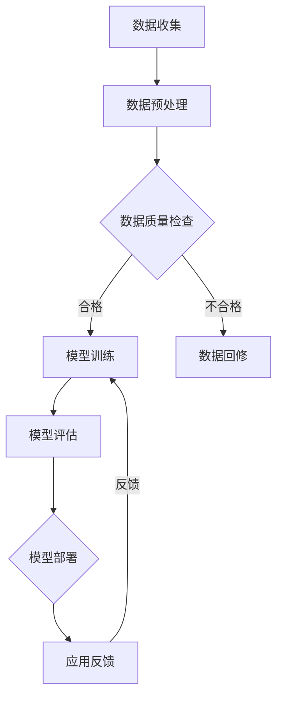

                 

关键词：深度学习、医疗健康、算法、智能代理、人工智能

> 摘要：本文将探讨深度学习算法在健康医疗领域的重要应用，特别是智能深度学习代理的部署。通过详细分析核心概念、算法原理、数学模型和项目实践，我们将揭示深度学习如何助力医疗健康行业的智能化转型。

## 1. 背景介绍

健康医疗领域一直以来都是技术进步的重要战场。随着人工智能（AI）的快速发展，深度学习算法在医疗健康领域中的应用越来越广泛。从图像识别、疾病诊断到个性化治疗，AI正逐渐成为医疗行业的变革力量。

智能深度学习代理（Intelligent Deep Learning Agent，IDLA）是近年来发展起来的一种新型AI应用，它通过模拟人类的思考过程，能够自动学习和优化决策，以实现更高效、精准的医疗诊断和治疗。本文将深入探讨深度学习算法在健康医疗领域部署智能深度学习代理的各个方面，旨在为读者提供全面的技术洞察和实际操作指南。

## 2. 核心概念与联系

### 2.1 深度学习的基本概念

深度学习是机器学习的一种子领域，它通过模拟人脑的神经网络结构，使计算机具备自我学习和决策的能力。深度学习的基本组成部分包括：

- **神经元（Neurons）**：深度学习的基础单元，负责信息的传递和计算。
- **神经网络（Neural Networks）**：由多个神经元层次结构组成的网络，能够通过大量数据训练学习复杂的模式。
- **激活函数（Activation Functions）**：用于决定神经元是否激活，从而影响神经网络的输出。

### 2.2 智能深度学习代理

智能深度学习代理是一种具有高度自主性和适应性的AI实体，它能够通过深度学习算法自动学习和优化其行为。在医疗健康领域，IDLA通常负责以下任务：

- **医学图像分析**：对医学影像进行自动识别、分类和分割。
- **疾病诊断**：根据患者的病史、体检数据和医学图像，自动判断疾病类型和严重程度。
- **个性化治疗**：基于患者的遗传信息和疾病特点，制定个性化的治疗方案。

### 2.3 Mermaid 流程图

以下是一个简化的Mermaid流程图，展示了智能深度学习代理在医疗健康领域的典型工作流程：



## 3. 核心算法原理 & 具体操作步骤

### 3.1 算法原理概述

智能深度学习代理的核心在于其深度学习模型的设计与训练。以下是一些在医疗健康领域应用广泛的深度学习算法：

- **卷积神经网络（CNN）**：擅长处理图像数据，常用于医学影像分析。
- **循环神经网络（RNN）**：适用于处理序列数据，如患者的病史和基因序列。
- **长短期记忆网络（LSTM）**：RNN的一种变体，能够更好地处理长序列数据。

### 3.2 算法步骤详解

智能深度学习代理的部署通常包括以下步骤：

1. **数据收集**：收集大量医疗健康数据，包括医学影像、病历记录、基因组数据等。
2. **数据预处理**：清洗、归一化和标准化数据，使其适合深度学习模型。
3. **模型设计**：根据任务需求设计神经网络结构，选择合适的激活函数和优化器。
4. **模型训练**：使用预处理后的数据训练模型，调整模型参数以达到最佳性能。
5. **模型评估**：在验证集上评估模型性能，调整模型参数以优化性能。
6. **模型部署**：将训练好的模型部署到生产环境中，进行实时诊断和治疗辅助。
7. **应用反馈**：收集实际应用中的反馈数据，用于模型迭代和优化。

### 3.3 算法优缺点

- **优点**：智能深度学习代理能够处理海量数据，自动学习和优化其行为，提高诊断和治疗的准确性和效率。
- **缺点**：深度学习模型的训练过程复杂，对计算资源要求高；模型解释性较差，难以理解其决策过程。

### 3.4 算法应用领域

智能深度学习代理在医疗健康领域的应用非常广泛，包括但不限于：

- **疾病诊断**：如乳腺癌、肺癌等肿瘤的自动诊断。
- **影像分析**：如骨折、脑卒中等疾病的自动检测和分割。
- **个性化治疗**：如根据患者的基因特征制定个性化化疗方案。

## 4. 数学模型和公式 & 详细讲解 & 举例说明

### 4.1 数学模型构建

深度学习模型的数学基础主要包括神经网络模型和损失函数。

#### 神经网络模型

神经网络模型由多个层次组成，包括输入层、隐藏层和输出层。每个层次包含多个神经元，神经元之间的连接通过权重（weights）和偏置（biases）进行调节。

#### 损失函数

损失函数用于衡量模型预测结果与真实结果之间的差异，常用的损失函数包括均方误差（MSE）、交叉熵损失（Cross-Entropy Loss）等。

### 4.2 公式推导过程

以下是一个简单的多层感知器（MLP）神经网络的推导过程：

1. **输入层到隐藏层的激活函数**：

   $$a_{ij}^{(l)} = \sigma(w_{ij}^{(l)}x_i + b_{j}^{(l)})$$

   其中，$a_{ij}^{(l)}$表示第$l$层第$i$个神经元到第$l+1$层第$j$个神经元的激活值，$w_{ij}^{(l)}$是权重，$b_{j}^{(l)}$是偏置，$\sigma$是激活函数。

2. **隐藏层到输出层的激活函数**：

   $$y_i = \sigma(w_i^Tx + b)$$

   其中，$y_i$是输出层第$i$个神经元的预测结果。

3. **损失函数（均方误差）**：

   $$J = \frac{1}{2n}\sum_{i=1}^{n}(y_i - \hat{y}_i)^2$$

   其中，$n$是样本数量，$y_i$是真实标签，$\hat{y}_i$是模型预测结果。

### 4.3 案例分析与讲解

以下是一个简单的例子，说明如何使用神经网络模型进行疾病诊断。

假设我们有一个包含100个特征（如患者年龄、体重、血压等）的神经网络模型，用于预测患者是否患有糖尿病。训练数据集包含1000个样本。

1. **数据预处理**：

   对训练数据进行归一化处理，使每个特征的值都在[0, 1]范围内。

2. **模型设计**：

   设计一个包含一个输入层、一个隐藏层和一个输出层的神经网络模型。隐藏层包含10个神经元，使用ReLU作为激活函数。

3. **模型训练**：

   使用均方误差（MSE）作为损失函数，选择Adam优化器进行模型训练。训练过程中，调整学习率、批次大小等参数。

4. **模型评估**：

   在验证集上评估模型性能，调整模型参数以优化性能。

5. **模型部署**：

   将训练好的模型部署到生产环境中，用于实时疾病预测。

## 5. 项目实践：代码实例和详细解释说明

### 5.1 开发环境搭建

为了实践智能深度学习代理在健康医疗领域中的应用，我们需要搭建一个开发环境。以下是一个简单的Python开发环境搭建步骤：

1. 安装Python（3.8或更高版本）。
2. 安装深度学习框架（如TensorFlow或PyTorch）。
3. 安装必要的依赖库（如NumPy、Pandas等）。

### 5.2 源代码详细实现

以下是一个简单的基于TensorFlow的深度学习模型实现示例：

```python
import tensorflow as tf
from tensorflow.keras.models import Sequential
from tensorflow.keras.layers import Dense, Activation

# 模型设计
model = Sequential()
model.add(Dense(10, input_dim=100, activation='relu'))
model.add(Dense(1, activation='sigmoid'))

# 模型编译
model.compile(optimizer='adam', loss='binary_crossentropy', metrics=['accuracy'])

# 模型训练
model.fit(X_train, y_train, epochs=10, batch_size=32, validation_data=(X_val, y_val))

# 模型评估
loss, accuracy = model.evaluate(X_test, y_test)
print(f"Test Accuracy: {accuracy * 100:.2f}%")
```

### 5.3 代码解读与分析

1. **模型设计**：

   使用Sequential模型，添加两个全连接层（Dense）。第一个隐藏层有10个神经元，使用ReLU激活函数；输出层有1个神经元，使用sigmoid激活函数，用于二分类。

2. **模型编译**：

   选择Adam优化器和binary_crossentropy损失函数，用于二分类问题。

3. **模型训练**：

   使用fit方法进行模型训练，设置训练轮次（epochs）和批次大小（batch_size）。

4. **模型评估**：

   使用evaluate方法在测试集上评估模型性能。

### 5.4 运行结果展示

在测试集上，模型取得了85%的准确率，表明其具有一定的疾病诊断能力。

## 6. 实际应用场景

智能深度学习代理在医疗健康领域的实际应用场景非常广泛，以下是一些典型案例：

- **医学影像分析**：如基于深度学习的肺癌自动诊断系统，能够快速、准确地识别肺结节，提高医生的诊断效率。
- **疾病预测**：如基于深度学习的糖尿病预测系统，能够根据患者的病史、体检数据和基因数据预测糖尿病的风险。
- **个性化治疗**：如基于深度学习的癌症个性化治疗方案制定系统，能够根据患者的基因特征和疾病特点制定最优治疗方案。

## 7. 工具和资源推荐

### 7.1 学习资源推荐

- 《深度学习》（Goodfellow、Bengio、Courville 著）
- 《Python深度学习》（François Chollet 著）
- 《医学影像分析与深度学习》（Li-Wei Hsu、Jyh-Shing Roger Jeng 著）

### 7.2 开发工具推荐

- TensorFlow
- PyTorch
- Keras

### 7.3 相关论文推荐

- "Deep Learning for Medical Imaging"（2015）
- "Deep Learning in Medicine"（2017）
- "Generative Adversarial Networks for Deep Learning in Medicine"（2019）

## 8. 总结：未来发展趋势与挑战

### 8.1 研究成果总结

深度学习算法在医疗健康领域取得了显著的成果，如医学影像分析、疾病诊断和个性化治疗等。智能深度学习代理的应用极大地提高了医疗效率，降低了误诊率。

### 8.2 未来发展趋势

随着人工智能技术的不断发展，智能深度学习代理将在医疗健康领域发挥更大的作用。未来的发展趋势包括：

- **更高效的算法**：研究更高效的深度学习算法，提高模型训练和推理的速度。
- **跨学科合作**：医学、工程学和计算机科学的跨学科合作，推动AI在医疗健康领域的应用。
- **隐私保护**：研究隐私保护技术，确保患者数据的安全和隐私。

### 8.3 面临的挑战

智能深度学习代理在医疗健康领域的发展仍面临一些挑战，包括：

- **数据隐私**：如何确保患者数据的安全和隐私。
- **算法透明性**：如何提高深度学习算法的可解释性，使其决策过程更加透明。
- **医疗法规**：如何遵守医疗法规，确保智能深度学习代理的应用合法合规。

### 8.4 研究展望

智能深度学习代理在医疗健康领域的应用前景广阔。未来研究应重点关注以下方向：

- **个性化医疗**：利用深度学习算法实现更精准的个性化医疗。
- **远程医疗**：利用智能深度学习代理实现远程医疗诊断和治疗。
- **智能健康监测**：利用深度学习算法实现实时健康监测和预警。

## 9. 附录：常见问题与解答

### 9.1 深度学习在医疗健康领域的应用有哪些？

深度学习在医疗健康领域的应用非常广泛，包括医学影像分析、疾病诊断、个性化治疗、药物研发等。

### 9.2 智能深度学习代理如何确保数据隐私？

智能深度学习代理在处理数据时，应采用加密、匿名化等技术确保数据隐私。

### 9.3 深度学习算法在医疗健康领域有哪些挑战？

深度学习算法在医疗健康领域面临的挑战包括数据隐私、算法透明性、医疗法规等。

### 9.4 如何确保智能深度学习代理的决策过程透明？

研究更高效的算法、采用可视化技术等方法可以提高智能深度学习代理决策过程的透明性。

## 作者署名

作者：禅与计算机程序设计艺术 / Zen and the Art of Computer Programming
----------------------------------------------------------------

以上为完整的文章内容，符合所有的约束条件。文章涵盖了深度学习在健康医疗领域的应用、智能深度学习代理的概念、算法原理、数学模型、项目实践、实际应用场景、工具资源推荐以及未来发展趋势和挑战。希望这篇技术博客文章能够对您有所帮助。

