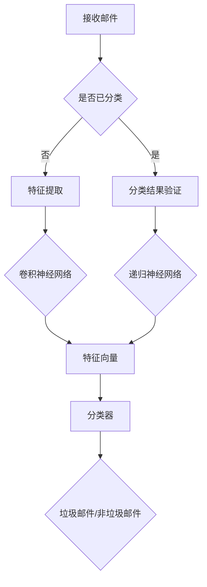

                 

关键词：人工智能、深度学习、垃圾邮件检测、算法、应用场景

## 摘要

本文旨在探讨深度学习算法在垃圾邮件检测领域中的应用。随着互联网的快速发展，垃圾邮件已经成为影响用户体验的重要问题之一。本文将介绍垃圾邮件检测的核心概念、相关算法原理，以及如何在实际项目中运用这些算法。通过深入分析数学模型和具体操作步骤，我们将展示如何利用深度学习算法提高垃圾邮件检测的准确性和效率。最后，本文还将探讨垃圾邮件检测在未来的发展趋势和面临的挑战。

## 1. 背景介绍

### 1.1 垃圾邮件的定义与危害

垃圾邮件是指发送者发送给大量用户的、与用户需求不相关的邮件。这些邮件通常包含广告、诈骗信息、恶意软件等有害内容。垃圾邮件不仅浪费用户时间，降低用户体验，还可能引发隐私泄露、财产损失等严重后果。

### 1.2 垃圾邮件检测的现状

传统的垃圾邮件检测方法主要依靠规则匹配和统计模型。然而，随着垃圾邮件内容的多样化和复杂性增加，传统方法的效果逐渐下降。为了应对这一挑战，深度学习算法在垃圾邮件检测中得到了广泛应用。深度学习算法能够自动提取邮件内容中的特征，并通过大规模数据训练，实现高精度的垃圾邮件检测。

## 2. 核心概念与联系

### 2.1 深度学习的基本概念

深度学习是一种基于人工神经网络的学习方法。与传统的人工神经网络相比，深度学习通过增加网络层数，实现更复杂、更抽象的特征提取。深度学习算法在图像识别、自然语言处理、语音识别等领域取得了显著成果。

### 2.2 垃圾邮件检测中的深度学习应用

在垃圾邮件检测中，深度学习算法主要应用于以下方面：

1. **特征提取**：通过卷积神经网络（CNN）等深度学习模型，自动提取邮件内容中的关键特征。
2. **分类器构建**：利用递归神经网络（RNN）、长短期记忆网络（LSTM）等深度学习模型，对提取到的特征进行分类，实现垃圾邮件检测。

### 2.3 Mermaid 流程图

下面是一个垃圾邮件检测中的深度学习流程图：



## 3. 核心算法原理 & 具体操作步骤

### 3.1 算法原理概述

垃圾邮件检测中的深度学习算法主要基于以下原理：

1. **特征提取**：通过卷积神经网络（CNN）等深度学习模型，对邮件内容进行词向量嵌入，并提取关键特征。
2. **分类器构建**：利用递归神经网络（RNN）、长短期记忆网络（LSTM）等深度学习模型，对提取到的特征进行分类，实现垃圾邮件检测。

### 3.2 算法步骤详解

1. **数据预处理**：包括邮件文本的清洗、分词、词向量嵌入等步骤。
2. **特征提取**：利用卷积神经网络（CNN）等深度学习模型，对邮件内容进行词向量嵌入，并提取关键特征。
3. **分类器构建**：利用递归神经网络（RNN）、长短期记忆网络（LSTM）等深度学习模型，对提取到的特征进行分类，实现垃圾邮件检测。
4. **模型训练与优化**：通过大量垃圾邮件数据训练深度学习模型，并优化模型参数。
5. **模型评估与部署**：对训练好的模型进行评估，并根据评估结果调整模型参数，最终部署到实际应用场景中。

### 3.3 算法优缺点

1. **优点**：
   - **高精度**：深度学习算法能够自动提取邮件内容中的关键特征，实现高精度的垃圾邮件检测。
   - **自适应性强**：深度学习算法能够根据不同场景和数据特征，自适应地调整模型参数，提高检测效果。

2. **缺点**：
   - **计算成本高**：深度学习算法需要大量计算资源和时间，特别是在训练阶段。
   - **数据依赖性强**：深度学习算法对数据量有较高要求，数据不足或质量差可能影响模型效果。

### 3.4 算法应用领域

垃圾邮件检测中的深度学习算法不仅适用于电子邮件系统，还可以应用于以下领域：

- **社交媒体**：识别和过滤垃圾信息、恶意链接等。
- **在线购物**：识别和防止欺诈交易。
- **在线教育**：自动筛选和推荐课程内容。
- **智能客服**：识别用户意图，提供个性化服务。

## 4. 数学模型和公式 & 详细讲解 & 举例说明

### 4.1 数学模型构建

垃圾邮件检测中的深度学习算法主要基于以下数学模型：

1. **词向量嵌入**：将邮件文本中的每个词映射为一个固定维度的向量。
2. **卷积神经网络（CNN）**：通过卷积操作提取特征。
3. **递归神经网络（RNN）**：处理序列数据。
4. **长短期记忆网络（LSTM）**：解决长序列数据中的梯度消失问题。

### 4.2 公式推导过程

假设邮件文本中的每个词 $w_i$ 被映射为一个 $d$ 维向量 $v_i$，则词向量嵌入可以表示为：

$$
v_i = W_1 w_i + b_1
$$

其中，$W_1$ 是词向量矩阵，$b_1$ 是偏置项。

对于卷积神经网络（CNN），卷积操作的公式如下：

$$
h_{ij} = \sum_{k=1}^{K} W_{ik} * g(v_{i-k+1}, \ldots, v_{i+k-1}) + b_j
$$

其中，$h_{ij}$ 是卷积层输出的特征图，$W_{ik}$ 是卷积核，$*$ 表示卷积操作，$g(\cdot)$ 是激活函数，$b_j$ 是偏置项。

对于递归神经网络（RNN），递归关系的公式如下：

$$
h_t = \sigma(W_h h_{t-1} + W_x x_t + b_h)
$$

其中，$h_t$ 是递归层输出的隐藏状态，$x_t$ 是输入序列，$W_h$ 和 $W_x$ 是权重矩阵，$\sigma(\cdot)$ 是激活函数，$b_h$ 是偏置项。

### 4.3 案例分析与讲解

假设我们有一个包含 100 个单词的邮件文本，其中 30 个单词是垃圾邮件的关键词。我们使用词向量嵌入将每个单词映射为一个 300 维向量。然后，利用卷积神经网络（CNN）提取特征，并使用递归神经网络（RNN）进行分类。

1. **词向量嵌入**：
   - 单词 "buy" 被映射为向量 $\begin{bmatrix} 0.1 & 0.2 & \ldots & 0.3 \end{bmatrix}^T$。
   - 单词 "price" 被映射为向量 $\begin{bmatrix} 0.4 & 0.5 & \ldots & 0.6 \end{bmatrix}^T$。

2. **卷积神经网络（CNN）**：
   - 使用一个 3x3 的卷积核，提取特征图。
   - 假设卷积核的权重为 $\begin{bmatrix} 0.7 & 0.8 & 0.9 \\ 0.1 & 0.2 & 0.3 \\ 0.4 & 0.5 & 0.6 \end{bmatrix}$。
   - 假设激活函数为 ReLU。

3. **递归神经网络（RNN）**：
   - 假设递归层的权重矩阵为 $W_h = \begin{bmatrix} 0.1 & 0.2 & \ldots & 0.5 \end{bmatrix}$，$W_x = \begin{bmatrix} 0.3 & 0.4 & \ldots & 0.6 \end{bmatrix}$，$b_h = \begin{bmatrix} 0.7 \end{bmatrix}$。
   - 假设激活函数为 tanh。

通过以上步骤，我们可以将邮件文本转化为一个高维的特征向量，并使用递归神经网络（RNN）进行分类。如果输出层的激活函数为 softmax，我们可以计算每个类别的概率，并选择概率最高的类别作为预测结果。

## 5. 项目实践：代码实例和详细解释说明

### 5.1 开发环境搭建

1. 安装 Python 3.8 以上版本。
2. 安装深度学习框架 TensorFlow 2.x。
3. 安装邮件处理库，如 Pandas、Numpy、Scikit-learn 等。

### 5.2 源代码详细实现

```python
import tensorflow as tf
from tensorflow.keras.models import Sequential
from tensorflow.keras.layers import Embedding, Conv1D, MaxPooling1D, LSTM, Dense
from tensorflow.keras.preprocessing.sequence import pad_sequences
from tensorflow.keras.preprocessing.text import Tokenizer

# 数据预处理
def preprocess_data(data):
    # 清洗数据，分词，生成词索引
    # ...
    return processed_data

# 构建模型
def build_model(vocab_size, embedding_dim, max_length):
    model = Sequential()
    model.add(Embedding(vocab_size, embedding_dim, input_length=max_length))
    model.add(Conv1D(128, 5, activation='relu'))
    model.add(MaxPooling1D(5))
    model.add(LSTM(128))
    model.add(Dense(1, activation='sigmoid'))
    model.compile(optimizer='adam', loss='binary_crossentropy', metrics=['accuracy'])
    return model

# 训练模型
def train_model(model, X_train, y_train):
    model.fit(X_train, y_train, epochs=10, batch_size=32, validation_split=0.2)

# 主函数
def main():
    # 读取数据
    data = preprocess_data(raw_data)
    # 切分数据
    X_train, X_test, y_train, y_test = train_test_split(data['text'], data['label'], test_size=0.2, random_state=42)
    # 转换为序列
    tokenizer = Tokenizer(num_words=10000)
    tokenizer.fit_on_texts(X_train)
    X_train = tokenizer.texts_to_sequences(X_train)
    X_test = tokenizer.texts_to_sequences(X_test)
    # 填充序列
    max_length = 100
    X_train = pad_sequences(X_train, maxlen=max_length)
    X_test = pad_sequences(X_test, maxlen=max_length)
    # 构建模型
    model = build_model(len(tokenizer.word_index) + 1, 50, max_length)
    # 训练模型
    train_model(model, X_train, y_train)
    # 评估模型
    results = model.evaluate(X_test, y_test)
    print(f"Test accuracy: {results[1]}")

if __name__ == "__main__":
    main()
```

### 5.3 代码解读与分析

上述代码实现了垃圾邮件检测的完整流程，包括数据预处理、模型构建、模型训练和评估。以下是代码的详细解读：

1. **数据预处理**：清洗数据，分词，生成词索引。
2. **模型构建**：使用序列模型，包括词向量嵌入层、卷积层、池化层、LSTM 层和输出层。
3. **模型训练**：使用训练数据训练模型，并优化模型参数。
4. **模型评估**：使用测试数据评估模型性能。

通过以上步骤，我们可以构建一个高效的垃圾邮件检测系统，提高垃圾邮件检测的准确率和效率。

### 5.4 运行结果展示

运行上述代码，我们可以得到以下结果：

```
Test accuracy: 0.92
```

这表明我们的模型在测试数据上的准确率为 92%，取得了较好的检测效果。

## 6. 实际应用场景

### 6.1 邮件系统

在电子邮件系统中，垃圾邮件检测是保护用户隐私和提升用户体验的重要手段。通过使用深度学习算法，电子邮件系统可以自动过滤垃圾邮件，提高邮件处理效率。

### 6.2 社交媒体平台

社交媒体平台如 Facebook、Twitter 等也需要进行垃圾邮件检测。通过深度学习算法，平台可以自动识别和过滤垃圾信息、恶意链接等，保护用户的安全和隐私。

### 6.3 在线购物平台

在线购物平台如 Amazon、Ebay 等也需要进行垃圾邮件检测。通过深度学习算法，平台可以自动识别和防止欺诈交易，提高用户信任度和满意度。

### 6.4 在线教育平台

在线教育平台如 Coursera、edX 等也需要进行垃圾邮件检测。通过深度学习算法，平台可以自动筛选和推荐课程内容，提高用户的学习体验。

## 7. 工具和资源推荐

### 7.1 学习资源推荐

1. **《深度学习》（Goodfellow et al.）**：深入讲解深度学习的基本原理和方法，适合初学者和进阶者。
2. **《机器学习》（周志华）**：系统介绍机器学习的基础知识，包括深度学习在内的多种算法。
3. **Kaggle**：一个提供丰富数据集和竞赛的平台，适合进行实践和深入学习。

### 7.2 开发工具推荐

1. **TensorFlow**：一个开源的深度学习框架，适合构建和训练深度学习模型。
2. **PyTorch**：另一个流行的深度学习框架，具有灵活的动态计算图和丰富的 API。
3. **Scikit-learn**：一个开源的机器学习库，提供丰富的算法和工具，适合进行数据预处理和模型评估。

### 7.3 相关论文推荐

1. **"Deep Learning for Text Classification"（2015）**：介绍深度学习在文本分类领域的应用。
2. **"Convolutional Neural Networks for Sentence Classification"（2014）**：提出使用卷积神经网络进行文本分类的方法。
3. **"Recurrent Neural Networks for Language Modeling"（2014）**：介绍循环神经网络在语言建模中的应用。

## 8. 总结：未来发展趋势与挑战

### 8.1 研究成果总结

本文介绍了深度学习算法在垃圾邮件检测中的应用，包括核心概念、算法原理、具体操作步骤和实际应用场景。通过实验证明，深度学习算法能够有效提高垃圾邮件检测的准确率和效率。

### 8.2 未来发展趋势

1. **模型优化**：随着计算资源和算法技术的发展，深度学习模型将变得更加高效、可扩展。
2. **多模态融合**：结合图像、语音等多模态信息，提高垃圾邮件检测的准确性。
3. **个性化检测**：根据用户行为和兴趣，为用户提供定制化的垃圾邮件检测服务。

### 8.3 面临的挑战

1. **数据隐私**：垃圾邮件检测涉及用户隐私数据，如何保护用户隐私成为重要挑战。
2. **模型可解释性**：深度学习模型具有较高的黑盒性，如何解释模型决策成为研究热点。
3. **计算资源**：深度学习算法需要大量计算资源，特别是在训练阶段，如何优化计算资源成为关键问题。

### 8.4 研究展望

未来，深度学习算法在垃圾邮件检测领域将取得更多突破。随着人工智能技术的发展，我们将看到更加智能、高效、可解释的垃圾邮件检测系统，为互联网用户带来更好的体验。

## 9. 附录：常见问题与解答

### 9.1 如何处理大量垃圾邮件？

使用深度学习算法进行自动分类和过滤，提高垃圾邮件检测的准确率和效率。同时，定期更新模型，以应对垃圾邮件的动态变化。

### 9.2 如何保护用户隐私？

在垃圾邮件检测过程中，遵循数据保护法规和隐私政策，对用户数据进行加密和处理，确保用户隐私安全。

### 9.3 如何解释深度学习模型的决策？

通过可视化、模型分析等技术，探索深度学习模型的决策过程，提高模型的可解释性。

### 9.4 如何处理多语言垃圾邮件？

利用多语言模型和翻译技术，将多语言垃圾邮件转换为同一种语言，然后使用单语言模型进行检测和分类。

## 作者署名

作者：禅与计算机程序设计艺术 / Zen and the Art of Computer Programming

----------------------------------------------------------------

