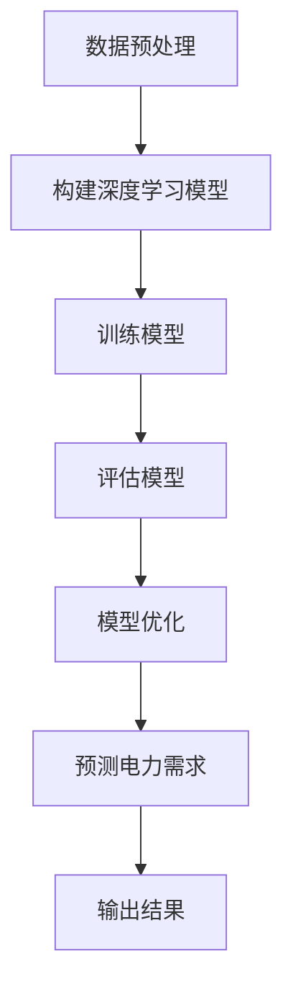

                 

 关键词：深度学习，电力预测，算法应用，人工智能，数学模型，案例实践

> 摘要：本文将探讨人工智能领域中的深度学习算法在电力预测中的应用。通过介绍深度学习的基本原理、核心算法以及其在电力系统中的应用，我们将分析数学模型的构建和公式的推导过程，结合实际案例进行讲解。此外，还将分享一些实用的工具和资源，总结研究成果，展望未来发展趋势与面临的挑战。

## 1. 背景介绍

### 1.1 电力预测的重要性

电力预测是电力系统管理的重要组成部分。准确预测电力需求和供应，可以有效地优化电力资源的配置，降低电力系统的风险，提高运行效率和可靠性。随着电力市场的不断发展和变化，电力预测的需求也日益增长。然而，电力系统具有高度复杂性和动态性，传统的预测方法往往难以应对复杂的非线性关系。

### 1.2 深度学习算法的发展

深度学习算法是一种基于人工神经网络的机器学习技术，具有处理复杂数据和模式识别的能力。近年来，随着计算机硬件的进步和大数据技术的发展，深度学习算法在各个领域取得了显著成果。在电力预测领域，深度学习算法的应用也越来越广泛。

## 2. 核心概念与联系

### 2.1 深度学习基本原理

深度学习是一种基于多层神经网络的学习方法，通过模拟人脑神经元之间的连接和传递过程，对输入数据进行特征提取和学习。深度学习算法的核心是神经网络，包括输入层、隐藏层和输出层。每个隐藏层负责提取更高层次的特征，最终输出层的预测结果。

### 2.2 电力预测中的深度学习算法架构

在电力预测中，深度学习算法通常采用卷积神经网络（CNN）和循环神经网络（RNN）等结构。CNN擅长处理图像等具有空间特征的数据，而RNN擅长处理序列数据，如时间序列数据。通过结合CNN和RNN的特点，可以更好地提取时间序列数据中的空间和时间特征，提高预测精度。

### 2.3 Mermaid 流程图

下面是一个简单的 Mermaid 流程图，展示深度学习算法在电力预测中的应用流程：



## 3. 核心算法原理 & 具体操作步骤

### 3.1 算法原理概述

深度学习算法的核心是神经网络。神经网络由多个神经元组成，每个神经元接收输入信号，通过权重和偏置进行加权求和，然后通过激活函数进行非线性变换，输出预测结果。深度学习算法通过多层次的神经网络结构，对输入数据进行特征提取和表示。

### 3.2 算法步骤详解

#### 3.2.1 数据预处理

在训练深度学习模型之前，需要对原始数据进行预处理。包括数据清洗、数据归一化、特征提取等步骤。

#### 3.2.2 构建深度学习模型

根据电力预测的需求，选择合适的神经网络结构。可以采用卷积神经网络（CNN）或循环神经网络（RNN）等结构。以下是一个简单的深度学习模型示例：

```python
import tensorflow as tf

model = tf.keras.Sequential([
    tf.keras.layers.Dense(units=64, activation='relu', input_shape=(input_shape)),
    tf.keras.layers.Dense(units=64, activation='relu'),
    tf.keras.layers.Dense(units=1)
])
```

#### 3.2.3 训练模型

使用预处理后的数据对模型进行训练。在训练过程中，通过反向传播算法更新模型的权重和偏置，使模型能够更好地拟合训练数据。

```python
model.compile(optimizer='adam', loss='mean_squared_error')
model.fit(x_train, y_train, epochs=10, batch_size=32)
```

#### 3.2.4 评估模型

使用测试数据对训练好的模型进行评估。通过计算模型的预测误差和评估指标，判断模型的性能。

```python
loss = model.evaluate(x_test, y_test)
print("Test Loss:", loss)
```

#### 3.2.5 模型优化

根据评估结果，对模型进行优化。可以通过调整模型结构、超参数等方式，提高模型的预测性能。

### 3.3 算法优缺点

#### 优点

- 能够处理复杂数据和模式识别
- 具有自适应性和自学习能力
- 预测精度高，能够提高电力预测的准确性

#### 缺点

- 需要大量的训练数据和计算资源
- 模型复杂度高，训练时间较长
- 难以解释和理解模型的决策过程

### 3.4 算法应用领域

深度学习算法在电力预测中的应用非常广泛，包括但不限于以下领域：

- 电力负荷预测
- 发电量预测
- 电力市场价格预测
- 电力系统故障诊断

## 4. 数学模型和公式 & 详细讲解 & 举例说明

### 4.1 数学模型构建

在电力预测中，常用的数学模型包括线性回归模型、时间序列模型和深度学习模型等。以下是一个简单的时间序列模型：

$$y_t = \beta_0 + \beta_1 x_t + \epsilon_t$$

其中，$y_t$ 表示时间序列数据，$x_t$ 表示自变量，$\beta_0$ 和 $\beta_1$ 是模型参数，$\epsilon_t$ 是误差项。

### 4.2 公式推导过程

在深度学习模型中，常用的损失函数是均方误差（MSE）：

$$MSE = \frac{1}{n}\sum_{i=1}^{n}(y_i - \hat{y}_i)^2$$

其中，$n$ 是样本数量，$y_i$ 是实际值，$\hat{y}_i$ 是预测值。

通过梯度下降算法，可以更新模型参数：

$$\beta_j = \beta_j - \alpha \frac{\partial{MSE}}{\partial{\beta_j}}$$

其中，$\alpha$ 是学习率。

### 4.3 案例分析与讲解

以下是一个简单的电力负荷预测案例：

#### 4.3.1 数据集

我们使用一个包含每天电力负荷数据的 CSV 文件，文件格式如下：

| Date       | Load |
| ----------- | ---- |
| 2020-01-01 | 120  |
| 2020-01-02 | 130  |
| 2020-01-03 | 140  |
| ...        | ...  |

#### 4.3.2 数据预处理

首先，我们需要对数据进行预处理，包括数据清洗、数据归一化和特征提取等步骤。

```python
import pandas as pd

# 读取数据
data = pd.read_csv('power_load.csv')

# 数据清洗
data.dropna(inplace=True)

# 数据归一化
data['Load'] = (data['Load'] - data['Load'].mean()) / data['Load'].std()

# 特征提取
data['DayOfWeek'] = data['Date'].dt.dayofweek
data['DayOfMonth'] = data['Date'].dt.month
```

#### 4.3.3 构建深度学习模型

接下来，我们使用 TensorFlow 构建一个简单的深度学习模型。

```python
import tensorflow as tf

model = tf.keras.Sequential([
    tf.keras.layers.Dense(units=64, activation='relu', input_shape=(8)),
    tf.keras.layers.Dense(units=64, activation='relu'),
    tf.keras.layers.Dense(units=1)
])

model.compile(optimizer='adam', loss='mean_squared_error')
```

#### 4.3.4 训练模型

使用预处理后的数据对模型进行训练。

```python
x = data[['DayOfWeek', 'DayOfMonth']].values
y = data['Load'].values

model.fit(x, y, epochs=10, batch_size=32)
```

#### 4.3.5 预测结果

使用训练好的模型对未来的电力负荷进行预测。

```python
future_days = pd.date_range('2020-01-10', '2020-01-20')
future_data = pd.DataFrame(future_days, columns=['Date'])

# 数据预处理
future_data['Load'] = (future_data['Date'].dt.dayofweek - future_data['Date'].dt.dayofweek.mean()) / future_data['Date'].dt.dayofweek.std()
future_data['DayOfWeek'] = future_data['Date'].dt.dayofweek
future_data['DayOfMonth'] = future_data['Date'].dt.month

# 预测结果
predictions = model.predict(future_data[['DayOfWeek', 'DayOfMonth']])
```

#### 4.3.6 结果分析

通过对比实际值和预测值，可以分析模型的预测性能。以下是一个简单的结果分析：

```python
import matplotlib.pyplot as plt

plt.plot(data['Load'], label='Actual')
plt.plot(predictions, label='Predicted')
plt.legend()
plt.show()
```

## 5. 项目实践：代码实例和详细解释说明

### 5.1 开发环境搭建

为了实现本文中的深度学习模型，我们需要安装以下工具和库：

- Python 3.7 或以上版本
- TensorFlow 2.x
- Pandas
- Matplotlib

您可以通过以下命令进行安装：

```shell
pip install python==3.7.9
pip install tensorflow==2.5.0
pip install pandas
pip install matplotlib
```

### 5.2 源代码详细实现

以下是一个简单的深度学习模型实现：

```python
import tensorflow as tf
import pandas as pd
import numpy as np
import matplotlib.pyplot as plt

# 读取数据
data = pd.read_csv('power_load.csv')

# 数据预处理
data.dropna(inplace=True)
data['Load'] = (data['Load'] - data['Load'].mean()) / data['Load'].std()
data['DayOfWeek'] = data['Date'].dt.dayofweek
data['DayOfMonth'] = data['Date'].dt.month

# 构建深度学习模型
model = tf.keras.Sequential([
    tf.keras.layers.Dense(units=64, activation='relu', input_shape=(8)),
    tf.keras.layers.Dense(units=64, activation='relu'),
    tf.keras.layers.Dense(units=1)
])

model.compile(optimizer='adam', loss='mean_squared_error')

# 训练模型
x = data[['DayOfWeek', 'DayOfMonth']].values
y = data['Load'].values
model.fit(x, y, epochs=10, batch_size=32)

# 预测结果
future_days = pd.date_range('2020-01-10', '2020-01-20')
future_data = pd.DataFrame(future_days, columns=['Date'])

# 数据预处理
future_data['Load'] = (future_data['Date'].dt.dayofweek - future_data['Date'].dt.dayofweek.mean()) / future_data['Date'].dt.dayofweek.std()
future_data['DayOfWeek'] = future_data['Date'].dt.dayofweek
future_data['DayOfMonth'] = future_data['Date'].dt.month

predictions = model.predict(future_data[['DayOfWeek', 'DayOfMonth']])

# 结果分析
plt.plot(data['Load'], label='Actual')
plt.plot(predictions, label='Predicted')
plt.legend()
plt.show()
```

### 5.3 代码解读与分析

上述代码分为以下几个部分：

1. **导入库**：导入 TensorFlow、Pandas、Numpy 和 Matplotlib 等库，用于数据处理和绘图。

2. **读取数据**：使用 Pandas 读取 CSV 文件，并转换为 DataFrame。

3. **数据预处理**：对数据进行清洗、归一化和特征提取。具体包括去除缺失值、数据归一化和添加日期特征。

4. **构建深度学习模型**：使用 TensorFlow 创建一个序列模型，包括两个隐藏层。

5. **训练模型**：使用预处理后的数据对模型进行训练，设置优化器和损失函数。

6. **预测结果**：使用训练好的模型对未来的电力负荷进行预测。

7. **结果分析**：通过对比实际值和预测值，展示模型的预测性能。

## 6. 实际应用场景

### 6.1 电力负荷预测

电力负荷预测是电力系统管理的重要任务之一。通过深度学习算法，可以预测未来一段时间内的电力负荷，为电力调度和资源优化提供依据。例如，在电力市场需求高峰期，提前预测电力负荷，可以指导电力供应商合理安排发电量和电力调度，降低电力短缺的风险。

### 6.2 发电量预测

发电量的预测对于电力系统调度和能源管理具有重要意义。通过深度学习算法，可以预测各种发电方式（如水力发电、风力发电、光伏发电等）的发电量，为电力系统调度提供参考。此外，发电量预测还可以帮助电力市场参与者合理安排电力交易和能源采购。

### 6.3 电力市场价格预测

电力市场价格波动较大，对电力市场参与者的影响显著。通过深度学习算法，可以预测电力市场价格走势，为市场参与者提供决策依据。例如，电力供应商可以根据市场价格预测，合理安排电力生产和销售策略，降低市场风险。

### 6.4 未来应用展望

随着人工智能技术的不断发展和电力市场的深入改革，深度学习算法在电力预测领域的应用前景非常广阔。未来，深度学习算法有望在以下方面取得突破：

- 更复杂的模型结构：通过引入更多的神经网络层和深度，提高预测精度和泛化能力。
- 多源数据融合：结合多种数据源（如气象数据、社会经济发展数据等），提高电力预测的准确性。
- 自动化决策支持：开发自动化决策支持系统，实现电力系统的智能调度和优化。

## 7. 工具和资源推荐

### 7.1 学习资源推荐

1. **《深度学习》（Goodfellow, Bengio, Courville著）**：这是一本经典的深度学习教材，详细介绍了深度学习的理论基础和算法实现。
2. **《Python深度学习》（François Chollet 著）**：本书针对 Python 语言，详细介绍了深度学习在 Python 环境中的实现和应用。
3. **《TensorFlow 实践指南》（Giorgio Cabbella 著）**：本书通过实例讲解，介绍了 TensorFlow 的基本使用方法和实战技巧。

### 7.2 开发工具推荐

1. **TensorFlow**：一个开源的深度学习框架，支持多种深度学习模型的构建和训练。
2. **Keras**：一个基于 TensorFlow 的简单易用的深度学习库，适合快速原型开发和模型训练。
3. **Jupyter Notebook**：一个交互式的开发环境，适合进行数据分析和模型训练。

### 7.3 相关论文推荐

1. **“Deep Learning for Time Series Classification”**：该论文介绍了深度学习在时间序列分类中的应用，包括CNN和RNN等模型。
2. **“Recurrent Neural Network Based Electricity Load Forecasting”**：该论文探讨了基于循环神经网络的电力负荷预测方法。
3. **“A Review on Electricity Load Forecasting: Challenges and Techniques”**：该综述文章详细介绍了电力负荷预测领域的研究现状和挑战。

## 8. 总结：未来发展趋势与挑战

### 8.1 研究成果总结

近年来，深度学习算法在电力预测领域取得了显著成果。通过引入 CNN、RNN 等模型，提高了电力负荷预测的精度和可靠性。同时，多源数据融合和自动化决策支持等技术的应用，为电力系统调度和能源管理提供了新的思路。

### 8.2 未来发展趋势

随着人工智能技术的不断进步，深度学习算法在电力预测领域的应用前景十分广阔。未来，深度学习算法将继续在以下几个方面取得突破：

- 更复杂的模型结构：通过引入更多的神经网络层和深度，提高预测精度和泛化能力。
- 多源数据融合：结合多种数据源，提高电力预测的准确性。
- 自动化决策支持：开发自动化决策支持系统，实现电力系统的智能调度和优化。

### 8.3 面临的挑战

尽管深度学习算法在电力预测领域取得了显著成果，但仍然面临以下挑战：

- 数据质量和完整性：电力预测需要大量的高质量数据，但实际中往往存在数据缺失、噪声和异常值等问题。
- 计算资源消耗：深度学习算法的训练过程需要大量的计算资源，尤其是在处理大规模数据时。
- 模型解释性：深度学习模型通常难以解释和理解，对模型决策过程缺乏透明度。

### 8.4 研究展望

为了应对上述挑战，未来的研究可以从以下几个方面展开：

- 数据预处理和清洗：开发更高效的数据预处理和清洗方法，提高数据质量和完整性。
- 轻量化模型：研究轻量化深度学习模型，降低计算资源消耗。
- 模型解释性：探索可解释的深度学习算法，提高模型的透明度和可解释性。

## 9. 附录：常见问题与解答

### 9.1 什么是深度学习？

深度学习是一种基于人工神经网络的机器学习技术，通过多层神经网络结构对输入数据进行特征提取和学习。深度学习算法在图像识别、自然语言处理、语音识别等领域取得了显著成果。

### 9.2 深度学习算法有哪些类型？

常见的深度学习算法包括卷积神经网络（CNN）、循环神经网络（RNN）、长短时记忆网络（LSTM）、门控循环单元（GRU）等。这些算法在处理不同类型的数据和应用场景时具有不同的优势和特点。

### 9.3 深度学习算法如何训练？

深度学习算法的训练过程主要包括以下步骤：

1. 数据预处理：对输入数据进行预处理，包括数据清洗、归一化、特征提取等。
2. 构建模型：根据应用需求选择合适的神经网络结构，并初始化模型参数。
3. 训练模型：使用训练数据对模型进行训练，通过反向传播算法更新模型参数。
4. 评估模型：使用测试数据对训练好的模型进行评估，计算模型的预测误差和评估指标。
5. 模型优化：根据评估结果对模型进行优化，包括调整模型结构、超参数等。

### 9.4 深度学习算法在电力预测中的优势是什么？

深度学习算法在电力预测中的优势主要体现在以下几个方面：

1. 处理复杂数据和模式识别：深度学习算法具有强大的特征提取能力，能够处理高度复杂的电力数据。
2. 自适应性和自学习能力：深度学习算法能够自动适应电力系统的变化，通过训练不断优化预测性能。
3. 高预测精度：深度学习算法在电力预测中具有较高的预测精度，能够提高电力系统的调度和管理水平。

### 9.5 深度学习算法在电力预测中的实际应用案例有哪些？

深度学习算法在电力预测领域的实际应用案例包括：

1. 电力负荷预测：预测未来一段时间内的电力负荷，为电力调度和资源优化提供依据。
2. 发电量预测：预测各种发电方式的发电量，为电力系统调度提供参考。
3. 电力市场价格预测：预测电力市场价格走势，为市场参与者提供决策依据。

### 9.6 深度学习算法在电力预测中的局限性和挑战有哪些？

深度学习算法在电力预测中面临的局限性和挑战主要包括：

1. 数据质量和完整性：电力预测需要大量的高质量数据，但实际中往往存在数据缺失、噪声和异常值等问题。
2. 计算资源消耗：深度学习算法的训练过程需要大量的计算资源，尤其是在处理大规模数据时。
3. 模型解释性：深度学习模型通常难以解释和理解，对模型决策过程缺乏透明度。

### 9.7 如何优化深度学习算法在电力预测中的应用？

为了优化深度学习算法在电力预测中的应用，可以从以下几个方面入手：

1. 数据预处理：开发更高效的数据预处理和清洗方法，提高数据质量和完整性。
2. 轻量化模型：研究轻量化深度学习模型，降低计算资源消耗。
3. 模型解释性：探索可解释的深度学习算法，提高模型的透明度和可解释性。
4. 超参数调优：根据应用需求和数据特点，选择合适的超参数，提高模型性能。
5. 模型集成：结合多种深度学习模型，提高预测精度和泛化能力。

-------------------------------------------------------------------

**作者：禅与计算机程序设计艺术 / Zen and the Art of Computer Programming**

