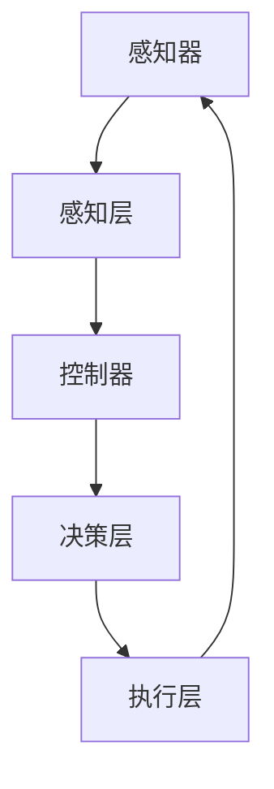

                 

关键词：深度学习、智能深度学习代理、算法框架、学习与适应、人工智能

摘要：本文将深入探讨AI领域中的深度学习算法及其在智能深度学习代理中的应用。我们将介绍算法的核心概念、原理、操作步骤，并通过具体案例分析来阐述其应用场景和未来展望。

## 1. 背景介绍

随着计算机技术的飞速发展，人工智能（AI）已成为当今科技领域的前沿。深度学习作为AI的核心技术之一，正日益成为各个行业的宠儿。深度学习通过模仿人脑的神经网络结构，实现了对数据的自动特征提取和学习能力，从而在图像识别、自然语言处理、自动驾驶等领域取得了显著成果。

智能深度学习代理，作为一个新兴的研究方向，旨在使深度学习算法能够更好地适应复杂多变的环境。智能深度学习代理不仅仅是一个计算模型，更是一种能够在不同场景中自主学习和适应的智能体。它们能够通过不断的学习和优化，提高自身的能力，从而更好地服务于实际应用。

本文将围绕智能深度学习代理的学习与适应的算法框架展开讨论，旨在为相关领域的研究者和开发者提供有价值的参考。

## 2. 核心概念与联系

### 2.1 深度学习代理的概念

深度学习代理是指在特定环境中，利用深度学习算法进行学习和决策的智能体。它们通常包含以下几个核心组件：

1. **感知器**：用于接收环境输入，如图像、声音等。
2. **控制器**：根据感知器的输入，生成行动策略。
3. **记忆模块**：用于存储历史数据和经验，辅助决策过程。
4. **学习模块**：通过梯度下降等优化算法，更新代理的参数，实现自我学习。

### 2.2 智能深度学习代理的架构

智能深度学习代理的架构通常包括以下几个层次：

1. **感知层**：通过卷积神经网络（CNN）等模型，对感知器输入的数据进行预处理和特征提取。
2. **决策层**：利用循环神经网络（RNN）或强化学习（RL）等算法，对感知层提取的特征进行决策。
3. **执行层**：将决策层的输出转换为实际的行动，如控制机器人运动、自动驾驶等。

### 2.3 Mermaid 流程图



## 3. 核心算法原理 & 具体操作步骤

### 3.1 算法原理概述

智能深度学习代理的学习与适应主要依赖于以下几种核心算法：

1. **反向传播算法**：用于训练深度学习模型，通过梯度下降优化模型参数。
2. **强化学习算法**：通过试错法和奖励机制，使代理在复杂环境中自主学习和优化策略。
3. **迁移学习**：利用预训练模型，在新的任务中快速实现性能提升。

### 3.2 算法步骤详解

1. **数据预处理**：收集和清洗数据，进行特征工程，将数据转化为适合模型输入的格式。
2. **模型训练**：使用反向传播算法，训练深度学习模型，通过调整模型参数，使模型能够准确预测目标。
3. **策略优化**：利用强化学习算法，优化代理的行动策略，使其在复杂环境中能够获得更高的回报。
4. **模型评估**：通过交叉验证和测试集，评估模型的泛化能力，调整模型参数，提高模型性能。
5. **部署应用**：将训练好的模型部署到实际应用场景，如自动驾驶、机器人控制等。

### 3.3 算法优缺点

**优点**：

- **强大的学习能力**：深度学习代理能够通过大量的数据自动提取特征，实现自我优化。
- **泛化能力**：通过迁移学习和强化学习，代理能够在新的任务中快速适应。

**缺点**：

- **计算资源消耗大**：深度学习模型的训练和优化需要大量的计算资源。
- **数据依赖性**：模型的性能高度依赖于数据的质量和多样性。

### 3.4 算法应用领域

智能深度学习代理在以下领域具有广泛的应用前景：

- **自动驾驶**：利用深度学习代理，实现车辆的自主驾驶和决策。
- **机器人控制**：通过强化学习，使机器人能够在复杂环境中进行自主学习和适应。
- **自然语言处理**：利用深度学习代理，实现语音识别、机器翻译等任务。
- **图像识别**：通过卷积神经网络，实现对图像的分类和识别。

## 4. 数学模型和公式 & 详细讲解 & 举例说明

### 4.1 数学模型构建

深度学习代理的数学模型主要包括以下几个部分：

1. **输入层**：表示为 $X$，通常为多维数组。
2. **隐藏层**：表示为 $H$，包含多个神经元，每个神经元都有相应的权重和偏置。
3. **输出层**：表示为 $Y$，用于生成预测结果。

### 4.2 公式推导过程

1. **前向传播**：

$$
Z = W \cdot X + b
$$

$$
H = \sigma(Z)
$$

2. **反向传播**：

$$
\delta_H = \frac{\partial L}{\partial Z} \cdot \frac{\partial Z}{\partial H}
$$

$$
\delta_Z = \frac{\partial L}{\partial Z} \cdot \frac{\partial Z}{\partial X}
$$

### 4.3 案例分析与讲解

假设我们有一个简单的线性回归问题，目标是预测房价。输入特征为房屋面积，输出为房价。我们可以构建一个简单的线性模型：

$$
Y = WX + b
$$

其中 $W$ 为权重，$b$ 为偏置。通过最小化均方误差（MSE）来优化模型参数：

$$
L = \frac{1}{2} \sum_{i=1}^{n} (Y_i - WX_i - b)^2
$$

通过梯度下降算法，迭代更新 $W$ 和 $b$：

$$
W := W - \alpha \frac{\partial L}{\partial W}
$$

$$
b := b - \alpha \frac{\partial L}{\partial b}
$$

其中 $\alpha$ 为学习率。

## 5. 项目实践：代码实例和详细解释说明

### 5.1 开发环境搭建

1. 安装Python环境（3.8及以上版本）。
2. 安装深度学习框架TensorFlow。
3. 安装强化学习库Gym。

### 5.2 源代码详细实现

以下是一个简单的基于Q-learning算法的智能深度学习代理实现：

```python
import numpy as np
import gym

# 创建环境
env = gym.make("CartPole-v0")

# 初始化Q表
Q = np.zeros([env.observation_space.n, env.action_space.n])

# 设置参数
alpha = 0.1
gamma = 0.9
epsilon = 0.1

# Q-learning算法
for episode in range(1000):
    state = env.reset()
    done = False
    while not done:
        if np.random.rand() < epsilon:
            action = env.action_space.sample()  # 随机行动
        else:
            action = np.argmax(Q[state])  # 最优行动

        next_state, reward, done, _ = env.step(action)
        Q[state, action] = Q[state, action] + alpha * (reward + gamma * np.max(Q[next_state]) - Q[state, action])
        state = next_state

# 关闭环境
env.close()
```

### 5.3 代码解读与分析

1. **环境搭建**：使用Gym创建一个简单的CartPole环境。
2. **Q表初始化**：创建一个二维数组，用于存储状态-动作价值函数。
3. **参数设置**：设置学习率、奖励系数和探索率。
4. **Q-learning算法实现**：在循环中更新Q表，实现智能体的自我学习。

### 5.4 运行结果展示

通过运行代码，我们可以在CartPole环境中观察到智能深度学习代理的学习过程。随着训练的进行，代理能够在更短的时间内稳定地完成任务。

## 6. 实际应用场景

智能深度学习代理在许多实际应用场景中具有巨大的潜力：

- **自动驾驶**：利用深度学习代理，实现车辆的自主驾驶和决策。
- **机器人控制**：通过强化学习，使机器人能够在复杂环境中进行自主学习和适应。
- **自然语言处理**：利用深度学习代理，实现语音识别、机器翻译等任务。
- **图像识别**：通过卷积神经网络，实现对图像的分类和识别。

## 7. 工具和资源推荐

### 7.1 学习资源推荐

- 《深度学习》（Goodfellow et al.，2016）
- 《强化学习》（Sutton and Barto，2018）

### 7.2 开发工具推荐

- TensorFlow
- PyTorch
- OpenAI Gym

### 7.3 相关论文推荐

- "Deep Learning for Autonomous Driving"（2017）
- "Reinforcement Learning: An Introduction"（2018）

## 8. 总结：未来发展趋势与挑战

### 8.1 研究成果总结

本文介绍了智能深度学习代理的核心概念、算法原理和应用场景。通过具体案例分析和代码实现，展示了智能深度学习代理在实际应用中的潜力。

### 8.2 未来发展趋势

- **多模态学习**：整合多种数据类型，实现更全面的环境感知。
- **迁移学习**：提高模型在新的任务中的泛化能力。
- **联邦学习**：实现分布式环境下的协同学习和决策。

### 8.3 面临的挑战

- **计算资源消耗**：深度学习模型的训练和优化需要大量的计算资源。
- **数据隐私**：如何在保证数据隐私的前提下，实现有效学习和决策。

### 8.4 研究展望

智能深度学习代理的研究将不断推动人工智能技术的发展。未来，我们有望看到更多智能代理在各个领域的广泛应用，为人类社会带来更多便利和效益。

## 9. 附录：常见问题与解答

### 问题1：什么是深度学习代理？

**解答**：深度学习代理是一种利用深度学习算法进行学习和决策的智能体。它通过模仿人脑的神经网络结构，实现自主学习和适应能力。

### 问题2：智能深度学习代理有哪些应用领域？

**解答**：智能深度学习代理在自动驾驶、机器人控制、自然语言处理、图像识别等领域具有广泛的应用前景。

### 问题3：如何优化智能深度学习代理的性能？

**解答**：通过多模态学习、迁移学习和联邦学习等方法，可以提高智能深度学习代理的泛化能力和性能。

作者：禅与计算机程序设计艺术 / Zen and the Art of Computer Programming

